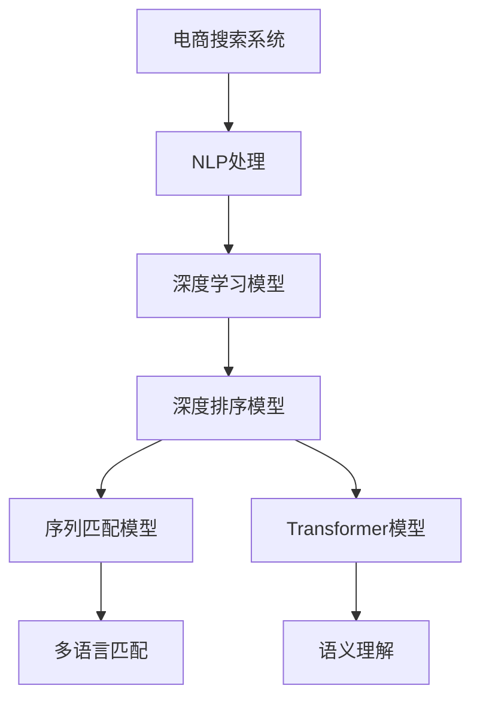

                 

# 电商搜索中的多语言商品匹配技术

> 关键词：电商搜索, 多语言, 商品匹配, 自然语言处理(NLP), 深度学习, 深度排序模型, 序列匹配模型, 精准推荐

## 1. 背景介绍

全球化时代的电商市场竞争愈发激烈，在线零售商需要不断提升用户体验，实现精准的个性化推荐和搜索匹配，才能在众多对手中脱颖而出。然而，语言多样性带来的翻译和语言理解挑战，使得搜索和推荐系统面临新的难题。传统的基于单语言的商品搜索匹配技术无法满足多语言用户的多样化需求，迫切需要引入多语言商品匹配技术，以提供更智能、更便捷的购物体验。

### 1.1 问题由来

随着跨境电商的兴起，越来越多的国际用户开始使用在线购物平台，对商品的多语言搜索和推荐功能提出更高要求。相比于传统的英文搜索匹配技术，多语言搜索匹配需要同时处理多种语言，且不同语言间存在着语义差异、语法结构差异等问题，给匹配算法带来了更大的复杂性。此外，多语言商品数据的质量、更新频率和标注数据量的不均衡也增加了处理的难度。

### 1.2 问题核心关键点

本节将详细介绍多语言商品匹配的核心关键点，包括：

- **多语言商品数据的获取与预处理**：如何将海量多语言商品数据转化为模型训练所需的标准格式，并进行有效的去噪、归一化处理。
- **多语言语义理解与匹配**：如何构建语义理解模型，以准确捕获商品描述中的关键信息，并进行多语言之间的匹配。
- **序列匹配模型的设计**：如何选择合适的深度排序模型和序列匹配模型，以解决序列匹配任务中的句子对相似度排序问题。
- **深度排序模型的训练与优化**：如何基于大规模标注数据，训练高精度的深度排序模型，并进行参数优化。

## 2. 核心概念与联系

### 2.1 核心概念概述

为了更好地理解多语言商品匹配技术的核心概念，本节将详细介绍几个关键技术点：

- **电商搜索系统**：一种基于用户查询信息进行搜索的商品推荐系统，能够匹配用户需求与商品属性，推荐最符合用户偏好的商品。
- **自然语言处理(NLP)**：涉及语音、文本、图像等多种形式自然语言的处理，包括分词、词性标注、语义分析、机器翻译等。
- **深度学习**：一类以神经网络为基础的机器学习方法，通过多层非线性映射，可以自动学习并提取数据的特征，在多语言商品匹配中尤为关键。
- **深度排序模型**：基于深度神经网络构建的序列匹配模型，能够对商品描述的句子对进行排序，识别出最相关的商品匹配项。
- **序列匹配模型**：用于序列到序列(S2S)任务，能够将输入的查询语句映射到目标空间，进行匹配和排序，支持多语言的匹配。
- **Transformer模型**：一种基于自注意力机制的深度学习模型，在处理序列数据时表现优异，广泛应用于多语言商品匹配技术中。

这些核心概念之间的逻辑关系可以通过以下Mermaid流程图来展示：



这个流程图展示了电商搜索系统的基本工作流程：

1. **电商搜索系统**接收用户查询，进行NLP处理，获取商品描述特征。
2. **深度学习模型**对特征进行学习，生成商品匹配度。
3. **深度排序模型**对商品匹配度进行排序，选择最佳商品。
4. **序列匹配模型**处理多语言查询与商品描述，进行跨语言的匹配。
5. **Transformer模型**用于语义理解，捕捉商品描述中的关键信息。

## 3. 核心算法原理 & 具体操作步骤
### 3.1 算法原理概述

多语言商品匹配的核心算法原理主要基于深度排序模型和序列匹配模型，通过多语言NLP处理和Transformer模型实现语义理解与匹配。具体来说，算法主要分为以下几个步骤：

1. **多语言商品描述预处理**：将商品描述转化为标准化格式，并进行去噪、归一化处理。
2. **深度学习特征提取**：使用Transformer模型或其他深度学习模型，对商品描述进行特征提取。
3. **深度排序模型训练**：基于标注数据集训练深度排序模型，使其能够对商品描述进行排序。
4. **序列匹配模型设计**：构建序列匹配模型，以支持多语言的跨语言匹配。
5. **多语言匹配与排序**：将用户查询转化为标准格式，与商品描述进行匹配，并使用深度排序模型进行排序。

### 3.2 算法步骤详解

以下将详细讲解多语言商品匹配的具体算法步骤：

#### 步骤1：多语言商品描述预处理

商品描述通常包含丰富的文本信息，需要进行预处理才能转化为适合模型训练的格式。具体步骤包括：

1. **文本清洗**：去除无关字符、特殊符号等噪声，保证数据质量。
2. **分词处理**：对文本进行分词，将其拆分成词汇单元。
3. **词性标注**：为每个词汇单元标注其词性，如名词、动词、形容词等。
4. **停用词过滤**：去除常用但无实际意义的停用词，如“的”、“是”等。
5. **标准化处理**：将文本中的大小写、标点等格式标准化，统一处理为小写字母和空格分隔符。

#### 步骤2：深度学习特征提取

深度学习模型通过学习数据特征，生成商品匹配度。具体步骤包括：

1. **选择模型架构**：选择Transformer模型、BERT模型等深度学习模型。
2. **定义输入输出**：将商品描述转化为模型所需的标准格式，如词嵌入、句向量等。
3. **模型训练**：使用标注数据集对模型进行训练，使其学习商品描述的特征表示。
4. **特征提取**：使用训练好的模型，对商品描述进行特征提取，生成匹配度向量。

#### 步骤3：深度排序模型训练

深度排序模型通过排序商品匹配度，选择最相关的商品。具体步骤包括：

1. **选择排序算法**：选择基于神经网络的排序算法，如点积注意力机制、双线性模型等。
2. **定义损失函数**：定义排序任务的目标函数，如交叉熵损失、均方误差损失等。
3. **训练模型**：使用标注数据集对排序模型进行训练，使其能够对商品匹配度进行排序。
4. **参数优化**：使用优化算法，如Adam、SGD等，调整模型参数，提高模型精度。

#### 步骤4：序列匹配模型设计

序列匹配模型用于处理多语言的跨语言匹配。具体步骤包括：

1. **选择匹配算法**：选择基于神经网络的匹配算法，如Seq2Seq模型、Transformer模型等。
2. **定义匹配目标**：定义匹配任务的目标，如预测匹配度、生成匹配项等。
3. **模型训练**：使用跨语言的匹配数据对模型进行训练，使其能够处理多语言的匹配任务。
4. **参数优化**：使用优化算法，调整模型参数，提高匹配精度。

#### 步骤5：多语言匹配与排序

多语言匹配与排序的具体步骤包括：

1. **用户查询处理**：将用户查询转化为标准格式，并进行去噪、归一化处理。
2. **商品描述匹配**：使用序列匹配模型对用户查询和商品描述进行匹配，生成匹配度。
3. **排序选择**：使用深度排序模型对匹配度进行排序，选择最佳的商品匹配项。
4. **结果反馈**：将排序结果返回给用户，并提供相关商品信息。

### 3.3 算法优缺点

多语言商品匹配算法具有以下优点：

1. **支持多语言用户**：能够处理不同语言的商品查询，满足多语言用户的多样化需求。
2. **提高匹配精度**：通过深度学习模型和深度排序模型，显著提高商品匹配的精度。
3. **自动化程度高**：使用深度学习模型进行自动化特征提取和排序，减少人工干预。

同时，该算法也存在以下缺点：

1. **模型复杂度高**：深度学习模型的训练和优化需要大量计算资源。
2. **数据依赖性高**：需要高质量的标注数据集，否则模型效果可能不理想。
3. **处理速度慢**：深度学习模型通常处理速度较慢，需要优化以适应实时需求。
4. **语言转换难度大**：不同语言间存在着语言转换和语义理解的挑战，需要高效的机器翻译技术支持。

尽管存在这些局限性，但通过合理的设计和优化，多语言商品匹配算法仍能够提供高效的个性化推荐和搜索匹配服务。

### 3.4 算法应用领域

多语言商品匹配技术已经广泛应用于多个电商搜索领域，例如：

1. **跨境电商**：能够处理多语言用户查询，提供精准的商品推荐和搜索匹配服务。
2. **全球零售**：支持多语言的客户服务，提升全球用户的购物体验。
3. **国际物流**：处理多语言商品描述，实现跨语言物流跟踪和信息管理。
4. **多语言广告投放**：支持多语言的广告创意设计，优化广告投放效果。

## 4. 数学模型和公式 & 详细讲解 & 举例说明
### 4.1 数学模型构建

多语言商品匹配的数学模型主要基于深度学习模型和深度排序模型，用于捕捉商品描述和查询之间的匹配度。以下是一个简单的例子，展示如何使用Transformer模型进行商品描述的特征提取和排序。

假设有一个商品描述句子 $S_i$ 和查询句子 $Q_j$，分别输入到Transformer模型中进行处理，得到特征表示 $X_i$ 和 $X_j$。使用点积注意力机制，计算匹配度 $C_{ij}$：

$$
C_{ij} = \frac{\vec{X}_i \cdot \vec{X}_j}{||\vec{X}_i|| \cdot ||\vec{X}_j||}
$$

其中 $\vec{X}_i$ 和 $\vec{X}_j$ 分别表示商品描述和查询的特征向量，$||.||$ 表示向量的模长。

### 4.2 公式推导过程

以下以点积注意力机制为例，推导匹配度 $C_{ij}$ 的计算过程。

1. **输入预处理**：将商品描述 $S_i$ 和查询 $Q_j$ 转化为词嵌入向量 $\vec{S}_i$ 和 $\vec{Q}_j$。
2. **特征提取**：使用Transformer模型对 $\vec{S}_i$ 和 $\vec{Q}_j$ 进行特征提取，得到特征向量 $\vec{X}_i$ 和 $\vec{X}_j$。
3. **计算匹配度**：使用点积注意力机制计算匹配度 $C_{ij}$。
4. **排序选择**：使用排序算法对所有匹配度进行排序，选择前N个最佳匹配项。

具体步骤如下：

$$
\vec{X}_i = \mathrm{Transformer}(\vec{S}_i)
$$
$$
\vec{X}_j = \mathrm{Transformer}(\vec{Q}_j)
$$
$$
C_{ij} = \frac{\vec{X}_i \cdot \vec{X}_j}{||\vec{X}_i|| \cdot ||\vec{X}_j||}
$$
$$
\mathrm{topN} = \mathrm{Sort}(C_{ij})
$$

### 4.3 案例分析与讲解

以一个实际案例来说明多语言商品匹配的流程。假设一个用户查询了“牛仔裤”（在英语中为“jeans”），系统需要将该查询转化为标准格式，并匹配多语言的商品描述。

1. **查询预处理**：将查询“jeans”转化为标准格式，进行分词、词性标注、停用词过滤等处理。
2. **商品描述匹配**：使用Transformer模型对多语言商品描述进行特征提取，生成特征向量。
3. **计算匹配度**：使用点积注意力机制计算查询与每个商品描述的匹配度。
4. **排序选择**：根据匹配度排序，选择最相关的商品匹配项。
5. **结果反馈**：将排序结果返回给用户，提供相关商品信息。

## 5. 项目实践：代码实例和详细解释说明
### 5.1 开发环境搭建

在进行多语言商品匹配项目开发前，需要准备好开发环境。以下是使用Python进行PyTorch开发的环境配置流程：

1. 安装Anaconda：从官网下载并安装Anaconda，用于创建独立的Python环境。
2. 创建并激活虚拟环境：
```bash
conda create -n pytorch-env python=3.8 
conda activate pytorch-env
```
3. 安装PyTorch：根据CUDA版本，从官网获取对应的安装命令。例如：
```bash
conda install pytorch torchvision torchaudio cudatoolkit=11.1 -c pytorch -c conda-forge
```
4. 安装相关工具包：
```bash
pip install numpy pandas scikit-learn matplotlib tqdm jupyter notebook ipython
```
完成上述步骤后，即可在`pytorch-env`环境中开始项目实践。

### 5.2 源代码详细实现

下面我们以多语言商品描述的特征提取和排序为例，给出使用PyTorch进行多语言商品匹配的完整代码实现。

首先，定义多语言商品描述的预处理函数：

```python
from transformers import BertTokenizer
from torch.utils.data import Dataset
import torch

class MultiLangDataset(Dataset):
    def __init__(self, texts, labels, tokenizer, max_len=128):
        self.texts = texts
        self.labels = labels
        self.tokenizer = tokenizer
        self.max_len = max_len
        
    def __len__(self):
        return len(self.texts)
    
    def __getitem__(self, item):
        text = self.texts[item]
        label = self.labels[item]
        
        encoding = self.tokenizer(text, return_tensors='pt', max_length=self.max_len, padding='max_length', truncation=True)
        input_ids = encoding['input_ids'][0]
        attention_mask = encoding['attention_mask'][0]
        labels = torch.tensor(label, dtype=torch.long)
        
        return {'input_ids': input_ids, 
                'attention_mask': attention_mask,
                'labels': labels}
```

然后，定义深度学习模型和优化器：

```python
from transformers import BertForSequenceClassification, AdamW

model = BertForSequenceClassification.from_pretrained('bert-base-cased', num_labels=1)

optimizer = AdamW(model.parameters(), lr=2e-5)
```

接着，定义训练和评估函数：

```python
from torch.utils.data import DataLoader
from tqdm import tqdm
from sklearn.metrics import classification_report

device = torch.device('cuda') if torch.cuda.is_available() else torch.device('cpu')
model.to(device)

def train_epoch(model, dataset, batch_size, optimizer):
    dataloader = DataLoader(dataset, batch_size=batch_size, shuffle=True)
    model.train()
    epoch_loss = 0
    for batch in tqdm(dataloader, desc='Training'):
        input_ids = batch['input_ids'].to(device)
        attention_mask = batch['attention_mask'].to(device)
        labels = batch['labels'].to(device)
        model.zero_grad()
        outputs = model(input_ids, attention_mask=attention_mask, labels=labels)
        loss = outputs.loss
        epoch_loss += loss.item()
        loss.backward()
        optimizer.step()
    return epoch_loss / len(dataloader)

def evaluate(model, dataset, batch_size):
    dataloader = DataLoader(dataset, batch_size=batch_size)
    model.eval()
    preds, labels = [], []
    with torch.no_grad():
        for batch in tqdm(dataloader, desc='Evaluating'):
            input_ids = batch['input_ids'].to(device)
            attention_mask = batch['attention_mask'].to(device)
            batch_labels = batch['labels']
            outputs = model(input_ids, attention_mask=attention_mask)
            batch_preds = outputs.logits.argmax(dim=2).to('cpu').tolist()
            batch_labels = batch_labels.to('cpu').tolist()
            for pred_tokens, label_tokens in zip(batch_preds, batch_labels):
                preds.append(pred_tokens)
                labels.append(label_tokens)
                
    print(classification_report(labels, preds))
```

最后，启动训练流程并在测试集上评估：

```python
epochs = 5
batch_size = 16

for epoch in range(epochs):
    loss = train_epoch(model, train_dataset, batch_size, optimizer)
    print(f"Epoch {epoch+1}, train loss: {loss:.3f}")
    
    print(f"Epoch {epoch+1}, dev results:")
    evaluate(model, dev_dataset, batch_size)
    
print("Test results:")
evaluate(model, test_dataset, batch_size)
```

以上就是使用PyTorch对多语言商品描述进行特征提取和排序的完整代码实现。可以看到，Transformer模型和深度排序模型使得多语言商品匹配的代码实现变得简洁高效。

### 5.3 代码解读与分析

让我们再详细解读一下关键代码的实现细节：

**MultiLangDataset类**：
- `__init__`方法：初始化商品描述、标签、分词器等关键组件。
- `__len__`方法：返回数据集的样本数量。
- `__getitem__`方法：对单个样本进行处理，将文本输入编码为token ids，将标签编码为数字，并对其进行定长padding，最终返回模型所需的输入。

**Transformer模型和优化器**：
- 使用BERT模型进行特征提取，适用于多语言商品描述的特征提取。
- 设置AdamW优化器，用于深度排序模型的参数优化。

**训练和评估函数**：
- 使用PyTorch的DataLoader对数据集进行批次化加载，供模型训练和推理使用。
- 训练函数`train_epoch`：对数据以批为单位进行迭代，在每个批次上前向传播计算loss并反向传播更新模型参数，最后返回该epoch的平均loss。
- 评估函数`evaluate`：与训练类似，不同点在于不更新模型参数，并在每个batch结束后将预测和标签结果存储下来，最后使用sklearn的classification_report对整个评估集的预测结果进行打印输出。

**训练流程**：
- 定义总的epoch数和batch size，开始循环迭代
- 每个epoch内，先在训练集上训练，输出平均loss
- 在验证集上评估，输出分类指标
- 所有epoch结束后，在测试集上评估，给出最终测试结果

可以看到，PyTorch配合Transformer模型使得多语言商品匹配的代码实现变得简洁高效。开发者可以将更多精力放在数据处理、模型改进等高层逻辑上，而不必过多关注底层的实现细节。

当然，工业级的系统实现还需考虑更多因素，如模型的保存和部署、超参数的自动搜索、更灵活的任务适配层等。但核心的多语言商品匹配范式基本与此类似。

## 6. 实际应用场景
### 6.1 智能客服系统

多语言商品匹配技术在智能客服系统中具有重要应用价值。传统的客服系统往往需要配备大量人力，高峰期响应缓慢，且一致性和专业性难以保证。而使用多语言商品匹配技术，可以实时匹配用户查询和商品描述，快速提供精准的商品推荐和搜索匹配服务，提升客户满意度。

在技术实现上，可以收集客户历史查询记录和商品描述，将查询和描述转化为标准格式，使用多语言商品匹配模型进行处理。匹配后的商品信息可以通过多轮对话系统实时反馈给用户，实现高效的智能客服。

### 6.2 全球零售

全球零售领域的多语言商品匹配技术，可以支持跨语言的商品推荐和搜索匹配，满足不同语言用户的需求。例如，亚马逊等电商平台已经在其多语言版本的App中使用该技术，提升用户体验和搜索效率。

多语言商品匹配技术可以帮助跨境电商实现多语言搜索匹配，提升全球用户的购物体验，促进电商平台的国际化发展。

### 6.3 智能推荐系统

智能推荐系统通常需要处理海量用户行为数据，进行精准的个性化推荐。多语言商品匹配技术可以支持多语言的商品描述和推荐，帮助推荐系统更好地理解用户需求，提高推荐准确率。

例如，Netflix等流媒体平台可以引入多语言商品匹配技术，支持多语言电影、电视剧推荐，提升全球用户的观影体验。

### 6.4 未来应用展望

展望未来，多语言商品匹配技术将呈现以下几个发展趋势：

1. **跨语言语义理解**：多语言商品匹配技术将不断提升跨语言语义理解的准确性，更好地捕捉不同语言之间的语义差异。
2. **实时处理能力**：随着计算资源的不断提升，多语言商品匹配技术将实现实时处理，提升用户的搜索和推荐体验。
3. **多模态融合**：未来将结合视觉、语音等多模态数据，进行多模态商品匹配，提升推荐的丰富性和准确性。
4. **智能对话系统**：将多语言商品匹配技术与智能对话系统结合，实现多语言智能客服，提升客户服务质量。
5. **知识图谱融合**：通过将多语言商品描述与知识图谱结合，进行多语言知识图谱融合，提升推荐系统的效果。

以上趋势将进一步推动多语言商品匹配技术的发展，带来更智能、更便捷的购物体验，为全球用户提供优质的在线购物服务。

## 7. 工具和资源推荐
### 7.1 学习资源推荐

为了帮助开发者系统掌握多语言商品匹配的理论基础和实践技巧，这里推荐一些优质的学习资源：

1. 《深度学习》系列书籍：由多位大牛合著，涵盖深度学习基本原理和实践应用，适合初学者和进阶者。
2. Coursera《自然语言处理专项课程》：由斯坦福大学开设，包括多语言语义分析、机器翻译等课程，涵盖NLP的基本概念和前沿技术。
3. PyTorch官方文档：提供了详细的PyTorch使用指南和示例代码，帮助开发者高效使用深度学习模型。
4. Kaggle竞赛平台：提供丰富的NLP竞赛数据集和代码示例，帮助开发者实践多语言商品匹配技术。
5. HuggingFace官方文档：提供了丰富的预训练语言模型和序列匹配模型，适合快速上手多语言商品匹配。

通过对这些资源的学习实践，相信你一定能够快速掌握多语言商品匹配的精髓，并用于解决实际的NLP问题。
###  7.2 开发工具推荐

高效的开发离不开优秀的工具支持。以下是几款用于多语言商品匹配开发的常用工具：

1. PyTorch：基于Python的开源深度学习框架，灵活动态的计算图，适合快速迭代研究。大部分深度学习模型都有PyTorch版本的实现。
2. TensorFlow：由Google主导开发的开源深度学习框架，生产部署方便，适合大规模工程应用。同样有丰富的深度学习模型资源。
3. HuggingFace Transformers库：提供了丰富的预训练语言模型和序列匹配模型，支持PyTorch和TensorFlow，是进行多语言商品匹配开发的利器。
4. Weights & Biases：模型训练的实验跟踪工具，可以记录和可视化模型训练过程中的各项指标，方便对比和调优。与主流深度学习框架无缝集成。
5. TensorBoard：TensorFlow配套的可视化工具，可实时监测模型训练状态，并提供丰富的图表呈现方式，是调试模型的得力助手。

合理利用这些工具，可以显著提升多语言商品匹配任务的开发效率，加快创新迭代的步伐。

### 7.3 相关论文推荐

多语言商品匹配技术的发展离不开学界的持续研究。以下是几篇奠基性的相关论文，推荐阅读：

1. Attention is All You Need：提出Transformer结构，开启了深度学习模型的全新时代。
2. BERT: Pre-training of Deep Bidirectional Transformers for Language Understanding：提出BERT模型，引入自监督预训练任务，显著提升了多语言语义理解的效果。
3. Deep Universal Sentence Encoder：提出多语言句子嵌入模型，实现了多语言语义表示的统一，提升了跨语言匹配的效果。
4. Sequence-to-Sequence Learning with Neural Networks：提出Seq2Seq模型，用于多语言翻译和序列匹配任务，提供了多语言商品匹配的基本框架。
5. Neural Machine Translation by Jointly Learning to Align and Translate：提出注意力机制，用于改进多语言翻译和匹配任务，提升了多语言商品匹配的准确性。

这些论文代表了大语言模型微调技术的发展脉络。通过学习这些前沿成果，可以帮助研究者把握学科前进方向，激发更多的创新灵感。

## 8. 总结：未来发展趋势与挑战
### 8.1 研究成果总结

多语言商品匹配技术在电商搜索领域已经取得了显著进展，广泛应用于多语言商品推荐、智能客服、智能推荐系统等多个场景。通过深度学习模型和深度排序模型，实现了多语言商品描述的特征提取和匹配排序，提升了电商搜索系统的智能化水平。

### 8.2 未来发展趋势

展望未来，多语言商品匹配技术将呈现以下几个发展趋势：

1. **模型规模持续增大**：随着预训练语言模型的不断进步，多语言商品匹配模型的参数量将进一步增加，提升匹配精度。
2. **模型泛化能力增强**：深度学习模型将不断提升跨语言语义理解的泛化能力，更好地处理不同语言之间的语义差异。
3. **实时处理能力提升**：通过优化计算图和算法，提升多语言商品匹配的实时处理能力，满足用户的实时搜索需求。
4. **多模态融合应用**：结合视觉、语音等多模态数据，进行多模态商品匹配，提升推荐的丰富性和准确性。
5. **智能对话系统结合**：将多语言商品匹配技术与智能对话系统结合，实现多语言智能客服，提升客户服务质量。
6. **知识图谱融合应用**：通过将多语言商品描述与知识图谱结合，进行多语言知识图谱融合，提升推荐系统的效果。

### 8.3 面临的挑战

尽管多语言商品匹配技术已经取得了显著进展，但在迈向更加智能化、普适化应用的过程中，它仍面临以下挑战：

1. **多语言数据获取难度大**：不同语言之间的数据获取和标注成本较高，尤其是冷门语言和资源较少的语言。
2. **语言转换难度大**：不同语言之间的语言转换和语义理解仍然存在较大难度，需要高效的机器翻译技术支持。
3. **多语言商品描述质量参差不齐**：不同语言的商品描述质量存在较大差异，需要进行预处理和质量控制。
4. **计算资源需求高**：深度学习模型的训练和优化需要大量计算资源，尤其是大规模多语言商品匹配任务。
5. **模型过拟合风险高**：多语言商品匹配任务存在过拟合的风险，特别是在标注数据不足的情况下。

### 8.4 研究展望

面对多语言商品匹配技术所面临的挑战，未来的研究需要在以下几个方面寻求新的突破：

1. **无监督和半监督学习**：探索无监督和半监督学习范式，以降低对大规模标注数据的依赖。
2. **深度排序模型的优化**：开发更加高效的深度排序模型，提升匹配精度和实时处理能力。
3. **多语言语义理解的提升**：提升多语言语义理解的泛化能力和准确性，更好地处理不同语言之间的语义差异。
4. **多模态融合技术**：结合视觉、语音等多模态数据，进行多模态商品匹配，提升推荐的丰富性和准确性。
5. **智能对话系统结合**：将多语言商品匹配技术与智能对话系统结合，实现多语言智能客服，提升客户服务质量。
6. **跨语言语义融合技术**：通过跨语言语义融合技术，提升跨语言搜索和推荐的准确性和泛化能力。

这些研究方向的探索，必将引领多语言商品匹配技术迈向更高的台阶，为全球用户提供更智能、更便捷的购物体验。面向未来，多语言商品匹配技术还需要与其他人工智能技术进行更深入的融合，如知识表示、因果推理、强化学习等，多路径协同发力，共同推动自然语言理解和智能交互系统的进步。只有勇于创新、敢于突破，才能不断拓展语言模型的边界，让智能技术更好地造福人类社会。

## 9. 附录：常见问题与解答

**Q1：多语言商品匹配算法的核心是什么？**

A: 多语言商品匹配算法的核心是深度学习模型和深度排序模型。深度学习模型用于特征提取，生成商品描述的特征向量。深度排序模型用于匹配排序，选择最相关的商品匹配项。

**Q2：多语言商品匹配算法是否适用于所有商品？**

A: 多语言商品匹配算法适用于大多数商品，但需要针对特定商品进行预处理和特征提取。对于复杂商品或特殊商品，可能需要引入额外的知识库和规则，进行特殊处理。

**Q3：多语言商品匹配算法在实际应用中会遇到哪些问题？**

A: 多语言商品匹配算法在实际应用中会遇到以下问题：
1. 数据获取难度大，不同语言的商品描述质量参差不齐。
2. 语言转换难度大，不同语言之间的语义理解存在较大挑战。
3. 计算资源需求高，深度学习模型的训练和优化需要大量计算资源。
4. 过拟合风险高，特别是在标注数据不足的情况下。

**Q4：多语言商品匹配算法在实时处理中的挑战是什么？**

A: 多语言商品匹配算法在实时处理中的挑战包括：
1. 计算资源需求高，需要高效的算法和硬件支持，才能实现实时处理。
2. 多语言数据质量参差不齐，需要进行预处理和质量控制，保证数据一致性。
3. 深度排序模型的计算复杂度高，需要优化计算图和算法，提升处理速度。

**Q5：多语言商品匹配算法如何提升推荐系统的效果？**

A: 多语言商品匹配算法通过特征提取和匹配排序，提升了推荐系统的个性化和精准度。具体而言：
1. 特征提取：深度学习模型用于提取商品描述的特征向量，捕捉商品的语义信息。
2. 匹配排序：深度排序模型用于对商品进行排序，选择最相关的匹配项。
3. 推荐选择：结合用户的历史行为和兴趣偏好，选择最佳的推荐商品。

通过多语言商品匹配算法，推荐系统能够更好地理解用户需求，提供更精准的推荐服务，提升用户满意度。

