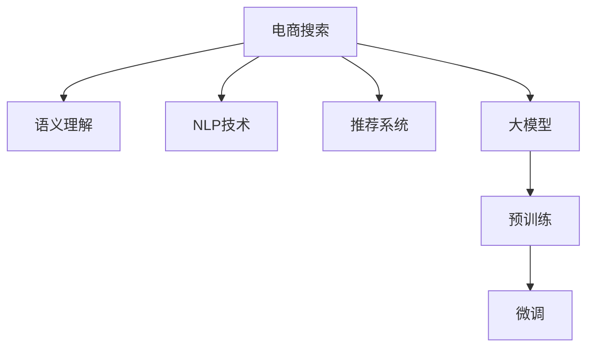

                 

# 电商搜索中的语义理解：AI大模型的优势

> 关键词：电商搜索,语义理解,人工智能,大模型,深度学习,自然语言处理,推荐系统,个性化搜索

## 1. 背景介绍

在数字化时代的今天，电商搜索已成为用户获取商品信息、进行购物决策的重要渠道。然而，传统的文本匹配搜索方式面临着语义理解不足、检索结果不相关、个性化推荐精度低等诸多挑战。因此，如何将大模型应用于电商搜索，实现精准的语义理解与个性化推荐，成为当前研究的重要课题。

### 1.1 问题由来
随着互联网用户的激增和数字化转型的加速，电商平台的数据量和用户行为模式也呈现出爆发式的增长。如何从海量的商品信息中，快速、准确地找到用户感兴趣的商品，并提供个性化推荐，成为了电商企业面临的重要挑战。

传统文本匹配搜索算法如TF-IDF、BM25等，虽然在关键词匹配上表现良好，但由于缺乏语义理解，无法处理自然语言的歧义和多义性，导致检索结果的相关性较低。而基于小规模数据训练的神经网络模型，由于知识积累有限，也难以适应不同用户的个性化需求。

与此同时，大模型通过大规模预训练，获得了丰富的语言知识，具备较强的语义理解能力。其在电商搜索领域的应用，可以有效提升搜索的精准度和个性化推荐的效果。

## 2. 核心概念与联系

### 2.1 核心概念概述

为更好地理解大模型在电商搜索中的应用，本节将介绍几个密切相关的核心概念：

- 电商搜索(e-Commerce Search)：指用户在电商平台通过搜索功能获取商品信息的过程。电商搜索不仅要匹配用户查询和商品标题，还要考虑到商品描述、用户行为等多维度的信息，以提供更精准的推荐。

- 语义理解(Semantic Understanding)：指模型能够理解自然语言输入的深层语义，超越单纯的关键字匹配，能够处理词义消歧、句法分析、实体识别等复杂任务。

- 自然语言处理(Natural Language Processing, NLP)：指计算机对自然语言进行处理、理解和生成的技术。大模型在NLP领域的突破，为电商搜索提供了强大的支持。

- 推荐系统(Recommendation System)：指根据用户的历史行为和偏好，推荐相关商品的系统。电商搜索中的个性化推荐，是大模型在电商领域的重要应用之一。

- 大模型(Large Model)：指通过大规模数据预训练得到的深度神经网络模型，具备强大的语义理解能力。常见的预训练模型包括BERT、GPT等。

这些核心概念之间的逻辑关系可以通过以下Mermaid流程图来展示：



这个流程图展示了电商搜索与相关技术的关系：

1. 电商搜索通过NLP技术和大模型，实现对自然语言输入的语义理解。
2. 大模型经过预训练和微调，具备强大的语义处理能力。
3. 推荐系统利用大模型输出的语义表示，进行商品推荐。
4. 通过不断积累用户行为数据，微调模型以提升推荐效果。

## 3. 核心算法原理 & 具体操作步骤

### 3.1 算法原理概述

大模型在电商搜索中的应用，主要基于以下算法原理：

1. **预训练与微调**：
   大模型通过大规模无标签数据进行预训练，获得丰富的语言知识。在电商搜索任务上，通过微调学习用户行为和商品特征的映射关系，实现精准的语义理解。

2. **多模态融合**：
   电商搜索不仅仅是文本匹配，还需考虑图像、语音等多模态信息。大模型可以整合多种模态信息，提升语义理解能力。

3. **实时推荐**：
   大模型能够实时处理用户输入，即时生成推荐结果，满足用户的实时查询需求。

4. **个性化定制**：
   通过大模型，可以根据用户的历史行为和偏好，提供个性化推荐，提升用户购物体验。

### 3.2 算法步骤详解

1. **数据准备**：
   收集电商平台的商品信息、用户行为数据、文本描述等数据，进行预处理和标注，构建电商搜索的训练集和测试集。

2. **大模型加载**：
   加载预训练的大模型，如BERT、GPT等，使用预训练权重作为初始化参数。

3. **任务适配层设计**：
   设计适应电商搜索任务的输出层，如分类层、回归层等。根据任务需求，选择合适的损失函数。

4. **微调参数设置**：
   设置微调的学习率、批大小、迭代次数等超参数，选择冻结部分预训练参数或全参数微调策略。

5. **模型训练**：
   使用电商搜索数据集，对模型进行有监督微调，优化模型参数以适应电商搜索任务的特定需求。

6. **测试与评估**：
   在测试集上评估微调后模型的性能，对比微调前后的检索精度和推荐效果，进行改进。

7. **部署与集成**：
   将微调后的模型部署到电商平台中，集成到推荐系统或搜索系统中，实现电商搜索与个性化推荐。

### 3.3 算法优缺点

基于大模型的电商搜索方法具有以下优点：

1. **语义理解能力强**：
   大模型通过大规模预训练，能够处理自然语言的歧义和多义性，提升检索的精准度。

2. **个性化推荐精度高**：
   通过学习用户行为，提供个性化的推荐结果，提升用户购物体验。

3. **实时响应快**：
   大模型能够实时处理用户查询，即时生成推荐结果，满足用户实时搜索需求。

4. **泛化能力强**：
   大模型通过迁移学习，具备较强的泛化能力，能够在不同的电商平台和商品类别上表现良好。

但同时，该方法也存在一些局限性：

1. **数据依赖性强**：
   电商搜索的效果依赖于数据的质量和多样性，需要大量标注数据和多样化的商品信息。

2. **模型复杂度高**：
   大模型参数量巨大，需要高性能的硬件支持，部署和维护成本较高。

3. **安全性和隐私保护**：
   电商搜索涉及大量用户隐私数据，如何保护用户隐私，确保数据安全，是一大挑战。

4. **计算资源消耗大**：
   大模型的计算资源消耗大，尤其是在大规模数据集上进行微调时，需要高性能的计算设备。

5. **易受偏见影响**：
   大模型可能包含预训练数据中的偏见，导致推荐结果不公正。

## 4. 数学模型和公式 & 详细讲解 & 举例说明

### 4.1 数学模型构建

假设电商搜索任务是一个二分类任务，即判断用户查询与商品描述的匹配度。使用预训练的大模型作为特征提取器，将用户查询和商品描述转化为语义表示向量，记为$x$和$y$。设模型输出的预测结果为$z$，损失函数为二分类交叉熵损失。

### 4.2 公式推导过程

根据二分类交叉熵损失的定义，有：

$$
\mathcal{L} = -\frac{1}{N}\sum_{i=1}^N [y_i \log \sigma(z_i) + (1-y_i) \log (1-\sigma(z_i))]
$$

其中，$N$为样本数量，$\sigma(z)$为Sigmoid函数，将输出转化为概率值。

使用梯度下降等优化算法，计算参数$z$的梯度，更新模型参数。设学习率为$\eta$，则参数更新公式为：

$$
\theta \leftarrow \theta - \eta \nabla_{\theta} \mathcal{L}(\theta)
$$

其中，$\nabla_{\theta} \mathcal{L}(\theta)$为损失函数对模型参数的梯度，可通过反向传播算法高效计算。

### 4.3 案例分析与讲解

假设在电商平台上，用户输入查询“黑色皮包”，商品描述为“时尚真皮手提包”。大模型通过微调学习到用户对“皮包”的查询与商品描述的语义匹配度。模型的输出$z$经过Sigmoid函数转化为概率值$0.8$，表示用户查询与商品描述匹配度较高。损失函数$\mathcal{L}$计算后，根据梯度下降算法更新模型参数，进一步优化匹配度。

## 5. 项目实践：代码实例和详细解释说明

### 5.1 开发环境搭建

在进行电商搜索大模型微调项目实践前，首先需要准备开发环境。以下是使用Python进行PyTorch开发的环境配置流程：

1. 安装Anaconda：从官网下载并安装Anaconda，用于创建独立的Python环境。

2. 创建并激活虚拟环境：
```bash
conda create -n ecomm-search python=3.8 
conda activate ecomm-search
```

3. 安装PyTorch：根据CUDA版本，从官网获取对应的安装命令。例如：
```bash
conda install pytorch torchvision torchaudio cudatoolkit=11.1 -c pytorch -c conda-forge
```

4. 安装相关工具包：
```bash
pip install transformers numpy pandas scikit-learn matplotlib tqdm jupyter notebook ipython
```

完成上述步骤后，即可在`ecomm-search`环境中开始电商搜索大模型微调项目的开发。

### 5.2 源代码详细实现

以下是使用PyTorch实现电商搜索任务的大模型微调的完整代码示例。

```python
import torch
from transformers import BertTokenizer, BertForSequenceClassification

# 加载数据
train_dataset = ... # 电商搜索训练集
val_dataset = ... # 电商搜索验证集
test_dataset = ... # 电商搜索测试集

# 加载预训练模型和tokenizer
model_name = 'bert-base-cased'
tokenizer = BertTokenizer.from_pretrained(model_name)
model = BertForSequenceClassification.from_pretrained(model_name, num_labels=2)

# 数据处理
def encode(text, tokenizer, max_len=128):
    encoded = tokenizer.encode(text, truncation=True, max_length=max_len)
    return encoded

# 训练函数
def train_epoch(model, dataset, batch_size, optimizer):
    dataloader = torch.utils.data.DataLoader(dataset, batch_size=batch_size, shuffle=True)
    model.train()
    total_loss = 0
    for batch in dataloader:
        input_ids = batch['input_ids'].to(device)
        attention_mask = batch['attention_mask'].to(device)
        labels = batch['labels'].to(device)
        model.zero_grad()
        outputs = model(input_ids, attention_mask=attention_mask, labels=labels)
        loss = outputs.loss
        total_loss += loss.item()
        loss.backward()
        optimizer.step()
    return total_loss / len(dataloader)

# 评估函数
def evaluate(model, dataset, batch_size):
    dataloader = torch.utils.data.DataLoader(dataset, batch_size=batch_size)
    model.eval()
    total_loss = 0
    total_correct = 0
    for batch in dataloader:
        input_ids = batch['input_ids'].to(device)
        attention_mask = batch['attention_mask'].to(device)
        labels = batch['labels'].to(device)
        with torch.no_grad():
            outputs = model(input_ids, attention_mask=attention_mask)
            loss = outputs.loss
            predictions = outputs.predictions.argmax(dim=1)
            total_loss += loss.item()
            total_correct += (predictions == labels).sum().item()
    return total_loss / len(dataloader), total_correct / len(dataloader)

# 微调参数设置
device = torch.device('cuda') if torch.cuda.is_available() else torch.device('cpu')
model.to(device)

# 训练模型
epochs = 5
batch_size = 16
optimizer = torch.optim.Adam(model.parameters(), lr=2e-5)

for epoch in range(epochs):
    train_loss, train_correct = train_epoch(model, train_dataset, batch_size, optimizer)
    val_loss, val_correct = evaluate(model, val_dataset, batch_size)
    print(f"Epoch {epoch+1}, train loss: {train_loss:.3f}, train accuracy: {train_correct:.2f}, val loss: {val_loss:.3f}, val accuracy: {val_correct:.2f}")

# 测试模型
test_loss, test_correct = evaluate(model, test_dataset, batch_size)
print(f"Test loss: {test_loss:.3f}, test accuracy: {test_correct:.2f}")
```

### 5.3 代码解读与分析

让我们再详细解读一下关键代码的实现细节：

**数据处理函数**：
- `encode`函数：将电商搜索中的用户查询和商品描述转化为token ids，进行定长padding和truncation。

**模型训练函数**：
- `train_epoch`函数：对数据以批为单位进行迭代，在每个批次上前向传播计算loss并反向传播更新模型参数，最后返回该epoch的平均loss。

**评估函数**：
- `evaluate`函数：与训练类似，不同点在于不更新模型参数，并在每个batch结束后将预测和标签结果存储下来，最后使用损失函数和准确率对整个评估集的预测结果进行打印输出。

**模型训练流程**：
- 定义总的epoch数和batch size，开始循环迭代
- 每个epoch内，先在训练集上训练，输出平均loss和准确率
- 在验证集上评估，输出验证集的loss和准确率
- 所有epoch结束后，在测试集上评估，给出最终测试结果

可以看到，PyTorch配合Transformer库使得电商搜索大模型微调的代码实现变得简洁高效。开发者可以将更多精力放在数据处理、模型改进等高层逻辑上，而不必过多关注底层的实现细节。

## 6. 实际应用场景

### 6.1 智能客服

电商平台的智能客服系统可以与大模型结合，实现更高效的用户交互。用户在搜索或购物过程中遇到问题，可以通过智能客服进行实时解答。

智能客服系统通过收集用户历史对话数据，对预训练模型进行微调，使其能够自动理解用户意图，匹配最合适的答案模板进行回复。对于用户提出的新问题，还可以接入检索系统实时搜索相关内容，动态组织生成回答。如此构建的智能客服系统，能大幅提升客户咨询体验和问题解决效率。

### 6.2 个性化推荐

电商平台的推荐系统可以根据用户的浏览、购买行为，使用大模型进行实时推荐，提升用户购物体验。推荐系统通过用户的行为数据，学习商品特征与用户偏好的映射关系，生成推荐结果。

使用大模型进行推荐，可以通过学习用户行为的多维信息，提升推荐的精准度。推荐系统可以结合商品描述、用户评价等多模态信息，进行更全面的推荐。

### 6.3 商品搜索

电商搜索系统的核心在于快速准确地找到用户感兴趣的商品。通过大模型对用户查询进行语义理解，可以实现更精准的搜索结果。

搜索系统通过大模型的输出，匹配商品库中的相似描述，展示相关商品。用户可以通过搜索输入的关键词，快速找到所需商品，提升购物效率。

### 6.4 未来应用展望

随着大模型和微调技术的不断发展，电商搜索将呈现出更多新的应用场景，为电商企业带来更大的价值：

1. **个性化推荐的多维度融合**：
   推荐系统将结合用户行为、商品特征、多模态信息等多种维度，进行更全面的推荐。这不仅能提升推荐效果，还能增强用户对平台的粘性。

2. **实时搜索的动态更新**：
   大模型能够实时处理用户查询，动态更新搜索结果，提升用户的实时搜索体验。

3. **跨平台的用户数据整合**：
   大模型可以实现跨平台的用户数据整合，提供一致的用户体验。用户在不同平台上的行为数据可以整合到同一个模型中进行分析，提升推荐效果。

4. **多语言支持**：
   大模型可以支持多语言搜索，帮助电商企业拓展国际市场。电商平台可以根据不同语言的搜索数据，微调多语言大模型，提供更精准的搜索结果。

5. **用户行为预测**：
   通过大模型对用户行为进行预测，电商平台可以提前准备库存，优化物流和供应链管理。

6. **商品信息抽取**：
   电商搜索系统可以利用大模型的语义理解能力，自动抽取商品信息，提升商品描述的准确性和一致性。

## 7. 工具和资源推荐

### 7.1 学习资源推荐

为了帮助开发者系统掌握电商搜索领域的大模型微调理论基础和实践技巧，这里推荐一些优质的学习资源：

1. 《Transformers from Principles to Practice》系列博文：由大模型技术专家撰写，深入浅出地介绍了Transformer原理、BERT模型、电商搜索中的微调技术等前沿话题。

2. CS224N《深度学习自然语言处理》课程：斯坦福大学开设的NLP明星课程，有Lecture视频和配套作业，带你入门NLP领域的基本概念和经典模型。

3. 《Natural Language Processing with Transformers》书籍：Transformers库的作者所著，全面介绍了如何使用Transformers库进行电商搜索任务开发，包括微调在内的诸多范式。

4. HuggingFace官方文档：Transformers库的官方文档，提供了海量预训练模型和完整的电商搜索任务样例代码，是上手实践的必备资料。

5. CLUE开源项目：中文语言理解测评基准，涵盖大量不同类型的中文电商搜索数据集，并提供了基于微调的baseline模型，助力中文电商搜索技术发展。

通过对这些资源的学习实践，相信你一定能够快速掌握电商搜索中大模型微调的精髓，并用于解决实际的电商搜索问题。

### 7.2 开发工具推荐

高效的开发离不开优秀的工具支持。以下是几款用于电商搜索大模型微调开发的常用工具：

1. PyTorch：基于Python的开源深度学习框架，灵活动态的计算图，适合快速迭代研究。大部分预训练语言模型都有PyTorch版本的实现。

2. TensorFlow：由Google主导开发的开源深度学习框架，生产部署方便，适合大规模工程应用。同样有丰富的预训练语言模型资源。

3. Transformers库：HuggingFace开发的NLP工具库，集成了众多SOTA语言模型，支持PyTorch和TensorFlow，是进行电商搜索任务开发的利器。

4. Weights & Biases：模型训练的实验跟踪工具，可以记录和可视化模型训练过程中的各项指标，方便对比和调优。与主流深度学习框架无缝集成。

5. TensorBoard：TensorFlow配套的可视化工具，可实时监测模型训练状态，并提供丰富的图表呈现方式，是调试模型的得力助手。

6. Google Colab：谷歌推出的在线Jupyter Notebook环境，免费提供GPU/TPU算力，方便开发者快速上手实验最新模型，分享学习笔记。

合理利用这些工具，可以显著提升电商搜索大模型微调任务的开发效率，加快创新迭代的步伐。

### 7.3 相关论文推荐

电商搜索领域的大模型微调技术发展迅速，以下是几篇奠基性的相关论文，推荐阅读：

1. Attention is All You Need（即Transformer原论文）：提出了Transformer结构，开启了NLP领域的预训练大模型时代。

2. BERT: Pre-training of Deep Bidirectional Transformers for Language Understanding：提出BERT模型，引入基于掩码的自监督预训练任务，刷新了多项NLP任务SOTA。

3. Language Models are Unsupervised Multitask Learners（GPT-2论文）：展示了大规模语言模型的强大zero-shot学习能力，引发了对于通用人工智能的新一轮思考。

4. Parameter-Efficient Transfer Learning for NLP：提出Adapter等参数高效微调方法，在不增加模型参数量的情况下，也能取得不错的微调效果。

5. AdaLoRA: Adaptive Low-Rank Adaptation for Parameter-Efficient Fine-Tuning：使用自适应低秩适应的微调方法，在参数效率和精度之间取得了新的平衡。

6. Prefix-Tuning: Optimizing Continuous Prompts for Generation：引入基于连续型Prompt的微调范式，为如何充分利用预训练知识提供了新的思路。

这些论文代表了大模型微调技术的发展脉络。通过学习这些前沿成果，可以帮助研究者把握学科前进方向，激发更多的创新灵感。

## 8. 总结：未来发展趋势与挑战

### 8.1 研究成果总结

本文对大模型在电商搜索中的应用进行了全面系统的介绍。首先阐述了电商搜索的背景和重要性，明确了大模型在提升电商搜索的语义理解和个性化推荐方面的独特价值。其次，从原理到实践，详细讲解了大模型在电商搜索任务中的微调方法，给出了电商搜索任务的完整代码实例。同时，本文还广泛探讨了大模型在智能客服、个性化推荐等多个电商领域的应用前景，展示了大模型在电商搜索领域的强大潜力。最后，本文精选了电商搜索领域的学习资源和开发工具，力求为读者提供全方位的技术指引。

通过本文的系统梳理，可以看到，大模型在电商搜索中的应用，不仅提升了搜索的精准度和个性化推荐的效果，还为电商平台带来了更高效的用户交互体验和更精准的商品推荐。未来，伴随大模型和微调方法的不断演进，电商搜索技术必将在更广阔的领域发挥更大的作用，为电商企业带来更大的价值。

### 8.2 未来发展趋势

展望未来，大模型在电商搜索领域的应用将呈现以下几个发展趋势：

1. **多模态融合**：
   电商搜索将整合多种模态信息，如图像、语音、位置等，提升语义理解能力。大模型可以通过跨模态学习，获取更丰富的商品信息，提升推荐效果。

2. **跨平台数据整合**：
   电商搜索系统可以整合跨平台的用户数据，提供一致的用户体验。大模型可以学习用户在不同平台上的行为数据，提升推荐效果。

3. **实时搜索与推荐**：
   电商搜索系统将结合实时推荐，提升用户的实时搜索体验。大模型可以实时处理用户查询，动态生成推荐结果。

4. **个性化推荐的多维度融合**：
   推荐系统将结合用户行为、商品特征、多模态信息等多种维度，进行更全面的推荐。这不仅能提升推荐效果，还能增强用户对平台的粘性。

5. **跨语言搜索**：
   大模型可以支持多语言搜索，帮助电商企业拓展国际市场。电商平台可以根据不同语言的搜索数据，微调多语言大模型，提供更精准的搜索结果。

6. **用户行为预测**：
   通过大模型对用户行为进行预测，电商平台可以提前准备库存，优化物流和供应链管理。

7. **商品信息抽取**：
   电商搜索系统可以利用大模型的语义理解能力，自动抽取商品信息，提升商品描述的准确性和一致性。

### 8.3 面临的挑战

尽管大模型在电商搜索中的应用已经取得了不错的效果，但在迈向更加智能化、普适化应用的过程中，仍面临诸多挑战：

1. **数据依赖性强**：
   电商搜索的效果依赖于数据的质量和多样性，需要大量标注数据和多样化的商品信息。如何获取高质量的数据，是电商搜索面临的一个重要问题。

2. **模型复杂度高**：
   大模型参数量巨大，需要高性能的硬件支持，部署和维护成本较高。如何降低模型复杂度，提高模型的可部署性，是一大挑战。

3. **安全性和隐私保护**：
   电商搜索涉及大量用户隐私数据，如何保护用户隐私，确保数据安全，是一大挑战。

4. **计算资源消耗大**：
   大模型的计算资源消耗大，尤其是在大规模数据集上进行微调时，需要高性能的计算设备。如何优化模型结构和算法，减少计算资源消耗，是未来需要解决的问题。

5. **易受偏见影响**：
   大模型可能包含预训练数据中的偏见，导致推荐结果不公正。如何减少模型的偏见，是一大挑战。

6. **实时性要求高**：
   电商搜索系统需要实时响应用户查询，提供实时的搜索结果。如何在保证精度的情况下，提升实时性，是一大挑战。

### 8.4 研究展望

面对电商搜索领域面临的挑战，未来的研究需要在以下几个方面寻求新的突破：

1. **无监督和半监督学习**：
   探索无监督和半监督学习范式，摆脱对大规模标注数据的依赖，充分利用非结构化数据，实现更加灵活高效的电商搜索。

2. **多模态学习**：
   研究跨模态学习技术，整合多种模态信息，提升语义理解能力。

3. **跨平台数据整合**：
   研究跨平台数据整合技术，提升电商搜索的跨平台用户体验。

4. **实时搜索优化**：
   研究实时搜索算法，提升电商搜索的实时响应速度。

5. **个性化推荐的多维度融合**：
   研究多维度融合技术，提升个性化推荐的效果。

6. **跨语言搜索**：
   研究跨语言搜索技术，提升电商搜索的国际化水平。

7. **用户行为预测**：
   研究用户行为预测模型，提升电商平台的管理效率。

8. **商品信息抽取**：
   研究商品信息抽取技术，提升电商搜索的商品描述准确性。

这些研究方向将引领大模型在电商搜索领域的不断进步，为电商平台带来更大的价值。

## 9. 附录：常见问题与解答

**Q1：电商搜索中的大模型微调与传统的TF-IDF算法有何区别？**

A: 大模型微调与传统的TF-IDF算法在电商搜索中的应用有本质的区别。

TF-IDF算法是一种基于统计的文本匹配算法，主要通过计算关键词的词频和逆文档频率，匹配用户查询和商品标题。其优点在于简单易用，计算量小，适合处理大规模文本数据。但缺点在于缺乏语义理解，无法处理自然语言的歧义和多义性，导致检索结果的相关性较低。

而大模型微调通过大规模预训练和微调，具备较强的语义理解能力，可以处理自然语言的歧义和多义性。通过学习用户行为和商品特征，可以生成更精准的搜索结果和推荐结果。

**Q2：电商搜索中的大模型微调是否需要大量标注数据？**

A: 电商搜索中的大模型微调对标注数据的需求相对较少。传统TF-IDF算法依赖关键词匹配，对标注数据的需求较高。而大模型通过预训练和微调，可以学习到语言知识和用户行为特征，从而提升检索和推荐的精度。尽管大模型微调需要较少的标注数据，但高质量的标注数据仍然能够显著提升微调效果。

**Q3：电商搜索中的大模型微调如何避免过拟合？**

A: 电商搜索中的大模型微调可以通过以下方法避免过拟合：

1. 数据增强：通过回译、近义替换等方式扩充训练集，避免模型对训练集过拟合。

2. 正则化：使用L2正则、Dropout、Early Stopping等方法，防止模型过度适应小规模训练集。

3. 对抗训练：加入对抗样本，提高模型鲁棒性，避免过拟合。

4. 参数高效微调：只调整少量参数，固定大部分预训练参数，减小过拟合风险。

5. 多模型集成：训练多个微调模型，取平均输出，抑制过拟合。

这些策略往往需要根据具体任务和数据特点进行灵活组合，以最大程度提升模型性能。

**Q4：电商搜索中的大模型微调如何提高推荐效果？**

A: 电商搜索中的大模型微调可以通过以下方法提高推荐效果：

1. 结合用户行为数据，学习商品特征与用户偏好的映射关系。

2. 整合多模态信息，提升语义理解能力。

3. 使用多维度融合技术，提升推荐效果的全面性。

4. 动态生成推荐结果，提升实时响应速度。

5. 实时处理用户查询，动态更新搜索结果。

6. 学习跨平台数据，提升跨平台用户体验。

7. 支持多语言搜索，提升国际化水平。

8. 预测用户行为，提前准备库存。

9. 抽取商品信息，提升商品描述准确性。

通过这些方法，大模型可以在电商搜索中提供更精准、全面的推荐结果，提升用户购物体验。

**Q5：电商搜索中的大模型微调如何处理大规模数据集？**

A: 电商搜索中的大模型微调在处理大规模数据集时，可以采用以下方法：

1. 分布式训练：使用多个计算节点，并行处理数据，提升训练速度。

2. 梯度累加：将多批次的梯度累加，减少每次更新的计算量，提升模型收敛速度。

3. 混合精度训练：使用低精度数据进行计算，减少计算资源消耗，提升训练速度。

4. 模型裁剪：去除不必要的层和参数，减小模型尺寸，加快推理速度。

5. 量化加速：将浮点模型转为定点模型，压缩存储空间，提高计算效率。

通过这些方法，可以优化大模型微调在处理大规模数据集时的性能和资源消耗。

---

作者：禅与计算机程序设计艺术 / Zen and the Art of Computer Programming

