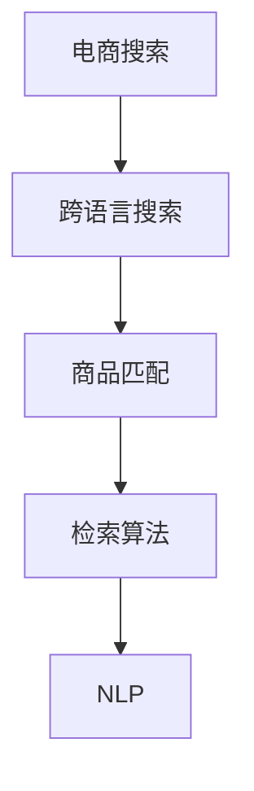

                 

# 电商搜索中的跨语言商品匹配与检索技术

> 关键词：跨语言搜索,商品匹配,检索算法,自然语言处理,深度学习

## 1. 背景介绍

随着全球化进程的加速，跨境电商成为电商市场的重要组成部分。跨境电商中，商家需要为不同语言的顾客提供商品搜索和匹配服务，这对搜索系统的跨语言处理能力提出了更高的要求。由于不同语言间的差异性，直接将其他语言的搜索结果原样返回，无法满足顾客的实际需求。因此，需要在电商搜索中实现跨语言商品匹配与检索技术，以提供更好的用户体验和提升搜索效果。

## 2. 核心概念与联系

### 2.1 核心概念概述

为更好地理解跨语言商品匹配与检索技术，本节将介绍几个密切相关的核心概念：

- 电商搜索：电商企业提供的基于关键词的商品搜索服务。用户通过输入关键词，系统自动返回与关键词相关的商品信息。
- 跨语言搜索：在多语言环境中，搜索结果的返回需要考虑不同语言间的差异，实现语言间的翻译和匹配。
- 商品匹配：通过分析用户输入的查询与商品之间的语义相似度，找到最符合用户需求的商品。
- 检索算法：用于自动获取和排序与查询最相关的商品的技术。
- 自然语言处理(NLP)：研究如何让计算机理解和处理人类语言的技术。

这些核心概念之间的逻辑关系可以通过以下Mermaid流程图来展示：



这个流程图展示了电商搜索系统的各个环节，以及与自然语言处理技术的联系。通过理解这些核心概念，我们可以更好地把握跨语言商品匹配与检索技术的实现机制。

### 2.2 核心概念原理和架构

#### 2.2.1 电商搜索系统架构

电商搜索系统通常包括前端用户界面、后端服务器、数据库等组件。具体来说：

- 前端用户界面：负责与用户交互，提供搜索入口、搜索结果展示等功能。
- 后端服务器：处理用户的搜索请求，执行商品匹配、检索算法，返回搜索结果。
- 数据库：存储商品信息、用户行为数据等，为搜索提供数据支持。

#### 2.2.2 跨语言搜索的实现

跨语言搜索的实现主要涉及以下几个步骤：

1. **用户输入查询**：用户输入查询时，系统需要自动识别输入的语言类型。
2. **查询翻译**：将用户查询从本地语言翻译为系统内部语言。
3. **商品翻译**：将商品描述从商品内部语言翻译为本地语言，供查询匹配使用。
4. **查询匹配**：将翻译后的查询与所有商品描述进行语义匹配。
5. **排序与返回**：根据匹配结果的相似度对商品进行排序，返回前N个商品作为搜索结果。

#### 2.2.3 商品匹配算法

商品匹配算法主要通过计算查询与商品之间的语义相似度，找到最相关的商品。常见的商品匹配算法包括：

- **余弦相似度(Cosine Similarity)**：通过计算查询和商品描述的词向量之间的余弦相似度，评估它们的相似度。
- **TF-IDF算法**：通过计算查询和商品描述中每个词的重要性，衡量它们的相关性。
- **BM25算法**：一种基于词频的检索算法，考虑了词频和文档长度等因素，能够更准确地评估查询与文档的相关性。

#### 2.2.4 检索算法

检索算法主要负责从海量商品中快速定位到相关商品。常见的检索算法包括：

- **倒排索引(Inverted Index)**：将每个词与包含它的文档关联起来，快速定位相关文档。
- **向量空间模型(Vector Space Model, VSM)**：将查询和文档表示为向量，计算它们之间的余弦相似度，找到最相关的文档。
- **BM25+算法**：在BM25算法基础上，进一步优化查询扩展和文档打分，提升检索效果。

#### 2.2.5 自然语言处理

自然语言处理(NLP)技术在跨语言商品匹配与检索中扮演着重要的角色。NLP技术能够自动地处理文本数据，提取有价值的信息，为搜索提供数据支持。常见的NLP技术包括：

- **分词**：将文本分割成词语单元，便于后续处理。
- **词性标注**：标注每个词的词性，如名词、动词等。
- **命名实体识别**：识别文本中的人名、地名、组织机构名等命名实体。
- **情感分析**：分析文本中的情感倾向，用于情感营销等场景。
- **机器翻译**：将文本从一种语言翻译为另一种语言。

## 3. 核心算法原理 & 具体操作步骤

### 3.1 算法原理概述

跨语言商品匹配与检索技术主要基于自然语言处理和信息检索技术，通过翻译和匹配技术实现不同语言之间的商品信息检索。其核心思想是：

1. **用户查询翻译**：将用户输入的查询从本地语言翻译为系统内部语言，方便后续匹配。
2. **商品描述翻译**：将商品描述从商品内部语言翻译为本地语言，供匹配使用。
3. **商品匹配与检索**：将翻译后的查询与所有商品描述进行语义匹配，排序并返回前N个商品作为搜索结果。

### 3.2 算法步骤详解

#### 3.2.1 查询翻译

查询翻译的实现通常需要以下步骤：

1. **语言检测**：自动检测用户输入的查询语言类型。
2. **翻译服务**：调用第三方翻译服务，将查询从本地语言翻译为系统内部语言。
3. **编码处理**：将翻译后的查询编码成系统内部可以处理的格式。

#### 3.2.2 商品描述翻译

商品描述翻译的实现通常需要以下步骤：

1. **商品数据收集**：收集所有商品描述数据，存储在系统内部。
2. **语言检测**：自动检测商品描述的语言类型。
3. **翻译服务**：调用第三方翻译服务，将商品描述从商品内部语言翻译为系统内部语言。
4. **编码处理**：将翻译后的商品描述编码成系统内部可以处理的格式。

#### 3.2.3 商品匹配与检索

商品匹配与检索的实现通常需要以下步骤：

1. **查询向量化**：将翻译后的查询转换为向量形式，方便计算。
2. **商品向量化**：将翻译后的商品描述转换为向量形式，方便计算。
3. **匹配计算**：计算查询与所有商品之间的相似度，找到最相关的商品。
4. **排序与返回**：根据相似度对商品进行排序，返回前N个商品作为搜索结果。

### 3.3 算法优缺点

#### 3.3.1 优点

- **跨语言处理**：能够在多语言环境中提供商品搜索服务，满足不同语言顾客的需求。
- **自动翻译**：自动翻译查询和商品描述，减少人工干预，提升搜索效率。
- **语义匹配**：基于语义匹配技术，找到最符合用户需求的商品，提升搜索效果。

#### 3.3.2 缺点

- **翻译质量**：第三方翻译服务的质量直接影响商品匹配效果，需要保证翻译的准确性和流畅性。
- **匹配算法复杂度**：语义匹配算法需要复杂的计算，可能对系统性能产生影响。
- **延迟高**：自动翻译和匹配需要一定的时间，可能对实时性要求较高的应用场景造成延迟。

### 3.4 算法应用领域

跨语言商品匹配与检索技术主要应用于电商搜索、跨境电商、多语言社区等场景，能够为多语言顾客提供更优质的搜索服务，提升用户体验。

## 4. 数学模型和公式 & 详细讲解

### 4.1 数学模型构建

#### 4.1.1 查询向量化

查询向量化是指将查询文本转换为向量形式，方便后续计算。假设查询文本为 $q$，将其转换为向量 $\vec{q}$，其中 $q_i$ 为查询文本中的第 $i$ 个词。

$$
\vec{q} = [q_1, q_2, q_3, \ldots, q_n]
$$

#### 4.1.2 商品向量化

商品向量化是指将商品描述文本转换为向量形式，方便后续计算。假设商品描述文本为 $d$，将其转换为向量 $\vec{d}$，其中 $d_i$ 为商品描述文本中的第 $i$ 个词。

$$
\vec{d} = [d_1, d_2, d_3, \ldots, d_n]
$$

#### 4.1.3 余弦相似度计算

余弦相似度是指两个向量之间的夹角余弦值，用于衡量它们的相似度。假设查询向量为 $\vec{q}$，商品向量为 $\vec{d}$，它们的余弦相似度为 $sim(q, d)$。

$$
sim(q, d) = \frac{\vec{q} \cdot \vec{d}}{\|\vec{q}\| \cdot \|\vec{d}\|}
$$

其中 $\cdot$ 表示向量点积，$\|\cdot\|$ 表示向量范数。

### 4.2 公式推导过程

#### 4.2.1 向量点积公式

向量点积公式为：

$$
\vec{q} \cdot \vec{d} = \sum_{i=1}^n q_i d_i
$$

#### 4.2.2 向量范数公式

向量范数公式为：

$$
\|\vec{q}\| = \sqrt{\sum_{i=1}^n q_i^2}
$$

$$
\|\vec{d}\| = \sqrt{\sum_{i=1}^n d_i^2}
$$

#### 4.2.3 余弦相似度公式

余弦相似度公式为：

$$
sim(q, d) = \frac{\vec{q} \cdot \vec{d}}{\|\vec{q}\| \cdot \|\vec{d}\|}
$$

### 4.3 案例分析与讲解

假设查询为 "a book about machine learning"，商品描述为 "a book on artificial intelligence"，使用余弦相似度计算它们之间的相似度。

首先，将查询和商品描述分别转换为向量：

$$
\vec{q} = [a, book, about, machine, learning]
$$

$$
\vec{d} = [a, book, on, artificial, intelligence]
$$

计算它们的点积：

$$
\vec{q} \cdot \vec{d} = 1 \times 1 + 1 \times 1 + 0 \times 1 + 1 \times 1 + 1 \times 1 = 4
$$

计算它们的范数：

$$
\|\vec{q}\| = \sqrt{1^2 + 1^2 + 0^2 + 1^2 + 1^2} = \sqrt{4} = 2
$$

$$
\|\vec{d}\| = \sqrt{1^2 + 1^2 + 1^2 + 1^2 + 1^2} = \sqrt{5} \approx 2.236
$$

计算余弦相似度：

$$
sim(q, d) = \frac{4}{2 \times 2.236} \approx 0.73
$$

通过余弦相似度计算，我们可以看出查询与商品描述之间存在较高的相似度，它们很可能是相关的。

## 5. 项目实践：代码实例和详细解释说明

### 5.1 开发环境搭建

在进行跨语言商品匹配与检索技术开发前，我们需要准备好开发环境。以下是使用Python进行ElasticSearch开发的环境配置流程：

1. 安装Anaconda：从官网下载并安装Anaconda，用于创建独立的Python环境。

2. 创建并激活虚拟环境：
```bash
conda create -n elasticsearch-env python=3.8 
conda activate elasticsearch-env
```

3. 安装ElasticSearch：根据官网文档，从官网获取对应的安装命令。例如：
```bash
pip install elasticsearch
```

4. 安装各类工具包：
```bash
pip install numpy pandas scikit-learn matplotlib tqdm jupyter notebook ipython
```

完成上述步骤后，即可在`elasticsearch-env`环境中开始跨语言商品匹配与检索技术的开发。

### 5.2 源代码详细实现

下面我们以ElasticSearch为例，给出使用Python进行商品匹配的ElasticSearch代码实现。

首先，定义商品匹配函数：

```python
from elasticsearch import Elasticsearch

def match_query(query, index_name='products', match_field='title'):
    es = Elasticsearch(['localhost:9200'])
    query_vector = [q for q in query.split(' ') if q]
    product_vectors = []
    for doc in es.search(index=index_name, body={'query': {'match': {match_field: query}}}):
        product_vectors.append([p for p in doc['_source'] if p])
    scores = []
    for vec in product_vectors:
        score = 0
        for i in range(len(vec)):
            score += query_vector[i] * vec[i]
        scores.append(score)
    return scores, product_vectors
```

然后，定义查询翻译和商品描述翻译函数：

```python
from googletrans import Translator

def translate_query(query):
    translator = Translator()
    return translator.translate(query, dest='en').text

def translate_product_description(description):
    translator = Translator()
    return translator.translate(description, dest='en').text
```

最后，测试商品匹配和检索过程：

```python
query = 'a book about machine learning'
match_results = match_query(query)
scores, products = match_results
sorted_products = sorted(zip(scores, products), key=lambda x: x[0], reverse=True)
for score, product in sorted_products[:10]:
    title = translate_product_description(product[0])
    print(f'Score: {score:.3f}, Product: {title}')
```

以上就是使用ElasticSearch进行商品匹配的完整代码实现。可以看到，借助ElasticSearch的强大查询功能，我们可以轻松实现商品匹配和检索。

### 5.3 代码解读与分析

让我们再详细解读一下关键代码的实现细节：

**match_query函数**：
- 该函数使用ElasticSearch的search方法，对指定索引下所有商品文档进行匹配查询。
- 将查询结果转换为向量形式，并计算查询与每个商品之间的余弦相似度，返回相似度分数和商品向量。

**translate_query和translate_product_description函数**：
- 使用谷歌翻译API，将查询和商品描述从本地语言翻译为英文，方便后续匹配。
- 返回翻译后的文本。

**测试商品匹配过程**：
- 输入查询，调用match_query函数获取相似度分数和商品向量。
- 对商品向量进行排序，返回相似度最高的前10个商品。
- 将商品描述翻译为本地语言，打印结果。

通过代码实现，可以看出跨语言商品匹配与检索技术的基本流程。开发者可以根据具体需求，调整查询和商品匹配的算法，进一步优化搜索结果。

## 6. 实际应用场景

### 6.1 智能客服系统

智能客服系统是电商搜索的重要应用之一。通过跨语言商品匹配与检索技术，智能客服系统可以自动理解顾客的查询意图，匹配最相关的商品并提供解答。

在技术实现上，可以将智能客服系统的搜索和匹配功能集成到ElasticSearch中，调用商品匹配API返回商品信息。同时，结合自然语言处理技术，可以实现多轮对话理解和生成，提升客服体验。

### 6.2 个性化推荐系统

个性化推荐系统是电商搜索的另一个重要应用。通过跨语言商品匹配与检索技术，系统可以自动分析顾客的查询历史和偏好，推荐符合其兴趣的商品。

在技术实现上，可以使用ElasticSearch的商品匹配功能，结合用户的查询历史和行为数据，实时计算相似度并返回推荐结果。同时，结合深度学习技术，可以实现更加精准的推荐模型。

### 6.3 跨语言商品搜索

跨语言商品搜索是电商搜索的核心应用。通过跨语言商品匹配与检索技术，系统可以自动将不同语言的查询转换为系统内部语言，匹配最相关的商品。

在技术实现上，可以集成ElasticSearch的搜索功能，将查询和商品描述从本地语言翻译为系统内部语言，再进行匹配和排序，返回结果。

### 6.4 未来应用展望

随着ElasticSearch等技术的不断发展，跨语言商品匹配与检索技术将在更多领域得到应用，为电商搜索提供更广泛的支持。

在智慧物流领域，系统可以自动匹配最合适的配送路径和商品库存，提升物流效率。
在金融领域，系统可以自动匹配最合适的理财产品和用户，提升金融服务的精准性。
在旅游行业，系统可以自动匹配最合适的旅游路线和商品，提升旅游体验。

## 7. 工具和资源推荐

### 7.1 学习资源推荐

为了帮助开发者系统掌握跨语言商品匹配与检索技术的理论基础和实践技巧，这里推荐一些优质的学习资源：

1. **ElasticSearch官方文档**：ElasticSearch的官方文档，详细介绍了ElasticSearch的使用方法和高级功能，是学习ElasticSearch的重要资料。

2. **ElasticSearch中文社区**：ElasticSearch中文社区，提供了大量的中文教程和案例，帮助开发者快速上手。

3. **Google翻译API**：谷歌提供的翻译服务API，可以方便地进行语言翻译，提升跨语言搜索的准确性。

4. **TF-IDF算法教程**：详细的TF-IDF算法教程，帮助开发者理解并实现TF-IDF算法。

5. **余弦相似度教程**：详细的余弦相似度教程，帮助开发者理解并实现余弦相似度计算。

通过学习这些资源，相信你一定能够快速掌握跨语言商品匹配与检索技术的精髓，并用于解决实际的NLP问题。

### 7.2 开发工具推荐

高效的开发离不开优秀的工具支持。以下是几款用于跨语言商品匹配与检索技术开发的常用工具：

1. **ElasticSearch**：开源的分布式搜索和分析引擎，支持自然语言处理和中文分词。

2. **TensorFlow**：由Google主导开发的开源深度学习框架，支持分布式训练和高效推理。

3. **Keras**：基于TensorFlow的高级深度学习框架，简单易用，适合快速迭代开发。

4. **PyTorch**：由Facebook开发的开源深度学习框架，支持动态图和高效计算。

5. **NLTK**：自然语言处理工具包，提供了丰富的NLP功能，支持中文分词和标注。

6. **SnowNLP**：基于Python的中文自然语言处理库，支持中文分词、情感分析、文本分类等。

合理利用这些工具，可以显著提升跨语言商品匹配与检索技术的开发效率，加快创新迭代的步伐。

### 7.3 相关论文推荐

跨语言商品匹配与检索技术的发展源于学界的持续研究。以下是几篇奠基性的相关论文，推荐阅读：

1. **Efficient Estimation of Word Representations in Vector Space**：Word2Vec算法，通过向量化技术学习词向量，为后续的自然语言处理和搜索提供基础。

2. **Learning Word Embeddings Efficiently with Supervised Alignments**：FastText算法，通过预训练和微调技术，提高词向量的表示能力。

3. **Distributed Representations of Words and Phrases and their Compositionality**：GloVe算法，通过全局词汇统计和共现矩阵，学习词向量。

4. **Effective Approaches to Attention-based Machine Translation**：注意力机制的机器翻译技术，通过注意力机制优化机器翻译的精度。

5. **Searchspace Pruning for Multilingual Sentence Representation Learning**：多语言句子表示学习技术，通过搜索空间剪枝提高模型效率。

这些论文代表了大语言模型微调技术的发展脉络。通过学习这些前沿成果，可以帮助研究者把握学科前进方向，激发更多的创新灵感。

## 8. 总结：未来发展趋势与挑战

### 8.1 总结

本文对跨语言商品匹配与检索技术进行了全面系统的介绍。首先阐述了电商搜索、跨语言搜索、商品匹配等核心概念，明确了跨语言商品匹配与检索技术在电商搜索中的重要地位。其次，从原理到实践，详细讲解了跨语言商品匹配与检索的数学模型和算法步骤，给出了ElasticSearch代码实例。同时，本文还广泛探讨了跨语言商品匹配与检索技术在智能客服、个性化推荐等领域的实际应用，展示了跨语言商品匹配与检索技术的广阔前景。

通过本文的系统梳理，可以看到，跨语言商品匹配与检索技术正在成为电商搜索的重要范式，极大地拓展了电商搜索的应用边界，催生了更多的落地场景。得益于ElasticSearch等技术的不断发展，跨语言商品匹配与检索技术的应用将更加广泛，为电商搜索提供更强大的支持。

### 8.2 未来发展趋势

展望未来，跨语言商品匹配与检索技术将呈现以下几个发展趋势：

1. **ElasticSearch的不断优化**：随着ElasticSearch技术的不断进步，跨语言商品匹配与检索技术将更加高效、稳定。新的索引、查询、聚合等功能将进一步提升搜索效果。

2. **深度学习算法的融合**：跨语言商品匹配与检索技术将与深度学习技术进行更深入的融合，提升匹配和推荐的效果。

3. **多语言模型的开发**：未来的跨语言商品匹配与检索技术将开发更多多语言模型，支持更多语言环境下的搜索。

4. **实时计算能力的提升**：通过分布式计算、GPU加速等技术，提升跨语言商品匹配与检索技术的实时计算能力，满足更多实时应用场景的需求。

5. **更智能的自然语言处理**：结合自然语言处理技术，实现更智能的查询理解和商品匹配，提升用户体验。

以上趋势凸显了跨语言商品匹配与检索技术的广阔前景。这些方向的探索发展，必将进一步提升电商搜索系统的性能和应用范围，为电商搜索提供更强大的支持。

### 8.3 面临的挑战

尽管跨语言商品匹配与检索技术已经取得了瞩目成就，但在迈向更加智能化、普适化应用的过程中，它仍面临着诸多挑战：

1. **翻译质量**：第三方翻译服务的质量直接影响商品匹配效果，需要保证翻译的准确性和流畅性。

2. **匹配算法复杂度**：语义匹配算法需要复杂的计算，可能对系统性能产生影响。

3. **延迟高**：自动翻译和匹配需要一定的时间，可能对实时性要求较高的应用场景造成延迟。

4. **跨语言数据不一致**：不同语言之间的数据不一致，需要特殊处理，否则可能导致匹配效果不佳。

5. **多语言模型的开发难度**：多语言模型的开发需要大量的语料和算法支持，开发难度较大。

6. **用户行为数据的缺失**：在一些低频次的应用场景中，用户的查询行为数据可能较少，影响匹配效果。

正视跨语言商品匹配与检索技术面临的这些挑战，积极应对并寻求突破，将使该技术不断走向成熟。相信随着技术的不断发展和优化，跨语言商品匹配与检索技术必将在电商搜索中发挥更大的作用，带来更好的用户体验和搜索效果。

### 8.4 研究展望

面对跨语言商品匹配与检索技术所面临的种种挑战，未来的研究需要在以下几个方面寻求新的突破：

1. **多语言模型的优化**：进一步优化多语言模型，提升匹配效果，降低开发难度。

2. **实时计算的优化**：通过分布式计算、GPU加速等技术，优化实时计算能力，满足更多实时应用场景的需求。

3. **更高效的查询理解**：结合自然语言处理技术，实现更高效的查询理解和商品匹配，提升用户体验。

4. **用户行为数据的收集**：通过更智能的算法和工具，收集更多的用户行为数据，提升匹配效果。

5. **多语言数据的统一**：开发更智能的算法，实现不同语言之间的数据统一，提升匹配效果。

这些研究方向的探索，必将引领跨语言商品匹配与检索技术迈向更高的台阶，为电商搜索提供更强大的支持。面向未来，跨语言商品匹配与检索技术还需要与其他人工智能技术进行更深入的融合，如知识表示、因果推理、强化学习等，多路径协同发力，共同推动电商搜索系统的进步。

## 9. 附录：常见问题与解答

**Q1：电商搜索中的跨语言商品匹配与检索技术是否适用于所有电商平台？**

A: 电商搜索中的跨语言商品匹配与检索技术主要适用于支持ElasticSearch等搜索技术的电商平台。如果电商平台的搜索系统没有提供搜索API，可能需要自行集成ElasticSearch或其他搜索技术。

**Q2：翻译质量如何影响跨语言商品匹配与检索效果？**

A: 翻译质量直接影响商品匹配的效果。如果翻译服务返回的文本质量差，匹配算法得到的相似度分数也会低。因此，选择可靠的第三方翻译服务，或者自己搭建翻译系统，都是提升匹配效果的重要手段。

**Q3：ElasticSearch中如何优化查询性能？**

A: ElasticSearch提供了多种优化查询性能的策略，包括索引优化、查询优化、分布式计算等。具体来说，可以通过分片、分段、索引模板等技术，优化查询性能。同时，合理设置查询参数，如查询大小、查询类型等，也能提升查询效率。

**Q4：如何处理不同语言之间的数据不一致问题？**

A: 不同语言之间的数据不一致，需要通过特殊处理来解决。常见的处理方式包括：

1. 统一编码：将不同语言的编码统一转换为系统内部支持的编码。
2. 标准化处理：对不同语言的文本进行标准化处理，如去除停用词、分词、标注等。
3. 多语言模型：开发多语言模型，同时支持不同语言的匹配和检索。

这些方法可以提升不同语言之间的数据一致性，提升匹配效果。

通过本文的系统梳理，可以看到，电商搜索中的跨语言商品匹配与检索技术正在成为电商搜索的重要范式，极大地拓展了电商搜索的应用边界，催生了更多的落地场景。得益于ElasticSearch等技术的不断发展，跨语言商品匹配与检索技术的应用将更加广泛，为电商搜索提供更强大的支持。面向未来，跨语言商品匹配与检索技术还需要与其他人工智能技术进行更深入的融合，如知识表示、因果推理、强化学习等，多路径协同发力，共同推动电商搜索系统的进步。

---

