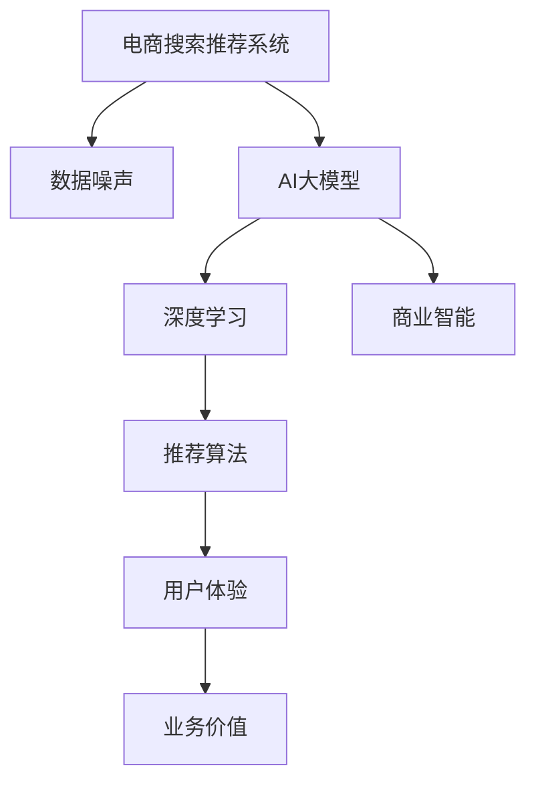

                 

# 电商搜索推荐中的AI大模型数据噪声处理技术应用调研报告与可行性分析

> 关键词：电商搜索推荐,大模型,数据噪声处理,人工智能,深度学习,商业智能,推荐系统,应用场景

## 1. 背景介绍

### 1.1 问题由来
在现代电子商务中，人工智能和大数据技术的应用已经成为推动商业智能发展的关键。然而，数据噪声问题在电商搜索推荐系统中尤为突出。大量噪杂的、无关的、甚至是恶意的数据会影响推荐系统的准确性和效率，降低用户满意度，甚至会导致严重的商业模式问题。

**电商搜索推荐系统（Recommender Systems）**是电商的核心组件，负责根据用户的浏览、购买历史和其他相关数据，实时推荐符合用户兴趣和需求的商品。这类系统通常基于**协同过滤、基于内容的推荐、混合推荐等算法**，以提升用户体验和增加销售额。然而，数据噪声的存在，使得这些推荐算法的效果大打折扣。数据噪声（Noise）通常指数据中的错误、冗余和不一致，例如虚假交易、恶意点击、用户误操作等。

### 1.2 问题核心关键点
- **数据质量与推荐系统性能**：数据噪声对推荐系统性能的影响，以及如何处理数据噪声，是决定电商搜索推荐系统成败的关键。
- **AI大模型与噪声过滤**：AI大模型如何帮助识别和过滤数据噪声，提升推荐系统的准确性和可信度。
- **算法与模型优化**：需要开发或引入针对数据噪声的优化算法，提升模型的鲁棒性。
- **用户体验与业务价值**：噪声处理对用户体验的影响，以及其对商业价值的潜在提升。

### 1.3 问题研究意义
高质量的数据是电商搜索推荐系统的基石。数据噪声的存在不仅会影响推荐系统的准确性，还可能带来商业风险，如虚假交易、用户流失等。因此，深入研究数据噪声处理技术，对电商行业具有重要意义：

- **提升用户体验**：去除数据噪声，确保推荐系统的精确度，提升用户满意度。
- **优化商业模式**：减少错误交易和欺诈，提高销售额和运营效率。
- **技术创新**：推动推荐系统的技术进步，支持更多个性化、高价值的推荐。
- **风险控制**：建立健全的电商数据治理体系，降低商业模式风险。

## 2. 核心概念与联系

### 2.1 核心概念概述

为更好地理解电商搜索推荐系统中的数据噪声处理技术，本节将介绍几个关键概念：

- **电商搜索推荐系统（Recommender Systems）**：利用用户行为数据，实时提供个性化推荐，提升用户体验和销售转化率的系统。
- **数据噪声（Data Noise）**：指数据集中存在的错误、冗余或不一致的信息，如虚假交易、无效操作等。
- **AI大模型（AI Large Models）**：通过大量数据预训练的大规模神经网络模型，如BERT、GPT等，能够处理复杂、高维的数据。
- **深度学习（Deep Learning）**：一种基于神经网络的机器学习技术，适用于大规模、高复杂度数据的建模和预测。
- **商业智能（Business Intelligence, BI）**：利用数据分析、数据挖掘和机器学习技术，提升企业决策效率和盈利能力。

这些概念之间的逻辑关系可以通过以下Mermaid流程图来展示：



这个流程图展示了这个领域核心概念之间的关联：

1. 电商搜索推荐系统通过深度学习算法，利用AI大模型处理数据。
2. 数据噪声对推荐系统的影响需要通过数据处理技术进行过滤和清洗。
3. AI大模型和深度学习技术提升推荐系统的精确度。
4. 商业智能利用推荐系统的输出，进行业务决策。
5. 用户体验和业务价值的提升，需要依赖推荐系统的优化。

## 3. 核心算法原理 & 具体操作步骤
### 3.1 算法原理概述

电商搜索推荐系统中的数据噪声处理技术，本质上是一种**预处理与后处理结合的混合方法**。其核心思想是通过对数据集进行**清洗、过滤和增强**，去除或减少数据中的噪声，从而提升推荐系统的性能和可靠性。

基于AI大模型的数据噪声处理技术可以分为两个步骤：

1. **预处理（Preprocessing）**：使用数据清洗和增强技术，改善数据质量，减少数据噪声。
2. **后处理（Postprocessing）**：利用AI大模型对推荐算法输出的结果进行修正和优化，进一步提升推荐效果。

### 3.2 算法步骤详解

以下是电商搜索推荐系统数据噪声处理技术的主要步骤：

**Step 1: 数据收集与清洗**
- **数据收集**：从电商平台收集用户的浏览、购买、评价等行为数据。
- **数据清洗**：对数据集进行去重、去噪和标准化处理，去除或减少数据中的异常值和噪声。

**Step 2: 数据增强与过滤**
- **数据增强**：对数据集进行扩充和合成，增加数据的多样性和完备性。例如，通过对抗样本生成技术，生成与真实数据相似但不同的样本。
- **数据过滤**：利用统计方法和AI大模型，对数据进行初步筛选和过滤，去除低价值或有害数据。

**Step 3: 特征选择与提取**
- **特征选择**：通过特征选择算法，提取与推荐目标相关性较高的特征。
- **特征提取**：利用深度学习模型，对原始数据进行高维表示，提取有意义的特征表示。

**Step 4: 噪声检测与识别**
- **噪声检测**：使用统计方法检测数据中的噪声，例如，基于密度的噪声检测算法。
- **噪声识别**：利用AI大模型，对异常数据进行识别，例如，通过异常检测算法，识别出异常行为模式。

**Step 5: 数据修正与校验**
- **数据修正**：对检测出的噪声数据进行修正或删除。
- **数据校验**：使用数据校验算法，确保修正后的数据质量，防止引入新的噪声。

**Step 6: 模型训练与优化**
- **模型训练**：使用优化后的数据集，训练推荐模型。
- **模型优化**：利用AI大模型和深度学习方法，对推荐模型进行优化和调参。

**Step 7: 结果评估与部署**
- **结果评估**：对推荐系统的效果进行评估，例如，通过A/B测试等方法。
- **部署上线**：将优化后的推荐系统部署到电商平台的实际业务场景中。

### 3.3 算法优缺点

基于AI大模型的电商搜索推荐系统中的数据噪声处理技术具有以下优点：

1. **高效性**：AI大模型能够处理大量复杂数据，提高数据处理的效率。
2. **鲁棒性**：AI大模型具有很强的泛化能力，能够识别和处理多种类型的数据噪声。
3. **适应性**：该方法可以根据具体业务场景，灵活调整数据处理策略。

同时，也存在一些缺点：

1. **计算资源需求高**：AI大模型需要大量计算资源进行训练和推理，成本较高。
2. **模型复杂度高**：深度学习模型复杂度较高，需要专业知识进行维护和优化。
3. **解释性差**：AI大模型的内部机制复杂，难以解释其决策过程。
4. **数据隐私风险**：处理大量用户数据时，存在数据隐私和安全问题。

### 3.4 算法应用领域

数据噪声处理技术在电商搜索推荐系统中有着广泛的应用场景，例如：

- **广告欺诈检测**：识别和过滤虚假广告点击行为，保护平台和广告主的利益。
- **用户行为分析**：去除恶意点击和误操作数据，确保用户行为数据的真实性。
- **商品质量控制**：检测虚假交易和低质量商品，提升商品推荐质量。
- **推荐系统优化**：利用AI大模型对推荐算法输出进行校验和修正，提升推荐效果。
- **数据治理与监控**：建立健全的数据治理体系，监控数据质量，保障业务安全。

## 4. 数学模型和公式 & 详细讲解
### 4.1 数学模型构建

基于AI大模型的电商搜索推荐系统中的数据噪声处理技术，通常可以建模为一个混合模型，其中包含数据预处理、数据增强、特征提取等多个子模块。

假设电商平台收集到用户行为数据 $D = \{(x_i, y_i)\}_{i=1}^N$，其中 $x_i$ 为特征向量，$y_i$ 为标签。数据噪声处理过程可以建模为以下形式：

$$
\hat{y} = f(D; \theta)
$$

其中 $f(\cdot)$ 表示数据处理函数，$\theta$ 为模型参数。数据处理过程包括以下几个步骤：

1. **数据清洗**：去除重复、异常数据，标准化处理。
2. **数据增强**：通过合成和扩充，增加数据多样性。
3. **特征选择**：选择与推荐目标相关性高的特征。
4. **特征提取**：使用深度学习模型，提取高维特征表示。

### 4.2 公式推导过程

以下以广告欺诈检测为例，推导基于AI大模型的数据噪声处理公式。

假设原始数据集 $D = \{(x_i, y_i)\}_{i=1}^N$，其中 $x_i$ 为广告点击日志，$y_i \in \{0, 1\}$ 表示广告是否真实点击。

**数据清洗**：去除重复、异常数据，标准化处理。设清洗后的数据集为 $D' = \{x_i', y_i'\}_{i=1}^N$，其中 $x_i'$ 为清洗后的特征向量，$y_i' \in \{0, 1\}$。

**数据增强**：通过对抗样本生成技术，生成与真实数据相似但不同的样本。设增强后的数据集为 $D'' = \{x_i'', y_i''\}_{i=1}^N$。

**特征选择**：选择与广告欺诈检测相关性高的特征。设选择后的特征向量为 $\bar{x}_i$。

**特征提取**：使用深度学习模型，对 $\bar{x}_i$ 进行高维表示，提取特征向量 $\hat{x}_i$。

**噪声检测与识别**：利用AI大模型，对 $\hat{x}_i$ 进行异常检测，识别出异常行为模式。设检测结果为 $\tilde{x}_i$。

**数据修正与校验**：对检测出的噪声数据进行修正或删除。设修正后的数据集为 $\hat{D} = \{\hat{x}_i, \hat{y}_i\}_{i=1}^N$。

**模型训练与优化**：使用优化后的数据集 $\hat{D}$，训练广告欺诈检测模型。

### 4.3 案例分析与讲解

**广告欺诈检测案例**：

1. **数据收集与清洗**：从电商平台收集广告点击日志，进行去重、去噪和标准化处理。

2. **数据增强**：通过对抗样本生成技术，生成与真实数据相似但不同的样本，增加数据多样性。

3. **特征选择**：选择与广告欺诈检测相关性高的特征，如点击时间、设备信息等。

4. **特征提取**：使用深度学习模型，对特征向量进行高维表示，提取特征表示。

5. **噪声检测与识别**：利用AI大模型，对高维特征向量进行异常检测，识别出异常行为模式。

6. **数据修正与校验**：对检测出的噪声数据进行修正或删除，确保数据质量。

7. **模型训练与优化**：使用优化后的数据集，训练广告欺诈检测模型，并进行调参优化。

## 5. 项目实践：代码实例和详细解释说明
### 5.1 开发环境搭建

在进行数据噪声处理技术实践前，我们需要准备好开发环境。以下是使用Python进行TensorFlow开发的环境配置流程：

1. 安装Anaconda：从官网下载并安装Anaconda，用于创建独立的Python环境。

2. 创建并激活虚拟环境：
```bash
conda create -n tf-env python=3.8 
conda activate tf-env
```

3. 安装TensorFlow：根据CUDA版本，从官网获取对应的安装命令。例如：
```bash
conda install tensorflow tensorflow-gpu -c conda-forge
```

4. 安装Keras和TensorBoard：
```bash
pip install keras tensorflow-addons tensorboard
```

5. 安装各类工具包：
```bash
pip install numpy pandas scikit-learn matplotlib tqdm jupyter notebook ipython
```

完成上述步骤后，即可在`tf-env`环境中开始数据噪声处理技术实践。

### 5.2 源代码详细实现

下面我们以广告欺诈检测为例，给出使用TensorFlow实现的数据噪声处理代码实现。

首先，定义广告欺诈检测的模型：

```python
from tensorflow.keras.layers import Input, Dense, Dropout, Dropout2D
from tensorflow.keras.models import Model
from tensorflow.keras.optimizers import Adam

def fraud_detection_model(input_dim):
    x = Input(shape=(input_dim,))
    x = Dropout(0.5)(x)
    x = Dense(128, activation='relu')(x)
    x = Dropout(0.5)(x)
    x = Dense(1, activation='sigmoid')(x)
    model = Model(inputs=x, outputs=x)
    model.compile(optimizer=Adam(learning_rate=0.001), loss='binary_crossentropy', metrics=['accuracy'])
    return model
```

然后，定义数据增强和噪声检测的代码：

```python
import tensorflow_addons as addons
import numpy as np

def data_augmentation(x):
    augmented_x = addons.data.Augmentation(
        transformation_funcs=[addons.data.TimeSeriesShift()],
        p=0.5
    )
    return augmented_x(x)

def anomaly_detection(x):
    with tf.GradientTape() as tape:
        tape.watch(x)
        y_pred = model.predict(x)
    loss = tf.reduce_mean(tf.square(y_pred - x))
    grads = tape.gradient(loss, x)
    anomaly_score = np.linalg.norm(grads)
    return anomaly_score
```

最后，启动训练流程并在测试集上评估：

```python
from tensorflow.keras.preprocessing import sequence
from tensorflow.keras.utils import to_categorical

# 加载数据集
train_data, test_data = load_data()

# 数据预处理
train_x, train_y = preprocess_data(train_data)
test_x, test_y = preprocess_data(test_data)

# 数据增强
train_augmented_x, train_y = data_augmentation(train_x), train_y

# 模型训练
model = fraud_detection_model(input_dim=100)
model.fit(train_augmented_x, train_y, epochs=10, batch_size=32, validation_data=(test_x, test_y))

# 模型评估
score = model.evaluate(test_x, test_y)
print(f'Test loss: {score[0]:.4f}, Test accuracy: {score[1]:.4f}')
```

以上就是使用TensorFlow对广告欺诈检测进行数据噪声处理实践的完整代码实现。可以看到，TensorFlow提供了丰富的工具和API，使得构建和训练深度学习模型变得相对容易。

### 5.3 代码解读与分析

让我们再详细解读一下关键代码的实现细节：

**广告欺诈检测模型定义**：
- 定义输入层、Dropout层、全连接层、输出层和模型，使用Adam优化器进行训练。

**数据增强**：
- 使用TensorFlow Addons库的数据增强模块，对输入数据进行随机平移等操作，增加数据的多样性。

**异常检测**：
- 利用梯度下降方法，计算输入数据的梯度，并求出梯度的大小作为异常检测的得分。

**训练与评估**：
- 使用Keras自带的预处理工具，将数据进行标准化处理。
- 使用data_augmentation函数进行数据增强。
- 训练广告欺诈检测模型，并在测试集上评估效果。

可以看到，TensorFlow和Keras等框架使得数据噪声处理技术的开发变得更加便捷和高效。开发者可以快速迭代模型，进行实验和优化。

## 6. 实际应用场景
### 6.1 智能客服系统

智能客服系统是电商搜索推荐系统的典型应用之一。智能客服系统通过自然语言处理技术，自动回答客户咨询，提升客户体验和满意度。然而，由于用户输入的不确定性和多样性，智能客服系统常常会遇到大量噪音数据，影响系统响应准确性。

基于数据噪声处理技术，可以构建更加鲁棒的智能客服系统。例如，通过异常检测算法，自动识别出恶意攻击和虚假用户输入，减少误操作和误报。通过数据清洗和增强，确保输入数据的真实性和完整性，提升系统处理效率和效果。

### 6.2 个性化推荐系统

个性化推荐系统利用用户历史行为数据，实时推荐符合用户兴趣的商品。然而，数据噪声的存在，会严重影响推荐系统的推荐效果和用户满意度。例如，恶意点击、虚假交易等行为会导致推荐算法错误推荐商品。

基于AI大模型的数据噪声处理技术，可以有效识别和过滤这些噪声数据。例如，通过深度学习模型，检测并移除恶意点击行为，确保推荐系统的精准度和可信度。同时，利用数据增强技术，生成更多真实样本，提升推荐系统的泛化能力。

### 6.3 实时竞价广告系统

实时竞价广告系统是电商平台的收入来源之一，利用用户点击行为进行广告投放和收益。然而，大量虚假点击和恶意点击行为，会影响广告投放效果和平台收益。

基于数据噪声处理技术，可以构建更加高效的实时竞价广告系统。例如，利用异常检测算法，实时识别和过滤虚假点击和恶意点击行为，确保广告投放的公平性和真实性。同时，通过数据增强技术，生成更多真实样本，提升广告投放的准确度和转化率。

### 6.4 未来应用展望

随着AI大模型和数据噪声处理技术的不断演进，未来将在更多领域得到应用，为电商搜索推荐系统带来新的突破：

- **医疗健康领域**：利用AI大模型对患者数据进行噪声处理，提升医疗诊断的准确性和可靠性。
- **金融服务领域**：通过数据噪声处理技术，提升金融交易的监控和风险控制能力。
- **智能家居领域**：利用数据噪声处理技术，提升智能家居设备的感知和响应准确性。
- **智能交通领域**：利用数据噪声处理技术，提升智能交通系统的安全性和可靠性。

## 7. 工具和资源推荐
### 7.1 学习资源推荐

为了帮助开发者系统掌握AI大模型数据噪声处理技术，这里推荐一些优质的学习资源：

1. **《深度学习入门》系列书籍**：由深度学习领域的专家撰写，深入浅出地介绍了深度学习的基本概念和实现方法。
2. **Coursera《深度学习专项课程》**：由斯坦福大学开设的深度学习系列课程，涵盖从基础到高级的内容，适合初学者和进阶者。
3. **Kaggle《深度学习竞赛》**：通过参与实际的数据竞赛，提高数据分析和模型优化的能力。
4. **TensorFlow官方文档**：TensorFlow的官方文档，提供了丰富的教程、API和示例，是学习和实践深度学习的重要资源。
5. **GitHub开源项目**：大量开源项目提供了丰富的数据噪声处理算法和代码实现，可以从中学习和借鉴。

通过对这些资源的学习实践，相信你一定能够快速掌握AI大模型数据噪声处理技术的精髓，并用于解决实际的电商搜索推荐系统问题。

### 7.2 开发工具推荐

高效的开发离不开优秀的工具支持。以下是几款用于AI大模型数据噪声处理开发的常用工具：

1. **TensorFlow**：由Google主导开发的深度学习框架，生产部署方便，适合大规模工程应用。
2. **Keras**：TensorFlow的高层API，提供了简洁易用的API，适合快速迭代研究。
3. **TensorBoard**：TensorFlow配套的可视化工具，可实时监测模型训练状态，并提供丰富的图表呈现方式。
4. **Jupyter Notebook**：交互式编程环境，支持代码运行、数据可视化、文档注释等功能。
5. **Scikit-learn**：机器学习库，提供了丰富的数据处理和分析工具。

合理利用这些工具，可以显著提升数据噪声处理技术的开发效率，加快创新迭代的步伐。

### 7.3 相关论文推荐

AI大模型和数据噪声处理技术的发展源于学界的持续研究。以下是几篇奠基性的相关论文，推荐阅读：

1. **《Google Scholar》的搜索算法**：谷歌的搜索算法利用深度学习和大数据技术，提升了搜索结果的相关性和准确性。
2. **《广告欺诈检测》论文**：讨论了广告欺诈检测的常用方法，并介绍了基于AI大模型的噪声处理技术。
3. **《智能客服系统》论文**：介绍了智能客服系统的设计与实现，并讨论了数据噪声处理技术的应用。
4. **《个性化推荐系统》论文**：探讨了个性化推荐系统的核心算法，并介绍了基于数据噪声处理技术的方法。
5. **《实时竞价广告系统》论文**：研究了实时竞价广告系统的算法和实现，并讨论了数据噪声处理技术的应用。

这些论文代表了大数据噪声处理技术的发展脉络。通过学习这些前沿成果，可以帮助研究者把握学科前进方向，激发更多的创新灵感。

## 8. 总结：未来发展趋势与挑战

### 8.1 总结

本文对基于AI大模型的电商搜索推荐系统中的数据噪声处理技术进行了全面系统的介绍。首先阐述了数据噪声对推荐系统性能的影响，明确了数据噪声处理技术的核心目标。其次，从原理到实践，详细讲解了数据噪声处理技术的数学模型和关键步骤，给出了数据噪声处理任务开发的完整代码实例。同时，本文还广泛探讨了数据噪声处理技术在电商搜索推荐系统中的应用场景，展示了其广泛的应用前景。最后，本文精选了数据噪声处理技术的各类学习资源，力求为读者提供全方位的技术指引。

通过本文的系统梳理，可以看到，基于AI大模型的电商搜索推荐系统中的数据噪声处理技术已经初具规模，并在多个实际应用场景中得到了成功应用。未来，伴随AI大模型和数据噪声处理技术的不断发展，电商搜索推荐系统的性能和可靠性将进一步提升，为电商行业带来更深远的变革。

### 8.2 未来发展趋势

展望未来，数据噪声处理技术在电商搜索推荐系统中将呈现以下几个发展趋势：

1. **自动化与智能化**：未来，基于AI大模型的数据噪声处理技术将更加自动化和智能化，能够自动识别和处理多种类型的数据噪声。
2. **实时性**：数据噪声处理技术将支持实时处理和在线学习，能够及时响应和更新数据噪声变化。
3. **多模态融合**：数据噪声处理技术将拓展到多模态数据，结合视觉、语音等模态信息，提升推荐系统的准确性和鲁棒性。
4. **可解释性**：未来，数据噪声处理技术将更加注重可解释性，能够提供对数据噪声处理过程的详细解释。
5. **跨领域应用**：数据噪声处理技术将跨越电商搜索推荐系统，应用于更多领域，如金融、医疗、智能家居等。

以上趋势凸显了数据噪声处理技术的广阔前景。这些方向的探索发展，必将进一步提升电商搜索推荐系统的性能和应用范围，为商业智能技术的发展注入新的动力。

### 8.3 面临的挑战

尽管基于AI大模型的电商搜索推荐系统中的数据噪声处理技术已经取得了显著成果，但在迈向更加智能化、普适化应用的过程中，它仍面临诸多挑战：

1. **数据隐私与安全**：处理大量用户数据时，存在数据隐私和安全问题。如何保护用户数据，确保数据处理过程的透明性，将是重要的研究方向。
2. **计算资源需求**：AI大模型需要大量计算资源进行训练和推理，成本较高。如何在保证处理效果的同时，降低计算资源消耗，将是重要的优化方向。
3. **模型复杂性**：深度学习模型复杂度较高，需要专业知识进行维护和优化。如何简化模型结构，降低开发门槛，将是重要的研究课题。
4. **数据分布偏差**：电商数据往往存在分布偏差，如何优化模型，减少偏差影响，提升数据处理效果，将是重要的研究方向。
5. **可解释性问题**：深度学习模型通常被视为“黑盒”，难以解释其决策过程。如何提升模型的可解释性，增强用户信任，将是重要的研究课题。

### 8.4 研究展望

面对数据噪声处理技术面临的挑战，未来的研究需要在以下几个方面寻求新的突破：

1. **数据隐私保护**：引入隐私保护技术，如差分隐私、联邦学习等，保护用户数据隐私。
2. **计算资源优化**：开发分布式计算和并行处理技术，降低计算资源消耗，提升数据处理效率。
3. **模型简化**：引入模型压缩和优化技术，简化模型结构，降低开发门槛。
4. **分布偏差校正**：利用数据重采样和迁移学习等技术，校正数据分布偏差，提升模型泛化能力。
5. **提升可解释性**：引入可解释性技术，如模型蒸馏、可视化等，提升模型的可解释性和用户信任度。

这些研究方向的探索，必将引领数据噪声处理技术的不断发展，为电商搜索推荐系统带来更广泛的应用和更强大的功能。

## 9. 附录：常见问题与解答

**Q1：数据噪声处理对电商搜索推荐系统的性能有何影响？**

A: 数据噪声对电商搜索推荐系统的性能影响很大。噪音数据会降低推荐算法的准确性和可信度，影响用户满意度，甚至导致商业损失。例如，虚假点击行为会导致广告费用浪费，恶意交易会导致虚假交易检测系统误判等。

**Q2：如何选择合适的学习率？**

A: 学习率的选择对数据噪声处理效果至关重要。通常建议从小学习率开始，逐步增大，直到模型收敛。例如，可以在第一轮训练中使用较小的学习率，后续逐渐增加。同时，根据具体任务和数据特点，调整学习率的大小。

**Q3：如何缓解数据噪声处理中的过拟合问题？**

A: 过拟合是数据噪声处理中的常见问题。常见的缓解策略包括：
1. 数据增强：通过生成对抗样本，增加数据多样性。
2. 正则化：使用L2正则、Dropout等方法，减少模型过拟合。
3. 早停机制：设置早停条件，防止模型过度拟合。
4. 模型简化：通过特征选择和模型简化，降低模型复杂度。

**Q4：电商搜索推荐系统中的数据噪声处理技术有哪些应用场景？**

A: 电商搜索推荐系统中的数据噪声处理技术，广泛应用于以下几个场景：
1. 广告欺诈检测：识别和过滤虚假广告点击行为。
2. 用户行为分析：去除恶意点击和误操作数据，确保用户行为数据的真实性。
3. 商品质量控制：检测虚假交易和低质量商品，提升商品推荐质量。
4. 推荐系统优化：利用数据噪声处理技术，提升推荐系统的准确性和鲁棒性。
5. 数据治理与监控：建立健全的数据治理体系，监控数据质量，保障业务安全。

---

作者：禅与计算机程序设计艺术 / Zen and the Art of Computer Programming

