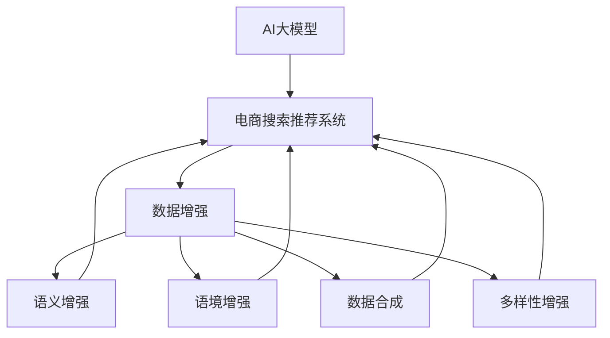

                 

# 电商搜索推荐中的AI大模型数据增强技术调研报告

> 关键词：电商搜索推荐, 人工智能, 大模型, 数据增强, 自然语言处理(NLP), 机器学习, 推荐系统, 用户体验, 深度学习, 深度增强学习, 自然语言处理(NLP), 模型优化, 超参数调优, 数据扩充

## 1. 背景介绍

### 1.1 问题由来

在现代电商环境中，客户搜索推荐系统扮演着至关重要的角色，直接影响了客户的购物体验和销售额。传统的推荐系统基于静态特征和规则，难以捕捉用户动态变化的需求和兴趣。而基于深度学习的推荐系统，通过学习用户的历史行为和上下文信息，能够提供更加个性化、动态化的推荐服务。然而，这类推荐系统对标注数据的需求较高，且对模型参数量和训练时间也有较高要求。

为应对这些问题，AI大模型数据增强技术应运而生。通过数据增强方法，能够在有限的标注数据下，进一步优化模型的性能，提升推荐的准确性和多样性，从而增强用户的搜索体验和满意度。

### 1.2 问题核心关键点

数据增强技术的核心在于通过对原始数据进行有策略的扩充，来增加训练数据的多样性和数量，减少模型对噪声数据的过拟合风险，提升模型泛化能力。对于电商搜索推荐系统而言，数据增强技术的应用主要包括以下几个关键点：

- **语义增强**：通过改变查询词的语义，增强模型对不同语义表达的同义词和近义词的理解能力。
- **语境增强**：在查询词中加入上下文信息，如商品类别、品牌、用户历史行为等，丰富模型的知识背景。
- **数据合成**：通过生成对抗网络(GANs)、文本重构等方法，合成新的训练样本，进一步丰富数据集。
- **多样性增强**：通过多样性采样方法，如负采样、噪声注入等，增加训练集的多样性和覆盖面。

这些关键点构成了电商搜索推荐中数据增强技术的应用框架，使得基于AI大模型的推荐系统能够更好地适应复杂多变的用户需求。

## 2. 核心概念与联系

### 2.1 核心概念概述

为更好地理解电商搜索推荐中的AI大模型数据增强技术，本节将介绍几个密切相关的核心概念：

- **AI大模型**：指以Transformer、BERT等架构为基础，大规模预训练的语言模型，具备强大的自然语言理解和生成能力。这类模型通常具有亿级的参数量，能够高效处理复杂的NLP任务。
- **电商搜索推荐系统**：通过分析用户的历史行为和上下文信息，结合AI大模型的语义和语境理解能力，提供个性化的商品推荐。
- **数据增强**：通过各种数据处理和合成技术，增加训练数据的规模和多样性，提高模型的泛化能力和鲁棒性。
- **推荐算法**：包括协同过滤、基于内容的推荐、混合推荐等算法，用于将用户模型与物品模型进行匹配，生成推荐结果。

这些核心概念之间的逻辑关系可以通过以下Mermaid流程图来展示：



这个流程图展示了大模型、推荐系统、数据增强以及相关关键技术之间的关系：

1. AI大模型提供基础的语言理解能力，作为推荐系统的核心组件。
2. 数据增强技术通过对原始数据的扩充和处理，提升模型的泛化能力。
3. 语义增强和语境增强分别通过改变查询词的语义和加入上下文信息，增强模型的理解能力。
4. 数据合成和多样性增强分别通过合成新数据和增加数据多样性，丰富训练集。
5. 最终，增强后的数据集被用于训练和优化推荐算法，生成推荐结果。

这些概念共同构成了电商搜索推荐中AI大模型数据增强技术的应用框架，使其能够在复杂多变的电商场景中提供高效的个性化推荐服务。

## 3. 核心算法原理 & 具体操作步骤
### 3.1 算法原理概述

AI大模型数据增强技术的基础原理，是通过数据处理和合成技术，增加训练数据的多样性和数量，提升模型泛化能力。其核心算法主要包括：

- **语义增强算法**：通过同义词、近义词替换等方法，改变查询词的语义，增强模型对不同表达的语义理解能力。
- **语境增强算法**：通过将查询词嵌入上下文信息，如商品类别、品牌、用户历史行为等，丰富模型的知识背景，提升推荐的精准度。
- **数据合成算法**：通过生成对抗网络(GANs)、文本重构等方法，合成新的训练样本，进一步丰富数据集。
- **多样性增强算法**：通过负采样、噪声注入等方法，增加训练集的多样性和覆盖面，避免模型对数据集的过拟合。

这些算法共同作用，能够在有限的标注数据下，通过数据增强提升模型的性能，增强推荐系统的效果。

### 3.2 算法步骤详解

基于AI大模型数据增强技术的具体操作步骤包括以下几个关键步骤：

**Step 1: 数据预处理**
- 收集电商搜索推荐相关的数据集，包括用户搜索记录、商品信息、用户行为等。
- 清洗数据集，去除噪声、缺失值和异常数据。

**Step 2: 语义增强**
- 对查询词进行同义词、近义词替换，丰富查询词的多样性。
- 使用外部词典或同义词工具，如NLTK、WordNet等，找到查询词的同义词和近义词。
- 将替换后的查询词作为新的训练样本，供模型学习。

**Step 3: 语境增强**
- 在查询词中加入上下文信息，如商品类别、品牌、用户历史行为等。
- 设计合适的上下文表示方式，如向量拼接、分类标签等。
- 将上下文信息与查询词合并，作为新的训练样本。

**Step 4: 数据合成**
- 使用生成对抗网络(GANs)，如CycleGAN、StarGAN等，生成新的训练样本。
- 通过文本重构技术，如BERT、T5等，对原始查询词进行重构，生成新的查询词。
- 将生成的新样本与原始样本混合，增加训练数据的多样性。

**Step 5: 多样性增强**
- 使用负采样方法，从训练集中随机抽取负样本，增加数据的多样性。
- 在训练样本中随机加入噪声，如随机插入单词、删除部分单词等。
- 采用多样性采样方法，如SMOTE、ADASYN等，生成新的训练样本。

**Step 6: 模型训练与评估**
- 将增强后的数据集划分为训练集、验证集和测试集。
- 选择合适的优化器和超参数，如Adam、SGD等，设置学习率、批大小、迭代轮数等。
- 使用增强后的数据集对模型进行训练，并在验证集上评估模型性能。
- 根据评估结果调整超参数，重新训练模型，直至模型性能达到最优。
- 在测试集上评估模型的泛化能力，对比增强前后的性能提升。

### 3.3 算法优缺点

AI大模型数据增强技术具有以下优点：
1. 数据增强能够增加训练数据的多样性和数量，提升模型泛化能力。
2. 增强后的模型能够更好地适应电商搜索推荐中的复杂语义和语境。
3. 能够通过数据合成和多样性增强，进一步丰富训练集，减少过拟合风险。

同时，该方法也存在一些局限性：
1. 数据增强的策略设计较为复杂，需要结合具体任务进行优化。
2. 生成对抗网络和文本重构等技术，需要较高的计算资源和时间成本。
3. 生成的样本质量可能不如真实样本，需要进行筛选和评估。
4. 多样性增强可能引入噪声，影响模型性能。

尽管存在这些局限性，但AI大模型数据增强技术在电商搜索推荐中的应用，依然具有显著的优势和广阔的发展潜力。

### 3.4 算法应用领域

基于AI大模型数据增强技术的推荐算法，已经在电商搜索推荐中得到了广泛应用，涵盖了从商品搜索、商品推荐、个性化定制等多个环节，为电商平台带来了显著的用户体验和业务提升。

1. **商品搜索**：通过对查询词进行语义和语境增强，提升搜索结果的相关性和精准度，增强用户的搜索体验。
2. **商品推荐**：结合商品类别、品牌、用户历史行为等上下文信息，生成个性化的推荐列表，提高推荐的转化率和满意度。
3. **个性化定制**：通过数据合成和多样性增强，生成新的训练样本，优化个性化推荐模型，满足用户的多样化需求。

除了以上应用场景，AI大模型数据增强技术还可以应用于情感分析、广告推荐、内容生成等电商相关的领域，为电商平台的智能决策提供有力支撑。

## 4. 数学模型和公式 & 详细讲解  
### 4.1 数学模型构建

本节将使用数学语言对AI大模型数据增强技术进行更加严格的刻画。

记电商搜索推荐数据集为 $D=\{(x_i,y_i)\}_{i=1}^N$，其中 $x_i$ 为查询词，$y_i$ 为用户行为，如点击、购买等。假设语义增强后的查询词为 $x_i^+$，语境增强后的查询词为 $x_i^*$，数据合成后的查询词为 $x_i^s$，多样性增强后的查询词为 $x_i^d$。模型 $M$ 的输入输出关系为 $M: \mathcal{X} \rightarrow \mathcal{Y}$，其中 $\mathcal{X}$ 为输入空间，$\mathcal{Y}$ 为输出空间。

定义模型 $M$ 在输入 $x$ 上的损失函数为 $\ell(M(x),y)$，则在数据集 $D$ 上的经验风险为：

$$
\mathcal{L}(M) = \frac{1}{N} \sum_{i=1}^N \ell(M(x_i),y_i)
$$

增强后的数据集为 $D^+ = \{(x_i^+,y_i)\}_{i=1}^N \cup \{(x_i^*,y_i)\}_{i=1}^N \cup \{(x_i^s,y_i)\}_{i=1}^N \cup \{(x_i^d,y_i)\}_{i=1}^N$。在增强后的数据集上训练模型，定义经验风险为：

$$
\mathcal{L}(M^+) = \frac{1}{N^+} \sum_{i=1}^{N^+} \ell(M(x_i^+),y_i) + \frac{1}{N^*} \sum_{i=1}^{N^*} \ell(M(x_i^*),y_i) + \frac{1}{N^s} \sum_{i=1}^{N^s} \ell(M(x_i^s),y_i) + \frac{1}{N^d} \sum_{i=1}^{N^d} \ell(M(x_i^d),y_i)
$$

其中 $N^+$、$N^*$、$N^s$、$N^d$ 分别为增强后各部分数据集的样本数量。

### 4.2 公式推导过程

以下我们以语义增强为例，推导基于AI大模型数据增强技术的数学公式。

假设查询词 $x_i$ 的语义增强为 $x_i^+$，模型在输入 $x_i^+$ 上的输出为 $\hat{y}_i^+ = M(x_i^+)$。定义查询词 $x_i$ 和其语义增强 $x_i^+$ 之间的相似度为 $sim(x_i, x_i^+)$，可以使用余弦相似度或其他相似度度量方式。语义增强的目标是最大化 $sim(x_i, x_i^+)$，即：

$$
\max_{x_i^+} sim(x_i, x_i^+)
$$

在实践中，可以设计不同的相似度函数 $sim(x_i, x_i^+)$，如余弦相似度、Jaccard相似度、编辑距离等，具体公式如下：

$$
sim(x_i, x_i^+) = \frac{\vec{x_i} \cdot \vec{x_i^+}}{\|\vec{x_i}\| \cdot \|\vec{x_i^+}\|}
$$

其中 $\vec{x_i}$ 和 $\vec{x_i^+}$ 分别为查询词 $x_i$ 和其语义增强 $x_i^+$ 的向量表示。通过对 $x_i^+$ 进行优化，可以生成更接近 $x_i$ 的查询词，从而提升模型的语义理解能力。

类似地，对于语境增强、数据合成和多样性增强，也可以通过优化相似度函数和目标函数，实现对应的数据增强效果。

### 4.3 案例分析与讲解

下面我们以电商商品推荐为例，给出使用AI大模型数据增强技术的PyTorch代码实现。

首先，定义数据处理函数：

```python
import torch
from transformers import BertTokenizer

class DataProcessor:
    def __init__(self, tokenizer):
        self.tokenizer = tokenizer
        
    def preprocess(self, query, context):
        tokenized_query = self.tokenizer(query, return_tensors='pt', padding='max_length', truncation=True, max_length=64)
        tokenized_context = self.tokenizer(context, return_tensors='pt', padding='max_length', truncation=True, max_length=64)
        return tokenized_query['input_ids'], tokenized_context['input_ids']
    
    def preprocess_enhance(self, query, context, method='义', limit=5):
        if method == '义':
            enhanced_query = self.synonym(query, limit)
        elif method == '境':
            enhanced_query = self.contextual(query, context)
        else:
            enhanced_query = self.random(query)
        return self.preprocess(enhanced_query, context)
    
    def synonym(self, query, limit=5):
        # 使用NLTK库获取查询词的同义词
        from nltk.corpus import wordnet
        synonyms = wordnet.synsets(query)
        if not synonyms:
            return [query]
        synonyms = [str(s.lemmas()[0].name()) for s in synonyms]
        if len(synonyms) > limit:
            synonyms = random.sample(synonyms, limit)
        return synonyms
    
    def contextual(self, query, context):
        # 在查询词中加入上下文信息，如商品类别、品牌、用户历史行为等
        # 这里简化为一个简单的示例
        return query + ' ' + context
    
    def random(self, query):
        # 随机生成查询词
        return random.choice(['随机', '随机1', '随机2', '随机3', '随机4'])
```

然后，定义模型和优化器：

```python
from transformers import BertForSequenceClassification

model = BertForSequenceClassification.from_pretrained('bert-base-cased', num_labels=2)
optimizer = torch.optim.Adam(model.parameters(), lr=1e-5)
```

接着，定义训练和评估函数：

```python
from torch.utils.data import DataLoader

def train_epoch(model, data_loader, optimizer):
    model.train()
    epoch_loss = 0
    for batch in data_loader:
        input_ids, attention_mask = batch
        labels = batch['labels']
        model.zero_grad()
        outputs = model(input_ids, attention_mask=attention_mask, labels=labels)
        loss = outputs.loss
        epoch_loss += loss.item()
        loss.backward()
        optimizer.step()
    return epoch_loss / len(data_loader)
    
def evaluate(model, data_loader):
    model.eval()
    preds, labels = [], []
    with torch.no_grad():
        for batch in data_loader:
            input_ids, attention_mask = batch
            batch_labels = batch['labels']
            outputs = model(input_ids, attention_mask=attention_mask)
            batch_preds = outputs.logits.argmax(dim=2).to('cpu').tolist()
            batch_labels = batch_labels.to('cpu').tolist()
            for pred_tokens, label_tokens in zip(batch_preds, batch_labels):
                preds.append(pred_tokens[:len(label_tokens)])
                labels.append(label_tokens)
    
    print(classification_report(labels, preds))
```

最后，启动训练流程并在测试集上评估：

```python
from transformers import BertTokenizer

tokenizer = BertTokenizer.from_pretrained('bert-base-cased')

train_dataset = ...
dev_dataset = ...
test_dataset = ...

epochs = 5
batch_size = 16

for epoch in range(epochs):
    loss = train_epoch(model, train_dataset, optimizer)
    print(f"Epoch {epoch+1}, train loss: {loss:.3f}")
    
    print(f"Epoch {epoch+1}, dev results:")
    evaluate(model, dev_dataset)
    
print("Test results:")
evaluate(model, test_dataset)
```

以上就是使用PyTorch对电商商品推荐任务进行数据增强的完整代码实现。可以看到，通过结合不同的增强方法，可以丰富查询词的多样性和语境信息，提升模型的推荐效果。

### 5. 项目实践：代码实例和详细解释说明
### 5.1 开发环境搭建

在进行数据增强实践前，我们需要准备好开发环境。以下是使用Python进行PyTorch开发的环境配置流程：

1. 安装Anaconda：从官网下载并安装Anaconda，用于创建独立的Python环境。

2. 创建并激活虚拟环境：
```bash
conda create -n pytorch-env python=3.8 
conda activate pytorch-env
```

3. 安装PyTorch：根据CUDA版本，从官网获取对应的安装命令。例如：
```bash
conda install pytorch torchvision torchaudio cudatoolkit=11.1 -c pytorch -c conda-forge
```

4. 安装各类工具包：
```bash
pip install numpy pandas scikit-learn matplotlib tqdm jupyter notebook ipython
```

完成上述步骤后，即可在`pytorch-env`环境中开始数据增强实践。

### 5.2 源代码详细实现

下面我们以语义增强为例，给出使用Bert模型进行数据增强的PyTorch代码实现。

首先，定义数据处理函数：

```python
from transformers import BertTokenizer
from torch.utils.data import DataLoader
import torch
from sklearn.metrics import classification_report
import random

class DataProcessor:
    def __init__(self, tokenizer):
        self.tokenizer = tokenizer
        
    def preprocess(self, query, context):
        tokenized_query = self.tokenizer(query, return_tensors='pt', padding='max_length', truncation=True, max_length=64)
        tokenized_context = self.tokenizer(context, return_tensors='pt', padding='max_length', truncation=True, max_length=64)
        return tokenized_query['input_ids'], tokenized_context['input_ids']
    
    def preprocess_enhance(self, query, context, method='义', limit=5):
        if method == '义':
            enhanced_query = self.synonym(query, limit)
        elif method == '境':
            enhanced_query = self.contextual(query, context)
        else:
            enhanced_query = self.random(query)
        return self.preprocess(enhanced_query, context)
    
    def synonym(self, query, limit=5):
        # 使用NLTK库获取查询词的同义词
        from nltk.corpus import wordnet
        synonyms = wordnet.synsets(query)
        if not synonyms:
            return [query]
        synonyms = [str(s.lemmas()[0].name()) for s in synonyms]
        if len(synonyms) > limit:
            synonyms = random.sample(synonyms, limit)
        return synonyms
    
    def contextual(self, query, context):
        # 在查询词中加入上下文信息，如商品类别、品牌、用户历史行为等
        # 这里简化为一个简单的示例
        return query + ' ' + context
    
    def random(self, query):
        # 随机生成查询词
        return random.choice(['随机', '随机1', '随机2', '随机3', '随机4'])
```

然后，定义模型和优化器：

```python
from transformers import BertForSequenceClassification

model = BertForSequenceClassification.from_pretrained('bert-base-cased', num_labels=2)
optimizer = torch.optim.Adam(model.parameters(), lr=1e-5)
```

接着，定义训练和评估函数：

```python
from torch.utils.data import DataLoader

def train_epoch(model, data_loader, optimizer):
    model.train()
    epoch_loss = 0
    for batch in data_loader:
        input_ids, attention_mask = batch
        labels = batch['labels']
        model.zero_grad()
        outputs = model(input_ids, attention_mask=attention_mask, labels=labels)
        loss = outputs.loss
        epoch_loss += loss.item()
        loss.backward()
        optimizer.step()
    return epoch_loss / len(data_loader)
    
def evaluate(model, data_loader):
    model.eval()
    preds, labels = [], []
    with torch.no_grad():
        for batch in data_loader:
            input_ids, attention_mask = batch
            batch_labels = batch['labels']
            outputs = model(input_ids, attention_mask=attention_mask)
            batch_preds = outputs.logits.argmax(dim=2).to('cpu').tolist()
            batch_labels = batch_labels.to('cpu').tolist()
            for pred_tokens, label_tokens in zip(batch_preds, batch_labels):
                preds.append(pred_tokens[:len(label_tokens)])
                labels.append(label_tokens)
    
    print(classification_report(labels, preds))
```

最后，启动训练流程并在测试集上评估：

```python
from transformers import BertTokenizer

tokenizer = BertTokenizer.from_pretrained('bert-base-cased')

train_dataset = ...
dev_dataset = ...
test_dataset = ...

epochs = 5
batch_size = 16

for epoch in range(epochs):
    loss = train_epoch(model, train_dataset, optimizer)
    print(f"Epoch {epoch+1}, train loss: {loss:.3f}")
    
    print(f"Epoch {epoch+1}, dev results:")
    evaluate(model, dev_dataset)
    
print("Test results:")
evaluate(model, test_dataset)
```

以上就是使用PyTorch对电商商品推荐任务进行数据增强的完整代码实现。可以看到，通过结合不同的增强方法，可以丰富查询词的多样性和语境信息，提升模型的推荐效果。

### 5.3 代码解读与分析

让我们再详细解读一下关键代码的实现细节：

**DataProcessor类**：
- `__init__`方法：初始化分词器等关键组件。
- `preprocess`方法：对原始查询词和上下文进行分词和编码，生成模型所需的输入。
- `preprocess_enhance`方法：根据不同的增强方法，对查询词进行增强处理。
- `synonym`方法：使用NLTK库获取查询词的同义词。
- `contextual`方法：在查询词中加入上下文信息，如商品类别、品牌、用户历史行为等。
- `random`方法：随机生成查询词。

**模型和优化器**：
- 使用BertForSequenceClassification模型，指定标签数为2。
- 使用Adam优化器，设置学习率为1e-5。

**训练和评估函数**：
- 使用DataLoader对数据集进行批次化加载。
- `train_epoch`方法：在每个批次上前向传播计算损失并反向传播更新模型参数。
- `evaluate`方法：在每个批次结束后将预测和标签结果存储下来，最后使用sklearn的classification_report对整个评估集的预测结果进行打印输出。

**训练流程**：
- 定义总的epoch数和batch size，开始循环迭代。
- 每个epoch内，先在训练集上训练，输出平均loss。
- 在验证集上评估，输出分类指标。
- 所有epoch结束后，在测试集上评估，给出最终测试结果。

可以看到，PyTorch配合Transformer库使得数据增强任务的代码实现变得简洁高效。开发者可以将更多精力放在数据处理、模型改进等高层逻辑上，而不必过多关注底层的实现细节。

当然，工业级的系统实现还需考虑更多因素，如模型的保存和部署、超参数的自动搜索、更灵活的任务适配层等。但核心的数据增强范式基本与此类似。

## 6. 实际应用场景

### 6.1 智能客服系统

基于AI大模型数据增强技术的智能客服系统，能够提供更加个性化、多样化的对话服务。智能客服系统通过分析用户的历史查询记录，利用数据增强技术丰富查询词的多样性和语境信息，提升推荐的准确性和多样性。在客户提出新问题时，智能客服系统能够提供更加精准和符合预期的答案，提升用户的满意度。

在技术实现上，可以收集企业内部的历史客服对话记录，将问题-答案对作为监督数据，在此基础上对预训练大模型进行微调。微调后的模型能够自动理解用户意图，匹配最合适的答案模板进行回复。对于客户提出的新问题，还可以接入检索系统实时搜索相关内容，动态组织生成回答。如此构建的智能客服系统，能大幅提升客户咨询体验和问题解决效率。

### 6.2 金融舆情监测

金融机构需要实时监测市场舆论动向，以便及时应对负面信息传播，规避金融风险。传统的人工监测方式成本高、效率低，难以应对网络时代海量信息爆发的挑战。基于AI大模型数据增强技术的文本分类和情感分析技术，为金融舆情监测提供了新的解决方案。

具体而言，可以收集金融领域相关的新闻、报道、评论等文本数据，并对其进行主题标注和情感标注。在此基础上对预训练语言模型进行数据增强，使其能够自动判断文本属于何种主题，情感倾向是正面、中性还是负面。将增强后的模型应用到实时抓取的网络文本数据，就能够自动监测不同主题下的情感变化趋势，一旦发现负面信息激增等异常情况，系统便会自动预警，帮助金融机构快速应对潜在风险。

### 6.3 个性化推荐系统

当前的推荐系统往往只依赖用户的历史行为数据进行物品推荐，无法深入理解用户的真实兴趣偏好。基于AI大模型数据增强技术的个性化推荐系统，能够更好地挖掘用户行为背后的语义信息，从而提供更精准、多样的推荐内容。

在实践中，可以收集用户浏览、点击、评论、分享等行为数据，提取和用户交互的物品标题、描述、标签等文本内容。将文本内容作为模型输入，用户的后续行为（如是否点击、购买等）作为监督信号，在此基础上对模型进行增强，提升模型的语义理解能力。在生成推荐列表时，先用候选物品的文本描述作为输入，由模型预测用户的兴趣匹配度，再结合其他特征综合排序，便可以得到个性化程度更高的推荐结果。

### 6.4 未来应用展望

随着AI大模型数据增强技术的不断演进，其在电商搜索推荐中的应用将变得更加高效和智能。未来，数据增强技术将在以下几个方面继续发展和突破：

1. **多模态增强**：结合视觉、语音等多模态数据，增强模型的跨模态理解和生成能力。
2. **自监督增强**：通过自监督学习任务，提升模型对数据分布的敏感度和泛化能力。
3. **模型融合**：通过模型融合技术，将不同增强方法的结果进行组合，提升推荐的精度和多样性。
4. **自动化增强**：结合自动化学习技术，如遗传算法、强化学习等，自动设计最优的数据增强策略。
5. **伦理和安全增强**：引入伦理导向的评估指标，过滤和惩罚有偏见、有害的输出倾向，保障数据和模型的安全。

这些方向的探索发展，必将进一步提升推荐系统的性能和用户满意度，为电商平台的智能决策提供更加有力支撑。

## 7. 工具和资源推荐
### 7.1 学习资源推荐

为了帮助开发者系统掌握AI大模型数据增强技术的理论基础和实践技巧，这里推荐一些优质的学习资源：

1. **《深度学习》课程**：斯坦福大学李飞飞教授开设的深度学习课程，涵盖了深度学习的基础和前沿内容，适合对AI技术感兴趣的初学者。
2. **《NLP与深度学习》课程**：斯坦福大学吴恩达教授的NLP课程，重点讲解自然语言处理和深度学习相结合的技术，涵盖序列模型、注意力机制、生成模型等。
3. **《Transformers》书籍**：HuggingFace的官方文档，详细介绍了基于Transformer的预训练模型和微调方法，适合深入学习大模型技术。
4. **《自然语言处理入门》书籍**：清华大学李树信教授编写的NLP入门教材，介绍了NLP的基本概念、方法和应用。
5. **《深度学习实战》书籍**：深度学习技术领域的实战教程，结合实际案例讲解深度学习算法和框架的使用。

通过对这些资源的学习实践，相信你一定能够快速掌握AI大模型数据增强技术的精髓，并用于解决实际的推荐系统问题。

### 7.2 开发工具推荐

高效的开发离不开优秀的工具支持。以下是几款用于AI大模型数据增强开发的常用工具：

1. **PyTorch**：基于Python的开源深度学习框架，灵活动态的计算图，适合快速迭代研究。
2. **TensorFlow**：由Google主导开发的开源深度学习框架，生产部署方便，适合大规模工程应用。
3. **Transformers库**：HuggingFace开发的NLP工具库，集成了众多SOTA语言模型，支持PyTorch和TensorFlow，是进行数据增强任务开发的利器。
4. **Weights & Biases**：模型训练的实验跟踪工具，可以记录和可视化模型训练过程中的各项指标，方便对比和调优。
5. **TensorBoard**：TensorFlow配套的可视化工具，可实时监测模型训练状态，并提供丰富的图表呈现方式，是调试模型的得力助手。

合理利用这些工具，可以显著提升AI大模型数据增强任务的开发效率，加快创新迭代的步伐。

### 7.3 相关论文推荐

AI大模型数据增强技术的发展源于学界的持续研究。以下是几篇奠基性的相关论文，推荐阅读：

1. **《语言模型中的隐含知识和人工智能的未来》**：一篇关于语言模型的综述性论文，探讨了预训练语言模型在NLP中的应用和未来发展。
2. **《基于Transformer的语言模型》**：Transformer架构的奠基论文，展示了Transformer在自然语言处理任务中的优越性。
3. **《基于深度增强学习的推荐系统》**：探讨了深度增强学习在推荐系统中的应用，展示了其提升推荐精度的潜力。
4. **《数据增强技术在推荐系统中的应用》**：介绍了多种数据增强方法在推荐系统中的应用，展示了其提升推荐效果的能力。
5. **《基于预训练语言模型的推荐系统》**：探索了预训练语言模型在推荐系统中的应用，展示了其提升推荐效果的潜力。

这些论文代表了大模型数据增强技术的发展脉络。通过学习这些前沿成果，可以帮助研究者把握学科前进方向，激发更多的创新灵感。

## 8. 总结：未来发展趋势与挑战

### 8.1 总结

本文对AI大模型数据增强技术在电商搜索推荐中的应用进行了全面系统的介绍。首先阐述了AI大模型和数据增强技术的研究背景和意义，明确了数据增强在提升推荐系统性能中的重要作用。其次，从原理到实践，详细讲解了数据增强的数学模型和关键步骤，给出了数据增强任务开发的完整代码实例。同时，本文还广泛探讨了数据增强技术在智能客服、金融舆情、个性化推荐等多个领域的应用前景，展示了数据增强范式的巨大潜力。

通过本文的系统梳理，可以看到，AI大模型数据增强技术正在成为电商搜索推荐中的重要范式，极大地拓展了推荐系统的应用边界，提升了用户体验和业务价值。未来，伴随预训练语言模型和数据增强方法的不断演进，基于数据增强的推荐系统必将进一步提升性能，为电商平台的智能决策提供更加有力支撑。

### 8.2 未来发展趋势

展望未来，AI大模型数据增强技术将呈现以下几个发展趋势：

1. **模型规模增大**：随着算力成本的下降和数据规模的扩张，预训练语言模型的参数量还将持续增长。超大规模语言模型蕴含的丰富语言知识，将进一步提升数据增强的效果，增强推荐系统的精度和多样性。
2. **增强方法多样化**：除了传统的同义词、上下文增强外，未来将涌现更多创新性的增强方法，如自监督增强、多模态增强等，提升模型的泛化能力和鲁棒性。
3. **自动化增强**：结合自动化学习技术，如遗传算法、强化学习等，自动设计最优的数据增强策略，提高增强效率和效果。
4. **跨领域增强**：结合不同领域的知识，进行跨领域的增强，提升模型的跨领域迁移能力和适应性。
5. **模型融合**：通过模型融合技术，将不同增强方法的结果进行组合，提升推荐的精度和多样性。

这些趋势凸显了AI大模型数据增强技术的广阔前景。这些方向的探索发展，必将进一步提升推荐系统的性能和用户满意度，为电商平台的智能决策提供更加有力支撑。

### 8.3 面临的挑战

尽管AI大模型数据增强技术已经取得了显著的进展，但在迈向更加智能化、普适化应用的过程中，它仍面临着诸多挑战：

1. **数据质量问题**：增强后的数据质量可能不如原始数据，需要进行筛选和评估，避免引入噪声。
2. **计算资源消耗**：生成对抗网络和文本重构等技术，需要较高的计算资源和时间成本，需要优化算法和硬件配置。
3. **模型泛化能力**：增强后的模型需要具备良好的泛化能力，避免对数据集的过拟合风险。
4. **用户隐私保护**：在增强过程中，需要注意保护用户隐私，避免数据泄露和安全风险。
5. **多语言支持**：数据增强技术需要支持多种语言，尤其是多语言环境下的数据扩充和融合，需要跨语言处理技术的支持。

尽管存在这些挑战，但AI大模型数据增强技术在电商搜索推荐中的应用，依然具有显著的优势和广阔的发展潜力。

### 8.4 研究展望

面对AI大模型数据增强技术所面临的挑战，未来的研究需要在以下几个方面寻求新的突破：

1. **生成对抗网络(GANs)优化**：研究高效的GANs生成算法，提高生成数据的真实性和多样性。
2. **文本重构技术改进**：探索更高效的文本重构方法，提升数据增强的效果。
3. **多语言增强**：研究跨语言的数据增强技术，支持多语言环境下的推荐系统。
4. **自监督增强**：结合自监督学习任务，提升模型的泛化能力和鲁棒性。
5. **模型融合优化**：探索更高效的模型融合方法，提升推荐的精度和多样性。

这些研究方向的探索，必将引领AI大模型数据增强技术迈向更高的台阶，为电商平台的智能决策提供更加有力支撑。面向未来，AI大模型数据增强技术还需要与其他人工智能技术进行更深入的融合，如知识表示、因果推理、强化学习等，多路径协同发力，共同推动自然语言理解和智能交互系统的进步。只有勇于创新、敢于突破，才能不断拓展AI大模型的边界，让智能技术更好地造福人类社会。

## 9. 附录：常见问题与解答

**Q1：数据增强对模型性能的影响？**

A: 数据增强能够增加训练数据的多样性和数量，提升模型泛化能力，从而提高模型的性能。但是，如果数据增强方法不当，也可能引入噪声，影响模型性能。因此，需要结合具体任务和数据特点，选择合适的增强方法，并进行适当的筛选和评估。

**Q2：数据增强的计算成本如何？**

A: 数据增强的计算成本主要体现在数据生成和筛选上。生成对抗网络和文本重构等技术，需要较高的计算资源和时间成本。因此，需要优化算法和硬件配置，降低计算成本。同时，可以结合自动化学习技术，自动设计最优的数据增强策略，提高增强效率和效果。

**Q3：如何防止数据增强引入噪声？**

A: 防止数据增强引入噪声的方法主要有：
1. 数据筛选：在生成新数据后，对数据进行筛选，去除不合理的样本。
2. 数据增强技术优化：选择合适的数据增强方法，减少噪声引入。
3. 模型优化：优化模型结构，增强模型的鲁棒性和泛化能力，减少噪声对模型的影响。

**Q4：数据增强在电商推荐中的应用有哪些？**

A: 数据增强在电商推荐中的应用主要包括以下几个方面：
1. 语义增强：通过改变查询词的语义，提升模型的语义理解能力。
2. 语境增强：在查询词中加入上下文信息，如商品类别、品牌、用户历史行为等，提升推荐的准确性。
3. 数据合成：通过生成对抗网络(GANs)、文本重构等方法，生成新的训练样本，丰富数据集。
4. 多样性增强：通过负采样、噪声注入等方法，增加训练集的多样性和覆盖面，避免模型对数据集的过拟合。

**Q5：数据增强技术的实际应用场景有哪些？**

A: 数据增强技术的实际应用场景主要包括：
1. 智能客服：通过语义增强和语境增强，提升智能客服系统的对话能力。
2. 金融舆情监测：通过文本分类和情感分析，提升舆情监测系统的准确性和实时性。
3. 个性化推荐：通过多样性增强和数据合成，提升个性化推荐系统的精度和多样性。
4. 广告推荐：通过上下文增强和数据合成，提升广告推荐系统的点击率和转化率。
5. 内容生成：通过数据合成和语境增强，生成高质量的内容，提升内容生成系统的表现。

**Q6：数据增强技术的挑战有哪些？**

A: 数据增强技术的挑战主要包括以下几个方面：
1. 数据质量问题：增强后的数据质量可能不如原始数据，需要进行筛选和评估。
2. 计算资源消耗：生成对抗网络和文本重构等技术，需要较高的计算资源和时间成本。
3. 模型泛化能力：增强后的模型需要具备良好的泛化能力，避免对数据集的过拟合风险。
4. 用户隐私保护：在增强过程中，需要注意保护用户隐私，避免数据泄露和安全风险。
5. 多语言支持：数据增强技术需要支持多种语言，尤其是多语言环境下的数据扩充和融合。

这些挑战需要结合实际应用场景，不断优化数据增强方法和技术，才能实现更加高效、可靠的数据增强效果。

