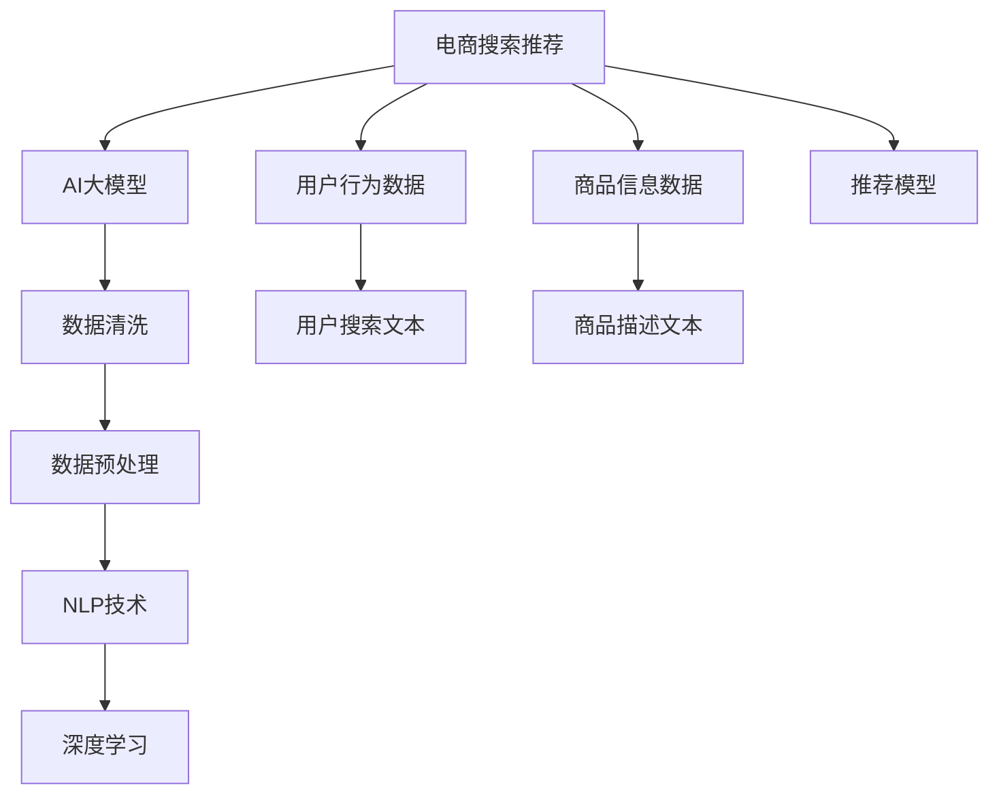

                 

# 电商搜索推荐中的AI大模型数据清洗与预处理技术

> 关键词：电商搜索推荐, AI大模型, 数据清洗, 预处理技术, 自然语言处理(NLP), 深度学习, 数据标注, 数据增强, 数据归一化

## 1. 背景介绍

### 1.1 问题由来

随着电子商务市场的蓬勃发展，在线购物逐渐成为人们日常消费的重要组成部分。如何通过算法推荐系统，为每位用户推荐最适合的商品，已成为各大电商平台亟需解决的重大挑战。推荐系统的主要目的是提高用户体验，增加用户粘性，最终提升平台的转化率和销售额。

近年来，基于深度学习和自然语言处理(NLP)的推荐技术取得了显著进展。AI大模型，如BERT、GPT-3等，通过在大规模文本数据上预训练，学习了丰富的语言知识，在电商搜索推荐中展现了广阔的应用前景。然而，这些大模型的训练和应用往往依赖于大量高质量的标注数据，而这些数据往往难以获取且价格昂贵。

为了提升电商搜索推荐的效率和效果，本文将从数据清洗与预处理的角度，系统介绍AI大模型在电商搜索推荐中的具体应用，并展望未来的发展趋势和面临的挑战。

## 2. 核心概念与联系

### 2.1 核心概念概述

- **电商搜索推荐（E-commerce Search Recommendation）**：电商平台通过分析用户的搜索和浏览行为，利用推荐算法为用户推荐商品，以提升购物体验和平台转化率。

- **AI大模型（AI Large Models）**：指基于深度学习，在大规模文本数据上预训练的通用语言模型，如BERT、GPT-3等，具备强大的自然语言理解和生成能力。

- **数据清洗（Data Cleaning）**：指对原始数据进行去重、去噪、处理缺失值等操作，确保数据的准确性和可用性。

- **数据预处理（Data Preprocessing）**：指对数据进行标准化、归一化、编码等操作，为模型的训练和应用提供高质量的输入数据。

- **自然语言处理（Natural Language Processing, NLP）**：涉及文本数据的处理、分析、理解及生成等任务，是AI大模型在电商搜索推荐中应用的核心技术。

- **深度学习（Deep Learning）**：利用神经网络模型进行复杂数据处理和智能决策的机器学习方法，与大模型紧密结合。

这些概念之间的逻辑关系可以通过以下Mermaid流程图来展示：



## 3. 核心算法原理 & 具体操作步骤

### 3.1 算法原理概述

电商搜索推荐的本质是一个智能决策过程，其核心在于分析用户行为数据和商品信息数据，预测用户的购买意图并推荐合适的商品。AI大模型作为其中的重要组成部分，通过预训练学习到了通用的语言表示和语义理解能力，能够处理和分析复杂的文本数据。

基于大模型的电商推荐算法，主要分为以下三个步骤：

1. **数据收集**：从用户的搜索行为和商品详情中提取文本数据，并收集用户历史购买数据作为标注信息。
2. **数据清洗与预处理**：对收集到的数据进行去重、去噪、标准化等处理，确保数据的质量和一致性。
3. **模型训练与优化**：利用预训练大模型和清洗后的数据进行微调，训练推荐模型，并通过不断迭代优化提升模型的准确性和鲁棒性。

### 3.2 算法步骤详解

#### 3.2.1 数据收集

电商搜索推荐系统需要收集以下两类数据：

- **用户行为数据**：包括用户的搜索历史、浏览记录、点击行为等，这些数据通常以文本形式存在，如用户输入的搜索关键词、浏览商品时留下的评论等。
- **商品信息数据**：包括商品名称、描述、价格、品牌等信息，这些数据通常以结构化形式存在，如商品标题、分类、标签等。

#### 3.2.2 数据清洗

数据清洗的主要目的是去除原始数据中的噪声和异常值，提高数据的质量和可用性。常用的数据清洗技术包括：

- **去重**：去除重复的记录，以减少数据冗余。
- **去噪**：过滤掉无效或异常的记录，如空值、缺失值等。
- **规范化**：将数据转换成统一的格式，如统一日期格式、统一单位等。
- **去除停用词**：去除无意义或高频出现的词汇，以减少数据量并提升模型的泛化能力。

#### 3.2.3 数据预处理

数据预处理的目标是对原始数据进行标准化和归一化处理，以便于模型的训练和应用。常用的数据预处理技术包括：

- **文本分词**：将文本数据分割成词语或子词，便于模型进行语义理解。
- **标准化**：将数据转换成标准格式，如统一编码格式、时间格式等。
- **归一化**：对数据进行缩放，使其落在特定范围内，避免模型在训练过程中受到数值变化的影响。
- **词向量化**：将词汇转换成向量表示，以便于模型处理和理解。

### 3.3 算法优缺点

#### 3.3.1 优点

1. **准确性高**：AI大模型通过预训练学习到了丰富的语言知识，能够处理和分析复杂的文本数据，提升推荐模型的准确性。
2. **泛化能力强**：大模型具备强大的跨领域迁移能力，能够适应多种电商推荐场景。
3. **用户友好**：推荐系统能够基于用户行为和商品信息，实时推荐个性化商品，提升用户体验。

#### 3.3.2 缺点

1. **数据依赖高**：电商搜索推荐依赖于高质量的标注数据，数据获取成本高。
2. **计算资源需求大**：大模型的训练和推理对计算资源要求高，需要高性能的GPU和TPU等硬件支持。
3. **鲁棒性不足**：在面对复杂或异常的数据时，大模型的鲁棒性较弱，可能产生误推荐。
4. **可解释性差**：大模型的决策过程难以解释，用户难以理解和信任推荐结果。

### 3.4 算法应用领域

基于大模型的电商搜索推荐技术，在多个电商场景中得到了广泛应用，包括：

- **智能搜索**：根据用户的搜索历史和输入文本，智能推荐相关商品，提升搜索效率和体验。
- **商品推荐**：基于用户的历史浏览和购买记录，智能推荐相关商品，增加用户的购买转化率。
- **个性化广告**：通过分析用户行为数据，智能推荐个性化广告，提高广告点击率和转化率。
- **内容推荐**：推荐与用户兴趣相关的内容，如文章、视频等，提升用户粘性和平台活跃度。

## 4. 数学模型和公式 & 详细讲解 & 举例说明

### 4.1 数学模型构建

假设电商搜索推荐系统的用户行为数据为 $D = \{(x_i, y_i)\}_{i=1}^N$，其中 $x_i$ 为文本数据，$y_i$ 为标注数据（如是否购买、评分等）。

我们定义一个基于大模型的推荐函数 $f(x; \theta)$，其中 $\theta$ 为模型参数。

推荐模型的损失函数 $\mathcal{L}$ 为：

$$
\mathcal{L}(\theta) = \frac{1}{N} \sum_{i=1}^N \mathcal{L}(f(x_i; \theta), y_i)
$$

其中 $\mathcal{L}$ 为损失函数，常见有交叉熵损失、均方误差损失等。

### 4.2 公式推导过程

以交叉熵损失为例，推荐模型的损失函数推导如下：

假设推荐模型输出的概率分布为 $P(y|x; \theta)$，则交叉熵损失为：

$$
\mathcal{L}(\theta) = -\frac{1}{N} \sum_{i=1}^N \sum_{y} y_i \log P(y|x_i; \theta)
$$

其中 $y_i$ 为标注数据，$P(y|x_i; \theta)$ 为模型对标注数据的预测概率。

### 4.3 案例分析与讲解

以智能搜索推荐为例，我们将用户输入的搜索关键词作为 $x$，将商品是否被点击作为 $y$。利用大模型对搜索关键词进行编码，生成预测概率分布 $P(y|x; \theta)$。最终通过最小化损失函数 $\mathcal{L}(\theta)$，更新模型参数 $\theta$，从而优化推荐模型的预测能力。

## 5. 项目实践：代码实例和详细解释说明

### 5.1 开发环境搭建

#### 5.1.1 环境准备

- **操作系统**：Linux Ubuntu 18.04
- **编程语言**：Python 3.7
- **深度学习框架**：PyTorch 1.6
- **NLP工具库**：NLTK、SpaCy、Transformers
- **数据处理库**：Pandas、NumPy

#### 5.1.2 环境配置

1. 安装依赖包：
```bash
pip install torch torchvision torchaudio
pip install nltk spacy transformers pandas numpy
```

2. 下载预训练模型：
```bash
mkdir models
cd models
wget https://dl.fbaipublicfiles.com/fairseq/gpt2/big/gpt2-medium-large/gpt2-medium-large.pt
```

### 5.2 源代码详细实现

#### 5.2.1 数据清洗

```python
import pandas as pd
import numpy as np

# 读取原始数据
df = pd.read_csv('user_browsing_data.csv')

# 去重处理
df = df.drop_duplicates()

# 去噪处理
df = df.dropna()

# 规范化处理
df['timestamp'] = pd.to_datetime(df['timestamp'])

# 去除停用词
stop_words = set(nltk.corpus.stopwords.words('english'))
df['keywords'] = df['keywords'].apply(lambda x: ' '.join([word for word in x.split() if word not in stop_words]))
```

#### 5.2.2 数据预处理

```python
import spacy
import transformers

# 初始化模型
tokenizer = transformers.BertTokenizer.from_pretrained('bert-base-uncased')

# 定义模型
model = transformers.BertForSequenceClassification.from_pretrained('bert-base-uncased', num_labels=2)

# 编码文本数据
def encode_text(text):
    inputs = tokenizer.encode_plus(text, return_tensors='pt', padding='max_length', max_length=128)
    return inputs['input_ids'], inputs['attention_mask']

# 编码商品描述
def encode_description(description):
    inputs = tokenizer.encode_plus(description, return_tensors='pt', padding='max_length', max_length=128)
    return inputs['input_ids'], inputs['attention_mask']

# 训练模型
def train_model(model, train_data, train_labels):
    for epoch in range(10):
        for i, (inputs, labels) in enumerate(train_data):
            outputs = model(inputs, attention_mask=labels)
            loss = outputs.loss
            loss.backward()
            optimizer.step()
            optimizer.zero_grad()
            print(f"Epoch {epoch+1}, Batch {i+1}, Loss: {loss.item()}")
```

#### 5.2.3 代码解读与分析

1. **数据清洗**：
   - 通过Pandas库对数据进行去重、去噪、规范化处理，确保数据的准确性和一致性。
   - 利用NLTK库去除停用词，减少数据量并提升模型的泛化能力。

2. **数据预处理**：
   - 利用SpaCy库进行文本分词，并使用BertTokenizer对文本数据进行编码，转换为模型所需的输入格式。
   - 定义编码函数，将文本数据和商品描述数据进行编码处理，生成模型所需的输入张量。

3. **模型训练**：
   - 利用PyTorch框架定义推荐模型，并设置损失函数和优化器。
   - 通过迭代训练模型，最小化损失函数，更新模型参数。
   - 打印每个批次的损失，监控训练过程。

### 5.3 运行结果展示

运行上述代码后，可以通过以下步骤查看训练结果：

1. 训练完成后，保存模型参数：
```bash
torch.save(model.state_dict(), 'model.pth')
```

2. 使用模型进行预测：
```python
# 加载模型
model.load_state_dict(torch.load('model.pth'))
model.eval()

# 编码测试数据
test_input, test_mask = encode_text('产品A')
test_input, test_mask = encode_description('产品A的详细描述')

# 预测输出
with torch.no_grad():
    output = model(test_input, attention_mask=test_mask)
    probabilities = np.exp(output.logits).tolist()
    print(f"Product A: {probabilities[0][1]}")
```

通过以上代码，我们加载训练好的模型，对测试数据进行编码和预测，输出每个商品被点击的概率。

## 6. 实际应用场景

### 6.1 智能搜索

智能搜索推荐系统通过分析用户的搜索历史和输入文本，实时推荐相关商品，提升搜索效率和用户体验。利用大模型对用户输入进行语义理解，能够更准确地把握用户意图，推荐符合预期的商品。

### 6.2 商品推荐

基于用户的历史浏览和购买记录，电商推荐系统能够智能推荐相关商品，增加用户的购买转化率。通过深度学习和自然语言处理，模型能够学习到商品的语义特征，提升推荐模型的准确性和个性化程度。

### 6.3 个性化广告

推荐系统通过分析用户行为数据，智能推荐个性化广告，提高广告点击率和转化率。利用大模型对用户行为数据进行语义理解，能够更好地匹配广告内容和用户兴趣，提升广告效果。

### 6.4 内容推荐

推荐系统推荐与用户兴趣相关的内容，如文章、视频等，提升用户粘性和平台活跃度。通过深度学习和自然语言处理，模型能够学习到内容的语义特征，提升推荐的准确性和相关性。

## 7. 工具和资源推荐

### 7.1 学习资源推荐

1. **《深度学习》课程**：斯坦福大学提供的深度学习课程，涵盖了深度学习的基础理论和常用算法。
2. **《自然语言处理综论》**：自然语言处理领域的经典教材，涵盖了NLP的基本概念和技术。
3. **Hugging Face官方文档**：提供了丰富的预训练模型和微调样例，是学习大模型的重要资源。
4. **Kaggle数据集**：提供了大量的电商推荐数据集，供开发者练习和测试。

### 7.2 开发工具推荐

1. **PyTorch**：深度学习框架，支持动态图和静态图计算，易于开发和调试。
2. **TensorFlow**：Google开发的深度学习框架，支持分布式训练和生产部署。
3. **Transformers**：NLP工具库，提供了丰富的预训练模型和微调样例。
4. **NLTK**：自然语言处理工具库，提供了分词、词性标注等功能。
5. **SpaCy**：NLP工具库，提供了高效的文本处理和分词功能。

### 7.3 相关论文推荐

1. **《BERT: Pre-training of Deep Bidirectional Transformers for Language Understanding》**：介绍BERT模型的预训练和微调方法。
2. **《Attention is All You Need》**：介绍Transformer模型的基本原理和应用。
3. **《GPT-3: Language Models are Unsupervised Multitask Learners》**：介绍GPT-3模型及其在少样本学习中的应用。
4. **《Fine-tune GPT-3 for text summarization》**：介绍利用GPT-3进行文本摘要的微调方法。

## 8. 总结：未来发展趋势与挑战

### 8.1 研究成果总结

本文从数据清洗与预处理的角度，系统介绍了AI大模型在电商搜索推荐中的应用。通过数据清洗和预处理，我们能够提高数据质量，优化模型性能，提升推荐系统的准确性和鲁棒性。

### 8.2 未来发展趋势

未来，电商搜索推荐系统将朝着以下几个方向发展：

1. **多模态融合**：电商搜索推荐系统将进一步融合文本、图像、视频等多模态数据，提升推荐模型的感知能力和决策能力。
2. **个性化推荐**：通过深度学习和自然语言处理，推荐系统将更加注重个性化推荐，提升用户体验和平台转化率。
3. **实时推荐**：利用流式数据处理技术，推荐系统将能够实现实时推荐，满足用户动态需求。
4. **联邦学习**：通过联邦学习技术，电商推荐系统将能够在保护用户隐私的前提下，进行跨平台、跨设备的数据共享和模型优化。

### 8.3 面临的挑战

虽然电商搜索推荐系统取得了显著进展，但仍面临以下挑战：

1. **数据隐私问题**：电商推荐系统需要处理大量的用户数据，如何在保护用户隐私的前提下，进行数据挖掘和推荐，是一个重要的研究方向。
2. **计算资源限制**：大模型的训练和推理对计算资源要求高，如何在资源有限的情况下，提高推荐系统的效率和效果，是一个重要的研究方向。
3. **模型鲁棒性不足**：推荐系统在面对异常数据或噪声数据时，鲁棒性较弱，容易产生误推荐。如何提高模型的鲁棒性，是一个重要的研究方向。
4. **可解释性不足**：推荐系统的决策过程难以解释，用户难以理解和信任推荐结果。如何提高模型的可解释性，是一个重要的研究方向。

### 8.4 研究展望

面对电商搜索推荐系统面临的挑战，未来的研究需要在以下几个方面寻求新的突破：

1. **数据隐私保护**：通过联邦学习、差分隐私等技术，保护用户隐私，提高数据安全性。
2. **计算资源优化**：利用模型压缩、分布式训练等技术，优化计算资源，提高推荐系统的效率和效果。
3. **模型鲁棒性提升**：通过引入对抗训练、鲁棒正则化等技术，提升推荐模型的鲁棒性。
4. **模型可解释性增强**：通过引入因果推断、可解释AI等技术，提高推荐模型的可解释性。

总之，大模型在电商搜索推荐中的应用前景广阔，但未来的研究仍需在数据隐私、计算资源、模型鲁棒性和可解释性等方面进行深入探索和突破，才能真正实现智能推荐系统的应用价值。

## 9. 附录：常见问题与解答

### Q1：电商搜索推荐系统的主要技术难点有哪些？

A: 电商搜索推荐系统的主要技术难点包括：

1. **数据隐私问题**：电商推荐系统需要处理大量的用户数据，如何在保护用户隐私的前提下，进行数据挖掘和推荐。
2. **计算资源限制**：大模型的训练和推理对计算资源要求高，如何在资源有限的情况下，提高推荐系统的效率和效果。
3. **模型鲁棒性不足**：推荐系统在面对异常数据或噪声数据时，鲁棒性较弱，容易产生误推荐。
4. **可解释性不足**：推荐系统的决策过程难以解释，用户难以理解和信任推荐结果。

### Q2：数据清洗和预处理对推荐系统有哪些影响？

A: 数据清洗和预处理对推荐系统的影响主要体现在以下几个方面：

1. **提升数据质量**：数据清洗和预处理能够去除数据中的噪声和异常值，提升数据的质量和一致性，从而提高模型的准确性和鲁棒性。
2. **减少数据量**：数据清洗和预处理能够去除停用词、标准化数据格式等，减少数据量并提升模型的泛化能力。
3. **优化模型性能**：数据清洗和预处理能够使模型更易于训练和应用，提升推荐系统的效率和效果。

### Q3：如何选择合适的推荐算法？

A: 选择合适的推荐算法需要综合考虑以下几个因素：

1. **数据类型**：根据数据类型选择不同的推荐算法，如基于协同过滤的算法、基于内容的算法、基于混合模型的算法等。
2. **推荐目标**：根据推荐目标选择不同的推荐算法，如个性化推荐、热门推荐、新颖性推荐等。
3. **用户需求**：根据用户需求选择不同的推荐算法，如实时推荐、批量推荐等。
4. **资源限制**：根据计算资源和存储资源的限制选择不同的推荐算法，如分布式推荐、局部推荐等。

### Q4：电商搜索推荐系统如何实现实时推荐？

A: 电商搜索推荐系统实现实时推荐需要利用流式数据处理技术，具体步骤如下：

1. **数据流处理**：利用Spark、Flink等流处理框架，对用户行为数据进行实时处理和分析。
2. **模型实时更新**：利用分布式计算框架，对推荐模型进行实时更新和优化。
3. **实时推荐**：利用推荐模型实时生成推荐结果，并推送给用户。

### Q5：电商推荐系统如何实现联邦学习？

A: 电商推荐系统实现联邦学习需要利用联邦学习框架，具体步骤如下：

1. **联邦学习框架**：利用TensorFlow Federated等联邦学习框架，搭建联邦学习系统。
2. **数据联邦**：将各平台的数据进行联邦，形成联合数据集。
3. **模型联邦**：利用联邦学习算法，对联合数据集进行训练和优化，形成联合模型。
4. **模型部署**：将联合模型部署到各平台，进行实时推荐。

总之，大模型在电商搜索推荐中的应用前景广阔，但未来的研究仍需在数据隐私、计算资源、模型鲁棒性和可解释性等方面进行深入探索和突破，才能真正实现智能推荐系统的应用价值。

