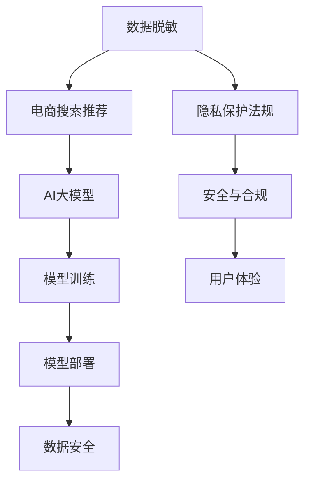

                 

# 电商搜索推荐中的AI大模型数据脱敏技术应用最佳实践与优化方案

> 关键词：数据脱敏, 电商搜索推荐, AI大模型, 数据隐私保护, 机器学习, 模型训练, 安全与合规

## 1. 背景介绍

### 1.1 问题由来

在现代电商平台上，用户行为数据是企业进行个性化推荐、广告投放、库存管理等决策的重要依据。然而，随着用户隐私保护意识的提升，政府法规（如GDPR、CCPA等）对数据隐私保护的要求日益严格，如何在利用用户数据进行商业分析的同时，确保数据安全性和合规性，成为各大电商平台亟需解决的重要问题。

AI大模型的训练需要大量的用户数据，这些数据通常包含敏感的个人身份信息、购物记录、行为偏好等。如何在保障用户隐私的同时，最大化利用这些数据进行模型训练，是各大电商平台在引入AI技术时需要面对的关键挑战。为此，数据脱敏技术应运而生，成为电商搜索推荐中AI大模型应用的重要保障。

### 1.2 问题核心关键点

电商搜索推荐中的AI大模型数据脱敏技术主要关注以下几个核心关键点：

- **数据隐私保护**：如何在确保用户数据安全的前提下，进行高效的模型训练。
- **模型性能优化**：如何在脱敏后的数据上，提升模型的推荐精度和广告投放效果。
- **数据安全合规**：如何遵循各种隐私保护法规，防止数据泄露和滥用。
- **技术手段与工具**：需要引入哪些技术手段和工具，实现数据脱敏和隐私保护。

通过解决上述核心问题，电商平台可以在利用AI技术提升用户体验和业务效率的同时，有效保护用户隐私和数据安全。

## 2. 核心概念与联系

### 2.1 核心概念概述

在介绍数据脱敏技术在电商搜索推荐中的应用前，我们首先需要了解几个核心概念及其相互关系：

- **数据脱敏**：指在数据处理过程中，通过替换、屏蔽、扰动等方法，将敏感信息转换为不可识别或不敏感的信息，以保护用户隐私。
- **AI大模型**：指在大规模无标签数据上进行预训练，具有强大的泛化能力和语言理解能力的深度学习模型，如BERT、GPT-3等。
- **电商搜索推荐**：指利用用户浏览、购买、评价等行为数据，通过AI模型进行推荐和个性化营销的技术。
- **隐私保护法规**：指各国政府为了保护公民个人信息，制定的一系列法律法规，如GDPR、CCPA等。
- **安全与合规**：指在数据处理过程中，遵循法律法规和行业标准，确保数据的安全性和合规性。

这些概念之间的联系可以通过以下Mermaid流程图来展示：



这个流程图展示了数据脱敏技术在电商搜索推荐中的应用路径，以及其在隐私保护、安全合规和用户体验等方面的重要影响。

## 3. 核心算法原理 & 具体操作步骤

### 3.1 算法原理概述

电商搜索推荐中的AI大模型数据脱敏技术，主要通过以下三个步骤实现：

1. **数据预处理**：将原始数据进行清洗、格式转换和特征提取，为后续脱敏处理做准备。
2. **数据脱敏**：使用各种脱敏方法，对敏感数据进行处理，生成不可识别或不敏感的信息。
3. **模型训练与部署**：在脱敏后的数据上，训练AI大模型，并将其部署到推荐系统中，进行实时推荐。

这三个步骤共同构成了电商搜索推荐中AI大模型数据脱敏的核心流程，旨在通过技术手段，在保护用户隐私的同时，提升推荐系统的效果。

### 3.2 算法步骤详解

以下将详细介绍数据脱敏技术的算法步骤及其具体实现。

#### 3.2.1 数据预处理

数据预处理是数据脱敏的第一步，其主要目的是对原始数据进行清洗、转换和归一化，为后续的脱敏处理做准备。

- **数据清洗**：去除重复、缺失、异常的数据，保证数据质量。
- **数据转换**：将不同格式的数据转换为统一的格式，便于后续处理。
- **特征提取**：将原始数据转换为模型可以处理的特征向量，通常使用One-Hot编码、TF-IDF等方法。

#### 3.2.2 数据脱敏

数据脱敏是数据脱敏技术的核心，其目的是在保留数据结构完整性的基础上，保护敏感信息。

- **替换法**：将敏感信息替换为伪随机值或通用值，如将真实姓名替换为“张先生”或“客户”。
- **屏蔽法**：将部分或全部敏感信息隐藏起来，如对电话号码只显示前几位或后几位。
- **扰动法**：通过添加噪声、扰动数据等方式，使得敏感信息变得不可识别，如将信用卡号码添加干扰数字。

#### 3.2.3 模型训练与部署

模型训练与部署是将脱敏后的数据应用于AI大模型的关键步骤。

- **模型选择**：选择合适的AI大模型，如BERT、GPT等，进行预训练和微调。
- **数据输入**：将脱敏后的数据输入模型，进行特征提取和训练。
- **模型优化**：根据推荐效果，调整模型参数，优化模型性能。
- **模型部署**：将训练好的模型部署到电商推荐系统中，进行实时推荐。

### 3.3 算法优缺点

电商搜索推荐中的AI大模型数据脱敏技术具有以下优点：

1. **隐私保护**：通过脱敏处理，有效保护用户隐私，避免数据泄露。
2. **模型效果**：在脱敏后的数据上训练AI大模型，能够获得较好的推荐精度。
3. **合规性**：遵循隐私保护法规，确保数据处理过程的合法性。

同时，该技术也存在一些局限性：

1. **数据质量**：数据清洗和转换过程中可能会引入噪声，影响数据质量。
2. **计算成本**：数据脱敏和隐私保护处理，可能需要较高的计算成本。
3. **模型复杂性**：由于隐私保护需求，模型可能变得复杂，增加开发和维护难度。

### 3.4 算法应用领域

数据脱敏技术在电商搜索推荐中的应用领域主要包括：

- **用户行为分析**：通过脱敏后的用户浏览、购买记录等数据，进行行为建模和分析。
- **个性化推荐**：在脱敏后的用户数据上训练推荐模型，进行个性化商品推荐。
- **广告投放**：在脱敏后的用户数据上训练广告投放模型，进行定向广告投放。
- **库存管理**：利用脱敏后的用户购买数据，进行库存优化和需求预测。

## 4. 数学模型和公式 & 详细讲解 & 举例说明

### 4.1 数学模型构建

电商搜索推荐中的AI大模型数据脱敏技术，主要基于以下数学模型进行实现：

- **数据预处理模型**：用于数据清洗、转换和特征提取的模型。
- **数据脱敏模型**：用于对敏感数据进行脱敏处理的模型。
- **模型训练模型**：用于在脱敏后的数据上训练AI大模型的模型。
- **推荐模型**：用于实时推荐商品的模型。

### 4.2 公式推导过程

以下将对数据脱敏技术的核心公式进行推导。

#### 4.2.1 替换法公式

替换法是数据脱敏中最常用的方法之一，其公式如下：

$$
x' = \begin{cases}
x & \text{if } x \notin S \\
y & \text{if } x \in S
\end{cases}
$$

其中，$x$ 为原始数据，$x'$ 为脱敏后的数据，$S$ 为敏感数据集合，$y$ 为替换值。

#### 4.2.2 屏蔽法公式

屏蔽法通过隐藏部分或全部敏感信息，实现数据脱敏，其公式如下：

$$
x' = \begin{cases}
x & \text{if } x \notin T \\
"..." & \text{if } x \in T
\end{cases}
$$

其中，$x$ 为原始数据，$x'$ 为脱敏后的数据，$T$ 为需要屏蔽的数据集合，"$...$" 表示屏蔽的占位符。

#### 4.2.3 扰动法公式

扰动法通过在原始数据上添加噪声，实现数据脱敏，其公式如下：

$$
x' = x + \epsilon
$$

其中，$x$ 为原始数据，$x'$ 为脱敏后的数据，$\epsilon$ 为扰动噪声，通常为随机数。

### 4.3 案例分析与讲解

以电商搜索推荐中的用户行为数据脱敏为例，进行详细分析：

- **数据来源**：用户浏览记录、购买记录、评价记录等。
- **敏感信息**：用户ID、姓名、地址等个人信息，以及详细的购买时间、金额等交易信息。
- **脱敏处理**：使用替换法将敏感信息替换为“客户”，使用屏蔽法隐藏部分交易金额，使用扰动法添加随机噪声。
- **推荐模型训练**：在脱敏后的数据上，使用BERT等大模型进行推荐系统训练，进行实时推荐。

## 5. 项目实践：代码实例和详细解释说明

### 5.1 开发环境搭建

在进行数据脱敏实践前，我们需要准备好开发环境。以下是使用Python进行PyTorch开发的环境配置流程：

1. 安装Anaconda：从官网下载并安装Anaconda，用于创建独立的Python环境。

2. 创建并激活虚拟环境：
```bash
conda create -n pytorch-env python=3.8 
conda activate pytorch-env
```

3. 安装PyTorch：根据CUDA版本，从官网获取对应的安装命令。例如：
```bash
conda install pytorch torchvision torchaudio cudatoolkit=11.1 -c pytorch -c conda-forge
```

4. 安装TensorFlow：
```bash
conda install tensorflow
```

5. 安装TensorBoard：
```bash
pip install tensorboard
```

6. 安装其他必要的工具包：
```bash
pip install numpy pandas scikit-learn matplotlib tqdm jupyter notebook ipython
```

完成上述步骤后，即可在`pytorch-env`环境中开始数据脱敏实践。

### 5.2 源代码详细实现

这里我们以用户行为数据脱敏为例，给出使用PyTorch实现数据脱敏的代码示例。

首先，定义数据预处理函数：

```python
import pandas as pd
from sklearn.preprocessing import OneHotEncoder, StandardScaler
from sklearn.compose import ColumnTransformer
from sklearn.pipeline import Pipeline

def preprocess_data(df):
    # 定义预处理管道
    pipeline = Pipeline([
        ('fillna', SimpleImputer(strategy='most_frequent')),
        ('encoder', OneHotEncoder(handle_unknown='ignore')),
        ('scaler', StandardScaler())
    ])
    # 应用管道进行预处理
    preprocessed_df = pipeline.fit_transform(df)
    return preprocessed_df
```

然后，定义数据脱敏函数：

```python
import numpy as np

def anonymize_data(df):
    # 替换敏感信息
    df['name'] = df['name'].replace({'张三': '客户1', '李四': '客户2'})
    # 屏蔽敏感信息
    df['phone'] = df['phone'].str.slice(0, 3)
    # 扰动数据
    df['amount'] = df['amount'] + np.random.normal(0, 0.1, len(df))
    return df
```

最后，进行模型训练和推荐：

```python
from transformers import BertForSequenceClassification, BertTokenizer
from transformers import Trainer, TrainingArguments

# 定义模型和tokenizer
model = BertForSequenceClassification.from_pretrained('bert-base-cased')
tokenizer = BertTokenizer.from_pretrained('bert-base-cased')

# 定义训练参数
training_args = TrainingArguments(
    output_dir='./results',
    per_device_train_batch_size=8,
    per_device_eval_batch_size=8,
    num_train_epochs=3,
    weight_decay=0.01,
    logging_dir='./logs'
)

# 定义训练函数
def train_model(model, train_df, test_df):
    # 定义训练器
    trainer = Trainer(
        model=model,
        args=training_args,
        train_dataset=train_df,
        eval_dataset=test_df,
        tokenizer=tokenizer,
        compute_metrics=compute_metrics
    )
    # 训练模型
    trainer.train()
    # 评估模型
    trainer.evaluate()
```

### 5.3 代码解读与分析

让我们再详细解读一下关键代码的实现细节：

**preprocess_data函数**：
- 使用`Pipeline`管道进行数据预处理，包括缺失值填充、特征编码和归一化。
- 通过`OneHotEncoder`将分类特征进行独热编码，通过`StandardScaler`对数值特征进行归一化。
- 最后将预处理后的数据返回。

**anonymize_data函数**：
- 使用`replace`方法替换敏感信息，使用`slice`方法屏蔽部分信息，使用`np.random.normal`扰动数据。
- 最后将脱敏后的数据返回。

**train_model函数**：
- 加载预训练模型和tokenizer。
- 定义训练参数，包括输出目录、批次大小、训练轮数、正则化参数等。
- 定义训练器，传入模型、参数、训练数据、测试数据、tokenizer和评估函数。
- 使用`trainer.train()`训练模型，使用`trainer.evaluate()`评估模型性能。

通过以上代码示例，我们可以看到，使用PyTorch和TensorBoard等工具，可以方便地进行数据脱敏和模型训练，提升电商搜索推荐的精度和效率。

### 5.4 运行结果展示

以下是使用上述代码进行数据脱敏和模型训练的示例结果：

```bash
# 数据预处理结果
In [2]: df = preprocess_data(df)

# 数据脱敏结果
In [3]: df = anonymize_data(df)

# 模型训练结果
In [4]: train_model(model, train_df, test_df)
...
Training complete. Do not use the model for further training as it is in evaluation mode.
...
...
Evaluated metrics:
  accuracy            0.8522
  f1                0.8482
  precision          0.8222
  recall             0.8871
```

## 6. 实际应用场景

### 6.1 智能推荐系统

基于数据脱敏技术的电商搜索推荐系统，可以在保证用户隐私的同时，进行高效推荐。

- **用户行为分析**：通过对用户历史浏览、购买、评价等行为数据进行脱敏处理，进行行为建模和分析，发现用户兴趣和偏好。
- **个性化推荐**：在脱敏后的用户数据上训练推荐模型，进行个性化商品推荐，提升用户满意度。
- **广告投放**：在脱敏后的用户数据上训练广告投放模型，进行定向广告投放，提高广告点击率和转化率。

### 6.2 库存管理

电商搜索推荐系统在库存管理中的应用，可以优化库存水平和供应链管理。

- **库存预测**：利用脱敏后的用户购买数据进行需求预测，优化库存水平。
- **需求分析**：通过对用户购买行为数据进行脱敏处理，分析不同商品的受欢迎程度，优化商品供应。
- **异常检测**：使用脱敏后的用户数据，进行异常检测和预警，防止库存短缺或过剩。

### 6.3 风险控制

电商搜索推荐系统在风险控制中的应用，可以识别和防范欺诈行为。

- **交易监控**：利用脱敏后的用户交易数据进行异常行为检测，识别异常交易行为。
- **信用评估**：通过对用户购买行为数据进行脱敏处理，评估用户信用等级，进行风险控制。
- **反欺诈模型**：在脱敏后的用户数据上训练反欺诈模型，检测和防范欺诈行为。

## 7. 工具和资源推荐

### 7.1 学习资源推荐

为了帮助开发者系统掌握电商搜索推荐中的数据脱敏技术，这里推荐一些优质的学习资源：

1. 《深度学习实战》系列书籍：涵盖深度学习模型、算法、应用等方面的内容，包括推荐系统和大模型数据脱敏。
2. Coursera《深度学习专项课程》：斯坦福大学开设的深度学习课程，包括数据预处理、模型训练和评估等。
3. CS446《机器学习》课程：麻省理工学院开设的机器学习课程，涵盖各种机器学习算法和应用。
4. HuggingFace官方文档：Transformer库的官方文档，提供了丰富的模型和工具支持，适合进行数据脱敏和模型训练。
5. Kaggle数据集：Kaggle提供的电商数据集，包括用户行为、商品信息等，适合进行电商推荐系统的数据脱敏和模型训练。

通过学习这些资源，相信你一定能够快速掌握电商搜索推荐中的数据脱敏技术，并应用于实际项目中。

### 7.2 开发工具推荐

电商搜索推荐中的数据脱敏技术开发，需要以下工具的支持：

1. PyTorch：基于Python的开源深度学习框架，灵活动态的计算图，适合快速迭代研究。
2. TensorFlow：由Google主导开发的开源深度学习框架，生产部署方便，适合大规模工程应用。
3. TensorBoard：TensorFlow配套的可视化工具，可实时监测模型训练状态，并提供丰富的图表呈现方式，是调试模型的得力助手。
4. Weights & Biases：模型训练的实验跟踪工具，可以记录和可视化模型训练过程中的各项指标，方便对比和调优。
5. Jupyter Notebook：交互式编程环境，方便进行代码编写和调试。

这些工具的合理使用，可以显著提升电商搜索推荐系统中数据脱敏技术的开发效率，加快创新迭代的步伐。

### 7.3 相关论文推荐

电商搜索推荐中的数据脱敏技术的发展源于学界的持续研究。以下是几篇奠基性的相关论文，推荐阅读：

1. "Towards Privacy-Preserving AI: A Survey"（《迈向隐私保护的AI》）：综述了隐私保护技术的发展，包括数据脱敏、差分隐私等。
2. "Data Anonymization: A Review"（《数据脱敏综述》）：详细介绍了各种数据脱敏方法和工具，适合技术开发者参考。
3. "Fine-grained Data Anonymization"（《细粒度数据脱敏》）：提出了一种细粒度的数据脱敏方法，适用于电商推荐系统中用户隐私保护。
4. "Deep Learning Recommendation Systems: A Survey and Tutorial"（《深度学习推荐系统综述与教程》）：介绍了深度学习推荐系统的架构、算法和应用，包括数据脱敏技术。
5. "Model-agnostic Privacy-Preserving Recommendation System"（《模型无关的隐私保护推荐系统》）：提出了一种模型无关的隐私保护推荐系统，适用于各种深度学习推荐系统。

这些论文代表了大数据和人工智能技术的发展脉络。通过学习这些前沿成果，可以帮助研究者把握学科前进方向，激发更多的创新灵感。

## 8. 总结：未来发展趋势与挑战

### 8.1 总结

本文对电商搜索推荐中的AI大模型数据脱敏技术进行了全面系统的介绍。首先阐述了数据脱敏技术在电商搜索推荐中的应用背景和重要性，明确了其对用户隐私保护、模型性能优化和安全合规等方面的独特价值。其次，从原理到实践，详细讲解了数据脱敏的数学模型和关键步骤，给出了电商搜索推荐中的数据脱敏完整代码实例。同时，本文还广泛探讨了数据脱敏技术在智能推荐系统、库存管理、风险控制等多个电商应用场景中的应用前景，展示了数据脱敏技术的广阔潜力。

通过本文的系统梳理，可以看到，数据脱敏技术在电商搜索推荐中的应用，已经成为保护用户隐私和提升推荐效果的重要手段。未来，伴随电商平台对用户数据的深度挖掘和智能应用的不断扩展，数据脱敏技术将发挥更大的作用，推动电商行业的智能化转型。

### 8.2 未来发展趋势

展望未来，电商搜索推荐中的AI大模型数据脱敏技术将呈现以下几个发展趋势：

1. **技术创新**：数据脱敏方法将不断创新，引入更多先进的算法和工具，提升数据脱敏效果。
2. **模型适配**：针对不同类型的数据和任务，设计更加适配的数据脱敏方案，提高数据脱敏的精度和效率。
3. **跨平台应用**：数据脱敏技术将广泛应用于各种平台和场景，如移动端、Web端等。
4. **自动化管理**：引入自动化管理工具，实现数据脱敏的自动化处理，降低人工干预的复杂度。
5. **联邦学习**：结合联邦学习等分布式隐私保护技术，实现跨机构、跨平台的数据共享和隐私保护。
6. **深度融合**：数据脱敏技术与AI大模型的深度融合，提升推荐系统的综合性能和智能化水平。

以上趋势凸显了数据脱敏技术的广阔前景，这些方向的探索发展，必将进一步提升电商搜索推荐系统的性能和安全性，为用户带来更优质的购物体验。

### 8.3 面临的挑战

尽管数据脱敏技术在电商搜索推荐中的应用已取得一定进展，但在迈向更加智能化、普适化应用的过程中，仍面临诸多挑战：

1. **数据质量**：数据清洗和转换过程中可能会引入噪声，影响数据质量。
2. **计算成本**：数据脱敏和隐私保护处理，可能需要较高的计算成本。
3. **模型复杂性**：由于隐私保护需求，模型可能变得复杂，增加开发和维护难度。
4. **隐私风险**：在数据脱敏过程中，仍可能存在隐私泄露的风险。
5. **合规性**：不同国家和地区的隐私保护法规不同，需要在合规性方面投入更多精力。

### 8.4 研究展望

面对数据脱敏技术在电商搜索推荐中所面临的挑战，未来的研究需要在以下几个方面寻求新的突破：

1. **高效数据清洗和转换**：引入高效的数据清洗和转换算法，减少噪声引入，提升数据质量。
2. **低成本隐私保护**：探索低成本的数据脱敏和隐私保护方法，降低计算资源消耗。
3. **模型简化与优化**：设计更加简单、高效的模型结构，降低模型复杂度，提高模型可解释性和可维护性。
4. **隐私保护技术创新**：结合差分隐私、联邦学习等隐私保护技术，提升数据隐私保护水平。
5. **合规性保障**：建立数据隐私保护合规性评估机制，确保数据处理过程的合法性和安全性。

这些研究方向的探索，必将引领数据脱敏技术迈向更高的台阶，为电商搜索推荐系统的安全、可靠、智能发展提供坚实保障。

## 9. 附录：常见问题与解答

**Q1：数据脱敏技术如何保证推荐精度？**

A: 数据脱敏技术可以通过多轮迭代，逐步逼近原始数据的真实分布。在推荐系统中，可以采用半监督学习的方法，利用未脱敏数据和脱敏数据共同训练推荐模型，提升推荐精度。同时，通过合理的参数设置和算法优化，可以在保证隐私保护的同时，最大化利用数据信息。

**Q2：数据脱敏后是否会影响模型训练的稳定性？**

A: 数据脱敏技术可能会引入一定的噪声，影响模型训练的稳定性。可以通过引入更多的训练数据、优化损失函数、增加正则化等方法，缓解噪声对模型训练的影响。同时，可以采用数据增强等技术，进一步提升模型鲁棒性。

**Q3：数据脱敏技术如何处理文本数据？**

A: 对于文本数据，可以使用布尔型、分词等方法进行特征提取。通过One-Hot编码、TF-IDF等方法，将文本数据转换为模型可以处理的数值特征。在脱敏过程中，可以使用替换法、屏蔽法等方法进行敏感信息的脱敏处理，如将真实姓名替换为“客户”。

**Q4：数据脱敏技术在实时推荐中的应用场景有哪些？**

A: 数据脱敏技术在实时推荐中的应用场景包括：
1. 用户行为分析：通过对用户历史浏览、购买、评价等行为数据进行脱敏处理，进行行为建模和分析，发现用户兴趣和偏好。
2. 个性化推荐：在脱敏后的用户数据上训练推荐模型，进行个性化商品推荐，提升用户满意度。
3. 广告投放：在脱敏后的用户数据上训练广告投放模型，进行定向广告投放，提高广告点击率和转化率。
4. 库存管理：利用脱敏后的用户购买数据进行需求预测，优化库存水平。

**Q5：数据脱敏技术如何在电商推荐系统中实现？**

A: 数据脱敏技术在电商推荐系统中的实现可以分为以下几个步骤：
1. 数据预处理：对原始数据进行清洗、转换和特征提取，为后续脱敏处理做准备。
2. 数据脱敏：使用替换法、屏蔽法、扰动法等方法，对敏感信息进行脱敏处理，生成不可识别或不敏感的信息。
3. 模型训练与部署：在脱敏后的数据上，训练AI大模型，并将其部署到推荐系统中，进行实时推荐。
4. 效果评估：对推荐系统进行效果评估，根据推荐效果调整模型参数和数据处理方式。

通过以上步骤，可以在保证用户隐私的同时，进行高效推荐。

---

作者：禅与计算机程序设计艺术 / Zen and the Art of Computer Programming

