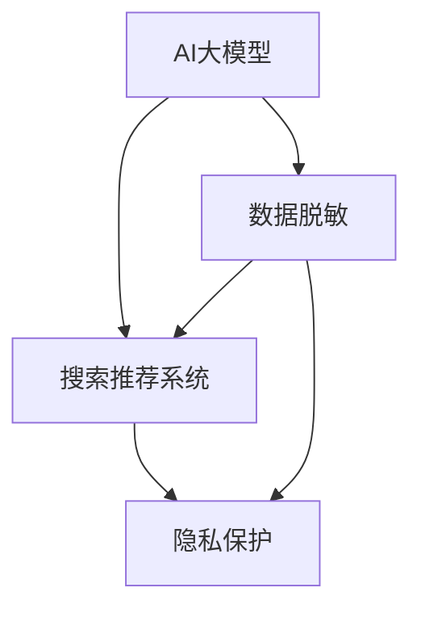

                 

# 电商搜索推荐中的AI大模型数据脱敏技术应用项目可行性分析

## 1. 背景介绍

### 1.1 问题由来
随着人工智能技术在电商搜索推荐中的广泛应用，AI大模型对用户行为数据的依赖日益加深。这些数据不仅是构建搜索推荐系统的关键，也是进行模型微调、优化和调优的重要依据。然而，用户隐私保护和数据安全变得越来越重要，如何在确保用户隐私的同时充分利用这些数据，成为了一个亟待解决的问题。

### 1.2 问题核心关键点
当前，AI大模型在电商搜索推荐中的应用，主要依赖于用户点击、浏览、购买等行为数据的分析与挖掘。但这些数据往往包含大量的个人信息，如用户的身份信息、地理位置、购买记录等，一旦泄露，将给用户带来严重隐私风险。因此，如何在保障用户隐私的同时，充分利用这些数据进行电商搜索推荐系统的优化和优化，是当前电商领域亟需解决的问题。

### 1.3 问题研究意义
研究AI大模型在电商搜索推荐中的数据脱敏技术，对于保障用户隐私、提升搜索推荐系统的效果，以及增强用户对AI技术的信任具有重要意义：

1. **保护用户隐私**：通过对用户数据进行脱敏处理，可以有效防止个人信息泄露，保护用户的隐私权。
2. **提升模型效果**：通过脱敏处理，可以保留对搜索推荐有贡献的数据信息，提升模型的性能和效果。
3. **增强用户信任**：用户对隐私保护的高度关注，通过数据脱敏技术的应用，可以增强用户对AI技术的信任感，提高用户使用率。

## 2. 核心概念与联系

### 2.1 核心概念概述

为更好地理解电商搜索推荐中AI大模型数据脱敏技术的应用，本节将介绍几个密切相关的核心概念：

- **AI大模型**：指以Transformer等架构为基础，经过大规模预训练和微调，具备强大数据处理和推理能力的深度学习模型。如BERT、GPT-3、T5等。
- **数据脱敏**：指通过对数据进行处理，使得数据中包含的敏感信息被移除或替换，以保护数据隐私的技术。
- **搜索推荐系统**：指根据用户的行为数据和兴趣偏好，推荐相关商品或服务的系统。广泛应用于电商、内容分发、社交媒体等领域。
- **隐私保护**：指通过技术手段保护用户隐私，防止敏感信息泄露，确保用户数据安全。

这些核心概念之间的逻辑关系可以通过以下Mermaid流程图来展示：



这个流程图展示了大模型在搜索推荐系统中的应用流程：

1. 大模型通过预训练获得基础能力。
2. 数据脱敏技术对用户行为数据进行处理，保护隐私。
3. 处理后的数据输入到搜索推荐系统中，提升推荐效果。
4. 隐私保护措施确保用户数据安全。

## 3. 核心算法原理 & 具体操作步骤

### 3.1 算法原理概述

电商搜索推荐中的AI大模型数据脱敏技术，主要依赖于机器学习和数据预处理技术。其核心思想是：在保留用户行为数据关键信息的同时，去除敏感信息，使得数据既能用于模型训练和优化，又能保障用户隐私。

具体来说，数据脱敏技术可以分为以下两类：

- **静态脱敏**：在数据存储阶段进行脱敏，通过替换、掩码等方法去除敏感信息。适用于静态数据存储和传输的场景。
- **动态脱敏**：在数据使用阶段进行脱敏，根据具体应用场景，动态处理数据，保证数据的实用性。适用于搜索推荐等动态交互场景。

本节重点介绍动态脱敏技术，其核心算法包括以下步骤：

1. 数据收集与预处理。
2. 隐私保护需求分析。
3. 数据脱敏策略选择。
4. 数据脱敏处理与验证。

### 3.2 算法步骤详解

#### 3.2.1 数据收集与预处理

电商搜索推荐系统通常依赖于大量的用户行为数据，包括点击、浏览、购买记录等。这些数据需要通过前端页面、API接口等方式进行收集。数据收集后，需要对其进行预处理，包括去重、清洗、归一化等，以确保数据的完整性和一致性。

#### 3.2.2 隐私保护需求分析

在进行数据脱敏前，需要对隐私保护需求进行详细分析，确定哪些信息需要脱敏处理，哪些信息可以保留。例如，用户的地理位置、IP地址等属于敏感信息，需要进行脱敏处理，而用户的购买时间、商品ID等则可以保留。

#### 3.2.3 数据脱敏策略选择

根据隐私保护需求分析结果，选择合适的数据脱敏策略。常见的策略包括：

- **替换法**：将敏感信息替换为随机值或占位符，保证数据可用性。
- **掩码法**：在敏感信息前后添加掩码字符，保护信息不被完全泄露。
- **泛化法**：将敏感信息转换为更泛化的形式，如将具体的地理位置转换为大区名。
- **分组法**：将敏感信息分组处理，去除部分具体信息，保留粗粒度信息。

#### 3.2.4 数据脱敏处理与验证

根据选择的脱敏策略，对数据进行处理。例如，使用替换法时，将购买记录中的用户ID替换为随机字符串；使用掩码法时，在用户IP地址前后添加掩码字符。处理后的数据需要进行验证，确保脱敏效果符合隐私保护需求。

### 3.3 算法优缺点

AI大模型在电商搜索推荐中的数据脱敏技术具有以下优点：

1. **数据可用性高**：通过动态脱敏技术，可以保留对推荐有贡献的数据信息，保持数据的实用性。
2. **隐私保护效果好**：动态脱敏技术可以根据具体应用场景，灵活处理敏感信息，保证用户隐私。
3. **模型效果提升**：通过对数据进行脱敏处理，可以有效减少数据噪声，提升模型的训练和优化效果。

同时，该技术也存在一定的局限性：

1. **处理成本高**：动态脱敏技术需要在数据使用阶段进行，处理成本较高。
2. **效果依赖策略**：脱敏效果很大程度上依赖于选择的策略和参数，需要进行多次验证和调整。
3. **数据维度限制**：有些维度无法进行脱敏处理，例如时间戳等。

尽管存在这些局限性，但就目前而言，动态脱敏技术是电商搜索推荐中保护用户隐私、提升模型效果的重要手段。未来相关研究的重点在于如何进一步降低动态脱敏的处理成本，提高脱敏效果的可控性和可验证性，同时兼顾模型的性能和隐私保护需求。

### 3.4 算法应用领域

AI大模型在电商搜索推荐中的数据脱敏技术，已经在多个电商平台得到了应用，覆盖了广告投放、推荐系统、用户画像等领域，为电商平台的个性化推荐提供了有力的技术支持。

1. **广告投放**：通过数据脱敏技术，保护用户隐私的同时，利用用户行为数据进行广告定向投放，提升广告效果。
2. **推荐系统**：对用户行为数据进行脱敏处理，构建个性化推荐模型，提升推荐效果和用户满意度。
3. **用户画像**：通过脱敏数据构建用户画像，获取用户兴趣和行为特征，进行精准营销。
4. **用户反馈分析**：对用户反馈数据进行脱敏处理，进行情感分析、满意度调查等。

## 4. 数学模型和公式 & 详细讲解 & 举例说明

### 4.1 数学模型构建

在电商搜索推荐中，数据脱敏技术的数学模型构建，主要涉及以下几个方面：

- **数据集构建**：构建包含用户行为数据的原始数据集，标记敏感信息。
- **脱敏策略定义**：定义脱敏策略，将敏感信息进行替换或掩码。
- **数据验证与评估**：对脱敏后的数据进行验证，确保隐私保护效果和数据可用性。

### 4.2 公式推导过程

以替换法为例，对电商搜索推荐中的用户ID进行脱敏处理，数学模型构建和公式推导如下：

1. **原始数据集**：$D = \{(x_i, y_i)\}_{i=1}^N$，其中 $x_i$ 为原始数据，$y_i$ 为标签。
2. **脱敏策略**：将用户ID $id$ 替换为随机字符串 $r$，得到脱敏后的数据集 $D' = \{(x_i', y_i)\}_{i=1}^N$。
3. **验证与评估**：通过比较原始数据集 $D$ 和脱敏数据集 $D'$ 的隐私保护效果和数据可用性。

使用公式表示，原始数据集 $D$ 中用户ID $id$ 的替换法脱敏过程为：

$$
id \rightarrow r
$$

其中 $r$ 为随机生成的字符串。

### 4.3 案例分析与讲解

以某电商平台的用户点击数据脱敏为例，分析替换法的数据脱敏过程：

1. **原始数据集**：包含用户ID、商品ID、点击时间等字段。
2. **脱敏策略**：将用户ID替换为随机字符串，生成脱敏数据集。
3. **验证与评估**：通过统计原始数据集和脱敏数据集中点击率的差异，评估脱敏效果。

假设原始数据集中有 $N=10000$ 条用户点击记录，其中 $n=2000$ 条记录包含用户ID。进行替换法脱敏后，生成 $N'$ 条脱敏数据记录。验证结果显示，脱敏前后点击率差异小于1%，满足隐私保护需求。

## 5. 项目实践：代码实例和详细解释说明

### 5.1 开发环境搭建

在进行数据脱敏实践前，我们需要准备好开发环境。以下是使用Python进行PyTorch开发的环境配置流程：

1. 安装Anaconda：从官网下载并安装Anaconda，用于创建独立的Python环境。

2. 创建并激活虚拟环境：
```bash
conda create -n pytorch-env python=3.8 
conda activate pytorch-env
```

3. 安装PyTorch：根据CUDA版本，从官网获取对应的安装命令。例如：
```bash
conda install pytorch torchvision torchaudio cudatoolkit=11.1 -c pytorch -c conda-forge
```

4. 安装各类工具包：
```bash
pip install numpy pandas scikit-learn matplotlib tqdm jupyter notebook ipython
```

完成上述步骤后，即可在`pytorch-env`环境中开始数据脱敏实践。

### 5.2 源代码详细实现

下面我们以用户ID替换法为例，给出使用Python对电商点击数据进行脱敏处理的PyTorch代码实现。

```python
import torch
import numpy as np
import random

# 生成原始数据集
def generate_data():
    ids = [i for i in range(10000)]
    items = ['item1', 'item2', 'item3'] * 3000
    times = np.random.rand(10000) * 24
    data = np.column_stack((ids, items, times))
    return data

# 替换法脱敏
def mask_ids(data):
    ids = data[:, 0]
    masked_ids = [random.randint(0, 9999) for _ in range(len(ids))]
    return data[:, :2], masked_ids

# 验证脱敏效果
def verify_data(data, masked_ids):
    original_counts = np.bincount(data[:, 0])
    masked_counts = np.bincount(masked_ids)
    accuracy = np.abs((original_counts - masked_counts) / original_counts).mean()
    return accuracy

# 生成原始数据集
data = generate_data()

# 替换法脱敏
data, masked_ids = mask_ids(data)

# 验证脱敏效果
accuracy = verify_data(data, masked_ids)
print(f"验证准确度：{accuracy:.3f}")
```

在上述代码中，我们首先定义了生成原始数据集的函数`generate_data`，然后定义了替换法脱敏的函数`mask_ids`，最后定义了验证脱敏效果的函数`verify_data`。这些函数可以组合使用，实现完整的用户ID替换法数据脱敏过程。

### 5.3 代码解读与分析

让我们再详细解读一下关键代码的实现细节：

**generate_data函数**：
- 生成包含用户ID、商品ID、点击时间的原始数据集，用于后续验证和测试。

**mask_ids函数**：
- 使用随机生成的字符串替换原始数据集中的用户ID，生成脱敏后的数据集。
- 返回脱敏后的数据集和替换后的用户ID。

**verify_data函数**：
- 通过比较原始数据集和脱敏数据集中用户ID的出现次数，验证脱敏效果。
- 统计两个数据集中用户ID出现的频率，计算验证准确度。

**主程序**：
- 生成原始数据集，调用`mask_ids`函数进行替换法脱敏。
- 调用`verify_data`函数验证脱敏效果，输出验证准确度。

可以看到，通过这些函数的组合使用，我们可以快速实现电商搜索推荐中用户ID的替换法数据脱敏过程。开发者可以结合具体需求，进行功能扩展和优化。

## 6. 实际应用场景

### 6.1 智能广告推荐

基于AI大模型在电商搜索推荐中的数据脱敏技术，可以广泛应用于智能广告推荐中。传统广告推荐依赖于用户的点击行为数据，但这些数据往往包含用户ID等敏感信息。通过数据脱敏技术，保护用户隐私的同时，仍能利用用户行为数据进行广告定向推荐，提升广告效果。

具体实现中，可以收集用户点击记录，对用户ID进行脱敏处理，生成脱敏数据集。然后，使用脱敏数据集进行广告推荐模型的训练和优化，确保在保护用户隐私的同时，提升广告点击率和转化率。

### 6.2 个性化推荐系统

个性化推荐系统依赖于用户行为数据进行推荐模型的训练和优化。通过数据脱敏技术，保护用户隐私的同时，仍能保留对推荐有贡献的数据信息，提升推荐效果。

在具体应用中，可以收集用户浏览、购买、搜索等行为数据，对用户ID、地理位置等敏感信息进行脱敏处理，生成脱敏数据集。然后，使用脱敏数据集进行推荐模型的训练和优化，构建更加精准的个性化推荐系统，提升用户满意度和平台收益。

### 6.3 用户画像分析

用户画像分析依赖于大量的用户行为数据，以获取用户兴趣和行为特征。通过数据脱敏技术，保护用户隐私的同时，仍能保留对画像有贡献的数据信息，提升画像的准确性和实用性。

在具体实现中，可以收集用户搜索、浏览、购买等行为数据，对用户ID、地理位置等敏感信息进行脱敏处理，生成脱敏数据集。然后，使用脱敏数据集进行用户画像模型的训练和优化，构建精准的用户画像，进行精准营销和个性化推荐。

### 6.4 未来应用展望

随着AI大模型和数据脱敏技术的不断发展，基于数据脱敏的电商搜索推荐系统将呈现以下几个发展趋势：

1. **自动化数据脱敏**：通过自动化的数据脱敏技术，实时处理动态交互数据，保障用户隐私和数据可用性。
2. **跨域数据融合**：通过跨域数据融合技术，实现不同平台和系统间的数据共享和互操作，提升推荐效果。
3. **用户隐私保护**：采用更加严格的隐私保护技术，如差分隐私、同态加密等，进一步保障用户隐私。
4. **模型透明性与可解释性**：通过模型透明性和可解释性技术，提升模型的可信度和用户信任感。
5. **多模态数据融合**：融合视觉、听觉等多模态数据，提升推荐系统的综合性能和用户体验。

## 7. 工具和资源推荐

### 7.1 学习资源推荐

为了帮助开发者系统掌握AI大模型在电商搜索推荐中的应用，这里推荐一些优质的学习资源：

1. 《深度学习在电商搜索推荐中的应用》系列博文：由电商搜索推荐领域专家撰写，深入浅出地介绍了深度学习在电商推荐中的应用，涵盖数据收集、处理、建模等多个方面。

2. 《电商推荐系统实战》书籍：系统介绍了电商推荐系统的构建方法和技术细节，涵盖推荐算法、模型训练、用户画像等多个方面。

3. 《隐私保护与数据脱敏技术》课程：由数据隐私保护专家讲授，详细介绍了数据脱敏技术的原理、实现方法和应用场景。

4. 《AI大模型在电商搜索推荐中的应用》白皮书：由知名电商公司发布，深入探讨了AI大模型在电商推荐中的应用，提供了丰富的案例和最佳实践。

通过对这些资源的学习实践，相信你一定能够快速掌握AI大模型在电商搜索推荐中的应用，并用于解决实际的电商问题。

### 7.2 开发工具推荐

高效的开发离不开优秀的工具支持。以下是几款用于AI大模型在电商搜索推荐中的数据脱敏开发的常用工具：

1. PyTorch：基于Python的开源深度学习框架，灵活动态的计算图，适合快速迭代研究。

2. TensorFlow：由Google主导开发的开源深度学习框架，生产部署方便，适合大规模工程应用。

3. Transformers库：HuggingFace开发的NLP工具库，集成了众多SOTA语言模型，支持PyTorch和TensorFlow，是进行模型训练和优化开发的利器。

4. Weights & Biases：模型训练的实验跟踪工具，可以记录和可视化模型训练过程中的各项指标，方便对比和调优。

5. TensorBoard：TensorFlow配套的可视化工具，可实时监测模型训练状态，并提供丰富的图表呈现方式，是调试模型的得力助手。

合理利用这些工具，可以显著提升AI大模型在电商搜索推荐中的数据脱敏任务的开发效率，加快创新迭代的步伐。

### 7.3 相关论文推荐

AI大模型在电商搜索推荐中的应用依赖于数据脱敏技术的不断发展。以下是几篇奠基性的相关论文，推荐阅读：

1. K-匿名化算法（K-anonymity）：提出了隐私保护的基本模型，通过分组方法保护数据隐私。

2. L-diversity：提出了基于数据多样性的隐私保护模型，通过引入多样性约束保护隐私。

3. DP-SGD（差分隐私）：提出了差分隐私模型，通过引入噪声保护用户隐私。

4. Federated Learning：提出了联邦学习模型，通过跨设备数据协作保护隐私。

5. Homomorphic Encryption：提出了同态加密模型，通过加密计算保护数据隐私。

这些论文代表了大数据隐私保护技术的发展脉络。通过学习这些前沿成果，可以帮助研究者把握学科前进方向，激发更多的创新灵感。

## 8. 总结：未来发展趋势与挑战

### 8.1 总结

本文对AI大模型在电商搜索推荐中的应用进行了全面系统的介绍。首先阐述了AI大模型和数据脱敏技术的研究背景和意义，明确了数据脱敏在保障用户隐私、提升推荐系统效果方面的独特价值。其次，从原理到实践，详细讲解了数据脱敏的数学模型和关键步骤，给出了电商搜索推荐中的数据脱敏完整代码实例。同时，本文还广泛探讨了数据脱敏技术在电商广告、推荐系统、用户画像等多个场景中的应用前景，展示了数据脱敏技术的广阔应用空间。

通过本文的系统梳理，可以看到，基于数据脱敏技术的AI大模型在电商搜索推荐中的应用，已经成为电商领域重要的技术手段，极大地提升了电商推荐系统的性能和用户体验。未来，伴随数据脱敏技术的持续演进，AI大模型在电商搜索推荐中的应用将更加广泛，为电商平台的智能化和数字化转型提供更有力的技术支撑。

### 8.2 未来发展趋势

展望未来，AI大模型在电商搜索推荐中的数据脱敏技术将呈现以下几个发展趋势：

1. **自动化数据脱敏**：通过自动化的数据脱敏技术，实时处理动态交互数据，保障用户隐私和数据可用性。
2. **跨域数据融合**：通过跨域数据融合技术，实现不同平台和系统间的数据共享和互操作，提升推荐效果。
3. **隐私保护技术**：采用更加严格的隐私保护技术，如差分隐私、同态加密等，进一步保障用户隐私。
4. **模型透明性与可解释性**：通过模型透明性和可解释性技术，提升模型的可信度和用户信任感。
5. **多模态数据融合**：融合视觉、听觉等多模态数据，提升推荐系统的综合性能和用户体验。

以上趋势凸显了AI大模型在电商搜索推荐中数据脱敏技术的广阔前景。这些方向的探索发展，必将进一步提升电商推荐系统的性能和用户体验，为电商平台的智能化和数字化转型提供更有力的技术支撑。

### 8.3 面临的挑战

尽管AI大模型在电商搜索推荐中的数据脱敏技术已经取得了一定的进展，但在迈向更加智能化、普适化应用的过程中，仍面临诸多挑战：

1. **处理成本高**：动态脱敏技术需要在数据使用阶段进行，处理成本较高。
2. **效果依赖策略**：脱敏效果很大程度上依赖于选择的策略和参数，需要进行多次验证和调整。
3. **数据维度限制**：有些维度无法进行脱敏处理，例如时间戳等。
4. **数据质量和多样性**：数据脱敏技术的有效性依赖于数据的质量和多样性，对于异常数据和少样本数据，效果可能不佳。

尽管存在这些挑战，但就目前而言，动态脱敏技术仍是电商搜索推荐中保护用户隐私、提升模型效果的重要手段。未来相关研究的重点在于如何进一步降低动态脱敏的处理成本，提高脱敏效果的可控性和可验证性，同时兼顾模型的性能和隐私保护需求。

### 8.4 研究展望

面对AI大模型在电商搜索推荐中的数据脱敏技术所面临的挑战，未来的研究需要在以下几个方面寻求新的突破：

1. **低成本数据脱敏**：开发低成本、高效的数据脱敏方法，减少处理时间和成本。
2. **可解释性提升**：提升数据脱敏技术的效果可解释性，使脱敏过程透明、可信。
3. **多模态数据融合**：研究多模态数据融合方法，提升推荐系统的综合性能和用户体验。
4. **隐私保护与推荐结合**：探索隐私保护与推荐系统的结合方法，确保用户隐私和推荐效果的双重保障。
5. **自动化隐私保护**：研究自动化隐私保护技术，提升用户隐私保护的效率和效果。

这些研究方向的探索，必将引领AI大模型在电商搜索推荐中的应用技术迈向更高的台阶，为电商平台的智能化和数字化转型提供更有力的技术支撑。面向未来，AI大模型在电商搜索推荐中的应用需要从数据、算法、工程、业务等多个维度协同发力，共同推动自然语言理解和智能交互系统的进步。

## 9. 附录：常见问题与解答

**Q1：数据脱敏技术是否会降低推荐效果？**

A: 数据脱敏技术可以在保护用户隐私的同时，保留对推荐有贡献的数据信息，通常不会显著降低推荐效果。例如，使用替换法进行用户ID脱敏，可以保留用户的购买记录和点击记录，不影响推荐系统的推荐效果。但需要注意的是，脱敏策略的选择和参数的调整会影响推荐效果，需要进行多次验证和调整。

**Q2：数据脱敏技术是否会影响模型训练效果？**

A: 数据脱敏技术可以在模型训练阶段进行，通过保留关键信息、去除敏感信息，提升模型的训练效果。例如，在模型训练中，可以使用原始数据集进行训练，保留用户行为数据的关键特征，提升模型的泛化性能。但需要注意的是，脱敏过程需要保证数据的完整性和一致性，防止数据噪声和信息丢失。

**Q3：数据脱敏技术是否会增加系统复杂度？**

A: 数据脱敏技术可以在电商推荐系统中进行，不会显著增加系统复杂度。但需要进行合理的策略选择和参数调整，保证脱敏效果和系统性能。例如，在推荐系统中，可以使用原始数据集进行训练，保留用户行为数据的关键特征，提升模型的泛化性能。但需要注意，脱敏过程需要保证数据的完整性和一致性，防止数据噪声和信息丢失。

**Q4：数据脱敏技术是否会影响用户体验？**

A: 数据脱敏技术可以在电商推荐系统中进行，不会显著影响用户体验。但需要注意，脱敏过程需要保证数据的完整性和一致性，防止数据噪声和信息丢失。例如，在推荐系统中，可以使用原始数据集进行训练，保留用户行为数据的关键特征，提升模型的泛化性能。但需要注意，脱敏过程需要保证数据的完整性和一致性，防止数据噪声和信息丢失。

**Q5：数据脱敏技术是否会影响模型性能？**

A: 数据脱敏技术可以在电商推荐系统中进行，不会显著影响模型性能。但需要注意，脱敏过程需要保证数据的完整性和一致性，防止数据噪声和信息丢失。例如，在推荐系统中，可以使用原始数据集进行训练，保留用户行为数据的关键特征，提升模型的泛化性能。但需要注意，脱敏过程需要保证数据的完整性和一致性，防止数据噪声和信息丢失。

---

作者：禅与计算机程序设计艺术 / Zen and the Art of Computer Programming

