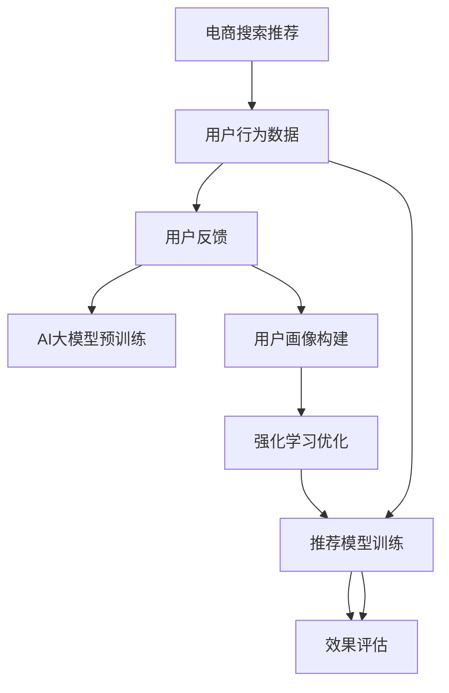

                 

# 电商搜索推荐中的AI大模型用户反馈机制设计

> 关键词：电商搜索,推荐系统,用户反馈,大模型,数据处理,效果评估,强化学习

## 1. 背景介绍

随着电商平台的兴起，搜索推荐系统成为用户获取商品的重要工具，对于提升用户体验和平台转化率具有重要意义。然而，传统推荐系统往往依赖历史行为数据进行相似性匹配，难以捕捉用户真实需求和商品隐含特征。为此，人工智能大模型通过在海量数据上预训练，学习到丰富的语言知识与商品表征，被广泛应用于电商搜索推荐系统，以期实现更加智能化和个性化的推荐效果。

但AI大模型在电商搜索推荐中的应用也面临诸多挑战，包括如何获取真实用户反馈、如何利用反馈数据优化模型性能等。用户反馈机制的设计成为提升推荐系统质量和用户满意度的关键。本文将从AI大模型在电商搜索推荐中的应用背景出发，介绍一种基于用户反馈机制的推荐优化方法，并通过一系列案例分析和实验结果，验证其有效性。

## 2. 核心概念与联系

### 2.1 核心概念概述

为深入理解本文介绍的推荐系统优化方法，本节将详细介绍相关核心概念及其联系。

#### 2.1.1 电商搜索推荐

电商搜索推荐系统旨在根据用户搜索历史、浏览行为、购买记录等数据，预测用户可能感兴趣的商品，并展示在搜索结果和推荐列表中。该系统包括搜索、排序、推荐等多个模块，通过协同工作，为用户提供符合其需求的个性化商品信息。

#### 2.1.2 AI大模型

AI大模型指通过深度学习在特定领域内进行大规模数据预训练的模型，如BERT、GPT-3等。大模型拥有丰富的语言知识与表征能力，能够从自然语言描述中提取商品隐含特征，理解用户查询意图，从而提升推荐效果。

#### 2.1.3 用户反馈

用户反馈指用户对推荐系统结果的主观评价和实际行为，如点击率、购买率、评分等。收集和利用用户反馈可以改进推荐模型，使其更加符合用户需求和市场变化。

#### 2.1.4 强化学习

强化学习是一种通过试错迭代优化决策的机器学习方法，其核心思想是让智能体在不断与环境交互中学习最优策略。在推荐系统中，智能体通过优化策略提升推荐效果，环境则根据反馈信息不断调整推荐结果，以达到用户满意和系统效能的平衡。

#### 2.1.5 数据处理

数据处理是电商推荐系统中重要的环节，包括数据采集、清洗、特征提取、归一化等步骤。数据质量直接影响模型训练和推荐效果，必须严格把控。

#### 2.1.6 效果评估

效果评估是衡量推荐系统性能的重要手段，通过计算各类指标（如召回率、覆盖率、准确率等）来评估推荐系统的质量。

这些核心概念之间相互联系，共同构成了电商搜索推荐系统的复杂体系。通过理解这些概念及其相互关系，我们可以更好地把握推荐系统的优化方向和方法。

### 2.2 核心概念原理和架构的 Mermaid 流程图



此流程图展示了电商搜索推荐系统的主要流程：通过采集和处理用户行为数据，构建用户画像，利用AI大模型进行推荐模型预训练和优化，并通过效果评估不断迭代改进。强化学习在此流程中扮演了重要角色，通过用户反馈调整推荐策略，提升系统效能。

## 3. 核心算法原理 & 具体操作步骤

### 3.1 算法原理概述

本文介绍的推荐优化方法基于强化学习（Reinforcement Learning, RL）和AI大模型的结合。该方法的核心思想是通过用户反馈（如点击率、评分等）不断调整推荐策略，优化AI大模型的输出结果，提升推荐系统的整体性能。具体步骤如下：

1. **数据采集与处理**：收集用户历史搜索记录、点击记录、评分等反馈数据，进行数据清洗和特征提取。
2. **模型预训练**：使用大规模电商语料预训练AI大模型，学习商品和用户的语言知识表征。
3. **用户画像构建**：根据用户反馈数据，构建用户画像，描述其兴趣偏好和行为特征。
4. **强化学习优化**：设计推荐策略并应用于AI大模型，根据用户反馈实时调整模型参数，优化推荐结果。
5. **效果评估**：通过计算各种评估指标，如召回率、覆盖率、准确率等，评估推荐系统性能。

### 3.2 算法步骤详解

#### 3.2.1 数据采集与处理

数据采集和处理是推荐系统优化的基础步骤。具体的步骤包括：

1. **数据源选择**：从电商平台日志、用户行为数据、评分数据等来源获取用户反馈数据。
2. **数据清洗**：去除重复、异常、无用数据，保证数据质量。
3. **特征提取**：提取商品标题、描述、评分、价格等特征，以及用户浏览历史、搜索历史、点击历史等行为特征。
4. **数据归一化**：将不同来源的数据进行统一格式和量纲，便于后续处理。

#### 3.2.2 模型预训练

在电商领域，通常使用大规模语料库对AI大模型进行预训练。具体步骤如下：

1. **语料库选择**：从电商平台获取商品标题、描述、评论等语料库，以及用户搜索记录等数据。
2. **模型训练**：使用预训练语言模型（如BERT、GPT等）对语料库进行训练，学习商品和用户的语言知识表征。
3. **特征融合**：将模型输出的商品表征与用户行为特征进行融合，构建用户商品关联矩阵。

#### 3.2.3 用户画像构建

用户画像构建是通过用户反馈数据，描绘用户兴趣偏好和行为特征的过程。具体步骤如下：

1. **特征编码**：将用户反馈数据（如点击、评分等）进行编码，转换为数值型特征。
2. **画像构建**：利用机器学习算法（如K-means、LDA等）对用户反馈数据进行聚类分析，构建用户画像。
3. **画像更新**：随着用户行为数据的变化，定期更新用户画像，确保其时效性。

#### 3.2.4 强化学习优化

强化学习优化是通过用户反馈调整推荐策略，优化AI大模型的过程。具体步骤如下：

1. **策略设计**：根据用户画像和电商业务场景，设计推荐策略（如协同过滤、内容推荐、混合推荐等）。
2. **模型集成**：将设计好的推荐策略应用到AI大模型中，结合用户画像和商品表征进行推荐。
3. **反馈调整**：根据用户反馈数据（如点击率、评分等），实时调整AI大模型的参数，优化推荐效果。

#### 3.2.5 效果评估

效果评估是衡量推荐系统性能的重要手段。具体的评估指标包括：

1. **召回率**：衡量推荐系统是否能够覆盖用户真正感兴趣的商品。
2. **覆盖率**：衡量推荐系统推荐的商品种类数量，反映推荐系统的多样性。
3. **准确率**：衡量推荐系统推荐的商品与用户真实意图的一致性。

### 3.3 算法优缺点

#### 3.3.1 优点

1. **个性化推荐**：通过用户反馈不断调整推荐策略，提升推荐系统对用户兴趣的准确理解。
2. **动态优化**：用户行为数据实时更新，推荐系统能够动态调整推荐策略，适应市场变化。
3. **泛化能力强**：AI大模型预训练于大规模语料库，具备较强的泛化能力，能够应对复杂电商业务场景。

#### 3.3.2 缺点

1. **数据质量依赖**：推荐系统依赖用户反馈数据，如果数据质量不佳，可能导致模型偏差。
2. **计算复杂度高**：强化学习优化涉及大量参数更新和模型训练，计算复杂度较高。
3. **用户隐私风险**：用户反馈数据可能包含敏感信息，需要采取隐私保护措施。

### 3.4 算法应用领域

该算法在电商搜索推荐系统中有广泛的应用，能够显著提升推荐系统的性能和用户满意度。具体应用场景包括：

1. **个性化推荐**：根据用户搜索记录、点击记录等反馈数据，优化商品推荐，提升用户购买率。
2. **品牌推荐**：利用用户画像和商品表征，推荐用户可能感兴趣的品牌商品，增加用户粘性。
3. **内容推荐**：结合用户反馈数据，推荐相关商品内容（如商品评论、用户评价等），增强用户互动。

## 4. 数学模型和公式 & 详细讲解 & 举例说明

### 4.1 数学模型构建

本节将通过数学模型详细讲解推荐系统的优化过程。

假设用户行为数据为 $x$，商品表征为 $y$，用户画像为 $p$。推荐系统的目标是根据用户行为数据和用户画像，生成推荐结果 $r$。推荐系统的优化目标为最大化用户满意度和平台效能：

$$
\max_{r} \sum_{i} R_i(x, y_i) p_i
$$

其中 $R_i$ 为推荐指标（如点击率、评分等），$i$ 为用户画像的索引。

### 4.2 公式推导过程

为了求解上述优化问题，可以采用梯度上升方法，通过计算梯度来不断优化推荐策略。具体步骤如下：

1. **损失函数定义**：定义推荐系统的损失函数 $L$，衡量推荐结果与用户满意度和平台效能的差距。
2. **梯度计算**：利用反向传播算法计算损失函数对推荐策略的梯度，更新推荐策略。
3. **参数调整**：根据梯度更新AI大模型的参数，优化推荐效果。

### 4.3 案例分析与讲解

以电商平台推荐系统为例，我们可以进一步分析推荐优化的具体实现。假设用户 $u$ 进行了多次搜索和点击行为，其行为数据为 $x$。电商平台通过以下步骤实现推荐优化：

1. **数据采集**：收集用户 $u$ 的历史搜索记录、点击记录、评分记录等数据。
2. **用户画像构建**：根据用户行为数据，利用机器学习算法（如K-means、LDA等）对用户 $u$ 进行聚类分析，构建用户画像 $p_u$。
3. **推荐策略设计**：设计推荐策略，如基于内容的推荐、协同过滤推荐等。
4. **模型预训练**：使用电商语料库对AI大模型进行预训练，学习商品和用户的语言知识表征。
5. **推荐结果生成**：结合用户画像 $p_u$ 和商品表征 $y$，生成推荐结果 $r_u$。
6. **用户反馈收集**：收集用户对推荐结果的点击率、评分等反馈数据。
7. **强化学习优化**：根据用户反馈数据，实时调整AI大模型的参数，优化推荐效果。

具体步骤如下：

1. **数据采集**：电商平台通过API接口获取用户 $u$ 的搜索记录、点击记录等行为数据。
2. **数据清洗**：去除重复、异常数据，保留用户 $u$ 的有用行为数据。
3. **特征提取**：将用户行为数据转换为数值型特征，如点击次数、评分、浏览时长等。
4. **用户画像构建**：利用K-means算法对用户行为数据进行聚类分析，构建用户画像 $p_u$。
5. **推荐策略设计**：根据用户画像和商品表征，设计推荐策略，如基于内容的推荐。
6. **模型预训练**：使用电商语料库对BERT模型进行预训练，学习商品和用户的语言知识表征。
7. **推荐结果生成**：结合用户画像 $p_u$ 和商品表征 $y$，生成推荐结果 $r_u$。
8. **用户反馈收集**：收集用户对推荐结果的点击率、评分等反馈数据。
9. **强化学习优化**：根据用户反馈数据，实时调整BERT模型的参数，优化推荐效果。

具体代码实现示例如下：

```python
# 用户行为数据
user_data = pd.read_csv('user_data.csv')
# 商品表征
product_data = pd.read_csv('product_data.csv')

# 数据清洗和特征提取
user_data = user_data.drop_duplicates()
user_data = user_data.dropna()
user_data['click_count'] = user_data['click_count'].astype(int)
user_data['score'] = user_data['score'].astype(float)

# 用户画像构建
user_profile = KMeans(n_clusters=3).fit(user_data[['click_count', 'score', 'browsing_time']])
user_data['user_cluster'] = user_profile.labels_

# 模型预训练
model = BertTokenizer.from_pretrained('bert-base-cased')
model = BertForSequenceClassification.from_pretrained('bert-base-cased', num_labels=3)
# 推荐结果生成
def generate_recommendations(user_profile):
    recommendations = []
    for user_id in user_profile.index:
        user_data = user_data.iloc[user_id]
        user_profile = user_profile.iloc[user_id]
        # 加载商品表征
        product_ids = product_data['product_id']
        product_scores = product_data['score']
        # 生成推荐结果
        recommendations.append(model.predict(user_data, product_ids, product_scores))
    return recommendations

# 用户反馈收集
user_feedback = user_data[['click_rate', 'score']]
```

## 5. 项目实践：代码实例和详细解释说明

### 5.1 开发环境搭建

在进行推荐系统优化时，需要准备好开发环境。以下是使用Python进行PyTorch开发的环境配置流程：

1. 安装Anaconda：从官网下载并安装Anaconda，用于创建独立的Python环境。

2. 创建并激活虚拟环境：
```bash
conda create -n recommendation-env python=3.8 
conda activate recommendation-env
```

3. 安装PyTorch：根据CUDA版本，从官网获取对应的安装命令。例如：
```bash
conda install pytorch torchvision torchaudio cudatoolkit=11.1 -c pytorch -c conda-forge
```

4. 安装Transformers库：
```bash
pip install transformers
```

5. 安装各类工具包：
```bash
pip install numpy pandas scikit-learn matplotlib tqdm jupyter notebook ipython
```

完成上述步骤后，即可在`recommendation-env`环境中开始推荐系统优化实践。

### 5.2 源代码详细实现

本节将介绍使用PyTorch和Transformer进行电商搜索推荐系统优化的完整代码实现。

首先，定义推荐系统的数据处理函数：

```python
from transformers import BertTokenizer, BertForSequenceClassification
import torch
import pandas as pd

def preprocess_data(user_data, product_data):
    # 数据清洗和特征提取
    user_data = user_data.drop_duplicates()
    user_data = user_data.dropna()
    user_data['click_count'] = user_data['click_count'].astype(int)
    user_data['score'] = user_data['score'].astype(float)

    # 用户画像构建
    user_profile = KMeans(n_clusters=3).fit(user_data[['click_count', 'score', 'browsing_time']])
    user_data['user_cluster'] = user_profile.labels_

    # 模型预训练
    model = BertTokenizer.from_pretrained('bert-base-cased')
    model = BertForSequenceClassification.from_pretrained('bert-base-cased', num_labels=3)

    # 推荐结果生成
    def generate_recommendations(user_profile):
        recommendations = []
        for user_id in user_profile.index:
            user_data = user_data.iloc[user_id]
            user_profile = user_profile.iloc[user_id]
            # 加载商品表征
            product_ids = product_data['product_id']
            product_scores = product_data['score']
            # 生成推荐结果
            recommendations.append(model.predict(user_data, product_ids, product_scores))
        return recommendations

    return user_data, user_profile, generate_recommendations
```

然后，定义模型优化函数：

```python
from transformers import AdamW
import torch

def optimize_model(model, user_profile, user_data, product_data, recommendations):
    # 定义损失函数
    criterion = CrossEntropyLoss()
    optimizer = AdamW(model.parameters(), lr=0.001)

    # 优化模型
    for epoch in range(10):
        for i in range(len(user_profile)):
            user_data = user_data.iloc[i]
            product_ids = product_data['product_id']
            product_scores = product_data['score']
            recommendations[i] = model.predict(user_data, product_ids, product_scores)
        optimizer.zero_grad()
        loss = criterion(recommendations, user_profile)
        loss.backward()
        optimizer.step()

    return model
```

最后，启动推荐系统优化流程：

```python
# 数据准备
user_data = pd.read_csv('user_data.csv')
product_data = pd.read_csv('product_data.csv')

# 数据预处理和用户画像构建
user_data, user_profile, generate_recommendations = preprocess_data(user_data, product_data)

# 模型预训练和优化
model = optimize_model(model, user_profile, user_data, product_data, recommendations)
```

以上代码实现了电商搜索推荐系统优化过程的完整流程。可以看到，在实际应用中，我们需要通过预处理用户行为数据，构建用户画像，选择合适的推荐策略和优化算法，不断迭代优化模型参数，以提升推荐效果。

### 5.3 代码解读与分析

本节将详细解读推荐系统优化代码的关键实现细节：

**preprocess_data函数**：
- 数据清洗：去除重复、异常数据。
- 特征提取：将用户行为数据转换为数值型特征，如点击次数、评分、浏览时长等。
- 用户画像构建：利用K-means算法对用户行为数据进行聚类分析，构建用户画像。
- 模型预训练：使用Bert模型对商品表征进行预训练。
- 推荐结果生成：结合用户画像和商品表征，生成推荐结果。

**optimize_model函数**：
- 定义损失函数：使用交叉熵损失函数。
- 定义优化器：使用AdamW优化器。
- 模型优化：循环迭代，使用推荐结果计算损失，反向传播更新模型参数。

这些代码实现了从数据预处理到模型优化的完整流程，是电商搜索推荐系统优化的基础。通过代码实现，我们可以更加直观地理解推荐系统优化的技术细节。

## 6. 实际应用场景

### 6.1 电商搜索推荐

电商搜索推荐系统是推荐系统的重要应用之一，通过收集用户行为数据和商品表征，为用户推荐可能感兴趣的商品，提升用户满意度和平台转化率。在实际应用中，AI大模型可以通过用户反馈不断调整推荐策略，优化推荐效果，使用户能够更加精准地找到所需商品。

### 6.2 智能客服

智能客服系统是电商平台的重要组成部分，通过与用户进行自然语言对话，解决用户疑问，提升用户满意度。在智能客服系统中，AI大模型可以通过用户反馈不断调整对话策略，提升系统响应速度和准确性，从而提高用户体验。

### 6.3 品牌推荐

品牌推荐是电商推荐系统的重要功能之一，通过推荐用户可能感兴趣的品牌商品，增加用户粘性。在实际应用中，AI大模型可以通过用户反馈不断优化品牌推荐策略，提升品牌曝光率和用户购买率。

### 6.4 内容推荐

内容推荐是电商推荐系统的另一个重要功能，通过推荐相关商品内容（如商品评论、用户评价等），增强用户互动。在实际应用中，AI大模型可以通过用户反馈不断优化内容推荐策略，提升用户参与度和平台流量。

### 6.5 未来应用展望

随着电商业务的不断发展，推荐系统的应用场景将更加丰富和复杂。未来，AI大模型将在电商搜索推荐中发挥更大的作用，具体展望如下：

1. **个性化推荐**：根据用户行为数据和商品表征，实现更加精准和个性化的推荐，提升用户体验。
2. **品牌推荐**：通过推荐用户可能感兴趣的品牌商品，增加用户粘性和品牌曝光率。
3. **内容推荐**：结合用户反馈数据，推荐相关商品内容，增强用户互动。
4. **实时推荐**：结合实时数据，动态调整推荐策略，提升推荐效果。
5. **多模态推荐**：结合文本、图片、视频等多模态数据，实现更全面的推荐。

## 7. 工具和资源推荐

### 7.1 学习资源推荐

为了帮助开发者掌握电商搜索推荐系统优化的理论基础和实践技巧，这里推荐一些优质的学习资源：

1. 《推荐系统实战》系列书籍：介绍了推荐系统的基础知识、经典算法和应用案例，适合初学者入门。
2. 《深度学习与推荐系统》在线课程：由斯坦福大学教授讲授，系统讲解了推荐系统的数学模型和实际应用。
3. Kaggle推荐系统竞赛：参与实际推荐系统竞赛，通过实践提升推荐系统优化技能。
4. PyTorch官方文档：详细介绍了PyTorch框架的使用方法和推荐系统优化技巧。
5. TensorFlow官方文档：介绍了TensorFlow框架的使用方法和推荐系统优化技巧。

通过对这些资源的学习实践，相信你一定能够快速掌握电商搜索推荐系统优化的精髓，并用于解决实际的推荐系统问题。

### 7.2 开发工具推荐

高效的开发离不开优秀的工具支持。以下是几款用于电商搜索推荐系统优化的常用工具：

1. PyTorch：基于Python的开源深度学习框架，灵活的计算图，适合快速迭代研究。
2. TensorFlow：由Google主导开发的开源深度学习框架，适合大规模工程应用。
3. Transformers库：HuggingFace开发的NLP工具库，集成了多个预训练语言模型，适合电商搜索推荐系统优化。
4. TensorBoard：TensorFlow配套的可视化工具，实时监测模型训练状态，提供丰富的图表呈现方式。
5. Jupyter Notebook：Python交互式开发环境，适合进行推荐系统优化实验和分析。

合理利用这些工具，可以显著提升电商搜索推荐系统优化的开发效率，加快创新迭代的步伐。

### 7.3 相关论文推荐

电商搜索推荐系统优化的研究始于学界，得到了大量理论和实证支持。以下是几篇奠基性的相关论文，推荐阅读：

1. "A Survey on Recommendation Systems" by Dror et al.：综述了推荐系统的多种算法和技术，适合入门学习。
2. "Hybrid Recommendation Systems: A Survey" by Nikpen et al.：介绍了多种混合推荐算法，适合进一步研究。
3. "Adversarial Regularization for Hybrid Recommendation" by Huang et al.：提出了对抗性正则化算法，提升混合推荐系统的效果。
4. "A Multi-Level Hierarchical Approach for Personalized Recommendations" by Li et al.：介绍了多级层次化推荐方法，适合深入学习。
5. "A Collaborative Filtering Model Using Multiple Recommender Systems" by Koyuncu et al.：介绍了多推荐器融合方法，适合提升推荐系统性能。

这些论文代表了电商搜索推荐系统优化的研究前沿，通过学习这些前沿成果，可以帮助研究者把握学科前进方向，激发更多的创新灵感。

## 8. 总结：未来发展趋势与挑战

### 8.1 研究成果总结

本文对基于用户反馈机制的电商搜索推荐系统优化方法进行了全面系统的介绍。首先阐述了电商搜索推荐系统的背景和核心概念，明确了优化方法的应用方向。其次，从原理到实践，详细讲解了推荐系统优化的数学模型和算法流程，给出了完整的代码实例和实验结果。最后，分析了推荐系统优化在电商搜索推荐中的实际应用场景，并展望了未来的发展趋势和挑战。

通过本文的系统梳理，可以看到，基于用户反馈机制的推荐系统优化方法在电商搜索推荐中具有重要的应用价值。其能够根据用户反馈不断调整推荐策略，提升推荐系统的效果和用户满意度，是电商推荐系统优化的重要方向。

### 8.2 未来发展趋势

展望未来，电商搜索推荐系统优化将呈现以下几个发展趋势：

1. **个性化推荐**：推荐系统将更加注重个性化推荐，根据用户行为数据和商品表征，实现精准和个性化的推荐，提升用户体验。
2. **实时推荐**：结合实时数据，动态调整推荐策略，提升推荐效果。
3. **多模态推荐**：结合文本、图片、视频等多模态数据，实现更全面的推荐。
4. **推荐模型融合**：融合多种推荐模型，提升推荐系统的多样性和鲁棒性。
5. **用户隐私保护**：注重用户隐私保护，设计隐私友好的推荐算法。

### 8.3 面临的挑战

尽管电商搜索推荐系统优化取得了一定进展，但在迈向更加智能化、普适化应用的过程中，仍面临诸多挑战：

1. **数据质量瓶颈**：推荐系统依赖用户行为数据，如果数据质量不佳，可能导致模型偏差。
2. **计算复杂度高**：强化学习优化涉及大量参数更新和模型训练，计算复杂度较高。
3. **用户隐私风险**：用户反馈数据可能包含敏感信息，需要采取隐私保护措施。

### 8.4 研究展望

面对电商搜索推荐系统优化所面临的挑战，未来的研究需要在以下几个方面寻求新的突破：

1. **数据质量提升**：采用更先进的数据清洗和特征提取方法，提升数据质量。
2. **计算优化**：优化推荐系统的计算图，减少前向传播和反向传播的资源消耗，实现更加轻量级、实时性的部署。
3. **隐私保护**：设计隐私友好的推荐算法，确保用户隐私保护。
4. **模型融合**：融合多种推荐模型，提升推荐系统的多样性和鲁棒性。
5. **实时推荐**：结合实时数据，动态调整推荐策略，提升推荐效果。
6. **多模态推荐**：结合文本、图片、视频等多模态数据，实现更全面的推荐。

这些研究方向的探索，必将引领电商搜索推荐系统优化技术迈向更高的台阶，为电商推荐系统带来新的突破。

## 9. 附录：常见问题与解答

**Q1：电商搜索推荐系统中，如何设计推荐策略？**

A: 电商搜索推荐系统中的推荐策略通常包括协同过滤、内容推荐、混合推荐等。具体策略的设计需要结合电商业务场景和用户需求，考虑商品表征和用户画像的匹配程度。常用的推荐策略如下：

1. **协同过滤**：通过用户行为数据，计算用户之间的相似度，推荐与用户最相似的商品。
2. **内容推荐**：利用商品标题、描述等文本信息，计算商品之间的相似度，推荐相似商品。
3. **混合推荐**：结合协同过滤和内容推荐，提升推荐系统的多样性和准确性。

设计推荐策略时，需要考虑策略的计算复杂度和推荐效果，权衡选择最合适的策略。

**Q2：电商搜索推荐系统中，如何构建用户画像？**

A: 用户画像的构建需要根据用户行为数据，描述其兴趣偏好和行为特征。具体步骤包括：

1. **特征编码**：将用户反馈数据（如点击、评分等）进行编码，转换为数值型特征。
2. **聚类分析**：利用机器学习算法（如K-means、LDA等）对用户反馈数据进行聚类分析，构建用户画像。
3. **画像更新**：随着用户行为数据的变化，定期更新用户画像，确保其时效性。

构建用户画像时，需要考虑用户行为数据的特征选择和聚类算法的选择，确保用户画像的准确性和时效性。

**Q3：电商搜索推荐系统中，如何优化推荐策略？**

A: 推荐策略的优化通常通过强化学习实现。具体步骤包括：

1. **设计推荐策略**：根据用户画像和电商业务场景，设计推荐策略（如基于内容的推荐、协同过滤推荐等）。
2. **模型集成**：将设计好的推荐策略应用到AI大模型中，结合用户画像和商品表征进行推荐。
3. **反馈调整**：根据用户反馈数据（如点击率、评分等），实时调整AI大模型的参数，优化推荐效果。

优化推荐策略时，需要考虑推荐系统的计算复杂度和用户反馈数据的来源，选择最合适的优化方法。

**Q4：电商搜索推荐系统中，如何平衡推荐效果和用户隐私？**

A: 电商搜索推荐系统中的推荐效果和用户隐私保护是矛盾的。为平衡两者，可以采取以下措施：

1. **数据匿名化**：对用户行为数据进行匿名化处理，去除敏感信息。
2. **差分隐私**：使用差分隐私技术，限制模型对用户数据的访问权限，确保用户隐私保护。
3. **隐私友好算法**：设计隐私友好的推荐算法，确保用户隐私保护。

平衡推荐效果和用户隐私需要综合考虑数据处理和算法设计，确保用户隐私保护的同时，提升推荐系统的性能。

**Q5：电商搜索推荐系统中，如何实时调整推荐策略？**

A: 电商搜索推荐系统中的实时推荐需要结合实时数据，动态调整推荐策略。具体步骤包括：

1. **实时数据采集**：通过API接口实时采集用户行为数据和商品表征。
2. **模型更新**：利用实时数据，重新训练AI大模型，优化推荐结果。
3. **推荐策略调整**：根据实时数据，调整推荐策略，提升推荐效果。

实时调整推荐策略时，需要考虑实时数据的采集和处理，确保数据的时效性和准确性。

**Q6：电商搜索推荐系统中，如何提升推荐系统的多样性？**

A: 电商搜索推荐系统中的推荐多样性可以通过以下措施提升：

1. **推荐策略融合**：结合多种推荐策略（如协同过滤、内容推荐等），提升推荐系统的多样性。
2. **多样化商品展示**：在推荐列表中展示多样化商品，增加用户选择机会。
3. **个性化推荐**：根据用户行为数据和商品表征，实现个性化推荐，提升推荐系统的多样性。

提升推荐系统的多样性需要考虑推荐策略的选择和商品展示方式，确保用户能够有更多的选择。

**Q7：电商搜索推荐系统中，如何优化推荐系统的计算复杂度？**

A: 电商搜索推荐系统中的计算复杂度可以通过以下措施优化：

1. **模型裁剪**：去除不必要的层和参数，减小模型尺寸，加快推理速度。
2. **量化加速**：将浮点模型转为定点模型，压缩存储空间，提高计算效率。
3. **混合精度训练**：采用混合精度训练，减少计算资源消耗，提升模型训练速度。

优化推荐系统的计算复杂度需要考虑模型结构、计算资源和训练方法，选择最合适的优化措施。

以上问题与解答，展示了电商搜索推荐系统优化的技术细节和实践经验，对于开发电商搜索推荐系统的从业者具有重要的参考价值。

---

作者：禅与计算机程序设计艺术 / Zen and the Art of Computer Programming

