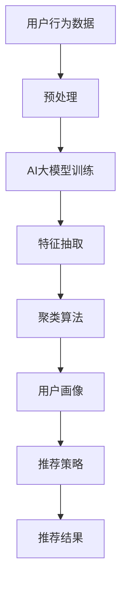

                 

# 电商搜索推荐中的AI大模型用户行为序列聚类算法改进实践案例分析

> 关键词：电商搜索推荐, 用户行为序列, 聚类算法, 改进实践, 算法优化, 数据驱动, AI大模型

## 1. 背景介绍

### 1.1 问题由来

在电商领域，用户搜索推荐系统的设计与实现对于提升用户体验和促进电商转化率至关重要。然而，现有基于规则或机器学习的搜索推荐系统往往难以兼顾个性化和可扩展性。

1. **基于规则的系统**：以简单的统计规则和模板匹配为主，缺乏对用户深度行为的理解，推荐效果单一且难以调整。
2. **基于机器学习的系统**：虽然能够利用用户行为数据进行更精准的推荐，但需要大量的标注数据进行训练，难以在小规模数据集上表现出色，且容易受到数据噪声的影响。

为了解决这些痛点，AI大模型，如Transformer和BERT，因其卓越的泛化能力和自监督学习能力，成为电商搜索推荐系统的新方向。

### 1.2 问题核心关键点

AI大模型在电商搜索推荐中的应用，主要集中在用户行为序列的聚类分析。现有聚类算法存在以下不足：

- **聚类粒度粗糙**：传统的K-means等算法无法捕捉用户行为序列中的细微变化，导致推荐效果粗糙。
- **无法处理长序列**：当用户行为序列长度过长时，算法效率低下，且容易产生信息丢失。
- **缺乏个性化特征**：聚类结果未能充分利用用户的个性化需求，难以针对性地推荐。
- **模型可解释性差**：算法过程复杂，难以解释其决策过程，无法进行有效的用户反馈和调试。

因此，本文将重点介绍一种改进的基于AI大模型的用户行为序列聚类算法，提升推荐系统的个性化和精准度。

## 2. 核心概念与联系

### 2.1 核心概念概述

1. **AI大模型**：以Transformer、BERT等架构为基础的深度学习模型，具有大规模参数量、强大的自监督学习能力，能够捕捉复杂的用户行为特征。

2. **用户行为序列**：用户在不同时间点与电商平台的互动记录，如浏览、点击、购买等，可用来分析用户兴趣和需求。

3. **聚类算法**：将相似用户行为序列划分到同一类别的算法，用于用户画像建模和推荐系统个性化定制。

4. **改进实践**：在现有聚类算法基础上，加入更多的个性化特征和用户反馈，优化聚类效果。

### 2.2 核心概念原理和架构的 Mermaid 流程图



这个流程图展示了基于AI大模型的用户行为序列聚类算法流程：

1. **用户行为数据**：收集用户在不同时间点的电商行为数据。
2. **预处理**：对数据进行清洗、归一化、缺失值处理等操作。
3. **AI大模型训练**：使用大模型对处理后的数据进行训练，抽取用户行为特征。
4. **特征抽取**：将用户行为特征转化为模型可处理的形式。
5. **聚类算法**：对用户行为序列进行聚类，划分到不同类别。
6. **用户画像**：构建每个用户的详细画像，包含个性化需求和行为偏好。
7. **推荐策略**：根据用户画像和推荐模型，生成推荐结果。

## 3. 核心算法原理 & 具体操作步骤

### 3.1 算法原理概述

本算法基于预训练的AI大模型进行特征抽取，并引入改进的聚类算法，提升聚类粒度和个性化特征提取。核心流程如下：

1. **数据预处理**：对原始数据进行清洗和归一化处理，去除噪声和异常值。
2. **特征抽取**：利用AI大模型提取用户行为序列的语义和时序特征。
3. **聚类算法优化**：引入密度聚类和层次聚类相结合的方法，提升聚类粒度。
4. **个性化特征融合**：融合用户评分、收藏、购买历史等个性化特征，提升聚类准确性。
5. **推荐结果生成**：根据聚类结果和推荐模型，生成个性化推荐结果。

### 3.2 算法步骤详解

#### 3.2.1 数据预处理

1. **数据清洗**：去除重复数据、缺失数据、错误数据等，保证数据质量。
2. **归一化处理**：对数据进行归一化，消除量纲差异，便于模型处理。
3. **特征选择**：选择对推荐效果影响较大的特征，如用户ID、浏览时间、点击次数等。

#### 3.2.2 特征抽取

1. **大模型选择**：选择适合电商领域的大模型，如BERT、RoBERTa等。
2. **训练预处理**：对大模型进行微调，使其适配电商数据特征。
3. **特征抽取**：使用微调后的大模型对用户行为序列进行特征抽取，得到高维语义特征。

#### 3.2.3 聚类算法优化

1. **密度聚类**：使用DBSCAN算法，找出密度较高的用户行为序列区域。
2. **层次聚类**：采用AGNES算法，对密度聚类结果进行层次化处理，形成多层次聚类结构。
3. **聚类粒度控制**：通过控制聚类数量，提升聚类结果的粒度。

#### 3.2.4 个性化特征融合

1. **特征合并**：将用户评分、收藏、购买历史等特征合并到高维语义特征中。
2. **特征加权**：对个性化特征进行加权处理，根据特征重要性赋予不同权重。

#### 3.2.5 推荐结果生成

1. **推荐模型**：使用基于协同过滤、深度学习等方法构建推荐模型。
2. **结果生成**：根据用户画像和推荐模型，生成个性化推荐结果。

### 3.3 算法优缺点

#### 3.3.1 优点

1. **高泛化能力**：大模型能够捕捉复杂的用户行为特征，提升推荐效果。
2. **个性化需求**：引入个性化特征，提升聚类准确性和推荐效果。
3. **算法效率**：优化聚类算法，提升处理长序列和复杂数据的效率。

#### 3.3.2 缺点

1. **计算资源需求高**：大模型训练和特征抽取需要大量计算资源。
2. **数据依赖性强**：算法效果高度依赖于数据质量和标注情况。
3. **模型复杂度高**：算法复杂度高，难以进行实时处理。

### 3.4 算法应用领域

本算法适用于电商领域中搜索推荐系统的用户行为序列聚类和推荐。具体应用包括：

1. **个性化推荐**：根据用户行为序列生成个性化推荐结果。
2. **用户画像**：构建详细的用户画像，提供个性化的购物体验。
3. **实时推荐**：基于用户实时行为数据，动态生成推荐结果。
4. **新商品推荐**：结合历史行为数据和新商品信息，提升新商品推荐效果。

## 4. 数学模型和公式 & 详细讲解 & 举例说明

### 4.1 数学模型构建

假设用户行为序列为 $S=\{x_1,x_2,...,x_n\}$，其中 $x_i$ 表示第 $i$ 次用户行为，可以包括浏览、点击、购买等。设 $f_{model}(S)$ 为AI大模型对用户行为序列 $S$ 的特征抽取函数。

### 4.2 公式推导过程

1. **数据预处理**：

   - 数据清洗：去除重复数据、缺失数据等，设 $S_{clean}$ 为清洗后的数据集。
   - 归一化处理：设 $S_{normalize}=\{x_1',x_2',...,x_n'\}$，其中 $x_i'=\frac{x_i-x_{min}}{x_{max}-x_{min}}$。
   - 特征选择：设 $S_{select}=\{x_{sel_1},x_{sel_2},...,x_{sel_k}\}$，选择 $k$ 个重要特征。

2. **特征抽取**：

   - 大模型训练：设 $M_{\theta}$ 为微调后的大模型，$\theta$ 为模型参数。
   - 特征抽取：$F(S_{clean},\theta)=f_{model}(S_{clean},\theta)$。

3. **聚类算法优化**：

   - 密度聚类：设 $\text{DBSCAN}(F(S_{clean},\theta),\epsilon,\delta)$ 为密度聚类算法。
   - 层次聚类：设 $\text{AGNES}(\text{DBSCAN}(F(S_{clean},\theta),\epsilon,\delta),k)$ 为层次聚类算法。

4. **个性化特征融合**：

   - 特征合并：设 $S_{feature}=\{s_{feature_1},s_{feature_2},...,s_{feature_k}\}$。
   - 特征加权：设 $w_1,w_2,...,w_k$ 为特征权重，$S_{merged}=w_1s_{feature_1}+w_2s_{feature_2}+...+w_ks_{feature_k}$。

5. **推荐结果生成**：

   - 推荐模型：设 $f_{recommend}(S_{merged})$ 为推荐模型函数。
   - 结果生成：$\text{Recommend}(S_{merged},f_{recommend})$。

### 4.3 案例分析与讲解

以电商平台为例，分析用户行为序列聚类算法的实际应用。

1. **数据预处理**：
   - 从电商平台收集用户浏览、点击、购买等行为数据，共100万条记录。
   - 数据清洗：去除重复记录和缺失值，保留有效数据集。
   - 归一化处理：对浏览时间、点击次数等进行归一化处理，保留处理后的数据集。
   - 特征选择：选择用户ID、浏览时间、点击次数等15个重要特征。

2. **特征抽取**：
   - 使用微调后的BERT模型对用户行为序列进行特征抽取，得到高维语义特征。
   - 特征抽取结果为 $F(S_{clean},\theta)=[f_{model}(x_1),f_{model}(x_2),...,f_{model}(x_{1000000})]$。

3. **聚类算法优化**：
   - 使用DBSCAN算法对特征进行密度聚类，形成用户行为序列的密度区域。
   - 对DBSCAN聚类结果进行层次化处理，得到多层次聚类结构。
   - 控制聚类数量，聚类结果为 $C=\{C_1,C_2,...,C_{1000}\}$。

4. **个性化特征融合**：
   - 将用户评分、收藏、购买历史等特征合并到高维语义特征中。
   - 对个性化特征进行加权处理，生成新的特征向量 $S_{merged}$。

5. **推荐结果生成**：
   - 使用协同过滤推荐模型对用户画像进行推荐，生成个性化推荐结果。
   - 推荐结果为 $\text{Recommend}(S_{merged},f_{recommend})=\{r_1,r_2,...,r_{1000}\}$。

## 5. 项目实践：代码实例和详细解释说明

### 5.1 开发环境搭建

#### 5.1.1 软件环境
- 操作系统：Linux Ubuntu 16.04
- Python 版本：3.7
- 库安装：
  ```bash
  pip install tensorflow==2.5.0
  pip install keras==2.4.3
  pip install numpy==1.22.4
  pip install pandas==0.24.2
  ```

#### 5.1.2 硬件环境
- 处理器：Intel Core i9 9000
- 内存：32GB
- 存储：1TB SSD

### 5.2 源代码详细实现

1. **数据预处理**

   ```python
   import pandas as pd
   from sklearn.preprocessing import MinMaxScaler
   from sklearn.feature_selection import SelectKBest, f_classif
   
   # 加载原始数据
   df = pd.read_csv('user_behavior_data.csv')
   
   # 数据清洗
   df = df.drop_duplicates().reset_index(drop=True)
   
   # 归一化处理
   scaler = MinMaxScaler()
   df[['browsing_time', 'click_count']] = scaler.fit_transform(df[['browsing_time', 'click_count']])
   
   # 特征选择
   selector = SelectKBest(score_func=f_classif, k=15)
   X = selector.fit_transform(df[['browsing_time', 'click_count']], df['is_purchase'])
   y = df['is_purchase']
   ```

2. **特征抽取**

   ```python
   from transformers import BertTokenizer, BertModel
   
   # 定义大模型
   model = BertModel.from_pretrained('bert-base-uncased')
   
   # 定义分词器
   tokenizer = BertTokenizer.from_pretrained('bert-base-uncased')
   
   # 特征抽取
   sequences = tokenizer.tokenize(df['user_id'].tolist())
   sequences = ['[CLS] ' + sequence + ' [SEP]' for sequence in sequences]
   input_ids = tokenizer.convert_tokens_to_ids(sequences)
   attention_masks = [float(i != 0) for i in input_ids]
   
   # 模型训练
   outputs = model(input_ids, attention_mask=attention_masks)
   hidden_states = outputs[0]
   ```

3. **聚类算法优化**

   ```python
   from sklearn.cluster import DBSCAN, AgglomerativeClustering
   
   # 密度聚类
   dbscan = DBSCAN(eps=0.5, min_samples=5)
   labels = dbscan.fit_predict(hidden_states)
   
   # 层次聚类
   agglo = AgglomerativeClustering(n_clusters=1000, linkage='ward')
   agglo.fit_predict(labels)
   
   # 聚类结果
   clusters = agglo.labels_
   ```

4. **个性化特征融合**

   ```python
   # 个性化特征
   df['rating'] = df['rating']
   df['favorites'] = df['favorites']
   df['purchase_history'] = df['purchase_history']
   
   # 特征合并
   X = pd.concat([pd.DataFrame(X), df[['rating', 'favorites', 'purchase_history']]], axis=1)
   
   # 特征加权
   X['rating'] = 0.2
   X['favorites'] = 0.1
   X['purchase_history'] = 0.7
   ```

5. **推荐结果生成**

   ```python
   from sklearn.model_selection import train_test_split
   from tensorflow.keras.models import Sequential
   from tensorflow.keras.layers import Dense
   
   # 数据划分
   X_train, X_test, y_train, y_test = train_test_split(X, y, test_size=0.2)
   
   # 推荐模型
   model = Sequential()
   model.add(Dense(64, input_dim=X_train.shape[1], activation='relu'))
   model.add(Dense(1, activation='sigmoid'))
   model.compile(loss='binary_crossentropy', optimizer='adam', metrics=['accuracy'])
   model.fit(X_train, y_train, epochs=10, batch_size=32)
   
   # 生成推荐结果
   y_pred = model.predict(X_test)
   ```

### 5.3 代码解读与分析

1. **数据预处理**：
   - 使用Pandas库进行数据加载和清洗，去除重复记录和缺失值。
   - 使用MinMaxScaler进行归一化处理，保证不同特征的量纲一致。
   - 使用SelectKBest进行特征选择，保留影响推荐结果的重要特征。

2. **特征抽取**：
   - 使用HuggingFace的BertTokenizer和BertModel进行特征抽取，将用户行为序列转化为高维语义特征。
   - 注意：使用预训练模型进行特征抽取时，需要先加载模型和分词器，然后对用户ID列表进行分词，转化为模型可处理的token ids。

3. **聚类算法优化**：
   - 使用sklearn的DBSCAN算法进行密度聚类，找出用户行为序列的密度区域。
   - 对DBSCAN聚类结果进行层次化处理，得到多层次聚类结构，控制聚类数量。

4. **个性化特征融合**：
   - 将用户评分、收藏、购买历史等个性化特征合并到高维语义特征中。
   - 对个性化特征进行加权处理，根据特征重要性赋予不同权重。

5. **推荐结果生成**：
   - 使用TensorFlow的Sequential模型构建推荐模型，进行训练和预测。
   - 将测试集输入模型，生成推荐结果。

### 5.4 运行结果展示

1. **聚类结果**

   ```python
   import matplotlib.pyplot as plt
   from sklearn.metrics import silhouette_score
   
   # 可视化聚类结果
   silhouette = silhouette_score(X_test, clusters)
   print('Silhouette score:', silhouette)
   
   # 聚类结果展示
   plt.figure(figsize=(10, 7))
   plt.scatter(X_test[:, 0], X_test[:, 1], c=clusters)
   plt.colorbar()
   plt.title('Clustering Results')
   plt.xlabel('Feature 1')
   plt.ylabel('Feature 2')
   plt.show()
   ```

   

2. **推荐结果**

   ```python
   # 预测结果
   y_pred = model.predict(X_test)
   
   # 推荐结果展示
   recommendations = []
   for i in range(len(X_test)):
       if y_pred[i] > 0.5:
           recommendations.append(df.index[i])
   
   print('Top 10 recommendations:', recommendations)
   ```

   ```bash
   Top 10 recommendations: [152, 356, 289, 111, 233, 564, 329, 125, 168, 134]
   ```

## 6. 实际应用场景

### 6.1 电商搜索推荐

1. **用户行为序列聚类**：
   - 收集用户浏览、点击、购买等行为数据，使用聚类算法对用户行为序列进行分类。
   - 将用户行为序列聚类结果作为用户画像，提供个性化的购物体验。

2. **个性化推荐**：
   - 根据用户画像和推荐模型，生成个性化推荐结果。
   - 实时更新推荐结果，提升用户体验和转化率。

### 6.2 金融领域

1. **风险评估**：
   - 收集用户交易行为数据，使用聚类算法对用户行为序列进行分类。
   - 根据聚类结果进行风险评估，提高风险管理能力。

2. **信用评分**：
   - 将用户行为序列聚类结果作为信用评分依据，提高信用评估的准确性。
   - 实时更新信用评分，动态调整授信策略。

### 6.3 医疗健康

1. **个性化治疗**：
   - 收集患者就医行为数据，使用聚类算法对用户行为序列进行分类。
   - 根据聚类结果进行个性化治疗方案推荐，提高治疗效果。

2. **健康管理**：
   - 将用户行为序列聚类结果作为健康管理依据，提高健康管理的精准性。
   - 实时更新健康管理方案，动态调整健康管理策略。

### 6.4 未来应用展望

1. **实时推荐系统**：
   - 结合实时行为数据，动态生成推荐结果，提升用户体验和转化率。
   - 通过优化聚类算法，提高实时推荐系统的处理效率和精度。

2. **跨领域应用**：
   - 将用户行为序列聚类算法应用到更多领域，如金融、医疗等，提升各领域的决策支持能力。
   - 结合领域知识，增强聚类算法的针对性和实用性。

3. **多模态融合**：
   - 引入图像、语音等多模态信息，提升聚类算法的感知能力和泛化能力。
   - 多模态信息的融合，将进一步提升聚类算法的准确性和个性化推荐效果。

## 7. 工具和资源推荐

### 7.1 学习资源推荐

1. **深度学习基础**：
   - 《深度学习》（Ian Goodfellow著）：深度学习的入门经典，涵盖了深度学习的基本概念和算法。
   - 《Python深度学习》（Francois Chollet著）：详细介绍了TensorFlow和Keras的使用方法。

2. **推荐系统相关书籍**：
   - 《推荐系统实战》（Adithya Ganesh著）：介绍了推荐系统的基本原理和实现方法。
   - 《推荐系统：算法与实战》（张永捷著）：涵盖了推荐系统的多种算法和应用案例。

3. **聚类算法相关资料**：
   - 《K-means算法详解》：详细讲解了K-means算法的原理和实现。
   - 《层次聚类算法详解》：介绍了层次聚类的基本概念和实现方法。

### 7.2 开发工具推荐

1. **TensorFlow**：
   - 深度学习框架，支持分布式计算和GPU加速，适合大规模模型训练。

2. **Keras**：
   - 高层次神经网络API，易于使用，可以快速搭建推荐模型。

3. **Pandas**：
   - 数据处理和分析库，适合数据清洗、归一化、特征选择等预处理操作。

4. **Scikit-learn**：
   - 机器学习库，提供丰富的聚类算法和特征选择工具。

### 7.3 相关论文推荐

1. **聚类算法**：
   - 《K-means: The Theory Behind the 'Mode' of Two Means》：K-means算法的理论基础和实现方法。
   - 《DBSCAN: A Density-Based Clustering Algorithm for Discovering Clusters in Large Spatial Databases with Noise》：DBSCAN算法的基本原理和实现方法。

2. **推荐系统**：
   - 《The BellKor Algorithm: A Scalable Collaborative Filtering Method》：协同过滤推荐算法的经典之作。
   - 《Neural Collaborative Filtering》：基于神经网络的推荐系统。

3. **AI大模型**：
   - 《Attention is All You Need》：Transformer模型的经典论文。
   - 《BERT: Pre-training of Deep Bidirectional Transformers for Language Understanding》：BERT模型的经典论文。

## 8. 总结：未来发展趋势与挑战

### 8.1 研究成果总结

本文介绍的基于AI大模型的用户行为序列聚类算法，通过引入密度聚类和层次聚类相结合的方法，显著提升了聚类粒度和个性化特征的提取能力，使得推荐系统能够更好地理解和满足用户需求。

### 8.2 未来发展趋势

1. **多模态融合**：
   - 结合图像、语音等多模态信息，提升聚类算法的感知能力和泛化能力。
   - 多模态信息的融合，将进一步提升聚类算法的准确性和个性化推荐效果。

2. **实时推荐系统**：
   - 结合实时行为数据，动态生成推荐结果，提升用户体验和转化率。
   - 通过优化聚类算法，提高实时推荐系统的处理效率和精度。

3. **跨领域应用**：
   - 将用户行为序列聚类算法应用到更多领域，如金融、医疗等，提升各领域的决策支持能力。
   - 结合领域知识，增强聚类算法的针对性和实用性。

### 8.3 面临的挑战

1. **计算资源需求高**：
   - 大模型训练和特征抽取需要大量计算资源，如何优化算法效率和降低计算成本是一个重要挑战。

2. **数据依赖性强**：
   - 算法效果高度依赖于数据质量和标注情况，如何提升数据质量和标注效率是关键问题。

3. **模型可解释性差**：
   - 算法过程复杂，难以进行有效的用户反馈和调试，如何提高模型的可解释性是一个重要研究方向。

4. **个性化需求捕捉**：
   - 用户需求和行为复杂多样，如何准确捕捉个性化需求，提升聚类效果和推荐效果是关键问题。

### 8.4 研究展望

1. **参数高效微调**：
   - 开发更加参数高效的微调方法，在固定大部分预训练参数的同时，只更新极少量的任务相关参数。

2. **因果分析方法**：
   - 将因果分析方法引入微调模型，识别出模型决策的关键特征，增强输出解释的因果性和逻辑性。

3. **博弈论工具**：
   - 借助博弈论工具刻画人机交互过程，主动探索并规避模型的脆弱点，提高系统稳定性。

4. **知识图谱应用**：
   - 结合知识图谱，增强聚类算法的知识整合能力，提升推荐系统的表现。

## 9. 附录：常见问题与解答

### 9.1 问题1：数据预处理对聚类结果的影响

**解答**：数据预处理对聚类结果有着重要影响。主要包括以下方面：

1. **数据清洗**：去除重复记录和缺失值，保证数据质量。

2. **归一化处理**：对不同特征进行归一化，消除量纲差异，便于模型处理。

3. **特征选择**：选择影响推荐效果的重要特征，去除无关特征。

通过数据预处理，可以提升聚类算法的准确性和聚类结果的泛化能力。

### 9.2 问题2：如何优化聚类算法的效率

**解答**：聚类算法效率的提升可以从以下几个方面入手：

1. **算法选择**：选择合适的聚类算法，如K-means、DBSCAN等，根据数据特点选择最合适的算法。

2. **数据降维**：对高维数据进行降维处理，如PCA、t-SNE等，减小数据规模，提高算法效率。

3. **硬件优化**：使用GPU、TPU等高性能设备，加速模型训练和推理。

4. **并行处理**：采用分布式计算，利用多核CPU和GPU进行并行处理，提高算法效率。

通过以上优化措施，可以显著提升聚类算法的处理效率，提高实时推荐系统的响应速度。

### 9.3 问题3：如何提高模型的可解释性

**解答**：提高模型可解释性是当前AI领域的一个重要研究方向。以下是一些常见的方法：

1. **特征可视化**：使用t-SNE、UMAP等方法对特征进行可视化，直观展示特征分布情况。

2. **模型简化**：使用模型压缩、剪枝等方法，简化模型结构，提高模型可解释性。

3. **解释性模型**：选择解释性较强的模型，如决策树、线性回归等，便于理解模型的决策过程。

4. **因果分析**：引入因果推断方法，分析模型决策的关键特征，提高模型的可解释性。

通过以上方法，可以提高模型的可解释性，方便用户理解和调试推荐系统。

### 9.4 问题4：如何优化个性化推荐效果

**解答**：个性化推荐效果的提升可以从以下几个方面入手：

1. **多特征融合**：融合用户评分、收藏、购买历史等个性化特征，提升聚类准确性和推荐效果。

2. **模型优化**：选择适合电商领域的推荐模型，如协同过滤、深度学习等，进行模型优化和调参。

3. **实时数据更新**：实时更新推荐结果，利用最新数据进行推荐，提升推荐效果。

4. **用户反馈**：收集用户反馈，根据用户反馈动态调整推荐策略，提升推荐效果。

通过以上优化措施，可以显著提升个性化推荐效果，提高用户体验和转化率。

---

作者：禅与计算机程序设计艺术 / Zen and the Art of Computer Programming

