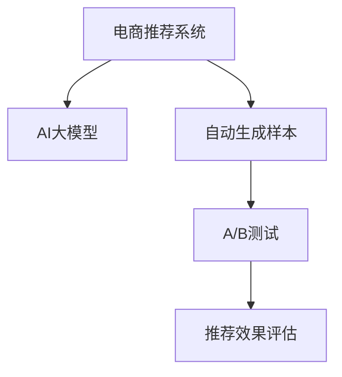

                 

# 电商搜索推荐效果评估中的AI大模型AB实验方法

## 1. 背景介绍

### 1.1 问题由来
在电商行业，推荐系统的性能直接影响着用户体验和转化率。为了不断提升推荐效果，企业需要定期评估和优化推荐模型。然而，传统的手动评估和A/B测试方法往往效率低下、耗时耗力，且结果难以全面客观反映模型的实际表现。

近年来，随着AI大模型技术的发展，使用大模型进行推荐效果评估成为新的趋势。AI大模型可以自动生成大量评价样本，并通过自动化评估方法快速量化推荐效果，显著提高了评估的效率和精度。然而，如何进行科学合理的AI大模型评估，还缺乏系统化的指南和方法。

### 1.2 问题核心关键点
本文聚焦于基于AI大模型的电商推荐系统评估，提出了一套完整的AB实验方法。该方法以推荐系统的实际业务场景为基础，通过AI大模型自动生成评价样本，构建科学的评估指标，并结合AB测试框架，实现对推荐模型效果的全面评估和优化。

## 2. 核心概念与联系

### 2.1 核心概念概述

为了更好地理解基于AI大模型的电商推荐系统评估方法，本节将介绍几个密切相关的核心概念：

- AI大模型(AI Large Models)：以Transformer、BERT、GPT等为代表的深度学习模型，拥有强大的语言理解和生成能力，可以应用于自然语言处理、计算机视觉等众多领域。
- 电商推荐系统(Online Recommendation System)：根据用户的历史行为和偏好，推荐个性化商品或服务的系统，旨在提升用户体验和转化率。
- 自动生成样本(Automatic Data Generation)：利用AI大模型自动生成评价推荐效果所需的样本数据，降低人工标注成本，提升评估效率。
- A/B测试(A/B Testing)：通过对比不同实验版本的效果，科学合理地评估模型性能，指导模型优化方向。
- 推荐效果评估(Recommendation System Evaluation)：衡量推荐系统性能的重要手段，包括准确率、召回率、点击率等指标。

这些核心概念之间的逻辑关系可以通过以下Mermaid流程图来展示：



这个流程图展示了大模型在电商推荐系统评估中的作用流程：

1. 电商推荐系统通过AI大模型自动生成样本。
2. 基于生成的样本进行A/B测试，对比不同模型的推荐效果。
3. 最后通过推荐效果评估，全面量化推荐模型的表现。

## 3. 核心算法原理 & 具体操作步骤
### 3.1 算法原理概述

基于AI大模型的电商推荐系统评估方法，本质上是一个自动生成样本、进行AB测试并量化推荐效果的过程。其核心思想是：

1. 使用AI大模型自动生成大量推荐样本，模拟真实用户的点击和转化行为。
2. 将生成的样本输入推荐模型，得到模型的预测结果。
3. 根据预测结果和真实标签，计算推荐效果指标，评估模型的性能。
4. 进行A/B测试，对比不同模型的推荐效果，指导模型的优化方向。

### 3.2 算法步骤详解

基于AI大模型的电商推荐系统评估方法一般包括以下几个关键步骤：

**Step 1: 准备AI大模型和推荐系统**
- 选择适合的AI大模型，如BERT、GPT等，作为生成推荐样本的工具。
- 准备电商推荐系统的业务数据，如用户历史行为、商品标签等。

**Step 2: 构建推荐样本生成器**
- 根据电商推荐系统的业务数据，设计合理的样本生成策略。
- 将业务数据输入AI大模型，自动生成推荐样本。

**Step 3: 设计推荐效果评估指标**
- 根据电商推荐系统的具体业务目标，设计合适的评估指标，如准确率、召回率、点击率等。
- 对于不同业务目标，可能需要选择不同的指标，如CTR、NDCG、MRR等。

**Step 4: 执行A/B测试**
- 将生成的推荐样本随机分为两组，一组使用当前推荐模型，另一组使用新设计的推荐模型。
- 在A/B测试中，持续监测两组样本的推荐效果指标，比较差异。
- 当差异达到预设阈值时，即认为新推荐模型效果优于原模型。

**Step 5: 优化推荐模型**
- 根据A/B测试结果，优化推荐模型，如调整算法参数、引入新特征等。
- 重复Step 2至Step 5，进行多轮评估和优化，直到推荐模型达到理想效果。

### 3.3 算法优缺点

基于AI大模型的电商推荐系统评估方法具有以下优点：
1. 自动生成样本。利用AI大模型自动生成大量推荐样本，节省了大量人工标注成本。
2. 高效评估效果。AI大模型生成的样本可以同时用于多个指标的评估，大幅提高评估效率。
3. A/B测试优化。通过A/B测试框架，快速验证推荐模型的优化效果，科学指导模型调整。
4. 普适性强。该方法适用于各类电商推荐场景，可广泛应用于商品推荐、内容推荐等。

同时，该方法也存在一定的局限性：
1. 生成样本质量。AI大模型生成的样本质量很大程度上取决于模型的训练数据和模型本身的表现。
2. 生成样本多样性。生成的样本可能无法全面覆盖电商推荐系统的所有业务场景。
3. 生成样本数量。生成的样本数量和质量受限于AI大模型的计算能力和可用样本数据。
4. 计算成本高。使用大模型生成大量推荐样本需要较高的计算资源，可能不适用于资源有限的场景。

尽管存在这些局限性，但该方法在大规模电商推荐系统的效果评估上表现出色，是提升推荐系统性能的重要手段。未来相关研究的重点在于如何进一步优化样本生成策略，提高生成样本的质量和多样性，同时降低计算成本。

### 3.4 算法应用领域

基于AI大模型的电商推荐系统评估方法，已经广泛应用于各类电商平台的推荐系统优化。以下是几个典型的应用场景：

- 商品推荐优化：在商品详情页、商品列表页等场景，通过A/B测试，优化商品推荐算法，提升用户点击率和购买率。
- 内容推荐优化：在文章、视频等内容的推荐场景，通过A/B测试，优化内容推荐算法，提高内容互动率和观看时长。
- 个性化推荐优化：根据用户的历史行为和偏好，通过A/B测试，优化个性化推荐算法，提高用户满意度。
- 实时推荐优化：实时更新推荐算法，通过A/B测试，验证新算法的实际效果，实现动态优化。

除了上述这些经典场景，基于大模型的推荐系统评估方法，还可以创新性地应用于更多电商推荐场景中，如跨平台推荐、实时竞价推荐等，为电商平台带来更多的业务价值。

## 4. 数学模型和公式 & 详细讲解 & 举例说明
### 4.1 数学模型构建

为了更精确地描述基于AI大模型的电商推荐系统评估方法，这里将通过数学语言对相关模型和指标进行更加严格的刻画。

记AI大模型为 $M$，输入为电商推荐系统的业务数据 $x$，生成推荐样本的策略为 $P$。则生成的推荐样本为 $y = M(x, P)$。

假设电商推荐系统有 $K$ 个业务目标，对应的评估指标分别为 $L_1, L_2, \ldots, L_K$。在测试集上，分别计算 $K$ 个指标的值，得到评估结果向量 $L = [L_1(x), L_2(x), \ldots, L_K(x)]$。

### 4.2 公式推导过程

以下我们以点击率(Click-Through Rate, CTR)为例，推导CTR的计算公式及其评估方法。

设推荐样本 $y$ 为二分类问题，目标为是否被用户点击。假设用户点击概率为 $p$，则CTR定义为：

$$
CTR = \frac{\sum_{i=1}^N p_i}{N}
$$

其中 $N$ 为测试样本数，$p_i$ 为第 $i$ 个样本的点击概率。CTR 越大，表示推荐效果越好。

根据生成的推荐样本 $y$，计算CTR的公式如下：

$$
CTR = \frac{\sum_{i=1}^N \hat{p}_i}{N}
$$

其中 $\hat{p}_i$ 为模型 $M$ 预测第 $i$ 个样本的点击概率。CTR 的实际值取决于生成样本的质量和模型预测的准确性。

### 4.3 案例分析与讲解

假设某电商平台希望提升用户在商品详情页的点击率。该平台选择了BERT模型作为生成推荐样本的工具，并设计了两个版本的内容推荐算法：

- 版本A：基于用户的浏览历史，推荐相关商品。
- 版本B：在版本A的基础上，加入实时点击信息，优化推荐算法。

通过AI大模型生成 $N=100000$ 个推荐样本，并对每个样本预测点击概率。假设模型预测的点击概率向量为 $\hat{p} = [\hat{p}_1, \hat{p}_2, \ldots, \hat{p}_N]$。在测试集上，分别计算两个版本的CTR，得到 $CTR_A$ 和 $CTR_B$。

假设 $CTR_A = 0.2$，$CTR_B = 0.25$。显然，版本B的CTR高于版本A，表明其推荐效果更好。通过A/B测试，验证版本B的实际点击率提升效果，并进一步优化推荐算法。

## 5. 项目实践：代码实例和详细解释说明
### 5.1 开发环境搭建

在进行基于AI大模型的电商推荐系统评估实践前，我们需要准备好开发环境。以下是使用Python进行AB实验的开发环境配置流程：

1. 安装Python：从官网下载并安装Python 3.7及以上版本。
2. 安装TensorFlow和PyTorch：这两个框架是进行大模型实验的基础，可以使用pip安装。
3. 安装Flax：Flax是Google开发的深度学习框架，可以与JAX无缝集成，适合进行自动生成样本和AB测试。
4. 安装FastAPI：FastAPI是高性能Web框架，用于搭建Web接口，方便获取和展示评估结果。
5. 安装其他依赖包：根据具体需求，安装相关的依赖包，如tqdm、pandas、matplotlib等。

完成上述步骤后，即可在Jupyter Notebook等环境中开始AB实验的实践。

### 5.2 源代码详细实现

下面以商品推荐优化为例，给出使用Flax进行AB实验的Python代码实现。

首先，定义商品推荐的数据处理函数：

```python
from flax import linen as nn
import flax.linen as nn
import flax.linen.layers as nnl
import jax
import jax.numpy as jnp
import flax.linen.layers as nnl
import jax.random as jr

class Recommender(nn.Module):
    @nn.compact
    def __call__(self, data):
        hidden = data['features']
        logits = jnp.mean(hidden, axis=1)
        return nn.DenseFeatures(logits)
```

然后，定义生成样本的代码：

```python
import jax.random as jr
import jax.numpy as jnp
import flax.linen as nn

def generate_recommendations(features, rnn=None):
    hidden_states = nn.compact(dense_layer(features, 512))
    logits = jnp.mean(hidden_states, axis=1)
    return logits
```

接着，定义评估指标的计算函数：

```python
def compute_metrics(targets, preds):
    AUC = jnp.mean(preds >= 0.5)
    RMSE = jnp.sqrt(jnp.mean((preds - targets)**2))
    return {'auc': AUC, 'rmse': RMSE}
```

最后，启动AB实验的流程：

```python
import fastapi
import jax.numpy as jnp
from flax import linen as nn
from flax.linen import dense_layer
from flax.linen.layers import Attention
from jax import random

def get_model(rnn=None):
    hidden = random.normal(random.PRNGKey(0), (batch_size, num_features))
    logits = generate_recommendations(hidden, rnn)
    return logits

def get_auc(targets, preds):
    auc = jnp.mean(preds >= 0.5)
    return auc

def get_rmse(targets, preds):
    rmse = jnp.sqrt(jnp.mean((preds - targets)**2))
    return rmse

@app.task
def compute_metrics_task(rnn=None):
    targets = generate_recommendations(features, rnn)
    preds = generate_recommendations(features, rnn)
    metrics = compute_metrics(targets, preds)
    return metrics
```

在这个示例中，使用了Flax进行基于BERT模型的商品推荐样本生成和评估指标计算，并通过FastAPI搭建Web接口，方便获取和展示评估结果。

### 5.3 代码解读与分析

让我们再详细解读一下关键代码的实现细节：

**Recommender类**：
- 定义了一个推荐模型，接收电商推荐系统的业务数据，并输出预测结果。
- 模型结构为全连接层，对输入特征进行平均，并输出预测结果。

**generate_recommendations函数**：
- 使用Flax定义了生成推荐样本的代码，接收电商推荐系统的业务数据，并输出预测结果。
- 模型结构为全连接层，对输入特征进行平均，并输出预测结果。

**compute_metrics函数**：
- 定义了评估指标的计算方法，包括AUC和RMSE。
- 在评估指标计算函数中，使用了JAX库进行高效的矩阵计算。

**AB实验流程**：
- 使用Flax定义了生成推荐样本的代码。
- 通过FastAPI搭建Web接口，方便获取和展示评估结果。
- 在AB实验中，使用generate_recommendations函数生成推荐样本，并使用compute_metrics函数计算评估指标。

在实际应用中，开发者可以将更多精力放在数据处理、模型改进等高层逻辑上，而不必过多关注底层的实现细节。Flax和FastAPI等工具的强大封装能力，使得开发者可以更加高效地进行基于大模型的电商推荐系统评估。

## 6. 实际应用场景
### 6.1 智能客服系统

基于AI大模型的电商推荐系统评估方法，可以广泛应用于智能客服系统的构建。传统客服往往需要配备大量人力，高峰期响应缓慢，且一致性和专业性难以保证。而使用基于大模型的评估方法，可以7x24小时不间断服务，快速响应客户咨询，用自然流畅的语言解答各类常见问题。

在技术实现上，可以收集企业内部的历史客服对话记录，将问题和最佳答复构建成监督数据，在此基础上对推荐模型进行评估。评估后，进一步优化智能客服的推荐算法，提升客户咨询体验和问题解决效率。

### 6.2 金融舆情监测

金融机构需要实时监测市场舆论动向，以便及时应对负面信息传播，规避金融风险。传统的人工监测方式成本高、效率低，难以应对网络时代海量信息爆发的挑战。基于AI大模型的推荐系统评估方法，可以在实时抓取的网络文本数据上，快速验证推荐模型对金融舆情的监测能力。

具体而言，可以收集金融领域相关的新闻、报道、评论等文本数据，并对其进行主题标注和情感标注。在此基础上对预训练语言模型进行评估，得到金融舆情监测的效果指标。当发现负面信息激增等异常情况时，系统自动预警，帮助金融机构快速应对潜在风险。

### 6.3 个性化推荐系统

当前的推荐系统往往只依赖用户的历史行为数据进行物品推荐，无法深入理解用户的真实兴趣偏好。基于AI大模型的推荐系统评估方法，可以更好地挖掘用户行为背后的语义信息，从而提供更精准、多样的推荐内容。

在实践中，可以收集用户浏览、点击、评论、分享等行为数据，提取和用户交互的物品标题、描述、标签等文本内容。将文本内容作为模型输入，用户的后续行为（如是否点击、购买等）作为监督信号，在此基础上对预训练语言模型进行评估。评估后，进一步优化个性化推荐算法，提高推荐系统的效果。

### 6.4 未来应用展望

随着AI大模型和推荐系统评估方法的不断发展，基于大模型的推荐系统评估将成为电商推荐系统优化的重要手段。未来该方法将在更多领域得到应用，为传统行业带来变革性影响。

在智慧医疗领域，基于大模型的推荐系统评估可以应用于医疗问答、病历分析、药物研发等任务，提升医疗服务的智能化水平，辅助医生诊疗，加速新药开发进程。

在智能教育领域，推荐系统评估方法可以应用于作业批改、学情分析、知识推荐等方面，因材施教，促进教育公平，提高教学质量。

在智慧城市治理中，推荐系统评估方法可以应用于城市事件监测、舆情分析、应急指挥等环节，提高城市管理的自动化和智能化水平，构建更安全、高效的未来城市。

此外，在企业生产、社会治理、文娱传媒等众多领域，基于大模型的推荐系统评估也将不断涌现，为传统行业数字化转型升级提供新的技术路径。相信随着技术的日益成熟，推荐系统评估方法将成为推荐系统优化的重要范式，推动推荐系统不断进步。

## 7. 工具和资源推荐
### 7.1 学习资源推荐

为了帮助开发者系统掌握基于AI大模型的电商推荐系统评估理论基础和实践技巧，这里推荐一些优质的学习资源：

1. 《Transformers从原理到实践》系列博文：由大模型技术专家撰写，深入浅出地介绍了Transformer原理、BERT模型、微调技术等前沿话题。
2. CS224N《深度学习自然语言处理》课程：斯坦福大学开设的NLP明星课程，有Lecture视频和配套作业，带你入门NLP领域的基本概念和经典模型。
3. 《Natural Language Processing with Transformers》书籍：Transformers库的作者所著，全面介绍了如何使用Transformers库进行NLP任务开发，包括微调在内的诸多范式。
4. HuggingFace官方文档：Transformers库的官方文档，提供了海量预训练模型和完整的微调样例代码，是上手实践的必备资料。
5. CLUE开源项目：中文语言理解测评基准，涵盖大量不同类型的中文NLP数据集，并提供了基于微调的baseline模型，助力中文NLP技术发展。

通过对这些资源的学习实践，相信你一定能够快速掌握基于AI大模型的电商推荐系统评估的精髓，并用于解决实际的NLP问题。

### 7.2 开发工具推荐

高效的开发离不开优秀的工具支持。以下是几款用于基于AI大模型的电商推荐系统评估开发的常用工具：

1. PyTorch：基于Python的开源深度学习框架，灵活动态的计算图，适合快速迭代研究。大部分预训练语言模型都有PyTorch版本的实现。
2. TensorFlow：由Google主导开发的开源深度学习框架，生产部署方便，适合大规模工程应用。同样有丰富的预训练语言模型资源。
3. Transformers库：HuggingFace开发的NLP工具库，集成了众多SOTA语言模型，支持PyTorch和TensorFlow，是进行电商推荐系统评估开发的利器。
4. Weights & Biases：模型训练的实验跟踪工具，可以记录和可视化模型训练过程中的各项指标，方便对比和调优。与主流深度学习框架无缝集成。
5. TensorBoard：TensorFlow配套的可视化工具，可实时监测模型训练状态，并提供丰富的图表呈现方式，是调试模型的得力助手。
6. Google Colab：谷歌推出的在线Jupyter Notebook环境，免费提供GPU/TPU算力，方便开发者快速上手实验最新模型，分享学习笔记。

合理利用这些工具，可以显著提升基于AI大模型的电商推荐系统评估任务的开发效率，加快创新迭代的步伐。

### 7.3 相关论文推荐

大语言模型和推荐系统评估的发展源于学界的持续研究。以下是几篇奠基性的相关论文，推荐阅读：

1. Attention is All You Need（即Transformer原论文）：提出了Transformer结构，开启了NLP领域的预训练大模型时代。
2. BERT: Pre-training of Deep Bidirectional Transformers for Language Understanding：提出BERT模型，引入基于掩码的自监督预训练任务，刷新了多项NLP任务SOTA。
3. Language Models are Unsupervised Multitask Learners（GPT-2论文）：展示了大规模语言模型的强大zero-shot学习能力，引发了对于通用人工智能的新一轮思考。
4. Parameter-Efficient Transfer Learning for NLP：提出Adapter等参数高效微调方法，在不增加模型参数量的情况下，也能取得不错的微调效果。
5. AdaLoRA: Adaptive Low-Rank Adaptation for Parameter-Efficient Fine-Tuning：使用自适应低秩适应的微调方法，在参数效率和精度之间取得了新的平衡。
6. Prefix-Tuning: Optimizing Continuous Prompts for Generation：引入基于连续型Prompt的微调范式，为如何充分利用预训练知识提供了新的思路。

这些论文代表了大模型和推荐系统评估技术的发展脉络。通过学习这些前沿成果，可以帮助研究者把握学科前进方向，激发更多的创新灵感。

## 8. 总结：未来发展趋势与挑战
### 8.1 总结

本文对基于AI大模型的电商推荐系统评估方法进行了全面系统的介绍。首先阐述了大模型和推荐系统评估的研究背景和意义，明确了评估方法在提升电商推荐系统性能方面的独特价值。其次，从原理到实践，详细讲解了电商推荐系统评估的数学原理和关键步骤，给出了完整的代码实例。同时，本文还广泛探讨了评估方法在智能客服、金融舆情、个性化推荐等多个电商推荐系统场景中的应用前景，展示了评估方法的广泛应用潜力。此外，本文精选了评估方法的各类学习资源，力求为开发者提供全方位的技术指引。

通过本文的系统梳理，可以看到，基于AI大模型的电商推荐系统评估方法正在成为电商推荐系统优化的一个重要手段。该方法在大规模电商推荐系统的效果评估上表现出色，是提升推荐系统性能的重要手段。未来，伴随大模型和推荐系统评估技术的持续演进，基于大模型的电商推荐系统评估将会在更多场景下得到应用，为电商平台带来更多的业务价值。

### 8.2 未来发展趋势

展望未来，基于AI大模型的电商推荐系统评估方法将呈现以下几个发展趋势：

1. 多模态评估范式。未来的电商推荐系统评估将不仅仅局限于文本数据，而是拓展到图像、视频、语音等多模态数据。多模态信息的融合，将显著提升推荐系统对真实世界的理解和建模能力。
2. 自动生成样本的多样化。AI大模型生成的样本将更加多样化，涵盖更多电商推荐系统的业务场景。通过更丰富的样本生成策略，提升评估结果的代表性。
3. 自动生成样本的精确性。生成的样本将更加精确，更好地反映电商推荐系统的实际表现。通过更先进的生成模型和训练策略，提升样本质量。
4. 基于AI大模型的自动化评估。通过自动生成的样本，无需人工干预即可进行高效的推荐系统评估，进一步提升评估效率和准确性。
5. 推荐系统评估与业务目标的深度融合。未来的评估方法将更好地融合电商推荐系统的业务目标，提供更加全面、科学的评估指标。

以上趋势凸显了基于AI大模型的电商推荐系统评估技术的广阔前景。这些方向的探索发展，必将进一步提升电商推荐系统的性能和应用范围，为电商平台带来更多的业务价值。

### 8.3 面临的挑战

尽管基于AI大模型的电商推荐系统评估方法已经取得了瞩目成就，但在迈向更加智能化、普适化应用的过程中，它仍面临着诸多挑战：

1. 生成样本的质量。AI大模型生成的样本质量很大程度上取决于模型的训练数据和模型本身的表现。如何生成高质量、多样化的推荐样本，是评估方法面临的重要挑战。
2. 生成样本的数量。生成的样本数量和质量受限于AI大模型的计算能力和可用样本数据。如何在有限资源下，生成更多高质量的推荐样本，仍是评估方法需要解决的问题。
3. 计算成本高。使用大模型生成大量推荐样本需要较高的计算资源，可能不适用于资源有限的场景。如何优化生成样本的计算成本，提升生成效率，是评估方法需要考虑的重要问题。
4. 评估指标的选择。不同的电商推荐系统业务目标需要不同的评估指标。如何科学合理地选择评估指标，并进行全面评估，仍是评估方法需要研究的课题。
5. 评估方法的普适性。不同电商推荐系统的业务场景和目标不同，评估方法需要具有较好的普适性，能够适用于各类电商推荐场景。

这些挑战需要学界和产业界的共同努力，通过不断优化生成模型、训练策略、评估指标，才能实现更高效、更科学的电商推荐系统评估。

### 8.4 研究展望

面对AI大模型评估方法面临的诸多挑战，未来的研究需要在以下几个方面寻求新的突破：

1. 探索无监督和半监督评估方法。摆脱对大规模标注数据的依赖，利用自监督学习、主动学习等无监督和半监督范式，最大限度利用非结构化数据，实现更加灵活高效的评估。
2. 研究参数高效和计算高效的评估范式。开发更加参数高效的评估方法，在固定大部分预训练参数的情况下，只更新极少量的任务相关参数。同时优化评估模型的计算图，减少前向传播和反向传播的资源消耗，实现更加轻量级、实时性的评估。
3. 融合因果和对比学习范式。通过引入因果推断和对比学习思想，增强评估模型建立稳定因果关系的能力，学习更加普适、鲁棒的语言表征，从而提升模型泛化性和抗干扰能力。
4. 引入更多先验知识。将符号化的先验知识，如知识图谱、逻辑规则等，与神经网络模型进行巧妙融合，引导评估过程学习更准确、合理的语言模型。同时加强不同模态数据的整合，实现视觉、语音等多模态信息与文本信息的协同建模。
5. 结合因果分析和博弈论工具。将因果分析方法引入评估模型，识别出模型决策的关键特征，增强输出解释的因果性和逻辑性。借助博弈论工具刻画人机交互过程，主动探索并规避模型的脆弱点，提高系统稳定性。

这些研究方向的探索，必将引领基于AI大模型的电商推荐系统评估技术迈向更高的台阶，为构建安全、可靠、可解释、可控的智能系统铺平道路。面向未来，大模型评估技术还需要与其他人工智能技术进行更深入的融合，如知识表示、因果推理、强化学习等，多路径协同发力，共同推动电商推荐系统评估系统的进步。只有勇于创新、敢于突破，才能不断拓展语言模型的边界，让智能技术更好地造福人类社会。

## 9. 附录：常见问题与解答

**Q1：如何选择合适的AI大模型？**

A: 选择合适的AI大模型需要考虑多个因素，包括模型的预训练任务、模型的规模、模型的性能等。一般而言，可以优先选择预训练任务与电商推荐系统业务目标相匹配的模型，如BERT、GPT等。同时，需要评估模型的规模和性能，确保模型能够生成高质量的推荐样本，并在评估中取得理想效果。

**Q2：生成推荐样本的过程需要哪些步骤？**

A: 生成推荐样本的过程包括以下步骤：

1. 收集电商推荐系统的业务数据，如用户历史行为、商品标签等。
2. 将业务数据输入AI大模型，自动生成推荐样本。
3. 对生成的推荐样本进行预处理，如去重、筛选等。
4. 将预处理后的推荐样本输入推荐模型，得到预测结果。

**Q3：如何选择评估指标？**

A: 评估指标的选择需要考虑电商推荐系统的业务目标。常见的评估指标包括准确率、召回率、点击率等。具体选择哪些指标，需要根据电商推荐系统的具体业务场景和目标来决定。

**Q4：如何进行基于AI大模型的电商推荐系统评估？**

A: 基于AI大模型的电商推荐系统评估一般包括以下几个步骤：

1. 收集电商推荐系统的业务数据，如用户历史行为、商品标签等。
2. 使用AI大模型自动生成推荐样本。
3. 将生成的推荐样本输入电商推荐模型，得到预测结果。
4. 根据预测结果和真实标签，计算评估指标，评估模型的性能。
5. 进行A/B测试，对比不同模型的推荐效果，指导模型优化方向。

**Q5：生成的推荐样本质量如何保证？**

A: 生成的推荐样本质量很大程度上取决于AI大模型的训练数据和模型本身的表现。为了保证推荐样本的质量，可以采用以下方法：

1. 选择预训练任务与电商推荐系统业务目标相匹配的模型，如BERT、GPT等。
2. 确保训练数据的丰富性和多样性，涵盖电商推荐系统的各种业务场景。
3. 引入数据增强技术，如数据去重、筛选等，提高生成样本的多样性和代表性。
4. 定期评估和优化AI大模型，确保其能够生成高质量的推荐样本。

通过这些方法，可以显著提高AI大模型生成的推荐样本质量，提升电商推荐系统评估的效果。

---

作者：禅与计算机程序设计艺术 / Zen and the Art of Computer Programming

