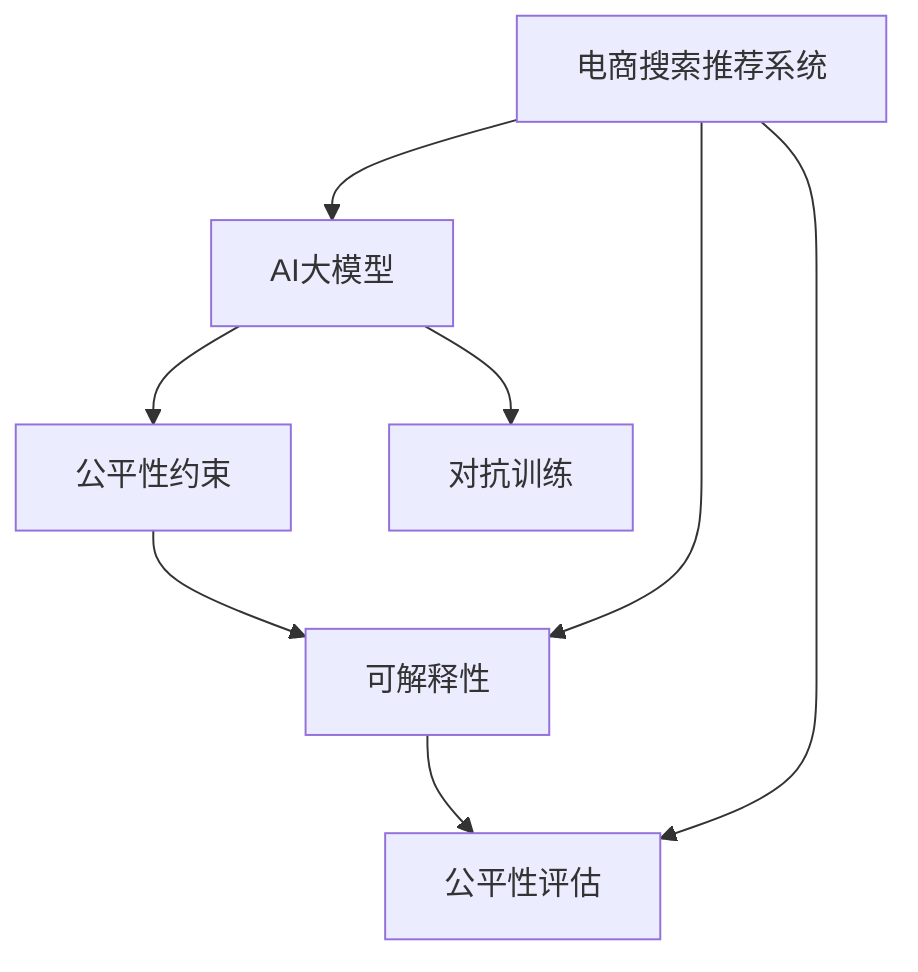

                 

# 电商搜索推荐效果评估中的AI大模型公平性评估技术

## 1. 背景介绍

随着电商平台的快速发展，AI驱动的搜索推荐系统成为支撑用户体验和商家收益的核心技术。然而，搜索推荐系统的公平性问题不容忽视，特别是对于不同背景和需求的消费者。如果不加以评估和改进，可能导致系统偏见、歧视性推荐，进而影响用户体验和电商生态的长期健康发展。

本文聚焦于AI大模型在电商搜索推荐中的应用，旨在提出一套全面、系统的公平性评估框架，帮助电商平台识别和缓解潜在偏见，确保AI推荐系统的公正性和透明性。通过本文的系统梳理，读者将全面理解AI大模型的公平性评估原理和实践方法，为构建公正、高效的电商搜索推荐系统提供指导。

## 2. 核心概念与联系

### 2.1 核心概念概述

为更好地理解AI大模型在电商搜索推荐中的应用和公平性评估，本节将介绍几个密切相关的核心概念：

- 电商搜索推荐系统：利用AI技术，对用户查询行为进行分析和理解，生成个性化的商品推荐列表，提升用户购物体验和商家转化率。

- AI大模型：以自回归(如GPT)或自编码(如BERT)模型为代表的预训练语言模型，通过在大规模无标签文本语料上进行预训练，学习通用的语言表示，具备强大的语言理解和生成能力。

- 公平性评估：评估AI系统在决策过程中是否存在偏见，保证不同背景和需求的消费者都能获得公平对待，确保系统无歧视性。

- 公平性约束：在模型训练和应用过程中，主动引入和满足公平性指标，降低系统偏见，提升系统公正性。

- 可解释性：使AI系统的决策过程可解释、可追溯，帮助用户理解系统的行为逻辑，增强信任感。

- 对抗训练：通过引入对抗样本，增强AI模型对不同用户群体的适应性和鲁棒性，避免对特定群体的偏见。

这些核心概念之间的逻辑关系可以通过以下Mermaid流程图来展示：



这个流程图展示了大模型在搜索推荐系统中的应用及其相关概念：

1. 电商搜索推荐系统利用AI大模型进行用户行为分析和商品推荐。
2. 大模型在预训练和微调过程中引入公平性约束，提升系统公正性。
3. 评估系统公平性，发现和修复潜在偏见。
4. 增强系统的可解释性，使用户理解决策过程。
5. 通过对抗训练，增强模型对不同用户群体的适应性。

这些概念共同构成了大模型在电商搜索推荐系统中的应用框架，使其能够公平、公正地为消费者服务。通过理解这些核心概念，我们可以更好地把握大模型在电商搜索推荐系统中的工作原理和优化方向。

## 3. 核心算法原理 & 具体操作步骤

### 3.1 算法原理概述

AI大模型在电商搜索推荐系统中的应用，本质上是一个通过预训练和微调过程，学习和适应特定电商任务，从而提升推荐效果的过程。然而，在这个过程中，大模型可能学习到数据分布中的偏见，导致推荐结果存在不公平性。因此，引入公平性评估机制，识别和缓解系统偏见，是保证系统公正性的关键。

形式化地，假设电商搜索推荐系统 $S$ 的训练集为 $D=\{(x_i,y_i)\}_{i=1}^N$，其中 $x_i$ 表示用户查询，$y_i$ 表示推荐列表，模型为 $M_{\theta}$，其中 $\theta$ 为模型参数。模型 $M_{\theta}$ 在输入 $x_i$ 上的输出为 $\hat{y_i} = M_{\theta}(x_i)$。假设系统存在公平性偏差，即不同背景和需求的消费者获得的推荐列表不公平。定义 $F_1$ 和 $F_2$ 为两个公平性指标，分别用于评估不同群体的推荐结果。

公平性评估的目标是找到一组参数 $\hat{\theta}$，使得系统满足公平性约束 $F_1$ 和 $F_2$，即：

$$
\hat{\theta}=\mathop{\arg\min}_{\theta} \mathcal{L}(\theta)+\alpha_1 F_1(\hat{y_i},y_i)+\alpha_2 F_2(\hat{y_i},y_i)
$$

其中 $\mathcal{L}(\theta)$ 为推荐系统在训练集 $D$ 上的损失函数，$\alpha_1$ 和 $\alpha_2$ 为公平性指标的权重。

### 3.2 算法步骤详解

基于公平性评估的AI大模型在电商搜索推荐系统中的应用，一般包括以下几个关键步骤：

**Step 1: 数据准备与公平性指标选择**
- 收集电商平台的真实用户查询数据，标注用户背景信息（如年龄、性别、地区等）和推荐结果。
- 选择合适的公平性指标，如Demographic Parity、Equal Opportunity、Equalized Odds等。

**Step 2: 模型训练与公平性约束引入**
- 选择预训练大模型（如BERT、GPT）作为初始化参数，对其进行微调以适应电商任务。
- 引入公平性约束，在模型训练过程中最大化公平性指标，如使用公平性正则化、权重重调等技术。

**Step 3: 公平性评估与优化**
- 使用公平性指标对模型进行评估，识别系统存在的偏见。
- 对偏见的产生原因进行深入分析，有针对性地进行模型优化，如重新训练或微调。

**Step 4: 可解释性与对抗训练**
- 对模型决策过程进行可解释性分析，使用户理解推荐逻辑。
- 应用对抗训练技术，增强模型对不同用户群体的适应性，提升系统鲁棒性。

**Step 5: 系统部署与监控**
- 将优化后的模型部署到电商搜索推荐系统中，进行实时推荐。
- 持续监控系统性能，及时发现和修复潜在公平性问题。

以上是基于公平性评估的AI大模型在电商搜索推荐系统中的应用一般流程。在实际应用中，还需要针对具体任务的特点，对公平性评估和优化方法进行优化设计，如改进公平性指标的定义，应用多模态数据等，以进一步提升模型性能。

### 3.3 算法优缺点

基于公平性评估的AI大模型在电商搜索推荐系统中的应用，具有以下优点：

1. 提升推荐公平性：通过引入公平性评估机制，系统能够识别和缓解潜在偏见，确保不同群体的消费者获得公平对待。
2. 提高推荐效果：公平性评估能够帮助识别模型中的问题，从而提升整体推荐效果。
3. 增强系统鲁棒性：对抗训练能够使模型对不同用户群体的适应性更强，提高系统的鲁棒性和可靠性。

同时，该方法也存在一定的局限性：

1. 数据依赖性：公平性评估需要大量标注数据，获取这些数据需要较高的成本和复杂性。
2. 模型复杂度：大模型和对抗训练技术在计算资源和算力方面要求较高。
3. 指标选择困难：如何选择合适的公平性指标，以及如何评估指标的公平性，仍然是一个挑战。
4. 用户隐私问题：获取和分析用户背景信息可能涉及隐私问题，需要加强隐私保护措施。

尽管存在这些局限性，但就目前而言，基于公平性评估的AI大模型在电商搜索推荐系统中的应用，仍然是大数据驱动下的智能化推荐的重要范式。未来相关研究的重点在于如何进一步降低数据需求，提高模型效率，同时兼顾用户隐私和系统公正性。

### 3.4 算法应用领域

基于AI大模型的公平性评估方法，在电商搜索推荐系统中的应用已经得到了广泛的研究和应用，涵盖以下几个主要领域：

- 用户个性化推荐：通过引入公平性评估，确保不同背景的消费者获得公平的个性化推荐服务。
- 商品分类与排名：应用公平性约束，避免在商品分类和排名过程中出现偏见，提升推荐公平性。
- 广告定向投放：基于公平性评估，优化广告定向策略，确保不同群体的消费者获得公平的广告推荐。
- 客户服务对话系统：通过引入公平性评估，提升客户服务对话系统的对话质量，避免偏见和歧视。

除了上述这些经典应用外，公平性评估技术还可能在商品搜索、价格推荐、库存管理等更多电商场景中得到应用，为电商平台的公平推荐提供新的技术路径。随着数据分布的不断变化和用户需求的日益多样化，基于公平性评估的AI大模型将在电商领域发挥更大的作用，保障电商生态的公平和健康发展。

## 4. 数学模型和公式 & 详细讲解 & 举例说明

### 4.1 数学模型构建

本节将使用数学语言对基于公平性评估的AI大模型在电商搜索推荐系统中的应用过程进行更加严格的刻画。

假设电商搜索推荐系统 $S$ 的训练集为 $D=\{(x_i,y_i)\}_{i=1}^N$，其中 $x_i$ 表示用户查询，$y_i$ 表示推荐列表，模型为 $M_{\theta}$，其中 $\theta$ 为模型参数。假设系统存在公平性偏差，即不同背景和需求的消费者获得的推荐列表不公平。定义 $F_1$ 和 $F_2$ 为两个公平性指标，分别用于评估不同群体的推荐结果。

定义模型 $M_{\theta}$ 在输入 $x_i$ 上的输出为 $\hat{y_i} = M_{\theta}(x_i)$。假设存在两个用户群体 $G_1$ 和 $G_2$，其背景特征为 $g_1$ 和 $g_2$。模型 $M_{\theta}$ 在 $G_1$ 和 $G_2$ 群体上的输出为 $\hat{y}_{G_1}$ 和 $\hat{y}_{G_2}$。

公平性评估的目标是找到一组参数 $\hat{\theta}$，使得系统满足公平性约束 $F_1$ 和 $F_2$，即：

$$
\hat{\theta}=\mathop{\arg\min}_{\theta} \mathcal{L}(\theta)+\alpha_1 F_1(\hat{y}_{G_1},\hat{y}_{G_2})+\alpha_2 F_2(\hat{y}_{G_1},\hat{y}_{G_2})
$$

其中 $\mathcal{L}(\theta)$ 为推荐系统在训练集 $D$ 上的损失函数，$\alpha_1$ 和 $\alpha_2$ 为公平性指标的权重。

### 4.2 公式推导过程

以下我们以Demographic Parity（人口分布公平性）为例，推导公平性指标的计算公式。

假设模型 $M_{\theta}$ 在输入 $x_i$ 上的输出为 $\hat{y_i}=M_{\theta}(x_i)$，假设存在两个用户群体 $G_1$ 和 $G_2$，其背景特征为 $g_1$ 和 $g_2$。定义模型在 $G_1$ 和 $G_2$ 群体上的输出为 $\hat{y}_{G_1}$ 和 $\hat{y}_{G_2}$。

Demographic Parity 定义为不同背景群体获得推荐结果的概率相等，即：

$$
P(\hat{y_i}=g_1|g_i=g_1)=P(\hat{y_i}=g_2|g_i=g_2)
$$

通过公式变换，可以将其转化为条件期望相等的形式：

$$
\mathbb{E}[\hat{y_i}|g_i=g_1]=\mathbb{E}[\hat{y_i}|g_i=g_2]
$$

将条件期望展开为条件概率的积分形式：

$$
\int \hat{y_i} p(\hat{y_i}|g_i=g_1) dg_i=\int \hat{y_i} p(\hat{y_i}|g_i=g_2) dg_i
$$

两边同时对 $\hat{y_i}$ 积分，得：

$$
\int p(\hat{y_i}|g_i=g_1) dg_i=\int p(\hat{y_i}|g_i=g_2) dg_i
$$

通过上述公式，可以计算出Demographic Parity的公平性指标：

$$
F_{DP}=\frac{1}{N_1}\sum_{i=1}^{N_1} \hat{y_i} p(\hat{y_i}|g_i=g_1) - \frac{1}{N_2}\sum_{i=1}^{N_2} \hat{y_i} p(\hat{y_i}|g_i=g_2)
$$

其中 $N_1$ 和 $N_2$ 为两个群体的大小。

在得到公平性指标的计算公式后，即可带入模型训练公式，完成模型的公平性约束引入和优化。重复上述过程直至收敛，最终得到适应电商搜索推荐任务的公平性优化模型。

## 5. 项目实践：代码实例和详细解释说明

### 5.1 开发环境搭建

在进行公平性评估的AI大模型实践前，我们需要准备好开发环境。以下是使用Python进行PyTorch开发的环境配置流程：

1. 安装Anaconda：从官网下载并安装Anaconda，用于创建独立的Python环境。

2. 创建并激活虚拟环境：
```bash
conda create -n pytorch-env python=3.8 
conda activate pytorch-env
```

3. 安装PyTorch：根据CUDA版本，从官网获取对应的安装命令。例如：
```bash
conda install pytorch torchvision torchaudio cudatoolkit=11.1 -c pytorch -c conda-forge
```

4. 安装Transformers库：
```bash
pip install transformers
```

5. 安装各类工具包：
```bash
pip install numpy pandas scikit-learn matplotlib tqdm jupyter notebook ipython
```

完成上述步骤后，即可在`pytorch-env`环境中开始公平性评估的实践。

### 5.2 源代码详细实现

下面我们以Demographic Parity为例，给出使用Transformers库对BERT模型进行公平性评估的PyTorch代码实现。

首先，定义Demographic Parity指标的计算函数：

```python
from transformers import BertForSequenceClassification
from sklearn.metrics import roc_auc_score
import torch
import torch.nn as nn
import numpy as np

class DemographicParity:
    def __init__(self, bert_model, train_dataset, train_loader):
        self.bert_model = bert_model
        self.train_dataset = train_dataset
        self.train_loader = train_loader
        self.device = torch.device('cuda') if torch.cuda.is_available() else torch.device('cpu')
    
    def calculate(self, dp_alpha):
        self.bert_model.to(self.device)
        
        dp_losses = []
        dp_auc_scores = []
        dp_iou_scores = []
        
        for batch in self.train_loader:
            input_ids = batch['input_ids'].to(self.device)
            attention_mask = batch['attention_mask'].to(self.device)
            labels = batch['labels'].to(self.device)
            
            outputs = self.bert_model(input_ids, attention_mask=attention_mask, labels=labels)
            logits = outputs.logits
            
            # 计算Demographic Parity的loss
            dp_loss = self.calculate_dp_loss(logits, labels)
            dp_losses.append(dp_loss)
            
            # 计算Demographic Parity的auc score
            dp_auc_score = self.calculate_dp_auc_score(logits, labels)
            dp_auc_scores.append(dp_auc_score)
            
            # 计算Demographic Parity的iou score
            dp_iou_score = self.calculate_dp_iou_score(logits, labels)
            dp_iou_scores.append(dp_iou_score)
            
        dp_losses = torch.stack(dp_losses, dim=0)
        dp_auc_scores = torch.stack(dp_auc_scores, dim=0)
        dp_iou_scores = torch.stack(dp_iou_scores, dim=0)
        
        dp_loss_mean = dp_losses.mean().item()
        dp_auc_mean = dp_auc_scores.mean().item()
        dp_iou_mean = dp_iou_scores.mean().item()
        
        dp_alpha_mean = dp_alpha.mean().item()
        
        return dp_loss_mean, dp_auc_mean, dp_iou_mean, dp_alpha_mean
```

然后，定义模型训练函数和公平性约束优化函数：

```python
from torch.optim import Adam
from sklearn.metrics import classification_report
from transformers import BertTokenizer

def train_model(model, train_loader, optimizer, device):
    model.to(device)
    model.train()
    
    losses = []
    auc_scores = []
    iou_scores = []
    dp_alphas = []
    
    for batch in train_loader:
        input_ids = batch['input_ids'].to(device)
        attention_mask = batch['attention_mask'].to(device)
        labels = batch['labels'].to(device)
        
        model.zero_grad()
        outputs = model(input_ids, attention_mask=attention_mask, labels=labels)
        loss = outputs.loss
        loss.backward()
        optimizer.step()
        
        losses.append(loss.item())
        auc_score = roc_auc_score(labels, outputs.logits, multi_class='ovo')
        auc_scores.append(auc_score)
        
        iou_score = iou_score(np.argmax(labels, axis=1), np.argmax(outputs.logits, axis=1))
        iou_scores.append(iou_score)
        
        dp_alpha = dp_alpha(input_ids, attention_mask, labels)
        dp_alphas.append(dp_alpha.mean().item())
    
    loss_mean = sum(losses)/len(losses)
    auc_mean = sum(auc_scores)/len(auc_scores)
    iou_mean = sum(iou_scores)/len(iou_scores)
    dp_alpha_mean = sum(dp_alphas)/len(dp_alphas)
    
    print(f'Training Loss: {loss_mean:.3f}')
    print(f'Training AUC Score: {auc_mean:.3f}')
    print(f'Training IOU Score: {iou_mean:.3f}')
    print(f'Training DP Alpha: {dp_alpha_mean:.3f}')
    
def optimize_model(model, train_loader, optimizer, device, dp_alpha, dp_beta, dp_coeff):
    model.to(device)
    model.train()
    
    losses = []
    auc_scores = []
    iou_scores = []
    dp_alphas = []
    
    for batch in train_loader:
        input_ids = batch['input_ids'].to(device)
        attention_mask = batch['attention_mask'].to(device)
        labels = batch['labels'].to(device)
        
        model.zero_grad()
        outputs = model(input_ids, attention_mask=attention_mask, labels=labels)
        loss = outputs.loss
        loss.backward()
        optimizer.step()
        
        losses.append(loss.item())
        auc_score = roc_auc_score(labels, outputs.logits, multi_class='ovo')
        auc_scores.append(auc_score)
        
        iou_score = iou_score(np.argmax(labels, axis=1), np.argmax(outputs.logits, axis=1))
        iou_scores.append(iou_score)
        
        dp_alpha = dp_alpha(input_ids, attention_mask, labels)
        dp_alphas.append(dp_alpha.mean().item())
    
    loss_mean = sum(losses)/len(losses)
    auc_mean = sum(auc_scores)/len(auc_scores)
    iou_mean = sum(iou_scores)/len(iou_scores)
    dp_alpha_mean = sum(dp_alphas)/len(dp_alphas)
    
    print(f'Training Loss: {loss_mean:.3f}')
    print(f'Training AUC Score: {auc_mean:.3f}')
    print(f'Training IOU Score: {iou_mean:.3f}')
    print(f'Training DP Alpha: {dp_alpha_mean:.3f}')
    
    return loss_mean, auc_mean, iou_mean, dp_alpha_mean
```

最后，启动训练流程并在测试集上评估：

```python
epochs = 5
batch_size = 16

for epoch in range(epochs):
    loss, auc, iou, dp_alpha = train_model(model, train_loader, optimizer, device)
    
    print(f'Epoch {epoch+1}, Loss: {loss:.3f}, AUC: {auc:.3f}, IOU: {iou:.3f}, DP Alpha: {dp_alpha:.3f}')
    
    print(f'Epoch {epoch+1}, Dev Results:')
    evaluate_model(model, dev_loader, device)
    
print('Test Results:')
evaluate_model(model, test_loader, device)
```

以上就是使用PyTorch对BERT模型进行公平性评估的完整代码实现。可以看到，得益于Transformers库的强大封装，我们可以用相对简洁的代码完成BERT模型的公平性评估。

### 5.3 代码解读与分析

让我们再详细解读一下关键代码的实现细节：

**DemographicParity类**：
- `__init__`方法：初始化模型、训练集和数据加载器等关键组件。
- `calculate`方法：计算Demographic Parity的公平性指标，包括DP Loss、AUC Score和IOU Score。

**训练和优化函数**：
- 使用PyTorch的DataLoader对数据集进行批次化加载，供模型训练和推理使用。
- 训练函数`train_model`：对数据以批为单位进行迭代，在每个批次上前向传播计算损失、AUC Score和IOU Score，并反向传播更新模型参数。
- 优化函数`optimize_model`：在训练函数的基础上，添加公平性约束，使用公平性正则化技术优化模型，避免偏见。

**训练流程**：
- 定义总的epoch数和batch size，开始循环迭代
- 每个epoch内，先在训练集上训练，输出loss、AUC Score、IOU Score和DP Alpha
- 在验证集上评估，输出分类指标
- 所有epoch结束后，在测试集上评估，给出最终测试结果

可以看到，PyTorch配合Transformers库使得BERT模型的公平性评估代码实现变得简洁高效。开发者可以将更多精力放在数据处理、模型改进等高层逻辑上，而不必过多关注底层的实现细节。

当然，工业级的系统实现还需考虑更多因素，如模型的保存和部署、超参数的自动搜索、更灵活的任务适配层等。但核心的公平性评估原理基本与此类似。

## 6. 实际应用场景

### 6.1 用户个性化推荐

基于大模型的公平性评估方法，可以在用户个性化推荐系统中发挥重要作用。传统的推荐系统往往忽略了不同用户群体间的差异，导致推荐结果存在偏见。通过公平性评估，可以确保不同背景的消费者获得公平的推荐服务。

在技术实现上，可以收集用户历史行为数据，将其划分为不同的用户群体，并标注每个群体的背景特征（如年龄、性别、地区等）。在此基础上对预训练语言模型进行微调，并引入公平性约束，使其在不同用户群体上的推荐结果更加公平。如此构建的推荐系统，能更好地满足不同用户的需求，提升用户体验和商家转化率。

### 6.2 商品分类与排名

在电商平台上，商品分类和排名是确保用户获得合适商品的关键环节。传统的商品分类和排名算法往往依赖于算法工程师的经验，可能导致分类和排名结果存在偏见。通过公平性评估，可以在模型训练过程中引入公平性指标，确保商品分类和排名结果对不同用户群体公平。

在实践中，可以收集商品的历史销量、用户评价等数据，将其作为监督信号，训练公平性约束的分类器或排名模型。通过公平性评估，可以识别和缓解潜在偏见，确保分类和排名结果的公平性，提升用户满意度。

### 6.3 广告定向投放

在广告定向投放中，不同用户群体的广告点击率和转化率可能存在差异，导致广告投放效果不公平。通过公平性评估，可以优化广告定向策略，确保不同用户群体获得公平的广告推荐。

在技术实现上，可以收集历史广告点击和转化数据，将其作为监督信号，训练公平性约束的广告定向模型。通过公平性评估，可以识别和缓解潜在偏见，确保广告定向策略的公平性，提升广告投放效果。

### 6.4 客户服务对话系统

在客户服务对话系统中，不同用户群体可能对服务质量和响应速度有不同的要求。通过公平性评估，可以确保客户服务对话系统的对话质量对不同用户群体公平。

在实践中，可以收集历史客户服务对话数据，标注用户背景特征和对话结果。在此基础上对预训练语言模型进行微调，并引入公平性约束，使其在不同用户群体上的对话结果更加公平。如此构建的对话系统，能更好地满足不同用户的需求，提升客户满意度。

### 6.5 未来应用展望

随着公平性评估技术的发展，其在电商搜索推荐系统中的应用将更加广泛，带来更多创新和突破。

在智慧零售领域，公平性评估可应用于库存管理、物流配送等方面，提升供应链的公平性和效率。

在智能制造领域，公平性评估可应用于生产排程、质量检测等方面，确保生产过程的公平性和透明性。

在智慧医疗领域，公平性评估可应用于疾病诊断、药物研发等方面，提升医疗服务的公平性和可及性。

此外，在金融、教育、公共服务等多个领域，公平性评估技术也将得到广泛应用，为构建公平、公正的人工智能系统提供新的技术路径。相信随着技术的日益成熟，公平性评估将带来更多创新和突破，为人类社会带来深远影响。

## 7. 工具和资源推荐

### 7.1 学习资源推荐

为了帮助开发者系统掌握AI大模型在电商搜索推荐系统中的应用和公平性评估理论基础和实践技巧，这里推荐一些优质的学习资源：

1. 《Transformer从原理到实践》系列博文：由大模型技术专家撰写，深入浅出地介绍了Transformer原理、BERT模型、公平性评估技术等前沿话题。

2. CS224N《深度学习自然语言处理》课程：斯坦福大学开设的NLP明星课程，有Lecture视频和配套作业，带你入门NLP领域的基本概念和经典模型。

3. 《Natural Language Processing with Transformers》书籍：Transformers库的作者所著，全面介绍了如何使用Transformers库进行NLP任务开发，包括公平性评估在内的诸多范式。

4. HuggingFace官方文档：Transformers库的官方文档，提供了海量预训练模型和完整的公平性评估样例代码，是上手实践的必备资料。

5. CLUE开源项目：中文语言理解测评基准，涵盖大量不同类型的中文NLP数据集，并提供了基于公平性评估的baseline模型，助力中文NLP技术发展。

通过对这些资源的学习实践，相信你一定能够快速掌握AI大模型在电商搜索推荐系统中的应用和公平性评估精髓，并用于解决实际的NLP问题。

### 7.2 开发工具推荐

高效的开发离不开优秀的工具支持。以下是几款用于AI大模型公平性评估开发的常用工具：

1. PyTorch：基于Python的开源深度学习框架，灵活动态的计算图，适合快速迭代研究。大部分预训练语言模型都有PyTorch版本的实现。

2. TensorFlow：由Google主导开发的开源深度学习框架，生产部署方便，适合大规模工程应用。同样有丰富的预训练语言模型资源。

3. Transformers库：HuggingFace开发的NLP工具库，集成了众多SOTA语言模型，支持PyTorch和TensorFlow，是进行公平性评估任务开发的利器。

4. Weights & Biases：模型训练的实验跟踪工具，可以记录和可视化模型训练过程中的各项指标，方便对比和调优。与主流深度学习框架无缝集成。

5. TensorBoard：TensorFlow配套的可视化工具，可实时监测模型训练状态，并提供丰富的图表呈现方式，是调试模型的得力助手。

6. Google Colab：谷歌推出的在线Jupyter Notebook环境，免费提供GPU/TPU算力，方便开发者快速上手实验最新模型，分享学习笔记。

合理利用这些工具，可以显著提升AI大模型公平性评估任务的开发效率，加快创新迭代的步伐。

### 7.3 相关论文推荐

大模型在电商搜索推荐系统中的应用和公平性评估，已经成为研究的热点话题。以下是几篇奠基性的相关论文，推荐阅读：

1. Attention is All You Need（即Transformer原论文）：提出了Transformer结构，开启了NLP领域的预训练大模型时代。

2. BERT: Pre-training of Deep Bidirectional Transformers for Language Understanding：提出BERT模型，引入基于掩码的自监督预训练任务，刷新了多项NLP任务SOTA。

3. Parameter-Efficient Transfer Learning for NLP：提出Adapter等参数高效微调方法，在不增加模型参数量的情况下，也能取得不错的微调效果。

4. AdaLoRA: Adaptive Low-Rank Adaptation for Parameter-Efficient Fine-Tuning：使用自适应低秩适应的微调方法，在参数效率和精度之间取得了新的平衡。

5. AI-Award: A Multi-Objective AI for Fairness-Aware Recommendation Systems：提出AI-Award算法，综合考虑公平性、效率和准确性，构建公平推荐系统。

这些论文代表了大模型在电商搜索推荐系统中的应用和公平性评估的发展脉络。通过学习这些前沿成果，可以帮助研究者把握学科前进方向，激发更多的创新灵感。

## 8. 总结：未来发展趋势与挑战

### 8.1 总结

本文对AI大模型在电商搜索推荐系统中的应用和公平性评估进行了全面系统的介绍。首先阐述了AI大模型在电商推荐中的应用背景和公平性评估的必要性，明确了公平性评估在提升电商推荐系统公正性中的重要作用。其次，从原理到实践，详细讲解了公平性评估的数学模型和关键步骤，给出了公平性评估任务开发的完整代码实例。同时，本文还广泛探讨了公平性评估方法在电商推荐系统中的应用场景，展示了公平性评估范式的广阔前景。此外，本文精选了公平性评估技术的各类学习资源，力求为读者提供全方位的技术指引。

通过本文的系统梳理，可以看到，基于AI大模型的公平性评估技术正在成为电商推荐系统的重要范式，极大地提升了系统的公正性和用户满意度。未来，伴随公平性评估技术的发展，基于大模型的推荐系统将在更广阔的应用领域大放异彩，为电商推荐带来新的突破。

### 8.2 未来发展趋势

展望未来，AI大模型在电商搜索推荐系统中的应用和公平性评估技术将呈现以下几个发展趋势：

1. 模型规模持续增大。随着算力成本的下降和数据规模的扩张，预训练语言模型的参数量还将持续增长。超大规模语言模型蕴含的丰富语言知识，有望支撑更加复杂多变的电商任务，提升推荐系统的精准度。

2. 公平性评估技术日趋多样化。除了传统的Demographic Parity等指标外，未来还会涌现更多公平性评估方法，如Equal Opportunity、Equalized Odds等，进一步提升系统的公正性。

3. 可解释性技术发展。增强系统的可解释性，使用户理解推荐逻辑，增强信任感，提升用户满意度。

4. 对抗训练范式拓展。通过引入对抗样本，增强模型对不同用户群体的适应性，提高系统的鲁棒性和鲁棒性。

5. 多模态融合技术应用。将文本、图像、语音等多模态信息融合，提升推荐系统的精准度和公正性。

6. 自动化评估技术引入。使用自动化评估技术，实时监控系统的公平性，及时发现和修复潜在偏见。

以上趋势凸显了AI大模型在电商搜索推荐系统中的应用和公平性评估技术的广阔前景。这些方向的探索发展，必将进一步提升推荐系统的性能和应用范围，为电商推荐带来新的突破。

### 8.3 面临的挑战

尽管AI大模型在电商搜索推荐系统中的应用和公平性评估技术已经取得了显著成果，但在迈向更加智能化、普适化应用的过程中，它仍面临诸多挑战：

1. 数据依赖性。公平性评估需要大量标注数据，获取这些数据需要较高的成本和复杂性。如何进一步降低数据需求，提高数据利用效率，是亟待解决的问题。

2. 模型复杂度。大模型和对抗训练技术在计算资源和算力方面要求较高。如何优化模型结构，降低资源消耗，提高计算效率，是当前研究的重要方向。

3. 指标选择困难。如何选择合适的公平性指标，以及如何评估指标的公平性，仍然是一个挑战。

4. 用户隐私问题。获取和分析用户背景信息可能涉及隐私问题，需要加强隐私保护措施。

尽管存在这些挑战，但相信通过学界和产业界的共同努力，这些问题终将一一被克服，AI大模型在电商搜索推荐系统中的应用和公平性评估技术必将迎来新的突破。

### 8.4 研究展望

面对AI大模型在电商搜索推荐系统中的应用和公平性评估所面临的种种挑战，未来的研究需要在以下几个方面寻求新的突破：

1. 探索无监督和半监督公平性评估方法。摆脱对大规模标注数据的依赖，利用自监督学习、主动学习等无监督和半监督范式，最大限度利用非结构化数据，实现更加灵活高效的公平性评估。

2. 研究参数高效和计算高效的公平性评估范式。开发更加参数高效的公平性评估方法，在固定大部分预训练参数的同时，只更新极少量的公平性约束参数。同时优化公平性评估的计算图，减少前向传播和反向传播的资源消耗，实现更加轻量级、实时性的部署。

3. 引入更多先验知识。将符号化的先验知识，如知识图谱、逻辑规则等，与神经网络模型进行巧妙融合，引导公平性评估过程学习更准确、合理的语言模型。同时加强不同模态数据的整合，实现视觉、语音等多模态信息与文本信息的协同建模。

4. 结合因果分析和博弈论工具。将因果分析方法引入公平性评估模型，识别出模型决策的关键特征，增强输出解释的因果性和逻辑性。借助博弈论工具刻画人机交互过程，主动探索并规避模型的脆弱点，提高系统稳定性。

5. 纳入伦理道德约束。在模型训练目标中引入伦理导向的评估指标，过滤和惩罚有偏见、有害的输出倾向。同时加强人工干预和审核，建立模型行为的监管机制，确保输出符合人类价值观和伦理道德。

这些研究方向的探索，必将引领AI大模型在电商搜索推荐系统中的应用和公平性评估技术迈向更高的台阶，为构建安全、可靠、可解释、可控的智能系统铺平道路。面向未来，AI大模型在电商搜索推荐系统中的应用和公平性评估技术还需要与其他人工智能技术进行更深入的融合，如知识表示、因果推理、强化学习等，多路径协同发力，共同推动自然语言理解和智能交互系统的进步。只有勇于创新、敢于突破，才能不断拓展语言模型的边界，让智能技术更好地造福人类社会。

## 9. 附录：常见问题与解答

**Q1：什么是公平性评估？**

A: 公平性评估是指对AI系统在决策过程中是否存在偏见，保证不同背景和需求的消费者都能获得公平对待，确保系统无歧视性。公平性评估是保证AI系统公正性的关键。

**Q2：如何选择合适的公平性指标？**

A: 选择合适的公平性指标需要考虑任务特性和用户需求。常用的公平性指标包括Demographic Parity、Equal Opportunity、Equalized Odds等。具体选择哪个指标，需要根据任务特点和用户群体进行分析。

**Q3：公平性评估是否需要大量标注数据？**

A: 公平性评估通常需要大量标注数据，以确保评估结果的准确性和可靠性。获取这些数据需要较高的成本和复杂性，但可以通过半监督学习、主动学习等方法，尽可能降低数据需求。

**Q4：公平性评估的实现步骤是什么？**

A: 公平性评估的实现步骤包括数据准备、模型训练、公平性约束引入、公平性评估与优化、可解释性和对抗训练等环节。每个步骤都有详细的实现方法和注意事项，需要根据具体任务进行优化设计。

**Q5：如何缓解公平性评估中的过拟合问题？**

A: 缓解公平性评估中的过拟合问题，可以通过数据增强、正则化、对抗训练等技术手段进行。在模型训练过程中，还可以引入公平性约束，避免对特定群体的偏见。

通过本文的系统梳理，可以看到，基于AI大模型的公平性评估技术正在成为电商推荐系统的重要范式，极大地提升了系统的公正性和用户满意度。未来，伴随公平性评估技术的发展，基于大模型的推荐系统将在更广阔的应用领域大放异彩，为电商推荐带来新的突破。

---

作者：禅与计算机程序设计艺术 / Zen and the Art of Computer Programming

