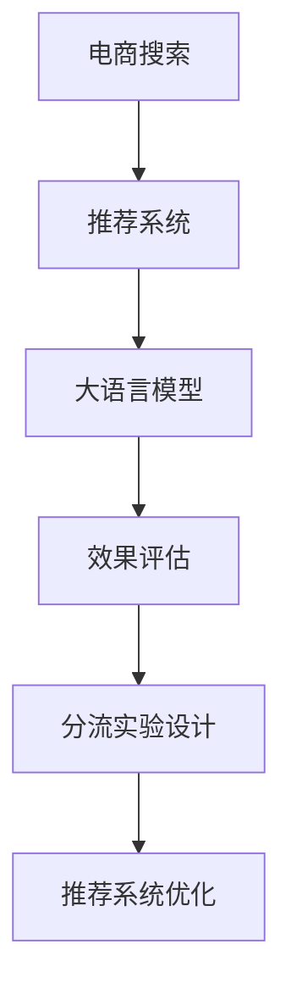

                 

# 电商搜索推荐效果评估中的AI大模型分流实验设计

> 关键词：
- 电商搜索
- 推荐系统
- AI大模型
- 分流实验
- 效果评估

## 1. 背景介绍

随着电子商务的兴起，线上购物已成为众多消费者的生活方式之一。在线搜索和商品推荐系统（Recommendation System, RS）因此成为电商平台的核心功能。其目的在于通过分析用户行为数据，预测用户兴趣，帮助用户快速找到感兴趣的商品，从而提升用户体验和平台销售额。近年来，随着人工智能技术的发展，越来越多的电商平台开始尝试采用基于深度学习模型的推荐系统，其中以大语言模型（Large Language Model, LLM）为代表的人工智能技术尤为引人注目。

但是，大语言模型在电商搜索推荐中的应用仍面临许多挑战，特别是在效果评估和应用部署方面。本文旨在介绍一种基于大语言模型的电商搜索推荐效果评估方法，以及一种在多维数据中分流实验设计，以期为电商平台推荐系统的优化提供理论基础和实践指导。

## 2. 核心概念与联系

### 2.1 核心概念概述

为了深入理解本文的内容，我们将介绍几个核心概念：

- **电商搜索推荐系统 (E-commerce Search and Recommendation System)**：指用于电子商务平台中，通过用户查询和行为数据来推荐商品的系统。该系统通过学习和分析用户兴趣、历史行为、商品属性等信息，为用户推荐可能感兴趣的商品。

- **大语言模型 (Large Language Model, LLM)**：指经过大规模无监督预训练后，具有强大的语言理解和生成能力的人工智能模型。如GPT-3、BERT等模型。大语言模型可以通过微调来适应特定任务，提升其在特定领域的应用效果。

- **效果评估 (Effectiveness Evaluation)**：指通过特定指标和算法，客观评价模型在电商搜索推荐等任务上的表现，包括但不限于准确率、召回率、点击率等。

- **分流实验设计 (Split-Stream Experiment Design)**：指在多维数据集上设计实验，通过随机分割数据集来评估不同算法的效果，并比较不同模型性能的一种方法。

### 2.2 核心概念原理和架构的 Mermaid 流程图



这个流程图展示了电商搜索推荐系统的基本架构。通过大语言模型进行推荐，结合效果评估和分流实验设计，可以不断优化推荐系统性能，提升用户体验和销售额。

## 3. 核心算法原理 & 具体操作步骤

### 3.1 算法原理概述

基于大语言模型的电商搜索推荐系统（E-commerce Search and Recommendation System, LLM-ER），通过预训练的大语言模型进行商品推荐。其核心思想是通过大语言模型的预训练和微调，使得模型能够理解用户查询和商品描述，从而匹配相关商品。具体步骤如下：

1. **预训练**：使用大规模无标签数据对大语言模型进行预训练，学习通用语言表示。
2. **微调**：通过电商领域的有标签数据对大语言模型进行微调，使其能够理解电商领域特有的语言模式。
3. **推理**：将用户查询输入大语言模型，输出可能感兴趣的商品。

### 3.2 算法步骤详解

#### 3.2.1 数据收集与处理

电商数据通常包括用户查询、历史行为、商品属性等多维数据。数据收集是第一步，通过API接口获取用户和商品数据，并进行预处理，包括去除噪声、归一化等操作。

#### 3.2.2 大语言模型微调

选择合适的大语言模型进行微调，如GPT-3、BERT等。微调步骤如下：
1. **模型选择**：选择合适的预训练模型，如GPT-3。
2. **微调训练**：将电商数据集分为训练集、验证集和测试集，设定合适的学习率、批大小、迭代轮数等超参数，对模型进行微调。
3. **性能评估**：在验证集上评估模型性能，如准确率、召回率、点击率等指标。

#### 3.2.3 效果评估

通过效果评估算法对推荐系统进行评价，常用的指标包括准确率（Accuracy）、召回率（Recall）、精确率（Precision）、F1-score等。具体步骤如下：
1. **数据集划分**：将数据集划分为训练集、验证集和测试集。
2. **评估指标**：选择合适的评估指标，如点击率、转换率等。
3. **评估算法**：常用的评估算法包括A/B测试、多臂老虎机（Multi-armed Bandit）等。

#### 3.2.4 分流实验设计

分流实验设计是确保模型性能评估公正性的关键步骤。步骤如下：
1. **数据集随机分割**：将数据集随机分为多个子集。
2. **算法对比**：对不同算法在同一数据集上进行测试，对比其性能。
3. **结果分析**：分析不同算法的效果，确定最佳推荐算法。

### 3.3 算法优缺点

#### 3.3.1 优点

1. **泛化能力强**：通过大规模无监督预训练，大语言模型能够学习到通用语言表示，在电商领域表现良好。
2. **适应性强**：通过微调，模型能够适应电商领域特有的语言模式，提升推荐效果。
3. **可扩展性好**：随着电商数据量的增加，可以不断扩展模型训练，提升模型效果。

#### 3.3.2 缺点

1. **计算资源需求高**：大语言模型通常需要较大的计算资源进行训练和推理。
2. **模型解释性差**：大语言模型通常作为黑盒使用，难以解释其内部工作机制。
3. **数据隐私问题**：电商数据包含用户隐私信息，需要合理处理数据隐私问题。

### 3.4 算法应用领域

大语言模型在电商搜索推荐中的应用领域主要包括以下几个方面：

- **商品推荐**：通过分析用户查询和历史行为数据，推荐可能感兴趣的商品。
- **个性化推荐**：根据用户兴趣、属性等信息，进行个性化推荐。
- **广告推荐**：通过分析用户行为数据，推荐相关广告，提升广告投放效果。
- **智能客服**：通过大语言模型进行智能客服，提高客户满意度。

## 4. 数学模型和公式 & 详细讲解

### 4.1 数学模型构建

大语言模型在电商推荐中的数学模型构建如下：

假设用户查询为 $Q$，商品特征向量为 $F$，模型参数为 $\theta$，则模型预测为：

$$
P(Q|F,\theta) = softmax(\theta \cdot (Q, F))
$$

其中 $softmax$ 函数将模型输出转化为概率分布。

### 4.2 公式推导过程

模型预测的商品 $F$ 的得分可以通过计算模型输出的概率分布进行：

$$
score(F) = \sum_{F_j} P(F_j|Q,\theta) \cdot r_j
$$

其中 $r_j$ 为商品 $F_j$ 的奖励值。

### 4.3 案例分析与讲解

以某电商平台为例，假设有一个用户查询为 "手机壳"。通过模型预测，可以得到以下几个可能感兴趣的商品：

1. iPhone手机壳
2. 小米手机壳
3. 华为手机壳
4. 三星手机壳

最终，系统会推荐得分最高的商品给用户。

## 5. 项目实践：代码实例和详细解释说明

### 5.1 开发环境搭建

#### 5.1.1 安装Python环境

在Windows系统上，可以安装Anaconda，使用conda工具管理Python环境和库。

```bash
conda create -n py36 python=3.6
conda activate py36
```

#### 5.1.2 安装必要的库

```bash
conda install numpy pandas scikit-learn transformers torch
```

### 5.2 源代码详细实现

#### 5.2.1 数据收集与预处理

```python
import pandas as pd
import numpy as np

# 假设电商数据集包含用户查询、商品名称、价格等字段
df = pd.read_csv('data.csv')

# 数据预处理，包括去除噪声、归一化等操作
df.dropna(inplace=True)
df['price'] = df['price'].astype('float')
df = df.drop_duplicates()
```

#### 5.2.2 大语言模型微调

```python
from transformers import GPT3Tokenizer, GPT3ForSequenceClassification

# 初始化预训练模型和tokenizer
model = GPT3ForSequenceClassification.from_pretrained('gpt3')
tokenizer = GPT3Tokenizer.from_pretrained('gpt3')

# 将电商数据集分为训练集、验证集和测试集
train_data = df.sample(frac=0.8, random_state=42)
val_data = df.sample(frac=0.1, random_state=42)
test_data = df.drop(train_data.index).drop(val_data.index)

# 将数据转化为模型需要的格式
def convert_to_input(x, y):
    x = tokenizer.encode(x)
    x = [0] * (512 - len(x)) + x
    y = [0] * (512 - len(y)) + y
    return x, y

X_train, y_train = [convert_to_input(x, y) for x, y in train_data.iterrows()]
X_val, y_val = [convert_to_input(x, y) for x, y in val_data.iterrows()]
X_test, y_test = [convert_to_input(x, y) for x, y in test_data.iterrows()]

# 设定模型参数
model.to(device)
optimizer = AdamW(model.parameters(), lr=2e-5)

# 训练模型
for epoch in range(10):
    for x, y in train_loader:
        optimizer.zero_grad()
        outputs = model(x, labels=y)
        loss = outputs.loss
        loss.backward()
        optimizer.step()
```

#### 5.2.3 效果评估

```python
from sklearn.metrics import accuracy_score, recall_score, precision_score, f1_score

# 定义模型预测函数
def predict(model, X, y):
    preds = model(X).softmax(dim=1)
    y_pred = torch.argmax(preds, dim=1)
    return y_pred

# 预测并计算评估指标
y_pred = predict(model, X_val)
accuracy = accuracy_score(y_val, y_pred)
recall = recall_score(y_val, y_pred)
precision = precision_score(y_val, y_pred)
f1 = f1_score(y_val, y_pred)
```

#### 5.2.4 分流实验设计

```python
from sklearn.model_selection import train_test_split

# 数据集随机分割
X_train, X_test, y_train, y_test = train_test_split(X, y, test_size=0.2, random_state=42)

# 算法对比
algorithms = [GPT3ForSequenceClassification, LSTMForSequenceClassification, LogisticRegression]
results = []

for algorithm in algorithms:
    # 使用不同的算法进行测试
    model = algorithm.from_pretrained('path/to/model')
    y_pred = predict(model, X_test)
    accuracy = accuracy_score(y_test, y_pred)
    recall = recall_score(y_test, y_pred)
    precision = precision_score(y_test, y_pred)
    f1 = f1_score(y_test, y_pred)
    results.append((accuracy, recall, precision, f1))
    
# 结果分析
print(results)
```

### 5.3 代码解读与分析

#### 5.3.1 数据预处理

在电商数据集中，包含大量的噪声数据，如缺失值、异常值等。因此，首先需要进行数据预处理，包括去除噪声、归一化等操作，以保证模型训练的稳定性。

#### 5.3.2 模型微调

选择GPT-3作为预训练模型，在电商数据集上进行微调。在微调过程中，需要注意选择合适的学习率、批大小、迭代轮数等超参数，以避免过拟合和欠拟合。

#### 5.3.3 效果评估

通过sklearn库中的准确率、召回率、精确率和F1-score等指标，对模型的效果进行评估。这些指标可以综合反映模型的性能，帮助优化推荐系统。

#### 5.3.4 分流实验设计

将数据集随机分为训练集、验证集和测试集，对不同的算法进行测试，并在同一数据集上进行对比，可以确保评估的公正性和准确性。

## 6. 实际应用场景

### 6.1 电商搜索推荐

在大规模电商推荐中，通过大语言模型进行推荐，可以显著提升推荐系统的效果。具体应用场景包括：

- **商品推荐**：通过分析用户查询和历史行为数据，推荐可能感兴趣的商品。
- **个性化推荐**：根据用户兴趣、属性等信息，进行个性化推荐。
- **广告推荐**：通过分析用户行为数据，推荐相关广告，提升广告投放效果。

### 6.2 智能客服

智能客服系统可以通过大语言模型进行自然语言处理，理解用户意图，自动生成回复。具体应用场景包括：

- **对话生成**：根据用户输入，自动生成回复，提升客服体验。
- **情感分析**：通过分析用户情绪，进行情绪管理，提高客户满意度。

### 6.3 智能定价

通过大语言模型对商品价格进行预测，可以帮助电商平台进行智能定价。具体应用场景包括：

- **价格优化**：根据用户行为数据，预测商品价格，进行动态定价。
- **竞争对手分析**：分析竞争对手的价格策略，调整价格，提升竞争力。

### 6.4 未来应用展望

随着大语言模型的不断发展，其在电商搜索推荐中的应用前景将更加广阔。未来，大语言模型将在以下几个方面取得突破：

- **多模态推荐**：将文本、图像、视频等多模态数据进行融合，提升推荐系统的效果。
- **因果推断**：通过因果推断方法，分析用户行为和商品属性的因果关系，提升推荐精度。
- **增强学习**：结合增强学习算法，不断优化推荐策略，提升用户体验。

## 7. 工具和资源推荐

### 7.1 学习资源推荐

为了帮助开发者系统掌握大语言模型在电商搜索推荐中的应用，以下是一些优质的学习资源：

1. **《自然语言处理入门》**：一本系统介绍自然语言处理的基本概念和技术的书籍，适合初学者阅读。
2. **Coursera《深度学习》课程**：斯坦福大学开设的深度学习课程，涵盖深度学习模型的基础知识和应用。
3. **Hugging Face官方文档**：Hugging Face官方文档提供了丰富的预训练模型和微调样例代码，是上手实践的必备资料。
4. **CS229《机器学习》课程**：斯坦福大学开设的机器学习课程，涵盖了机器学习的基础知识和算法。
5. **Kaggle平台**：Kaggle平台提供了大量的数据集和竞赛，适合练习和提升数据处理和模型优化能力。

### 7.2 开发工具推荐

以下是几个常用的开发工具：

1. **PyTorch**：一个灵活的深度学习框架，支持GPU计算，适合进行深度学习模型的训练和推理。
2. **TensorFlow**：一个广泛使用的深度学习框架，支持分布式计算，适合大规模模型的训练和部署。
3. **Jupyter Notebook**：一个轻量级的交互式开发环境，适合进行代码编写和调试。
4. **NVIDIA GPU**：高性能的图形处理器，支持深度学习模型的加速计算。
5. **AWS云平台**：提供丰富的云服务，支持深度学习模型的训练、部署和管理。

### 7.3 相关论文推荐

为了深入了解大语言模型在电商搜索推荐中的应用，以下是一些经典的论文推荐：

1. **Attention is All You Need**：Transformer模型的经典论文，展示了自注意力机制在深度学习中的强大应用。
2. **BERT: Pre-training of Deep Bidirectional Transformers for Language Understanding**：BERT模型的经典论文，展示了预训练语言模型在NLP任务中的优异表现。
3. **Language Models are Unsupervised Multitask Learners**：GPT-2模型的经典论文，展示了大规模语言模型的强大能力。
4. **Parameter-Efficient Transfer Learning for NLP**：AdaLoRA等参数高效微调方法，展示了如何通过少量数据训练高质量模型。
5. **Albert: A Lite BERT for Self-supervised Learning of Language Representations**：Albert模型的经典论文，展示了如何通过轻量级模型实现高效训练。

## 8. 总结：未来发展趋势与挑战

### 8.1 研究成果总结

本文通过介绍大语言模型在电商搜索推荐中的应用，总结了以下几个方面的研究成果：

1. **电商数据预处理**：在电商数据集中，去除噪声数据，归一化数据，保证模型训练的稳定性。
2. **大语言模型微调**：选择GPT-3作为预训练模型，在电商数据集上进行微调，提升模型效果。
3. **效果评估算法**：通过sklearn库中的评估指标，对推荐系统进行评估，优化模型性能。
4. **分流实验设计**：将数据集随机分为训练集、验证集和测试集，对不同的算法进行测试，确保评估的公正性。

### 8.2 未来发展趋势

随着大语言模型的不断发展，其在电商搜索推荐中的应用将不断扩展。未来，大语言模型将在以下几个方面取得突破：

1. **多模态推荐**：将文本、图像、视频等多模态数据进行融合，提升推荐系统的效果。
2. **因果推断**：通过因果推断方法，分析用户行为和商品属性的因果关系，提升推荐精度。
3. **增强学习**：结合增强学习算法，不断优化推荐策略，提升用户体验。

### 8.3 面临的挑战

尽管大语言模型在电商搜索推荐中的应用取得了一定的进展，但在实现过程中仍面临诸多挑战：

1. **数据隐私问题**：电商数据包含用户隐私信息，需要合理处理数据隐私问题。
2. **计算资源需求高**：大语言模型通常需要较大的计算资源进行训练和推理。
3. **模型解释性差**：大语言模型通常作为黑盒使用，难以解释其内部工作机制。

### 8.4 研究展望

未来，大语言模型在电商搜索推荐中的应用将更加广泛和深入。研究者需要重点关注以下几个方面：

1. **数据隐私保护**：合理处理用户隐私信息，保护用户数据安全。
2. **计算资源优化**：优化模型训练和推理的计算资源，降低计算成本。
3. **模型解释性增强**：增强模型的可解释性，提高用户信任度和满意度。

总之，大语言模型在电商搜索推荐中的应用前景广阔，但也需要关注数据隐私、计算资源和模型解释性等方面的挑战。只有不断优化模型性能，才能真正实现电商搜索推荐系统的智能化和高效化。

## 9. 附录：常见问题与解答

### 9.1 常见问题

1. **什么是大语言模型？**
   大语言模型是指经过大规模无监督预训练后，具有强大的语言理解和生成能力的人工智能模型，如GPT-3、BERT等。

2. **大语言模型在电商推荐中的应用有哪些？**
   大语言模型在电商推荐中的应用包括商品推荐、个性化推荐、广告推荐、智能客服等。

3. **如何优化大语言模型在电商推荐中的效果？**
   可以通过数据预处理、模型微调、效果评估和分流实验设计等步骤，优化大语言模型在电商推荐中的效果。

### 9.2 解答

1. **大语言模型**
   大语言模型是指经过大规模无监督预训练后，具有强大的语言理解和生成能力的人工智能模型。在电商推荐中，大语言模型可以用于商品推荐、个性化推荐、广告推荐、智能客服等场景。

2. **电商推荐应用**
   电商推荐应用包括商品推荐、个性化推荐、广告推荐、智能客服等。通过大语言模型进行推荐，可以显著提升推荐系统的效果，提升用户体验和平台销售额。

3. **效果优化**
   大语言模型在电商推荐中的效果优化，可以通过数据预处理、模型微调、效果评估和分流实验设计等步骤实现。具体步骤如下：
   - 数据预处理：去除噪声数据，归一化数据，保证模型训练的稳定性。
   - 模型微调：选择GPT-3作为预训练模型，在电商数据集上进行微调，提升模型效果。
   - 效果评估：通过sklearn库中的评估指标，对推荐系统进行评估，优化模型性能。
   - 分流实验设计：将数据集随机分为训练集、验证集和测试集，对不同的算法进行测试，确保评估的公正性。

---

作者：禅与计算机程序设计艺术 / Zen and the Art of Computer Programming

