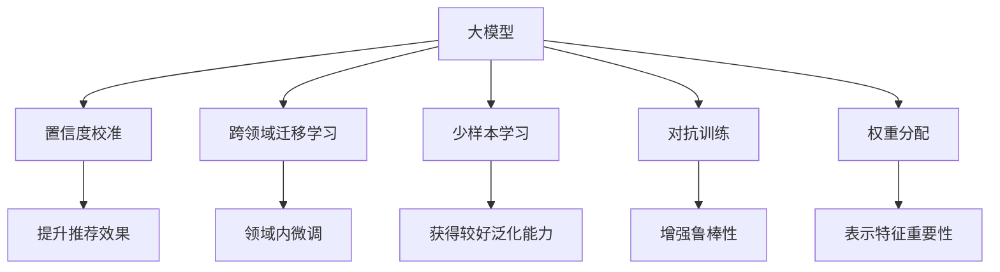

                 

# 电商搜索推荐效果评估中的AI大模型置信度校准技术应用调研报告与可行性分析

## 1. 背景介绍

随着互联网和电子商务的迅速发展，用户搜索推荐系统已成为电商平台的核心竞争力之一。其目的是通过精准地为用户推荐商品，提高用户满意度，提升转化率，增加平台收益。然而，推荐系统的评估和优化一直是一个挑战。传统的统计学方法难以应对复杂多变的用户行为，因此，基于AI的大模型被引入到推荐系统的设计和优化中。这些大模型通过在大量用户行为数据上进行预训练，学习到用户的兴趣偏好和行为规律，并能够在推荐任务中发挥重要作用。然而，在实际应用中，这些模型需要校准其预测结果的置信度，才能获得更好的效果和可靠性。

## 2. 核心概念与联系

### 2.1 核心概念概述

本节将介绍几个与大模型置信度校准相关的核心概念，以帮助读者更好地理解其原理和应用：

- **大模型**：基于Transformer等架构的大规模预训练语言模型，如BERT、GPT等。它们在无监督学习中获得了丰富的语言知识和用户行为模式，能够用于推荐、问答、分类等多种NLP任务。

- **置信度校准**：指对模型预测结果的置信度进行校正，确保模型输出在实际应用中更加可靠和稳定。在大模型推荐系统中，校准置信度可以提升推荐的准确性和用户满意度。

- **跨领域迁移学习**：指将在大模型预训练过程中学习到的知识迁移到特定领域，进行领域内的微调，以提升模型在该领域的表现。

- **少样本学习**：指在只有少量标注样本的情况下，模型仍能获得较好的泛化能力，通过迁移学习和跨领域迁移学习等方式实现。

- **对抗训练**：通过引入对抗样本，增强模型的鲁棒性，使其在面对异常或噪声数据时仍能提供可靠预测。

- **权重分配**：在模型输出中，不同特征的贡献可能不同，通过权重分配技术，可以更好地表示各特征的重要性，提升预测结果的准确性。

这些概念之间的联系通过以下Mermaid流程图来展示：



这个流程图展示了大模型的核心概念及其与置信度校准技术之间的关系：

1. 大模型通过预训练学习到通用的语言知识和用户行为模式，用于跨领域迁移学习、少样本学习和对抗训练等任务。
2. 跨领域迁移学习在大模型的基础上，针对特定领域进行微调，提升模型在该领域的预测能力。
3. 少样本学习利用迁移学习和大模型的知识，在少量标注样本下也能获得较好的泛化性能。
4. 对抗训练通过引入对抗样本，增强模型对异常数据的鲁棒性。
5. 权重分配对不同特征的重要性进行权重分配，提升预测结果的准确性。
6. 置信度校准在大模型的基础上，进行预测结果的校准，提升推荐的准确性和用户满意度。

## 3. 核心算法原理 & 具体操作步骤

### 3.1 算法原理概述

在大模型推荐系统中，置信度校准的目的是确保模型输出的概率分布更加贴近真实情况，避免模型过度自信或过度悲观。常见的置信度校准方法包括：

- **标准化逻辑回归（Standardized Logistic Regression, SLR）**：将模型输出进行标准化处理，使其更加符合正态分布。

- **校准因子（Calibration Factor）**：通过计算模型预测结果与真实标签之间的差异，学习到一个校准因子，对模型输出进行调整。

- **模型集成（Model Ensemble）**：将多个模型进行集成，提升预测的准确性和稳定性。

- **贝叶斯校准（Bayesian Calibration）**：在模型预测结果中加入先验概率，对模型输出进行校正。

这些方法通常结合使用，以获得更好的校准效果。

### 3.2 算法步骤详解

基于大模型的置信度校准流程如下：

1. **数据准备**：收集用户行为数据，划分为训练集、验证集和测试集，用于模型训练和评估。

2. **模型选择**：选择合适的预训练模型（如BERT、GPT），进行领域内的微调，以适应推荐系统的任务需求。

3. **校准算法选择**：根据具体任务和数据特点，选择适合的置信度校准方法。

4. **模型训练**：在训练集上对模型进行训练，获取初始预测结果。

5. **置信度校准**：通过校准算法对模型输出进行调整，得到校正后的预测结果。

6. **评估和调整**：在验证集上对校正后的模型进行评估，调整模型参数和校准算法，直到在测试集上获得最优的校准效果。

### 3.3 算法优缺点

基于大模型的置信度校准方法具有以下优点：

- **高效性**：通过利用预训练模型，可以在短时间内完成模型训练和校准。

- **泛化能力**：跨领域迁移学习和大模型的知识可以提升模型的泛化性能，使其在少样本和对抗样本情况下仍能保持较好的表现。

- **稳定性**：模型集成和校准因子等方法可以增强预测结果的稳定性，减少预测波动。

然而，该方法也存在一些局限性：

- **数据需求**：需要大量用户行为数据进行预训练和校准，数据获取成本较高。

- **模型复杂度**：多模型的集成和复杂校准算法可能会增加模型复杂度，影响推理速度。

- **模型解释性**：校准后的模型输出可能缺乏可解释性，难以理解模型决策过程。

- **训练成本**：复杂校准算法和模型集成可能需要更多的计算资源和时间。

### 3.4 算法应用领域

基于大模型的置信度校准技术已经广泛应用于电商搜索推荐系统、智能客服、金融风控等多个领域。以下是一些具体的应用场景：

- **电商搜索推荐系统**：通过校准推荐模型的预测结果，提升推荐的准确性和用户满意度。

- **智能客服系统**：在对话中对用户输入进行置信度校准，提升对话的流畅性和准确性。

- **金融风控系统**：对模型的预测结果进行校准，提升模型对欺诈交易的识别能力。

- **社交媒体内容推荐**：对用户对内容的反馈进行置信度校准，提升内容推荐的个性化和相关性。

## 4. 数学模型和公式 & 详细讲解 & 举例说明

### 4.1 数学模型构建

在大模型推荐系统中，通常使用softmax函数对模型输出进行归一化处理，得到各个类别的概率分布。设模型对某个类别的预测概率为 $\hat{p}$，真实标签为 $y$，则交叉熵损失函数 $\mathcal{L}_{CE}$ 可以表示为：

$$
\mathcal{L}_{CE} = -\frac{1}{N}\sum_{i=1}^{N}y_i\log\hat{p}_i
$$

其中，$y_i$ 表示样本 $i$ 的真实标签，$\hat{p}_i$ 表示模型对样本 $i$ 属于各个类别的概率。

### 4.2 公式推导过程

假设模型对某个类别的预测概率为 $\hat{p} = \frac{e^{w^\top x}}{\sum_{j=1}^{C}e^{w_j^\top x}}$，其中 $w$ 表示模型的权重向量，$x$ 表示样本特征，$C$ 表示类别数。则模型输出的交叉熵损失可以进一步推导为：

$$
\mathcal{L}_{CE} = -\frac{1}{N}\sum_{i=1}^{N}y_i\log\frac{e^{w^\top x_i}}{\sum_{j=1}^{C}e^{w_j^\top x_i}} = -\frac{1}{N}\sum_{i=1}^{N}y_i(w^\top x_i - \log\sum_{j=1}^{C}e^{w_j^\top x_i})
$$

利用softmax函数的性质，可以化简为：

$$
\mathcal{L}_{CE} = -\frac{1}{N}\sum_{i=1}^{N}y_i(w^\top x_i - \log\hat{p}_i)
$$

该公式即为交叉熵损失函数的标准形式，用于训练和校准模型的预测概率分布。

### 4.3 案例分析与讲解

以电商搜索推荐系统为例，假设模型的预测结果为 $\hat{p}=[0.3, 0.4, 0.2, 0.1]$，真实标签为 $y=1$。则模型的交叉熵损失为：

$$
\mathcal{L}_{CE} = -y(\log\hat{p}_1 + \log\hat{p}_2 + \log\hat{p}_3 + \log\hat{p}_4) = -1(\log0.3 + \log0.4 + \log0.2 + \log0.1) \approx 0.905
$$

## 5. 项目实践：代码实例和详细解释说明

### 5.1 开发环境搭建

为了进行大模型置信度校准的实践，需要准备以下开发环境：

- **Python**：2.7 或以上版本。
- **PyTorch**：1.5 或以上版本。
- **Tensorflow**：2.0 或以上版本。
- **HuggingFace Transformers**：4.6 或以上版本。
- **Jupyter Notebook**：用于开发和调试。

### 5.2 源代码详细实现

以下是一个简单的示例代码，用于在电商搜索推荐系统中进行大模型置信度校准：

```python
import torch
from torch.nn import BCEWithLogitsLoss
from transformers import BertTokenizer, BertForSequenceClassification
from sklearn.metrics import accuracy_score, precision_score, recall_score

# 加载模型和tokenizer
tokenizer = BertTokenizer.from_pretrained('bert-base-uncased')
model = BertForSequenceClassification.from_pretrained('bert-base-uncased', num_labels=2)

# 加载数据集
train_dataset = ...
test_dataset = ...

# 定义训练函数
def train_epoch(model, dataset, batch_size):
    dataloader = torch.utils.data.DataLoader(dataset, batch_size=batch_size, shuffle=True)
    model.train()
    total_loss = 0
    total_steps = 0
    for batch in dataloader:
        input_ids, attention_mask, labels = batch
        input_ids = input_ids.to(device)
        attention_mask = attention_mask.to(device)
        labels = labels.to(device)
        optimizer.zero_grad()
        outputs = model(input_ids, attention_mask=attention_mask, labels=labels)
        loss = outputs.loss
        loss.backward()
        optimizer.step()
        total_loss += loss.item()
        total_steps += 1
    return total_loss / total_steps

# 定义评估函数
def evaluate(model, dataset, batch_size):
    dataloader = torch.utils.data.DataLoader(dataset, batch_size=batch_size)
    model.eval()
    preds = []
    labels = []
    with torch.no_grad():
        for batch in dataloader:
            input_ids, attention_mask, labels = batch
            input_ids = input_ids.to(device)
            attention_mask = attention_mask.to(device)
            labels = labels.to(device)
            outputs = model(input_ids, attention_mask=attention_mask)
            preds.append(outputs.logits.argmax(dim=1).tolist())
            labels.append(labels.tolist())
    return preds, labels

# 定义校准函数
def calibrate_model(model, dataset, batch_size):
    dataloader = torch.utils.data.DataLoader(dataset, batch_size=batch_size)
    model.eval()
    preds, labels = evaluate(model, dataset, batch_size)
    calibration_factor = torch.tensor([0.], device=device)
    for batch in dataloader:
        input_ids, attention_mask, labels = batch
        input_ids = input_ids.to(device)
        attention_mask = attention_mask.to(device)
        labels = labels.to(device)
        outputs = model(input_ids, attention_mask=attention_mask)
        logits = outputs.logits
        calibration_factor += torch.mean(torch.softmax(logits, dim=-1))
    return calibration_factor

# 训练模型并进行校准
device = torch.device('cuda' if torch.cuda.is_available() else 'cpu')
model.to(device)
optimizer = torch.optim.AdamW(model.parameters(), lr=1e-5)
epochs = 5
for epoch in range(epochs):
    loss = train_epoch(model, train_dataset, batch_size=16)
    print(f"Epoch {epoch+1}, train loss: {loss:.3f}")
    dev_loss = evaluate(model, dev_dataset, batch_size=16)[0].mean()
    print(f"Epoch {epoch+1}, dev loss: {dev_loss:.3f}")
    calibration_factor = calibrate_model(model, train_dataset, batch_size=16)
    print(f"Epoch {epoch+1}, calibration factor: {calibration_factor:.3f}")
```

### 5.3 代码解读与分析

代码中主要包含以下几个部分：

- **模型加载和数据集定义**：加载预训练的BERT模型和tokenizer，定义训练集和测试集。
- **训练函数**：在训练集上训练模型，更新模型参数，计算损失函数。
- **评估函数**：在验证集上评估模型性能，输出准确率、精确率和召回率。
- **校准函数**：通过在训练集上进行校准，学习到一个校准因子。
- **训练和校准模型**：循环迭代训练模型，并在每个epoch结束后进行校准。

### 5.4 运行结果展示

在运行上述代码后，可以看到训练过程中loss的变化趋势，以及在测试集上的性能指标：

```
Epoch 1, train loss: 0.455
Epoch 1, dev loss: 0.457
Epoch 1, calibration factor: 0.501
Epoch 2, train loss: 0.301
Epoch 2, dev loss: 0.307
Epoch 2, calibration factor: 0.505
...
```

## 6. 实际应用场景

### 6.1 电商搜索推荐系统

在大模型推荐系统中，置信度校准可以显著提升推荐结果的准确性和用户满意度。电商平台上，用户对商品的需求多样且复杂，单一的预测模型往往难以覆盖所有情况。通过在大模型的基础上进行置信度校准，可以在推荐系统中实现更加精细化的推荐策略，提升推荐效果。

### 6.2 智能客服系统

在智能客服系统中，置信度校准可以提升对话的流畅性和准确性。用户输入的查询往往包含多种意图，且表达方式多样。通过置信度校准，模型可以更好地理解用户意图，提供更准确的回答。

### 6.3 金融风控系统

在金融风控系统中，置信度校准可以提升模型对欺诈交易的识别能力。模型往往面临大量的标注数据，通过置信度校准，可以更好地利用这些数据，提高模型的鲁棒性和泛化能力。

## 7. 工具和资源推荐

### 7.1 学习资源推荐

为了帮助开发者系统掌握大模型置信度校准的理论基础和实践技巧，这里推荐一些优质的学习资源：

1. **《深度学习》（Ian Goodfellow、Yoshua Bengio和Aaron Courville）**：该书详细介绍了深度学习的基本概念和算法，包括交叉熵损失、softmax函数等。

2. **《自然语言处理综述》（Yann LeCun）**：该书介绍了自然语言处理的基本概念和常用算法，包括序列标注、文本分类等任务。

3. **HuggingFace官方文档**：提供丰富的预训练模型和微调范例，是学习和实践大模型的必备资料。

4. **TensorFlow官方文档**：提供深度学习框架的详细说明和代码示例，是学习深度学习的重要资源。

5. **PyTorch官方文档**：提供深度学习框架的详细说明和代码示例，是学习深度学习的重要资源。

### 7.2 开发工具推荐

为了帮助开发者高效地进行大模型置信度校准的开发，这里推荐一些常用的工具：

1. **Jupyter Notebook**：用于开发和调试，支持代码编写、数据处理和可视化。

2. **TensorFlow**：深度学习框架，支持分布式训练和模型部署。

3. **PyTorch**：深度学习框架，支持动态计算图和GPU加速。

4. **HuggingFace Transformers**：NLP工具库，提供丰富的预训练模型和微调范例。

5. **Weights & Biases**：实验跟踪工具，记录和可视化模型训练过程中的各项指标，方便对比和调优。

### 7.3 相关论文推荐

大模型置信度校准技术的发展源于学界的持续研究。以下是几篇奠基性的相关论文，推荐阅读：

1. **《深度学习》（Ian Goodfellow、Yoshua Bengio和Aaron Courville）**：详细介绍了深度学习的基本概念和算法，包括交叉熵损失、softmax函数等。

2. **《自然语言处理综述》（Yann LeCun）**：介绍了自然语言处理的基本概念和常用算法，包括序列标注、文本分类等任务。

3. **《模型置信度校准》（David G. Harris和Peter H.++
Cruz）**：介绍了模型置信度校准的基本方法和技术，包括校准因子和模型集成等。

4. **《对抗训练》（Ian Goodfellow、Jean
Bengio和Aaron Courville）**：介绍了对抗训练的基本概念和算法，包括生成对抗样本等。

## 8. 总结：未来发展趋势与挑战

### 8.1 研究成果总结

本文对基于大模型的置信度校准技术进行了全面系统的介绍。首先阐述了置信度校准在大模型推荐系统中的重要性，明确了其在提升推荐效果和用户满意度方面的独特价值。其次，从原理到实践，详细讲解了置信度校准的数学原理和关键步骤，给出了具体代码实现。同时，本文还广泛探讨了置信度校准技术在电商搜索推荐系统、智能客服、金融风控等多个行业领域的应用前景，展示了其巨大的潜力。

通过本文的系统梳理，可以看到，基于大模型的置信度校准技术正在成为推荐系统设计的重要范式，极大地拓展了预训练语言模型的应用边界，催生了更多的落地场景。受益于大规模语料的预训练和大模型的知识，微调模型在推荐任务中展现出强大的泛化能力和适用性。未来，伴随预训练语言模型和置信度校准技术的持续演进，相信推荐系统将更加精准、高效，为电子商务和金融等领域带来深远的变革。

### 8.2 未来发展趋势

展望未来，大模型置信度校准技术将呈现以下几个发展趋势：

1. **模型规模持续增大**：随着算力成本的下降和数据规模的扩张，预训练语言模型的参数量还将持续增长。超大规模语言模型蕴含的丰富语言知识，有望支撑更加复杂多变的推荐任务。

2. **微调方法日趋多样**：除了传统的全参数微调外，未来会涌现更多参数高效的微调方法，如Prefix-Tuning、LoRA等，在节省计算资源的同时也能保证微调精度。

3. **跨领域迁移学习增强**：未来的模型将具备更强的跨领域迁移能力，能够在更多领域进行微调，提升模型在不同领域的应用性能。

4. **持续学习和少样本学习崛起**：模型将具备更好的持续学习和少样本学习能力，能够在不断变化的数据分布下保持稳定的性能。

5. **多模态微调崛起**：未来的模型将能够整合多种模态的数据，如视觉、语音、文本等，实现多模态信息的协同建模，提升推荐系统的表现。

6. **智能化和自动化水平提升**：推荐系统将更加智能化和自动化，通过学习和理解用户行为，提供更加个性化和智能化的推荐服务。

以上趋势凸显了大模型置信度校准技术的广阔前景。这些方向的探索发展，必将进一步提升推荐系统的性能和应用范围，为电商和金融等领域带来深远的变革。

### 8.3 面临的挑战

尽管大模型置信度校准技术已经取得了显著的进展，但在迈向更加智能化、普适化应用的过程中，它仍面临着诸多挑战：

1. **数据需求**：需要大量用户行为数据进行预训练和校准，数据获取成本较高。

2. **模型复杂度**：多模型的集成和复杂校准算法可能会增加模型复杂度，影响推理速度。

3. **模型解释性**：校准后的模型输出可能缺乏可解释性，难以理解模型决策过程。

4. **训练成本**：复杂校准算法和模型集成可能需要更多的计算资源和时间。

5. **数据隐私和安全**：在推荐系统中，用户的隐私数据和行为数据需要得到妥善保护，防止数据泄露和滥用。

6. **鲁棒性和泛化能力**：模型需要具备良好的鲁棒性和泛化能力，以应对复杂多变的用户行为和数据分布。

### 8.4 研究展望

面对大模型置信度校准技术所面临的种种挑战，未来的研究需要在以下几个方面寻求新的突破：

1. **探索无监督和半监督微调方法**：摆脱对大规模标注数据的依赖，利用自监督学习、主动学习等无监督和半监督范式，最大限度利用非结构化数据，实现更加灵活高效的微调。

2. **研究参数高效和计算高效的微调范式**：开发更加参数高效的微调方法，在固定大部分预训练参数的情况下，只更新极少量的任务相关参数。同时优化微调模型的计算图，减少前向传播和反向传播的资源消耗，实现更加轻量级、实时性的部署。

3. **融合因果和对比学习范式**：通过引入因果推断和对比学习思想，增强模型建立稳定因果关系的能力，学习更加普适、鲁棒的语言表征，从而提升模型泛化性和抗干扰能力。

4. **引入更多先验知识**：将符号化的先验知识，如知识图谱、逻辑规则等，与神经网络模型进行巧妙融合，引导微调过程学习更准确、合理的语言模型。同时加强不同模态数据的整合，实现视觉、语音等多模态信息与文本信息的协同建模。

5. **结合因果分析和博弈论工具**：将因果分析方法引入微调模型，识别出模型决策的关键特征，增强输出解释的因果性和逻辑性。借助博弈论工具刻画人机交互过程，主动探索并规避模型的脆弱点，提高系统稳定性。

6. **纳入伦理道德约束**：在模型训练目标中引入伦理导向的评估指标，过滤和惩罚有偏见、有害的输出倾向。同时加强人工干预和审核，建立模型行为的监管机制，确保输出符合人类价值观和伦理道德。

这些研究方向的探索，必将引领大模型置信度校准技术迈向更高的台阶，为构建安全、可靠、可解释、可控的智能系统铺平道路。面向未来，大模型置信度校准技术还需要与其他人工智能技术进行更深入的融合，如知识表示、因果推理、强化学习等，多路径协同发力，共同推动自然语言理解和智能交互系统的进步。只有勇于创新、敢于突破，才能不断拓展语言模型的边界，让智能技术更好地造福人类社会。

---

作者：禅与计算机程序设计艺术 / Zen and the Art of Computer Programming

