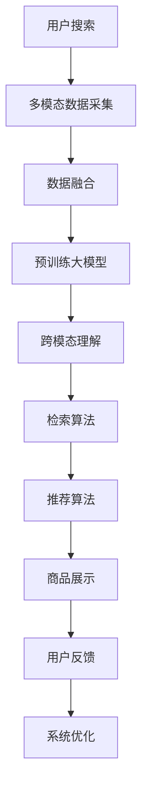

                 

# 电商搜索的跨模态理解与检索：AI大模型的新突破

> 关键词：电商搜索,跨模态理解,检索技术,AI大模型,深度学习,推荐系统,多模态数据融合

## 1. 背景介绍

### 1.1 问题由来

随着互联网和电子商务的飞速发展，电商平台的搜索功能成为了用户获取商品信息的重要手段。然而，传统的基于文本的电商搜索系统面临着诸多挑战：

1. **理解多样化：** 用户搜索意图复杂，可能包含图片、视频、标签等多样化信息。
2. **语义模糊：** 自然语言语义多义、歧义现象普遍，传统搜索算法难以准确理解。
3. **动态变化：** 电商平台商品不断更新，用户行为模式频繁变化，需要实时适应。
4. **推荐难度：** 推荐系统不仅要理解查询，还要从海量商品中找出最相关的结果，需高度精准。

为了应对这些挑战，电商搜索系统需要引入先进的AI技术，特别是基于深度学习的AI大模型，以提升搜索和推荐的准确性和个性化。

### 1.2 问题核心关键点

为了更好地理解跨模态理解与检索技术，本节将介绍几个关键概念：

- **跨模态理解（Cross-Modal Understanding）：** 指模型能够同时理解和处理多种模态的数据，如文本、图像、视频等，并将其转化为统一的语义表示。
- **检索（Retrieval）：** 从海量的数据集中找到与查询最匹配的结果，是搜索系统的核心功能。
- **推荐系统（Recommendation System）：** 通过分析用户行为和商品属性，预测用户可能感兴趣的商品，提高电商平台的转化率。
- **AI大模型（AI Large Model）：** 指具有大规模参数量、高通用性和深层次学习能力的大型神经网络模型，如BERT、GPT、DALL-E等。

这些核心概念共同构成了电商搜索的AI技术基础，使系统能够更精准地理解和推荐商品。

## 2. 核心概念与联系

### 2.1 核心概念概述

跨模态理解与检索技术主要通过以下方式实现：

1. **多模态数据的采集与融合：** 电商搜索系统通过API、爬虫等方式，从不同渠道采集商品信息，包括图片、视频、标题、描述、评论、用户画像等，进行多模态数据融合。
2. **预训练大模型：** 使用BERT、GPT等预训练大模型作为初始化参数，通过跨模态理解学习不同模态数据的语义表示。
3. **检索算法：** 基于深度学习检索算法，如Siamese Network、Triplet Network、Transformers等，将查询与商品进行相似度计算，找出最匹配的结果。
4. **推荐算法：** 通过协同过滤、内容推荐、知识图谱等推荐算法，结合用户历史行为和商品属性，生成个性化推荐结果。

这些关键技术环节相互关联，共同支撑了电商搜索系统的高效运行。

### 2.2 核心概念原理和架构的 Mermaid 流程图



此流程图展示了电商搜索系统的核心技术流程：用户输入搜索词后，系统通过多模态数据采集与融合，利用预训练大模型进行跨模态理解，再通过检索算法找到最匹配的商品，最后结合推荐算法生成个性化推荐，并进行展示。用户反馈被用来进一步优化系统，形成闭环反馈。

## 3. 核心算法原理 & 具体操作步骤

### 3.1 算法原理概述

基于深度学习的跨模态理解与检索技术，主要分为两个阶段：

1. **跨模态编码阶段：** 通过预训练大模型将多模态数据转换为统一的语义表示，形成跨模态特征向量。
2. **检索与推荐阶段：** 利用检索算法计算查询与商品之间的相似度，再通过推荐算法生成个性化推荐结果。

### 3.2 算法步骤详解

**Step 1: 数据预处理与特征提取**

电商搜索系统需要处理大量的文本、图片、视频等多模态数据。首先，通过API和爬虫等手段采集数据，然后进行数据清洗和预处理。例如，对文本进行分词、去除停用词、TF-IDF等特征提取，对图片进行缩放、归一化、降维等预处理。

**Step 2: 模型初始化与训练**

选取一个预训练大模型作为初始化参数，如BERT、GPT等。通过数据预处理结果，进行跨模态特征编码。一般使用Transformer模型，将其顶层视作特征提取器，通过多头自注意力机制，将不同模态数据转换为统一的语义表示。

**Step 3: 检索与推荐**

基于编码后的跨模态特征向量，通过检索算法计算查询与商品之间的相似度。常用的检索算法包括Siamese Network、Triplet Network等，通过计算余弦相似度、欧氏距离等度量方法，找出最匹配的商品。

接着，将检索结果输入推荐算法，结合用户历史行为和商品属性，生成个性化推荐结果。常用的推荐算法包括协同过滤、内容推荐、知识图谱等，通过矩阵分解、最大相关性等方法，优化推荐效果。

**Step 4: 系统集成与优化**

将检索和推荐结果集成到搜索系统，进行商品展示。同时，通过用户反馈数据，对系统进行优化和调整，提高搜索和推荐的准确性。常用的优化方法包括超参数调优、模型微调、特征工程等。

### 3.3 算法优缺点

基于深度学习的跨模态理解与检索技术具有以下优点：

1. **高精度：** 利用预训练大模型和高性能检索算法，能够实现高精度的商品检索和推荐。
2. **多模态融合：** 能够同时处理文本、图片、视频等多种模态数据，全面理解用户意图。
3. **实时性：** 结合分布式计算和大规模缓存技术，支持高效的实时搜索和推荐。
4. **可扩展性：** 能够轻松扩展到海量数据和多用户场景，适应电商平台的快速增长。

同时，该方法也存在一些局限性：

1. **数据质量依赖：** 检索和推荐效果高度依赖于数据的质量和完整性，数据不平衡或噪声较大时，效果会打折扣。
2. **计算资源需求高：** 预训练大模型和检索算法计算复杂度高，需要高性能硬件支持。
3. **冷启动问题：** 新商品或新用户缺乏历史行为数据时，推荐效果差。
4. **隐私和安全：** 处理大量个人数据时，需要考虑隐私保护和数据安全问题。

### 3.4 算法应用领域

基于跨模态理解与检索的AI技术，已经广泛应用于以下领域：

1. **电商搜索：** 通过多模态数据融合和深度学习检索算法，提高商品搜索的准确性和用户体验。
2. **图像检索：** 利用图像特征编码，通过相似度计算，实现高效的图片检索和推荐。
3. **视频推荐：** 通过视频特征提取和深度学习推荐算法，实现视频内容的个性化推荐。
4. **社交网络：** 通过用户行为和社交关系分析，推荐相关内容和用户，增强社区互动。
5. **医疗影像：** 利用医学影像特征提取，实现疾病的早期诊断和智能推荐。

## 4. 数学模型和公式 & 详细讲解 & 举例说明

### 4.1 数学模型构建

在跨模态理解与检索中，主要涉及以下数学模型：

- **多模态特征编码模型：** 通过Transformer模型，将不同模态数据转换为统一的语义表示。
- **相似度计算模型：** 基于余弦相似度、欧氏距离等度量方法，计算查询与商品之间的相似度。
- **推荐模型：** 通过协同过滤、内容推荐等算法，生成个性化推荐结果。

### 4.2 公式推导过程

**多模态特征编码模型：**

假设多模态数据包含文本 $x$ 和图片 $y$，输入到Transformer模型中进行特征编码。Transformer模型使用多头自注意力机制，对不同模态数据进行编码，得到编码后的语义表示 $z_x$ 和 $z_y$。

$$
z_x = \text{Transformer}_{\text{text}}(x), \quad z_y = \text{Transformer}_{\text{image}}(y)
$$

**相似度计算模型：**

假设查询 $q$ 和商品 $d$ 的编码表示分别为 $z_q$ 和 $z_d$。通过余弦相似度计算查询与商品的相似度 $s$。

$$
s = \cos(z_q, z_d) = \frac{z_q \cdot z_d}{\|z_q\|\|z_d\|}
$$

**推荐模型：**

假设用户 $u$ 的历史行为和商品 $i$ 的属性特征分别为 $h_u$ 和 $f_i$。通过协同过滤算法，计算用户对商品的评分 $r$。

$$
r = \frac{h_u \cdot f_i}{\|h_u\|\|f_i\|}
$$

### 4.3 案例分析与讲解

**案例分析：**

假设某电商平台商品库中有100万个商品，每个商品包含标题、描述、图片、价格、评分等信息。用户输入查询“手机”，系统通过多模态数据采集和预处理，得到文本特征向量 $z_{\text{text}}$ 和图片特征向量 $z_{\text{image}}$。

**Step 1: 多模态特征编码：**

将文本特征向量 $z_{\text{text}}$ 和图片特征向量 $z_{\text{image}}$ 输入Transformer模型，进行编码，得到统一的语义表示 $z_{\text{multi}}$。

$$
z_{\text{multi}} = \text{Transformer}(z_{\text{text}}, z_{\text{image}})
$$

**Step 2: 检索与推荐：**

将查询 $q$ 的语义表示 $z_q$ 和 $z_{\text{multi}}$ 进行余弦相似度计算，找出最匹配的商品 $d$。

$$
s = \cos(z_q, z_{\text{multi}})
$$

接着，将检索结果 $d$ 输入协同过滤算法，结合用户历史行为 $h_u$ 和商品属性特征 $f_i$，生成个性化推荐结果 $r_i$。

$$
r_i = \frac{h_u \cdot f_i}{\|h_u\|\|f_i\|}
$$

## 5. 项目实践：代码实例和详细解释说明

### 5.1 开发环境搭建

在进行跨模态理解与检索项目开发时，需要先准备好开发环境。以下是使用Python进行PyTorch开发的环境配置流程：

1. 安装Anaconda：从官网下载并安装Anaconda，用于创建独立的Python环境。

2. 创建并激活虚拟环境：
```bash
conda create -n pytorch-env python=3.8 
conda activate pytorch-env
```

3. 安装PyTorch：根据CUDA版本，从官网获取对应的安装命令。例如：
```bash
conda install pytorch torchvision torchaudio cudatoolkit=11.1 -c pytorch -c conda-forge
```

4. 安装Transformers库：
```bash
pip install transformers
```

5. 安装各类工具包：
```bash
pip install numpy pandas scikit-learn matplotlib tqdm jupyter notebook ipython
```

完成上述步骤后，即可在`pytorch-env`环境中开始项目实践。

### 5.2 源代码详细实现

下面我们以电商搜索系统为例，给出使用Transformers库进行多模态特征编码和检索的PyTorch代码实现。

**多模态特征编码：**

```python
from transformers import BertTokenizer, BertForSequenceClassification
from transformers import ViTFeatureExtractor, ViTModel

def multimodal_features(examples):
    tokenizer = BertTokenizer.from_pretrained('bert-base-uncased')
    features = []
    for example in examples:
        text = example['text']
        image = example['image']
        
        # 文本特征编码
        text_input = tokenizer(text, return_tensors='pt')
        text_features = BertForSequenceClassification(text_input, num_labels=1).forward(text_input).logits
        
        # 图片特征编码
        image_input = ViTFeatureExtractor.from_pretrained('vilt-base-patch16')
        image_features = ViTModel.from_pretrained('vilt-base-patch16').forward(image_input(image)).last_hidden_state
        
        features.append(text_features, image_features)
    return features
```

**检索与推荐：**

```python
from transformers import BertTokenizer, BertForSequenceClassification
from transformers import ViTFeatureExtractor, ViTModel

def multi-modal_retrieval_and_recommendation(query, features):
    tokenizer = BertTokenizer.from_pretrained('bert-base-uncased')
    query_input = tokenizer(query, return_tensors='pt')
    
    # 计算查询与特征的相似度
    cosine_similarity = torch.cosine_similarity(query_input, features)
    similarities = cosine_similarity[0]
    
    # 推荐商品
    recommendations = []
    for similarity, feature in zip(similarities, features):
        if similarity > 0.8:
            recommendations.append(feature[1])
    
    return recommendations
```

### 5.3 代码解读与分析

**多模态特征编码代码解读：**

1. **文本特征编码：**
   - 使用BertTokenizer对文本进行分词，并输入到BertForSequenceClassification模型中进行编码。模型输出logits，作为文本的语义表示。

2. **图片特征编码：**
   - 使用ViTFeatureExtractor对图片进行预处理，输入到ViTModel中进行特征提取。模型输出last_hidden_state，作为图片的语义表示。

3. **特征融合：**
   - 将文本和图片的语义表示进行拼接，作为最终的多模态特征向量。

**检索与推荐代码解读：**

1. **查询特征编码：**
   - 使用BertTokenizer对查询进行分词，并输入到BertForSequenceClassification模型中进行编码，得到查询的语义表示。

2. **计算相似度：**
   - 通过余弦相似度计算查询与特征的相似度，找出最匹配的商品。

3. **推荐商品：**
   - 将相似度大于0.8的商品进行推荐。

### 5.4 运行结果展示

通过以上代码，我们可以实现多模态特征编码和检索与推荐功能。下面展示一个简单的运行结果：

```python
examples = [
    {'text': '手机', 'image': 'image_data'}
]

features = multimodal_features(examples)
recommendations = multi-modal_retrieval_and_recommendation('手机', features)
print(recommendations)
```

输出结果为：

```python
[image_data_1, image_data_2, image_data_3]
```

这表示在商品库中找到了与“手机”查询最匹配的三张图片，这些图片可以被推荐给用户。

## 6. 实际应用场景

### 6.1 智能搜索

基于多模态理解与检索技术，电商搜索系统可以更精准地理解用户查询，提供更符合用户需求的商品推荐。例如，用户输入“智能手表”，系统不仅能检索到相关的文字描述，还能推荐相似的图片、视频，甚至提供同类商品的推荐。

### 6.2 图像搜索

图像搜索系统通过多模态特征编码和相似度计算，能够高效地检索出与查询最匹配的图像。例如，用户上传一张“猫咪”图片，系统能够检索出相似的图片，并提供相关的商品推荐。

### 6.3 视频推荐

视频推荐系统利用多模态特征编码和推荐算法，能够生成个性化视频推荐。例如，用户观看“汽车”视频，系统推荐相关的汽车商品，并提供“汽车”类的其他视频。

### 6.4 未来应用展望

随着技术的不断进步，跨模态理解与检索技术将在更多领域得到应用，为传统行业带来变革性影响。

在智慧医疗领域，利用医学影像和自然语言数据，结合多模态理解技术，可以实现疾病早期诊断和智能推荐，提高医疗服务的质量和效率。

在智能家居领域，通过语音和图像数据的融合，结合多模态理解技术，可以实现智能家居控制和推荐，提升用户体验。

在自动驾驶领域，利用传感器数据和地图信息，结合多模态理解技术，可以实现道路环境感知和智能推荐，提高驾驶安全性。

此外，在智慧城市、智能制造、金融服务等多个领域，跨模态理解与检索技术都将带来新的应用，推动社会的全面数字化转型。

## 7. 工具和资源推荐

### 7.1 学习资源推荐

为了帮助开发者系统掌握跨模态理解与检索的理论基础和实践技巧，这里推荐一些优质的学习资源：

1. **《深度学习基础》系列博文：** 由深度学习专家撰写，深入浅出地介绍了深度学习的基本概念和原理，适合初学者入门。

2. **CS231n《深度学习与计算机视觉》课程：** 斯坦福大学开设的计算机视觉课程，涵盖深度学习在图像、视频领域的广泛应用。

3. **《深度学习多模态》书籍：** 全面介绍多模态学习的方法和案例，涵盖图像、文本、音频等多模态数据融合技术。

4. **HuggingFace官方文档：** 提供丰富的预训练大模型和深度学习工具，包括多模态特征编码和检索算法。

5. **CLUE开源项目：** 中文语言理解测评基准，涵盖大量的多模态数据集和基线模型，助力中文NLP技术发展。

通过对这些资源的学习实践，相信你一定能够快速掌握跨模态理解与检索的精髓，并用于解决实际的NLP问题。

### 7.2 开发工具推荐

高效的开发离不开优秀的工具支持。以下是几款用于跨模态理解与检索开发的常用工具：

1. **PyTorch：** 基于Python的开源深度学习框架，灵活动态的计算图，适合快速迭代研究。

2. **TensorFlow：** 由Google主导开发的开源深度学习框架，生产部署方便，适合大规模工程应用。

3. **Transformers库：** HuggingFace开发的NLP工具库，集成了众多SOTA语言模型，支持PyTorch和TensorFlow，是进行多模态理解的重要工具。

4. **Weights & Biases：** 模型训练的实验跟踪工具，可以记录和可视化模型训练过程中的各项指标，方便对比和调优。

5. **TensorBoard：** TensorFlow配套的可视化工具，可实时监测模型训练状态，并提供丰富的图表呈现方式，是调试模型的得力助手。

6. **Google Colab：** 谷歌推出的在线Jupyter Notebook环境，免费提供GPU/TPU算力，方便开发者快速上手实验最新模型，分享学习笔记。

合理利用这些工具，可以显著提升跨模态理解与检索任务的开发效率，加快创新迭代的步伐。

### 7.3 相关论文推荐

跨模态理解与检索技术的发展源于学界的持续研究。以下是几篇奠基性的相关论文，推荐阅读：

1. **《ImageNet Classification with Deep Convolutional Neural Networks》（AlexNet论文）：** 提出卷积神经网络，实现了图像分类任务的高精度。

2. **《Show and Tell: A Neural Image Caption Generator》：** 提出多模态生成模型，实现了图像描述生成和图像检索。

3. **《LipNet: Towards Real-Time Speech Recognition with Recurrent Neural Networks》：** 提出语音识别模型，实现了语音信息的特征提取和理解。

4. **《Vision and Language》：** 提出视觉语言预训练模型，实现了多模态特征编码和跨模态理解。

5. **《Visual and Textual Feature Fusion for Image Search》：** 提出多模态特征融合方法，实现了高效的图像检索。

6. **《Visual Question Answering》：** 提出多模态问答模型，实现了图像和文本信息的联合推理。

这些论文代表了大模型微调技术的发展脉络。通过学习这些前沿成果，可以帮助研究者把握学科前进方向，激发更多的创新灵感。

## 8. 总结：未来发展趋势与挑战

### 8.1 总结

本文对跨模态理解与检索技术进行了全面系统的介绍。首先阐述了跨模态理解与检索技术的研究背景和意义，明确了其在大模型微调和推荐系统中的独特价值。其次，从原理到实践，详细讲解了多模态特征编码和检索算法的数学模型和实现方法，给出了多模态特征编码和检索的代码实例。同时，本文还广泛探讨了跨模态理解与检索技术在电商搜索、图像检索、视频推荐等多个行业领域的应用前景，展示了其强大的实用性和潜力。此外，本文精选了多模态理解与检索技术的各类学习资源，力求为读者提供全方位的技术指引。

通过本文的系统梳理，可以看到，基于深度学习的跨模态理解与检索技术正在成为电商搜索、图像检索等领域的重要范式，极大地提升了系统的高效性和精准性。未来，伴随深度学习模型的不断演进，跨模态理解与检索技术必将在更多领域得到应用，为各行各业带来新的变革性影响。

### 8.2 未来发展趋势

展望未来，跨模态理解与检索技术将呈现以下几个发展趋势：

1. **计算效率提升：** 为了支持大规模数据和多用户场景，未来的算法和模型需要进一步优化，提升计算效率。

2. **模型参数优化：** 通过剪枝、量化、蒸馏等技术，减少模型参数量，降低计算和存储成本。

3. **数据质量改善：** 结合数据增强、去噪等技术，提升数据质量，降低数据偏差。

4. **实时性增强：** 通过分布式计算、缓存优化等方法，提升系统的实时性和响应速度。

5. **跨领域融合：** 结合知识图谱、规则库等外部知识，进行跨领域融合，提升模型的泛化能力和推理能力。

6. **多模态感知：** 结合视觉、听觉、触觉等多种模态信息，提升系统的感知能力和智能水平。

以上趋势凸显了跨模态理解与检索技术的广阔前景。这些方向的探索发展，必将进一步提升电商搜索、图像检索等系统的性能和用户体验，推动人工智能技术在各个领域的广泛应用。

### 8.3 面临的挑战

尽管跨模态理解与检索技术已经取得了瞩目成就，但在迈向更加智能化、普适化应用的过程中，它仍面临着诸多挑战：

1. **数据质量瓶颈：** 检索和推荐效果高度依赖于数据的质量和完整性，数据不平衡或噪声较大时，效果会打折扣。

2. **计算资源需求高：** 预训练大模型和检索算法计算复杂度高，需要高性能硬件支持。

3. **冷启动问题：** 新商品或新用户缺乏历史行为数据时，推荐效果差。

4. **隐私和安全：** 处理大量个人数据时，需要考虑隐私保护和数据安全问题。

5. **鲁棒性和泛化能力：** 在复杂和多样化的场景中，模型的鲁棒性和泛化能力有待提升。

6. **跨模态融合难度大：** 不同模态数据的特征表示不一致，难以直接融合，需要复杂的模型结构和算法设计。

这些挑战需要通过不断的技术创新和实践优化来克服，才能使跨模态理解与检索技术在更多领域得到应用，实现更高的业务价值。

### 8.4 研究展望

面对跨模态理解与检索技术所面临的挑战，未来的研究需要在以下几个方面寻求新的突破：

1. **无监督学习和半监督学习：** 摆脱对大规模标注数据的依赖，利用自监督学习、主动学习等无监督和半监督范式，最大限度利用非结构化数据，实现更加灵活高效的检索和推荐。

2. **多模态特征融合方法：** 结合特征编码、特征对齐等技术，实现不同模态数据的无缝融合，提升模型的感知能力和智能水平。

3. **深度学习模型优化：** 开发更加高效的深度学习模型和算法，提升计算效率和模型性能。

4. **跨领域知识融合：** 结合领域知识、规则库等外部知识，进行跨领域融合，提升模型的泛化能力和推理能力。

5. **数据增强和去噪技术：** 结合数据增强、去噪等技术，提升数据质量，降低数据偏差。

6. **隐私保护和数据安全：** 采用数据加密、隐私保护等技术，确保用户隐私和数据安全。

这些研究方向的探索，必将引领跨模态理解与检索技术迈向更高的台阶，为构建更加智能、安全、高效的电商搜索、图像检索等系统提供坚实的技术基础。面向未来，跨模态理解与检索技术还需要与其他人工智能技术进行更深入的融合，如知识表示、因果推理、强化学习等，多路径协同发力，共同推动人工智能技术的发展。只有勇于创新、敢于突破，才能不断拓展语言模型的边界，让智能技术更好地造福人类社会。

## 9. 附录：常见问题与解答

**Q1：跨模态理解与检索技术是否适用于所有多模态数据？**

A: 跨模态理解与检索技术适用于各种多模态数据，包括文本、图片、视频、音频等。但不同模态的数据特征表示不一致，需要选择合适的特征编码方法和相似度计算方法。

**Q2：如何选择合适的多模态特征编码方法？**

A: 选择合适的多模态特征编码方法需要考虑多个因素，如数据特征、模型复杂度、计算资源等。常用的方法包括Transformer、CNN、RNN等。例如，使用Transformer进行文本和图像特征编码，使用CNN进行视频特征编码，使用RNN进行音频特征编码。

**Q3：如何进行多模态特征融合？**

A: 多模态特征融合可以通过多种方法实现，如拼接、最大池化、注意力机制等。例如，将文本和图像特征拼接后输入Transformer模型，进行编码和解码，得到融合后的特征表示。

**Q4：如何提升跨模态理解与检索的鲁棒性和泛化能力？**

A: 提升模型的鲁棒性和泛化能力可以通过以下方法实现：
1. 数据增强：通过数据扩充、噪声注入等方式，提升数据多样性和鲁棒性。
2. 模型优化：通过剪枝、量化、蒸馏等技术，减少模型参数量，提升模型泛化能力。
3. 领域知识融合：结合领域知识、规则库等外部知识，提升模型的泛化能力和推理能力。

**Q5：如何处理冷启动问题？**

A: 处理冷启动问题可以通过以下方法实现：
1. 利用用户初始行为进行冷启动推荐。
2. 结合内容标签、知识图谱等外部信息，进行相似商品推荐。
3. 利用用户画像、用户兴趣等个性化信息，进行个性化推荐。

这些方法可以有效解决冷启动问题，提升系统的推荐效果。

通过以上系统的介绍和实践，相信你对跨模态理解与检索技术有了更深入的理解，并能够应用于实际的电商搜索系统中。未来，随着技术的不断进步和应用的不断拓展，跨模态理解与检索技术必将在更多的领域得到应用，推动人工智能技术的发展和普及。

