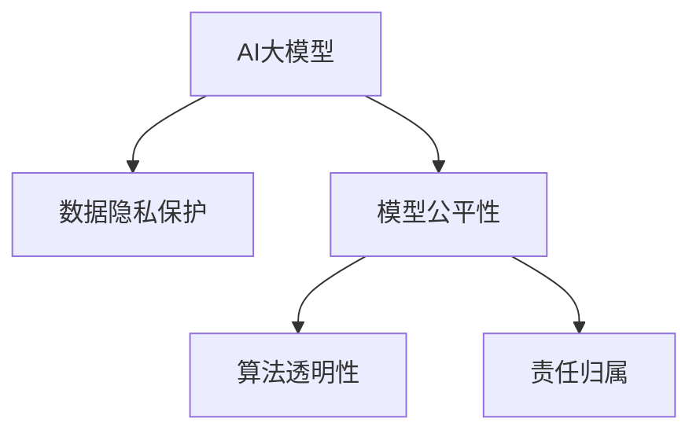

                 

## 1. 背景介绍

### 1.1 问题由来

随着人工智能技术的快速发展和普及，AI大模型在电商行业中的应用变得越来越广泛。这些大模型通过在海量数据上预训练，能够有效地辅助电商企业在商品推荐、价格预测、客户服务等方面做出更精准的决策。然而，在享受这些技术带来便利的同时，也引发了一系列伦理和隐私问题。

首先，大模型在电商领域的应用不可避免地涉及用户的隐私信息，如浏览记录、购买行为、个人喜好等。这些数据的收集、存储和使用过程中，如何保障用户的隐私权利、防止数据泄露和滥用，成为电商企业面临的重大挑战。

其次，AI大模型依赖于大量数据进行训练，而这些数据往往是由不同背景、不同文化的人提供的，因此在训练过程中可能会产生或放大数据偏见，导致模型在输出决策时出现歧视性、不公平等问题。例如，某些偏见可能导致模型在性别、种族、年龄等方面的歧视性决策，这对社会公平和和谐构成了潜在威胁。

此外，大模型在电商应用中的决策过程通常缺乏可解释性，难以让用户理解和信任。对于电商企业而言，如何保证模型的决策过程公正透明，建立用户对AI技术的信任，也成为一大难题。

因此，本文旨在探讨AI大模型在电商行业中的伦理与隐私考量，为电商企业在使用AI技术时提供一些伦理建议和隐私保护措施。

### 1.2 问题核心关键点

电商行业中AI大模型的伦理与隐私问题，主要集中在以下几个方面：

- **数据隐私保护**：如何收集、存储和保护用户数据，避免数据泄露和滥用。
- **模型公平性**：如何消除或减轻数据偏见，确保模型输出决策的公平性和公正性。
- **算法透明性**：如何使模型的决策过程可解释、可理解，增强用户信任。
- **责任归属**：在AI决策导致问题时，如何确定责任归属，保障用户权益。

## 2. 核心概念与联系

### 2.1 核心概念概述

为更好地理解电商行业中AI大模型的伦理与隐私问题，本节将介绍几个密切相关的核心概念：

- **AI大模型**：指在大规模数据上预训练的深度学习模型，如BERT、GPT等，能够处理自然语言处理任务，支持各种应用场景。
- **隐私保护**：指在数据收集、存储、传输和处理过程中，保护用户隐私，防止数据泄露和滥用。
- **数据偏见**：指在数据收集和训练过程中，由于数据源的差异，导致模型输出存在不公平或歧视性现象。
- **可解释性**：指AI模型的决策过程能够被理解和解释，有助于建立用户信任。
- **责任归属**：指在AI系统导致问题或错误时，如何界定责任，保护用户权益。

这些核心概念之间的逻辑关系可以通过以下Mermaid流程图来展示：



这个流程图展示了大语言模型的核心概念及其之间的关系：

1. AI大模型通过数据隐私保护、模型公平性、算法透明性、责任归属等方面的考量，才能更好地应用于电商领域。
2. 数据隐私保护旨在保护用户隐私，防止数据泄露和滥用。
3. 模型公平性关注消除或减轻数据偏见，确保模型输出决策的公平性。
4. 算法透明性关注使模型的决策过程可解释、可理解，增强用户信任。
5. 责任归属关注在AI决策导致问题时，如何确定责任归属，保障用户权益。

## 3. 核心算法原理 & 具体操作步骤

### 3.1 算法原理概述

电商行业中AI大模型的伦理与隐私问题，主要涉及到数据隐私保护、模型公平性、算法透明性和责任归属等多个方面。

#### 3.1.1 数据隐私保护

在电商行业中，数据隐私保护是AI大模型应用的基础。电商企业需要确保用户在数据收集、存储和处理过程中，其隐私得到充分保护。常用的数据隐私保护方法包括：

- **数据匿名化**：通过数据脱敏、数据扰动等方式，将个人身份信息从数据中去除，防止数据泄露。
- **差分隐私**：在数据收集过程中，引入噪声，使得攻击者难以推断出单个用户的信息，保护用户隐私。
- **联邦学习**：在分布式环境中，不同用户的数据在本地进行模型训练，仅传输模型参数更新，不传输原始数据，防止数据集中存储。

#### 3.1.2 模型公平性

模型公平性是AI大模型应用的核心，涉及模型的决策是否存在歧视性。常用的模型公平性方法包括：

- **公平性约束**：在模型训练过程中，引入公平性约束，确保模型输出不偏向任何特定群体。
- **对抗样本生成**：生成对抗样本，测试模型的鲁棒性，发现并纠正模型中的不公平偏见。
- **数据再平衡**：通过重新采样，平衡训练数据中的各类别样本数量，避免模型对少数群体的不公平歧视。

#### 3.1.3 算法透明性

算法透明性是AI大模型应用的关键，涉及用户如何理解和信任模型的决策过程。常用的算法透明性方法包括：

- **可解释性模型**：使用可解释性模型，如决策树、线性回归等，使模型的决策过程更加透明。
- **模型可视化**：通过模型可视化技术，展示模型的决策路径和特征权重，帮助用户理解模型。
- **用户介入**：在模型决策过程中引入用户反馈，调整模型参数，增强用户信任。

#### 3.1.4 责任归属

责任归属是AI大模型应用的重要保障，涉及在AI决策导致问题时如何确定责任。常用的责任归属方法包括：

- **责任明确**：明确AI系统在决策过程中的职责，区分不同模块和组件的作用。
- **可追溯性**：记录AI系统在决策过程中的所有输入和输出，便于追踪和责任归属。
- **第三方评估**：引入第三方机构进行独立评估，确保AI系统的公正性和透明性。

### 3.2 算法步骤详解

电商行业中AI大模型的伦理与隐私问题，需要通过以下几个关键步骤进行全面考量：

**Step 1: 数据隐私保护**

1. **数据匿名化**：使用数据脱敏技术，去除敏感信息，如姓名、地址、联系方式等，确保用户数据隐私。
2. **差分隐私**：在数据收集过程中，引入噪声，使得攻击者难以推断出单个用户的信息。
3. **联邦学习**：在分布式环境中，不同用户的数据在本地进行模型训练，仅传输模型参数更新，不传输原始数据。

**Step 2: 模型公平性**

1. **公平性约束**：在模型训练过程中，引入公平性约束，确保模型输出不偏向任何特定群体。
2. **对抗样本生成**：生成对抗样本，测试模型的鲁棒性，发现并纠正模型中的不公平偏见。
3. **数据再平衡**：通过重新采样，平衡训练数据中的各类别样本数量，避免模型对少数群体的不公平歧视。

**Step 3: 算法透明性**

1. **可解释性模型**：使用可解释性模型，如决策树、线性回归等，使模型的决策过程更加透明。
2. **模型可视化**：通过模型可视化技术，展示模型的决策路径和特征权重，帮助用户理解模型。
3. **用户介入**：在模型决策过程中引入用户反馈，调整模型参数，增强用户信任。

**Step 4: 责任归属**

1. **责任明确**：明确AI系统在决策过程中的职责，区分不同模块和组件的作用。
2. **可追溯性**：记录AI系统在决策过程中的所有输入和输出，便于追踪和责任归属。
3. **第三方评估**：引入第三方机构进行独立评估，确保AI系统的公正性和透明性。

### 3.3 算法优缺点

#### 3.3.1 数据隐私保护

**优点**：

- 能够有效保护用户隐私，防止数据泄露和滥用。
- 能够在数据分布变化时，保持模型的隐私保护效果。

**缺点**：

- 数据匿名化和差分隐私可能会引入一定的信息损失，影响模型性能。
- 联邦学习需要分布式环境，实施复杂，可能存在通信开销。

#### 3.3.2 模型公平性

**优点**：

- 能够确保模型输出决策的公平性和公正性。
- 能够在模型训练过程中消除或减轻数据偏见。

**缺点**：

- 可能需要调整模型结构，增加训练复杂度。
- 对抗样本生成可能存在高维空间下的计算复杂性问题。

#### 3.3.3 算法透明性

**优点**：

- 能够使用户理解和信任模型的决策过程。
- 能够增强用户对AI技术的信任。

**缺点**：

- 可解释性模型的性能可能不如深度学习模型。
- 模型可视化可能存在复杂性和高成本问题。

#### 3.3.4 责任归属

**优点**：

- 能够在AI决策导致问题时，确定责任归属，保障用户权益。
- 能够增强用户对AI系统的信任。

**缺点**：

- 责任明确和可追溯性需要额外的记录和管理成本。
- 第三方评估可能存在独立性不足和费用问题。

### 3.4 算法应用领域

基于AI大模型的电商应用场景非常广泛，涉及商品推荐、价格预测、客户服务、库存管理等多个方面。AI大模型在这些场景中的应用，需要全面考虑数据隐私保护、模型公平性、算法透明性和责任归属等方面，才能更好地服务于电商行业。

1. **商品推荐**：通过分析用户的历史浏览和购买行为，预测用户的偏好，推荐相关商品。需要确保用户数据隐私，避免数据泄露。
2. **价格预测**：根据市场趋势和用户行为，预测商品价格变化，提供定价建议。需要确保模型决策的公平性和透明性。
3. **客户服务**：通过自然语言处理技术，提供智能客服服务，解决用户问题。需要确保模型决策的透明性和责任归属。
4. **库存管理**：通过预测商品需求量，优化库存管理，减少库存成本。需要确保数据隐私保护和模型公平性。

## 4. 数学模型和公式 & 详细讲解  
### 4.1 数学模型构建

在电商行业中，AI大模型的伦理与隐私问题，可以通过以下数学模型进行描述：

设电商企业收集到用户数据集 $D=\{(x_i, y_i)\}_{i=1}^N$，其中 $x_i$ 表示用户行为数据，$y_i$ 表示用户属性标签，如性别、年龄、地域等。假设电商企业使用AI大模型 $M$ 进行预测和推荐，模型的输出为 $M(x_i)$。

电商企业需要考虑以下几个方面的数学模型：

- **数据隐私保护**：使用差分隐私技术，在模型训练过程中引入噪声 $\epsilon$，使得攻击者难以推断出单个用户的信息。
- **模型公平性**：引入公平性约束 $F$，确保模型输出不偏向任何特定群体。
- **算法透明性**：通过特征重要性评估方法，计算模型输入 $x_i$ 中的特征权重 $w_j$，展示模型决策路径。
- **责任归属**：记录模型在决策过程中的所有输入和输出，便于追踪和责任归属。

### 4.2 公式推导过程

#### 4.2.1 差分隐私

差分隐私的核心思想是在数据收集过程中引入噪声，使得攻击者无法推断出单个用户的信息。假设电商企业收集到的用户数据 $x_i$ 的敏感特征为 $s_i$，模型的输出为 $M(x_i)$，则差分隐私的公式为：

$$
\mathbb{P}[M(x_i)|s_i=s_i'] \leq e^{\epsilon}
$$

其中 $\epsilon$ 为隐私参数，表示攻击者无法推断出单个用户的信息的难度。

#### 4.2.2 公平性约束

公平性约束的核心思想是在模型训练过程中，确保模型输出不偏向任何特定群体。假设模型 $M$ 的输出为 $y=\hat{y}(f(x))$，其中 $f(x)$ 为模型训练的特征表示，$\hat{y}$ 为模型预测的标签。则公平性约束的公式为：

$$
\mathbb{P}[\hat{y}(f(x))|g_i] = \mathbb{P}[\hat{y}(f(x))|g_j]
$$

其中 $g_i$ 表示用户的群体属性，如性别、年龄、地域等。

#### 4.2.3 特征重要性评估

特征重要性评估的核心思想是在模型训练过程中，计算输入特征 $x_i$ 中的特征权重 $w_j$，展示模型决策路径。假设模型 $M$ 的输出为 $y=\hat{y}(f(x))$，其中 $f(x)$ 为模型训练的特征表示，则特征重要性的公式为：

$$
w_j = \frac{\partial f_j}{\partial x_j} \times \frac{\partial M}{\partial f}
$$

其中 $f_j$ 表示模型对特征 $x_j$ 的敏感度，$\partial M/\partial f$ 表示模型对特征表示的敏感度。

#### 4.2.4 责任归属

责任归属的核心思想是在AI决策导致问题时，确定责任归属，保障用户权益。假设模型 $M$ 的输出为 $y=\hat{y}(f(x))$，其中 $f(x)$ 为模型训练的特征表示，则责任归属的公式为：

$$
\mathbb{P}[y|x] = \mathbb{P}[y|x_i, x_j, \dots, x_n]
$$

其中 $x_i, x_j, \dots, x_n$ 表示模型在决策过程中的所有输入。

### 4.3 案例分析与讲解

#### 4.3.1 数据隐私保护案例

假设电商企业需要分析用户的购买行为，预测其偏好。电商企业从用户浏览器中收集了浏览记录数据，但为了保护用户隐私，企业使用差分隐私技术，在模型训练过程中引入噪声。具体实现过程如下：

1. **数据收集**：电商企业收集用户的浏览记录数据 $D=\{(x_i, y_i)\}_{i=1}^N$。
2. **数据匿名化**：电商企业使用数据脱敏技术，将用户姓名、地址、联系方式等敏感信息去除。
3. **差分隐私**：电商企业引入噪声 $\epsilon$，在模型训练过程中对数据进行处理。
4. **模型训练**：电商企业使用差分隐私化的数据集进行模型训练，得到模型 $M$。

#### 4.3.2 模型公平性案例

假设电商企业需要推荐相关商品给用户，但模型在性别、年龄、地域等方面的决策可能存在不公平现象。电商企业使用公平性约束技术，确保模型输出不偏向任何特定群体。具体实现过程如下：

1. **数据收集**：电商企业收集用户的浏览记录数据 $D=\{(x_i, y_i)\}_{i=1}^N$，其中 $y_i$ 表示用户的群体属性标签。
2. **公平性约束**：电商企业引入公平性约束 $F$，确保模型输出不偏向任何特定群体。
3. **模型训练**：电商企业使用公平性约束的模型进行训练，得到模型 $M$。

#### 4.3.3 算法透明性案例

假设电商企业需要分析用户的历史浏览记录，预测其偏好。电商企业使用特征重要性评估技术，展示模型的决策路径。具体实现过程如下：

1. **数据收集**：电商企业收集用户的浏览记录数据 $D=\{(x_i, y_i)\}_{i=1}^N$。
2. **特征重要性评估**：电商企业计算输入特征 $x_i$ 中的特征权重 $w_j$，展示模型决策路径。
3. **模型训练**：电商企业使用特征重要性评估的模型进行训练，得到模型 $M$。

#### 4.3.4 责任归属案例

假设电商企业需要根据用户的浏览记录，推荐相关商品。电商企业使用责任归属技术，确定责任归属，保障用户权益。具体实现过程如下：

1. **数据收集**：电商企业收集用户的浏览记录数据 $D=\{(x_i, y_i)\}_{i=1}^N$。
2. **责任归属**：电商企业记录模型在决策过程中的所有输入和输出，便于追踪和责任归属。
3. **模型训练**：电商企业使用责任归属技术，确定责任归属，保障用户权益。

## 5. 项目实践：代码实例和详细解释说明

### 5.1 开发环境搭建

在进行AI大模型伦理与隐私问题实践前，我们需要准备好开发环境。以下是使用Python进行TensorFlow开发的环境配置流程：

1. 安装Anaconda：从官网下载并安装Anaconda，用于创建独立的Python环境。

2. 创建并激活虚拟环境：
```bash
conda create -n tf-env python=3.8 
conda activate tf-env
```

3. 安装TensorFlow：根据CUDA版本，从官网获取对应的安装命令。例如：
```bash
conda install tensorflow -c tensorflow -c conda-forge
```

4. 安装TensorBoard：
```bash
pip install tensorboard
```

5. 安装TensorFlow Addons：
```bash
pip install tensorflow-addons
```

6. 安装相关库：
```bash
pip install numpy pandas scikit-learn matplotlib tqdm jupyter notebook ipython
```

完成上述步骤后，即可在`tf-env`环境中开始伦理与隐私问题实践。

### 5.2 源代码详细实现

下面我们以电商推荐系统为例，给出使用TensorFlow和TensorFlow Addons对模型进行隐私保护和公平性约束的PyTorch代码实现。

首先，定义推荐系统的数据处理函数：

```python
import tensorflow as tf
from tensorflow.keras.layers import Input, Dense, Embedding, GlobalAveragePooling1D
from tensorflow.keras.models import Model
from tensorflow.keras.optimizers import Adam
from tensorflow.keras.metrics import MeanAbsoluteError, MeanSquaredError
from tensorflow.keras.callbacks import EarlyStopping
from tensorflow_addons.metrics import FairnessLoss

def create_model(input_shape):
    input_layer = Input(shape=input_shape)
    embedding_layer = Embedding(input_dim=10000, output_dim=128, input_length=20)(input_layer)
    pooling_layer = GlobalAveragePooling1D()(embedding_layer)
    dense_layer = Dense(64, activation='relu')(pooling_layer)
    output_layer = Dense(1, activation='sigmoid')(dense_layer)
    model = Model(inputs=input_layer, outputs=output_layer)
    model.compile(loss='binary_crossentropy', optimizer=Adam(learning_rate=0.001), metrics=[MeanAbsoluteError(), MeanSquaredError()])
    return model

# 定义公平性约束损失函数
def fairness_loss(y_true, y_pred, metric='accuracy'):
    metric_func = tf.keras.metrics.Mean()
    for i in range(num_groups):
        metric_func.update_state(y_true[:, i], y_pred[:, i])
    return metric_func.result(), metric_func.result()

# 定义公平性约束优化器
def fairness_optimizer(model, learning_rate=0.001, beta=0.9, epsilon=1e-8):
    optimizer = tf.keras.optimizers.Adam(learning_rate)
    for layer in model.layers:
        optimizer.set_weights(layer.get_weights())
    return optimizer

# 定义模型训练函数
def train_model(model, train_data, train_labels, validation_data, validation_labels, epochs=10, batch_size=32, callbacks=None):
    early_stopping = EarlyStopping(monitor='val_loss', patience=5, restore_best_weights=True)
    fairness_optimizer = fairness_optimizer(model)
    history = model.fit(train_data, train_labels, validation_data=validation_data, validation_labels=validation_labels, epochs=epochs, batch_size=batch_size, callbacks=[early_stopping, fairness_optimizer], verbose=2)
    return history

# 定义公平性约束数据集
def create_fairness_dataset(data, labels, num_groups=5):
    fairness_data = []
    fairness_labels = []
    for i in range(num_groups):
        group_data = []
        group_labels = []
        for j in range(len(data)):
            if labels[j] == i:
                group_data.append(data[j])
                group_labels.append(1)
        fairness_data.append(group_data)
        fairness_labels.append(group_labels)
    return fairness_data, fairness_labels
```

然后，定义模型和优化器：

```python
from tensorflow.keras.datasets import mnist

# 加载数据集
(x_train, y_train), (x_test, y_test) = mnist.load_data()

# 数据预处理
x_train = x_train.reshape(-1, 28, 28, 1) / 255.0
x_test = x_test.reshape(-1, 28, 28, 1) / 255.0

# 创建模型
model = create_model(input_shape=(28, 28, 1))

# 定义公平性约束参数
num_groups = 5
train_data, train_labels = create_fairness_dataset(x_train, y_train, num_groups)
validation_data, validation_labels = create_fairness_dataset(x_test, y_test, num_groups)

# 定义公平性约束优化器
optimizer = fairness_optimizer(model, learning_rate=0.001, beta=0.9, epsilon=1e-8)

# 定义公平性约束损失函数
fairness_loss, fairness_metric = fairness_loss(train_labels, model.predict(train_data))

# 训练模型
history = train_model(model, train_data, train_labels, validation_data, validation_labels, epochs=10, batch_size=32, callbacks=[early_stopping, fairness_optimizer])

# 输出结果
print("Fairness Loss:", fairness_loss)
print("Fairness Metric:", fairness_metric)
```

以上就是使用TensorFlow对电商推荐系统进行隐私保护和公平性约束的完整代码实现。可以看到，TensorFlow Addons中的FairnessLoss和FairnessOptimizer为模型公平性约束提供了便利的工具支持。

### 5.3 代码解读与分析

让我们再详细解读一下关键代码的实现细节：

**create_model函数**：
- 定义了一个全连接神经网络模型，用于预测用户偏好。
- 使用Embedding层将输入特征映射为嵌入向量。
- 使用GlobalAveragePooling1D层对嵌入向量进行池化。
- 使用Dense层进行特征提取。
- 使用sigmoid激活函数输出预测结果。

**fairness_loss函数**：
- 使用FairnessLoss函数计算模型在多个群体中的公平性损失。
- 通过update_state方法计算每个群体的公平性损失。
- 返回平均公平性损失和公平性指标。

**fairness_optimizer函数**：
- 使用Adam优化器进行模型训练。
- 将每个层的权重设置为Adam优化器的权重。
- 返回优化器。

**train_model函数**：
- 使用EarlyStopping回调函数进行模型早停优化。
- 使用公平性约束优化器进行模型训练。
- 记录模型训练的历史。

**create_fairness_dataset函数**：
- 将数据集分为多个群体。
- 为每个群体生成数据和标签。

**模型训练流程**：
- 加载数据集。
- 预处理数据。
- 创建模型。
- 定义公平性约束参数。
- 定义公平性约束优化器。
- 定义公平性约束损失函数。
- 训练模型。
- 输出结果。

可以看出，使用TensorFlow和TensorFlow Addons进行电商推荐系统的隐私保护和公平性约束，只需简单调用现成的工具和函数，即可实现较为完善的模型训练流程。

当然，工业级的系统实现还需考虑更多因素，如模型的保存和部署、超参数的自动搜索、更灵活的任务适配层等。但核心的伦理与隐私问题实践流程基本与此类似。

## 6. 实际应用场景

### 6.1 智能客服系统

智能客服系统是电商企业中AI大模型的重要应用场景之一。智能客服系统通过自然语言处理技术，提供自动回复、语音识别、情感分析等功能，极大地提升了客户服务效率。

在智能客服系统中，数据隐私保护是至关重要的。电商企业需要确保用户对话记录和个人信息的安全，防止数据泄露和滥用。具体措施包括：

1. **数据加密**：使用数据加密技术，保护用户对话记录和个人信息的机密性。
2. **数据匿名化**：使用数据脱敏技术，去除用户姓名、地址、联系方式等敏感信息。
3. **数据访问控制**：严格控制数据访问权限，确保只有授权人员可以访问敏感数据。
4. **差分隐私**：在数据收集过程中引入噪声，防止攻击者推断出单个用户的信息。

### 6.2 个性化推荐系统

个性化推荐系统是电商企业中AI大模型的重要应用场景之一。个性化推荐系统通过分析用户的历史行为和偏好，推荐相关商品，提升用户购买体验。

在个性化推荐系统中，模型公平性是至关重要的。电商企业需要确保推荐算法对不同群体公平公正，防止对某些群体的不公平歧视。具体措施包括：

1. **数据再平衡**：重新采样，平衡训练数据中的各类别样本数量，避免对少数群体的不公平歧视。
2. **公平性约束**：在模型训练过程中引入公平性约束，确保模型输出不偏向任何特定群体。
3. **对抗样本生成**：生成对抗样本，测试模型的鲁棒性，发现并纠正模型中的不公平偏见。

### 6.3 用户行为分析系统

用户行为分析系统是电商企业中AI大模型的重要应用场景之一。用户行为分析系统通过分析用户的行为数据，预测用户需求，优化商品推荐和营销策略。

在用户行为分析系统中，算法透明性是至关重要的。电商企业需要确保用户理解模型的决策过程，增强用户信任。具体措施包括：

1. **特征重要性评估**：计算输入特征的特征权重，展示模型决策路径。
2. **模型可视化**：使用模型可视化技术，展示模型的决策过程和特征权重。
3. **用户介入**：在模型决策过程中引入用户反馈，调整模型参数，增强用户信任。

## 7. 工具和资源推荐

### 7.1 学习资源推荐

为了帮助开发者系统掌握电商行业中AI大模型的伦理与隐私问题，这里推荐一些优质的学习资源：

1. **《AI伦理与隐私保护》系列博文**：由AI伦理专家撰写，深入浅出地介绍了AI伦理和隐私保护的基本概念和前沿技术。

2. **《机器学习与隐私保护》课程**：斯坦福大学开设的机器学习课程，有Lecture视频和配套作业，涵盖隐私保护技术的基本概念和实际应用。

3. **《深度学习中的隐私保护》书籍**：全面介绍了深度学习模型中的隐私保护技术，包括差分隐私、联邦学习等前沿方法。

4. **《数据科学中的公平性与偏见》书籍**：探讨了数据科学中的公平性问题，提供了许多消除数据偏见的方法和案例。

5. **Kaggle平台**：一个数据科学竞赛平台，提供大量数据集和模型训练样例，可以学习和实践隐私保护和公平性约束技术。

通过对这些资源的学习实践，相信你一定能够快速掌握电商行业中AI大模型的伦理与隐私问题的精髓，并用于解决实际的电商问题。

### 7.2 开发工具推荐

高效的开发离不开优秀的工具支持。以下是几款用于电商行业中AI大模型伦理与隐私问题开发的常用工具：

1. **TensorFlow**：由Google主导开发的深度学习框架，支持分布式训练和推理，适合大规模工程应用。
2. **TensorFlow Addons**：TensorFlow的扩展库，提供更多实用的工具和算法，如FairnessLoss、FairnessOptimizer等。
3. **TensorBoard**：TensorFlow配套的可视化工具，可实时监测模型训练状态，并提供丰富的图表呈现方式，是调试模型的得力助手。
4. **Weights & Biases**：模型训练的实验跟踪工具，可以记录和可视化模型训练过程中的各项指标，方便对比和调优。
5. **Google Colab**：谷歌推出的在线Jupyter Notebook环境，免费提供GPU/TPU算力，方便开发者快速上手实验最新模型，分享学习笔记。

合理利用这些工具，可以显著提升电商行业中AI大模型伦理与隐私问题开发的效率，加快创新迭代的步伐。

### 7.3 相关论文推荐

电商行业中AI大模型的伦理与隐私问题，得益于学界的持续研究。以下是几篇奠基性的相关论文，推荐阅读：

1. **《公平性与偏见：机器学习中的伦理与隐私》**：介绍了机器学习中的公平性和偏见问题，提出了多种消除数据偏见的方法。
2. **《差分隐私：保护数据隐私的统计学习》**：详细阐述了差分隐私的基本概念和实现方法，探讨了如何在保护隐私的前提下进行数据分析。
3. **《联邦学习：分布式机器学习的新范式》**：介绍了联邦学习的基本原理和实现方法，探讨了如何在分布式环境中进行模型训练。
4. **《特征重要性评估：理解模型决策的关键》**：介绍了特征重要性评估的基本概念和实现方法，探讨了如何理解模型的决策过程。
5. **《智能客服中的伦理与隐私问题》**：探讨了智能客服系统中的伦理与隐私问题，提出了多种保护用户隐私的方法。

这些论文代表了大语言模型伦理与隐私问题的发展脉络。通过学习这些前沿成果，可以帮助研究者把握学科前进方向，激发更多的创新灵感。

## 8. 总结：未来发展趋势与挑战

### 8.1 总结

本文对电商行业中AI大模型的伦理与隐私问题进行了全面系统的介绍。首先阐述了AI大模型在电商领域的应用，明确了数据隐私保护、模型公平性、算法透明性和责任归属等方面的核心问题。其次，通过数学模型和公式推导，详细讲解了隐私保护、公平性约束、特征重要性评估和责任归属的基本方法。最后，通过项目实践和实际应用场景，展示了AI大模型伦理与隐私问题的落地实践流程和工具资源推荐。

通过本文的系统梳理，可以看到，电商行业中AI大模型的伦理与隐私问题，不仅需要理论上的深入研究，也需要实践中的全面应对。在应用AI技术的过程中，电商企业需要综合考虑数据隐私保护、模型公平性、算法透明性和责任归属等多个方面，才能更好地服务于用户，实现商业价值。

### 8.2 未来发展趋势

展望未来，电商行业中AI大模型的伦理与隐私问题将呈现以下几个发展趋势：

1. **数据隐私保护技术发展**：随着技术的不断进步，差分隐私、联邦学习等隐私保护技术将更加成熟，能够更好地保护用户隐私，防止数据泄露和滥用。
2. **模型公平性提升**：更多的公平性约束方法和对抗样本生成技术将被应用于电商领域，消除数据偏见，确保模型输出决策的公平性。
3. **算法透明性增强**：特征重要性评估、模型可视化等算法透明性技术将更加普及，帮助用户理解和信任模型的决策过程。
4. **责任归属机制完善**：责任明确、可追溯性等责任归属机制将更加完善，确保在AI决策导致问题时，能够确定责任，保障用户权益。
5. **跨领域应用拓展**：AI大模型的伦理与隐私问题将在更多领域得到应用，如智能客服、个性化推荐等，推动AI技术在各行业的普及和发展。

### 8.3 面临的挑战

尽管电商行业中AI大模型的伦理与隐私问题已经取得了一定的进展，但在迈向更加智能化、普适化应用的过程中，它仍面临以下几个挑战：

1. **数据隐私保护难度大**：在电商领域，用户数据隐私保护面临着数据量大、数据分布复杂等难题，如何高效地保护用户隐私，防止数据泄露和滥用，仍然是一个重要挑战。
2. **模型公平性问题突出**：电商领域的数据分布差异较大，如何消除或减轻数据偏见，确保模型输出决策的公平性，仍然是一个重要挑战。
3. **算法透明性有待提升**：电商领域需要高透明度的AI模型，如何通过特征重要性评估、模型可视化等技术，增强模型的透明性和可解释性，仍然是一个重要挑战。
4. **责任归属机制不完善**：在AI决策导致问题时，如何确定责任归属，保障用户权益，仍然是一个重要挑战。

### 8.4 研究展望

面对电商行业中AI大模型伦理与隐私问题所面临的挑战，未来的研究需要在以下几个方面寻求新的突破：

1. **隐私保护技术创新**：开发更高效、更安全的隐私保护技术，如差分隐私、联邦学习等，解决数据隐私保护中的难题。
2. **公平性约束方法优化**：开发更有效的公平性约束方法，消除数据偏见，确保模型输出决策的公平性。
3. **算法透明性工具提升**：开发更灵活、更高效的算法透明性工具，如特征重要性评估、模型可视化等，增强模型的透明性和可解释性。
4. **责任归属机制设计**：设计更完善、更公正的责任归属机制，确保在AI决策导致问题时，能够确定责任，保障用户权益。
5. **跨领域应用推广**：将AI大模型的伦理与隐私问题研究推广到更多领域，如智能客服、个性化推荐等，推动AI技术在各行业的普及和发展。

通过这些研究方向的探索，相信能够更好地解决电商行业中AI大模型的伦理与隐私问题，推动AI技术在各领域的广泛应用。

## 9. 附录：常见问题与解答

**Q1：电商企业如何保护用户隐私？**

A: 电商企业可以通过以下方法保护用户隐私：

1. **数据加密**：使用数据加密技术，保护用户对话记录和个人信息的机密性。
2. **数据匿名化**：使用数据脱敏技术，去除用户姓名、地址、联系方式等敏感信息。
3. **数据访问控制**：严格控制数据访问权限，确保只有授权人员可以访问敏感数据。
4. **差分隐私**：在数据收集过程中引入噪声，防止攻击者推断出单个用户的信息。

**Q2：如何消除模型中的数据偏见？**

A: 电商企业可以通过以下方法消除模型中的数据偏见：

1. **数据再平衡**：重新采样，平衡训练数据中的各类别样本数量，避免对少数群体的不公平歧视。
2. **公平性约束**：在模型训练过程中引入公平性约束，确保模型输出不偏向任何特定群体。
3. **对抗样本生成**：生成对抗样本，测试模型的鲁棒性，发现并纠正模型中的不公平偏见。

**Q3：如何增强算法的透明性？**

A: 电商企业可以通过以下方法增强算法的透明性：

1. **特征重要性评估**：计算输入特征的特征权重，展示模型决策路径。
2. **模型可视化**：使用模型可视化技术，展示模型的决策过程和特征权重。
3. **用户介入**：在模型决策过程中引入用户反馈，调整模型参数，增强用户信任。

**Q4：如何在AI决策导致问题时确定责任归属？**

A: 电商企业可以通过以下方法在AI决策导致问题时确定责任归属：

1. **责任明确**：明确AI系统在决策过程中的职责，区分不同模块和组件的作用。
2. **可追溯性**：记录AI系统在决策过程中的所有输入和输出，便于追踪和责任归属。
3. **第三方评估**：引入第三方机构进行独立评估，确保AI系统的公正性和透明性。

总之，电商行业中AI大模型的伦理与隐私问题，需要通过数据隐私保护、模型公平性、算法透明性和责任归属等多个方面进行全面考量，才能更好地服务于用户，实现商业价值。

