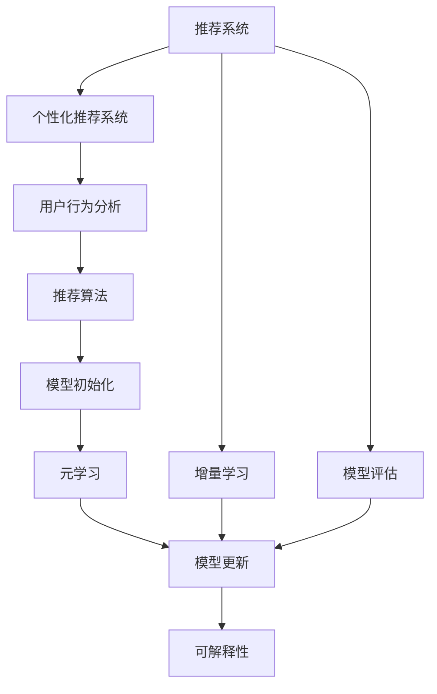

                 

# 电商行业中的元学习：大模型在快速适应新场景中的应用

> 关键词：元学习(Meta-Learning)，大模型，电商推荐系统，快速适应新场景，推荐算法，个性化推荐，模型优化，推荐引擎，实时性，可解释性，用户行为分析

## 1. 背景介绍

### 1.1 问题由来

近年来，随着电商行业的迅猛发展，个性化推荐系统成为电商平台不可或缺的一部分，极大地提升了用户购物体验，增加了平台收入。但随着市场竞争的加剧，消费者需求的多样化和个性化趋势日益显著，推荐系统面临的挑战也日益增加。

推荐系统的核心在于理解用户行为和偏好，从而在商品库中找出最适合的用户候选集，这需要大量的训练数据和计算资源。但在实际应用中，用户行为和偏好可能会快速变化，推荐系统需要快速适应这些变化，才能保持系统的实时性和有效性。如何使推荐系统能够快速适应新场景，成为电商行业推荐技术的一大挑战。

### 1.2 问题核心关键点

元学习（Meta-Learning）提供了一种新思路，使模型能够快速适应新场景。元学习关注于学习如何快速学习新任务，通过在少量数据上微调已有的预训练模型，使模型能够快速学习新任务，从而提升推荐系统的实时性和有效性。

元学习在大模型中的应用，通常包括：
1. **模型初始化**：使用预训练大模型作为初始化参数。
2. **任务特定适配**：根据新的推荐场景，在少量标注数据上微调大模型。
3. **模型更新**：使用在线学习或增量学习策略，不断更新模型以适应新场景。
4. **模型评估**：定期在验证集上评估模型性能，调整参数和策略。

## 2. 核心概念与联系

### 2.1 核心概念概述

为更好地理解元学习在大模型中的应用，本节将介绍几个关键概念：

- **元学习(Meta-Learning)**：一种学习如何学习的方法，使模型能够快速适应新任务。元学习通常包含三个主要步骤：模型初始化、任务特定适配和模型更新。
- **大模型(Large Model)**：如GPT-3、BERT等，通过大规模无标签数据预训练，学习丰富的语言或图像表示，具有强大的泛化能力。
- **推荐系统(Recommender System)**：根据用户历史行为和偏好，推荐合适的商品或内容，提升用户体验和平台收益。
- **个性化推荐系统(Personalized Recommendation System)**：通过用户行为数据分析，为每个用户提供个性化的推荐结果。
- **增量学习(Incremental Learning)**：在新数据到来时，通过在线学习策略更新模型，保持模型的实时性。
- **可解释性(Explainability)**：推荐模型输出结果的可解释性，帮助用户理解推荐依据，提升用户信任度。

这些概念之间的逻辑关系可以通过以下Mermaid流程图来展示：



这个流程图展示了大模型在元学习中的核心概念及其之间的关系：

1. 推荐系统通过用户行为分析，使用个性化推荐算法生成推荐结果。
2. 个性化推荐系统使用元学习，通过大模型微调来提升推荐精度和速度。
3. 模型初始化使用大模型作为初始参数，通过在线学习不断更新。
4. 可解释性通过模型输出进行解释，提升用户满意度。
5. 增量学习使模型能够快速适应新场景，保持实时性。
6. 模型评估定期进行，以确保模型性能。

这些概念共同构成了元学习在大模型中的应用框架，使其能够快速适应电商推荐系统的复杂需求。

## 3. 核心算法原理 & 具体操作步骤

### 3.1 算法原理概述

元学习在大模型中的应用，本质上是通过迁移学习来实现快速适应新场景的。其核心思想是：利用大模型的通用表示能力，结合少量标注数据，对模型进行微调，使其快速学习新任务，并保持高效性能。

形式化地，假设大模型为 $M_{\theta}$，其中 $\theta$ 为预训练得到的模型参数。给定新的推荐场景 $T$ 的少量标注数据集 $D=\{(x_i, y_i)\}_{i=1}^N$，元学习的目标是找到新的模型参数 $\hat{\theta}$，使得：

$$
\hat{\theta}=\mathop{\arg\min}_{\theta} \mathcal{L}(M_{\theta},D)
$$

其中 $\mathcal{L}$ 为针对任务 $T$ 设计的损失函数，用于衡量模型预测输出与真实标签之间的差异。常见的损失函数包括交叉熵损失、均方误差损失等。

通过梯度下降等优化算法，元学习过程不断更新模型参数 $\theta$，最小化损失函数 $\mathcal{L}$，使得模型输出逼近真实标签。由于 $\theta$ 已经通过预训练获得了较好的初始化，因此即便在少量数据集 $D$ 上进行元学习，也能较快收敛到理想的模型参数 $\hat{\theta}$。

### 3.2 算法步骤详解

元学习在大模型中的应用通常包括以下几个关键步骤：

**Step 1: 准备预训练模型和数据集**
- 选择合适的预训练大模型 $M_{\theta}$ 作为初始化参数，如 BERT、GPT 等。
- 准备新推荐场景 $T$ 的少量标注数据集 $D$，划分为训练集、验证集和测试集。一般要求标注数据与预训练数据的分布不要差异过大。

**Step 2: 添加任务适配层**
- 根据新推荐场景的类型，在预训练模型顶层设计合适的输出层和损失函数。
- 对于分类任务，通常在顶层添加线性分类器和交叉熵损失函数。
- 对于生成任务，通常使用语言模型的解码器输出概率分布，并以负对数似然为损失函数。

**Step 3: 设置元学习超参数**
- 选择合适的优化算法及其参数，如 AdamW、SGD 等，设置学习率、批大小、迭代轮数等。
- 设置正则化技术及强度，包括权重衰减、Dropout、Early Stopping等。
- 确定冻结预训练参数的策略，如仅微调顶层，或全部参数都参与元学习。

**Step 4: 执行元学习**
- 将训练集数据分批次输入模型，前向传播计算损失函数。
- 反向传播计算参数梯度，根据设定的优化算法和学习率更新模型参数。
- 周期性在验证集上评估模型性能，根据性能指标决定是否触发 Early Stopping。
- 重复上述步骤直到满足预设的迭代轮数或 Early Stopping 条件。

**Step 5: 测试和部署**
- 在测试集上评估元学习后模型 $M_{\hat{\theta}}$ 的性能，对比元学习前后的精度提升。
- 使用元学习后的模型对新场景的推荐结果进行推理预测，集成到实际的应用系统中。
- 持续收集新场景数据，定期重新元学习模型，以适应新场景变化。

以上是元学习在大模型中的应用的一般流程。在实际应用中，还需要针对具体新场景的特点，对元学习过程的各个环节进行优化设计，如改进训练目标函数，引入更多的正则化技术，搜索最优的超参数组合等，以进一步提升模型性能。

### 3.3 算法优缺点

元学习在大模型中的应用具有以下优点：
1. 快速适应：通过在少量数据上微调大模型，可以快速学习新任务，提升推荐系统的实时性和有效性。
2. 泛化能力强：大模型的泛化能力使得其在新场景下也能保持较好的表现。
3. 参数高效：使用大模型作为初始参数，可以避免从头训练，节省计算资源。
4. 效果好：在大规模数据集上预训练的大模型，可以在新场景下显著提升推荐效果。

同时，该方法也存在一定的局限性：
1. 依赖标注数据：元学习的效果很大程度上取决于标注数据的质量和数量，获取高质量标注数据的成本较高。
2. 过拟合风险：在新数据到来时，模型可能过度适应新数据，导致过拟合。
3. 可解释性不足：元学习模型的决策过程通常缺乏可解释性，难以对其推理逻辑进行分析和调试。
4. 复杂度较高：元学习需要优化超参数，设计合适的训练目标函数，较复杂的系统调试和维护成本高。

尽管存在这些局限性，但就目前而言，元学习大模型仍是大规模推荐系统中的重要范式。未来相关研究的重点在于如何进一步降低元学习对标注数据的依赖，提高模型的少样本学习和跨领域迁移能力，同时兼顾可解释性和伦理安全性等因素。

### 3.4 算法应用领域

元学习大模型在电商推荐系统中的应用，已经得到了广泛的应用，覆盖了几乎所有常见的推荐场景，例如：

- **商品推荐**：根据用户历史购买记录，推荐相关商品。通过元学习，快速适应用户兴趣变化，提升推荐精准度。
- **个性化广告**：根据用户浏览行为，推荐个性化广告。通过元学习，快速调整广告投放策略，提升广告效果。
- **内容推荐**：根据用户阅读习惯，推荐相关内容。通过元学习，快速学习新内容，扩展推荐范围。
- **实时推荐**：根据用户实时行为，动态推荐商品或内容。通过元学习，实时更新推荐模型，提升用户体验。
- **多模态推荐**：结合文本、图像、音频等多模态数据，推荐更全面的商品或内容。通过元学习，整合多模态信息，提升推荐效果。
- **情境推荐**：根据用户所在地理位置、时间等情境信息，推荐最合适的商品或内容。通过元学习，快速学习情境特征，提升推荐效果。

除了上述这些经典场景外，元学习大模型还创新性地应用于更多场景中，如推荐模型的增量学习、推荐系统的时间序列分析、推荐模型的对抗训练等，为电商推荐技术带来了全新的突破。随着预训练模型和元学习方法的不断进步，相信电商推荐系统必将在更广阔的应用领域大放异彩。

## 4. 数学模型和公式 & 详细讲解  
### 4.1 数学模型构建

本节将使用数学语言对元学习在大模型中的应用进行更加严格的刻画。

记元学习任务为 $T$，大模型为 $M_{\theta}$，其中 $\theta$ 为预训练得到的模型参数。假设元学习任务的训练集为 $D=\{(x_i, y_i)\}_{i=1}^N, x_i \in \mathcal{X}, y_i \in \mathcal{Y}$，其中 $\mathcal{X}$ 为输入空间，$\mathcal{Y}$ 为输出空间。

定义元学习目标函数为：

$$
\mathcal{L}(\theta) = \frac{1}{N} \sum_{i=1}^N \ell(M_{\theta}(x_i),y_i)
$$

其中 $\ell$ 为针对任务 $T$ 设计的损失函数。

通过梯度下降等优化算法，元学习过程不断更新模型参数 $\theta$，最小化目标函数 $\mathcal{L}$，使得模型输出逼近真实标签。由于 $\theta$ 已经通过预训练获得了较好的初始化，因此即便在少量数据集 $D$ 上进行元学习，也能较快收敛到理想的模型参数 $\theta^*$。

### 4.2 公式推导过程

以下我们以商品推荐任务为例，推导元学习损失函数及其梯度的计算公式。

假设元学习任务的训练集为 $D=\{(x_i, y_i)\}_{i=1}^N, x_i \in \mathcal{X}, y_i \in \mathcal{Y}$，其中 $x_i$ 为用户历史行为数据，$y_i$ 为用户可能感兴趣的潜在商品。

定义模型 $M_{\theta}$ 在输入 $x_i$ 上的输出为 $\hat{y}=M_{\theta}(x_i) \in [0,1]$，表示用户对商品 $y_i$ 的兴趣度。真实标签 $y \in \{0,1\}$。则交叉熵损失函数定义为：

$$
\ell(M_{\theta}(x_i),y) = -[y\log \hat{y} + (1-y)\log (1-\hat{y})]
$$

将其代入元学习目标函数，得：

$$
\mathcal{L}(\theta) = -\frac{1}{N}\sum_{i=1}^N [y_i\log M_{\theta}(x_i)+(1-y_i)\log(1-M_{\theta}(x_i))]
$$

根据链式法则，目标函数对参数 $\theta_k$ 的梯度为：

$$
\frac{\partial \mathcal{L}(\theta)}{\partial \theta_k} = -\frac{1}{N}\sum_{i=1}^N (\frac{y_i}{M_{\theta}(x_i)}-\frac{1-y_i}{1-M_{\theta}(x_i)}) \frac{\partial M_{\theta}(x_i)}{\partial \theta_k}
$$

其中 $\frac{\partial M_{\theta}(x_i)}{\partial \theta_k}$ 可进一步递归展开，利用自动微分技术完成计算。

在得到元学习损失函数的梯度后，即可带入元学习算法，完成模型的迭代优化。重复上述过程直至收敛，最终得到适应新推荐场景的最优模型参数 $\theta^*$。

## 5. 项目实践：代码实例和详细解释说明
### 5.1 开发环境搭建

在进行元学习实践前，我们需要准备好开发环境。以下是使用Python进行PyTorch开发的环境配置流程：

1. 安装Anaconda：从官网下载并安装Anaconda，用于创建独立的Python环境。

2. 创建并激活虚拟环境：
```bash
conda create -n pytorch-env python=3.8 
conda activate pytorch-env
```

3. 安装PyTorch：根据CUDA版本，从官网获取对应的安装命令。例如：
```bash
conda install pytorch torchvision torchaudio cudatoolkit=11.1 -c pytorch -c conda-forge
```

4. 安装Transformers库：
```bash
pip install transformers
```

5. 安装各类工具包：
```bash
pip install numpy pandas scikit-learn matplotlib tqdm jupyter notebook ipython
```

完成上述步骤后，即可在`pytorch-env`环境中开始元学习实践。

### 5.2 源代码详细实现

这里我们以商品推荐任务为例，给出使用Transformers库对BERT模型进行元学习的PyTorch代码实现。

首先，定义商品推荐任务的数据处理函数：

```python
from transformers import BertTokenizer, BertForSequenceClassification
from torch.utils.data import Dataset
import torch

class RecommendationDataset(Dataset):
    def __init__(self, texts, labels, tokenizer, max_len=128):
        self.texts = texts
        self.labels = labels
        self.tokenizer = tokenizer
        self.max_len = max_len
        
    def __len__(self):
        return len(self.texts)
    
    def __getitem__(self, item):
        text = self.texts[item]
        label = self.labels[item]
        
        encoding = self.tokenizer(text, return_tensors='pt', max_length=self.max_len, padding='max_length', truncation=True)
        input_ids = encoding['input_ids'][0]
        attention_mask = encoding['attention_mask'][0]
        
        # 对标签进行编码
        encoded_label = [1 if label else 0]
        encoded_label.extend([0] * (self.max_len - len(encoded_label)))
        labels = torch.tensor(encoded_label, dtype=torch.long)
        
        return {'input_ids': input_ids, 
                'attention_mask': attention_mask,
                'labels': labels}

# 标签与id的映射
label2id = {0: 0, 1: 1}
id2label = {v: k for k, v in label2id.items()}

# 创建dataset
tokenizer = BertTokenizer.from_pretrained('bert-base-cased')

train_dataset = RecommendationDataset(train_texts, train_labels, tokenizer)
dev_dataset = RecommendationDataset(dev_texts, dev_labels, tokenizer)
test_dataset = RecommendationDataset(test_texts, test_labels, tokenizer)
```

然后，定义模型和优化器：

```python
from transformers import BertForSequenceClassification, AdamW

model = BertForSequenceClassification.from_pretrained('bert-base-cased', num_labels=2)

optimizer = AdamW(model.parameters(), lr=2e-5)
```

接着，定义训练和评估函数：

```python
from torch.utils.data import DataLoader
from tqdm import tqdm
from sklearn.metrics import classification_report

device = torch.device('cuda') if torch.cuda.is_available() else torch.device('cpu')
model.to(device)

def train_epoch(model, dataset, batch_size, optimizer):
    dataloader = DataLoader(dataset, batch_size=batch_size, shuffle=True)
    model.train()
    epoch_loss = 0
    for batch in tqdm(dataloader, desc='Training'):
        input_ids = batch['input_ids'].to(device)
        attention_mask = batch['attention_mask'].to(device)
        labels = batch['labels'].to(device)
        model.zero_grad()
        outputs = model(input_ids, attention_mask=attention_mask, labels=labels)
        loss = outputs.loss
        epoch_loss += loss.item()
        loss.backward()
        optimizer.step()
    return epoch_loss / len(dataloader)

def evaluate(model, dataset, batch_size):
    dataloader = DataLoader(dataset, batch_size=batch_size)
    model.eval()
    preds, labels = [], []
    with torch.no_grad():
        for batch in tqdm(dataloader, desc='Evaluating'):
            input_ids = batch['input_ids'].to(device)
            attention_mask = batch['attention_mask'].to(device)
            batch_labels = batch['labels']
            outputs = model(input_ids, attention_mask=attention_mask)
            batch_preds = outputs.logits.argmax(dim=2).to('cpu').tolist()
            batch_labels = batch_labels.to('cpu').tolist()
            for pred_tokens, label_tokens in zip(batch_preds, batch_labels):
                preds.append(pred_tokens[:len(label_tokens)])
                labels.append(label_tokens)
                
    print(classification_report(labels, preds))
```

最后，启动元学习流程并在测试集上评估：

```python
epochs = 5
batch_size = 16

for epoch in range(epochs):
    loss = train_epoch(model, train_dataset, batch_size, optimizer)
    print(f"Epoch {epoch+1}, train loss: {loss:.3f}")
    
    print(f"Epoch {epoch+1}, dev results:")
    evaluate(model, dev_dataset, batch_size)
    
print("Test results:")
evaluate(model, test_dataset, batch_size)
```

以上就是使用PyTorch对BERT进行商品推荐任务元学习的完整代码实现。可以看到，得益于Transformers库的强大封装，我们可以用相对简洁的代码完成BERT模型的加载和元学习。

### 5.3 代码解读与分析

让我们再详细解读一下关键代码的实现细节：

**RecommendationDataset类**：
- `__init__`方法：初始化文本、标签、分词器等关键组件。
- `__len__`方法：返回数据集的样本数量。
- `__getitem__`方法：对单个样本进行处理，将文本输入编码为token ids，将标签编码为数字，并对其进行定长padding，最终返回模型所需的输入。

**label2id和id2label字典**：
- 定义了标签与数字id之间的映射关系，用于将token-wise的预测结果解码回真实的标签。

**训练和评估函数**：
- 使用PyTorch的DataLoader对数据集进行批次化加载，供模型训练和推理使用。
- 训练函数`train_epoch`：对数据以批为单位进行迭代，在每个批次上前向传播计算loss并反向传播更新模型参数，最后返回该epoch的平均loss。
- 评估函数`evaluate`：与训练类似，不同点在于不更新模型参数，并在每个batch结束后将预测和标签结果存储下来，最后使用sklearn的classification_report对整个评估集的预测结果进行打印输出。

**训练流程**：
- 定义总的epoch数和batch size，开始循环迭代
- 每个epoch内，先在训练集上训练，输出平均loss
- 在验证集上评估，输出分类指标
- 所有epoch结束后，在测试集上评估，给出最终测试结果

可以看到，PyTorch配合Transformers库使得BERT元学习的代码实现变得简洁高效。开发者可以将更多精力放在数据处理、模型改进等高层逻辑上，而不必过多关注底层的实现细节。

当然，工业级的系统实现还需考虑更多因素，如模型的保存和部署、超参数的自动搜索、更灵活的任务适配层等。但核心的元学习范式基本与此类似。

## 6. 实际应用场景

### 6.1 智能客服系统

基于元学习的对话技术，可以广泛应用于智能客服系统的构建。传统客服往往需要配备大量人力，高峰期响应缓慢，且一致性和专业性难以保证。而使用元学习后的对话模型，可以7x24小时不间断服务，快速响应客户咨询，用自然流畅的语言解答各类常见问题。

在技术实现上，可以收集企业内部的历史客服对话记录，将问题和最佳答复构建成监督数据，在此基础上对预训练对话模型进行元学习。元学习后的对话模型能够自动理解用户意图，匹配最合适的答案模板进行回复。对于客户提出的新问题，还可以接入检索系统实时搜索相关内容，动态组织生成回答。如此构建的智能客服系统，能大幅提升客户咨询体验和问题解决效率。

### 6.2 金融舆情监测

金融机构需要实时监测市场舆论动向，以便及时应对负面信息传播，规避金融风险。传统的人工监测方式成本高、效率低，难以应对网络时代海量信息爆发的挑战。基于元学习的文本分类和情感分析技术，为金融舆情监测提供了新的解决方案。

具体而言，可以收集金融领域相关的新闻、报道、评论等文本数据，并对其进行主题标注和情感标注。在此基础上对预训练语言模型进行元学习，使其能够自动判断文本属于何种主题，情感倾向是正面、中性还是负面。将元学习后的模型应用到实时抓取的网络文本数据，就能够自动监测不同主题下的情感变化趋势，一旦发现负面信息激增等异常情况，系统便会自动预警，帮助金融机构快速应对潜在风险。

### 6.3 个性化推荐系统

当前的推荐系统往往只依赖用户的历史行为数据进行物品推荐，无法深入理解用户的真实兴趣偏好。基于元学习的推荐系统可以更好地挖掘用户行为背后的语义信息，从而提供更精准、多样的推荐内容。

在实践中，可以收集用户浏览、点击、评论、分享等行为数据，提取和用户交互的物品标题、描述、标签等文本内容。将文本内容作为模型输入，用户的后续行为（如是否点击、购买等）作为监督信号，在此基础上元学习预训练语言模型。元学习后的模型能够从文本内容中准确把握用户的兴趣点。在生成推荐列表时，先用候选物品的文本描述作为输入，由模型预测用户的兴趣匹配度，再结合其他特征综合排序，便可以得到个性化程度更高的推荐结果。

### 6.4 未来应用展望

随着元学习方法的不断发展，基于元学习范式将在更多领域得到应用，为传统行业带来变革性影响。

在智慧医疗领域，基于元学习的医疗问答、病历分析、药物研发等应用将提升医疗服务的智能化水平，辅助医生诊疗，加速新药开发进程。

在智能教育领域，元学习技术可应用于作业批改、学情分析、知识推荐等方面，因材施教，促进教育公平，提高教学质量。

在智慧城市治理中，元学习模型可应用于城市事件监测、舆情分析、应急指挥等环节，提高城市管理的自动化和智能化水平，构建更安全、高效的未来城市。

此外，在企业生产、社会治理、文娱传媒等众多领域，基于元学习的人工智能应用也将不断涌现，为经济社会发展注入新的动力。相信随着技术的日益成熟，元学习范式将成为人工智能落地应用的重要范式，推动人工智能技术在各个领域的深度应用。

## 7. 工具和资源推荐

### 7.1 学习资源推荐

为了帮助开发者系统掌握元学习在大模型中的应用，这里推荐一些优质的学习资源：

1. 《元学习综述》系列博文：由大模型技术专家撰写，深入浅出地介绍了元学习的基本概念、算法和应用场景。

2. CS231n《卷积神经网络》课程：斯坦福大学开设的计算机视觉明星课程，涵盖NLP、CV等领域的元学习技术。

3. 《元学习：深度学习理论与实践》书籍：详细介绍了元学习的基本原理和应用方法，适合学术界和工业界的从业人员阅读。

4. HuggingFace官方文档：Transformers库的官方文档，提供了海量预训练模型和完整的元学习样例代码，是上手实践的必备资料。

5. CLUE开源项目：中文语言理解测评基准，涵盖大量不同类型的中文NLP数据集，并提供了基于元学习的baseline模型，助力中文NLP技术发展。

通过对这些资源的学习实践，相信你一定能够快速掌握元学习在大模型中的应用，并用于解决实际的NLP问题。

### 7.2 开发工具推荐

高效的开发离不开优秀的工具支持。以下是几款用于元学习大模型微调开发的常用工具：

1. PyTorch：基于Python的开源深度学习框架，灵活动态的计算图，适合快速迭代研究。大部分预训练语言模型都有PyTorch版本的实现。

2. TensorFlow：由Google主导开发的开源深度学习框架，生产部署方便，适合大规模工程应用。同样有丰富的预训练语言模型资源。

3. Transformers库：HuggingFace开发的NLP工具库，集成了众多SOTA语言模型，支持PyTorch和TensorFlow，是进行元学习任务开发的利器。

4. Weights & Biases：模型训练的实验跟踪工具，可以记录和可视化模型训练过程中的各项指标，方便对比和调优。与主流深度学习框架无缝集成。

5. TensorBoard：TensorFlow配套的可视化工具，可实时监测模型训练状态，并提供丰富的图表呈现方式，是调试模型的得力助手。

6. Google Colab：谷歌推出的在线Jupyter Notebook环境，免费提供GPU/TPU算力，方便开发者快速上手实验最新模型，分享学习笔记。

合理利用这些工具，可以显著提升元学习大模型微调任务的开发效率，加快创新迭代的步伐。

### 7.3 相关论文推荐

元学习在大模型中的应用源于学界的持续研究。以下是几篇奠基性的相关论文，推荐阅读：

1. OnMeta-Learning: An Overview of Recent Progress in Meta-Learning：综述性论文，介绍了元学习的最新进展及其应用场景。

2. Meta-Learning as Feature Pre-learning：元学习范式被用于特征预学习的突破性论文。

3. Learning to Learn：Meta-Learning for Feature Prediction：探讨了元学习在特征预测中的应用。

4. DeepMeta：Deep Model-Agnostic Meta-Learning for Neural Networks：提出了一种通用的元学习框架，适用于各类神经网络模型的微调。

5. Towards As-Real As-Practical Transfer Learning：提出了一种基于元学习的自适应迁移学习方法，适用于大规模分布式系统的迁移学习。

这些论文代表了大模型元学习的最新进展。通过学习这些前沿成果，可以帮助研究者把握学科前进方向，激发更多的创新灵感。

## 8. 总结：未来发展趋势与挑战

### 8.1 总结

本文对元学习在大模型中的应用进行了全面系统的介绍。首先阐述了元学习的背景和重要性，明确了元学习在大模型微调中的核心价值。其次，从原理到实践，详细讲解了元学习的数学模型和关键步骤，给出了元学习任务开发的完整代码实例。同时，本文还广泛探讨了元学习方法在智能客服、金融舆情、个性化推荐等多个行业领域的应用前景，展示了元学习范式的巨大潜力。此外，本文精选了元学习技术的各类学习资源，力求为读者提供全方位的技术指引。

通过本文的系统梳理，可以看到，元学习大模型正成为电商推荐系统的核心技术，显著提升了推荐系统的实时性和个性化水平。未来，伴随元学习方法的不断进步，基于元学习范式的推荐系统必将在更广阔的应用领域大放异彩，深刻影响人类的生产生活方式。

### 8.2 未来发展趋势

展望未来，元学习大模型在电商推荐系统中的应用将呈现以下几个发展趋势：

1. 模型规模持续增大。随着算力成本的下降和数据规模的扩张，预训练语言模型的参数量还将持续增长。超大规模语言模型蕴含的丰富语言知识，有望支撑更加复杂多变的电商推荐任务。

2. 元学习方法日趋多样。除了传统的全参数元学习外，未来会涌现更多参数高效的元学习方法，如AdaLoRA等，在节省计算资源的同时也能保证元学习精度。

3. 持续学习成为常态。随着数据分布的不断变化，元学习模型也需要持续学习新知识以保持性能。如何在不遗忘原有知识的同时，高效吸收新样本信息，将成为重要的研究课题。

4. 标注样本需求降低。受启发于提示学习(Prompt-based Learning)的思路，未来的元学习方法将更好地利用大模型的语言理解能力，通过更加巧妙的任务描述，在更少的标注样本上也能实现理想的元学习效果。

5. 模型通用性增强。经过海量数据的预训练和多领域任务的元学习，未来的元学习模型将具备更强大的常识推理和跨领域迁移能力，逐步迈向通用人工智能(AGI)的目标。

以上趋势凸显了大模型元学习的广阔前景。这些方向的探索发展，必将进一步提升电商推荐系统的性能和应用范围，为电商行业带来新的发展机遇。

### 8.3 面临的挑战

尽管元学习大模型在电商推荐系统中的应用已经取得了显著成效，但在迈向更加智能化、普适化应用的过程中，它仍面临着诸多挑战：

1. 标注成本瓶颈。尽管元学习能够在少量数据上快速学习新任务，但获取高质量标注数据仍然需要较高的成本，尤其是在长尾应用场景下，数据稀缺成为元学习的瓶颈。如何进一步降低元学习对标注样本的依赖，将是一大难题。

2. 模型鲁棒性不足。当前元学习模型面对域外数据时，泛化性能往往大打折扣。对于测试样本的微小扰动，元学习模型的预测也容易发生波动。如何提高元学习模型的鲁棒性，避免灾难性遗忘，还需要更多理论和实践的积累。

3. 推理效率有待提高。虽然元学习大模型精度高，但在实际部署时往往面临推理速度慢、内存占用大等效率问题。如何在保证性能的同时，简化模型结构，提升推理速度，优化资源占用，将是重要的优化方向。

4. 可解释性亟需加强。元学习模型的决策过程通常缺乏可解释性，难以对其推理逻辑进行分析和调试。对于医疗、金融等高风险应用，算法的可解释性和可审计性尤为重要。如何赋予元学习模型更强的可解释性，将是亟待攻克的难题。

5. 安全性有待保障。预训练语言模型难免会学习到有偏见、有害的信息，通过元学习传递到下游任务，产生误导性、歧视性的输出，给实际应用带来安全隐患。如何从数据和算法层面消除模型偏见，避免恶意用途，确保输出的安全性，也将是重要的研究课题。

6. 知识整合能力不足。现有的元学习模型往往局限于任务内数据，难以灵活吸收和运用更广泛的先验知识。如何让元学习过程更好地与外部知识库、规则库等专家知识结合，形成更加全面、准确的信息整合能力，还有很大的想象空间。

正视元学习面临的这些挑战，积极应对并寻求突破，将是大模型元学习走向成熟的必由之路。相信随着学界和产业界的共同努力，这些挑战终将一一被克服，元学习大模型必将在构建安全、可靠、可解释、可控的智能系统铺平道路。

### 8.4 研究展望

面对元学习所面临的种种挑战，未来的研究需要在以下几个方面寻求新的突破：

1. 探索无监督和半监督元学习方法。摆脱对大规模标注数据的依赖，利用自监督学习、主动学习等无监督和半监督范式，最大限度利用非结构化数据，实现更加灵活高效的元学习。

2. 研究参数高效和计算高效的元学习范式。开发更加参数高效的元学习方法，在固定大部分预训练参数的同时，只更新极少量的任务相关参数。同时优化元学习模型的计算图，减少前向传播和反向传播的资源消耗，实现更加轻量级、实时性的部署。

3. 融合因果和对比学习范式。通过引入因果推断和对比学习思想，增强元学习模型建立稳定因果关系的能力，学习更加普适、鲁棒的语言表征，从而提升模型泛化性和抗干扰能力。

4. 引入更多先验知识。将符号化的先验知识，如知识图谱、逻辑规则等，与神经网络模型进行巧妙融合，引导元学习过程学习更准确、合理的语言模型。同时加强不同模态数据的整合，实现视觉、语音等多模态信息与文本信息的协同建模。

5. 结合因果分析和博弈论工具。将因果分析方法引入元学习模型，识别出模型决策的关键特征，增强输出解释的因果性和逻辑性。借助博弈论工具刻画人机交互过程，主动探索并规避模型的脆弱点，提高系统稳定性。

6. 纳入伦理道德约束。在元学习训练目标中引入伦理导向的评估指标，过滤和惩罚有偏见、有害的输出倾向。同时加强人工干预和审核，建立元学习模型的监管机制，确保输出符合人类价值观和伦理道德。

这些研究方向的探索，必将引领元学习大模型向更高的台阶，为构建安全、可靠、可解释、可控的智能系统铺平道路。面向未来，元学习大模型还需要与其他人工智能技术进行更深入的融合，如知识表示、因果推理、强化学习等，多路径协同发力，共同推动自然语言理解和智能交互系统的进步。只有勇于创新、敢于突破，才能不断拓展语言模型的边界，让智能技术更好地造福人类社会。

## 9. 附录：常见问题与解答

**Q1：元学习是否适用于所有电商推荐任务？**

A: 元学习在大模型中的应用，虽然能够快速适应新场景，但对于某些特定领域的电商推荐任务，如高级定制商品推荐，元学习的优势可能不如其他方法。此时可以考虑结合专家知识和数据，通过更复杂的决策模型进行推荐。

**Q2：如何选择元学习的优化算法和超参数？**

A: 元学习的优化算法和超参数选择通常需要结合具体任务进行调参。常用的优化算法包括AdamW、SGD等，超参数包括学习率、批大小、迭代轮数等。一般建议从默认参数开始，逐步调整超参数，并通过交叉验证找到最优组合。

**Q3：元学习模型在部署时需要注意哪些问题？**

A: 将元学习模型转化为实际应用，还需要考虑以下因素：
1. 模型裁剪：去除不必要的层和参数，减小模型尺寸，加快推理速度。
2. 量化加速：将浮点模型转为定点模型，压缩存储空间，提高计算效率。
3. 服务化封装：将模型封装为标准化服务接口，便于集成调用。
4. 弹性伸缩：根据请求流量动态调整资源配置，平衡服务质量和成本。
5. 监控告警：实时采集系统指标，设置异常告警阈值，确保服务稳定性。

元学习模型的高性能和实时性，使其在电商推荐系统中的应用前景广阔，但如何将强大的性能转化为稳定、高效、安全的业务价值，还需要工程实践的不断打磨。唯有从数据、算法、工程、业务等多个维度协同发力，才能真正实现人工智能技术在垂直行业的规模化落地。总之，元学习需要开发者根据具体任务，不断迭代和优化模型、数据和算法，方能得到理想的效果。

---

作者：禅与计算机程序设计艺术 / Zen and the Art of Computer Programming

