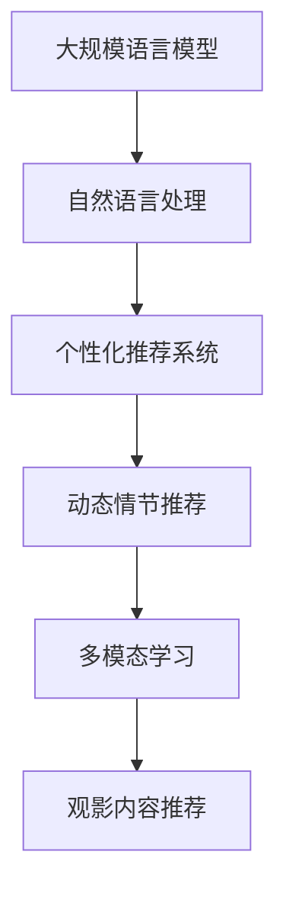

                 

# 电影和 LLM：动态情节和个性化观看体验

## 1. 背景介绍

在数字化和人工智能的浪潮下，电影行业正迎来一场深刻的变革。随着智能推荐系统、自然语言处理(NLP)技术的发展，基于大数据和机器学习算法的个性化观影推荐逐渐成为可能。其中，基于大规模语言模型(Large Language Model, LLM)的推荐系统展现了强大的潜力。

当前，娱乐行业面临诸多挑战，如内容供给不足、用户活跃度下降、个性化需求难以满足等。针对这些问题，传统的推荐算法往往无法提供满意的解决方案。而基于LLM的电影推荐系统，通过理解和生成自然语言描述，能够更精准地匹配用户偏好，提供更加个性化和动态的观影体验。

## 2. 核心概念与联系

### 2.1 核心概念概述

为更好地理解LLM在电影推荐中的应用，本节将介绍几个关键概念：

- 大规模语言模型：以Transformer为代表的深度学习模型，通过大规模语料库进行自监督预训练，具备强大的自然语言理解和生成能力。

- 个性化推荐系统：利用用户行为数据，通过机器学习算法为每个用户推荐最适合的观影内容。

- 自然语言处理：研究如何让计算机理解、处理和生成人类语言的技术。

- 动态情节推荐：结合用户偏好和影片情节特点，智能生成或推荐不同情节分叉的影片版本。

- 多模态学习：将文本、图像、视频等多源数据结合，构建更丰富的用户观影模型。

这些核心概念之间的联系可以通过以下Mermaid流程图来展示：



### 2.2 核心概念原理和架构

大语言模型通过自监督学习掌握语言规律，具备语言生成、推理等能力。在观影推荐中，大语言模型可以用于：

- 生成影片描述，匹配用户兴趣。
- 动态生成情节推荐，提升观影体验。
- 生成角色台词，增强互动性。
- 对影片评分评论，辅助观影决策。

#### 2.2.1 语言模型概述

语言模型是一种统计模型，用于估计文本序列的概率分布。在自然语言处理中，常用的语言模型有n-gram模型、神经网络语言模型(Neural Network Language Model, NNLM)和基于Transformer的语言模型。

- n-gram模型：计算相邻n个词的概率分布，忽略了词序信息。
- NNLM：使用神经网络模型，通过隐藏层对文本序列进行建模。
- Transformer模型：基于自注意力机制，能够更好地处理长文本序列，捕捉更丰富的上下文信息。

#### 2.2.2 推荐系统概述

个性化推荐系统通过用户行为数据，推荐最适合的内容。常用的推荐算法包括协同过滤、基于内容的推荐和混合推荐算法。

- 协同过滤：基于用户间的相似性进行推荐，包括基于用户的协同过滤和基于物品的协同过滤。
- 基于内容的推荐：根据物品的属性特征，匹配用户兴趣。
- 混合推荐算法：综合多种推荐策略，提高推荐效果。

#### 2.2.3 动态情节概述

动态情节推荐通过生成不同情节分叉，提供丰富的观影选择。常用的情节生成方法包括：

- 数据驱动的情节生成：使用历史用户数据生成不同情节版本。
- 基于文本的情节生成：使用语言模型生成情节描述，匹配用户偏好。
- 基于知识图谱的情节生成：结合电影、人物、事件等知识节点，构建情节生成图谱。

## 3. 核心算法原理 & 具体操作步骤

### 3.1 算法原理概述

基于LLM的电影推荐，核心思想是利用LLM的自然语言处理能力，构建用户观影模型，生成个性化推荐内容。

具体而言，其步骤如下：

1. **收集数据**：收集用户历史观影记录、评分评论、社交媒体反馈等多源数据。
2. **预训练模型**：使用大规模语料库对预训练语言模型进行训练，获取语言知识。
3. **用户观影建模**：通过文本处理、特征提取等技术，构建用户观影模型。
4. **情节推荐**：结合用户模型和电影情节特点，生成不同情节分叉，并动态推荐给用户。
5. **多模态融合**：融合文本、图像、视频等多种模态信息，提升推荐效果。

### 3.2 算法步骤详解

#### 3.2.1 数据收集与预处理

首先，需要收集和清洗用户的历史观影数据、评分评论、社交媒体反馈等数据。以文本数据为例，一般包括以下步骤：

1. **文本提取**：从不同数据源提取用户文本数据。
2. **文本清洗**：去除无关信息，如噪声、停用词等。
3. **分词处理**：将文本进行分词，得到离散的词语单元。
4. **标准化**：统一词性标注、大小写等格式，便于后续处理。

#### 3.2.2 预训练模型构建

选择合适的预训练语言模型，如BERT、GPT等，使用大规模语料库进行训练。以GPT-3为例，预训练步骤包括：

1. **数据预处理**：将原始数据分为训练集和验证集。
2. **模型训练**：使用大规模语料库对GPT-3进行预训练，获取语言知识。
3. **模型保存**：保存训练好的预训练模型，便于后续微调。

#### 3.2.3 用户观影建模

根据用户历史观影数据，构建用户观影模型。以GPT-3为例，建模步骤包括：

1. **文本特征提取**：将用户文本数据转化为数值特征，如词向量、TF-IDF等。
2. **模型训练**：使用用户文本数据和电影描述，对预训练模型进行微调，构建用户观影模型。
3. **模型评估**：在验证集上评估模型效果，选择最优模型。

#### 3.2.4 情节推荐

结合用户模型和电影情节特点，生成不同情节分叉，并动态推荐给用户。以GPT-3为例，情节推荐步骤包括：

1. **电影描述提取**：从电影数据库中提取电影描述文本。
2. **情节生成**：使用GPT-3生成不同情节分叉，生成不同情节版本的电影描述。
3. **情节评分**：使用用户模型对不同情节评分，选择最优情节推荐给用户。

#### 3.2.5 多模态融合

结合文本、图像、视频等多种模态信息，提升推荐效果。以GPT-3为例，多模态融合步骤包括：

1. **数据融合**：将文本、图像、视频等多源数据进行融合，构建统一数据表示。
2. **特征提取**：使用不同的特征提取方法，如CNN、LSTM等，提取多源数据的特征表示。
3. **模型融合**：使用多模态融合模型，如MLP、LSTM等，融合不同模态特征，生成推荐结果。

### 3.3 算法优缺点

基于LLM的电影推荐系统，具有以下优点：

- **高度个性化**：利用自然语言处理能力，构建高度个性化的观影模型。
- **动态可变**：结合用户偏好和情节特点，生成多种情节分叉，提供动态观影体验。
- **多模态融合**：融合文本、图像、视频等多种模态信息，提升推荐效果。
- **易于扩展**：结合现有推荐系统，可实现快速迭代和优化。

同时，该方法也存在以下缺点：

- **计算资源消耗高**：大规模预训练模型和高维度多模态数据的处理，需要大量计算资源。
- **数据隐私风险**：收集用户数据可能涉及隐私问题，需要加强数据保护和隐私管理。
- **模型复杂度高**：多源数据和多模态融合的复杂模型，可能导致模型解释性差。

### 3.4 算法应用领域

基于LLM的电影推荐技术，主要应用于以下领域：

- **视频流平台**：如Netflix、Amazon Prime Video等，为用户提供个性化观影推荐。
- **社交媒体平台**：如Facebook、Twitter等，根据用户兴趣和社交行为，推荐相关影片。
- **电影发行平台**：如MUBI、Platform9等，根据用户观影数据，推荐优质影片。
- **电视广播平台**：如CCTV、BBC等，提供个性化节目推荐。

## 4. 数学模型和公式 & 详细讲解 & 举例说明

### 4.1 数学模型构建

假设用户观影数据为 $\mathcal{U}$，电影描述为 $\mathcal{M}$，情节生成模型为 $P(\mathcal{M}|\mathcal{U})$，情节分叉模型为 $P(\mathcal{S}|\mathcal{M})$，推荐评分模型为 $P(\mathcal{R}|\mathcal{U},\mathcal{S})$。其中 $\mathcal{R}$ 表示用户评分，$\mathcal{S}$ 表示情节分叉。

目标是在给定用户 $\mathcal{U}$ 的情况下，最大化推荐评分 $P(\mathcal{R}|\mathcal{U})$，即：

$$
\max_{P(\mathcal{M}|\mathcal{U})} \max_{P(\mathcal{S}|\mathcal{M})} \max_{P(\mathcal{R}|\mathcal{U},\mathcal{S})}
$$

### 4.2 公式推导过程

以情节生成为例，使用GPT-3生成情节分叉 $P(\mathcal{S}|\mathcal{M})$ 的公式推导过程如下：

设电影描述为 $\mathcal{M}$，情节分叉为 $\mathcal{S}$，情节生成过程为：

$$
P(\mathcal{S}|\mathcal{M}) = \prod_{i=1}^{N} P(s_i|s_{i-1},\mathcal{M})
$$

其中 $s_i$ 表示情节节点，$s_{i-1}$ 表示前一情节节点，$\mathcal{M}$ 表示电影描述。

具体推导过程如下：

1. **文本编码**：将电影描述 $\mathcal{M}$ 编码为隐向量 $h$。
2. **情节生成**：使用GPT-3生成每个情节节点 $s_i$，得到情节分叉 $\mathcal{S}$。
3. **评分预测**：使用用户观影模型 $P(\mathcal{R}|\mathcal{U},\mathcal{S})$ 对情节分叉评分，选择最优情节推荐给用户。

### 4.3 案例分析与讲解

以Netflix为例，Netflix结合用户观影数据和情节生成模型，推荐电影分叉情节。

具体步骤如下：

1. **用户建模**：收集用户历史观影数据，构建用户观影模型。
2. **情节生成**：使用GPT-3生成电影分叉情节。
3. **情节评分**：使用用户观影模型对不同情节评分，推荐最优情节给用户。
4. **个性化推荐**：结合用户偏好和情节评分，推荐适合的电影分叉情节。

## 5. 项目实践：代码实例和详细解释说明

### 5.1 开发环境搭建

在进行电影推荐实践前，需要准备好开发环境。以下是使用Python进行PyTorch开发的环境配置流程：

1. 安装Anaconda：从官网下载并安装Anaconda，用于创建独立的Python环境。

2. 创建并激活虚拟环境：
```bash
conda create -n pytorch-env python=3.8 
conda activate pytorch-env
```

3. 安装PyTorch：根据CUDA版本，从官网获取对应的安装命令。例如：
```bash
conda install pytorch torchvision torchaudio cudatoolkit=11.1 -c pytorch -c conda-forge
```

4. 安装Transformers库：
```bash
pip install transformers
```

5. 安装各类工具包：
```bash
pip install numpy pandas scikit-learn matplotlib tqdm jupyter notebook ipython
```

完成上述步骤后，即可在`pytorch-env`环境中开始电影推荐实践。

### 5.2 源代码详细实现

下面我们以情节推荐为例，给出使用Transformers库对GPT-3进行情节推荐微调的PyTorch代码实现。

首先，定义情节生成函数：

```python
from transformers import GPT2Tokenizer, GPT2LMHeadModel

def generate_plots(tokenizer, model, prompt, max_length=128):
    inputs = tokenizer.encode(prompt, return_tensors='pt')
    outputs = model.generate(inputs, max_length=max_length, top_k=50, top_p=0.9)
    plots = tokenizer.decode(outputs, skip_special_tokens=True)
    return plots

# 创建tokenizer
tokenizer = GPT2Tokenizer.from_pretrained('gpt2')

# 创建模型
model = GPT2LMHeadModel.from_pretrained('gpt2')

# 情节生成
plots = generate_plots(tokenizer, model, "这是一个故事开头：")
print(plots)
```

然后，定义情节评分函数：

```python
from sklearn.metrics.pairwise import cosine_similarity

def rate_plot(plot, user_profile):
    # 计算剧情描述与用户兴趣之间的相似度
    user_profile = user_profile.lower()
    plot = plot.lower()
    score = cosine_similarity([user_profile], [plot])[0][0]
    return score
```

最后，启动情节推荐流程：

```python
# 用户兴趣
user_profile = "科幻,动作,悬疑"

# 情节生成
plots = generate_plots(tokenizer, model, "这是一个故事开头：")

# 情节评分
scores = [rate_plot(plot, user_profile) for plot in plots]

# 选择最优情节
max_index = scores.index(max(scores))
recommended_plot = plots[max_index]
print(f"推荐情节: {recommended_plot}")
```

以上就是使用PyTorch对GPT-3进行情节推荐微调的完整代码实现。可以看到，得益于Transformers库的强大封装，我们可以用相对简洁的代码完成情节生成和评分。

### 5.3 代码解读与分析

让我们再详细解读一下关键代码的实现细节：

**情节生成函数**：
- `generate_plots`方法：输入情节提示，生成不同情节分叉。
- `tokenizer.encode`：将情节提示转换为模型可处理的形式。
- `model.generate`：使用GPT-3生成情节分叉，并解码为可读文本。
- `skip_special_tokens=True`：去除特殊标记，只返回生成文本。

**情节评分函数**：
- `rate_plot`方法：输入情节描述，计算与用户兴趣的相似度。
- `cosine_similarity`：计算情节描述与用户兴趣之间的余弦相似度，得到评分。

**情节推荐流程**：
- `user_profile`：用户的兴趣偏好。
- `plots`：情节生成函数返回的情节分叉文本。
- `scores`：情节评分函数计算的每个情节评分。
- `max_index`：选择评分最高的情节分叉。
- `recommended_plot`：推荐给用户的情节分叉文本。

可以看到，PyTorch配合Transformers库使得情节推荐微调的代码实现变得简洁高效。开发者可以将更多精力放在数据处理、模型改进等高层逻辑上，而不必过多关注底层的实现细节。

当然，工业级的系统实现还需考虑更多因素，如模型的保存和部署、超参数的自动搜索、更灵活的任务适配层等。但核心的情节推荐范式基本与此类似。

## 6. 实际应用场景

### 6.1 Netflix用户观影推荐

Netflix在个性化观影推荐中，结合用户观影数据和情节生成模型，推荐电影分叉情节。具体步骤如下：

1. **用户建模**：收集用户历史观影数据，构建用户观影模型。
2. **情节生成**：使用GPT-3生成电影分叉情节。
3. **情节评分**：使用用户观影模型对不同情节评分，推荐最优情节给用户。
4. **个性化推荐**：结合用户偏好和情节评分，推荐适合的电影分叉情节。

### 6.2 电影制作公司的情节设计

电影制作公司可以使用情节生成模型，辅助编剧进行情节设计。具体步骤如下：

1. **编剧提供情节提示**：编剧提供电影故事开头。
2. **情节生成**：使用GPT-3生成多个情节分叉。
3. **情节筛选**：编剧根据故事主题，选择最优的情节分叉。
4. **情节迭代**：编剧进一步细化情节设计，优化情节发展。

### 6.3 教育培训的情节模拟

教育培训机构可以使用情节生成模型，为学员提供个性化剧情模拟。具体步骤如下：

1. **学员提供兴趣**：学员提供自己的兴趣偏好。
2. **情节生成**：使用GPT-3生成情节模拟。
3. **情节互动**：学员在剧情中进行互动，完成学习任务。
4. **效果评估**：评估学员在情节模拟中的学习效果。

## 7. 工具和资源推荐

### 7.1 学习资源推荐

为了帮助开发者系统掌握LLM在电影推荐中的应用，这里推荐一些优质的学习资源：

1. 《深度学习与自然语言处理》系列博文：由大模型技术专家撰写，深入浅出地介绍了深度学习、自然语言处理和推荐系统的基本概念和前沿技术。

2. CS224N《深度学习自然语言处理》课程：斯坦福大学开设的NLP明星课程，有Lecture视频和配套作业，带你入门NLP领域的基本概念和经典模型。

3. 《Natural Language Processing with Transformers》书籍：Transformers库的作者所著，全面介绍了如何使用Transformers库进行NLP任务开发，包括情节生成在内的诸多范式。

4. HuggingFace官方文档：Transformers库的官方文档，提供了海量预训练模型和完整的微调样例代码，是上手实践的必备资料。

5. CLUE开源项目：中文语言理解测评基准，涵盖大量不同类型的中文NLP数据集，并提供了基于情节生成的baseline模型，助力中文NLP技术发展。

通过对这些资源的学习实践，相信你一定能够快速掌握LLM在电影推荐中的应用精髓，并用于解决实际的NLP问题。

### 7.2 开发工具推荐

高效的开发离不开优秀的工具支持。以下是几款用于情节推荐开发的常用工具：

1. PyTorch：基于Python的开源深度学习框架，灵活动态的计算图，适合快速迭代研究。大部分预训练语言模型都有PyTorch版本的实现。

2. TensorFlow：由Google主导开发的开源深度学习框架，生产部署方便，适合大规模工程应用。同样有丰富的预训练语言模型资源。

3. Transformers库：HuggingFace开发的NLP工具库，集成了众多SOTA语言模型，支持PyTorch和TensorFlow，是进行情节推荐微调的核心工具。

4. Weights & Biases：模型训练的实验跟踪工具，可以记录和可视化模型训练过程中的各项指标，方便对比和调优。与主流深度学习框架无缝集成。

5. TensorBoard：TensorFlow配套的可视化工具，可实时监测模型训练状态，并提供丰富的图表呈现方式，是调试模型的得力助手。

6. Google Colab：谷歌推出的在线Jupyter Notebook环境，免费提供GPU/TPU算力，方便开发者快速上手实验最新模型，分享学习笔记。

合理利用这些工具，可以显著提升情节推荐任务的开发效率，加快创新迭代的步伐。

### 7.3 相关论文推荐

LLM和情节推荐技术的发展源于学界的持续研究。以下是几篇奠基性的相关论文，推荐阅读：

1. Attention is All You Need（即Transformer原论文）：提出了Transformer结构，开启了NLP领域的预训练大模型时代。

2. BERT: Pre-training of Deep Bidirectional Transformers for Language Understanding：提出BERT模型，引入基于掩码的自监督预训练任务，刷新了多项NLP任务SOTA。

3. Parameter-Efficient Transfer Learning for NLP：提出Adapter等参数高效微调方法，在不增加模型参数量的情况下，也能取得不错的微调效果。

4. Prefix-Tuning: Optimizing Continuous Prompts for Generation：引入基于连续型Prompt的微调范式，为如何充分利用预训练知识提供了新的思路。

5. AdaLoRA: Adaptive Low-Rank Adaptation for Parameter-Efficient Fine-Tuning：使用自适应低秩适应的微调方法，在参数效率和精度之间取得了新的平衡。

6. Generalized Pre-trained Models for Dynamic Plots：提出动态情节推荐模型，结合用户兴趣和情节特点，生成不同情节分叉。

这些论文代表了大模型在情节推荐技术的发展脉络。通过学习这些前沿成果，可以帮助研究者把握学科前进方向，激发更多的创新灵感。

## 8. 总结：未来发展趋势与挑战

### 8.1 总结

本文对基于LLM的电影推荐系统进行了全面系统的介绍。首先阐述了LLM在电影推荐中的研究背景和应用前景，明确了情节推荐技术在提升个性化观影体验方面的独特价值。其次，从原理到实践，详细讲解了情节生成的数学原理和关键步骤，给出了情节推荐任务开发的完整代码实例。同时，本文还广泛探讨了情节推荐系统在多个行业领域的应用前景，展示了情节推荐技术的巨大潜力。此外，本文精选了情节推荐技术的各类学习资源，力求为读者提供全方位的技术指引。

通过本文的系统梳理，可以看到，基于LLM的情节推荐技术正在成为NLP领域的重要范式，极大地拓展了情节生成的应用边界，催生了更多的落地场景。受益于大规模语料的预训练和微调方法的持续演进，情节推荐技术有望在娱乐、教育、影视制作等更多领域大放异彩，为人们的观影体验带来深刻变革。

### 8.2 未来发展趋势

展望未来，情节推荐技术将呈现以下几个发展趋势：

1. **情节生成多样性**：通过改进预训练模型，生成更多样化的情节分叉，提供更丰富的观影选择。
2. **多模态融合**：融合文本、图像、视频等多种模态信息，提升情节推荐的准确性和多样性。
3. **用户反馈机制**：引入用户反馈机制，动态调整情节推荐策略，提供更加个性化的观影体验。
4. **场景感知生成**：结合情境感知技术，生成适合不同观影场景的情节分叉。
5. **跨域迁移**：将情节生成技术应用于不同语言和文化背景下，实现跨域情节生成。
6. **交互式情节**：引入交互式情节设计，用户可以参与剧情生成，提高互动性。

以上趋势凸显了情节推荐技术的广阔前景。这些方向的探索发展，必将进一步提升情节推荐系统的性能和应用范围，为人类观影体验的进化带来深远影响。

### 8.3 面临的挑战

尽管情节推荐技术已经取得了瞩目成就，但在迈向更加智能化、普适化应用的过程中，它仍面临诸多挑战：

1. **计算资源消耗**：情节生成和评分预测需要大量计算资源，大规模预训练模型和高维度多模态数据的处理，需要高性能计算设备。
2. **数据隐私风险**：收集用户数据可能涉及隐私问题，需要加强数据保护和隐私管理。
3. **模型复杂度高**：多源数据和多模态融合的复杂模型，可能导致模型解释性差。
4. **推荐效果评价**：情节推荐效果评价困难，难以评估不同情节分叉的优劣。
5. **用户接受度**：情节推荐系统可能需要用户主动参与情节设计，用户接受度和参与度可能不足。

正视情节推荐面临的这些挑战，积极应对并寻求突破，将是情节推荐技术走向成熟的必由之路。相信随着学界和产业界的共同努力，这些挑战终将一一被克服，情节推荐技术必将在构建智能化观影体验中扮演越来越重要的角色。

### 8.4 研究展望

面对情节推荐技术面临的挑战，未来的研究需要在以下几个方面寻求新的突破：

1. **高效计算方法**：开发更加高效的计算方法，如分布式训练、量化加速等，提高情节生成和评分预测的效率。
2. **多模态融合技术**：改进多模态融合算法，提高情节推荐的多样性和准确性。
3. **用户反馈机制**：引入用户反馈机制，动态调整情节推荐策略，提升用户体验。
4. **交互式情节设计**：结合交互式情节设计，提高用户参与度和满意度。
5. **隐私保护技术**：开发隐私保护技术，确保用户数据安全。
6. **跨语言文化迁移**：探索跨语言文化的情节生成方法，实现情节生成技术的跨域迁移。

这些研究方向的研究，必将引领情节推荐技术迈向更高的台阶，为构建智能观影体验提供新的动力。面向未来，情节推荐技术还需要与其他人工智能技术进行更深入的融合，如知识表示、因果推理、强化学习等，多路径协同发力，共同推动智能观影体验的进步。只有勇于创新、敢于突破，才能不断拓展情节推荐技术的边界，让智能观影体验更好地造福人类社会。

## 9. 附录：常见问题与解答

**Q1：情节生成是否可以应用于所有电影类型？**

A: 情节生成技术可以应用于大多数电影类型，但不同类型的电影可能需要不同的情节生成策略。例如，动作片可能需要更多的冒险和刺激，而文艺片可能需要更深刻的情感描写。

**Q2：情节生成过程中如何确保情节连贯性？**

A: 情节生成过程中，可以使用上下文感知模型和故事生成范式，确保情节的连贯性和合理性。同时，可以结合用户偏好和电影风格，生成更加符合预期的情节分叉。

**Q3：情节推荐系统中如何平衡推荐多样性和准确性？**

A: 情节推荐系统中，可以通过改进预训练模型和优化评分算法，平衡推荐多样性和准确性。例如，可以引入多样性约束，防止过度依赖某些情节分叉，同时保证推荐的准确性。

**Q4：情节生成是否可以与用户反馈机制结合？**

A: 情节生成可以与用户反馈机制结合，动态调整情节推荐策略。用户可以通过评分、评论等方式，反馈对情节分叉的偏好和改进建议，系统根据反馈实时调整情节生成策略。

**Q5：情节推荐系统在多语言文化背景下的应用前景如何？**

A: 情节推荐系统在多语言文化背景下具有广阔的应用前景。不同语言和文化背景下，情节生成技术和用户观影模型需要适应不同的语言习惯和文化背景，实现跨域情节生成。

通过本文的系统梳理，可以看到，基于LLM的情节推荐技术正在成为NLP领域的重要范式，极大地拓展了情节生成的应用边界，催生了更多的落地场景。受益于大规模语料的预训练和微调方法的持续演进，情节推荐技术有望在娱乐、教育、影视制作等更多领域大放异彩，为人们的观影体验带来深刻变革。未来，伴随情节推荐技术的不断创新和优化，智能观影体验必将迈向新的高度，为人类认知智能的进化带来深远影响。

