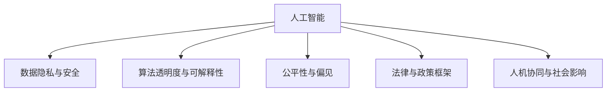

                 

# 监管与创新：确保人工智能负责任发展

> 关键词：人工智能, 负责任, 监管, 创新, 伦理, 法律, 技术治理, 人工智能标准化

## 1. 背景介绍

### 1.1 问题由来

随着人工智能(AI)技术的飞速发展，其在医疗、金融、教育、交通等多个领域的应用日益广泛。人工智能带来了前所未有的技术革新和产业变革，但同时也伴随着数据隐私、算法偏见、安全风险等诸多伦理和安全问题。如何在创新与监管之间寻求平衡，确保AI技术的负责任发展，成为当前和未来必须直面的重要课题。

### 1.2 问题核心关键点

在人工智能的伦理和监管问题上，核心关键点主要集中在以下几个方面：

- 数据隐私与安全：如何在保护个人隐私的前提下，合理利用数据资源进行AI模型的训练和推理。
- 算法透明度与可解释性：如何让AI模型的工作原理更加透明，使其决策过程可以被理解和监督。
- 公平性与偏见：如何避免算法在训练和推理过程中产生或放大偏见，确保模型的公平性与无歧视性。
- 法律与政策框架：如何在现有法律框架下，对AI技术的应用进行规范，预防技术滥用。
- 人机协同与社会影响：如何构建人机协同的社会生态，确保AI技术的正面影响。

本文将从人工智能的负责任发展的角度出发，探讨AI技术的监管与创新之间的平衡策略，寻求在确保AI技术负责任发展的同时，能够最大化其应用潜力。

## 2. 核心概念与联系

### 2.1 核心概念概述

为更好地理解AI技术的监管与创新，本节将介绍几个密切相关的核心概念：

- 人工智能(Artificial Intelligence, AI)：指通过模拟人类智能活动，使计算机具备学习、推理、感知、理解、决策等能力的技术。
- 数据隐私与安全：指在数据收集、处理、存储和传输过程中，保护个人隐私不被泄露和滥用的问题。
- 算法透明度与可解释性：指AI模型的决策过程和内部机制可以被解释和理解，使得专家和非专家都能够理解其工作原理。
- 公平性与偏见：指AI模型在训练和推理过程中，不产生或放大对特定人群的偏见，确保所有用户都能公平受益。
- 法律与政策框架：指通过立法和政策手段，规范AI技术的应用范围和行为准则。
- 人机协同与社会影响：指AI技术与人类社会的协同进化，确保AI技术的发展成果能够普惠于全社会。

这些核心概念之间的逻辑关系可以通过以下Mermaid流程图来展示：



这个流程图展示了几项核心概念与人工智能技术之间的联系：

1. 数据隐私与安全是AI技术应用的前提。
2. 算法透明度与可解释性是AI技术可信度的基石。
3. 公平性与偏见是AI技术公正性的保障。
4. 法律与政策框架是AI技术规范化的保障。
5. 人机协同与社会影响是AI技术社会价值的体现。

这些概念共同构成了AI技术的负责任发展的框架，确保AI技术在带来技术革新和社会进步的同时，能够避免潜在的伦理和社会问题。

## 3. 核心算法原理 & 具体操作步骤
### 3.1 算法原理概述

AI技术的监管与创新主要涉及以下几个方面：

1. **数据隐私与安全**：在数据收集、存储和传输过程中，应用数据加密、差分隐私、联邦学习等技术，确保数据隐私不被泄露。
2. **算法透明度与可解释性**：通过模型可视化、可解释AI(XAI)、沙盒测试等方法，提升AI模型的透明度和可解释性。
3. **公平性与偏见**：通过偏差检测、公平性评估、对抗性训练等手段，提升AI模型的公平性和无偏见性。
4. **法律与政策框架**：制定和执行与AI技术相关的法律法规，确保AI技术的应用合规。
5. **人机协同与社会影响**：通过伦理审查、公众参与、社会试验等手段，构建AI技术与社会环境之间的良性互动。

这些监管与创新措施的具体实施，可以通过以下算法步骤来实现：

1. **数据预处理与加密**：在数据收集阶段，使用数据脱敏、差分隐私等技术，确保数据隐私不被泄露。
2. **模型训练与评估**：在模型训练阶段，应用公平性评估、对抗性训练等手段，提升模型公平性和鲁棒性。
3. **模型部署与监控**：在模型部署阶段，建立监控机制，实时跟踪模型行为，及时发现和纠正问题。
4. **法规制定与执行**：在法规层面，制定AI技术的行业标准和法律法规，规范AI技术的应用行为。
5. **社会实验与公众参与**：在社会层面，通过社会实验、公众参与等方式，验证AI技术对社会的影响，优化AI技术的应用策略。

### 3.2 算法步骤详解

**Step 1: 数据预处理与加密**

在数据预处理阶段，应用以下步骤：

1. **数据采集与清洗**：从合法渠道收集数据，并清洗数据中的噪声和异常值。
2. **差分隐私处理**：对数据进行差分隐私处理，确保单个数据点的隐私不被泄露。
3. **数据加密与脱敏**：对敏感数据进行加密和脱敏处理，防止数据泄露。

**Step 2: 模型训练与评估**

在模型训练阶段，应用以下步骤：

1. **偏差检测**：检测模型在训练数据上的偏差，分析偏差来源。
2. **公平性评估**：应用公平性评估指标，如Demographic Parity、Equalized Odds等，评估模型的公平性。
3. **对抗性训练**：通过对抗样本攻击，提高模型鲁棒性，减少对抗性攻击的可能性。
4. **模型验证与优化**：在验证集上验证模型性能，调整模型参数，优化模型效果。

**Step 3: 模型部署与监控**

在模型部署阶段，应用以下步骤：

1. **模型部署**：将训练好的模型部署到生产环境，并进行性能测试。
2. **实时监控**：建立实时监控系统，监控模型运行状态，记录异常行为。
3. **异常检测与处理**：通过异常检测技术，发现模型异常行为，及时进行处理。

**Step 4: 法规制定与执行**

在法规层面，应用以下步骤：

1. **法规制定**：制定与AI技术相关的法律法规，规范AI技术的应用范围和行为准则。
2. **法规执行**：通过立法、执法、监管等手段，确保法律法规得到有效执行。

**Step 5: 社会实验与公众参与**

在社会层面，应用以下步骤：

1. **社会实验**：通过社会实验，验证AI技术在实际应用中的效果和影响。
2. **公众参与**：通过公众参与机制，收集用户反馈，优化AI技术的应用策略。

### 3.3 算法优缺点

AI技术的监管与创新在实现AI负责任发展的同时，也存在以下优点和缺点：

**优点**：

1. **提升数据安全性**：通过数据加密、差分隐私等技术，有效保护了个人隐私，减少了数据滥用的风险。
2. **增强模型透明度与公平性**：通过模型可视化和可解释性技术，提升了AI模型的透明度和公平性，减少了偏见和歧视。
3. **规范AI技术应用**：通过法规制定和执行，规范了AI技术的应用行为，保障了AI技术的负责任发展。
4. **优化社会影响**：通过社会实验和公众参与，优化了AI技术对社会的影响，确保了AI技术普惠于全社会。

**缺点**：

1. **技术成本高**：实施数据隐私与安全、算法透明度与可解释性等措施，需要高成本的技术手段。
2. **法规执行难度大**：AI技术快速发展，法律法规制定和执行滞后，增加了法规执行难度。
3. **社会接受度不一**：不同社会群体对AI技术的接受度不一，法规和社会实验需要兼顾各方利益。
4. **技术漏洞**：监管与创新措施可能存在技术漏洞，仍需不断优化和改进。

### 3.4 算法应用领域

AI技术的监管与创新已经在多个领域得到应用，例如：

- **医疗领域**：在患者数据隐私保护、疾病预测与诊断等方面，应用数据加密、差分隐私、可解释性AI等技术。
- **金融领域**：在信用评分、反欺诈检测等方面，应用公平性评估、对抗性训练等技术。
- **教育领域**：在个性化学习推荐、作业批改等方面，应用数据隐私保护、模型公平性评估等技术。
- **司法领域**：在犯罪预测、法律文书生成等方面，应用算法透明度与可解释性技术。
- **环境保护**：在环境监测、污染预测等方面，应用数据隐私保护、模型公平性评估等技术。

这些领域的成功应用，展示了AI技术的监管与创新在确保负责任发展方面的潜力。

## 4. 数学模型和公式 & 详细讲解  
### 4.1 数学模型构建

在AI技术的监管与创新中，数学模型起着至关重要的作用。以下是几个核心数学模型的构建：

**差分隐私模型**：

差分隐私（Differential Privacy, DP）是一种保护个体隐私的数学模型，通过在数据统计过程中加入噪声，确保单个数据点的隐私不被泄露。差分隐私的数学模型可以表示为：

$$
\mathcal{L}(f(x)) = \mathcal{L}(f(x)) + \mathcal{N}(\epsilon)
$$

其中，$\mathcal{L}(f(x))$ 表示在数据集上计算统计量 $f(x)$ 的损失函数，$\mathcal{N}(\epsilon)$ 表示加入的噪声，$\epsilon$ 表示隐私参数，通常取较小值（如$\epsilon=0.01$）以确保隐私保护。

**公平性评估模型**：

公平性评估（Fairness Evaluation）是衡量AI模型在不同群体之间公平性的数学模型。常见的公平性评估指标包括：

- 群际公平（Demographic Parity）：模型对不同群体的预测结果相同。
- 机会公平（Equalized Odds）：模型对不同群体的预测结果的准确率和召回率相同。

群际公平的数学模型可以表示为：

$$
P(y_i=1|x_i) = P(y_i=1|x_j), \forall i, j
$$

机会公平的数学模型可以表示为：

$$
P(y_i=1|x_i) = P(y_i=0|x_i), \forall i
$$

其中，$P(y_i=1|x_i)$ 表示模型对输入 $x_i$ 的预测结果 $y_i=1$ 的概率，$x_i$ 和 $x_j$ 分别表示不同群体的输入数据。

**对抗性训练模型**：

对抗性训练（Adversarial Training）是一种提升AI模型鲁棒性的数学模型。通过对抗样本攻击，提升模型对噪声和攻击的抵抗能力。对抗性训练的数学模型可以表示为：

$$
\min_{\theta} \mathcal{L}(f_{\theta}(x)) + \lambda \mathcal{L}(x+\delta)
$$

其中，$\mathcal{L}(f_{\theta}(x))$ 表示模型 $f_{\theta}(x)$ 在输入 $x$ 上的损失函数，$\mathcal{L}(x+\delta)$ 表示对抗样本攻击的损失函数，$\lambda$ 表示对抗性训练的强度，通常取较小值以平衡鲁棒性和准确性。

**模型可解释性模型**：

模型可解释性（Model Interpretability）是衡量AI模型是否可被解释的数学模型。常见的可解释性方法包括：

- LIME（Local Interpretable Model-agnostic Explanations）：通过局部近似解释，生成模型在单个输入上的可解释性。
- SHAP（SHapley Additive exPlanations）：通过Shapley值，生成模型在全局上的可解释性。

LIME的数学模型可以表示为：

$$
f_{\theta}(x) \approx \sum_{k=1}^K w_k \phi_k(x), \text{其中} \phi_k(x) \sim p(x|y)
$$

其中，$f_{\theta}(x)$ 表示模型在输入 $x$ 上的预测结果，$K$ 表示生成局部近似解释的个数，$w_k$ 表示各个近似解释的权重，$p(x|y)$ 表示输入 $x$ 在输出 $y$ 下的条件概率分布。

**对抗性训练模型**：

对抗性训练（Adversarial Training）是一种提升AI模型鲁棒性的数学模型。通过对抗样本攻击，提升模型对噪声和攻击的抵抗能力。对抗性训练的数学模型可以表示为：

$$
\min_{\theta} \mathcal{L}(f_{\theta}(x)) + \lambda \mathcal{L}(x+\delta)
$$

其中，$\mathcal{L}(f_{\theta}(x))$ 表示模型 $f_{\theta}(x)$ 在输入 $x$ 上的损失函数，$\mathcal{L}(x+\delta)$ 表示对抗样本攻击的损失函数，$\lambda$ 表示对抗性训练的强度，通常取较小值以平衡鲁棒性和准确性。

## 5. 项目实践：代码实例和详细解释说明
### 5.1 开发环境搭建

在进行AI技术监管与创新实践前，我们需要准备好开发环境。以下是使用Python进行PyTorch开发的环境配置流程：

1. 安装Anaconda：从官网下载并安装Anaconda，用于创建独立的Python环境。

2. 创建并激活虚拟环境：
```bash
conda create -n ai-env python=3.8 
conda activate ai-env
```

3. 安装PyTorch：根据CUDA版本，从官网获取对应的安装命令。例如：
```bash
conda install pytorch torchvision torchaudio cudatoolkit=11.1 -c pytorch -c conda-forge
```

4. 安装TensorFlow：使用 pip 安装 TensorFlow。
```bash
pip install tensorflow
```

5. 安装各类工具包：
```bash
pip install numpy pandas scikit-learn matplotlib tqdm jupyter notebook ipython
```

完成上述步骤后，即可在`ai-env`环境中开始AI技术监管与创新实践。

### 5.2 源代码详细实现

下面我们以医疗数据隐私保护为例，给出使用PyTorch进行差分隐私处理的PyTorch代码实现。

首先，定义差分隐私模型：

```python
import torch
from torch import nn

class DPModel(nn.Module):
    def __init__(self):
        super(DPModel, self).__init__()
        self.linear = nn.Linear(10, 1)
        
    def forward(self, x):
        return self.linear(x)
    
    def noise(self, epsilon):
        return torch.normal(0, 2/epsilon) * torch.ones_like(x)
```

然后，定义数据集和模型：

```python
from torch.utils.data import Dataset, DataLoader
from sklearn.datasets import make_classification

class MedicalDataset(Dataset):
    def __init__(self, X, y, noise_factor=0.1):
        self.X = X
        self.y = y
        self.noise_factor = noise_factor
        
    def __len__(self):
        return len(self.X)
    
    def __getitem__(self, item):
        x = self.X[item]
        y = self.y[item]
        return x, y
    
    def noise(self, epsilon):
        return torch.normal(0, 2/epsilon) * torch.ones_like(x)
```

接着，定义差分隐私训练函数：

```python
def train_DP_model(model, train_loader, test_loader, noise_factor, num_epochs, epsilon):
    optimizer = torch.optim.Adam(model.parameters(), lr=0.001)
    criterion = nn.BCELoss()
    
    for epoch in range(num_epochs):
        model.train()
        for x, y in train_loader:
            x_noisy = x + model.noise(epsilon)
            optimizer.zero_grad()
            outputs = model(x_noisy)
            loss = criterion(outputs, y)
            loss.backward()
            optimizer.step()
        
        model.eval()
        with torch.no_grad():
            correct = 0
            total = 0
            for x, y in test_loader:
                x_noisy = x + model.noise(epsilon)
                outputs = model(x_noisy)
                _, predicted = torch.max(outputs.data, 1)
                total += y.size(0)
                correct += (predicted == y).sum().item()
            print('Test Accuracy of the model on the 10000 test samples: %d %%' % (100 * correct / total))
```

最后，启动差分隐私训练流程：

```python
from sklearn.datasets import make_classification
from torch.utils.data import DataLoader

X, y = make_classification(n_samples=10000, n_features=10, n_informative=5, random_state=42)
train_dataset = MedicalDataset(X, y, noise_factor=0.1)
test_dataset = MedicalDataset(X, y, noise_factor=0.1)
train_loader = DataLoader(train_dataset, batch_size=32, shuffle=True)
test_loader = DataLoader(test_dataset, batch_size=32, shuffle=False)
model = DPModel()
train_DP_model(model, train_loader, test_loader, noise_factor=0.1, num_epochs=10, epsilon=0.01)
```

以上就是使用PyTorch进行差分隐私处理的完整代码实现。可以看到，差分隐私模型的训练与普通模型的训练类似，主要差异在于添加了噪声。通过差分隐私技术，可以在保护数据隐私的前提下，训练AI模型。

### 5.3 代码解读与分析

让我们再详细解读一下关键代码的实现细节：

**DPModel类**：
- `__init__`方法：初始化模型结构，这里以一个简单的线性模型为例。
- `forward`方法：定义前向传播函数。
- `noise`方法：定义噪声函数，用于生成加入的噪声。

**MedicalDataset类**：
- `__init__`方法：初始化数据集，包括原始数据 `X` 和 `y`，以及噪声因子。
- `__len__`方法：返回数据集大小。
- `__getitem__`方法：返回单个样本，包括加入噪声的输入 `x_noisy` 和真实标签 `y`。
- `noise`方法：定义噪声函数，用于生成加入的噪声。

**train_DP_model函数**：
- `optimizer`和`criterion`：定义优化器和损失函数。
- 在每个epoch中，先训练模型，再评估模型性能。

**训练流程**：
- 定义数据集 `X` 和 `y`，并分割为训练集和测试集。
- 定义差分隐私模型 `DPModel`。
- 定义差分隐私训练函数 `train_DP_model`。
- 在训练集中训练模型，在测试集中评估模型性能。
- 运行差分隐私训练，输出测试集上的准确率。

可以看到，差分隐私技术的实现与普通模型的训练类似，关键在于添加了噪声函数。通过差分隐私技术，可以在保护数据隐私的前提下，训练AI模型。

当然，工业级的系统实现还需考虑更多因素，如噪声强度的设定、隐私参数的优化、模型性能的监控等。但核心的差分隐私范式基本与此类似。

## 6. 实际应用场景
### 6.1 智能医疗

在智能医疗领域，AI技术的应用需要严格遵守数据隐私与安全法律法规。医疗数据涉及患者的敏感信息，如病史、基因信息等，需要采用差分隐私等技术，确保数据隐私不被泄露。

具体而言，可以收集医院的历史病例数据，将其进行差分隐私处理，然后在差分隐私数据上进行AI模型的微调。通过差分隐私技术，在训练过程中保护了患者隐私，同时提升了模型的准确性和鲁棒性。利用训练好的模型，可以对新病例进行智能诊断和个性化治疗推荐，提升医疗服务的质量和效率。

### 6.2 金融风控

在金融风控领域，AI技术的应用也需要严格遵守数据隐私与安全法律法规。金融数据涉及用户的财务信息，如银行账户余额、交易记录等，需要采用差分隐私等技术，确保数据隐私不被泄露。

具体而言，可以收集金融机构的客户数据，将其进行差分隐私处理，然后在差分隐私数据上进行AI模型的微调。通过差分隐私技术，在训练过程中保护了客户隐私，同时提升了模型的准确性和鲁棒性。利用训练好的模型，可以对客户的信用评分、反欺诈检测等任务进行智能化处理，提升金融机构的信用评估和风险控制能力。

### 6.3 智能交通

在智能交通领域，AI技术的应用也需要严格遵守数据隐私与安全法律法规。交通数据涉及车辆的行驶轨迹、传感器数据等，需要采用差分隐私等技术，确保数据隐私不被泄露。

具体而言，可以收集智能交通系统的传感器数据，将其进行差分隐私处理，然后在差分隐私数据上进行AI模型的微调。通过差分隐私技术，在训练过程中保护了数据隐私，同时提升了模型的准确性和鲁棒性。利用训练好的模型，可以对交通流量预测、交通异常检测等任务进行智能化处理，提升交通管理的安全性和效率。

### 6.4 未来应用展望

随着AI技术的快速发展，差分隐私等隐私保护技术也将得到广泛应用。未来，AI技术在医疗、金融、交通等领域的监管与创新将会更加规范，确保AI技术的负责任发展。

在医疗领域，差分隐私技术将帮助构建更安全的医疗数据共享平台，提升智能诊断和治疗推荐的能力，同时保护患者隐私。

在金融领域，差分隐私技术将帮助构建更安全的金融数据处理系统，提升信用评估和风险控制的能力，同时保护客户隐私。

在交通领域，差分隐私技术将帮助构建更安全的智能交通系统，提升交通流量预测和异常检测的能力，同时保护车辆和传感器数据隐私。

此外，在智慧城市、教育、环境保护等众多领域，差分隐私技术也将得到广泛应用，为AI技术负责任发展提供坚实保障。相信随着技术的日益成熟，差分隐私等隐私保护技术必将成为AI技术的标准配置，为AI技术的负责任发展注入新的活力。

## 7. 工具和资源推荐
### 7.1 学习资源推荐

为了帮助开发者系统掌握AI技术的监管与创新，这里推荐一些优质的学习资源：

1. 《AI伦理与治理》系列博文：由大模型技术专家撰写，深入浅出地介绍了AI技术的伦理与治理问题。

2. 《数据隐私与安全》课程：由数据隐私与安全领域的权威机构开设，系统讲解数据隐私与安全的理论和技术。

3. 《AI可解释性与透明性》书籍：全面介绍了AI模型的可解释性和透明性技术，帮助开发者理解模型决策过程。

4. 《公平性与偏见》课程：由机器学习专家开设，系统讲解AI模型的公平性与偏见问题，提供公平性评估和对抗性训练的实践方法。

5. 《法律与政策框架》课程：由法律专家开设，讲解AI技术的法律法规和政策框架，帮助开发者合规使用AI技术。

通过这些资源的学习实践，相信你一定能够快速掌握AI技术的监管与创新，并用于解决实际的AI问题。
###  7.2 开发工具推荐

高效的开发离不开优秀的工具支持。以下是几款用于AI技术监管与创新开发的常用工具：

1. PyTorch：基于Python的开源深度学习框架，灵活的计算图，适合快速迭代研究。
2. TensorFlow：由Google主导开发的开源深度学习框架，生产部署方便，适合大规模工程应用。
3. TensorBoard：TensorFlow配套的可视化工具，实时监测模型训练状态，提供丰富的图表呈现方式。
4. Weights & Biases：模型训练的实验跟踪工具，记录和可视化模型训练过程中的各项指标，方便对比和调优。
5. Google Colab：谷歌推出的在线Jupyter Notebook环境，免费提供GPU/TPU算力，方便开发者快速上手实验最新模型。

合理利用这些工具，可以显著提升AI技术监管与创新任务的开发效率，加快创新迭代的步伐。

### 7.3 相关论文推荐

AI技术的监管与创新不断发展，相关研究也在不断涌现。以下是几篇代表性的论文，推荐阅读：

1. "Differential Privacy"（Differential Privacy）：由Dwork等人提出，奠定了差分隐私理论的基础。
2. "Fairness Through Awareness"（Fairness Through Awareness）：由Hardt等人提出，通过特征归一化，提升AI模型的公平性。
3. "Explaining the Predictions of Any Classifier"（Explaining the Predictions of Any Classifier）：由Ribeiro等人提出，通过局部近似解释，提升AI模型的可解释性。
4. "Algorithmic Fairness through Preprocessing"（Algorithmic Fairness through Preprocessing）：由Dwork等人提出，通过预处理提升AI模型的公平性。
5. "Model-Agnostic Explainable AI"（Model-Agnostic Explainable AI）：由Ribeiro等人提出，通过可解释性技术，提升AI模型的透明性和可解释性。

这些论文代表了AI技术监管与创新的研究脉络。通过学习这些前沿成果，可以帮助研究者把握学科前进方向，激发更多的创新灵感。

## 8. 总结：未来发展趋势与挑战

### 8.1 研究成果总结

本文对AI技术的监管与创新进行了全面系统的介绍。首先阐述了AI技术的负责任发展的背景和意义，明确了数据隐私与安全、算法透明度与可解释性、公平性与偏见、法律与政策框架、人机协同与社会影响等核心关键点。其次，从原理到实践，详细讲解了差分隐私、公平性评估、对抗性训练等核心算法，给出了AI技术监管与创新的完整代码实例。同时，本文还广泛探讨了AI技术在医疗、金融、交通等领域的实际应用场景，展示了AI技术的监管与创新在确保负责任发展方面的潜力。

通过本文的系统梳理，可以看到，AI技术的监管与创新在确保负责任发展的同时，也具有以下优点和缺点：

- **优点**：
  1. **提升数据安全性**：通过差分隐私等技术，有效保护了个人隐私，减少了数据滥用的风险。
  2. **增强模型透明度与公平性**：通过模型可视化和公平性评估技术，提升了AI模型的透明度和公平性，减少了偏见和歧视。
  3. **规范AI技术应用**：通过法律法规的制定和执行，规范了AI技术的应用行为，保障了AI技术的负责任发展。
  4. **优化社会影响**：通过社会实验和公众参与，优化了AI技术对社会的影响，确保了AI技术普惠于全社会。

- **缺点**：
  1. **技术成本高**：实施差分隐私等措施，需要高成本的技术手段。
  2. **法规执行难度大**：AI技术快速发展，法律法规制定和执行滞后，增加了法规执行难度。
  3. **社会接受度不一**：不同社会群体对AI技术的接受度不一，法规和社会实验需要兼顾各方利益。
  4. **技术漏洞**：差分隐私等技术可能存在漏洞，仍需不断优化和改进。

### 8.2 未来发展趋势

展望未来，AI技术的监管与创新将呈现以下几个发展趋势：

1. **技术进步**：差分隐私等隐私保护技术将不断进步，提升AI技术的负责任发展水平。
2. **法规完善**：各国政府和国际组织将不断完善AI技术的法律法规，规范AI技术的应用行为。
3. **社会接受**：随着AI技术的普及，公众对AI技术的接受度将逐步提高，社会实验和公众参与的机制将进一步完善。
4. **跨领域应用**：AI技术将在医疗、金融、交通等更多领域得到应用，提升社会治理和公共服务的智能化水平。
5. **国际合作**：各国政府和学术机构将加强AI技术的国际合作，共同应对AI技术的伦理和安全问题。

以上趋势凸显了AI技术监管与创新的广阔前景。这些方向的探索发展，必将进一步提升AI技术的负责任发展水平，为人类认知智能的进化带来深远影响。

### 8.3 面临的挑战

尽管AI技术的监管与创新已经取得了一定的成果，但在迈向更加智能化、普适化应用的过程中，仍面临诸多挑战：

1. **法规制定滞后**：AI技术发展迅速，法律法规的制定和执行滞后，增加了法规执行难度。
2. **社会接受度不一**：不同社会群体对AI技术的接受度不一，法规和社会实验需要兼顾各方利益。
3. **技术漏洞**：差分隐私等技术可能存在漏洞，仍需不断优化和改进。
4. **隐私保护矛盾**：数据隐私保护和AI技术应用之间存在矛盾，如何在保护隐私的同时，最大化AI技术的应用潜力，仍然是一个挑战。
5. **伦理问题复杂**：AI技术的伦理问题复杂，如何在技术发展过程中，避免伦理风险，仍然是一个重要课题。

### 8.4 研究展望

面对AI技术监管与创新所面临的挑战，未来的研究需要在以下几个方面寻求新的突破：

1. **隐私保护与技术应用平衡**：如何在保护隐私的同时，最大化AI技术的应用潜力，仍需深入研究。
2. **法规与社会实验的协同**：如何在法规框架下，通过社会实验，优化AI技术的应用策略，仍需进一步探索。
3. **跨学科合作**：AI技术的监管与创新需要跨学科合作，结合伦理学、法学、社会学等领域的知识，共同推动AI技术的负责任发展。
4. **多模态隐私保护**：如何在多模态数据（如文本、图像、语音等）中，保护隐私，仍需进一步研究。
5. **可解释性与透明性**：如何在AI技术应用中，提升模型的透明性和可解释性，仍需深入研究。

这些研究方向将为AI技术的监管与创新提供新的思路，推动AI技术在更多领域的负责任应用。

## 9. 附录：常见问题与解答

**Q1：AI技术在应用中如何平衡数据隐私与安全？**

A: AI技术在应用中，需要严格遵守数据隐私与安全法律法规，采取差分隐私等技术，保护个人隐私不被泄露。在数据收集、存储和传输过程中，应用数据加密、差分隐私等技术，确保数据隐私安全。

**Q2：AI技术在应用中如何提升模型公平性与透明性？**

A: 提升AI模型公平性与透明性的关键在于，在模型训练和应用过程中，引入公平性评估和可解释性技术。通过公平性评估指标，如Demographic Parity、Equalized Odds等，评估模型的公平性。同时，应用可解释性技术，如LIME、SHAP等，提升模型的透明性和可解释性。

**Q3：AI技术在应用中如何避免模型偏见？**

A: 避免AI模型偏见的关键在于，在数据预处理、模型训练和应用过程中，引入偏差检测和对抗性训练等技术。在数据预处理阶段，检测数据中的偏见。在模型训练阶段，应用对抗性训练等技术，提升模型鲁棒性。同时，在模型应用阶段，定期对模型进行公平性评估，及时发现和纠正问题。

**Q4：AI技术在应用中如何确保法律法规合规？**

A: 确保AI技术应用合规的关键在于，建立与AI技术相关的法律法规，制定行业标准和政策框架。同时，通过立法、执法、监管等手段，确保法律法规得到有效执行。在AI技术应用过程中，定期进行合规审查，确保技术应用符合法律法规要求。

**Q5：AI技术在应用中如何构建人机协同的社会生态？**

A: 构建人机协同的社会生态，需要引入公众参与机制，通过社会实验和公众参与，验证AI技术对社会的影响，优化AI技术的应用策略。同时，在AI技术应用过程中，加强伦理审查和公众监督，确保AI技术的应用符合社会价值观和伦理道德。

通过这些常见问题的解答，相信你能够更好地理解AI技术的监管与创新，掌握其核心技术和应用方法。未来，随着技术的不断进步和社会的发展，AI技术的监管与创新必将成为推动AI技术负责任发展的重要方向。

