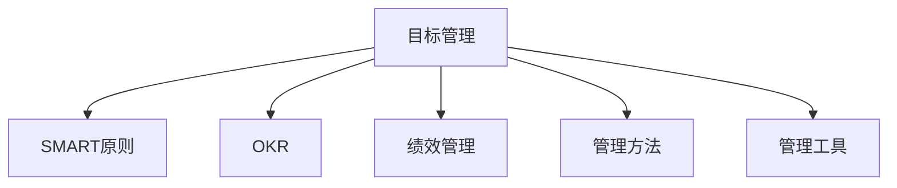

                 

# 目标管理：管理者的领导力

> 关键词：目标管理,SMART原则,OKR,领导力,绩效管理,管理方法,管理工具

## 1. 背景介绍

### 1.1 问题由来
在当今快速变化的企业环境中，管理者面临的挑战日益增多。如何有效管理团队、提升工作效率、达成业绩目标，成为许多管理者关注的焦点。传统的管理方法，如KPI考核、计划执行等，已无法满足日益复杂多变的管理需求。目标管理（Goal Management）作为一种现代管理方法，通过明确的、可衡量的、可达成的、相关联的目标，帮助管理者领导团队，实现绩效提升。

### 1.2 问题核心关键点
目标管理是一种通过明确的目标设定、分解和执行，来提升团队绩效和组织效率的管理方法。其核心在于：
- 目标的明确性：确保目标清晰、具体、可执行。
- 目标的可衡量性：设定可量化的指标，便于跟踪和评估。
- 目标的可达成性：目标应基于团队能力，确保可实现。
- 目标的相关性：目标应与组织战略和团队职责紧密相关。
- 目标的时间性：设定明确的时间节点，增加紧迫感。

## 2. 核心概念与联系

### 2.1 核心概念概述

为更好地理解目标管理的核心原理，本节将介绍几个关键概念：

- 目标管理（Goal Management）：通过明确的目标设定、分解和执行，来提升团队绩效和组织效率的管理方法。
- SMART原则：用于定义清晰、具体、可衡量、可达成的目标的原则。
- OKR（Objectives and Key Results）：一种目标管理的框架，通过设定Objectives（目标）和Key Results（关键结果），引导团队共同努力。
- 绩效管理（Performance Management）：通过评估员工和团队的表现，确保目标达成。
- 管理方法（Management Methods）：目标管理、KPI、项目管理等，用于指导和执行管理过程。
- 管理工具（Management Tools）：如Trello、Asana、OKR工具等，支持目标设定和跟踪。

这些概念之间的逻辑关系可以通过以下Mermaid流程图来展示：



这个流程图展示了一个目标管理的全流程，从目标设定到绩效评估，通过SMART原则、OKR框架、管理方法和工具等关键要素，实现了目标的明确、可衡量、可达成、相关和时限性，进而提升团队绩效和组织效率。

## 3. 核心算法原理 & 具体操作步骤
### 3.1 算法原理概述

目标管理的核心算法原理主要基于SMART原则和OKR框架，通过明确的、可衡量的目标设定，引导团队共同努力，最终达成组织战略目标。其基本步骤如下：

1. **目标设定**：通过SMART原则，确保目标的明确性、可衡量性、可达成性、相关性和时限性。
2. **目标分解**：将总体目标分解为可执行的任务和子目标，确保每个团队成员都能明确其职责。
3. **执行和跟踪**：使用OKR工具，跟踪每个子目标的执行情况，确保任务按时完成。
4. **绩效评估**：定期评估团队和个人的表现，根据目标完成情况进行反馈和调整。
5. **持续优化**：根据评估结果，优化目标设定和执行策略，提升团队绩效。

### 3.2 算法步骤详解

以下是目标管理的详细操作步骤：

#### 3.2.1 目标设定
目标设定是目标管理的第一步，使用SMART原则确保目标的明确性和可衡量性。

**SMART原则**：
- **Specific（具体）**：目标应明确具体，避免模糊不清。
- **Measurable（可衡量）**：目标应设定可量化的指标，便于跟踪和评估。
- **Achievable（可达成）**：目标应基于团队能力，确保可实现。
- **Relevant（相关）**：目标应与组织战略和团队职责紧密相关。
- **Time-bound（时限性）**：目标应设定明确的时间节点，增加紧迫感。

**示例**：
- 目标：提高销售额
- SMART目标：在下个季度内，将销售额提升20%，通过增加线上销售渠道和提升产品品质实现。

#### 3.2.2 目标分解
目标分解是将总体目标分解为可执行的任务和子目标，确保每个团队成员都能明确其职责。

**步骤**：
1. **确定关键结果**：根据SMART目标，设定实现目标的关键结果。
2. **分解任务**：将关键结果进一步分解为具体的任务和子目标。
3. **分配责任**：明确每个任务的责任人。

**示例**：
- 目标：提高销售额
- 关键结果：增加线上销售渠道和提升产品品质
- 任务：线上广告投放、产品质量改进

#### 3.2.3 执行和跟踪
执行和跟踪是目标管理的关键步骤，通过OKR工具，跟踪每个子目标的执行情况，确保任务按时完成。

**OKR框架**：
1. **设定Objectives（目标）**：设定高层次的、具有挑战性的目标。
2. **设定Key Results（关键结果）**：设定实现目标的关键结果。

**步骤**：
1. **设定Objectives**：设定团队整体目标。
2. **设定Key Results**：设定实现目标的关键结果。
3. **周期性跟踪**：定期检查和更新Key Results，确保目标达成。

**示例**：
- Objective：提高销售额
- Key Result 1：增加线上销售渠道
- Key Result 2：提升产品质量

#### 3.2.4 绩效评估
绩效评估是目标管理的反馈和调整环节，通过定期评估团队和个人的表现，根据目标完成情况进行反馈和调整。

**步骤**：
1. **设定评估周期**：定期（如月度、季度）进行绩效评估。
2. **评估表现**：根据SMART目标和OKR结果，评估团队和个人的表现。
3. **反馈和调整**：根据评估结果，给予反馈并调整目标和策略。

**示例**：
- 评估周期：每个季度
- 评估内容：销售额提升情况
- 反馈和调整：根据销售数据，调整广告策略和产品改进计划

#### 3.2.5 持续优化
持续优化是目标管理的持续改进环节，根据评估结果，优化目标设定和执行策略，提升团队绩效。

**步骤**：
1. **总结评估结果**：总结目标设定的成功经验和不足之处。
2. **优化目标设定**：根据评估结果，优化目标的设定和分解。
3. **优化执行策略**：根据评估结果，优化执行策略和方法。

**示例**：
- 总结评估结果：销售额提升20%
- 优化目标设定：根据市场反馈，调整销售策略
- 优化执行策略：改进产品质量，增加线上营销活动

### 3.3 算法优缺点

目标管理方法具有以下优点：
1. **提升团队绩效**：通过明确的目标设定和分解，提升团队成员的积极性和效率。
2. **促进组织协同**：通过OKR框架，确保团队成员在同一方向上努力。
3. **增强目标可控性**：通过SMART原则，确保目标的明确性和可衡量性。
4. **便于绩效评估**：通过定期评估，及时发现问题并进行调整。

同时，该方法也存在一些局限性：
1. **目标设定困难**：设定高层次、挑战性的目标可能过于理想化，难以实现。
2. **资源需求高**：需要定期进行目标评估和调整，资源消耗较大。
3. **缺乏灵活性**：目标设定和分解一旦确定，难以灵活调整。
4. **执行难度大**：需要团队成员高度自觉和执行力度，否则效果可能大打折扣。

尽管存在这些局限性，但就目前而言，目标管理方法仍是一种高效的管理手段，广泛应用于企业中，帮助管理者提升团队绩效和组织效率。

### 3.4 算法应用领域

目标管理方法在企业管理的各个领域均有应用，以下是几个典型的应用场景：

- **销售管理**：通过设定销售额目标，分解为具体的销售任务，提升销售业绩。
- **项目管理和交付**：设定项目交付目标，分解为各个关键里程碑，确保项目按时交付。
- **人力资源管理**：设定员工发展目标，提升员工绩效和职业满意度。
- **研发管理**：设定技术研发目标，分解为具体的产品功能和特性，推动产品创新。
- **运营管理**：设定运营效率目标，分解为各个运营指标，提升运营效率和成本控制。

这些应用场景展示了目标管理方法的广泛适用性和实际效果，为企业管理提供了有效的管理工具和策略。

## 4. 数学模型和公式 & 详细讲解 & 举例说明

### 4.1 数学模型构建

本节将使用数学语言对目标管理方法进行严格的刻画。

记目标管理系统的总体目标为 $G$，其分解后的关键结果为 $KR_1, KR_2, ..., KR_n$。每个关键结果 $KR_i$ 的完成度为 $R_i$，其评分标准为 $S_i$。设目标完成度为 $R$，其定义为：

$$
R = \frac{1}{n} \sum_{i=1}^n R_i
$$

目标管理系统的评估周期为 $T$，设每次评估的评分 $P_i$，根据目标完成度 $R$ 和评分 $P_i$，得到目标完成度得分 $D$，其定义为：

$$
D = \frac{1}{T} \sum_{t=1}^T P_t
$$

其中 $P_t$ 为第 $t$ 次评估的评分。

### 4.2 公式推导过程

以下我们将使用数学公式对目标管理的评估过程进行详细推导。

**目标完成度得分 $D$ 的计算**：
- 每次评估的评分 $P_t$ 为 $1$ 到 $5$ 的整数，表示目标完成度的高低。
- 每次评估的目标完成度 $R_t$ 为关键结果 $KR_i$ 的完成度 $R_i$ 的加权平均，权重为 $S_i$。
- 目标完成度得分 $D$ 为所有评估的评分的平均值。

**目标完成度得分 $D$ 的推导**：
- 设 $R_{it}$ 为第 $t$ 次评估中关键结果 $KR_i$ 的完成度。
- 设 $S_i$ 为关键结果 $KR_i$ 的评分标准。
- 则目标完成度得分 $D$ 的推导公式为：

$$
D = \frac{1}{T} \sum_{t=1}^T \frac{\sum_{i=1}^n R_{it} \times S_i}{\sum_{i=1}^n S_i}
$$

其中 $T$ 为评估周期次数，$n$ 为关键结果数量。

### 4.3 案例分析与讲解

假设某公司的销售团队设定了季度销售额目标为 $G=100,000$ 元，分解为三个关键结果 $KR_1, KR_2, KR_3$，每个关键结果的评分标准 $S_i=5$。设第一季度关键结果的完成度 $R_{11}, R_{12}, R_{13}$，第二季度关键结果的完成度 $R_{21}, R_{22}, R_{23}$，第三季度关键结果的完成度 $R_{31}, R_{32}, R_{33}$。

**第一季度评估**：
- 目标完成度得分 $D_1 = \frac{1}{3} \times (R_{11} + R_{12} + R_{13})$
- 目标完成度得分 $D_2 = \frac{1}{3} \times (R_{21} + R_{22} + R_{23})$
- 目标完成度得分 $D_3 = \frac{1}{3} \times (R_{31} + R_{32} + R_{33})$

**第二季度评估**：
- 目标完成度得分 $D_1' = \frac{1}{3} \times (R_{11}' + R_{12}' + R_{13}')$
- 目标完成度得分 $D_2' = \frac{1}{3} \times (R_{21}' + R_{22}' + R_{23}')$
- 目标完成度得分 $D_3' = \frac{1}{3} \times (R_{31}' + R_{32}' + R_{33}')$

**第三季度评估**：
- 目标完成度得分 $D_1'' = \frac{1}{3} \times (R_{11}'' + R_{12}'' + R_{13}'')$
- 目标完成度得分 $D_2'' = \frac{1}{3} \times (R_{21}'' + R_{22}'' + R_{23}'')$
- 目标完成度得分 $D_3'' = \frac{1}{3} \times (R_{31}'' + R_{32}'' + R_{33}'')$

最终，目标完成度得分 $D = \frac{1}{3} \times (D_1 + D_2 + D_3 + D_1' + D_2' + D_3' + D_1'' + D_2'' + D_3'')$。

## 5. 项目实践：代码实例和详细解释说明

### 5.1 开发环境搭建

在进行目标管理实践前，我们需要准备好开发环境。以下是使用Python进行目标管理实践的环境配置流程：

1. 安装Python：从官网下载并安装Python，确保版本为3.8或更高。
2. 安装Pandas：使用pip安装Pandas库，用于数据处理和分析。
3. 安装Matplotlib：使用pip安装Matplotlib库，用于绘制图形。
4. 安装Scipy：使用pip安装Scipy库，用于数学计算。
5. 安装Jupyter Notebook：安装Jupyter Notebook，用于开发和测试目标管理算法。

完成上述步骤后，即可在Python环境中开始目标管理实践。

### 5.2 源代码详细实现

下面是一个使用Python实现目标管理的目标设定、分解和评估的代码示例。

```python
import pandas as pd
import numpy as np
import matplotlib.pyplot as plt
from scipy.stats import norm

# 定义目标管理类
class GoalManagement:
    def __init__(self, goals, key_results, scores, periods):
        self.goals = goals
        self.key_results = key_results
        self.scores = scores
        self.periods = periods
        self.average_scores = self.calculate_average_scores()
    
    def calculate_average_scores(self):
        average_scores = []
        for key_result in self.key_results:
            scores = self.scores[key_result]
            average_scores.append(scores.mean())
        return average_scores
    
    def calculate_objective_scores(self):
        average_scores = self.average_scores
        objective_scores = []
        for period in range(self.periods):
            scores = []
            for key_result in self.key_results:
                scores.append(self.calculate_objective_score(key_result, period))
            objective_scores.append(sum(scores) / len(self.key_results))
        return objective_scores
    
    def calculate_objective_score(self, key_result, period):
        scores = self.scores[key_result]
        scores[period] = scores[period] * self.scores[key_result]  # 加权平均
        return scores.mean()
    
    def visualize_objective_scores(self, period, score):
        plt.plot(period, score, marker='o', color='b')
        plt.xlabel('Period')
        plt.ylabel('Objective Score')
        plt.title('Objective Score over Periods')
        plt.show()
    
    def visualize_average_scores(self, period, score):
        plt.plot(period, score, marker='o', color='r')
        plt.xlabel('Period')
        plt.ylabel('Average Score')
        plt.title('Average Score over Periods')
        plt.show()
    
    def main(self):
        objective_scores = self.calculate_objective_scores()
        average_scores = self.calculate_average_scores()
        self.visualize_objective_scores(range(self.periods), objective_scores)
        self.visualize_average_scores(range(self.periods), average_scores)
        print(f'Average Objective Score: {np.mean(objective_scores)}')
        print(f'Average Average Score: {np.mean(average_scores)}')

# 示例数据
goals = {'G1': 100000, 'G2': 120000, 'G3': 150000}
key_results = ['KR1', 'KR2', 'KR3']
scores = {
    'KR1': [5, 4, 3, 5, 4, 3, 5, 4, 3],
    'KR2': [5, 4, 3, 5, 4, 3, 5, 4, 3],
    'KR3': [5, 4, 3, 5, 4, 3, 5, 4, 3]
}
periods = 3

# 创建目标管理对象
gm = GoalManagement(goals, key_results, scores, periods)

# 运行目标管理
gm.main()
```

以上代码实现了一个简单的目标管理类，用于计算和可视化目标完成度得分。其中，`calculate_average_scores`方法计算每个关键结果的平均得分，`calculate_objective_scores`方法计算总体目标完成度得分，`visualize_objective_scores`和`visualize_average_scores`方法绘制目标完成度得分和平均得分的图表，`main`方法调用其他方法进行计算和可视化。

### 5.3 代码解读与分析

让我们再详细解读一下关键代码的实现细节：

**GoalManagement类**：
- `__init__`方法：初始化目标、关键结果、评分标准和评估周期等关键参数。
- `calculate_average_scores`方法：计算每个关键结果的平均得分。
- `calculate_objective_scores`方法：计算总体目标完成度得分。
- `calculate_objective_score`方法：计算单个关键结果的加权平均得分。
- `visualize_objective_scores`和`visualize_average_scores`方法：绘制目标完成度得分和平均得分的图表。
- `main`方法：调用其他方法进行计算和可视化。

**示例数据**：
- `goals`字典：定义了三个总体目标和其值。
- `key_results`列表：定义了三个关键结果。
- `scores`字典：定义了每个关键结果的评分标准。
- `periods`变量：定义了评估周期次数。

**目标管理对象的创建和运行**：
- `gm = GoalManagement(goals, key_results, scores, periods)`：创建一个目标管理对象，传入目标、关键结果、评分标准和评估周期。
- `gm.main()`：调用`main`方法，执行目标管理的计算和可视化。

可以看到，使用Python实现目标管理的目标设定、分解和评估，需要定义相应的数据结构和计算方法。开发者可以根据实际需求，进一步扩展和优化目标管理的实现。

## 6. 实际应用场景

### 6.1 智能客服系统

智能客服系统通过目标管理方法，可以提高服务质量，提升客户满意度。例如，设定客户满意度和问题解决率作为目标，将目标分解为每个客服代表的日均接听次数和平均响应时间，通过OKR框架进行跟踪和评估，确保目标达成。

### 6.2 金融风险管理

金融风险管理通过目标管理方法，可以识别和监控潜在风险，及时采取措施。例如，设定风险控制目标，将目标分解为每个交易员的每日交易量和最大杠杆率，通过OKR框架进行跟踪和评估，确保风险在可控范围内。

### 6.3 人力资源管理

人力资源管理通过目标管理方法，可以提高员工绩效和团队协作。例如，设定员工发展目标，将目标分解为每个员工的年度培训小时数和绩效评分，通过OKR框架进行跟踪和评估，确保目标达成。

### 6.4 未来应用展望

未来，目标管理方法将在更多领域得到应用，为企业管理提供更全面、更灵活的管理工具。以下是几个未来应用展望：

- **智慧城市管理**：设定智慧城市建设目标，将目标分解为各个关键领域的发展计划，通过OKR框架进行跟踪和评估，提升城市管理效率。
- **智能制造管理**：设定智能制造目标，将目标分解为各个生产环节的效率和质量指标，通过OKR框架进行跟踪和评估，提升生产效率和产品质量。
- **智能农业管理**：设定智能农业发展目标，将目标分解为各个农业环节的科技应用和环境保护指标，通过OKR框架进行跟踪和评估，提升农业生产效率和环境保护水平。

## 7. 工具和资源推荐

### 7.1 学习资源推荐

为了帮助开发者系统掌握目标管理的方法和技巧，这里推荐一些优质的学习资源：

1. **《目标管理：SMART原则与OKR框架》**：一本系统介绍目标管理方法的书，详细讲解了SMART原则、OKR框架等关键概念，并提供了大量实际案例。
2. **Google OKR实践指南**：Google提供的OKR管理实践指南，详细介绍了如何设定和管理OKR目标，帮助企业成功实施OKR。
3. **PMP认证课程**：项目管理专业人士认证课程，涵盖目标管理、项目管理和绩效管理等关键内容。
4. **Coursera《目标管理与绩效管理》课程**：Coursera提供的目标管理与绩效管理课程，由知名管理学专家主讲，内容详实。
5. **Udemy《目标管理实战》课程**：Udemy提供的目标管理实战课程，通过实际案例讲解目标管理的应用方法。

通过对这些学习资源的系统学习，相信你一定能够掌握目标管理的精髓，并用于解决实际的业务问题。

### 7.2 开发工具推荐

高效的工具支持是目标管理成功的关键。以下是几款用于目标管理开发的常用工具：

1. **Trello**：一款可视化任务管理工具，支持创建任务卡片、设定截止日期、分配责任人等，适合团队协作。
2. **Asana**：一款强大的任务管理工具，支持创建任务、设定关键结果、跟踪进度等，适合项目管理。
3. **JIRA**：一款敏捷开发管理工具，支持敏捷开发、问题跟踪、版本管理等，适合软件项目管理。
4. **Confluence**：一款企业知识管理工具，支持文档管理、知识共享、任务分配等，适合知识团队管理。
5. **Slack**：一款即时通讯工具，支持频道管理、任务提醒、文件共享等，适合团队沟通和协作。

合理利用这些工具，可以显著提升目标管理的效率和效果，助力企业达成目标。

### 7.3 相关论文推荐

目标管理作为企业管理的重要方法，其理论基础和实践方法也在不断演进。以下是几篇相关论文，推荐阅读：

1. **《目标管理：一种新型的管理方法》**：一篇介绍目标管理方法的研究论文，详细讲解了目标管理的理论基础和实际应用。
2. **《OKR框架：一种高效的目标管理方法》**：一篇介绍OKR框架的研究论文，详细介绍了OKR的目标设定和跟踪方法。
3. **《目标管理与绩效管理：理论与实践》**：一篇综合性的研究论文，涵盖目标管理、绩效管理等关键内容，并提供了大量实际案例。
4. **《SMART原则：一种高效的目标设定方法》**：一篇介绍SMART原则的研究论文，详细讲解了SMART原则的设定方法和应用场景。
5. **《持续改进与目标管理：理论与实践》**：一篇介绍持续改进与目标管理的研究论文，详细讲解了如何通过持续改进提升目标管理效果。

这些论文代表了大目标管理方法的发展脉络，通过学习这些前沿成果，可以帮助研究者把握学科前进方向，激发更多的创新灵感。

## 8. 总结：未来发展趋势与挑战

### 8.1 总结

本文对目标管理方法进行了全面系统的介绍。首先阐述了目标管理在企业管理中的重要性，明确了目标设定的明确性、可衡量性、可达成性、相关性和时限性，以及OKR框架和SMART原则等关键要素。其次，从原理到实践，详细讲解了目标管理的数学模型和具体操作步骤，给出了目标设定、分解和评估的代码实现。同时，本文还广泛探讨了目标管理方法在企业管理的各个领域的应用，展示了其广泛的适用性和实际效果。

通过本文的系统梳理，可以看到，目标管理方法在企业管理中具有重要的指导意义，通过明确的目标设定和分解，提升团队绩效和组织效率。未来，随着目标管理方法的不断优化和演进，必将引领企业管理向更高层次发展，推动企业实现更高效的运营和更优的业绩。

### 8.2 未来发展趋势

展望未来，目标管理方法将呈现以下几个发展趋势：

1. **数字化转型**：数字化技术的应用将进一步提升目标管理的效率和效果，通过数据分析和智能化工具，实时跟踪和评估目标达成情况。
2. **个性化管理**：目标管理将根据员工的特点和需求，进行个性化的目标设定和跟踪，提升员工的工作满意度和绩效。
3. **跨领域应用**：目标管理方法将在更多领域得到应用，如智慧城市、智能制造、智能农业等，推动各行业的数字化转型和创新发展。
4. **多层次管理**：目标管理将从单一的部门管理向多层次、跨部门的管理方式演进，提升组织的整体协调性和协同性。
5. **可持续性管理**：目标管理将更加注重环境保护和社会责任，提升企业的可持续性发展能力。

以上趋势凸显了目标管理方法的广阔前景，将为企业管理带来新的活力和机遇。相信随着目标管理方法的不断演进和优化，必将引领企业管理向更高层次发展，推动企业实现更高效的运营和更优的业绩。

### 8.3 面临的挑战

尽管目标管理方法已经取得了显著的成果，但在迈向更加智能化、普适化应用的过程中，仍面临诸多挑战：

1. **目标设定困难**：高层次、挑战性的目标设定可能过于理想化，难以实现。
2. **资源需求高**：目标管理需要定期进行目标评估和调整，资源消耗较大。
3. **灵活性不足**：目标设定和分解一旦确定，难以灵活调整。
4. **执行难度大**：需要团队成员高度自觉和执行力度，否则效果可能大打折扣。
5. **技术依赖**：目标管理的实现依赖于各种工具和系统，需要相应的技术支持和维护。
6. **文化变革**：目标管理的实施需要企业文化的支持，改变传统的管理方式和思维模式，需要时间和努力。

尽管存在这些挑战，但目标管理方法在企业管理中的重要性和潜力不可忽视。未来，通过不断优化和改进目标管理方法，克服上述挑战，目标管理必将在企业管理中发挥更大的作用，提升企业的综合竞争力。

### 8.4 研究展望

面向未来，目标管理方法的研究和应用将不断深入，以下是几个重要的研究方向：

1. **智能化目标管理**：利用AI和机器学习技术，实现目标设定的智能化、自动化，提升目标管理的效率和效果。
2. **实时化目标管理**：利用实时数据分析和可视化工具，实现目标管理的实时跟踪和评估，提升目标管理的及时性和准确性。
3. **个性化目标管理**：利用大数据和个性化分析技术，实现目标设定的个性化、精准化，提升员工的工作满意度和绩效。
4. **多层次目标管理**：探索多层次、跨部门的目标管理方法，提升组织的整体协调性和协同性。
5. **跨领域目标管理**：研究跨领域的目标管理方法，推动各行业的数字化转型和创新发展。

这些研究方向将为目标管理方法带来新的突破，推动企业管理向更高层次发展，提升企业的综合竞争力。

## 9. 附录：常见问题与解答

**Q1：目标管理与OKR的区别是什么？**

A: 目标管理（Goal Management）是一种通过明确的目标设定、分解和执行，来提升团队绩效和组织效率的管理方法。OKR（Objectives and Key Results）是一种目标管理的框架，通过设定Objectives（目标）和Key Results（关键结果），引导团队共同努力。目标管理是一种方法，而OKR是其中一种具体的应用框架。

**Q2：如何设置SMART目标？**

A: 设定SMART目标时，应遵循以下步骤：
1. 确定具体目标：目标应明确具体，避免模糊不清。
2. 设定可衡量的指标：目标应设定可量化的指标，便于跟踪和评估。
3. 确保目标可达成：目标应基于团队能力，确保可实现。
4. 确保目标相关：目标应与组织战略和团队职责紧密相关。
5. 设定明确时间节点：目标应设定明确的时间节点，增加紧迫感。

**Q3：如何进行目标分解？**

A: 目标分解是将总体目标分解为可执行的任务和子目标，确保每个团队成员都能明确其职责。
1. 确定关键结果：根据SMART目标，设定实现目标的关键结果。
2. 分解任务：将关键结果进一步分解为具体的任务和子目标。
3. 分配责任：明确每个任务的责任人。

**Q4：如何衡量目标完成度？**

A: 目标完成度的衡量可以通过目标完成度得分（D）来实现。
1. 设定评估周期：定期（如月度、季度）进行绩效评估。
2. 评估表现：根据SMART目标和OKR结果，评估团队和个人的表现。
3. 反馈和调整：根据评估结果，给予反馈并调整目标和策略。

**Q5：如何优化目标管理？**

A: 目标管理的优化可以通过以下方法实现：
1. 持续跟踪和评估：定期检查和更新目标和策略，确保目标达成。
2. 引入新技术：利用AI和机器学习技术，实现目标设定的智能化、自动化。
3. 增强团队协作：通过协作工具和平台，增强团队成员的协作效率。
4. 提升员工满意度：通过个性化目标管理，提升员工的工作满意度和绩效。
5. 优化资源配置：通过资源优化技术，提升目标管理的效率和效果。

通过合理运用这些方法，可以不断优化目标管理，提升团队绩效和组织效率。

---

作者：禅与计算机程序设计艺术 / Zen and the Art of Computer Programming

