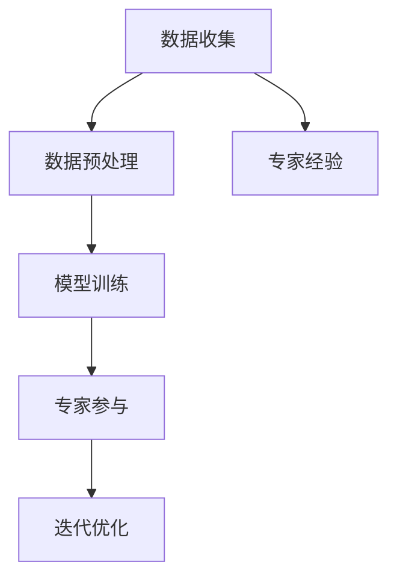

                 

# 直觉决策与理性分析的平衡

在人工智能（AI）领域，决策是核心任务之一。然而，如何平衡直觉与理性，使得机器在做出决策时既能够体现人类直觉，又能够逻辑严谨、无偏无漏，始终是研究者关注的重要课题。本文将详细探讨这一主题，从理论到实践，深入剖析直觉与理性分析的平衡机制，旨在为实现高效、可靠的决策支持系统提供指导。

## 1. 背景介绍

### 1.1 问题由来
现代AI系统通常依赖于数据驱动的方法进行决策。例如，通过机器学习模型对大量数据进行训练，得到决策规则。但是，当模型依赖于有限的历史数据，或者在处理新兴数据时，直觉与经验的引导显得尤为关键。直觉是建立在广泛经验与深入理解上的快速反应，而理性分析则依赖于逻辑和数据。如何在AI决策过程中平衡这两种不同的方法，成为业界和学术界关注的焦点。

### 1.2 问题核心关键点
直觉与理性分析平衡的核心在于如何在数据驱动决策与专家经验决策之间找到最优的平衡点。这一平衡点对于确保AI系统在处理复杂、动态的环境时，能够既灵活应对变化，又避免过于依赖经验而带来偏差。主要涉及以下几个关键点：
- 数据驱动决策的局限性。
- 专家经验的价值。
- 平衡机制的设计与实现。

## 2. 核心概念与联系

### 2.1 核心概念概述

- **数据驱动决策**：基于历史数据的统计分析与机器学习模型，进行预测与决策。
- **专家经验决策**：依赖专家的知识和经验，进行直觉判断和推理。
- **集成学习**：结合数据驱动和专家经验，进行综合决策。

通过集成学习的方法，可以在AI决策过程中实现直觉与理性的平衡。具体步骤如下：

1. 收集数据：获取历史数据和专家经验。
2. 数据预处理：清洗数据，去除噪音和无关信息。
3. 模型训练：利用数据训练机器学习模型。
4. 专家参与：专家对模型输出进行评估，提出修改建议。
5. 迭代优化：根据专家反馈，迭代优化模型。

### 2.2 核心概念原理和架构的 Mermaid 流程图



## 3. 核心算法原理 & 具体操作步骤

### 3.1 算法原理概述

平衡直觉与理性分析的核心算法为集成学习（Ensemble Learning），其中最著名的算法包括Bagging和Boosting。这些算法通过将多个模型组合在一起，可以增强模型的稳健性和泛化能力。

### 3.2 算法步骤详解

以Bagging算法为例，其步骤如下：
1. 从训练集中随机抽取n个样本，构成新的训练集。
2. 对每个新的训练集，训练一个基模型。
3. 对n个基模型的输出进行投票或平均值，得到最终决策。

### 3.3 算法优缺点

#### 优点：
- 减少过拟合：通过集成多个基模型，可以有效减少单个模型的过拟合问题。
- 提高泛化能力：基模型之间互相补充，能够更好地处理噪声和异常数据。
- 增加鲁棒性：多个基模型可以分担风险，提高系统的整体稳定性。

#### 缺点：
- 计算开销：需要训练多个基模型，计算复杂度较高。
- 模型解释性：集成模型较难解释，难以理解单个模型的决策过程。
- 数据依赖：基模型依赖于数据，当数据分布发生变化时，系统可能需要重新训练。

### 3.4 算法应用领域

集成学习广泛应用于机器学习领域，包括分类、回归、异常检测等任务。例如，在金融风控、医疗诊断、智能客服等场景中，通过集成学习可以大幅提升模型的准确率和鲁棒性。

## 4. 数学模型和公式 & 详细讲解 & 举例说明

### 4.1 数学模型构建

集成学习模型可以表示为：

$$
F(x) = \frac{1}{n}\sum_{i=1}^{n}F_i(x)
$$

其中，$F(x)$ 表示集成模型的预测结果，$F_i(x)$ 表示第i个基模型的预测结果，n为基模型数量。

### 4.2 公式推导过程

以随机森林（Random Forest）为例，其数学推导如下：
- 对于输入数据$x$，随机从训练集$D$中抽取n个样本作为子集$D_i$。
- 对每个子集$D_i$，训练一个决策树模型$T_i$。
- 最终预测结果为$F(x)$，其取值为所有决策树模型的投票结果。

### 4.3 案例分析与讲解

以金融风险评估为例：
- 数据收集：收集历史贷款数据，包括贷款金额、期限、信用记录等。
- 数据预处理：清洗数据，去除缺失值和异常值。
- 模型训练：对处理后的数据，训练多个随机森林模型，分别用于不同的风险评估指标。
- 专家参与：金融专家对模型的预测结果进行评估，提出修改建议。
- 迭代优化：根据专家的反馈，调整随机森林模型的参数，重新训练模型。
- 综合决策：最终决策结果为各个随机森林模型输出的平均值。

## 5. 项目实践：代码实例和详细解释说明

### 5.1 开发环境搭建

本节将介绍使用Python和Scikit-Learn库搭建开发环境，并展示集成学习模型的实现。

首先，安装必要的Python包：

```bash
pip install numpy pandas scikit-learn
```

### 5.2 源代码详细实现

```python
from sklearn.ensemble import RandomForestClassifier
from sklearn.datasets import load_iris
from sklearn.model_selection import train_test_split

# 加载数据集
iris = load_iris()
X_train, X_test, y_train, y_test = train_test_split(iris.data, iris.target, test_size=0.3, random_state=42)

# 定义随机森林模型
rf = RandomForestClassifier(n_estimators=100, random_state=42)

# 训练模型
rf.fit(X_train, y_train)

# 评估模型
score = rf.score(X_test, y_test)
print(f"Accuracy: {score}")
```

### 5.3 代码解读与分析

代码中，首先导入RandomForestClassifier类，用于构建随机森林模型。然后，加载鸢尾花数据集，并使用train_test_split函数将数据集分为训练集和测试集。接着，实例化随机森林模型，并使用fit方法对训练集进行模型训练。最后，使用score方法评估模型在测试集上的准确率。

## 6. 实际应用场景

### 6.1 智能医疗诊断

在智能医疗领域，集成学习可以结合医生的经验和数据驱动的方法，提高诊断的准确性和效率。例如，将医生的临床知识编码为规则和特征，与机器学习模型结合，可以提升对复杂疾病的识别能力。

### 6.2 智能客服

在智能客服系统中，集成学习可以结合自然语言处理模型和领域专家的知识，提供更加准确和个性化的服务。例如，通过集成学习模型，对客户问题进行分类和理解，结合专家的回答模板，生成自然流畅的回复。

### 6.3 金融风险管理

在金融领域，集成学习可以结合历史数据和专家经验，进行风险评估和预测。例如，将专家的金融知识编码为特征，与机器学习模型结合，可以提升对市场变化的敏感度和预测准确性。

### 6.4 未来应用展望

未来，随着数据的不断积累和模型的不断优化，集成学习将更加广泛地应用于各个领域，实现更高效、更可靠的决策支持。同时，将引入更多先验知识，提升系统的解释性和可控性。

## 7. 工具和资源推荐

### 7.1 学习资源推荐

- **《机器学习实战》**：Wes McKinney著，介绍机器学习和集成学习的理论基础和实践方法。
- **《Python机器学习》**：Sebastian Raschka著，详细讲解集成学习的各种算法和应用场景。
- **Kaggle竞赛平台**：提供大量数据集和机器学习竞赛，实战练习集成学习的应用。

### 7.2 开发工具推荐

- **Scikit-Learn**：Python机器学习库，提供丰富的集成学习算法实现。
- **TensorFlow**：Google开源的深度学习框架，支持分布式计算和集成学习。
- **XGBoost**：提供高效的集成学习算法，可用于大规模数据集。

### 7.3 相关论文推荐

- **Bagging and Boosting Methods in Data Mining**：Wen-Yuan Ma和Zhi-Hua Zhou的综述论文，系统介绍Bagging和Boosting算法。
- **An Introduction to Random Forests**：Tibshirani著，介绍随机森林算法的原理和应用。

## 8. 总结：未来发展趋势与挑战

### 8.1 研究成果总结

本文深入探讨了如何通过集成学习平衡直觉与理性分析，使得AI系统能够在复杂动态环境中做出高效、可靠的决策。具体步骤如下：
1. 数据收集与预处理。
2. 模型训练与优化。
3. 专家参与与反馈。
4. 综合决策与集成学习。

### 8.2 未来发展趋势

- **更高效的学习算法**：未来将开发更加高效的学习算法，进一步提升集成学习的性能。
- **更多先验知识的融合**：将更多领域专家的知识和经验，与数据驱动的决策相结合。
- **多模态数据的融合**：将视觉、语音、文本等多种模态数据融合，提升决策系统的能力。
- **自动化模型优化**：引入自动化模型优化算法，减少人工干预，提升决策效率。

### 8.3 面临的挑战

- **数据质量与分布**：数据质量直接影响模型性能，需要解决数据分布不均、噪音等问题。
- **模型解释性与可控性**：集成学习模型的复杂性可能导致解释性不足，需要开发更透明的模型。
- **系统实时性**：在实时应用场景中，需要优化模型性能，提升决策效率。

### 8.4 研究展望

- **深度学习与集成学习的融合**：将深度学习技术与集成学习结合，提升模型的非线性建模能力。
- **分布式计算的优化**：在大规模数据集上，需要开发分布式计算框架，提高计算效率。
- **多任务学习**：研究多任务学习算法，提升模型在多个任务上的性能。

## 9. 附录：常见问题与解答

**Q1: 集成学习算法是否适用于所有类型的决策问题？**

A: 集成学习算法适用于大多数决策问题，尤其是当数据分布复杂、特征多变时。但是，对于简单决策问题，如单次任务预测，集成学习的优势可能不明显。

**Q2: 集成学习算法中基模型如何选择？**

A: 基模型的选择应根据具体问题和数据特点进行。常用的基模型包括决策树、随机森林、梯度提升树等。通常，基模型的多样性越高，集成学习的效果越好。

**Q3: 集成学习算法中，如何处理基模型之间的冲突？**

A: 基模型之间的冲突可以通过投票、加权平均等方式解决。例如，在随机森林中，决策树的预测结果通过投票得到最终结果。

**Q4: 集成学习算法的计算复杂度如何？**

A: 集成学习算法的计算复杂度较高，需要训练多个基模型。但是，通过并行计算和分布式训练，可以显著提高计算效率。

**Q5: 集成学习算法中，如何处理基模型的过拟合问题？**

A: 基模型的过拟合可以通过调整模型复杂度、引入正则化等方法解决。例如，在随机森林中，可以通过设置树的最大深度和叶子节点最小样本数来控制模型的复杂度。

---

作者：禅与计算机程序设计艺术 / Zen and the Art of Computer Programming

