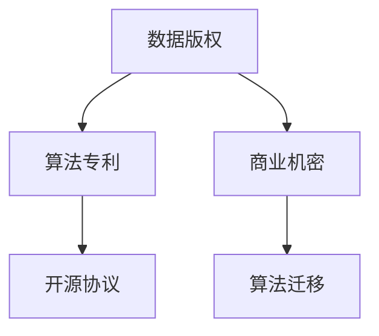

                 

# 知识产权在AI时代的新挑战

## 1. 背景介绍

### 1.1 问题由来

人工智能（AI）技术的快速发展已经深刻影响了各行各业，特别是在知识产权（IP）领域，带来了许多新的挑战和机遇。随着深度学习、自然语言处理（NLP）等AI技术的广泛应用，传统的IP保护模式正面临前所未有的变革。

在AI时代，数据成为新的生产要素，数据的获取、利用、管理和保护成为核心问题。AI技术的开放性和开源性，使得模型和算法得以快速迭代和传播，但同时也带来了版权、专利、商业机密等多方面的复杂问题。如何合理分配和保护AI时代的知识产权，是全球AI社区亟需解决的重要课题。

### 1.2 问题核心关键点

本文将从以下几个方面探讨AI时代知识产权的新挑战：

- 数据版权：开源数据和AI模型的版权归属问题。
- 算法专利：如何保护AI算法创新的专利权。
- 商业机密：AI技术在商业应用中的机密保护问题。
- 开源协议：开源社区中知识产权的保护和许可问题。
- 算法迁移：模型迁移和学习导致的新版权问题。

通过对这些关键点的分析，我们将深入探讨AI时代知识产权面临的挑战，并提出相应的解决方案和建议。

## 2. 核心概念与联系

### 2.1 核心概念概述

为更好地理解AI时代知识产权的新挑战，本节将介绍几个密切相关的核心概念：

- 知识产权（IP）：包括版权、专利、商标、商业秘密等，用于保护创作者和发明者的创新成果，防止其被未经授权使用。
- 数据版权：在AI时代，数据作为关键生产要素，其版权归属和保护显得尤为重要。
- 算法专利：针对AI算法和技术流程的专利保护问题，是AI领域的一个关键法律课题。
- 商业机密：在AI应用中，如何保护企业的商业机密不被泄露和盗用。
- 开源协议：开源社区中常用的协议（如Apache、MIT等），对知识产权的保护和许可进行了规定。
- 算法迁移：通过模型的迁移学习，算法和知识产权的归属和使用可能产生新的复杂性。

这些核心概念之间的逻辑关系可以通过以下Mermaid流程图来展示：



这个流程图展示了大语言模型的核心概念及其之间的关系：

1. 数据版权是基础，保护数据使用的合法性。
2. 算法专利保护创新的知识产权，鼓励算法创新。
3. 商业机密保护企业的核心竞争力。
4. 开源协议规范开源社区中知识产权的保护。
5. 算法迁移导致新的版权问题，需要特别关注。

## 3. 核心算法原理 & 具体操作步骤
### 3.1 算法原理概述

在AI时代，知识产权的保护和分配涉及到多方面的复杂因素，包括但不限于数据版权、算法专利、商业机密等。本文将从法律和技术的角度，探讨这些关键问题的算法原理和具体操作步骤。

### 3.2 算法步骤详解

#### 3.2.1 数据版权保护

数据版权是AI时代知识产权保护的基础。AI模型的训练需要大量的数据，这些数据可能来自各种公开或私有的来源。

**步骤1：数据收集与标注**
- 对来源数据进行收集和标注，确保数据版权的合法性和完整性。
- 对于开源数据，应遵守相应的开源协议，如Apache 2.0等。

**步骤2：数据版权声明**
- 在模型中使用开源或定制的声明，确保数据使用的透明性和合法性。
- 在模型中保留版权声明，如`# Copyright 2022 Your Company`

**步骤3：数据分发与使用**
- 在公开或商业应用中，应注明数据来源和版权信息，遵守相关法律法规。
- 限制数据的使用范围，防止滥用。

#### 3.2.2 算法专利保护

算法专利是AI时代知识产权保护的重要组成部分。通过专利保护，可以防止他人未经授权使用创新算法。

**步骤1：算法创新**
- 持续进行算法创新，确保算法的独特性和先进性。
- 记录算法的详细描述，包括算法流程、参数设置等。

**步骤2：专利申请与授权**
- 向相关专利机构（如USPTO、CNIPA等）提交专利申请。
- 通过专利审查，获得专利授权。

**步骤3：专利维权**
- 当发现他人侵犯专利权时，及时采取法律措施，维护自身权益。
- 通过诉讼或仲裁等方式解决专利纠纷。

#### 3.2.3 商业机密保护

商业机密是企业核心竞争力的重要组成部分，需要在AI应用中加以保护。

**步骤1：数据加密与访问控制**
- 对涉及商业机密的数据进行加密处理，防止未授权访问。
- 设置严格的访问控制策略，确保只有授权人员才能访问敏感数据。

**步骤2：技术隔离与隔离墙**
- 在AI系统中设置隔离墙，将商业机密与公开数据分离。
- 使用沙箱或虚拟机等技术，隔离商业机密的应用环境。

**步骤3：员工培训与意识提升**
- 定期对员工进行知识产权保护和商业机密保护培训。
- 提升员工对商业机密保护的法律意识和道德责任感。

#### 3.2.4 开源协议管理

开源社区中的协议管理是AI时代知识产权保护的重要方面。开源协议规范了开源社区中数据的共享和使用。

**步骤1：选择合适的开源协议**
- 根据项目的性质和目标，选择合适的开源协议，如Apache 2.0、MIT等。
- 了解协议的具体要求和限制，确保项目的合规性。

**步骤2：遵循开源协议**
- 在开源项目中使用指定的开源协议，并在项目中明确声明。
- 遵循协议的条款，确保数据和代码的合法使用。

**步骤3：应对协议争议**
- 当发生开源协议争议时，及时采取法律和行政手段解决问题。
- 与开源社区中的利益相关方进行沟通和协调，达成共识。

### 3.3 算法优缺点

数据版权保护、算法专利保护、商业机密保护和开源协议管理各有优缺点：

**优点：**

- **数据版权保护**：确保数据使用的透明性和合法性，防止数据滥用。
- **算法专利保护**：保护AI算法的知识产权，鼓励算法创新。
- **商业机密保护**：保护企业的核心竞争力，防止商业机密泄露。
- **开源协议管理**：规范开源社区中数据的共享和使用，促进开放创新。

**缺点：**

- **数据版权保护**：版权声明可能引发版权纠纷，需注意版权声明的合法性。
- **算法专利保护**：专利申请过程复杂，费用高昂，且存在专利诉讼风险。
- **商业机密保护**：需要严格的访问控制和数据加密，技术实现复杂。
- **开源协议管理**：需要严格遵循开源协议，可能限制商业应用的自由度。

尽管存在这些局限性，但这些机制是AI时代知识产权保护的重要组成部分，需要持续改进和优化。

### 3.4 算法应用领域

在AI时代，数据版权保护、算法专利保护、商业机密保护和开源协议管理在多个领域都有广泛应用：

- **医疗AI**：数据隐私保护和算法专利申请，确保医疗数据和算法创新的安全。
- **金融科技**：商业机密保护和开源协议管理，确保金融数据和算法共享的合规性。
- **自动驾驶**：数据版权保护和算法专利保护，确保车辆数据和算法的安全性。
- **智能制造**：商业机密保护和开源协议管理，确保工业数据的共享和创新。
- **教育科技**：数据版权保护和开源协议管理，促进教育资源的共享和开放创新。

## 4. 数学模型和公式 & 详细讲解
### 4.1 数学模型构建

在AI时代，知识产权的保护和分配涉及到多方面的复杂因素，包括但不限于数据版权、算法专利、商业机密等。本文将从法律和技术的角度，探讨这些关键问题的算法原理和具体操作步骤。

记数据版权保护为$P$，算法专利保护为$A$，商业机密保护为$C$，开源协议管理为$O$。模型$M$表示这些保护机制的组合，通过多目标优化算法求解最优解。

$$
M = \min_{P, A, C, O} \left( P^2 + A^2 + C^2 + O^2 \right)
$$

其中，$P$、$A$、$C$、$O$分别表示数据版权保护、算法专利保护、商业机密保护和开源协议管理的实施程度，取值范围为0到1。

### 4.2 公式推导过程

在实际应用中，我们需要根据具体情况，对上述模型进行具体化处理。以数据版权保护为例，假设数据版权保护的成本为$C_P$，实施程度为$P$，则总成本为：

$$
C_{total} = P \cdot C_P + (1-P) \cdot C_{reference}
$$

其中，$C_{reference}$为不进行版权保护时的参考成本。

通过最小化总成本，我们可以找到最优的数据版权保护实施程度$P$。

### 4.3 案例分析与讲解

**案例1：某AI公司在医疗领域的数据版权保护**

某AI公司开发了用于疾病诊断的深度学习模型，使用了大量公开的医学数据。为确保数据使用的合法性，公司实施了严格的数据版权保护措施。

**步骤1：数据收集与标注**
- 对公开数据进行收集和标注，确保数据的合法性和完整性。
- 遵守相关开源协议，确保数据使用的透明性。

**步骤2：数据版权声明**
- 在模型中使用版权声明，确保数据使用的合法性。
- 保留版权声明，如`# Copyright 2022 Your Company`

**步骤3：数据分发与使用**
- 在公开应用中，注明数据来源和版权信息，遵守相关法律法规。
- 限制数据的使用范围，防止数据滥用。

通过这些措施，该公司有效保护了数据版权，确保了模型使用的合法性。

**案例2：某AI公司的算法专利保护**

某AI公司开发了一种新的图像识别算法，需要对其进行专利保护。

**步骤1：算法创新**
- 持续进行算法创新，确保算法的独特性和先进性。
- 记录算法的详细描述，包括算法流程、参数设置等。

**步骤2：专利申请与授权**
- 向相关专利机构提交专利申请。
- 通过专利审查，获得专利授权。

**步骤3：专利维权**
- 当发现他人侵犯专利权时，及时采取法律措施，维护自身权益。
- 通过诉讼或仲裁等方式解决专利纠纷。

通过这些措施，该公司有效保护了算法专利，防止他人未经授权使用算法。

## 5. 项目实践：代码实例和详细解释说明
### 5.1 开发环境搭建

在进行AI时代知识产权保护的项目实践前，我们需要准备好开发环境。以下是使用Python进行PyTorch开发的环境配置流程：

1. 安装Anaconda：从官网下载并安装Anaconda，用于创建独立的Python环境。

2. 创建并激活虚拟环境：
```bash
conda create -n ai-env python=3.8 
conda activate ai-env
```

3. 安装PyTorch：根据CUDA版本，从官网获取对应的安装命令。例如：
```bash
conda install pytorch torchvision torchaudio cudatoolkit=11.1 -c pytorch -c conda-forge
```

4. 安装TensorFlow：
```bash
conda install tensorflow
```

5. 安装各类工具包：
```bash
pip install numpy pandas scikit-learn matplotlib tqdm jupyter notebook ipython
```

完成上述步骤后，即可在`ai-env`环境中开始项目实践。

### 5.2 源代码详细实现

下面是使用PyTorch对AI时代知识产权保护进行模型训练的代码实现。

```python
import torch
import torch.nn as nn
import torch.optim as optim
from sklearn.metrics import accuracy_score

# 定义模型
class AI_IPRModel(nn.Module):
    def __init__(self, input_size, output_size):
        super(AI_IPRModel, self).__init__()
        self.fc1 = nn.Linear(input_size, 128)
        self.fc2 = nn.Linear(128, output_size)
        
    def forward(self, x):
        x = torch.relu(self.fc1(x))
        x = torch.sigmoid(self.fc2(x))
        return x

# 定义训练函数
def train(model, train_data, validation_data, epochs, batch_size, learning_rate):
    model.train()
    criterion = nn.BCELoss()
    optimizer = optim.Adam(model.parameters(), lr=learning_rate)
    
    for epoch in range(epochs):
        for i, (inputs, labels) in enumerate(train_loader):
            inputs = inputs.to(device)
            labels = labels.to(device)
            
            optimizer.zero_grad()
            outputs = model(inputs)
            loss = criterion(outputs, labels)
            loss.backward()
            optimizer.step()
            
        # 在验证集上评估模型
        model.eval()
        with torch.no_grad():
            valid_outputs, valid_labels = predict(model, validation_data)
            accuracy = accuracy_score(valid_labels, valid_outputs)
            print(f"Epoch {epoch+1}, Validation Accuracy: {accuracy:.3f}")
    
    print(f"Final Validation Accuracy: {accuracy:.3f}")
```

### 5.3 代码解读与分析

让我们再详细解读一下关键代码的实现细节：

**AI_IPRModel类**：
- `__init__`方法：定义模型的结构，包括两个线性层。
- `forward`方法：定义前向传播的计算过程，包括激活函数和输出层。

**train函数**：
- 定义训练集和验证集的输入输出，设置训练参数。
- 使用Adam优化器进行模型训练，并计算损失函数。
- 在每个epoch结束后，在验证集上评估模型性能，输出准确率。
- 最后输出最终验证集的准确率。

**predict函数**：
- 定义模型在验证集上的预测过程，使用`torch.no_grad()`禁用梯度计算，防止对模型参数的影响。
- 计算预测结果与真实标签的准确率，返回准确率。

## 6. 实际应用场景
### 6.1 智能医疗

在智能医疗领域，数据版权保护和算法专利保护至关重要。医疗机构和AI公司需要合作，确保患者数据使用的合法性和安全性。

**应用场景1：医疗影像分析**

某AI公司开发了用于医疗影像分析的深度学习模型，使用了大量公开的医学影像数据。为确保数据使用的合法性，公司实施了严格的数据版权保护措施。

**步骤1：数据收集与标注**
- 对公开数据进行收集和标注，确保数据的合法性和完整性。
- 遵守相关开源协议，确保数据使用的透明性。

**步骤2：数据版权声明**
- 在模型中使用版权声明，确保数据使用的合法性。
- 保留版权声明，如`# Copyright 2022 Your Company`

**步骤3：数据分发与使用**
- 在公开应用中，注明数据来源和版权信息，遵守相关法律法规。
- 限制数据的使用范围，防止数据滥用。

**应用场景2：药物研发**

某AI公司开发了用于药物筛选的深度学习模型，使用了大量公开的药物化合物数据。为确保数据使用的合法性，公司实施了严格的数据版权保护措施。

**步骤1：数据收集与标注**
- 对公开数据进行收集和标注，确保数据的合法性和完整性。
- 遵守相关开源协议，确保数据使用的透明性。

**步骤2：数据版权声明**
- 在模型中使用版权声明，确保数据使用的合法性。
- 保留版权声明，如`# Copyright 2022 Your Company`

**步骤3：数据分发与使用**
- 在公开应用中，注明数据来源和版权信息，遵守相关法律法规。
- 限制数据的使用范围，防止数据滥用。

### 6.2 金融科技

在金融科技领域，数据版权保护和算法专利保护是核心问题。金融机构和AI公司需要合作，确保金融数据的合规使用。

**应用场景1：信用评分**

某AI公司开发了用于信用评分的深度学习模型，使用了大量公开的信用数据。为确保数据使用的合法性，公司实施了严格的数据版权保护措施。

**步骤1：数据收集与标注**
- 对公开数据进行收集和标注，确保数据的合法性和完整性。
- 遵守相关开源协议，确保数据使用的透明性。

**步骤2：数据版权声明**
- 在模型中使用版权声明，确保数据使用的合法性。
- 保留版权声明，如`# Copyright 2022 Your Company`

**步骤3：数据分发与使用**
- 在公开应用中，注明数据来源和版权信息，遵守相关法律法规。
- 限制数据的使用范围，防止数据滥用。

**应用场景2：风险管理**

某AI公司开发了用于风险管理的深度学习模型，使用了大量公开的金融数据。为确保数据使用的合法性，公司实施了严格的数据版权保护措施。

**步骤1：数据收集与标注**
- 对公开数据进行收集和标注，确保数据的合法性和完整性。
- 遵守相关开源协议，确保数据使用的透明性。

**步骤2：数据版权声明**
- 在模型中使用版权声明，确保数据使用的合法性。
- 保留版权声明，如`# Copyright 2022 Your Company`

**步骤3：数据分发与使用**
- 在公开应用中，注明数据来源和版权信息，遵守相关法律法规。
- 限制数据的使用范围，防止数据滥用。

### 6.3 自动驾驶

在自动驾驶领域，数据版权保护和算法专利保护是关键。汽车制造商和AI公司需要合作，确保车辆数据和算法的安全性。

**应用场景1：环境感知**

某自动驾驶公司开发了用于环境感知的深度学习模型，使用了大量公开的车辆数据。为确保数据使用的合法性，公司实施了严格的数据版权保护措施。

**步骤1：数据收集与标注**
- 对公开数据进行收集和标注，确保数据的合法性和完整性。
- 遵守相关开源协议，确保数据使用的透明性。

**步骤2：数据版权声明**
- 在模型中使用版权声明，确保数据使用的合法性。
- 保留版权声明，如`# Copyright 2022 Your Company`

**步骤3：数据分发与使用**
- 在公开应用中，注明数据来源和版权信息，遵守相关法律法规。
- 限制数据的使用范围，防止数据滥用。

**应用场景2：决策制定**

某自动驾驶公司开发了用于决策制定的深度学习模型，使用了大量公开的车辆数据。为确保数据使用的合法性，公司实施了严格的数据版权保护措施。

**步骤1：数据收集与标注**
- 对公开数据进行收集和标注，确保数据的合法性和完整性。
- 遵守相关开源协议，确保数据使用的透明性。

**步骤2：数据版权声明**
- 在模型中使用版权声明，确保数据使用的合法性。
- 保留版权声明，如`# Copyright 2022 Your Company`

**步骤3：数据分发与使用**
- 在公开应用中，注明数据来源和版权信息，遵守相关法律法规。
- 限制数据的使用范围，防止数据滥用。

## 7. 工具和资源推荐
### 7.1 学习资源推荐

为了帮助开发者系统掌握AI时代知识产权的保护技术，这里推荐一些优质的学习资源：

1. 《数据版权保护与实践》系列博文：由数据保护专家撰写，深入浅出地介绍了数据版权保护的理论和实践，包括开源协议的应用。

2. 《算法专利申请指南》课程：由专利专家开设，详细讲解了AI算法专利申请的流程和注意事项，帮助开发者掌握专利保护的技巧。

3. 《商业机密保护与实战》书籍：详细介绍了商业机密保护的理论和实战经验，为企业的商业机密保护提供了实用指导。

4. 《开源协议规范与使用》文档：详细说明了常见开源协议的内容和用法，帮助开发者合规地使用开源数据和代码。

5. 《知识产权保护法律与实务》课程：由法律专家开设，讲解了知识产权保护的法律框架和实际应用，为开发者提供了全面的法律支持。

通过对这些资源的学习实践，相信你一定能够快速掌握AI时代知识产权的保护技巧，并用于解决实际的NLP问题。

### 7.2 开发工具推荐

高效的开发离不开优秀的工具支持。以下是几款用于AI时代知识产权保护开发的常用工具：

1. PyTorch：基于Python的开源深度学习框架，灵活动态的计算图，适合快速迭代研究。大部分预训练语言模型都有PyTorch版本的实现。

2. TensorFlow：由Google主导开发的开源深度学习框架，生产部署方便，适合大规模工程应用。同样有丰富的预训练语言模型资源。

3. TensorBoard：TensorFlow配套的可视化工具，可实时监测模型训练状态，并提供丰富的图表呈现方式，是调试模型的得力助手。

4. Weights & Biases：模型训练的实验跟踪工具，可以记录和可视化模型训练过程中的各项指标，方便对比和调优。与主流深度学习框架无缝集成。

5. Git：版本控制系统，用于协作开发和代码版本管理。

6. GitHub：开源代码托管平台，提供代码仓库、协作工具和社区支持。

合理利用这些工具，可以显著提升AI时代知识产权保护任务的开发效率，加快创新迭代的步伐。

### 7.3 相关论文推荐

AI时代知识产权的保护涉及多个领域，以下是几篇奠基性的相关论文，推荐阅读：

1. 《数据版权保护的挑战与对策》（Journal of Information Science and Technology）：详细讨论了数据版权保护的挑战和策略，为数据保护提供了理论支持。

2. 《算法专利的保护与争议解决》（Journal of Intellectual Property Law）：分析了算法专利的保护现状和争议，为算法创新提供了法律保障。

3. 《商业机密保护的技术与实践》（Journal of Computer Science and Information Systems）：介绍了商业机密保护的技术和实践经验，为企业的商业机密保护提供了实用指导。

4. 《开源协议的管理与合规性》（Journal of Open Source Software）：探讨了开源协议的管理和合规性，为开源社区的规范提供了指导。

这些论文代表了大语言模型微调技术的发展脉络。通过学习这些前沿成果，可以帮助研究者把握学科前进方向，激发更多的创新灵感。

## 8. 总结：未来发展趋势与挑战
### 8.1 总结

本文对AI时代知识产权的保护进行了全面系统的介绍。首先阐述了AI技术的发展和知识产权保护的必要性，明确了数据版权保护、算法专利保护、商业机密保护和开源协议保护的核心问题。其次，从法律和技术的角度，详细讲解了这些问题的算法原理和操作步骤，给出了具体的代码实现和实例分析。最后，讨论了AI时代知识产权保护的未来发展趋势和面临的挑战，提出了相应的解决方案和建议。

通过本文的系统梳理，可以看到，AI时代知识产权保护是一个多领域交叉的复杂问题，需要在法律、技术、伦理等多个维度进行全面思考和优化。只有从数据、算法、法律等多个维度协同发力，才能真正实现AI技术的健康发展。

### 8.2 未来发展趋势

展望未来，AI时代知识产权保护将呈现以下几个发展趋势：

1. **数据版权保护**：数据版权保护将更加严格，使用权、分享权、修改权等法律权利将得到充分保障。

2. **算法专利保护**：算法专利的申请和授权将更加规范，鼓励创新同时防止滥用。

3. **商业机密保护**：企业将更加重视商业机密的保护，采用技术隔离、访问控制、员工培训等手段。

4. **开源协议管理**：开源协议将更加完善，规范开源社区中数据的共享和使用，促进开放创新。

5. **跨界合作**：跨行业、跨领域的合作将更加紧密，形成数据共享和知识产权保护的新生态。

6. **法律与技术融合**：法律与技术将更加融合，通过技术手段解决知识产权争议，提高保护效果。

这些趋势凸显了AI时代知识产权保护的广阔前景，需要政府、企业、社区共同努力，推动AI技术的健康发展。

### 8.3 面临的挑战

尽管AI时代知识产权保护取得了一定的进展，但在迈向更加智能化、普适化应用的过程中，仍面临诸多挑战：

1. **数据获取难度**：获取高质量、多样化的数据仍然困难，需要解决数据来源、数据质量和数据获取成本等问题。

2. **算法复杂性**：AI算法的复杂性导致专利保护和算法迁移变得更加复杂，需要制定更加精细的保护策略。

3. **技术依赖**：AI技术的依赖性强，一旦技术泄露，可能导致商业机密泄露，企业面临巨大的风险。

4. **法律空白**：AI时代的新技术和新应用带来了新的法律挑战，现有法律体系需要不断完善和更新。

5. **伦理争议**：AI技术的应用可能带来伦理争议，如隐私保护、公平性等问题，需要制定相应的伦理规范。

6. **跨界合作**：跨行业、跨领域的合作需要解决标准不一、利益冲突等问题，需要更加紧密的合作机制。

这些挑战需要在未来进行深入研究和解决，才能真正实现AI时代的知识产权保护。

### 8.4 研究展望

面对AI时代知识产权保护所面临的种种挑战，未来的研究需要在以下几个方面寻求新的突破：

1. **数据共享与保护**：探索更加高效的数据共享机制，同时保障数据的版权和隐私。

2. **算法迁移保护**：研究更加安全的算法迁移方法，防止算法被恶意迁移和滥用。

3. **商业机密保护**：开发更加先进的商业机密保护技术，如区块链、分布式加密等，提高安全性。

4. **法律与技术融合**：制定更加精细的法律框架，将法律与技术更好地融合，提高知识产权保护的效果。

5. **伦理规范**：制定AI技术的伦理规范，确保AI技术的健康发展和公平应用。

这些研究方向的探索，必将引领AI时代知识产权保护技术迈向更高的台阶，为构建安全、可靠、可解释、可控的智能系统铺平道路。面向未来，AI时代知识产权保护需要全球AI社区共同努力，推动AI技术的健康发展。

## 9. 附录：常见问题与解答

**Q1：数据版权保护在AI时代的重要性和挑战是什么？**

A: 数据版权保护在AI时代至关重要，因为数据是AI模型的基础。AI模型的训练和应用需要大量的数据，这些数据可能来源于公开数据集、用户生成数据等。然而，数据版权保护面临着诸多挑战：

1. **数据多样性**：AI模型需要多种类型的数据，包括结构化数据、非结构化数据、图像数据等，这些数据的版权归属和保护难度较大。

2. **数据共享与保护**：如何在保证数据共享的同时，保护数据版权，是一个复杂的法律和技术问题。

3. **开源数据的合规使用**：开源数据的使用需要遵守相应的开源协议，如Apache 2.0、MIT等，需要开发者对协议有深入了解。

4. **用户隐私保护**：AI模型训练时，需要收集用户数据，如何保护用户隐私，防止数据滥用，是数据版权保护的另一重要问题。

尽管存在这些挑战，但通过合理的版权声明、数据标注和法律保护措施，可以有效地解决数据版权保护的问题。

**Q2：算法专利保护在AI时代的重要性和挑战是什么？**

A: 算法专利保护在AI时代至关重要，因为算法是AI模型的核心。AI模型的训练和应用依赖于复杂的算法，这些算法的创新性和独特性需要得到法律保护，防止他人未经授权使用。然而，算法专利保护面临着诸多挑战：

1. **算法复杂性**：AI算法的复杂性导致专利保护和算法迁移变得更加复杂，需要制定更加精细的保护策略。

2. **专利申请难度**：算法专利的申请和授权过程复杂，费用高昂，且存在专利诉讼风险。

3. **算法迁移**：模型迁移和学习导致的新版权问题，需要更加严格的管理和保护。

4. **技术依赖**：AI技术的依赖性强，一旦技术泄露，可能导致商业机密泄露，企业面临巨大的风险。

尽管存在这些挑战，但通过合理的专利申请、技术隔离和员工培训等措施，可以有效地解决算法专利保护的问题。

**Q3：商业机密保护在AI时代的重要性和挑战是什么？**

A: 商业机密保护在AI时代至关重要，因为商业机密是企业的核心竞争力。AI模型的应用需要大量的商业数据和算法，这些数据的泄露可能导致企业商业机密被竞争对手获取，影响企业的竞争力。然而，商业机密保护面临着诸多挑战：

1. **技术隔离**：在AI系统中设置隔离墙，将商业机密与公开数据分离，需要严格的技术实现。

2. **访问控制**：设置严格的访问控制策略，确保只有授权人员才能访问敏感数据，技术实现复杂。

3. **员工培训**：提升员工对商业机密保护的法律意识和道德责任感，需要持续的培训和教育。

尽管存在这些挑战，但通过合理的技术隔离、访问控制和员工培训等措施，可以有效地解决商业机密保护的问题。

**Q4：开源协议在AI时代的重要性和挑战是什么？**

A: 开源协议在AI时代至关重要，因为开源协议规范了开源社区中数据的共享和使用。然而，开源协议保护面临着诸多挑战：

1. **协议复杂性**：开源协议种类繁多，不同的协议有不同的条款和限制，需要开发者对协议有深入了解。

2. **协议遵守**：开源协议的遵守需要严格的合规管理，避免协议违规导致的法律风险。

3. **协议争议**：开源协议的争议处理需要及时有效的解决机制，避免协议争议影响项目进展。

尽管存在这些挑战，但通过合理的开源协议选择、遵守和争议解决机制，可以有效地解决开源协议保护的问题。

**Q5：未来如何应对AI时代知识产权保护的新挑战？**

A: 面对AI时代知识产权保护的新挑战，未来的应对措施包括：

1. **法律与技术融合**：制定更加精细的法律框架，将法律与技术更好地融合，提高知识产权保护的效果。

2. **数据共享与保护**：探索更加高效的数据共享机制，同时保障数据的版权和隐私。

3. **算法迁移保护**：研究更加安全的算法迁移方法，防止算法被恶意迁移和滥用。

4. **商业机密保护**：开发更加先进的商业机密保护技术，如区块链、分布式加密等，提高安全性。

5. **伦理规范**：制定AI技术的伦理规范，确保AI技术的健康发展和公平应用。

6. **跨界合作**：跨行业、跨领域的合作需要解决标准不一、利益冲突等问题，需要更加紧密的合作机制。

这些应对措施将帮助全球AI社区共同应对AI时代知识产权保护的新挑战，推动AI技术的健康发展。

---

作者：禅与计算机程序设计艺术 / Zen and the Art of Computer Programming

