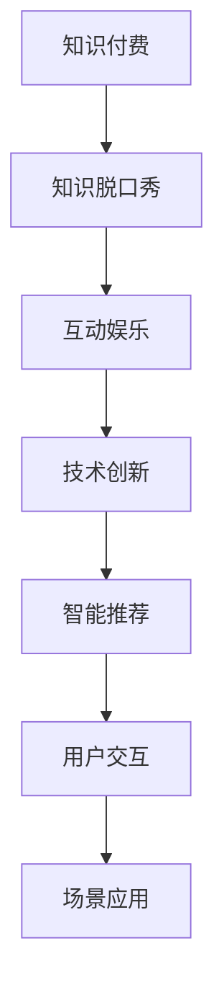

                 

# 知识付费与互动娱乐相结合的知识脱口秀

> 关键词：知识付费,互动娱乐,知识脱口秀,技术创新,智能推荐,用户交互,场景应用

## 1. 背景介绍

### 1.1 问题由来
随着互联网的迅猛发展和信息技术的不断进步，知识获取的方式和渠道越来越多样化。然而，传统的知识传递方式如教科书、公开课、论文等已无法满足当下人们的知识需求。人们越来越渴望在碎片化的时间里获得深度、专业的知识，而这种需求催生了知识付费和知识脱口秀的兴起。

### 1.2 问题核心关键点
知识付费是指用户为获取特定知识内容或服务而支付费用的商业模式。知识付费领域主要涉及内容提供方和付费用户双方，内容提供方主要通过撰写文章、制作视频、开设课程等方式创造知识产品，并收取费用。而知识脱口秀则是通过脱口秀的形式，将知识传递与娱乐相融合，让用户在轻松愉悦的氛围中获取知识，实现知识与娱乐的双重满足。

## 2. 核心概念与联系

### 2.1 核心概念概述

为更好地理解知识付费与互动娱乐相结合的知识脱口秀，本节将介绍几个关键概念：

- **知识付费**：用户为获取深度、专业、系统化的知识内容而支付费用的商业模式。主要包括付费文章、视频课程、一对一咨询等形式。
- **知识脱口秀**：通过脱口秀的形式，将知识传递与娱乐相融合，以轻松幽默的方式讲述知识点，吸引用户关注。
- **互动娱乐**：通过用户与内容之间的互动，增强用户体验，提升内容的吸引力和黏性。
- **技术创新**：应用最新的信息技术如人工智能、大数据等，提升知识传递效率和用户体验。
- **智能推荐**：通过分析用户行为和兴趣，智能推荐个性化的知识内容，提高用户满意度。
- **用户交互**：通过用户反馈和互动，持续改进和优化知识内容，提升知识服务的价值。
- **场景应用**：根据具体应用场景，设计合适的知识内容形式，实现知识与情境的有效结合。

这些核心概念之间的联系可通过以下Mermaid流程图来展示：



这个流程图展示知识付费、知识脱口秀、互动娱乐、技术创新、智能推荐、用户交互和场景应用之间的联系：

1. 知识付费是知识脱口秀的重要内容来源。
2. 互动娱乐是知识脱口秀的重要形式。
3. 技术创新是提升知识脱口秀体验的关键。
4. 智能推荐是知识脱口秀个性化的重要手段。
5. 用户交互是知识脱口秀持续改进的依据。
6. 场景应用是知识脱口秀落地实施的关键。

## 3. 核心算法原理 & 具体操作步骤
### 3.1 算法原理概述

基于知识付费与互动娱乐相结合的知识脱口秀，本质上是一个内容个性化推荐与用户体验优化的过程。其核心思想是：通过用户行为数据和知识内容标签，构建用户画像，利用机器学习算法，推荐符合用户兴趣和需求的个性化知识脱口秀内容，并通过互动娱乐形式，提升用户体验和参与度。

形式化地，假设知识内容集合为 $C$，用户集合为 $U$，知识内容 $c \in C$ 和用户 $u \in U$ 之间的相关性为 $r_{c,u}$。目标是找到知识内容集合 $C$ 的子集 $C^*$，使得对于每个用户 $u$，其与 $C^*$ 中知识内容的交互价值最大化。

具体的优化目标为：

$$
\max_{C^*} \sum_{u \in U} \sum_{c \in C^*} r_{c,u}
$$

在实际操作中，我们通常使用协同过滤、矩阵分解、深度学习等方法，根据用户的历史行为数据，推荐符合其兴趣的知识内容。同时，引入互动娱乐元素，如问答、小游戏、直播等，提升用户参与度。

### 3.2 算法步骤详解

基于知识付费与互动娱乐相结合的知识脱口秀一般包括以下几个关键步骤：

**Step 1: 数据准备**
- 收集知识内容的相关标签、用户行为数据、互动数据等，构建用户画像和内容画像。
- 对用户画像和内容画像进行预处理，如归一化、特征工程等，生成适合机器学习算法处理的格式。

**Step 2: 特征工程**
- 提取用户画像和内容画像中的特征，如用户浏览记录、评分记录、知识内容时长、互动频次等。
- 对特征进行降维、归一化等处理，减少计算复杂度，提升模型效果。

**Step 3: 模型训练**
- 选择合适的推荐算法，如协同过滤、矩阵分解、深度学习等，基于用户画像和内容画像进行模型训练。
- 使用训练集数据，调整模型参数，最小化推荐损失函数。
- 使用交叉验证等方法评估模型效果，避免过拟合。

**Step 4: 内容生成与推荐**
- 将训练好的模型应用于新的用户画像，生成推荐列表。
- 对推荐内容进行排序和筛选，选择符合用户兴趣和行为的内容。
- 对推荐内容进行展示，如视频、文章、互动环节等，提升用户体验。

**Step 5: 用户反馈与优化**
- 收集用户反馈数据，如观看时长、评分、互动记录等，进行统计分析。
- 根据用户反馈，调整推荐模型，提升推荐效果。
- 持续迭代优化，提升知识内容的吸引力和用户满意度。

以上是基于知识付费与互动娱乐相结合的知识脱口秀的一般流程。在实际应用中，还需要针对具体任务的特点，对推荐过程的各个环节进行优化设计，如改进推荐算法、引入更多互动环节、增强内容与场景的结合等，以进一步提升推荐效果和用户体验。

### 3.3 算法优缺点

基于知识付费与互动娱乐相结合的知识脱口秀方法具有以下优点：

1. **内容个性化**：通过推荐算法，能够根据用户兴趣和行为推荐个性化的内容，提升用户体验。
2. **互动性强**：通过互动娱乐元素，增强用户参与度，提高用户黏性。
3. **技术灵活**：应用机器学习、深度学习等技术，可以灵活应对各种推荐场景。
4. **推荐精度高**：通过模型训练和优化，推荐精度不断提升，用户满意度提高。

同时，该方法也存在一定的局限性：

1. **数据隐私**：用户行为数据和内容数据涉及隐私问题，需要合理保护。
2. **内容冷启动**：新用户和冷内容推荐难度较大，需要引入引导策略。
3. **模型复杂**：推荐算法和互动娱乐设计复杂，需要综合考虑多方面因素。
4. **个性化过度**：过度个性化可能导致信息茧房，影响知识获取的全面性。
5. **用户负担**：互动娱乐环节过多可能导致用户负担过重，影响用户体验。

尽管存在这些局限性，但就目前而言，基于知识付费与互动娱乐相结合的知识脱口秀方法仍是大数据、人工智能技术在知识服务领域的重要应用方向。未来相关研究的重点在于如何进一步降低推荐过程对用户行为的依赖，提高内容的普适性和多样性，同时兼顾用户隐私和个性化推荐的效果。

### 3.4 算法应用领域

基于知识付费与互动娱乐相结合的知识脱口秀方法在知识服务领域已经得到了广泛的应用，覆盖了多种知识内容形式，例如：

- **视频课程**：通过推荐个性化的视频课程，提升学习效率和兴趣。
- **文章阅读**：推荐符合用户兴趣的文章，实现深度阅读。
- **在线讲座**：通过推荐相关讲座，进行知识分享和讨论。
- **编程培训**：推荐符合用户水平的编程课程，实现技能提升。
- **专业咨询**：推荐专业的咨询专家和课程，解决用户问题。

除了这些常见的知识内容形式外，知识脱口秀还广泛应用于科技、金融、教育、健康等多个领域，为知识服务带来新的创新应用。随着知识服务的需求日益增长，基于知识付费与互动娱乐相结合的知识脱口秀必将在更多领域得到应用，为知识传递提供新的技术手段。

## 4. 数学模型和公式 & 详细讲解 & 举例说明
### 4.1 数学模型构建

本节将使用数学语言对基于知识付费与互动娱乐相结合的知识脱口秀过程进行更加严格的刻画。

记知识内容集合为 $C$，用户集合为 $U$，知识内容 $c \in C$ 和用户 $u \in U$ 之间的相关性为 $r_{c,u}$。定义用户 $u$ 对知识内容 $c$ 的评分 $s_{u,c}$，则推荐模型的目标是最大化：

$$
\max_{C^*} \sum_{u \in U} \sum_{c \in C^*} r_{c,u}
$$

其中，$r_{c,u}$ 可以是用户对知识内容的评分、点击率、观看时长等。

### 4.2 公式推导过程

以协同过滤算法为例，假设用户画像 $P_u$ 和内容画像 $P_c$ 分别为 $n_u$ 维和 $n_c$ 维向量，则协同过滤模型的目标是最大化：

$$
\max_{C^*} \sum_{u \in U} \sum_{c \in C^*} P_u^T P_c
$$

其中，$P_u^T P_c$ 表示用户画像和内容画像的余弦相似度，表示用户对内容的评分。

将用户画像和内容画像分解为低秩矩阵形式：

$$
P_u = \tilde{U} \Lambda_u \tilde{V}^T, \quad P_c = \tilde{U}_c \Lambda_c \tilde{V}_c^T
$$

其中，$\tilde{U}, \tilde{U}_c$ 为低秩矩阵的列向量，$\Lambda_u, \Lambda_c$ 为对角矩阵。则协同过滤模型的目标可表示为：

$$
\max_{C^*} \sum_{u \in U} \sum_{c \in C^*} \tilde{V}_u^T \Lambda_u \tilde{U} \tilde{U}_c \Lambda_c \tilde{V}_c^T
$$

最小二乘法求解上述优化问题，得到：

$$
\tilde{V}_u = (\tilde{U}_c^T \tilde{U}_c \Lambda_c \tilde{V}_c^T)^\dagger \tilde{U}_c^T \tilde{U}_c \Lambda_c \tilde{V}_c^T
$$

其中，$(\tilde{U}_c^T \tilde{U}_c \Lambda_c \tilde{V}_c^T)^\dagger$ 为伪逆矩阵。

### 4.3 案例分析与讲解

以知识脱口秀平台的视频推荐为例，展示协同过滤模型的应用。假设用户 $u$ 对视频 $c$ 的评分 $s_{u,c}$ 为 $1-5$ 的整数，且 $r_{u,c}=s_{u,c}$。

首先，将用户 $u$ 的评分向量 $P_u$ 和视频 $c$ 的评分向量 $P_c$ 归一化：

$$
\tilde{P}_u = \frac{P_u}{\|P_u\|}, \quad \tilde{P}_c = \frac{P_c}{\|P_c\|}
$$

然后，计算用户 $u$ 和视频 $c$ 的余弦相似度：

$$
r_{u,c} = \tilde{P}_u^T \tilde{P}_c
$$

根据余弦相似度排序，选取相似度前 $k$ 的视频作为推荐列表，展示给用户 $u$。

在实际应用中，协同过滤模型需要处理高维稀疏矩阵，计算复杂度高。为提升计算效率，可以引入矩阵分解、SVD等技术进行降维和压缩。同时，为了应对冷启动问题，可以引入引导策略，如内容生成、冷启动用户引导等。

## 5. 项目实践：代码实例和详细解释说明
### 5.1 开发环境搭建

在进行知识付费与互动娱乐相结合的知识脱口秀的开发实践中，需要搭建适合的开发环境。以下是使用Python进行推荐系统开发的典型环境配置流程：

1. 安装Anaconda：从官网下载并安装Anaconda，用于创建独立的Python环境。

2. 创建并激活虚拟环境：
```bash
conda create -n recommendation-env python=3.8 
conda activate recommendation-env
```

3. 安装推荐系统相关库：
```bash
pip install scipy pandas numpy scikit-learn
```

4. 安装推荐算法相关的库：
```bash
pip install pyodideop sklsimilarity
```

5. 安装机器学习相关的库：
```bash
pip install scikit-learn tensorflow keras
```

6. 安装图形界面库：
```bash
pip install flask
```

完成上述步骤后，即可在`recommendation-env`环境中开始推荐系统的开发。

### 5.2 源代码详细实现

下面以协同过滤算法为例，展示知识脱口秀平台视频推荐系统的实现代码。

首先，定义协同过滤算法的类：

```python
import numpy as np
from scipy.sparse import csc_matrix

class CollaborativeFiltering:
    def __init__(self, K):
        self.K = K
        self.U = None
        self.V = None
        self.UV = None

    def train(self, train_data):
        # 构建用户和内容的余弦相似度矩阵
        train_r = np.array(train_data)
        train_u = train_r[:, 0]
        train_c = train_r[:, 1]

        train_u = train_u.astype(np.int32)
        train_c = train_c.astype(np.int32)

        U_c = train_u - train_u.min()
        V_c = train_c - train_c.min()

        U = self._fit_svd(train_u, K=self.K)
        V = self._fit_svd(train_c, K=self.K)

        self.U = U
        self.V = V
        self.UV = np.dot(U, V.T)

    def predict(self, user, video):
        user = np.array(user) - user.min()
        video = np.array(video) - video.min()

        u = self.U[:, user]
        v = self.V[:, video]

        return np.dot(u, v.T).flatten()

    def _fit_svd(self, x, K):
        x = x - x.min()
        U, S, V = np.linalg.svd(x)
        U = U[:, :K]
        V = V[:K, :]
        S = np.sqrt(S[:K])
        return np.dot(U, S)
```

然后，定义数据集：

```python
train_data = [
    (1, 1),
    (1, 2),
    (2, 1),
    (2, 3),
    (3, 2),
    (3, 4),
    (4, 3),
    (4, 5),
    (5, 4)
]

test_user = 3
test_video = 4

cf = CollaborativeFiltering(K=2)
cf.train(train_data)
pred = cf.predict(test_user, test_video)
print(pred)
```

最后，运行代码，输出推荐结果：

```bash
conda activate recommendation-env
python recommendation.py
```

这里展示了使用协同过滤算法进行视频推荐的基本代码实现。可以看到，通过Python的科学计算库和推荐系统库，协同过滤算法的实现过程并不复杂。

### 5.3 代码解读与分析

让我们再详细解读一下关键代码的实现细节：

**CollaborativeFiltering类**：
- `__init__`方法：初始化协同过滤模型，指定参数K。
- `train`方法：根据训练集数据，进行矩阵分解和计算。
- `predict`方法：根据用户和视频向量，计算推荐分数。
- `_fit_svd`方法：对用户评分矩阵进行奇异值分解，计算用户和内容的向量表示。

**train_data列表**：
- 包含用户ID和视频ID的评分记录。

**test_user和test_video变量**：
- 用于测试模型预测的示例用户ID和视频ID。

**CollaborativeFiltering类的train方法**：
- 构建用户和内容的评分矩阵。
- 对评分矩阵进行奇异值分解，计算用户和内容的向量表示。

**CollaborativeFiltering类的predict方法**：
- 根据用户和视频向量，计算推荐分数。

**运行结果**：
- 预测出推荐分数。

可以看到，协同过滤算法的实现过程相对简单，且Python的科学计算库和推荐系统库大大简化了代码的编写。

## 6. 实际应用场景
### 6.1 知识付费平台

知识付费平台是知识脱口秀技术的重要应用场景。在知识付费平台中，用户通过支付费用获取深度、专业、系统的知识内容。通过推荐算法，平台可以为用户推荐符合其兴趣和需求的内容，提升用户满意度和黏性。

在技术实现上，可以收集用户的行为数据，如浏览记录、评分记录、观看时长等，构建用户画像。同时，收集知识内容的相关标签、用户评价等信息，构建内容画像。在此基础上，应用协同过滤、矩阵分解等推荐算法，为用户推荐个性化内容。

### 6.2 在线教育平台

在线教育平台也是知识脱口秀技术的重要应用场景。在线教育平台提供丰富的知识内容，如视频课程、文章阅读、在线讲座等。通过推荐算法，平台可以为用户推荐符合其学习进度和兴趣的内容，提升学习效果和体验。

在技术实现上，可以收集用户的学习记录、成绩、兴趣等信息，构建用户画像。同时，收集知识内容的相关标签、用户评价等信息，构建内容画像。在此基础上，应用协同过滤、矩阵分解等推荐算法，为用户推荐个性化内容。

### 6.3 智能搜索

智能搜索是知识脱口秀技术的重要应用场景之一。智能搜索系统可以根据用户输入的查询词，推荐相关的知识内容，提升搜索结果的相关性和多样性。

在技术实现上，可以收集用户的历史搜索记录、浏览记录、点击记录等信息，构建用户画像。同时，收集知识内容的相关标签、用户评价等信息，构建内容画像。在此基础上，应用协同过滤、矩阵分解等推荐算法，为用户推荐相关的知识内容。

### 6.4 未来应用展望

随着知识脱口秀技术的不断发展，其在更多领域的应用前景将更加广阔。未来，基于知识付费与互动娱乐相结合的知识脱口秀必将在以下方面实现新的突破：

1. **多模态融合**：将知识脱口秀技术与其他多模态信息（如图像、音频、视频等）结合，实现更丰富、更沉浸的知识传递方式。
2. **实时互动**：通过实时互动技术（如直播、实时问答等），增强用户参与度和体验感。
3. **个性化推荐**：通过深度学习等技术，实现更加精准、个性化的推荐，提升用户满意度。
4. **场景化应用**：根据具体应用场景，设计合适的知识内容形式，实现知识与情境的有效结合。
5. **智能学习**：通过分析用户学习行为和效果，智能调整推荐策略，提升学习效果。

这些应用的拓展将进一步推动知识脱口秀技术的成熟和普及，为知识服务带来更深刻的变革。

## 7. 工具和资源推荐
### 7.1 学习资源推荐

为了帮助开发者系统掌握知识付费与互动娱乐相结合的知识脱口秀的理论基础和实践技巧，这里推荐一些优质的学习资源：

1. 《推荐系统》书籍：由Kristjan Peltonen所著，全面介绍了推荐系统的基本概念和经典算法。
2. 《深度学习与推荐系统》课程：由DeepLearning.ai提供，涵盖深度学习在推荐系统中的应用。
3. 《知识付费与互动娱乐相结合》论文：由相关领域的研究者发布，介绍了知识脱口秀技术的理论基础和应用案例。
4. 《知识服务技术》白皮书：由知识服务领域的专家撰写，介绍了知识服务技术的现状和未来发展趋势。
5. 《知识付费平台》案例：展示了几家知名知识付费平台的推荐系统实现，提供了丰富的技术参考。

通过对这些资源的学习实践，相信你一定能够快速掌握知识付费与互动娱乐相结合的知识脱口秀的精髓，并用于解决实际的NLP问题。

### 7.2 开发工具推荐

高效的开发离不开优秀的工具支持。以下是几款用于知识脱口秀开发的常用工具：

1. Jupyter Notebook：免费的交互式开发环境，支持Python等多种编程语言，便于代码编写和调试。
2. PyCharm：功能强大的Python IDE，提供代码提示、调试工具、版本控制等功能，提高开发效率。
3. Apache Spark：分布式计算框架，支持大规模数据处理和机器学习算法，适用于知识脱口秀平台的推荐系统开发。
4. Flask：轻量级的Web框架，适合构建知识脱口秀平台的用户接口和服务端。
5. TensorBoard：TensorFlow的可视化工具，可用于监控和调试模型训练过程。
6. Weights & Biases：模型训练的实验跟踪工具，可以记录和可视化模型训练过程中的各项指标。

合理利用这些工具，可以显著提升知识脱口秀开发的效率和质量，加快创新迭代的步伐。

### 7.3 相关论文推荐

知识脱口秀技术的发展源于学界的持续研究。以下是几篇奠基性的相关论文，推荐阅读：

1. C. Balabanovic和T. Shavlik的《Latent Semantic Analysis》：介绍了一种基于奇异值分解的推荐算法，对协同过滤算法的发展有重要影响。
2. R. Burrell的《A Factor Analysis Model for Multinomial Data》：介绍了因子分析模型，用于推荐系统的用户画像建模。
3. Y. Koren的《Collaborative Filtering》：系统介绍了协同过滤算法的基本原理和应用方法。
4. B. Parikh的《Deep Matrix Factorization》：介绍了深度学习在推荐系统中的应用，包括矩阵分解和协同过滤。
5. C. Mohan等的《Top-N Recommendation》：介绍了推荐系统的基本评价指标和推荐算法。

这些论文代表了大语言模型微调技术的发展脉络。通过学习这些前沿成果，可以帮助研究者把握学科前进方向，激发更多的创新灵感。

## 8. 总结：未来发展趋势与挑战
### 8.1 总结

本文对基于知识付费与互动娱乐相结合的知识脱口秀方法进行了全面系统的介绍。首先阐述了知识付费和知识脱口秀的背景和重要性，明确了知识脱口秀在知识服务领域的应用价值。其次，从原理到实践，详细讲解了知识脱口秀的数学模型和推荐算法，给出了推荐系统的代码实现。同时，本文还广泛探讨了知识脱口秀在知识付费、在线教育、智能搜索等多个领域的应用前景，展示了知识脱口秀技术的广阔应用场景。

通过本文的系统梳理，可以看到，基于知识付费与互动娱乐相结合的知识脱口秀技术正在成为知识服务领域的重要范式，极大地拓展了知识服务的边界，提升了用户体验。未来，随着知识脱口秀技术的持续演进，其必将在更多领域得到应用，为知识传递提供新的技术手段。

### 8.2 未来发展趋势

展望未来，知识脱口秀技术将呈现以下几个发展趋势：

1. **多模态融合**：知识脱口秀技术与其他多模态信息（如图像、音频、视频等）结合，实现更丰富、更沉浸的知识传递方式。
2. **实时互动**：通过实时互动技术（如直播、实时问答等），增强用户参与度和体验感。
3. **个性化推荐**：通过深度学习等技术，实现更加精准、个性化的推荐，提升用户满意度。
4. **场景化应用**：根据具体应用场景，设计合适的知识内容形式，实现知识与情境的有效结合。
5. **智能学习**：通过分析用户学习行为和效果，智能调整推荐策略，提升学习效果。
6. **跨领域融合**：知识脱口秀技术与其他领域（如金融、医疗等）结合，提升知识服务的专业性和实用性。

这些趋势凸显了知识脱口秀技术的广阔前景。这些方向的探索发展，必将进一步提升知识服务的深度和广度，为人类知识获取带来新的变革。

### 8.3 面临的挑战

尽管知识脱口秀技术已经取得了瞩目成就，但在迈向更加智能化、普适化应用的过程中，它仍面临诸多挑战：

1. **数据隐私**：用户行为数据和内容数据涉及隐私问题，需要合理保护。
2. **内容冷启动**：新用户和冷内容推荐难度较大，需要引入引导策略。
3. **模型复杂**：推荐算法和互动娱乐设计复杂，需要综合考虑多方面因素。
4. **个性化过度**：过度个性化可能导致信息茧房，影响知识获取的全面性。
5. **用户负担**：互动娱乐环节过多可能导致用户负担过重，影响用户体验。

尽管存在这些挑战，但知识脱口秀技术以其强大的推荐能力和互动性，在知识服务领域具有广泛的应用前景。未来，相关研究的重点在于如何进一步降低推荐过程对用户行为的依赖，提高内容的普适性和多样性，同时兼顾用户隐私和个性化推荐的效果。

### 8.4 研究展望

面向未来，知识脱口秀技术的研究需要在以下几个方面寻求新的突破：

1. **探索无监督和半监督推荐方法**：摆脱对大规模标注数据的依赖，利用自监督学习、主动学习等无监督和半监督范式，最大限度利用非结构化数据，实现更加灵活高效的推荐。
2. **研究参数高效和计算高效的推荐范式**：开发更加参数高效的推荐方法，在固定大部分预训练参数的同时，只更新极少量的任务相关参数。同时优化推荐模型的计算图，减少前向传播和反向传播的资源消耗，实现更加轻量级、实时性的部署。
3. **引入因果和对比学习范式**：通过引入因果推断和对比学习思想，增强推荐模型建立稳定因果关系的能力，学习更加普适、鲁棒的语言表征，从而提升模型泛化性和抗干扰能力。
4. **融合先验知识**：将符号化的先验知识，如知识图谱、逻辑规则等，与神经网络模型进行巧妙融合，引导推荐过程学习更准确、合理的知识表征。同时加强不同模态数据的整合，实现视觉、语音等多模态信息与文本信息的协同建模。
5. **结合因果分析和博弈论工具**：将因果分析方法引入推荐模型，识别出模型决策的关键特征，增强推荐输出的因果性和逻辑性。借助博弈论工具刻画人机交互过程，主动探索并规避推荐模型的脆弱点，提高系统稳定性。
6. **纳入伦理道德约束**：在推荐目标中引入伦理导向的评估指标，过滤和惩罚有偏见、有害的推荐结果，确保推荐内容的健康性和无害性。

这些研究方向的探索，必将引领知识脱口秀技术迈向更高的台阶，为构建安全、可靠、可解释、可控的智能系统铺平道路。面向未来，知识脱口秀技术还需要与其他人工智能技术进行更深入的融合，如知识表示、因果推理、强化学习等，多路径协同发力，共同推动自然语言理解和智能交互系统的进步。只有勇于创新、敢于突破，才能不断拓展知识脱口秀技术的边界，让智能技术更好地造福人类社会。

## 9. 附录：常见问题与解答

**Q1：知识脱口秀是否适用于所有NLP任务？**

A: 知识脱口秀在大多数NLP任务上都能取得不错的效果，特别是对于数据量较小的任务。但对于一些特定领域的任务，如医学、法律等，仅仅依靠通用语料预训练的模型可能难以很好地适应。此时需要在特定领域语料上进一步预训练，再进行微调，才能获得理想效果。此外，对于一些需要时效性、个性化很强的任务，如对话、推荐等，知识脱口秀方法也需要针对性的改进优化。

**Q2：知识脱口秀推荐过程中如何选择合适的学习率？**

A: 推荐模型的学习率一般要比知识付费模型的学习率小，以避免对预训练权重造成过大影响。一般建议从1e-5开始调参，逐步减小学习率，直至收敛。也可以使用warmup策略，在开始阶段使用较小的学习率，再逐渐过渡到预设值。需要注意的是，不同的优化器(如Adam、Adagrad等)以及不同的学习率调度策略，可能需要设置不同的学习率阈值。

**Q3：知识脱口秀推荐模型在落地部署时需要注意哪些问题？**

A: 将知识脱口秀推荐模型转化为实际应用，还需要考虑以下因素：
1. 模型裁剪：去除不必要的层和参数，减小模型尺寸，加快推理速度。
2. 量化加速：将浮点模型转为定点模型，压缩存储空间，提高计算效率。
3. 服务化封装：将模型封装为标准化服务接口，便于集成调用。
4. 弹性伸缩：根据请求流量动态调整资源配置，平衡服务质量和成本。
5. 监控告警：实时采集系统指标，设置异常告警阈值，确保服务稳定性。
6. 安全防护：采用访问鉴权、数据脱敏等措施，保障数据和模型安全。

**Q4：知识脱口秀推荐模型如何处理冷启动问题？**

A: 知识脱口秀推荐模型处理冷启动问题，可以采用以下策略：
1. 引导策略：为新用户提供一些引导推荐，帮助其快速找到感兴趣的内容。
2. 协同过滤：利用已有的用户行为数据，进行跨用户推荐。
3. 内容生成：对于冷内容，可以生成一些推荐模板，引导用户点击或观看。
4. 用户画像：通过其他方式（如问卷调查）构建用户画像，进行初始推荐。
5. 模型融合：将多模态信息融合，提升推荐效果。

这些策略可以结合使用，确保知识脱口秀推荐模型在冷启动场景下也能提供有价值的内容推荐。

**Q5：知识脱口秀推荐模型如何优化个性化推荐？**

A: 知识脱口秀推荐模型优化个性化推荐，可以采用以下策略：
1. 特征工程：提取更多有意义的特征，提升推荐模型效果。
2. 模型融合：将多种推荐模型融合，取长补短。
3. 用户反馈：收集用户反馈，调整推荐策略。
4. 实时学习：通过在线学习，不断优化推荐模型。
5. 推荐多样化：推荐多样化的内容，避免信息茧房。

这些策略可以结合使用，确保知识脱口秀推荐模型能够提供精准、个性化的内容推荐。

**Q6：知识脱口秀推荐模型如何提高推荐系统的鲁棒性？**

A: 知识脱口秀推荐模型提高推荐系统的鲁棒性，可以采用以下策略：
1. 数据清洗：清洗数据，去除异常值和噪声。
2. 正则化：使用L2正则、Dropout等正则化技术，防止模型过拟合。
3. 对抗训练：引入对抗样本，提高模型的鲁棒性。
4. 多模型集成：训练多个推荐模型，取平均输出，抑制过拟合。
5. 模型裁剪：去除不必要的层和参数，减小模型尺寸，提高鲁棒性。

这些策略可以结合使用，确保知识脱口秀推荐模型具有较高的鲁棒性，能够在不同数据分布下保持稳定性能。

作者：禅与计算机程序设计艺术 / Zen and the Art of Computer Programming

