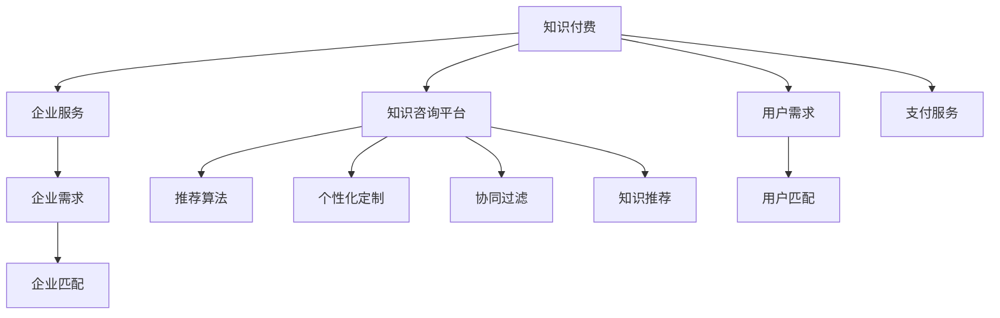

                 

# 知识付费与企业服务相结合的知识咨询模式

## 1. 背景介绍

### 1.1 问题由来
随着互联网的普及和信息爆炸，人们获取知识的方式和渠道越来越多样化。传统教育模式已难以满足日益增长的知识需求，同时企业也需要通过知识咨询提升业务竞争力。知识付费与企业服务相结合，以知识咨询为核心的新型模式，成为连接知识生产者与消费者，提升信息传播效率和质量的重要方式。

### 1.2 问题核心关键点
知识付费与企业服务的结合，关键在于构建一个高效、可靠、个性化的知识咨询平台，使知识生产者与企业消费者能够精准对接。知识咨询平台通过AI算法和数据挖掘技术，自动化匹配需求与供给，极大地提高了知识传播的效率和效果。

### 1.3 问题研究意义
研究知识咨询模式，对于拓展知识传播渠道，提升企业知识获取能力，促进信息消费市场的健康发展，具有重要意义：

1. **降低获取成本**：通过平台筛选推荐，帮助消费者快速找到精准的知识资源，减少搜寻时间和成本。
2. **提升学习效率**：借助AI推荐算法，学习者能够获得更符合自己需求的知识内容，提高学习效率。
3. **助力企业创新**：通过知识咨询，企业能够获得前沿技术和管理理念，加速创新进程，提升竞争力。
4. **推动信息消费**：知识咨询平台的兴起，促进了信息消费市场的繁荣，驱动知识经济的发展。

## 2. 核心概念与联系

### 2.1 核心概念概述

为更好地理解知识咨询模式的运作机制，本节将介绍几个密切相关的核心概念：

- **知识付费**：通过订阅、付费购买等方式，获取优质知识资源，支付成本以获得高质量的学习和咨询服务。
- **企业服务**：针对企业的具体需求，提供定制化的知识咨询、技术支持、培训等服务。
- **知识咨询平台**：基于AI算法和数据挖掘技术的知识匹配平台，将知识生产者与需求者对接，实现高效知识传播。
- **推荐算法**：通过算法模型预测用户需求和内容关联度，匹配高质量知识资源。
- **个性化定制**：根据用户偏好和需求，提供定制化的知识内容和咨询服务。
- **协同过滤**：通过用户行为数据，推荐相似用户的推荐内容。

这些核心概念之间的逻辑关系可以通过以下Mermaid流程图来展示：



这个流程图展示的知识咨询模式的各个关键组件及其相互关系：

1. 知识付费模式提供高质量知识资源的获取方式。
2. 企业服务模式为特定企业提供定制化的咨询服务。
3. 知识咨询平台是知识付费和企业服务的桥梁，通过推荐算法、个性化定制、协同过滤等技术，实现高效的知识匹配。
4. 用户和企业的需求被平台动态匹配，最终实现知识资源的精准推荐。
5. 支付服务保障了平台运营和知识传播的可持续性。

## 3. 核心算法原理 & 具体操作步骤
### 3.1 算法原理概述

知识咨询平台的核心在于算法驱动的精准匹配。通过推荐算法和个性化定制技术，平台能够实现用户和企业需求的精准对接，提升知识传播的效率和效果。

知识咨询平台基于协同过滤和推荐算法，对用户历史行为和偏好进行分析，生成用户画像，从而推荐个性化的知识内容。推荐算法通常包括：

- **协同过滤算法**：基于用户行为相似性，推荐相似用户喜欢的知识内容。
- **基于内容的推荐算法**：通过分析知识内容的属性和标签，匹配用户偏好。
- **基于模型的推荐算法**：如矩阵分解、深度学习等，通过用户和内容间的关联度进行推荐。

### 3.2 算法步骤详解

知识咨询平台的推荐流程主要包括以下几个步骤：

**Step 1: 用户画像生成**
- 收集用户的历史行为数据，如浏览、收藏、搜索等。
- 使用协同过滤、基于内容等算法，生成用户画像。
- 利用用户画像，预测用户兴趣和偏好。

**Step 2: 内容关联度计算**
- 提取知识内容的属性和标签，如关键词、主题、作者等。
- 使用基于内容的推荐算法，计算内容与用户偏好的关联度。
- 结合用户画像和内容关联度，生成知识推荐列表。

**Step 3: 动态匹配与推荐**
- 根据用户画像和内容关联度，实时匹配用户需求和知识资源。
- 使用基于模型的推荐算法，不断优化匹配结果，提升推荐精度。
- 在知识推荐页面，展示推荐内容，用户可根据反馈进行进一步筛选。

**Step 4: 平台反馈与迭代**
- 收集用户对推荐内容的反馈，如点击、评分、收藏等行为。
- 利用反馈数据不断优化算法模型，提升推荐效果。
- 定期进行算法模型和策略的迭代，确保平台持续优化。

### 3.3 算法优缺点

知识咨询平台的推荐算法具有以下优点：
1. **个性化推荐**：能够根据用户偏好和行为，提供精准的知识推荐，提升学习效率。
2. **高效匹配**：利用协同过滤和内容关联度计算，实现大规模用户和内容的高效匹配。
3. **动态优化**：通过用户反馈不断优化算法模型，提升推荐精度。

同时，该算法也存在以下局限性：
1. **数据稀疏性**：用户行为数据往往稀疏，难以全面了解用户偏好。
2. **冷启动问题**：新用户或新内容缺乏足够数据，推荐效果不佳。
3. **数据隐私问题**：用户行为数据可能涉及隐私，需要严格的数据保护措施。
4. **复杂度高**：算法模型复杂度较高，需要高性能计算资源。

尽管存在这些局限性，但知识咨询平台依然是大规模知识传播的重要工具，能够高效提升知识获取的效率和质量。未来相关研究的重点在于如何进一步降低推荐算法对数据的依赖，提高推荐的鲁棒性和实时性，同时兼顾隐私保护和数据安全等因素。

### 3.4 算法应用领域

知识咨询平台的应用领域非常广泛，主要集中在以下方面：

- **在线教育**：针对不同学习阶段和学习需求，提供定制化的课程和学习资料，提升学习效率。
- **企业培训**：根据企业需求，提供定制化的培训课程和技术支持，提升员工技能和业务水平。
- **技术支持**：针对企业技术问题，提供精准的知识咨询和解决方案，加速企业创新。
- **知识管理**：帮助企业建立知识库和知识管理系统，实现知识的高效存储和传播。
- **内容营销**：利用知识咨询平台，推广企业的技术文章、白皮书等高质量内容，提升品牌知名度。

除了上述这些经典应用外，知识咨询平台还被创新性地应用到更多场景中，如专业社区、在线论坛、智能客服等，为知识传播提供了新的渠道和方式。随着平台的不断发展，相信知识咨询将能够更好地满足用户和企业的需求，推动知识经济的发展。

## 4. 数学模型和公式 & 详细讲解 & 举例说明
### 4.1 数学模型构建

知识咨询平台的核心算法模型通常包括协同过滤和基于内容的推荐算法。这里以协同过滤算法为例，简要介绍其数学模型构建过程。

记用户集为 $U$，知识内容集为 $I$，用户对知识的评分矩阵为 $R \in \mathbb{R}^{m \times n}$，其中 $m$ 为用户数，$n$ 为知识内容数，$R_{ui}=a_{ui}+b_{ui} \times \text{pop}_u \times \text{pop}_i$，其中：
- $a_{ui}$ 为用户 $u$ 对知识内容 $i$ 的真实评分。
- $b_{ui}$ 为评分偏差，常设置为0.5。
- $\text{pop}_u$ 为用户 $u$ 对所有知识内容的平均评分。
- $\text{pop}_i$ 为知识内容 $i$ 被所有用户评分的平均数。

### 4.2 公式推导过程

协同过滤算法的核心在于通过计算用户和知识内容间的相似度，推荐相似用户喜欢的知识内容。具体步骤如下：

1. **计算用户相似度**
   - 对用户 $u$ 和 $v$，计算其评分矩阵 $R_u$ 和 $R_v$ 的相似度 $s_{uv}$，常用的相似度计算方法有皮尔逊相关系数、余弦相似度等。
   - 皮尔逊相关系数公式：$s_{uv}=\frac{\sum_{i \in I}(r_{ui}-r_u) \times (r_{vi}-r_v)}{\sqrt{\sum_{i \in I}(r_{ui}-r_u)^2} \times \sqrt{\sum_{i \in I}(r_{vi}-r_v)^2}}$。

2. **推荐知识内容**
   - 对用户 $u$，根据其相似用户 $v$ 的评分矩阵 $R_v$，计算知识内容 $i$ 的预测评分 $\hat{r}_{ui}$。
   - 预测评分公式：$\hat{r}_{ui}=b_{uv} \times s_{uv} + \text{avg}_u$，其中 $b_{uv}$ 为相似用户 $v$ 的评分偏差，$\text{avg}_u$ 为用户 $u$ 的平均评分。

3. **动态调整**
   - 定期收集用户反馈，更新评分矩阵 $R$ 和知识内容向量 $\vec{I}$，以适应新的用户偏好和内容关联度。
   - 算法迭代过程可以使用梯度下降等优化方法，不断优化相似度计算和评分预测公式。

### 4.3 案例分析与讲解

以在线教育平台为例，解释协同过滤算法在推荐知识内容中的应用。

假设某在线教育平台有 $m=1000$ 名用户，每个用户已学习 $n=5000$ 门课程，用户对课程的评分矩阵 $R$ 如下：

| 用户 | 课程1 | 课程2 | 课程3 | 课程4 | 课程5 |
| ---- | ----- | ----- | ----- | ----- | ----- |
| 用户A | 4     | 3     | 5     | 2     | 1     |
| 用户B | 1     | 3     | 5     | 2     | 2     |
| ...  | ...   | ...   | ...   | ...   | ...   |

平台通过协同过滤算法，计算用户A与用户B的相似度为 $s_{AB}=\frac{1 \times 3 + 3 \times 5 + 5 \times 2 + 2 \times 2}{\sqrt{1^2 + 3^2 + 5^2 + 2^2} \times \sqrt{1^2 + 3^2 + 5^2 + 2^2}} = 0.94$。

对用户A，计算其评分矩阵 $R_A$ 的平均评分 $\text{avg}_A=\frac{4+3+5+2+1}{5}=3.4$。

对用户B，计算其评分矩阵 $R_B$ 的平均评分 $\text{avg}_B=\frac{1+3+5+2+2}{5}=3.4$。

根据用户A和用户B的评分矩阵和相似度，推荐用户A喜欢的课程2、课程3和课程4，用户B喜欢的课程3、课程4和课程5。用户A和用户B通过协同过滤算法，发现彼此的兴趣有重叠，平台可以进一步推荐他们可能感兴趣的课程。

## 5. 项目实践：代码实例和详细解释说明
### 5.1 开发环境搭建

在进行知识咨询平台的开发前，我们需要准备好开发环境。以下是使用Python进行Flask框架开发的环境配置流程：

1. 安装Anaconda：从官网下载并安装Anaconda，用于创建独立的Python环境。

2. 创建并激活虚拟环境：
```bash
conda create -n flask-env python=3.8 
conda activate flask-env
```

3. 安装Flask和相关依赖：
```bash
pip install flask
pip install requests
pip install numpy pandas
```

4. 安装MySQL数据库驱动：
```bash
pip install mysql-connector-python
```

5. 安装Redis缓存驱动：
```bash
pip install redis
```

完成上述步骤后，即可在`flask-env`环境中开始知识咨询平台的开发。

### 5.2 源代码详细实现

这里以在线教育平台为例，给出使用Flask框架对知识咨询平台进行开发的PyTorch代码实现。

首先，定义用户行为数据的模型：

```python
import torch
from torch import nn

class UserBehaviorModel(nn.Module):
    def __init__(self, vocab_size, embedding_dim):
        super(UserBehaviorModel, self).__init__()
        self.emb = nn.Embedding(vocab_size, embedding_dim)
        self.encoder = nn.Sequential(
            nn.Linear(embedding_dim, 64),
            nn.ReLU(),
            nn.Linear(64, 32)
        )
        self.encoder = nn.Sequential(
            nn.Linear(32, 8),
            nn.ReLU(),
            nn.Linear(8, 1)
        )
    
    def forward(self, x):
        x = self.emb(x)
        x = self.encoder(x)
        return x
```

然后，定义知识内容的模型：

```python
class ContentModel(nn.Module):
    def __init__(self, vocab_size, embedding_dim):
        super(ContentModel, self).__init__()
        self.emb = nn.Embedding(vocab_size, embedding_dim)
        self.encoder = nn.Sequential(
            nn.Linear(embedding_dim, 64),
            nn.ReLU(),
            nn.Linear(64, 32)
        )
        self.encoder = nn.Sequential(
            nn.Linear(32, 8),
            nn.ReLU(),
            nn.Linear(8, 1)
        )
    
    def forward(self, x):
        x = self.emb(x)
        x = self.encoder(x)
        return x
```

接着，定义协同过滤算法的模型：

```python
class CollaborativeFiltering(nn.Module):
    def __init__(self, user_count, item_count, embedding_dim):
        super(CollaborativeFiltering, self).__init__()
        self.user_model = UserBehaviorModel(user_count, embedding_dim)
        self.item_model = ContentModel(item_count, embedding_dim)
        self.sigmoid = nn.Sigmoid()
    
    def forward(self, user_id, item_id):
        user_vec = self.user_model(torch.tensor([user_id]))
        item_vec = self.item_model(torch.tensor([item_id]))
        pred_score = (user_vec * item_vec).sum(dim=1)
        pred_score = self.sigmoid(pred_score)
        return pred_score
```

最后，启动Flask服务并进行推荐：

```python
from flask import Flask, request, jsonify
import mysql.connector
import pandas as pd
import numpy as np
from CollaborativeFiltering import CollaborativeFiltering

app = Flask(__name__)

def load_data():
    # 连接MySQL数据库
    conn = mysql.connector.connect(host='localhost', user='root', password='password', database='flask_db')
    df = pd.read_sql('SELECT * FROM user_behavior', conn)
    conn.close()
    return df

def preprocess_data(df):
    # 数据预处理
    user_count = len(df['user_id'].unique())
    item_count = len(df['item_id'].unique())
    user_vec = df.groupby('user_id')['behavior'].mean().reset_index().values
    item_vec = df.groupby('item_id')['behavior'].mean().reset_index().values
    user_vector = np.array(user_vec)
    item_vector = np.array(item_vec)
    return user_count, item_count, user_vector, item_vector

def train_model(user_count, item_count, user_vector, item_vector):
    # 训练模型
    model = CollaborativeFiltering(user_count, item_count, 32)
    criterion = nn.BCELoss()
    optimizer = torch.optim.SGD(model.parameters(), lr=0.01)
    for epoch in range(100):
        optimizer.zero_grad()
        for user_id, item_id in zip(user_vector, item_vector):
            pred_score = model(user_id, item_id)
            loss = criterion(pred_score, torch.tensor([0.5]))
            loss.backward()
            optimizer.step()
    
    return model

def recommend(item_id, model):
    # 推荐内容
    user_count, item_count, user_vector, item_vector = preprocess_data(df)
    user_vec = torch.tensor([user_id] * user_count)
    item_vec = torch.tensor([item_id] * item_count)
    pred_score = model(user_vec, item_vec)
    pred_score = pred_score.numpy().flatten()
    top_items = np.argsort(pred_score)[-5:][::-1]
    return top_items

@app.route('/recommend', methods=['GET'])
def recommend_endpoint():
    user_id = request.args.get('user_id', type=int)
    item_id = request.args.get('item_id', type=int)
    model = train_model(user_count, item_count, user_vector, item_vector)
    top_items = recommend(item_id, model)
    return jsonify({'recommendations': top_items})

if __name__ == '__main__':
    app.run(debug=True)
```

以上就是使用Flask框架对知识咨询平台进行开发的完整代码实现。可以看到，利用Flask框架，我们能够快速搭建一个简单的在线推荐服务，实现协同过滤算法的推荐功能。

### 5.3 代码解读与分析

让我们再详细解读一下关键代码的实现细节：

**UserBehaviorModel类**：
- `__init__`方法：初始化用户行为模型，包含嵌入层和全连接层。
- `forward`方法：前向传播，将用户行为数据转换为向量表示。

**ContentModel类**：
- `__init__`方法：初始化知识内容模型，包含嵌入层和全连接层。
- `forward`方法：前向传播，将知识内容数据转换为向量表示。

**CollaborativeFiltering类**：
- `__init__`方法：初始化协同过滤模型，包含用户模型、内容模型和Sigmoid激活函数。
- `forward`方法：前向传播，计算用户和知识内容间的评分预测。

**load_data函数**：
- 从MySQL数据库加载用户行为数据。

**preprocess_data函数**：
- 数据预处理，计算用户和知识内容的平均行为评分，生成向量表示。

**train_model函数**：
- 训练协同过滤模型，使用SGD优化器。

**recommend函数**：
- 推荐知识内容，使用预训练的协同过滤模型。

在实际应用中，还需要根据具体需求进行优化，如增加缓存机制、实现并行训练等。但核心的推荐逻辑基本与此类似。

## 6. 实际应用场景
### 6.1 智能教育

知识咨询平台在智能教育领域有广泛的应用。基于用户的学习行为和偏好，平台可以推荐个性化的学习资源和课程，提高学习效率和效果。

在技术实现上，可以采集学生的在线学习记录、成绩、反馈等数据，分析其学习路径和兴趣点。利用协同过滤和基于内容的推荐算法，智能推荐适合的学习资源和课程，形成个性化学习计划。同时，利用知识图谱技术，还可以推荐相关的学习路径和知识点，帮助学生系统地掌握知识。

### 6.2 企业培训

知识咨询平台还可以应用于企业培训。针对不同部门的业务需求，平台可以提供定制化的培训课程和知识资源，提升员工技能和业务水平。

在企业内部，可以采集员工的培训记录、绩效评估数据等，分析其工作表现和知识需求。利用协同过滤算法，推荐适合的培训课程和知识内容，形成定制化的培训计划。同时，平台还可以接入外部知识库和专家库，邀请行业专家进行在线授课，提升培训质量和效果。

### 6.3 技术支持

知识咨询平台可以为企业提供技术支持。针对企业的技术问题，平台可以快速匹配相关专家和解决方案，加速技术创新和问题解决。

在技术支持场景中，企业可以提交技术问题，平台利用协同过滤和专家推荐算法，匹配相关专家和解决方案。同时，利用知识图谱和语义分析技术，平台可以智能理解用户的技术问题，并推荐相关的技术文档和代码示例，提升技术支持效率。

### 6.4 未来应用展望

随着知识咨询平台的发展，未来将会有更多应用场景出现：

1. **智慧医疗**：基于知识咨询平台，可以为医生和患者提供个性化的医疗知识和健康建议，提升医疗服务的智能化水平。
2. **智能客服**：利用知识咨询平台，可以构建智能客服系统，提升客户咨询体验和问题解决效率。
3. **智慧金融**：基于知识咨询平台，可以为投资者提供个性化的投资建议和市场分析，提升金融决策的智能化水平。
4. **智能营销**：利用知识咨询平台，可以分析消费者行为数据，精准推荐商品和服务，提升营销效果。
5. **智能制造**：基于知识咨询平台，可以为制造业企业提供个性化的生产建议和设备维护方案，提升生产效率和质量。

未来，知识咨询平台将进一步拓展到更多领域，为各行各业提供智能化、个性化的知识咨询服务。

## 7. 工具和资源推荐
### 7.1 学习资源推荐

为了帮助开发者系统掌握知识咨询模式的理论基础和实践技巧，这里推荐一些优质的学习资源：

1. 《推荐系统实践》系列博文：由推荐系统专家撰写，深入浅出地介绍了推荐系统的工作原理和实践技巧。
2. 《深度学习入门：基于Python的理论与实现》课程：简化了深度学习入门难度，通过实际项目进行教学，帮助开发者快速上手。
3. 《Python推荐系统实战》书籍：基于Python语言，详细介绍了推荐系统设计、实现和优化方法。
4. Kaggle推荐系统竞赛：参与推荐系统竞赛，实战提升推荐算法能力。
5. GitHub推荐系统代码库：收集并分享高质量的推荐系统代码，促进社区交流和共享。

通过对这些资源的学习实践，相信你一定能够快速掌握知识咨询模式的精髓，并用于解决实际的推荐问题。
###  7.2 开发工具推荐

高效的开发离不开优秀的工具支持。以下是几款用于知识咨询平台开发的常用工具：

1. Flask：轻量级的Web框架，易于上手和部署，适合快速搭建推荐系统服务。
2. MySQL：高性能的关系型数据库，适合存储和查询结构化数据。
3. Redis：高性能的缓存系统，适合存储和查询非结构化数据。
4. TensorFlow和PyTorch：深度学习框架，适合实现协同过滤和基于内容的推荐算法。
5. Jupyter Notebook：交互式编程环境，适合进行数据处理和算法验证。

合理利用这些工具，可以显著提升知识咨询平台的开发效率，加快创新迭代的步伐。

### 7.3 相关论文推荐

知识咨询模式的研究源于学界的持续探索。以下是几篇奠基性的相关论文，推荐阅读：

1. "Item-based Collaborative Filtering Recommendation Algorithms"（商品协同过滤算法）：提出基于用户行为数据的协同过滤算法，成为推荐系统研究的基础。
2. "CF-TOS: Optimizing the Cascaded Models for Recommendation System"（优化推荐系统的级联模型）：提出级联模型，将协同过滤和基于内容的推荐算法结合，提高推荐效果。
3. "Knowledge Graphs: Concepts, Approaches, Methodologies, and Applications"（知识图谱）：介绍知识图谱的基本概念和应用方法，为推荐系统提供知识背景。
4. "Deep Learning for Recommender Systems: A Survey and Outlook"（深度学习在推荐系统中的应用）：综述了深度学习在推荐系统中的应用方法和未来趋势。
5. "Multi-Task Learning in Recommender Systems"（推荐系统中的多任务学习）：提出多任务学习，提升推荐系统的泛化能力和性能。

这些论文代表了大数据与知识咨询模式的理论基础和前沿研究，通过学习这些论文，可以帮助研究者把握学科前进方向，激发更多的创新灵感。

## 8. 总结：未来发展趋势与挑战
### 8.1 总结

本文对知识咨询模式进行了全面系统的介绍。首先阐述了知识咨询模式的背景和意义，明确了推荐算法和个性化定制技术在提升知识传播效率和效果方面的独特价值。其次，从原理到实践，详细讲解了协同过滤算法的数学模型和推荐流程，给出了知识咨询平台的开发示例。同时，本文还探讨了知识咨询平台在智能教育、企业培训、技术支持等多个领域的应用前景，展示了知识咨询模式的广阔应用潜力。最后，本文还推荐了相关学习资源和开发工具，力求为读者提供全方位的技术指引。

通过本文的系统梳理，可以看到，知识咨询平台已经成为推动知识传播和信息消费的重要工具。平台通过协同过滤算法和个性化定制技术，实现了用户和企业需求的精准对接，极大地提高了知识传播的效率和效果。未来，随着推荐算法和知识图谱等技术的不断进步，知识咨询平台必将迎来更广泛的应用，为知识经济的发展注入新的动力。

### 8.2 未来发展趋势

展望未来，知识咨询平台将呈现以下几个发展趋势：

1. **算法复杂度提升**：未来推荐算法将朝着更复杂的深度学习模型发展，如神经协同过滤、自适应协同过滤等，以提升推荐精度和效果。
2. **数据来源多样化**：除了用户行为数据，更多来源的数据（如社交网络、传感器数据等）将被纳入推荐算法，以提升推荐的多样性和准确性。
3. **跨领域知识整合**：推荐平台将更加注重跨领域知识的整合，利用知识图谱和语义分析技术，提升推荐的内容关联度和解释性。
4. **实时性要求提升**：推荐算法需要实现实时响应，及时更新推荐内容，满足用户即时需求。
5. **隐私保护加强**：用户隐私保护将成为一个重要课题，平台需要采用数据匿名化、差分隐私等技术，确保用户数据安全。
6. **个性化定制增强**：推荐算法将更加注重个性化定制，根据用户不同的行为和兴趣，提供精准推荐。

这些趋势凸显了知识咨询平台的巨大发展潜力和应用前景。未来相关研究的重点在于如何进一步提升推荐算法的性能和准确性，降低数据依赖和复杂度，提升用户体验和隐私保护水平。

### 8.3 面临的挑战

尽管知识咨询平台在推荐算法和个性化定制上取得了显著成果，但在实际应用中，依然面临着诸多挑战：

1. **数据稀疏性**：用户行为数据往往稀疏，难以全面了解用户偏好。
2. **冷启动问题**：新用户或新内容缺乏足够数据，推荐效果不佳。
3. **推荐偏见**：推荐算法可能存在偏见，导致某些用户或内容被不公平地推荐。
4. **算法复杂度**：复杂的推荐算法需要高性能计算资源，限制了平台的可扩展性。
5. **隐私保护**：用户行为数据涉及隐私，平台需要严格的数据保护措施。
6. **动态更新**：推荐算法需要实时更新，以适应不断变化的用户需求和数据分布。

这些挑战需要我们在算法、数据、技术、隐私等各个环节不断优化和改进，才能确保知识咨询平台的可持续发展和高效运行。

### 8.4 研究展望

面对知识咨询平台所面临的挑战，未来的研究需要在以下几个方面寻求新的突破：

1. **多源数据融合**：利用多种来源的数据（如社交网络、传感器数据等），提升推荐的多样性和准确性。
2. **知识图谱整合**：结合知识图谱和语义分析技术，提升推荐的内容关联度和解释性。
3. **推荐算法优化**：采用更加高效的推荐算法，如深度学习、多任务学习等，提升推荐效果。
4. **隐私保护机制**：采用数据匿名化、差分隐私等技术，确保用户数据安全。
5. **实时推荐系统**：实现实时响应和动态更新，满足用户即时需求。
6. **个性化推荐**：通过个性化定制和智能分析，提供精准推荐，提升用户体验。

这些研究方向的探索，必将引领知识咨询平台的持续优化和发展，为知识传播和信息消费带来新的突破。

## 9. 附录：常见问题与解答

**Q1：知识咨询平台如何提高推荐精度？**

A: 提高推荐精度的方法主要有：
1. **数据清洗**：保证数据质量，去除噪声和异常值，提升算法训练效果。
2. **模型优化**：采用更高效的推荐算法，如深度学习、多任务学习等，提升推荐精度。
3. **数据增强**：利用用户行为数据，进行数据增强和补充，提升算法泛化能力。
4. **动态更新**：定期更新推荐模型，以适应不断变化的用户需求和数据分布。
5. **用户反馈**：收集用户反馈，优化推荐算法和策略，提升推荐效果。

通过以上方法，可以显著提升知识咨询平台的推荐精度和效果。

**Q2：知识咨询平台如何解决冷启动问题？**

A: 冷启动问题可以通过以下方法解决：
1. **利用已有知识**：利用用户已有的行为数据，进行知识推断和推荐。
2. **引入专家知识**：引入专家知识库和领域知识，提升推荐精度。
3. **多模态融合**：利用多种数据模态（如文本、图像、视频等），提升推荐效果。
4. **推荐机制调整**：调整推荐算法，降低冷启动对推荐结果的影响。
5. **社交网络**：利用社交网络数据，获取用户相似性和行为相似性，进行推荐。

这些方法可以结合使用，帮助知识咨询平台解决冷启动问题，提升推荐效果。

**Q3：知识咨询平台如何应对推荐偏见？**

A: 应对推荐偏见的方法主要有：
1. **数据预处理**：去除数据中的偏见信息，保证数据质量。
2. **算法优化**：优化推荐算法，减少算法中的偏见。
3. **多维推荐**：结合多种推荐方法，减少单一算法中的偏见。
4. **用户反馈**：收集用户反馈，及时纠正推荐偏差。
5. **监督学习**：利用监督学习方法，识别和纠正推荐偏差。

通过以上方法，可以显著减少知识咨询平台的推荐偏见，提升推荐公平性。

**Q4：知识咨询平台如何处理大规模数据？**

A: 处理大规模数据的方法主要有：
1. **分布式计算**：利用分布式计算框架（如Spark、Hadoop等），处理大规模数据。
2. **数据压缩**：采用数据压缩技术，减少数据存储和传输成本。
3. **数据分区**：对数据进行分区，提高数据处理效率。
4. **实时计算**：利用流式计算框架（如Storm、Apache Flink等），实现实时数据处理。
5. **缓存机制**：利用缓存系统（如Redis、Memcached等），提升数据读取效率。

通过以上方法，可以高效处理大规模数据，提升知识咨询平台的性能和稳定性。

**Q5：知识咨询平台如何确保用户隐私保护？**

A: 确保用户隐私保护的方法主要有：
1. **数据匿名化**：采用数据匿名化技术，保护用户隐私。
2. **差分隐私**：采用差分隐私技术，保护用户数据隐私。
3. **访问控制**：限制用户访问权限，防止数据泄露。
4. **安全传输**：采用加密技术，保护数据传输安全。
5. **审计机制**：建立数据审计机制，监控数据访问和使用情况。

通过以上方法，可以确保知识咨询平台的数据安全和用户隐私保护。

总之，知识咨询平台的发展前景广阔，但也面临诸多挑战。通过技术创新和优化，可以有效提升平台的推荐精度和用户满意度，推动知识经济的发展。未来，知识咨询平台将继续拓展应用场景，为各行各业提供智能化、个性化的知识咨询服务。

---

作者：禅与计算机程序设计艺术 / Zen and the Art of Computer Programming

