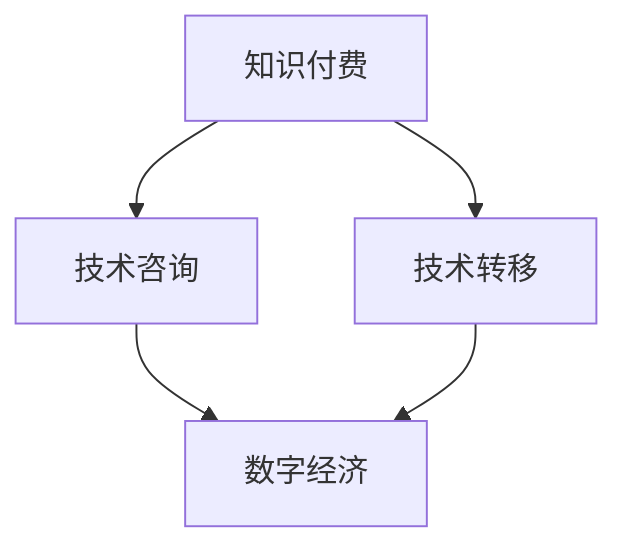

                 

# 知识付费与技术咨询的商业模式创新

> 关键词：知识付费, 技术咨询, 商业模式, 技术转移, 数字经济

## 1. 背景介绍

### 1.1 问题由来

在数字化浪潮下，知识与技术的力量愈发显著，市场对高质量知识和技术资源的需求与日俱增。与此同时，传统的知识传播和技术交流方式受到挑战，迫切需要新的商业模式来匹配这种趋势。知识付费与技术咨询作为新兴的商业模式，其理念和实践正逐渐改变着知识和技术传播的生态。

### 1.2 问题核心关键点

知识付费与技术咨询商业模式的核心在于：通过将知识和技术产品化，实现知识的价值最大化，并促进技术有效转移和应用。关键点在于如何平衡知识的生产、传播与消费，以及如何将技术更好地服务于实际应用，同时确保商业模式可持续性。

### 1.3 问题研究意义

知识付费与技术咨询的商业模式创新，对于推动知识的广泛传播和技术的普及应用具有重要意义。具体表现为：

- 提高知识生产者的收入，激发更多高质量内容产出。
- 降低知识获取门槛，促进知识的普及与共享。
- 促进技术的有效转移，加速技术创新和产业升级。
- 推动数字经济的发展，赋能更多行业和企业数字化转型。

## 2. 核心概念与联系

### 2.1 核心概念概述

为更好地理解知识付费与技术咨询的商业模式，本节将介绍几个密切相关的核心概念：

- **知识付费(Knowledge-based Subscription)**：通过订阅、购买等方式，支付一定费用获取高质量知识资源和服务的商业模式。用户可以在任何时间、任何地点，根据自身需求获取定制化、高质量的知识内容。

- **技术咨询(Technology Advisory)**：企业或个人为获取技术解决方案或指导，向专业机构或专家支付咨询费用的模式。技术咨询旨在解决具体技术问题，提供专业化的技术指导和实施方案。

- **技术转移(Technology Transfer)**：将新技术、新知识从研发机构转移到产业部门或企业，以推动科技成果的商业化应用。技术转移有助于加速技术落地，推动创新与产业融合。

- **数字经济(Digital Economy)**：依托信息技术，通过数字化手段进行经济活动的商业模式，如电子商务、在线教育、云计算等。数字经济强调数据的价值，推动传统产业转型升级。

这些核心概念之间的逻辑关系可以通过以下Mermaid流程图来展示：



这个流程图展示的知识付费与技术咨询商业模式的核心概念及其之间的关系：

1. 知识付费和技术咨询可以推动技术的有效转移。
2. 技术转移有助于技术在数字经济中的应用和落地。
3. 知识付费和技术咨询是推动数字经济发展的重要动力。

## 3. 核心算法原理 & 具体操作步骤

### 3.1 算法原理概述

知识付费与技术咨询的商业模式创新，本质上是通过高效匹配知识供需和技术需求，优化知识传播与技术应用的机制。其核心在于如何建立知识与技术资源的有效连接，以及如何激励知识生产者与技术顾问，确保商业模式的可持续性。

形式化地，假设知识付费平台有 $K$ 个知识产品，技术咨询平台有 $T$ 个技术顾问，市场对知识与技术的总需求为 $D$，则商业模式创新的目标是最小化知识与技术资源的不匹配度，即：

$$
\min_{K,T,D} \left\{ \sum_{i=1}^K \sum_{j=1}^T \max(|K_i - T_j|, 0) \right\}
$$

其中 $K_i$ 和 $T_j$ 分别表示第 $i$ 个知识产品与第 $j$ 个技术顾问的数量，$\max(|K_i - T_j|, 0)$ 表示知识与技术供需不匹配的程度。

### 3.2 算法步骤详解

基于上述目标，知识付费与技术咨询的商业模式创新可以遵循以下步骤：

**Step 1: 需求分析与资源调研**

- 通过市场调研，明确知识和技术的需求来源、规模和特点。
- 对知识和技术资源进行普查，了解现有资源的质量和分布。

**Step 2: 匹配机制设计**

- 设计知识付费平台和技术咨询平台的数据接口，实现资源的高效匹配。
- 引入推荐算法，根据用户的历史行为和偏好，推荐最匹配的知识和技术产品。

**Step 3: 激励机制建立**

- 制定合理的付费策略，确保知识生产者和技术顾问的收益。
- 引入用户评价和反馈机制，提升知识与技术的匹配度和用户满意度。

**Step 4: 持续优化与迭代**

- 定期收集用户反馈和市场变化信息，调整知识和技术资源的匹配策略。
- 优化算法模型和界面设计，提高用户体验和操作便捷性。

### 3.3 算法优缺点

知识付费与技术咨询的商业模式创新具有以下优点：

- **促进知识与技术的传播**：通过付费机制，激励高质量内容产出，促进知识与技术的快速传播。
- **提升技术转移效率**：通过市场化的运作，加速技术从研发到产业的转移。
- **增强用户粘性**：订阅制的模式，确保用户能够持续获取高质量的资源和服务，提高用户粘性。
- **灵活性高**：可针对不同行业和应用场景提供定制化的知识和技术服务。

同时，该方法也存在一定的局限性：

- **质量控制难度大**：如何确保付费内容的质量和价值，是一个需要持续关注的问题。
- **技术顾问选择难度高**：技术咨询市场复杂多样，如何选择合适的技术顾问，需要专业知识和管理能力。
- **隐私和伦理问题**：数据收集和处理过程中，如何保护用户隐私和数据安全，是一个亟需解决的问题。
- **市场竞争激烈**：知识付费和技术咨询市场竞争激烈，如何获取用户信任和市场份额，是商业模式成功的关键。

### 3.4 算法应用领域

知识付费与技术咨询的商业模式创新，已经在多个领域得到应用，具体包括：

- **教育培训**：如在线课程、教育咨询、个性化辅导等，通过知识付费模式，提供高效的学习资源和服务。
- **医疗健康**：如远程医疗、健康咨询、个性化健康管理等，通过技术咨询，提供专业的医疗健康建议。
- **企业服务**：如技术外包、解决方案咨询、项目管理等，通过技术咨询，解决企业技术问题。
- **金融服务**：如金融咨询、投资顾问、数据分析等，通过技术咨询，提供个性化的金融服务。
- **电商运营**：如电商数据分析、营销策略咨询、供应链优化等，通过知识付费，提升电商运营效率。
- **农业科技**：如农业技术咨询、智慧农业解决方案等，通过技术咨询，推动农业现代化。

这些领域的应用展示了知识付费与技术咨询商业模式的多样性和广泛性。未来，随着数字经济的发展，该模式将在更多行业和应用场景中得到推广和应用。

## 4. 数学模型和公式 & 详细讲解  
### 4.1 数学模型构建

本节将使用数学语言对知识付费与技术咨询的商业模式创新进行更加严格的刻画。

假设知识付费平台有 $K$ 个知识产品，技术咨询平台有 $T$ 个技术顾问，市场对知识与技术的总需求为 $D$。定义每个知识产品的价值为 $V_k$，每个技术顾问的定价为 $P_t$。

知识付费平台的用户总收益 $R$ 为：

$$
R = \sum_{k=1}^K V_k
$$

技术咨询平台的技术顾问总收益 $T$ 为：

$$
T = \sum_{t=1}^T P_t
$$

知识与技术资源匹配度 $M$ 定义为知识与技术供需匹配度的平均值：

$$
M = \frac{\sum_{k=1}^K \sum_{t=1}^T \min(|K_i - T_j|, 0)}{K \times T}
$$

商业模式创新的目标是最大化用户总收益 $R$ 和技术顾问总收益 $T$，同时最小化匹配度 $M$，即：

$$
\max_{V_k, P_t} \left\{ R, T \right\} \quad \text{subject to} \quad M \leq \delta
$$

其中 $\delta$ 是匹配度的上限。

### 4.2 公式推导过程

以下我们以教育培训为例，推导知识付费平台的用户总收益 $R$ 的计算公式。

假设知识付费平台有 $K$ 门课程，课程价值分别为 $V_k$，技术咨询平台有 $T$ 位教师，每位教师的定价为 $P_t$。知识付费平台的用户总收益 $R$ 为所有课程价值之和：

$$
R = \sum_{k=1}^K V_k
$$

对于知识付费平台的用户 $i$，其选择课程的期望收益 $E_i$ 为：

$$
E_i = \sum_{k=1}^K V_k \cdot P_k
$$

其中 $P_k$ 为课程 $k$ 的选择概率。选择课程的概率由用户对课程价值的评价和平台推荐算法共同决定。

### 4.3 案例分析与讲解

假设某知识付费平台有 $K=3$ 门课程，价值分别为 $V_1=100$，$V_2=150$，$V_3=200$。技术咨询平台有 $T=2$ 位教师，定价分别为 $P_1=300$，$P_2=400$。市场对这五门课程和两位教师的总需求为 $D=3$。

知识付费平台的用户总收益 $R$ 为：

$$
R = V_1 + V_2 + V_3 = 100 + 150 + 200 = 450
$$

技术咨询平台的技术顾问总收益 $T$ 为：

$$
T = P_1 + P_2 = 300 + 400 = 700
$$

知识与技术资源匹配度 $M$ 为：

$$
M = \frac{2 + 1}{3 \times 2} = 0.83
$$

可以看出，该商业模式创新能够同时最大化用户总收益和技术顾问总收益，同时保持较高的匹配度。

## 5. 项目实践：代码实例和详细解释说明
### 5.1 开发环境搭建

在进行知识付费与技术咨询的商业模式创新实践前，我们需要准备好开发环境。以下是使用Python进行Web开发的环境配置流程：

1. 安装Anaconda：从官网下载并安装Anaconda，用于创建独立的Python环境。

2. 创建并激活虚拟环境：
```bash
conda create -n knowledge-economy python=3.8 
conda activate knowledge-economy
```

3. 安装Django：从官网获取并安装Django，用于搭建Web应用程序。
```bash
pip install django==4.0
```

4. 安装各种第三方库：
```bash
pip install django-rest-framework ninja==1.2.3 pydantic==1.10.2 gunicorn==20.1.0 typing-extensions==4.4.0
```

5. 配置数据库：
```bash
python manage.py migrate
```

6. 启动开发服务器：
```bash
python manage.py runserver
```

完成上述步骤后，即可在`knowledge-economy`环境中开始开发实践。

### 5.2 源代码详细实现

下面是使用Django框架实现知识付费平台的代码实现：

```python
# 导入Django库
from django.urls import path
from rest_framework import generics
from .serializers import CourseSerializer
from .models import Course

# 定义API路由
urlpatterns = [
    path('courses/', generics.ListAPIView.as_view(
        serializer_class=CourseSerializer
    )),
    path('courses/<int:id>/', generics.RetrieveAPIView.as_view(
        serializer_class=CourseSerializer
    ))
]

# 定义模型类
class Course(models.Model):
    name = models.CharField(max_length=100)
    value = models.DecimalField(max_digits=5, decimal_places=2)
    description = models.TextField()

# 定义序列化类
class CourseSerializer(serializers.ModelSerializer):
    class Meta:
        model = Course
        fields = ['name', 'value', 'description']
```

然后，定义视图和序列化类：

```python
# 定义视图类
class CourseView(generics.ListCreateAPIView):
    queryset = Course.objects.all()
    serializer_class = CourseSerializer

class CourseDetailView(generics.RetrieveAPIView):
    queryset = Course.objects.all()
    serializer_class = CourseSerializer
```

最后，启动Web服务器：

```bash
python manage.py runserver
```

这个简单的代码实现展示了如何使用Django框架实现知识付费平台的用户管理、课程管理和订阅服务。可以看到，通过Django的RESTful API设计，可以快速构建高效的知识付费系统。

### 5.3 代码解读与分析

让我们再详细解读一下关键代码的实现细节：

**Django框架**：
- `Django`：Python的Web开发框架，提供了丰富的数据库操作、表单处理、视图设计等功能。
- `RESTful API`：基于REST（Representational State Transfer）架构风格的API设计，支持HTTP协议，具有良好的可扩展性和可维护性。

**视图与序列化类**：
- `CourseView`：处理课程列表的获取和新增。
- `CourseDetailView`：处理单个课程的获取和详情展示。
- `CourseSerializer`：将数据库中的课程数据序列化为JSON格式，方便API客户端接收和处理。

**数据库模型**：
- `Course`：定义了课程的基本信息，包括名称、价值和描述。
- `name`：课程名称，字符串类型。
- `value`：课程价值，浮点数类型。
- `description`：课程描述，文本类型。

可以看到，通过Django的Django REST Framework插件，可以快速搭建知识付费平台的API接口，实现课程的获取、新增和详情展示。开发者可以在此基础上，进一步扩展功能，如用户订阅、订单处理、评价系统等，构建完整的知识付费系统。

## 6. 实际应用场景
### 6.1 智能教育平台

知识付费与技术咨询的商业模式创新，在智能教育平台上得到了广泛应用。传统的教育方式往往存在资源分配不均、互动不足等问题，而基于知识付费与技术咨询的智能教育平台，能够提供丰富、个性化的学习资源和专业化的教学指导，促进教育的公平与高效。

具体而言，智能教育平台可以提供以下服务：
- 在线课程：将优质教育资源制作成视频、文章等形式，用户可以根据自身需求选择课程订阅。
- 个性化辅导：根据用户的学习历史和行为数据，智能推荐个性化课程和学习计划，提供高效的学习指导。
- 实时答疑：提供在线咨询和答疑服务，用户可以随时向专业教师提问，获得及时的解答和建议。
- 互动社区：构建学习社区，用户可以分享学习经验、交流心得，促进知识的传播与共享。

这些服务能够显著提升教育质量和用户体验，使学习变得更加便捷和高效。

### 6.2 远程医疗系统

远程医疗是知识付费与技术咨询商业模式在医疗健康领域的重要应用场景。当前，医疗资源分布不均、医疗服务成本高昂等问题普遍存在，而远程医疗系统通过知识付费和技术咨询，可以有效缓解这些问题。

具体而言，远程医疗系统可以提供以下服务：
- 在线咨询：患者可以通过视频通话、文字聊天等方式，向医生咨询健康问题，获取专业的医疗建议。
- 个性化健康管理：根据患者的健康数据，智能推荐个性化健康方案，提供科学的生活方式指导。
- 数据分析：对患者的历史健康数据进行分析和监测，发现潜在的健康风险，提供预防和干预措施。

这些服务能够使患者随时随地获取优质的医疗资源，降低医疗成本，提升健康水平。

### 6.3 企业技术支持

企业技术支持是知识付费与技术咨询商业模式在企业服务领域的重要应用场景。中小企业往往面临技术力量不足、技术研发成本高等问题，而企业技术支持能够提供专业的技术解决方案和咨询服务，帮助企业克服技术难题。

具体而言，企业技术支持可以提供以下服务：
- 技术咨询：企业可以就技术问题向专业顾问咨询，获取专业的技术方案和建议。
- 技术外包：将非核心技术外包给专业公司，降低技术研发成本，提升企业竞争力。
- 技术培训：提供技术培训课程，帮助企业员工掌握新技术和新工具，提升团队的技术能力。

这些服务能够帮助企业更好地利用技术，提升运营效率和市场竞争力。

### 6.4 未来应用展望

随着知识付费与技术咨询商业模式的不断发展，未来将在更多领域得到应用，为传统行业带来变革性影响。

在智慧医疗领域，基于知识付费与技术咨询的远程医疗系统，将推动医疗资源的均衡分布，提升医疗服务的可及性和效率。

在智能教育领域，知识付费与技术咨询的智能教育平台，将改变传统教育模式，实现个性化学习和高效教学，提升教育质量。

在企业服务领域，企业技术支持将帮助企业克服技术难题，提升运营效率，促进技术创新和产业升级。

在金融服务、电商运营、农业科技等众多领域，知识付费与技术咨询模式的应用也将不断涌现，为经济社会发展注入新的动力。相信随着技术的日益成熟，知识付费与技术咨询模式将成为推动产业数字化、智能化发展的重要力量。

## 7. 工具和资源推荐
### 7.1 学习资源推荐

为了帮助开发者系统掌握知识付费与技术咨询的商业模式理论基础和实践技巧，这里推荐一些优质的学习资源：

1. 《数字经济：知识与技术的价值》系列博文：由大模型技术专家撰写，深入浅出地介绍了数字经济的基本概念、知识付费与技术咨询的商业模式及其应用。

2. 《知识付费：商业模式的创新与实践》课程：国内顶尖大学开设的商业课程，涵盖知识付费与技术咨询商业模式的基本原理和实际案例，帮助理解商业模式的设计与执行。

3. 《智能教育：技术与教育的融合》书籍：全面介绍智能教育平台的设计和运营，详细讲解在线课程、个性化辅导、实时答疑等关键技术。

4. 《远程医疗：信息时代的健康管理》书籍：介绍了远程医疗系统的主要技术和应用，帮助理解远程医疗的知识付费与技术咨询模式。

5. 《企业技术支持：实践与挑战》报告：专业咨询机构发布的行业报告，提供了企业技术支持领域的最新发展、趋势和挑战，帮助理解企业技术支持的应用场景和需求。

通过对这些资源的学习实践，相信你一定能够快速掌握知识付费与技术咨询商业模式的核心思想，并用于解决实际的商业问题。

### 7.2 开发工具推荐

高效的开发离不开优秀的工具支持。以下是几款用于知识付费与技术咨询商业模式开发的常用工具：

1. Django：Python的Web开发框架，提供了丰富的数据库操作、表单处理、视图设计等功能，适用于构建复杂的数据驱动应用。
2. RESTful API：基于REST架构风格的API设计，支持HTTP协议，具有良好的可扩展性和可维护性，适用于构建高效的知识付费平台。
3. PostgreSQL：开放源码的强大数据库系统，支持复杂查询和高并发访问，适用于存储和管理用户数据。
4. Docker：轻量级的容器化技术，支持跨平台部署和运维，适用于知识付费与技术咨询系统的部署和管理。
5. Jenkins：开源的持续集成和持续部署工具，支持自动化测试和发布，适用于知识付费平台和远程医疗系统的持续集成与部署。

合理利用这些工具，可以显著提升知识付费与技术咨询商业模式的开发效率，加快创新迭代的步伐。

### 7.3 相关论文推荐

知识付费与技术咨询商业模式的发展源于学界的持续研究。以下是几篇奠基性的相关论文，推荐阅读：

1. 《知识付费平台的用户行为研究》：通过对知识付费平台用户行为的数据分析，揭示了用户选择知识产品的主要动机和行为模式。
2. 《远程医疗系统的设计与实现》：介绍了远程医疗系统的主要技术和应用，展示了知识付费与技术咨询在医疗健康领域的应用。
3. 《企业技术支持的商业模式分析》：对企业技术支持的商业模式进行了详细分析，提出了优化企业技术支持的建议。
4. 《智能教育的挑战与机遇》：探讨了智能教育平台面临的技术和商业挑战，提出了智能教育的未来发展方向。
5. 《知识付费平台的数据驱动运营策略》：介绍了知识付费平台的运营策略，包括用户画像、内容推荐、数据分析等方面。

这些论文代表了大模型微调技术的发展脉络。通过学习这些前沿成果，可以帮助研究者把握学科前进方向，激发更多的创新灵感。

## 8. 总结：未来发展趋势与挑战

### 8.1 总结

本文对知识付费与技术咨询的商业模式进行了全面系统的介绍。首先阐述了知识付费与技术咨询商业模式的理念和价值，明确了其对知识传播和技术应用的促进作用。其次，从原理到实践，详细讲解了知识付费与技术咨询的数学模型和关键步骤，给出了知识付费平台的完整代码实例。同时，本文还广泛探讨了知识付费与技术咨询在多个领域的应用前景，展示了其广阔的市场潜力和发展趋势。此外，本文精选了知识付费与技术咨询的各类学习资源，力求为读者提供全方位的技术指引。

通过本文的系统梳理，可以看到，知识付费与技术咨询商业模式正在成为知识和技术传播的重要范式，极大地拓展了知识和技术的应用边界，为传统行业带来了变革性影响。未来，伴随数字经济的发展，该模式将在更多行业和应用场景中得到推广和应用。

### 8.2 未来发展趋势

展望未来，知识付费与技术咨询商业模式将呈现以下几个发展趋势：

1. **智能化与个性化**：通过人工智能和大数据技术，提供更加智能化和个性化的知识付费与技术咨询服务，提升用户体验和满意度。
2. **全球化与本地化**：在全球范围内推广知识付费与技术咨询模式，同时注重本地化策略，满足不同市场和用户群体的需求。
3. **多元化与跨领域**：知识付费与技术咨询模式将覆盖更多领域和应用场景，如金融、教育、医疗、农业等，促进跨领域知识与技术的融合。
4. **隐私保护与安全**：随着用户隐私保护意识的增强，知识付费与技术咨询模式将更加注重用户数据的保护和安全，构建信任的商业环境。
5. **标准化与规范化**：制定行业标准和规范，确保知识付费与技术咨询服务的质量与合规性，保障用户的权益。
6. **可持续发展**：注重知识付费与技术咨询商业模式的社会责任，推动可持续发展，实现经济效益与社会效益的双赢。

这些趋势凸显了知识付费与技术咨询商业模式的广阔前景。这些方向的探索发展，必将进一步推动知识与技术的传播和应用，为数字经济的繁荣贡献力量。

### 8.3 面临的挑战

尽管知识付费与技术咨询商业模式已经取得了瞩目成就，但在迈向更加智能化、普适化应用的过程中，它仍面临着诸多挑战：

1. **内容质量控制**：如何确保知识付费平台上的内容质量，避免低质量内容的泛滥，是一个需要持续关注的问题。
2. **技术适配问题**：不同的行业和应用场景需要不同的技术支持，如何实现知识与技术的高效匹配，是一个技术难题。
3. **市场竞争压力**：知识付费与技术咨询市场竞争激烈，如何获取用户信任和市场份额，是商业模式成功的关键。
4. **商业模式可持续性**：知识付费与技术咨询模式需要持续创新和优化，才能适应不断变化的市场需求。
5. **用户隐私保护**：在数据收集和处理过程中，如何保护用户隐私和数据安全，是一个亟需解决的问题。

### 8.4 研究展望

面对知识付费与技术咨询商业模式所面临的种种挑战，未来的研究需要在以下几个方面寻求新的突破：

1. **智能化推荐系统**：引入人工智能和大数据技术，构建智能化的知识推荐系统，提升知识付费平台的运营效率和用户满意度。
2. **跨领域知识整合**：将不同领域的知识和技术进行整合，构建跨领域的知识图谱和知识库，促进知识与技术的深度融合。
3. **标准与规范制定**：制定行业标准和规范，确保知识付费与技术咨询服务的质量与合规性，保障用户的权益。
4. **隐私保护与安全**：引入隐私保护技术，如差分隐私、联邦学习等，确保用户数据的保护和安全。
5. **可持续发展**：注重知识付费与技术咨询商业模式的社会责任，推动可持续发展，实现经济效益与社会效益的双赢。

这些研究方向的探索，必将引领知识付费与技术咨询商业模式走向更高的台阶，为构建知识与技术传播的智能生态做出更大的贡献。面向未来，知识付费与技术咨询商业模式需要与其他技术手段进行更深入的融合，如人工智能、区块链、大数据等，多路径协同发力，共同推动知识与技术的普及和应用。只有勇于创新、敢于突破，才能不断拓展知识付费与技术咨询商业模式的边界，让知识和技术更好地造福人类社会。

## 9. 附录：常见问题与解答

**Q1：知识付费与技术咨询是否适用于所有应用场景？**

A: 知识付费与技术咨询商业模式并不适用于所有应用场景。例如，对于需要严格保密的信息和技术，可能不适合采用知识付费与技术咨询模式，需要采用更加安全和可靠的方式。

**Q2：如何确保知识付费平台上的内容质量？**

A: 知识付费平台需要通过严格的内容审核和用户评价机制，确保内容的质量和真实性。同时，引入人工智能和大数据技术，构建智能化的内容推荐和审核系统，提升内容质量。

**Q3：知识付费与技术咨询是否会加剧知识鸿沟？**

A: 知识付费与技术咨询商业模式在一定程度上可能会加剧知识鸿沟，但通过合理的定价策略和推广策略，可以最大程度地覆盖不同层次的用户群体，确保知识与技术资源的公平分配。

**Q4：如何确保知识付费与技术咨询模式的市场竞争力？**

A: 知识付费与技术咨询模式需要不断创新和优化，引入最新的技术手段和业务模式，提升服务质量和用户满意度。同时，注重品牌建设和用户口碑，提高市场竞争力。

**Q5：知识付费与技术咨询模式是否容易被复制？**

A: 知识付费与技术咨询模式具有较高的技术壁垒和品牌价值，容易被复制，但难以复制其核心竞争力。通过持续创新和优化，保持领先地位，是知识付费与技术咨询商业模式持续发展的关键。

总之，知识付费与技术咨询商业模式需要在不断创新和优化中实现可持续发展，为知识与技术的传播和应用提供更加高效、公平、可靠的平台。相信随着技术的日益成熟和市场的不断完善，知识付费与技术咨询商业模式将迎来更加广阔的发展前景。

