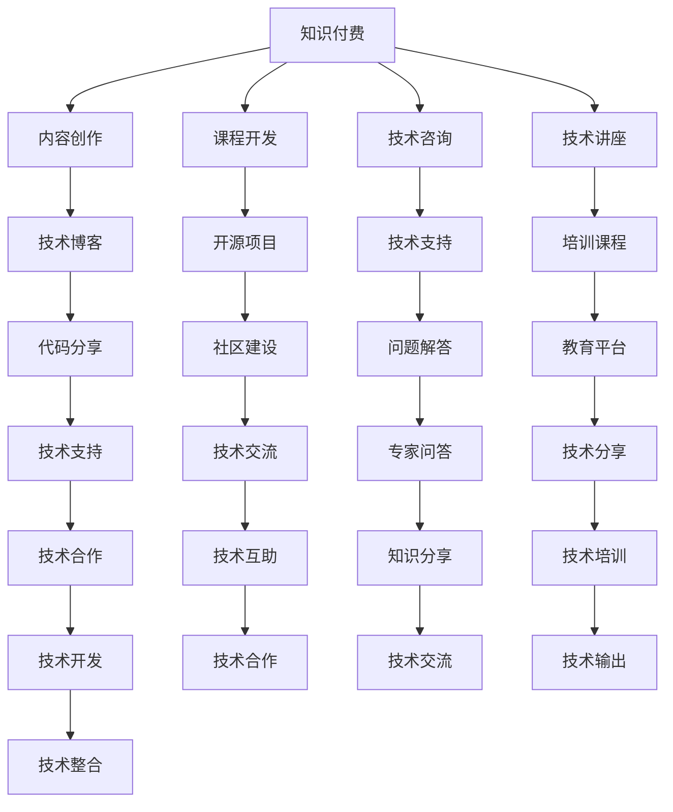

                 

# 知识付费与程序员副业的平衡之道

> 关键词：知识付费, 程序员副业, 平衡之道, 编程技术, 编程实践, 职业发展, 可持续收入

## 1. 背景介绍

随着互联网技术的发展和社会的进步，知识付费已逐渐成为一种新型的经济模式和教育方式。程序员作为技术含量高、社会需求大的群体，也在探索和尝试如何将自身的编程技术转化为知识和技能的变现途径，从而实现收入多元化，提升生活质量。本文将探讨知识付费与程序员副业之间如何找到一个平衡点，帮助程序员在发展副业的同时，兼顾核心技术能力的提升和职业发展。

## 2. 核心概念与联系

### 2.1 核心概念概述

- **知识付费**：指的是用户愿意为获取知识或技能而支付费用的行为。这一模式以内容的质量和价值为核心，通过订阅、课程购买、咨询等方式，实现知识服务的价值交换。
- **程序员副业**：是指程序员在全职工作之余，通过开发软件、写技术博客、做技术讲座、参与开源项目等方式，利用自身的技术特长进行额外的经济收益。
- **平衡之道**：在知识付费和程序员副业之间找到一个合理的比例和节奏，既能保持技术水平和职业发展，又能实现可持续的收入增长。

### 2.2 核心概念原理和架构的 Mermaid 流程图



这个流程图展示了知识付费和程序员副业之间的联系和转换路径。知识付费模式为内容创作者提供了平台和机会，而程序员副业则可以通过提供技术内容、参与项目开发等多种方式实现变现。两者之间的良性互动，可以形成一个互补和共赢的生态系统。

## 3. 核心算法原理 & 具体操作步骤

### 3.1 算法原理概述

知识付费与程序员副业之间的平衡，本质上是一个优化资源配置和效率提升的问题。核心算法原理在于如何通过有效的算法和策略，在确保技术水平和职业发展的前提下，最大化地利用时间和技能，实现可持续的收入增长。

### 3.2 算法步骤详解

1. **需求分析**：识别自身技术特长和兴趣方向，确定适合从事的副业项目。
2. **资源配置**：评估时间和精力的投入产出比，合理分配全职工作与副业项目的时间。
3. **技能提升**：在副业项目中不断学习和提升相关技能，巩固核心技术能力。
4. **市场定位**：确定目标用户群体，分析市场需求，调整内容和服务形式。
5. **收入优化**：通过订阅、付费课程、技术咨询、项目合作等多种方式实现收入最大化。
6. **反馈调整**：定期收集用户反馈，优化内容和形式，提升用户体验和满意度。

### 3.3 算法优缺点

#### 优点
- **多元化收入来源**：程序员可以通过多种途径实现收入增长，降低职业风险。
- **技能提升**：副业项目通常涉及新技术和工具，能够加速技术进步。
- **市场验证**：通过市场需求反馈，了解自身技术在实际应用中的价值和短板。

#### 缺点
- **时间和精力分散**：全职工作与副业之间可能存在时间冲突，影响工作效率。
- **风险和不确定性**：市场和用户需求的变化，可能影响收入稳定性。
- **资源投入**：需要持续投入时间和资金进行内容创作和技术开发。

### 3.4 算法应用领域

知识付费与程序员副业在以下几个领域有广泛应用：

- **技术博客和文章**：通过撰写技术博客和文章，分享编程经验和心得，吸引读者订阅或付费阅读。
- **在线课程和培训**：利用自身技术优势，开发编程课程或在线培训，为学习者提供有价值的内容。
- **开源项目和工具**：参与或贡献开源项目，发布开源工具，提升技术影响力。
- **技术咨询和支持**：提供技术咨询和问题解答，帮助企业或个人解决技术难题。
- **技术讲座和会议**：参加技术讲座和会议，分享经验，建立专业网络。
- **技术开发和合作**：开发自有应用或参与技术合作项目，实现技术变现。

## 4. 数学模型和公式 & 详细讲解 & 举例说明

### 4.1 数学模型构建

假设程序员有固定的时间T用于全职工作和副业，其中全职工作时间为$T_W$，副业时间为$T_S$。全职工作的收入为$I_W$，副业收入为$I_S$。目标是在保证全职工作效率的前提下，最大化副业收入，即最大化$I_S$。

### 4.2 公式推导过程

设全职工作的效率为$E_W$，副业工作的效率为$E_S$。则全职工作时间和副业时间的关系可以表示为：

$$ T = T_W + T_S $$

全职工作和副业收入的关系可以表示为：

$$ I_S = I_W + \frac{T_S}{T_W} \times (I_S - I_W) $$

为了最大化$I_S$，需要找到最优的$T_S$。这可以通过求解上述公式得到。

### 4.3 案例分析与讲解

假设全职工作时间为6小时，全职工作收入为100元/小时，副业时间为4小时，副业收入为50元/小时。则：

$$ I_S = 100 + \frac{4}{6} \times (50 - 100) = 100 - 33.33 = 66.67 $$

这表明，通过合理分配全职工作与副业时间，程序员可以实现副业收入的提升。

## 5. 项目实践：代码实例和详细解释说明

### 5.1 开发环境搭建

#### 5.1.1 安装开发环境

首先需要安装Python、Git、IDE（如PyCharm、VSCode等）等开发工具。

#### 5.1.2 开发环境配置

- 在PyCharm中创建新的Python项目，配置Virtual Environment。
- 安装必要的库，如Flask、SQLAlchemy等，用于开发Web应用。

### 5.2 源代码详细实现

#### 5.2.1 技术博客实现

创建一个Flask Web应用，用于发布技术博客。通过定期更新博客，吸引读者关注和付费订阅。

```python
from flask import Flask, render_template, request

app = Flask(__name__)

@app.route('/')
def home():
    return render_template('home.html')

@app.route('/blog', methods=['GET', 'POST'])
def blog():
    if request.method == 'POST':
        title = request.form['title']
        content = request.form['content']
        # 保存博客内容到数据库
        return '博客发布成功！'
    else:
        return render_template('blog.html')

if __name__ == '__main__':
    app.run(debug=True)
```

#### 5.2.2 在线课程开发

开发一个在线课程平台，提供编程语言的教学视频、代码实践、作业反馈等。

```python
from flask import Flask, render_template, request

app = Flask(__name__)

@app.route('/')
def home():
    return render_template('home.html')

@app.route('/course', methods=['GET', 'POST'])
def course():
    if request.method == 'POST':
        title = request.form['title']
        content = request.form['content']
        # 保存课程内容到数据库
        return '课程发布成功！'
    else:
        return render_template('course.html')

if __name__ == '__main__':
    app.run(debug=True)
```

### 5.3 代码解读与分析

技术博客和在线课程的实现原理类似，均是基于Flask框架开发Web应用。用户通过表单提交博客或课程内容，平台通过数据库保存，并提供相应的展示和订阅功能。

### 5.4 运行结果展示

技术博客和在线课程平台上线后，可以通过Flask的管理界面查看统计数据，了解访问量和用户行为。

## 6. 实际应用场景

### 6.1 在线教育平台

在线教育平台提供编程语言、数据科学、机器学习等课程，通过知识付费模式实现收入。同时，平台上的开发者可以通过参与课程的开发和维护，获得额外的技术支持和合作机会。

### 6.2 开源社区

开源社区提供了丰富的资源和机会，程序员可以通过贡献代码、发布工具、参与讨论等方式，提升自己的技术水平和影响力。

### 6.3 技术讲座和会议

技术讲座和会议是程序员展示技术和交流经验的平台，通过参加讲座和会议，可以获得更多的职业发展机会和网络资源。

## 7. 工具和资源推荐

### 7.1 学习资源推荐

- **编程书籍**：《Clean Code》、《Design Patterns》等经典书籍，深入理解编程技术和设计模式。
- **在线课程**：Coursera、Udacity等平台提供的编程课程，系统学习新技术和工具。
- **技术博客**：Medium、博客园等平台，发表技术文章，分享经验和心得。
- **技术社区**：Stack Overflow、GitHub等社区，参与讨论，解决技术问题。

### 7.2 开发工具推荐

- **IDE**：PyCharm、VSCode等集成开发环境，提高开发效率。
- **版本控制**：Git、GitHub等工具，管理代码和项目。
- **数据库**：SQLite、MySQL等数据库，保存和管理数据。
- **Web框架**：Flask、Django等框架，开发Web应用和API。

### 7.3 相关论文推荐

- **编程范式**：《Functional Programming: A Practical Introduction》
- **软件架构**：《Designing Data-Intensive Applications》
- **软件测试**：《Effective Software Testing》
- **数据科学**：《Hands-On Data Analysis with Pandas》
- **机器学习**：《Pattern Recognition and Machine Learning》

## 8. 总结：未来发展趋势与挑战

### 8.1 研究成果总结

本文从知识付费和程序员副业的角度出发，探讨了两者之间的平衡之道。通过理论分析、案例分析和代码实现，提出了实用的方法论，帮助程序员实现技术提升和收入增长。

### 8.2 未来发展趋势

未来，知识付费和程序员副业将进一步融合，形成更紧密的生态系统。新兴技术如AI、区块链、AR/VR等，将为知识变现和副业发展提供更多机会。

### 8.3 面临的挑战

- **市场竞争**：知识付费和程序员副业市场竞争激烈，需要不断提升内容质量和用户体验。
- **技术更新**：编程技术和工具不断更新，程序员需要持续学习以保持竞争力。
- **收入稳定性**：副业收入的不确定性需要管理和优化。

### 8.4 研究展望

- **内容创新**：探索新的内容形式和渠道，提升内容影响力和吸引力。
- **技术合作**：与其他技术领域合作，拓展副业项目的应用范围。
- **教育赋能**：利用技术赋能教育，提高编程技能和职业发展机会。

## 9. 附录：常见问题与解答

**Q1：如何平衡全职工作与副业时间？**

A: 根据自身时间和精力的投入产出比，合理分配全职工作与副业时间。可以通过实验和调整，找到最适合自己的节奏。

**Q2：如何选择副业项目？**

A: 选择与全职工作互补且感兴趣的副业项目，以避免时间和精力的冲突。同时，选择有市场前景和变现潜力的项目，以提高收入效果。

**Q3：如何进行技术学习？**

A: 利用在线课程、技术博客、技术社区等资源，持续学习和实践。参加技术讲座和会议，拓展视野和知识面。

**Q4：如何应对市场和需求的变化？**

A: 关注市场和用户需求的变化，及时调整副业内容和形式。通过用户反馈和数据分析，不断优化副业项目。

---

作者：禅与计算机程序设计艺术 / Zen and the Art of Computer Programming

