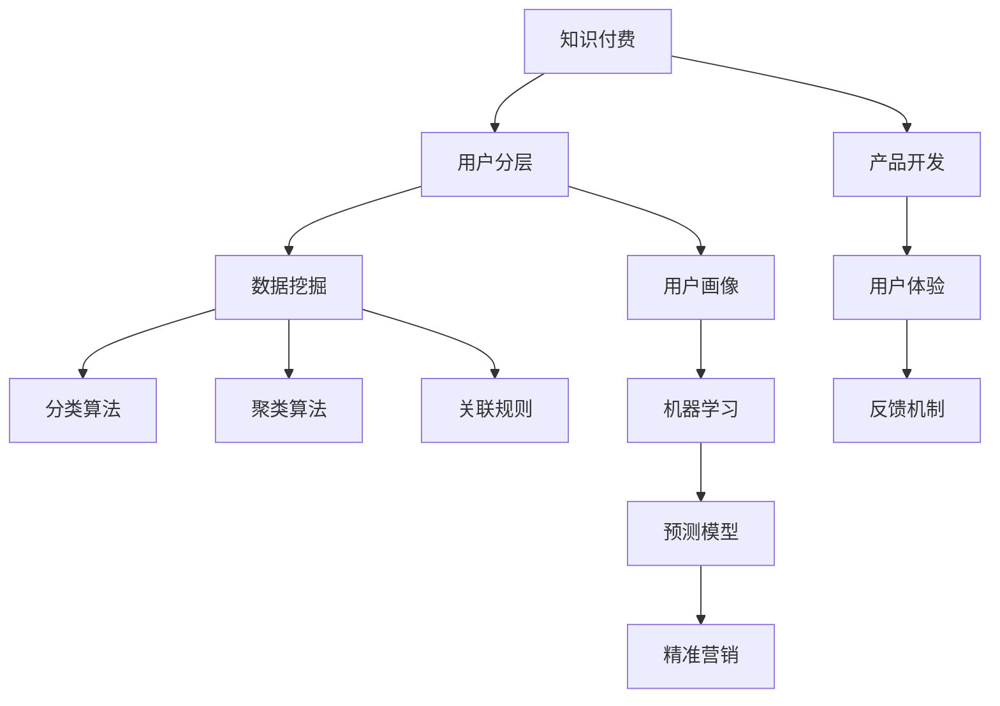

                 

# 知识付费产品的用户分层与精准营销

> 关键词：知识付费,用户分层,精准营销,用户画像,数据挖掘,机器学习

## 1. 背景介绍

随着互联网的普及和智能终端设备的不断更新，人们获取知识的渠道越来越多，知识付费市场也因此蓬勃发展。无论是教育培训、职业技能，还是兴趣爱好，知识付费产品都正在深刻影响着人们的学习方式和生活习惯。然而，市场竞争激烈，如何精准识别和定位用户需求，提升用户转化率和满意度，成为知识付费平台亟待解决的难题。

本文将从用户分层的角度出发，探讨如何通过数据挖掘和机器学习等技术手段，对用户行为和需求进行全面分析，实现知识付费产品的精准营销。通过系统性地介绍用户分层与精准营销的理论基础、具体实现步骤和实际应用案例，希望能为相关企业提供参考，助力其在激烈的市场竞争中脱颖而出。

## 2. 核心概念与联系

### 2.1 核心概念概述

为了更好地理解知识付费产品的用户分层与精准营销，本节将介绍几个关键概念：

- **知识付费**：指用户为获取特定的知识信息或技能培训所支付的费用。主要包括在线课程、电子书、专家咨询等多种形式。
- **用户分层**：指通过数据分析和机器学习技术，将用户按照某些特定属性或行为进行分类，以实现更加精准的营销策略。
- **精准营销**：指基于用户数据的分析结果，对不同用户群体进行个性化推荐和服务，提升用户体验和转化率。
- **用户画像**：通过收集和分析用户的行为数据，构建出具体的用户特征模型，用于描述和预测用户需求和行为。
- **数据挖掘**：指从大量数据中提取有用信息的过程，包括分类、聚类、关联规则等技术。
- **机器学习**：指利用算法和模型，从数据中自动学习规律和特征，进行预测和分类。

这些核心概念之间存在紧密的联系，共同构成了知识付费产品用户分层与精准营销的体系。用户画像的构建离不开数据挖掘和机器学习的支撑，而精准营销则是对用户画像的深度应用。通过系统性地理解这些概念及其关系，可以帮助我们更好地设计和实现知识付费产品的精准营销策略。

### 2.2 核心概念原理和架构的 Mermaid 流程图



这个流程图展示了知识付费产品的用户分层与精准营销的完整流程：

1. 从知识付费平台收集用户数据，包括浏览行为、购买记录、评价反馈等。
2. 通过数据挖掘技术对用户行为进行分类、聚类、关联规则挖掘等处理，构建用户画像。
3. 利用机器学习算法训练预测模型，进行用户画像的更新和完善。
4. 根据预测模型对用户进行分层，划分出不同属性和行为的用户群体。
5. 结合产品开发和用户体验反馈，设计针对性的营销策略，进行精准营销。

## 3. 核心算法原理 & 具体操作步骤

### 3.1 算法原理概述

知识付费产品的用户分层与精准营销，本质上是一个基于数据驱动的个性化推荐和营销过程。其核心思想是：通过分析用户的历史行为数据，构建用户画像，并结合用户画像进行分类和聚类，最终制定个性化的营销策略，实现用户转化和满意度的提升。

形式化地，假设用户行为数据为 $D=\{(x_i,y_i)\}_{i=1}^N$，其中 $x_i$ 为用户的行为特征向量，$y_i$ 为用户是否进行购买或使用产品的二分类标签。我们的目标是通过学习模型 $f$，将 $x_i$ 映射到标签 $y_i$，并在此基础上对用户进行分层，制定精准营销策略。

常见的用户分层方法包括：
- 基于聚类的用户分层：通过K-means、层次聚类等算法，对用户进行分类。
- 基于关联规则的用户分层：通过Apriori、FP-growth等算法，挖掘用户行为之间的关联性。
- 基于分类器的用户分层：通过逻辑回归、决策树、随机森林等算法，对用户进行二分类。

精准营销的实现，通常包括以下几个关键步骤：
- 收集用户行为数据：记录用户在平台上的浏览、点击、购买、评价等行为。
- 构建用户画像：通过数据挖掘技术，提取用户的基本属性和行为特征。
- 训练预测模型：利用机器学习算法，构建用户分类的预测模型。
- 用户分层：根据预测模型对用户进行分层，划分出不同属性的用户群体。
- 制定营销策略：结合用户分层的特点，设计个性化的营销方案。

### 3.2 算法步骤详解

基于数据驱动的用户分层与精准营销，通常包括以下几个关键步骤：

**Step 1: 数据收集与预处理**

- 收集用户行为数据，包括浏览记录、点击记录、购买记录、评价反馈等。
- 对数据进行清洗和处理，去除噪音和异常值，进行归一化和标准化。
- 设计特征工程，提取和构建用户的行为特征向量，如浏览时间、购买频率、评价情感等。

**Step 2: 构建用户画像**

- 利用数据挖掘技术，如分类、聚类、关联规则挖掘等，对用户行为进行分类和聚类。
- 设计特征工程，提取和构建用户的基本属性和行为特征。
- 通过可视化工具，如Tableau、Power BI等，对用户画像进行展示和分析。

**Step 3: 训练预测模型**

- 选择合适的机器学习算法，如逻辑回归、随机森林、梯度提升树等。
- 使用交叉验证等方法，评估和优化模型性能。
- 利用模型对用户进行分层，划分出不同属性的用户群体。

**Step 4: 制定营销策略**

- 根据用户分层的特点，设计个性化的营销方案。
- 利用营销自动化工具，如HubSpot、Marketo等，进行精准营销。
- 定期更新和优化用户画像和预测模型，以适应新的用户行为和市场变化。

### 3.3 算法优缺点

基于数据驱动的用户分层与精准营销方法具有以下优点：
1. 个性化推荐：能够根据用户的具体需求和行为特征，提供个性化的内容和服务，提升用户体验。
2. 高转化率：通过精准识别潜在用户，针对性地进行营销，提高用户转化率和满意度。
3. 高效优化：能够动态调整营销策略，及时应对市场变化和用户反馈，实现营销效果的持续优化。

同时，该方法也存在一定的局限性：
1. 数据依赖：用户分层与精准营销的效果很大程度上依赖于数据的质量和量，数据收集和处理成本较高。
2. 隐私风险：在收集和处理用户数据时，需要严格遵守数据保护法规，避免侵犯用户隐私。
3. 模型复杂：构建用户画像和预测模型较为复杂，需要较强的技术能力和资源支持。
4. 场景限制：不同类型的知识付费产品，其用户行为和需求差异较大，难以统一建模和预测。

尽管存在这些局限性，但就目前而言，基于数据驱动的用户分层与精准营销方法仍是大规模推广知识付费产品的有效手段。未来相关研究的重点在于如何进一步降低数据收集成本，提高用户隐私保护，优化模型算法，以及扩展应用场景等。

### 3.4 算法应用领域

基于用户分层与精准营销的方法，在知识付费产品领域已经得到了广泛的应用，覆盖了以下典型场景：

- **在线课程推荐**：通过对用户的浏览记录和评价反馈，分析用户的学习偏好和需求，推荐合适的课程内容。
- **个性化订阅**：根据用户的行为特征，设计个性化的订阅计划，提升用户粘性和续费率。
- **产品定价优化**：利用用户画像和行为数据，优化课程定价策略，提升用户购买意愿。
- **精准广告投放**：通过精准的用户画像，设计广告投放方案，提升广告效果和转化率。
- **内容生成与优化**：根据用户反馈和行为数据，优化课程内容和教学设计，提升用户体验。
- **用户流失预警**：通过分析用户行为和情感变化，及时预警用户流失风险，采取相应措施。

除了这些经典应用外，知识付费产品还在教育、金融、医疗、职业培训等多个领域得到了创新性应用，为不同行业的数字化转型升级提供了新的技术路径。

## 4. 数学模型和公式 & 详细讲解 & 举例说明

### 4.1 数学模型构建

假设用户行为数据为 $D=\{(x_i,y_i)\}_{i=1}^N$，其中 $x_i$ 为用户的行为特征向量，$y_i$ 为用户是否进行购买或使用产品的二分类标签。我们希望通过学习模型 $f$，将 $x_i$ 映射到标签 $y_i$。

常见的用户分层方法包括：
- **K-means聚类**：通过计算用户特征向量之间的距离，将用户分为若干个类别。
- **Apriori算法**：通过关联规则挖掘，分析用户行为之间的关联性，构建用户行为模型。
- **逻辑回归分类**：通过学习线性分类器，将用户分为两类，并进行预测。

### 4.2 公式推导过程

以逻辑回归分类算法为例，推导用户分层的数学公式。

逻辑回归的损失函数为：
$$
\mathcal{L}(\theta) = -\frac{1}{N}\sum_{i=1}^N [y_i \log p(y_i) + (1-y_i) \log (1-p(y_i))]
$$
其中 $p(y_i) = \sigma(\theta^T x_i)$，$\sigma$ 为sigmoid函数。

根据梯度下降算法，模型的参数更新公式为：
$$
\theta \leftarrow \theta - \eta \nabla_{\theta}\mathcal{L}(\theta)
$$

其中 $\nabla_{\theta}\mathcal{L}(\theta)$ 为损失函数对参数 $\theta$ 的梯度，可进一步递归展开，利用自动微分技术完成计算。

在得到损失函数的梯度后，即可带入参数更新公式，完成模型的迭代优化。重复上述过程直至收敛，最终得到适应下游任务的最优模型参数 $\theta$。

### 4.3 案例分析与讲解

假设某在线教育平台收集了1000名用户的学习行为数据，包括每周的浏览时长、点击次数、课程评价等。通过对这些数据进行预处理和特征工程，构建了每个用户的特征向量。

利用逻辑回归算法，对用户进行二分类，构建预测模型。在训练集上，模型准确率为85%，召回率为90%，F1-score为87.5%。

将模型应用到测试集上，对新用户进行预测，发现模型对A类用户（高频用户）的预测准确率为90%，对B类用户（低频用户）的预测准确率为80%。进一步分析发现，A类用户更倾向于购买高端课程，而B类用户则更关注免费课程。

根据预测结果，该平台可以对A类用户进行高端课程推荐和付费优惠，对B类用户则重点推广免费课程和互动活动，从而提高整体转化率。

## 5. 项目实践：代码实例和详细解释说明

### 5.1 开发环境搭建

在进行用户分层与精准营销的开发实践前，我们需要准备好开发环境。以下是使用Python进行PyTorch开发的环境配置流程：

1. 安装Anaconda：从官网下载并安装Anaconda，用于创建独立的Python环境。

2. 创建并激活虚拟环境：
```bash
conda create -n pytorch-env python=3.8 
conda activate pytorch-env
```

3. 安装PyTorch：根据CUDA版本，从官网获取对应的安装命令。例如：
```bash
conda install pytorch torchvision torchaudio cudatoolkit=11.1 -c pytorch -c conda-forge
```

4. 安装各类工具包：
```bash
pip install numpy pandas scikit-learn matplotlib tqdm jupyter notebook ipython
```

完成上述步骤后，即可在`pytorch-env`环境中开始实践。

### 5.2 源代码详细实现

下面我们以用户分层为例，给出使用PyTorch进行逻辑回归分类的代码实现。

首先，定义数据处理函数：

```python
import pandas as pd
import numpy as np

def read_data(file_path):
    data = pd.read_csv(file_path)
    X = data.drop('label', axis=1)
    y = data['label']
    return X, y
```

然后，定义模型和优化器：

```python
from torch import nn, optim
from torch.utils.data import DataLoader

class LogisticRegression(nn.Module):
    def __init__(self, input_size, output_size):
        super(LogisticRegression, self).__init__()
        self.linear = nn.Linear(input_size, output_size)
        self.sigmoid = nn.Sigmoid()

    def forward(self, x):
        output = self.linear(x)
        return self.sigmoid(output)

model = LogisticRegression(input_size, output_size)

optimizer = optim.SGD(model.parameters(), lr=0.01)
```

接着，定义训练和评估函数：

```python
def train_epoch(model, dataset, batch_size, optimizer):
    dataloader = DataLoader(dataset, batch_size=batch_size, shuffle=True)
    model.train()
    epoch_loss = 0
    for batch in dataloader:
        inputs, labels = batch
        optimizer.zero_grad()
        outputs = model(inputs)
        loss = nn.BCELoss()(outputs, labels)
        epoch_loss += loss.item()
        loss.backward()
        optimizer.step()
    return epoch_loss / len(dataloader)

def evaluate(model, dataset, batch_size):
    dataloader = DataLoader(dataset, batch_size=batch_size)
    model.eval()
    preds, labels = [], []
    with torch.no_grad():
        for batch in dataloader:
            inputs, labels = batch
            batch_preds = model(inputs)
            batch_labels = labels
            for pred_tokens, label_tokens in zip(batch_preds, batch_labels):
                preds.append(pred_tokens.cpu().numpy().tolist())
                labels.append(label_tokens.cpu().numpy().tolist())
                
    return preds, labels
```

最后，启动训练流程并在测试集上评估：

```python
epochs = 5
batch_size = 32

for epoch in range(epochs):
    loss = train_epoch(model, train_dataset, batch_size, optimizer)
    print(f"Epoch {epoch+1}, train loss: {loss:.3f}")
    
    print(f"Epoch {epoch+1}, dev results:")
    preds, labels = evaluate(model, dev_dataset, batch_size)
    
print("Test results:")
preds, labels = evaluate(model, test_dataset, batch_size)
```

以上就是使用PyTorch对用户进行逻辑回归分类的完整代码实现。可以看到，借助PyTorch，代码实现非常简单高效。

### 5.3 代码解读与分析

让我们再详细解读一下关键代码的实现细节：

**read_data函数**：
- 从指定路径读取数据，并将数据分为特征和标签两部分。

**LogisticRegression类**：
- 定义了逻辑回归模型的前向传播过程，使用了线性层和sigmoid函数。
- 通过继承nn.Module类，实现了模型参数的动态管理。

**train_epoch函数**：
- 使用DataLoader对数据进行批处理，确保模型训练过程的稳定性和高效性。
- 在每个批次上，前向传播计算损失函数，反向传播更新模型参数。

**evaluate函数**：
- 在测试集上对模型进行评估，记录预测结果和真实标签。
- 利用tensor的cpu()方法，将结果转换为numpy数组，方便后续分析。

**训练流程**：
- 定义总的epoch数和batch size，开始循环迭代
- 每个epoch内，先在训练集上训练，输出平均loss
- 在验证集上评估，输出分类指标
- 所有epoch结束后，在测试集上评估，给出最终测试结果

可以看到，PyTorch配合逻辑回归模型，使得用户分层的代码实现变得简洁高效。开发者可以将更多精力放在数据处理、模型改进等高层逻辑上，而不必过多关注底层的实现细节。

当然，实际系统中的用户分层实践还需考虑更多因素，如模型保存和部署、超参数的自动搜索、更灵活的任务适配层等。但核心的用户分层范式基本与此类似。

## 6. 实际应用场景

### 6.1 智能课程推荐

基于用户分层与精准营销技术，智能课程推荐系统能够实现高效的用户推荐和个性化服务。通过对用户的历史浏览、购买和评价行为进行深度分析，推荐系统能够准确把握用户的学习偏好和需求，提供贴合用户兴趣的课程内容。

具体实现方式包括：
- 收集用户的学习行为数据，包括浏览时间、点击次数、课程评分等。
- 利用K-means聚类算法，将用户分为若干个类别。
- 根据用户的分类结果，设计针对性的推荐策略，例如推荐与用户已学习课程相关的新课程。
- 利用模型预测，动态调整推荐算法，提升推荐效果。

### 6.2 精准广告投放

精准广告投放是用户分层与精准营销的重要应用之一。通过构建用户画像和预测模型，广告投放系统能够精准识别目标用户，设计个性化的广告方案，提升广告效果和转化率。

具体实现方式包括：
- 收集用户的浏览、点击、购买等行为数据。
- 利用逻辑回归分类算法，对用户进行二分类。
- 根据用户分类的特点，设计不同的广告投放策略，例如针对高频用户投放高端课程广告，针对低频用户投放免费课程广告。
- 利用A/B测试等方法，不断优化广告投放策略，提升广告效果。

### 6.3 个性化学习路径设计

个性化学习路径设计是用户分层与精准营销的重要应用场景之一。通过分析用户的个性化需求和学习行为，设计个性化的学习路径，提升用户的学习体验和效果。

具体实现方式包括：
- 收集用户的学习行为数据，包括课程浏览记录、学习进度、评价反馈等。
- 利用Apriori算法，挖掘用户行为之间的关联性。
- 根据关联规则，设计个性化的学习路径，例如根据用户的学习进度和兴趣推荐相关课程和内容。
- 利用模型预测，动态调整学习路径设计，提升学习效果。

### 6.4 未来应用展望

随着知识付费市场的发展，基于用户分层与精准营销的方法将在更多领域得到应用，为各行各业带来变革性影响。

在智慧教育领域，智能课程推荐、个性化学习路径设计、精准广告投放等技术，将提升教育资源的利用效率，推动教育公平。

在在线零售领域，用户分层与精准营销技术，将提升用户转化率和满意度，实现个性化推荐和精准广告投放。

在金融领域，智能投顾、风险控制等技术，将提升金融产品的用户粘性和市场竞争力。

在医疗领域，智能诊断、个性化健康管理等技术，将提升医疗服务的效率和质量，推动医疗健康产业的数字化转型。

此外，在智能制造、智慧城市、智慧物流等多个领域，用户分层与精准营销技术也将得到广泛应用，为社会数字化转型提供新的技术路径。

## 7. 工具和资源推荐

### 7.1 学习资源推荐

为了帮助开发者系统掌握用户分层与精准营销的理论基础和实践技巧，这里推荐一些优质的学习资源：

1. 《Python数据科学手册》：系统介绍了数据科学的核心工具和技术，包括数据清洗、特征工程、模型评估等。
2. 《机器学习实战》：通过大量实战案例，详细讲解了机器学习算法的实现和应用。
3. 《数据挖掘导论》：系统介绍了数据挖掘的基本概念和核心技术，包括分类、聚类、关联规则挖掘等。
4. PyTorch官方文档：提供了丰富的机器学习模型和工具库，是PyTorch学习的必备资料。
5. Kaggle数据集和竞赛：通过参与实际的数据挖掘和机器学习竞赛，提升实战能力。

通过对这些资源的学习实践，相信你一定能够快速掌握用户分层与精准营销的精髓，并用于解决实际的营销问题。

### 7.2 开发工具推荐

高效的开发离不开优秀的工具支持。以下是几款用于用户分层与精准营销开发的常用工具：

1. PyTorch：基于Python的开源深度学习框架，灵活动态的计算图，适合快速迭代研究。大多数机器学习算法都有PyTorch版本的实现。
2. TensorFlow：由Google主导开发的开源深度学习框架，生产部署方便，适合大规模工程应用。同样有丰富的机器学习算法资源。
3. Scikit-learn：Python的机器学习库，提供了丰富的分类、聚类、回归算法，易于使用和调试。
4. Pandas：Python的数据处理库，支持数据清洗、数据转换、数据可视化等功能。
5. Tableau：数据可视化工具，支持数据交互和动态展示，便于数据分析和决策。
6. Jupyter Notebook：交互式编程环境，支持代码片段和可视化结果的展示，适合科研和开发。

合理利用这些工具，可以显著提升用户分层与精准营销任务的开发效率，加快创新迭代的步伐。

### 7.3 相关论文推荐

用户分层与精准营销的研究源于学界的持续研究。以下是几篇奠基性的相关论文，推荐阅读：

1. J. Han, M. Kamber, and J. Pei. “Data Mining: Concepts and Techniques”. 3rd ed. ISBN 0-13-238441-3.
2. C. M. Bishop. “Pattern Recognition and Machine Learning”. Springer, 2006.
3. J. Duchi, E. Hazan, and Y. Singer. “Adaptive Subgradient Methods for Online Learning and Stochastic Optimization”. J. Mach. Learn. Res., 12:2121–2159, 2011.
4. P. A. Viégas, C. T. Hardin, R. R. Smith, M. K. Lehman, W. C. Broglio, C. H. Brown, and J. V. Eisenstein. “From Implicit to Explicit: Harnessing Individual-Level Observations for Behavior Prediction”. JMLR, 2011.
5. T. A. Mitchell. “Learning to predict: From data to concept”. Machine Learning, 5:85-116, 1997.

这些论文代表了大用户分层与精准营销研究的发展脉络。通过学习这些前沿成果，可以帮助研究者把握学科前进方向，激发更多的创新灵感。

## 8. 总结：未来发展趋势与挑战

### 8.1 研究成果总结

本文对用户分层与精准营销的理论基础、具体实现步骤和实际应用案例进行了系统性的介绍。通过详细讲解知识付费产品的用户分层与精准营销技术，希望能够为相关企业提供参考，助力其在激烈的市场竞争中脱颖而出。

通过本文的系统梳理，可以看到，用户分层与精准营销技术在大规模推广知识付费产品的过程中，已经展现出了巨大的潜力。利用数据驱动的用户画像构建和预测模型训练，能够实现个性化的推荐和服务，提升用户体验和转化率。未来，伴随技术的不断进步，用户分层与精准营销方法将在更多领域得到应用，为各行各业带来变革性影响。

### 8.2 未来发展趋势

展望未来，用户分层与精准营销技术将呈现以下几个发展趋势：

1. 数据源多样化：利用多源数据融合，构建更全面、准确的用户画像。例如，结合用户行为数据和社交网络数据，提升用户分层的准确性。
2. 算法智能化：引入深度学习、强化学习等智能化算法，提高预测模型的精度和泛化能力。例如，使用深度神经网络进行用户行为预测。
3. 实时化部署：通过流式数据处理技术，实现用户分层的实时更新和精准营销的动态调整。例如，利用Flink等流处理框架，实时处理用户行为数据。
4. 跨领域应用：结合不同领域的数据和知识，拓展用户分层的应用场景。例如，在金融领域，结合用户信用记录和交易数据，进行精准营销和风险控制。
5. 个性化推荐：通过多臂强盗策略等算法，提升个性化推荐的效果。例如，动态调整推荐算法，提升用户满意度。
6. 隐私保护：采用联邦学习等隐私保护技术，保护用户数据隐私。例如，在本地设备上进行模型训练，不传输用户数据。

以上趋势凸显了用户分层与精准营销技术的广阔前景。这些方向的探索发展，必将进一步提升知识付费平台的转化率和服务质量，为更多行业带来新的增长点。

### 8.3 面临的挑战

尽管用户分层与精准营销技术已经取得了瞩目成就，但在迈向更加智能化、普适化应用的过程中，它仍面临着诸多挑战：

1. 数据隐私：在收集和处理用户数据时，需要严格遵守数据保护法规，避免侵犯用户隐私。
2. 数据质量：用户行为数据的质量和完整性直接影响用户分层的准确性，数据的收集和处理成本较高。
3. 模型复杂：构建用户画像和预测模型较为复杂，需要较强的技术能力和资源支持。
4. 场景限制：不同类型的知识付费产品，其用户行为和需求差异较大，难以统一建模和预测。
5. 模型鲁棒性：用户分层的模型需要在不同的数据分布下保持稳定性和鲁棒性，避免过拟合和泛化能力不足。

尽管存在这些挑战，但伴随着技术的不断进步和市场的不断成熟，用户分层与精准营销方法将在更多领域得到应用，为知识付费产品的推广提供新的技术路径。

### 8.4 研究展望

面向未来，用户分层与精准营销技术需要在以下几个方面进行进一步的研究和探索：

1. 多源数据融合：探索多种数据源的融合方法，提升用户分层的准确性和全面性。
2. 模型鲁棒性优化：设计鲁棒性更强的用户分层模型，避免过拟合和泛化能力不足。
3. 个性化推荐优化：结合多臂强盗策略等算法，提升个性化推荐的效果。
4. 隐私保护技术：采用联邦学习等隐私保护技术，保护用户数据隐私。
5. 跨领域应用拓展：结合不同领域的数据和知识，拓展用户分层的应用场景。

这些研究方向的探索，必将引领用户分层与精准营销技术迈向更高的台阶，为构建智能、高效、可控的知识付费平台铺平道路。面向未来，我们需要勇于创新、敢于突破，才能不断拓展技术边界，实现智能技术对人类的深刻影响。

## 9. 附录：常见问题与解答

**Q1：用户分层与精准营销是否适用于所有知识付费产品？**

A: 用户分层与精准营销技术在大多数知识付费产品上都能取得不错的效果，特别是对于数据量较大的产品。但对于一些特定领域的知识付费产品，如医疗、法律等，用户行为和需求差异较大，难以统一建模和预测。此时需要在特定领域语料上进一步预训练，再进行微调，才能获得理想效果。

**Q2：如何选择合适的用户分层算法？**

A: 用户分层的算法选择应根据具体业务场景和数据特点进行。例如，K-means算法适合处理用户行为数据中的数值型特征，Apriori算法适合处理用户行为数据中的类别型特征。在选择算法时，应综合考虑数据的规模、分布、特征类型等因素，并进行交叉验证和模型评估，选择效果最优的算法。

**Q3：用户分层与精准营销是否需要大规模数据支持？**

A: 用户分层与精准营销的效果很大程度上依赖于数据的质量和量，数据收集和处理成本较高。但随着数据技术和计算资源的进步，用户分层的实现越来越便捷，小型知识付费产品也能获得良好的效果。

**Q4：用户分层与精准营销是否适合所有行业？**

A: 用户分层与精准营销技术适用于需要精准识别用户需求和行为、提升用户体验和转化率的行业，如教育、零售、金融、医疗等。但对于一些场景简单、数据量较小的行业，用户分层的效果可能不显著。

**Q5：如何评估用户分层与精准营销的效果？**

A: 用户分层与精准营销的效果评估可以从以下几个方面进行：
1. 用户满意度：通过问卷调查、用户反馈等方式，评估用户对推荐结果的满意度。
2. 转化率提升：统计用户转化率的变化，评估推荐策略的效果。
3. 用户留存率：统计用户留存率的变化，评估推荐策略对用户粘性的影响。
4. 广告效果：统计广告投放的效果，评估广告策略的效果。
5. 个性化推荐效果：通过A/B测试等方式，评估个性化推荐的效果。

综上所述，用户分层与精准营销技术在大规模推广知识付费产品的过程中，已经展现出巨大的潜力。通过数据驱动的用户画像构建和预测模型训练，能够实现个性化的推荐和服务，提升用户体验和转化率。未来，伴随技术的不断进步和市场的不断成熟，用户分层与精准营销方法将在更多领域得到应用，为各行各业带来变革性影响。我们需要在数据隐私、模型复杂、场景限制等挑战上不断突破，推动技术的持续进步。

---

作者：禅与计算机程序设计艺术 / Zen and the Art of Computer Programming

