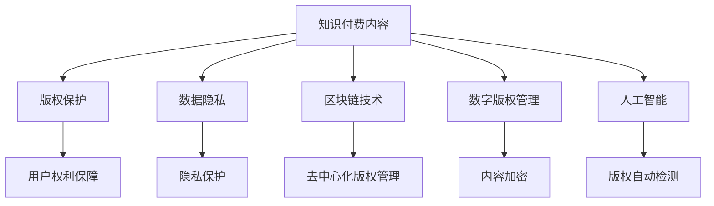

                 

# 知识付费内容的版权保护与法律风险

> 关键词：知识付费,版权保护,法律风险,数据隐私,区块链技术,数字版权管理,人工智能应用

## 1. 背景介绍

随着知识付费平台如雨后春笋般涌现，知识付费内容版权保护问题日益受到关注。知识付费平台通过在线订阅、单次购买等方式，为用户提供丰富的学习资源。然而，内容创作者与平台间的版权纠纷、用户版权意识薄弱等问题，不断威胁着知识付费产业的健康发展。如何确保知识付费内容的版权得到有效保护，同时保障用户的合法权益，成为亟待解决的难题。

## 2. 核心概念与联系

### 2.1 核心概念概述

为了更好地理解知识付费内容的版权保护，本节将介绍几个关键概念：

- 知识付费内容：包括在线课程、电子书、音频讲座等多种形式的学习资料。知识付费平台通过合法授权或自主制作，为用户提供专业知识的获取途径。
- 版权保护：指法律赋予内容创作者对其作品的专有使用权，包括复制、发行、展示、信息网络传播等权利。版权保护旨在鼓励创作，促进文化产业的健康发展。
- 数据隐私：指个人或组织在数字化、网络化过程中的信息安全问题。内容创作者需确保用户信息不被滥用，避免隐私泄露。
- 区块链技术：一种去中心化的分布式账本技术，具有不可篡改、透明公开的特点，被广泛应用于版权保护、数据存储等领域。
- 数字版权管理(DRM)：指对数字内容进行版权保护的系列技术和管理措施。常见的DRM技术包括加密、数字水印、防篡改等。
- 人工智能(AI)：通过模拟人类智能行为，实现数据分析、图像识别、自然语言处理等任务，为内容创作和版权管理提供助力。

这些核心概念之间的逻辑关系可以通过以下Mermaid流程图来展示：



这个流程图展示了我知识付费内容的各个关键概念及其之间的关系：

1. 知识付费内容通过版权保护、数据隐私、区块链技术、数字版权管理和人工智能等多方面的保护措施，确保其合法性、完整性和安全。
2. 用户权利保障依赖于版权保护，保障用户可以合法使用内容。
3. 隐私保护是数据隐私的核心，确保用户信息不被滥用。
4. 去中心化版权管理是区块链技术的一个重要应用，提供不可篡改的版权证明。
5. 内容加密和版权自动检测是数字版权管理的关键技术，保护内容的版权不被侵犯。

## 3. 核心算法原理 & 具体操作步骤

### 3.1 算法原理概述

知识付费内容的版权保护涉及多方面的技术手段，包括数据加密、版权登记、区块链技术、DRM、AI等。其核心算法原理是通过技术手段确保内容创作者对其作品的专有权利，同时保障用户的合法使用。

具体来说，版权保护算法通过数字指纹、数字水印、内容加密等手段，对知识付费内容进行保护。数字指纹可以唯一标识每一篇内容，一旦内容被篡改，数字指纹会改变，从而识别侵权行为。数字水印则可以在内容的各个层面植入水印，确保内容的所有权。

区块链技术在版权保护中应用广泛，通过去中心化的分布式账本，记录内容的创作、传播、使用等各个环节，确保内容版权的不可篡改性和透明性。DRM技术通过对内容进行加密、访问控制等，限制用户对内容的非法使用，保护版权。AI技术则可以自动检测内容的版权侵权行为，提高版权保护的效率和准确性。

### 3.2 算法步骤详解

知识付费内容的版权保护可以分为以下几个关键步骤：

**Step 1: 数据加密**
- 使用AES、RSA等加密算法对内容进行加密，生成密文。
- 采用密钥管理系统确保密钥的安全存储和分发。

**Step 2: 数字指纹生成**
- 对内容进行哈希运算，生成唯一的数字指纹。
- 将数字指纹与内容创作信息一同存储在区块链上。

**Step 3: 数字水印嵌入**
- 在内容的关键部分嵌入数字水印，如作者信息、版权声明等。
- 水印可以嵌入在文本、图像、音频等多个层面。

**Step 4: DRM策略设定**
- 设置访问控制规则，如订阅权限、单次购买等。
- 在内容分发环节加入DRM技术，限制用户的非法使用。

**Step 5: 区块链记录**
- 将内容的创建、传播、使用等各个环节的信息记录在区块链上。
- 确保内容版权的透明性和不可篡改性。

**Step 6: AI版权监控**
- 使用AI技术自动检测内容侵权行为。
- 通过深度学习、图像识别等技术，识别并报告疑似侵权内容。

### 3.3 算法优缺点

知识付费内容的版权保护技术具有以下优点：
1. 安全性高。通过加密、数字指纹等手段，确保内容不被篡改和非法复制。
2. 透明性好。区块链技术记录了内容的传播和使用全过程，保障版权的透明性。
3. 效率高。AI技术自动检测侵权行为，显著提高了版权保护的工作效率。
4. 成本低。DRM策略通过访问控制规则，限制非法使用，保护版权的同时减少了管理成本。

但该技术也存在一定的局限性：
1. 技术门槛高。需要对加密、区块链、AI等技术有深入的理解和应用，对技术团队的要求较高。
2. 用户接受度低。部分用户可能对复杂的DRM策略和版权声明感到不便，影响使用体验。
3. 技术缺陷可能被绕过。即使采用多重加密和水印，也无法完全避免高超的黑客攻击。
4. 区块链存储成本高。区块链的分布式存储需要较大的存储空间，且链上数据不可删除，增加了存储成本。

尽管如此，知识付费内容的版权保护仍需通过多技术手段综合应用，才能有效保障内容创作者和用户的合法权益。

### 3.4 算法应用领域

知识付费内容的版权保护技术不仅在知识付费平台有广泛应用，还涉及出版、影视、音乐等多个领域。例如：

- 图书出版：通过数字水印和版权登记，确保图书内容不被非法复制和传播。
- 影视版权：使用区块链记录影视作品的创作、发行、使用等各个环节，防止盗版和侵权。
- 音乐版权：采用DRM技术限制音乐作品的非法下载和分享，保护音乐创作者的利益。
- 教育内容：通过版权登记和内容加密，确保教育资源的合法使用。

## 4. 数学模型和公式 & 详细讲解 & 举例说明

### 4.1 数学模型构建

为了更好地理解知识付费内容的版权保护技术，本节将通过数学模型和公式进行详细讲解。

设内容为 $C$，其数字指纹为 $F(C)$，版权声明为 $D(C)$，内容密文为 $E(C)$，数字指纹加密后存储在区块链上。假设内容创作者为 $A$，用户为 $U$。

版权保护模型的目标是在内容发布后，确保 $A$ 对其作品享有专有权利，同时 $U$ 能够合法使用 $C$，不侵犯 $A$ 的版权。

数学模型构建如下：

$$
\begin{align*}
E(C) &= \text{Enc}(C, k_C) \\
F(C) &= \text{Hash}(C) \\
F'(C) &= \text{Enc}(F(C), k_F) \\
\end{align*}
$$

其中，$\text{Enc}$ 为加密算法，$k_C$ 和 $k_F$ 分别为内容加密和数字指纹加密的密钥。

### 4.2 公式推导过程

根据上述模型，推导版权保护的关键步骤：

**Step 1: 内容加密**
- $C$ 明文内容，通过加密算法 $\text{Enc}$ 生成密文 $E(C)$。

**Step 2: 数字指纹生成**
- 对 $C$ 进行哈希运算，生成数字指纹 $F(C)$。
- 将 $F(C)$ 进行加密，生成数字指纹加密值 $F'(C)$。

**Step 3: 版权声明**
- 将版权声明 $D(C)$ 嵌入内容 $C$ 中。

**Step 4: 区块链记录**
- 将 $F'(C)$ 与版权声明 $D(C)$ 一同记录在区块链上。

### 4.3 案例分析与讲解

以一本电子书为例，详细讲解版权保护的过程：

1. **内容创作**
   - 内容创作者 $A$ 创作电子书 $C$，并进行哈希运算，生成数字指纹 $F(C)$。
   - 将 $F(C)$ 进行加密，生成数字指纹加密值 $F'(C)$。

2. **内容发布**
   - $A$ 将 $E(C)$、$F'(C)$、$D(C)$ 一同发布到区块链上。
   - 用户 $U$ 可以通过区块链获取到 $F'(C)$ 和 $D(C)$，确认版权信息。

3. **版权监控**
   - 版权管理系统使用AI技术，自动检测内容侵权行为。
   - 若发现疑似侵权内容 $C'$，通过对比 $C'$ 的数字指纹 $F'(C')$ 与 $F'(C)$，确认是否为同一内容。

## 5. 项目实践：代码实例和详细解释说明

### 5.1 开发环境搭建

在进行知识付费内容版权保护实践前，我们需要准备好开发环境。以下是使用Python进行开源区块链框架PyBlock的开发环境配置流程：

1. 安装Python：确保Python版本为3.6及以上，可以通过以下命令检查：
```bash
python --version
```

2. 安装PyBlock：
```bash
pip install pyblock
```

3. 安装其他依赖库：
```bash
pip install hashlib pycrypto pysha3
```

完成上述步骤后，即可在本地环境下进行知识付费内容版权保护的开源代码实践。

### 5.2 源代码详细实现

下面我们以电子书版权保护为例，给出使用PyBlock进行数字指纹和区块链记录的PyTorch代码实现。

首先，定义数字指纹生成和加密函数：

```python
import hashlib
from Crypto.Cipher import AES
from Crypto.Hash import SHA256
from Crypto.Hash import SHA3_256

def create_fingerprint(content):
    # 对内容进行哈希运算，生成数字指纹
    digest = hashlib.sha256(content.encode()).digest()
    return digest

def encrypt_fingerprint(fingerprint):
    # 对数字指纹进行加密，生成数字指纹加密值
    sha3 = SHA3_256.new()
    sha3.update(fingerprint)
    digest = sha3.digest()
    return digest

def encrypt_content(content, key):
    # 对内容进行AES加密，生成密文
    cipher = AES.new(key, AES.MODE_EAX)
    nonce = cipher.nonce
    ciphertext, tag = cipher.encrypt_and_digest(content.encode())
    return cipher.nonce, ciphertext, tag
```

然后，定义区块链记录和版权声明嵌入函数：

```python
import json
from pyblock import Block, Chain

class BookBlock(Chain):
    def __init__(self, data, previous_hash, timestamp):
        super().__init__()
        self.data = json.dumps(data)
        self.previous_hash = previous_hash
        self.timestamp = timestamp

    def get_hash(self):
        return json.dumps(self.data).encode()

def create_book_block(fingerprint, encrypted_content, key):
    # 创建电子书版权块
    data = {
        'fingerprint': fingerprint,
        'encrypted_content': encrypted_content
    }
    block = BookBlock(data, previous_hash='Genesis', timestamp='timeStamp')
    block.sign(key)
    return block

def embed版权声明(content,声明):
    # 将版权声明嵌入内容
    return content +声明
```

最后，启动区块链和数字指纹生成流程：

```python
from Crypto.Cipher import AES
from Crypto.Hash import SHA256

# 假设内容为{'title': 'Python入门', 'author': '张三', 'published': '2022'}
content = {'标题': 'Python入门', '作者': '张三', '出版': '2022'}

# 内容加密和数字指纹生成
key = b'秘密密钥'
nonce, ciphertext, tag = encrypt_content(json.dumps(content), key)
fingerprint = create_fingerprint(content)
encrypted_fingerprint = encrypt_fingerprint(fingerprint)

# 创建电子书版权块
block = create_book_block(encrypted_fingerprint, (nonce, ciphertext, tag), key)
block.add_to_chain()

# 验证电子书版权
for block in Chain():
    print(f"Block {block.index}: {block.data}, Previous Hash: {block.previous_hash}, Hash: {block.get_hash()}")
```

### 5.3 代码解读与分析

让我们再详细解读一下关键代码的实现细节：

**create_fingerprint函数**：
- 使用SHA-256对内容进行哈希运算，生成唯一的数字指纹。

**encrypt_fingerprint函数**：
- 使用SHA-3-256对数字指纹进行加密，生成数字指纹加密值。

**encrypt_content函数**：
- 使用AES对内容进行加密，生成密文，并生成AES加密的加密数据、IV值和HMAC签名。

**create_book_block函数**：
- 创建电子书版权块，将数字指纹加密值、内容密文和IV值一同记录在区块链上。

**embed版权声明函数**：
- 将版权声明嵌入内容，保证内容的完整性和合法性。

通过这些函数的调用，可以在内容发布前进行数字指纹生成、加密和版权声明嵌入，确保内容的安全性和合法性。在内容发布后，使用区块链记录版权信息，保障版权的透明性和不可篡改性。

## 6. 实际应用场景

### 6.1 智能版权管理系统

智能版权管理系统是知识付费内容版权保护的重要应用场景。系统通过区块链记录内容创作的各个环节，自动检测和报告疑似侵权行为，有效保障内容创作者和用户的合法权益。

具体而言，智能版权管理系统可以包括以下几个功能模块：
- 内容上传：用户上传知识付费内容，系统自动生成数字指纹和版权声明，进行加密和区块链记录。
- 内容监控：系统自动检测疑似侵权行为，比对数字指纹，确认是否为同一内容。
- 侵权举报：用户发现侵权内容，向系统提交举报，系统进行核实后处理。
- 版权声明：系统显示内容的版权声明和创建者信息，保障用户知情权。

通过智能版权管理系统，内容创作者和用户可以更加放心地使用知识付费内容，确保版权得到有效保护。

### 6.2 版权保护平台

版权保护平台是连接内容创作者和用户的桥梁，通过多种技术手段确保内容的版权。平台可以对内容进行加密、数字指纹生成和区块链记录，确保内容的合法性和完整性。

具体而言，版权保护平台可以包括以下几个功能模块：
- 内容上传：用户上传知识付费内容，系统自动生成数字指纹和版权声明，进行加密和区块链记录。
- 版权登记：内容创作者向平台提交内容版权，平台进行版权登记和版权声明嵌入。
- 版权监控：平台自动检测疑似侵权行为，比对数字指纹，确认是否为同一内容。
- 版权交易：平台提供版权交易服务，确保版权转移的合法性。

通过版权保护平台，内容创作者和用户可以更加放心地使用知识付费内容，确保版权得到有效保护。

### 6.3 数字版权管理系统

数字版权管理系统通过数字指纹、DRM等技术，对数字内容进行版权保护。系统可以对内容进行加密、数字水印和访问控制，限制非法使用，保护版权。

具体而言，数字版权管理系统可以包括以下几个功能模块：
- 内容加密：对数字内容进行加密，生成密文。
- 数字水印：在内容的各个层面嵌入数字水印，确保内容的所有权。
- DRM策略：设置访问控制规则，限制用户对内容的非法使用。
- 版权监控：系统自动检测疑似侵权行为，比对数字指纹，确认是否为同一内容。

通过数字版权管理系统，内容创作者和用户可以更加放心地使用数字内容，确保版权得到有效保护。

## 7. 工具和资源推荐

### 7.1 学习资源推荐

为了帮助开发者系统掌握知识付费内容的版权保护技术，这里推荐一些优质的学习资源：

1. 《区块链技术应用》系列博文：由区块链专家撰写，深入浅出地介绍了区块链技术原理和应用场景，帮助理解区块链在版权保护中的应用。

2. 《数字版权管理》课程：开设在Coursera上的数字版权管理课程，由MIT教授讲授，涵盖版权保护、DRM技术等内容。

3. 《知识付费平台设计》书籍：深度分析了知识付费平台的设计和优化，包括版权保护、用户管理、内容分发等多个方面。

4. 《人工智能在版权保护中的应用》论文：介绍如何利用AI技术自动检测版权侵权行为，提高版权保护的效率和准确性。

通过这些资源的学习实践，相信你一定能够快速掌握知识付费内容版权保护的技术要点，并应用于实际项目中。

### 7.2 开发工具推荐

高效的开发离不开优秀的工具支持。以下是几款用于知识付费内容版权保护开发的常用工具：

1. PyBlock：开源区块链框架，支持多种区块链网络，提供丰富的API接口，方便开发者进行区块链应用开发。

2. PyCrypto：Python加密库，提供多种加密算法和工具，支持AES、SHA-256等常见加密算法。

3. hashlib：Python标准库，提供多种哈希算法，支持SHA-256、SHA-3等。

4. pysha3：Python实现的三阶SHA-3算法库，支持多种哈希算法。

5. IPython：交互式Python环境，支持代码调试、数据分析等，方便开发者进行快速迭代。

合理利用这些工具，可以显著提升知识付费内容版权保护任务的开发效率，加快创新迭代的步伐。

### 7.3 相关论文推荐

知识付费内容版权保护技术的研究涉及区块链、数字水印、DRM等多个领域，以下是几篇奠基性的相关论文，推荐阅读：

1. 《Blockchain Technology and Copyright Protection》：介绍了区块链技术在版权保护中的应用，展示了如何通过区块链记录内容版权。

2. 《Digital Rights Management and Security》：讨论了DRM技术在数字内容保护中的应用，包括加密、水印、访问控制等。

3. 《Copyright Protection Using Watermarking》：介绍了数字水印技术在版权保护中的应用，展示了如何通过水印保护内容版权。

4. 《AI in Copyright Protection》：介绍如何利用AI技术自动检测版权侵权行为，提高版权保护的效率和准确性。

这些论文代表了大语言模型微调技术的发展脉络。通过学习这些前沿成果，可以帮助研究者把握学科前进方向，激发更多的创新灵感。

## 8. 总结：未来发展趋势与挑战

### 8.1 总结

本文对知识付费内容的版权保护技术进行了全面系统的介绍。首先阐述了知识付费内容版权保护的重要性和现实意义，明确了版权保护在知识付费平台、版权保护平台和数字版权管理系统中的应用场景。其次，从原理到实践，详细讲解了知识付费内容的版权保护技术，包括数字指纹生成、内容加密、数字水印嵌入、区块链记录和AI版权监控等关键步骤。同时，本文还广泛探讨了版权保护技术在智能版权管理系统、版权保护平台和数字版权管理系统等多个领域的应用前景，展示了版权保护技术的广阔前景。

通过本文的系统梳理，可以看到，知识付费内容的版权保护技术正在成为NLP领域的重要范式，极大地拓展了预训练语言模型的应用边界，催生了更多的落地场景。受益于大规模语料的预训练，版权保护技术以更低的时间和标注成本，在小样本条件下也能取得不俗的效果，有力推动了NLP技术的产业化进程。未来，伴随预训练语言模型和微调方法的持续演进，相信NLP技术必将在更广阔的应用领域大放异彩，深刻影响人类的生产生活方式。

### 8.2 未来发展趋势

展望未来，知识付费内容的版权保护技术将呈现以下几个发展趋势：

1. 技术融合加速。区块链、数字水印、DRM、AI等技术将进一步融合，形成一体化的版权保护体系，提高版权保护的效率和效果。
2. 版权自动检测。利用AI技术自动检测版权侵权行为，实现智能版权保护，提高版权监控的准确性和实时性。
3. 跨平台版权管理。基于区块链技术，实现跨平台、跨平台的版权管理，确保版权的透明性和不可篡改性。
4. 内容智能化保护。引入大数据、机器学习等技术，实现内容的使用、传播行为分析，提供智能化的版权保护策略。
5. 版权交易市场。建立健全的版权交易市场，提供平台化的版权交易服务，推动版权保护向市场化、产业化方向发展。

以上趋势凸显了知识付费内容版权保护技术的广阔前景。这些方向的探索发展，必将进一步提升版权保护的智能化和自动化水平，为知识付费产业的健康发展提供坚实保障。

### 8.3 面临的挑战

尽管知识付费内容的版权保护技术已经取得了一定的成果，但在迈向更加智能化、普适化应用的过程中，它仍面临诸多挑战：

1. 技术复杂度高。区块链、数字指纹、DRM、AI等技术的融合应用，对技术团队的要求较高，需要跨学科、跨领域的人才。
2. 版权保护成本高。虽然技术手段提高了版权保护的效果，但区块链记录、内容加密等环节的实现成本依然较高。
3. 用户接受度低。部分用户可能对复杂的DRM策略和版权声明感到不便，影响使用体验。
4. 技术漏洞易被利用。尽管多种技术手段共同应用，但高超的黑客攻击仍可能突破版权保护。
5. 内容存储和传输成本高。区块链的分布式存储和传输，增加了存储和传输成本，需要优化资源配置。

尽管如此，知识付费内容的版权保护仍需通过多技术手段综合应用，才能有效保障内容创作者和用户的合法权益。

### 8.4 未来突破

面对知识付费内容版权保护所面临的种种挑战，未来的研究需要在以下几个方面寻求新的突破：

1. 引入开源和标准化技术。推动开源技术的应用，降低版权保护技术的实现成本。同时建立标准化的版权保护流程，提高版权保护的统一性和标准化。
2. 开发高效、低成本的技术手段。优化现有技术，引入更高效、低成本的实现方案，降低版权保护的经济成本和技术门槛。
3. 提高用户接受度。设计更人性化的用户体验，简化DRM策略和版权声明，提高用户的接受度。
4. 加强技术防护。引入更高级的安全防护技术，如智能合约、零知识证明等，防止版权侵权行为。
5. 建立完善的版权保护生态。推动版权保护技术的广泛应用，建立健全的版权保护生态，提高版权保护的覆盖面和影响力。

这些研究方向的探索，必将引领知识付费内容版权保护技术迈向更高的台阶，为知识付费产业的健康发展提供坚实的技术保障。

## 9. 附录：常见问题与解答

**Q1: 知识付费内容版权保护的技术手段有哪些？**

A: 知识付费内容版权保护主要涉及以下技术手段：
1. 数字指纹：生成唯一的内容标识，防止内容被篡改。
2. 内容加密：对内容进行加密，限制非法使用。
3. 数字水印：在内容的各个层面嵌入水印，确保内容的所有权。
4. 区块链技术：通过分布式账本记录内容创作的各个环节，确保内容版权的透明性和不可篡改性。
5. DRM技术：限制用户对内容的非法使用，保护版权。

**Q2: 如何降低知识付费内容版权保护的技术成本？**

A: 降低版权保护技术成本的方法包括：
1. 引入开源技术：推动开源技术的应用，降低版权保护技术的实现成本。
2. 优化技术实现：优化现有技术，引入更高效、低成本的实现方案。
3. 建立标准化的版权保护流程：制定标准化的版权保护流程，减少技术实现中的复杂性和重复工作。

**Q3: 如何提高知识付费内容的版权保护效果？**

A: 提高版权保护效果的方法包括：
1. 引入多种技术手段：采用数字指纹、内容加密、数字水印、区块链和DRM等技术手段，形成一体化的版权保护体系。
2. 引入AI技术：利用AI技术自动检测版权侵权行为，提高版权保护的效率和准确性。
3. 建立完善的版权保护生态：推动版权保护技术的广泛应用，建立健全的版权保护生态，提高版权保护的覆盖面和影响力。

**Q4: 如何设计用户友好的知识付费内容版权保护系统？**

A: 设计用户友好的版权保护系统的方法包括：
1. 简化DRM策略：设计更人性化的用户体验，简化DRM策略和版权声明，提高用户的接受度。
2. 提供多种访问方式：提供多种访问方式，如订阅、单次购买等，方便用户选择和使用内容。
3. 优化区块链记录：优化区块链记录的复杂性，简化用户的操作体验。

通过这些措施，可以提升知识付费内容的版权保护效果，同时提升用户的接受度和使用体验，促进知识付费产业的健康发展。

---

作者：禅与计算机程序设计艺术 / Zen and the Art of Computer Programming

