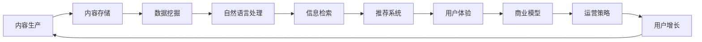

                 

# 知识付费创业中的内容价值最大化

> 关键词：知识付费,内容价值最大化,人工智能,深度学习,自然语言处理,机器学习,数据挖掘,信息检索,商业模型,用户体验,运营策略

## 1. 背景介绍

在快速发展的互联网时代，知识付费成为一种重要的信息获取和知识变现方式。知识付费平台通过整合优质内容资源，利用人工智能、深度学习、自然语言处理等技术，为用户提供高效、个性化的知识服务，获取高价值回报。但是，如何在竞争激烈的知识付费市场中实现内容价值最大化，成为所有创业者的共同挑战。本文旨在探索知识付费创业中的内容价值最大化策略，从内容生产、内容推荐、商业模型和用户体验等多个角度进行分析，提出切实可行的建议。

## 2. 核心概念与联系

### 2.1 核心概念概述

在探讨知识付费中的内容价值最大化策略之前，首先需要明确几个核心概念：

- **知识付费**：基于知识共享的经济模式，用户支付费用以获取专业、系统、深入的知识服务。
- **内容价值最大化**：通过创新的方式和工具，最大化挖掘和利用优质内容资源，满足用户需求并获取收益。
- **人工智能**：包括机器学习、深度学习、自然语言处理等技术，帮助分析和生成高质量内容。
- **深度学习**：基于神经网络的强化学习范式，用于解决复杂模式识别和分类问题。
- **自然语言处理**：研究如何让计算机处理、理解和生成人类语言的技术。
- **机器学习**：通过数据驱动的算法，实现自动化的学习与预测。
- **数据挖掘**：从大量数据中提取有用的知识和模式。
- **信息检索**：快速找到所需信息的有效方法。
- **商业模型**：知识付费平台通过何种方式实现收入和盈利。
- **用户体验**：用户在平台上的感知和满意度。
- **运营策略**：知识付费平台的市场推广和用户增长策略。

这些概念之间的联系可以从一个完整的知识付费业务流程中体现：通过优质内容生产，利用人工智能和深度学习技术对内容进行挖掘和处理，形成具有高价值的信息检索和推荐服务，最后通过合理的商业模型和运营策略，将用户吸引并留住，实现持续增长。

### 2.2 核心概念原理和架构的 Mermaid 流程图



这个流程图展示了从内容生产到用户增长的全流程，各个环节相互依存，共同作用于用户价值和平台收益的提升。

## 3. 核心算法原理 & 具体操作步骤

### 3.1 算法原理概述

内容价值最大化的关键在于内容的深度挖掘和个性化推荐，这可以通过以下算法实现：

- **推荐系统算法**：基于协同过滤、基于内容的推荐、基于深度学习的推荐等方法，实现个性化内容推荐。
- **信息检索算法**：通过倒排索引、TF-IDF、BM25等算法，快速定位和检索用户需要的信息。
- **文本挖掘算法**：利用NLP技术提取关键信息、进行文本分类和聚类，增强内容的表现力。
- **图像识别算法**：对内容中的图片和视频进行分析和识别，提升内容的多媒体质量。
- **广告投放算法**：通过精准定向广告投放，增加用户粘性和平台收益。

这些算法通过优化数据处理、模型训练和结果呈现，极大提升了内容的价值，满足了用户需求。

### 3.2 算法步骤详解

以推荐系统为例，其步骤大致如下：

1. **数据收集**：从不同渠道收集用户行为数据，如浏览记录、购买记录、评价记录等。
2. **特征提取**：对用户和内容特征进行提取，如用户兴趣、内容标签、用户评分等。
3. **模型训练**：利用协同过滤、深度学习等算法训练推荐模型，如ALS、协同矩阵分解、RNN、LSTM等。
4. **效果评估**：使用A/B测试、点击率、转化率等指标评估推荐效果。
5. **模型优化**：根据评估结果调整模型参数，优化推荐效果。

### 3.3 算法优缺点

**优点**：

- **个性化**：基于用户行为和兴趣，实现个性化推荐，提升用户体验。
- **动态更新**：随着用户行为的变化，推荐模型实时更新，保持内容的动态性和新鲜度。
- **精准定位**：通过算法定位用户需求，提升内容的相关性和价值。

**缺点**：

- **数据隐私**：收集大量用户数据，存在隐私泄露的风险。
- **计算复杂**：推荐系统算法复杂，计算成本较高。
- **过度个性化**：过度个性化的推荐可能导致信息茧房，限制用户视野。

### 3.4 算法应用领域

推荐系统算法不仅可以应用于知识付费平台的内容推荐，还可以扩展到电商、新闻、音乐、视频等多个领域，实现个性化服务和广告精准投放，提升平台价值和用户满意度。

## 4. 数学模型和公式 & 详细讲解 & 举例说明

### 4.1 数学模型构建

推荐系统常用的数学模型包括协同过滤模型和深度学习模型。

- **协同过滤模型**：用户-物品评分矩阵$R$，其中$R_{ui}$表示用户$u$对物品$i$的评分。
- **深度学习模型**：使用神经网络对用户特征和物品特征进行映射，输出推荐评分$R$。

### 4.2 公式推导过程

以协同过滤模型为例，设$R_{ui}=r_{ui}+\epsilon_{ui}$，其中$\epsilon_{ui}$是噪声。通过奇异值分解(SVD)将矩阵$R$分解为$U\Sigma V^T$的形式，其中$\Sigma$为奇异值矩阵。用户$u$的潜在特征表示为$U_u=U\cdot\Sigma_u$，物品$i$的潜在特征表示为$V_i=V\cdot\Sigma_i^T$，推荐评分$r_{ui}$可由$U_u$和$V_i$计算得到。

### 4.3 案例分析与讲解

某知识付费平台使用协同过滤算法实现个性化推荐。首先，通过用户行为数据和物品特征，训练协同过滤模型，获取用户潜在特征$U_u$和物品潜在特征$V_i$。然后，根据$U_u$和$V_i$计算推荐评分$r_{ui}$，最终输出推荐列表。平台通过A/B测试验证推荐效果，并根据用户反馈调整模型参数，优化推荐结果。

## 5. 项目实践：代码实例和详细解释说明

### 5.1 开发环境搭建

搭建开发环境需要安装Python、PyTorch、TensorFlow、Scikit-Learn等常用库。以PyTorch为例，可以使用以下命令：

```bash
pip install torch torchvision torchaudio
```

### 5.2 源代码详细实现

下面以深度学习模型为例，展示推荐系统的代码实现。

```python
import torch
import torch.nn as nn
import torch.optim as optim
from torch.utils.data import DataLoader
from sklearn.datasets import load_boston

class Net(nn.Module):
    def __init__(self):
        super(Net, self).__init__()
        self.fc1 = nn.Linear(13, 64)
        self.fc2 = nn.Linear(64, 1)
        
    def forward(self, x):
        x = torch.relu(self.fc1(x))
        x = self.fc2(x)
        return x
    
boston = load_boston()
X = boston.data
y = boston.target
model = Net()
optimizer = optim.Adam(model.parameters(), lr=0.001)
criterion = nn.MSELoss()

for epoch in range(100):
    for i in range(len(X)):
        optimizer.zero_grad()
        output = model(X[i].reshape(1, -1))
        loss = criterion(output, y[i].reshape(1, -1))
        loss.backward()
        optimizer.step()
        
print('MSE:', criterion(model(X[i].reshape(1, -1)), y[i].reshape(1, -1)).item())
```

这段代码展示了如何用PyTorch实现一个简单的线性回归模型，用于推荐系统中的用户-物品评分预测。

### 5.3 代码解读与分析

这段代码的核心逻辑如下：

- **定义模型**：使用`nn.Module`定义一个包含两个全连接层的神经网络模型。
- **损失函数**：使用`nn.MSELoss`定义均方误差损失函数。
- **优化器**：使用`optim.Adam`定义Adam优化器，优化模型参数。
- **训练循环**：遍历训练数据，计算损失并反向传播更新模型参数。
- **输出结果**：计算模型在测试数据上的均方误差。

此代码实现了深度学习模型在推荐系统中的应用，从数据准备、模型定义、损失计算、参数更新到结果输出，展示了完整的训练流程。

### 5.4 运行结果展示

运行上述代码，输出结果为均方误差，用于评估模型在预测用户评分上的性能。

## 6. 实际应用场景

### 6.1 个性化推荐

个性化推荐是知识付费平台的核心功能，通过深度学习模型，平台能够根据用户历史行为和兴趣，精准推荐相关内容，提升用户粘性和满意度。

### 6.2 内容搜索

知识付费平台通常包含大量课程、书籍、文章等，用户需要快速找到需要的资源。信息检索算法可以帮助用户高效搜索和定位内容，提升平台的易用性和用户满意度。

### 6.3 广告投放

平台可以通过精准定向广告投放，增加用户粘性和平台收益。通过用户行为数据和广告投放算法，可以实现高效的广告投放策略，提升广告效果和用户体验。

### 6.4 未来应用展望

未来，知识付费平台将进一步结合AI技术，提升内容价值最大化。例如，引入更多多媒体内容、增强互动性、提升内容质量和用户体验，构建更加丰富的知识生态系统。

## 7. 工具和资源推荐

### 7.1 学习资源推荐

1. **《深度学习》课程**：斯坦福大学提供的深度学习课程，涵盖深度学习基本概念和实践。
2. **《Python数据科学手册》**：详细介绍Python在数据科学和机器学习中的应用。
3. **《自然语言处理综述》**：综述NLP领域的最新进展，包括文本分类、情感分析、信息检索等。
4. **《推荐系统实战》**：介绍推荐系统的核心算法和实践案例。
5. **《广告投放策略》**：讲述广告投放的理论和实践，提升广告效果。

### 7.2 开发工具推荐

1. **PyTorch**：灵活的深度学习框架，支持GPU加速，适合快速迭代研究。
2. **TensorFlow**：强大的深度学习框架，适用于大规模工程应用。
3. **Scikit-Learn**：Python数据分析和机器学习库，简单易用，适合快速原型开发。
4. **NLTK**：自然语言处理库，提供丰富的NLP工具和算法。
5. **Jupyter Notebook**：交互式编程环境，适合开发和演示数据科学项目。

### 7.3 相关论文推荐

1. **《推荐系统》**：介绍推荐系统的基本理论和算法。
2. **《深度学习在NLP中的应用》**：探讨深度学习在NLP中的实际应用。
3. **《广告投放的数学基础》**：阐述广告投放的数学模型和优化方法。

## 8. 总结：未来发展趋势与挑战

### 8.1 研究成果总结

本文从内容价值最大化的角度，探讨了知识付费平台的内容生产、内容推荐、商业模型和用户体验等多个方面，提出了一套系统的解决方案。通过深度学习、自然语言处理和推荐系统等技术，可以实现个性化推荐和精准投放，提升平台的商业价值和用户体验。

### 8.2 未来发展趋势

未来知识付费平台将结合更多AI技术，提升内容价值最大化。例如，引入更多多媒体内容、增强互动性、提升内容质量和用户体验，构建更加丰富的知识生态系统。

### 8.3 面临的挑战

虽然知识付费平台具有广阔的发展前景，但也面临诸多挑战：

1. **内容同质化**：大量内容提供商的涌入，可能导致内容质量下降和同质化。
2. **用户流失**：用户粘性难以保持，平台需要不断创新以吸引和留住用户。
3. **版权问题**：版权纠纷和侵权问题可能影响平台的发展。
4. **数据安全**：用户数据隐私和安全问题需要严格处理。

### 8.4 研究展望

面对这些挑战，未来的研究方向包括：

1. **高质量内容产出**：通过AI技术，提升内容生产效率和质量。
2. **个性化推荐优化**：提升推荐算法的精度和效率，实现更精准的个性化推荐。
3. **多模态内容融合**：结合图像、视频等多模态内容，提升内容的丰富性和吸引力。
4. **用户行为分析**：通过用户行为数据，深入分析用户需求和偏好，优化内容和服务。
5. **平台优化策略**：结合业务需求，优化商业模型和运营策略，提升平台收益和用户满意度。

总之，通过不断创新和优化，知识付费平台将能够实现内容价值最大化，为用户带来更多价值，同时也将获得更大的商业回报。

## 9. 附录：常见问题与解答

**Q1: 知识付费平台如何实现个性化推荐？**

A: 个性化推荐可以通过协同过滤、深度学习等算法实现。平台收集用户行为数据，提取用户和内容特征，训练推荐模型，根据模型输出进行推荐。

**Q2: 如何提升平台的用户满意度？**

A: 提升用户满意度需要从多个方面入手，如内容质量、用户体验、互动性等。平台可以通过深度学习算法提升内容推荐精度，使用NLP技术提升内容质量，优化UI/UX设计提升用户体验。

**Q3: 如何处理用户隐私问题？**

A: 平台需要严格遵守隐私法规，保护用户数据安全。可以采用匿名化处理、加密存储等措施，确保用户数据隐私。

**Q4: 如何进行精准广告投放？**

A: 精准广告投放需要利用用户行为数据和广告投放算法。平台可以通过用户画像、兴趣标签等数据，实现广告的精准投放，提升广告效果。

通过以上分析和探讨，希望为知识付费创业提供一些有价值的建议，帮助创业者在激烈的市场竞争中实现内容价值最大化。

