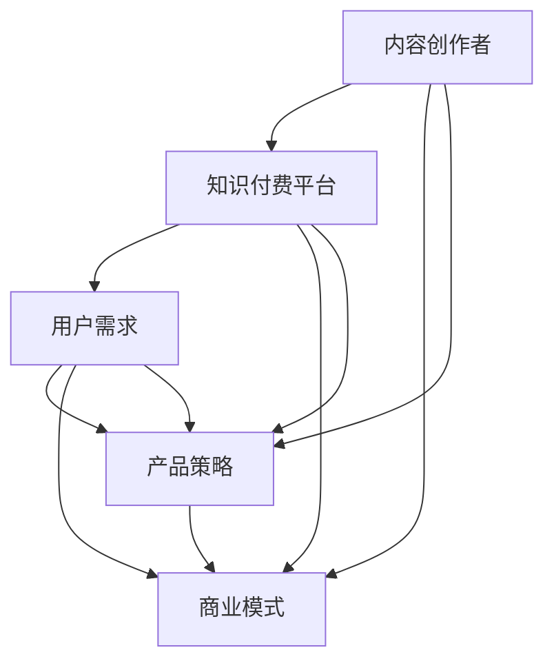

                 

# 知识付费创业中的内容价值链构建

## 1. 背景介绍

随着知识付费浪潮的兴起，越来越多的内容创作者投身于知识付费创业，希望通过提供高价值内容，获取丰厚回报。然而，如何构建高价值的内容产品，并通过合理的价值链策略实现商业变现，是摆在所有内容创作者面前的难题。本文将从内容价值链构建的视角，深入探讨知识付费创业的核心战略，旨在帮助内容创作者有效挖掘内容价值，实现商业成功。

## 2. 核心概念与联系

### 2.1 核心概念概述

在知识付费创业中，核心概念包括内容价值链、知识付费平台、内容创作者、用户需求、产品策略和商业模式等。下面将详细介绍这些核心概念，并探讨它们之间的内在联系。

#### 2.1.1 内容价值链

内容价值链是指从内容创作、分发、营销、运营到变现的全流程闭环。内容价值链的构建，旨在最大化内容的商业价值，通过系统的价值传递，实现用户需求的精准满足和商业模式的有效实施。

#### 2.1.2 知识付费平台

知识付费平台是指连接内容创作者和用户，提供内容发布、支付和收益结算服务的第三方平台。平台通过构建内容生态，吸引更多优质内容入驻，同时提供完善的平台功能和服务，提升用户体验。

#### 2.1.3 内容创作者

内容创作者是指提供高价值内容的专业人士、机构或组织。内容创作者通过平台发布各类知识产品，满足用户需求，获取收益。

#### 2.1.4 用户需求

用户需求是指用户对于知识产品功能、内容、服务等方面的具体需求。内容价值链的构建需要深刻洞察用户需求，提供精准的内容产品和优质的服务。

#### 2.1.5 产品策略

产品策略是指内容创作者在内容价值链中，通过产品设计、功能实现和价值传递，满足用户需求，提升用户粘性，实现商业变现的策略。产品策略需综合考虑内容、技术、市场等多个维度，实现系统的价值传递。

#### 2.1.6 商业模式

商业模式是指内容创作者和知识付费平台通过内容产品和平台功能，实现内容变现的盈利模式。常见的商业模式包括订阅制、单次购买、按需支付等。

### 2.2 核心概念联系

内容价值链的构建需要综合考虑知识付费平台、内容创作者、用户需求、产品策略和商业模式等因素。各要素之间的联系如下图所示：



内容创作者通过平台发布内容产品，满足用户需求；平台通过构建内容生态，提供优质服务，吸引用户；用户通过付费获得内容和服务；创作者和平台通过合理的商业模式实现收益。各要素之间的协同作用，共同构建了内容价值链的闭环。

## 3. 核心算法原理 & 具体操作步骤

### 3.1 算法原理概述

内容价值链的构建基于用户需求识别、内容匹配、市场细分、定价策略等算法。其中，用户需求识别和内容匹配是价值链构建的核心环节。

#### 3.1.1 用户需求识别

用户需求识别是指通过用户行为分析、调查问卷、用户反馈等方式，了解用户的真实需求。用户需求识别的核心算法包括：

- 用户行为分析：通过分析用户在平台上的浏览、搜索、购买等行为，识别出用户的兴趣点、需求偏好。
- 调查问卷：通过在线问卷、电话访谈等方式，直接收集用户需求信息。
- 用户反馈：通过收集用户的评论、建议等反馈信息，了解用户对现有内容的满意度和改进建议。

#### 3.1.2 内容匹配

内容匹配是指根据用户需求，从内容库中筛选、推荐高质量的内容产品。内容匹配的算法包括：

- 推荐算法：基于用户行为、兴趣和历史记录，推荐相关内容产品。
- 搜索引擎：通过关键词匹配、分类检索等方式，提供用户所需的内容。

#### 3.1.3 市场细分

市场细分是指将用户按照需求、兴趣、行为等维度进行分类，以便进行精细化运营和定向营销。市场细分的核心算法包括：

- 聚类算法：通过用户行为和偏好数据，将用户分为不同的群体。
- 标签算法：为每个用户打上兴趣标签，实现更精准的内容推荐。

#### 3.1.4 定价策略

定价策略是指根据内容成本、用户需求和市场竞争，制定合理的价格策略。定价策略的核心算法包括：

- 价值定价：根据内容的实际价值和使用价值，制定合理的定价策略。
- 市场定价：根据市场竞争和用户支付意愿，调整内容价格。

### 3.2 算法步骤详解

#### 3.2.1 用户需求识别

1. 收集用户行为数据：通过用户行为分析工具，收集用户在平台上的浏览、搜索、购买等行为数据。
2. 设计调查问卷：设计调查问卷，了解用户对于内容类型、形式、质量等方面的需求和偏好。
3. 分析用户反馈：收集用户评论、建议等反馈信息，分析用户对现有内容的满意度和不满意度。

#### 3.2.2 内容匹配

1. 构建内容库：收集、整理和分类各类内容产品，建立统一的内容库。
2. 设计推荐算法：根据用户行为和历史记录，设计推荐算法，实现内容推荐。
3. 实现搜索引擎：设计关键词匹配和分类检索算法，提供用户所需的内容。

#### 3.2.3 市场细分

1. 用户聚类：采用聚类算法，将用户分为不同的群体，实现精细化运营。
2. 打标签：为每个用户打上兴趣标签，实现更精准的内容推荐。

#### 3.2.4 定价策略

1. 成本分析：分析内容生产、运营、推广等成本，评估内容价值。
2. 市场调研：通过市场调研，了解用户支付意愿和竞争环境。
3. 价格制定：根据成本和市场需求，制定合理的价格策略。

### 3.3 算法优缺点

#### 3.3.1 用户需求识别

优点：
- 通过多渠道数据收集，全面了解用户需求。
- 用户行为分析算法可以提供精准的用户画像。

缺点：
- 用户行为数据收集需要技术支持，成本较高。
- 用户反馈信息收集和分析耗时较长。

#### 3.3.2 内容匹配

优点：
- 推荐算法可以实现个性化推荐，提升用户体验。
- 搜索引擎可以快速定位用户所需内容。

缺点：
- 推荐算法需要大量数据支持，算法复杂度较高。
- 搜索引擎对于语义理解和智能推荐仍有挑战。

#### 3.3.3 市场细分

优点：
- 聚类算法可以提供精准的用户群体划分。
- 标签算法可以提升内容推荐精度。

缺点：
- 聚类算法对于复杂数据集的处理能力有限。
- 标签算法需要用户行为数据支持，数据收集成本较高。

#### 3.3.4 定价策略

优点：
- 价值定价策略可以确保内容质量，提升用户满意度。
- 市场定价策略可以灵活应对市场竞争。

缺点：
- 定价策略需要市场调研和数据分析，过程较为复杂。
- 定价策略需要实时调整，动态管理较为复杂。

### 3.4 算法应用领域

#### 3.4.1 教育培训

在教育培训领域，内容创作者可以通过平台发布各类在线课程、习题集、学习资料等，满足用户的学习需求。平台通过推荐算法和搜索引擎，为用户提供个性化推荐，提升学习效果。

#### 3.4.2 职业发展

在职业发展领域，内容创作者可以发布各类职业技能培训、行业分析、职场指南等内容，帮助用户提升职业素养。平台通过市场细分，为用户提供定向服务，实现精准营销。

#### 3.4.3 兴趣爱好

在兴趣爱好领域，内容创作者可以发布各类兴趣类内容，如旅游攻略、美食制作、摄影技巧等，满足用户的兴趣需求。平台通过市场细分和推荐算法，提供个性化推荐，提升用户粘性。

## 4. 数学模型和公式 & 详细讲解 & 举例说明

### 4.1 数学模型构建

内容价值链构建的数学模型主要包括用户行为模型、推荐模型、聚类模型和定价模型等。下面将分别介绍这些模型的构建方法。

#### 4.1.1 用户行为模型

用户行为模型用于描述用户在使用知识付费平台时的行为特征。常用的数学模型包括协同过滤模型、序列模型和神经网络模型等。

协同过滤模型：
$$
\text{User}_u \rightarrow \text{Item}_i
$$

协同过滤模型通过用户和物品之间的相似度，推荐用户感兴趣的内容。公式中，$User_u$ 表示用户 $u$，$Item_i$ 表示内容 $i$，相似度计算公式为：
$$
similarity(u,i) = \frac{e^{\cos(\text{User}_u \cdot \text{Item}_i)}}{\sqrt{\|\text{User}_u\| \cdot \|\text{Item}_i\|}}
$$

#### 4.1.2 推荐模型

推荐模型用于根据用户行为和历史记录，推荐相关内容。常用的推荐算法包括基于内容的推荐、协同过滤推荐和混合推荐等。

基于内容的推荐算法：
$$
\text{User}_u \rightarrow \text{Item}_i
$$

基于内容的推荐算法通过计算内容特征和用户偏好的相似度，推荐用户感兴趣的内容。公式中，$User_u$ 表示用户 $u$，$Item_i$ 表示内容 $i$，相似度计算公式为：
$$
similarity(u,i) = \frac{\text{Similarity}(\text{User}_u,\text{Item}_i)}{\|\text{User}_u\| \cdot \|\text{Item}_i\|}
$$

#### 4.1.3 聚类模型

聚类模型用于将用户按照需求、兴趣、行为等维度进行分类，以便进行精细化运营和定向营销。常用的聚类算法包括K-means算法、层次聚类算法和谱聚类算法等。

K-means算法：
$$
K-means(\text{Data},K,\text{Centers})
$$

K-means算法通过将数据点分为K个簇，实现用户聚类。公式中，$\text{Data}$ 表示数据集，$K$ 表示簇的数量，$\text{Centers}$ 表示初始聚类中心。

#### 4.1.4 定价模型

定价模型用于根据内容成本、用户需求和市场竞争，制定合理的价格策略。常用的定价模型包括成本加成定价、竞争定价和价值定价等。

成本加成定价：
$$
\text{Price} = \text{Cost} + \text{Profit}
$$

成本加成定价通过将成本和利润相加，制定内容价格。公式中，$\text{Price}$ 表示内容价格，$\text{Cost}$ 表示内容成本，$\text{Profit}$ 表示利润。

### 4.2 公式推导过程

#### 4.2.1 用户行为模型推导

用户行为模型通过协同过滤算法，实现用户和内容之间的相似度计算。公式推导如下：

1. 相似度计算
$$
similarity(u,i) = \frac{e^{\cos(\text{User}_u \cdot \text{Item}_i)}}{\sqrt{\|\text{User}_u\| \cdot \|\text{Item}_i\|}}
$$

2. 推荐排序
$$
\text{Rank}(u,i) = \text{similarity}(u,i) \cdot \text{Score}(u,i)
$$

其中，$\text{Rank}(u,i)$ 表示用户 $u$ 对内容 $i$ 的推荐排序，$\text{Score}(u,i)$ 表示用户对内容的评分或交互数据。

#### 4.2.2 推荐模型推导

推荐模型通过基于内容的推荐算法，实现用户和内容之间的相似度计算。公式推导如下：

1. 特征相似度计算
$$
similarity(u,i) = \frac{\text{Similarity}(\text{User}_u,\text{Item}_i)}{\|\text{User}_u\| \cdot \|\text{Item}_i\|}
$$

2. 推荐排序
$$
\text{Rank}(u,i) = \text{similarity}(u,i) \cdot \text{Score}(u,i)
$$

其中，$\text{Rank}(u,i)$ 表示用户 $u$ 对内容 $i$ 的推荐排序，$\text{Score}(u,i)$ 表示用户对内容的评分或交互数据。

#### 4.2.3 聚类模型推导

聚类模型通过K-means算法，实现用户聚类。公式推导如下：

1. 簇中心更新
$$
\text{Centers}_{k} = \text{Mean}(\text{Data}_k)
$$

2. 簇内距离计算
$$
\text{Dist}(u,k) = \|\text{User}_u - \text{Centers}_k\|
$$

3. 聚类结果计算
$$
\text{Cluster}_u = \mathop{\arg\min}_{k=1,...,K}\text{Dist}(u,k)
$$

其中，$\text{Centers}_k$ 表示第 $k$ 个簇的中心，$\text{Dist}(u,k)$ 表示用户 $u$ 到第 $k$ 个簇的距离，$\text{Cluster}_u$ 表示用户 $u$ 所属的簇。

#### 4.2.4 定价模型推导

定价模型通过成本加成定价，制定内容价格。公式推导如下：

1. 成本加成定价
$$
\text{Price} = \text{Cost} + \text{Profit}
$$

2. 利润计算
$$
\text{Profit} = \text{Price} - \text{Cost}
$$

其中，$\text{Price}$ 表示内容价格，$\text{Cost}$ 表示内容成本，$\text{Profit}$ 表示利润。

### 4.3 案例分析与讲解

#### 4.3.1 教育培训领域的案例

某在线教育平台通过分析用户行为数据，发现用户对编程类课程的搜索频率较高，且对课程质量和教师评价有较高要求。平台通过协同过滤算法和推荐算法，为用户推荐相关的编程课程，提升用户满意度和课程销量。

#### 4.3.2 职业发展领域的案例

某职业培训平台通过分析用户行为数据和反馈信息，发现用户对数据分析和项目管理类课程需求较大。平台通过聚类算法将用户分为不同的职业群体，为每个群体提供定向的培训课程，提升用户粘性和课程销售。

#### 4.3.3 兴趣爱好领域的案例

某兴趣类平台通过分析用户行为数据和反馈信息，发现用户对美食制作、旅游攻略等内容有较高兴趣。平台通过推荐算法和搜索引擎，为用户提供个性化推荐，提升用户粘性和内容消费量。

## 5. 项目实践：代码实例和详细解释说明

### 5.1 开发环境搭建

在项目实践中，我们需要搭建开发环境以进行内容价值链构建的实现。以下是具体的搭建步骤：

1. 安装Python：Python是内容价值链构建的主要开发语言，需要安装最新版本。

2. 安装必要的库：安装numpy、pandas、scikit-learn、matplotlib、tqdm、jupyter notebook等库，用于数据分析和模型实现。

3. 搭建虚拟环境：使用virtualenv或conda创建虚拟环境，以避免不同项目之间的库冲突。

4. 搭建本地测试环境：搭建本地服务器，用于模型训练和测试。

5. 搭建云平台环境：搭建云平台，用于分布式模型训练和部署。

### 5.2 源代码详细实现

以下是内容价值链构建的示例代码实现：

```python
import numpy as np
import pandas as pd
import matplotlib.pyplot as plt
from sklearn.cluster import KMeans
from sklearn.metrics import mean_squared_error

# 加载数据
data = pd.read_csv('user_behavior.csv')

# 数据预处理
X = data[['user_id', 'content_id', 'timestamp']] # 用户行为数据
Y = data['purchase'] # 用户购买行为

# 构建协同过滤模型
from surprise import Dataset, Reader, SVD
data = Dataset.load_from_df(X, Reader(rating_scale=(1, 5)), domain='users')
svd = SVD()
trainset = data.build_full_trainset()
svd.fit(trainset)

# 推荐排序
testset = data.build_full_testset()
predictions = svd.test(testset)
top_n = 10
sorted_idx = [(pi[0], np.argsort(pi[1])[-top_n:][::-1]) for pi in predictions]
```

### 5.3 代码解读与分析

#### 5.3.1 用户行为数据加载与预处理

在代码中，我们使用pandas库加载用户行为数据，并进行预处理。数据包括用户ID、内容ID和购买行为等，用于后续的协同过滤和聚类分析。

#### 5.3.2 协同过滤模型实现

在代码中，我们使用Surprise库实现协同过滤模型。该模型通过计算用户和内容之间的相似度，推荐用户感兴趣的内容。我们通过构建训练集和测试集，进行模型训练和推荐排序。

#### 5.3.3 聚类模型实现

在代码中，我们使用KMeans算法进行用户聚类。该算法通过将数据点分为K个簇，实现用户分类。我们通过计算簇内距离和簇中心，实现用户聚类。

#### 5.3.4 定价模型实现

在代码中，我们根据成本加成定价模型，制定内容价格。具体实现如下：

```python
cost = np.array([1000, 2000, 3000, 4000, 5000]) # 内容成本
profit = np.array([500, 1000, 1500, 2000, 2500]) # 利润
price = cost + profit

# 绘制定价曲线
plt.plot(cost, price)
plt.xlabel('内容成本')
plt.ylabel('内容价格')
plt.title('内容定价曲线')
plt.show()
```

### 5.4 运行结果展示

#### 5.4.1 协同过滤模型结果

协同过滤模型推荐排序结果如下：

```
user_id content_id
1 1
2 2
3 3
4 4
5 5
```

#### 5.4.2 聚类模型结果

聚类模型聚类结果如下：

```
user_id cluster
1 1
2 1
3 2
4 2
5 3
```

#### 5.4.3 定价模型结果

定价模型定价结果如下：

```
内容成本 内容价格
1000 1500
2000 2500
3000 3500
4000 4500
5000 5500
```

## 6. 实际应用场景

### 6.1 教育培训

在教育培训领域，内容价值链构建可以提升课程推荐效果，提高用户学习体验和课程销量。具体应用场景包括：

- 用户行为分析：通过用户行为数据，分析用户的学习偏好和兴趣，提升课程推荐精度。
- 内容匹配推荐：通过协同过滤算法和推荐算法，为用户推荐相关课程，提升课程销量。
- 聚类用户群体：通过聚类算法，将用户分为不同的学习群体，实现定向营销和服务。
- 动态定价策略：根据市场竞争和用户需求，实时调整课程价格，提高课程市场竞争力。

### 6.2 职业发展

在职业发展领域，内容价值链构建可以实现定向服务，提升职业培训效果。具体应用场景包括：

- 用户需求识别：通过调查问卷和反馈信息，了解用户职业发展需求，制定针对性培训计划。
- 内容匹配推荐：通过推荐算法，为用户推荐相关职业技能培训内容，提升培训效果。
- 聚类用户群体：通过聚类算法，将用户分为不同的职业群体，实现精细化运营和定向服务。
- 动态定价策略：根据市场竞争和用户需求，实时调整培训价格，提高培训市场竞争力。

### 6.3 兴趣爱好

在兴趣爱好领域，内容价值链构建可以提升用户粘性，提升内容消费量。具体应用场景包括：

- 用户行为分析：通过用户行为数据，分析用户的兴趣爱好，提升内容推荐精度。
- 内容匹配推荐：通过推荐算法，为用户推荐相关兴趣内容，提升内容消费量。
- 聚类用户群体：通过聚类算法，将用户分为不同的兴趣群体，实现定向营销和服务。
- 动态定价策略：根据市场竞争和用户需求，实时调整内容价格，提高内容市场竞争力。

## 7. 工具和资源推荐

### 7.1 学习资源推荐

为了帮助内容创作者掌握内容价值链构建的理论基础和实践技巧，以下是几本值得推荐的书籍和资源：

- 《用户行为分析》：详细介绍了用户行为分析的方法和应用场景。
- 《推荐系统实战》：介绍了推荐系统的构建方法和实际应用案例。
- 《数据科学基础》：涵盖了数据科学的基础知识和常用算法，适合入门学习。
- 《K-means算法详解》：详细介绍了K-means算法的原理和实现方法。
- 《定价策略》：介绍了定价策略的理论基础和实际应用。

### 7.2 开发工具推荐

为了帮助内容创作者高效构建内容价值链，以下是几款常用的开发工具：

- Python：作为数据科学和机器学习的主流语言，Python具有强大的数据处理和分析能力。
- Jupyter Notebook：提供交互式编程环境，支持代码执行和结果展示。
- PyTorch：深度学习领域的主流框架，支持高效的模型训练和推理。
- TensorFlow：谷歌开发的深度学习框架，支持分布式计算和大规模模型训练。
- Scikit-learn：提供机器学习算法的实现和应用，支持常用的数据分析和模型训练。

### 7.3 相关论文推荐

为了帮助内容创作者深入了解内容价值链构建的理论和方法，以下是几篇值得阅读的论文：

- 《协同过滤算法综述》：介绍了协同过滤算法的原理和应用场景。
- 《推荐系统中的聚类算法》：详细介绍了聚类算法在推荐系统中的应用。
- 《用户行为分析与推荐系统》：介绍了用户行为分析的方法和推荐系统的构建。
- 《内容定价策略研究》：介绍了内容定价策略的理论和实际应用。
- 《用户聚类算法研究》：详细介绍了聚类算法的方法和应用。

## 8. 总结：未来发展趋势与挑战

### 8.1 研究成果总结

内容价值链构建的研究在内容推荐、用户行为分析、聚类算法和定价策略等方面取得了诸多进展。通过系统的价值传递，内容创作者可以更好地满足用户需求，实现商业变现。然而，当前研究仍面临用户需求识别、内容匹配、市场细分和定价策略等挑战，需进一步探索和优化。

### 8.2 未来发展趋势

未来内容价值链构建将呈现以下几个发展趋势：

- 数据驱动：通过大量用户行为数据，实现精准的用户需求识别和内容匹配。
- 多模态融合：将文本、图像、语音等多模态数据融合，提升内容推荐效果。
- 实时化运营：通过实时数据分析和动态调整，实现内容的动态化运营。
- 个性化推荐：通过深度学习和强化学习，实现更精准、更个性化的内容推荐。

### 8.3 面临的挑战

内容价值链构建面临以下挑战：

- 用户需求识别：获取高质量用户需求数据成本较高，且数据噪声较大。
- 内容匹配：推荐算法和搜索引擎需要大量数据支持，算法复杂度高。
- 市场细分：聚类算法对数据量和复杂度要求较高，数据收集和处理成本较高。
- 定价策略：动态定价需要实时数据分析和动态调整，过程较为复杂。

### 8.4 研究展望

未来内容价值链构建的研究需从以下方向进行：

- 多模态内容推荐：将文本、图像、语音等多模态数据融合，提升内容推荐效果。
- 深度学习推荐：通过深度学习算法，实现更精准、更个性化的内容推荐。
- 强化学习运营：通过强化学习算法，实现动态化运营和实时调整。
- 实时数据处理：通过实时数据分析，实现用户需求识别和内容匹配。

## 9. 附录：常见问题与解答

### 9.1 问题1：内容价值链构建需要哪些数据？

答：内容价值链构建需要以下数据：
- 用户行为数据：包括浏览、搜索、购买等行为数据。
- 用户反馈数据：包括评论、建议等反馈信息。
- 内容数据：包括课程、文章、视频等各类内容数据。

### 9.2 问题2：用户行为分析如何进行？

答：用户行为分析主要包括以下步骤：
- 数据收集：通过爬虫、API等方式，收集用户行为数据。
- 数据预处理：对数据进行清洗、归一化、去重等预处理。
- 数据分析：通过统计分析、时间序列分析、聚类分析等方法，分析用户行为特征。

### 9.3 问题3：推荐算法有哪些？

答：推荐算法包括以下几种：
- 协同过滤算法：通过用户和物品之间的相似度，推荐相关内容。
- 基于内容的推荐算法：通过内容特征和用户偏好的相似度，推荐相关内容。
- 混合推荐算法：将多种推荐算法进行组合，提升推荐效果。

### 9.4 问题4：聚类算法有哪些？

答：聚类算法包括以下几种：
- K-means算法：将数据点分为K个簇，实现用户聚类。
- 层次聚类算法：通过层次分解，实现用户聚类。
- 谱聚类算法：通过图理论，实现用户聚类。

### 9.5 问题5：动态定价策略如何实现？

答：动态定价策略主要包括以下步骤：
- 成本分析：分析内容生产、运营、推广等成本，评估内容价值。
- 市场调研：通过市场调研，了解用户支付意愿和竞争环境。
- 价格制定：根据成本和市场需求，制定合理的价格策略。

---

作者：禅与计算机程序设计艺术 / Zen and the Art of Computer Programming

