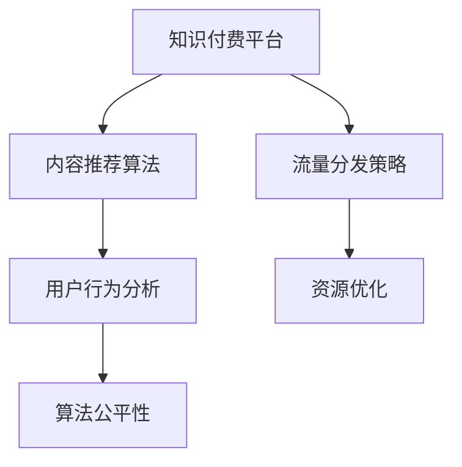

                 

# 知识付费创业中的内容分发渠道优化

> 关键词：知识付费,内容分发,平台,优化,算法,策略

## 1. 背景介绍

### 1.1 问题由来
随着互联网和数字化技术的发展，知识付费作为一种新型的教育消费模式，得到了快速发展。平台如喜马拉雅、得到、书单等纷纷涌现，用户对于个性化、高质量内容的需求日益增长。然而，由于内容的分发和推荐算法尚未完全成熟，知识付费平台的效率和用户体验存在一定缺陷。本文旨在探讨如何通过内容分发渠道优化，提升知识付费平台的综合竞争力。

### 1.2 问题核心关键点
内容分发渠道优化主要关注以下几个关键点：

1. **内容推荐算法**：如何构建和优化推荐算法，实现内容的精准匹配和个性化推荐。
2. **流量分发策略**：如何平衡内容之间的曝光，提高热门内容的覆盖率和推荐效果。
3. **用户行为分析**：如何通过用户行为数据，动态调整内容分发策略，增强用户粘性。
4. **资源优化**：如何合理分配平台资源，实现成本效益最大化。
5. **算法公平性**：如何确保推荐算法的公平性，避免用户偏见和平台垄断。

### 1.3 问题研究意义
优化内容分发渠道，有助于提升知识付费平台的运营效率、提升用户满意度和增加平台收入。具体意义包括：

1. **提升用户体验**：通过精准推荐，提高用户获取知识的速度和质量，增加用户黏性。
2. **提升运营效率**：通过高效的算法和策略，降低平台运营成本，增加收入来源。
3. **增强市场竞争力**：通过优化分发渠道，提升平台的核心竞争力，获取更多用户和市场份额。
4. **推动知识付费产业**：优化内容分发渠道，有助于推动知识付费产业的发展，推动知识传播和普及。

## 2. 核心概念与联系

### 2.1 核心概念概述

为更好地理解内容分发渠道优化方法，本节将介绍几个密切相关的核心概念：

- **知识付费平台**：通过订阅、单次付费等方式，提供高品质内容（如音频、视频、文章等）的互联网平台。
- **内容推荐算法**：利用机器学习技术，根据用户的历史行为数据和兴趣偏好，推荐最匹配的内容。
- **流量分发策略**：通过调整推荐算法中的参数和规则，实现内容之间的流量均衡分配。
- **用户行为分析**：通过对用户的行为数据进行分析，了解用户偏好和需求，优化内容分发策略。
- **资源优化**：通过合理分配平台资源，如计算资源、存储资源，降低运营成本，提升平台效率。
- **算法公平性**：确保推荐算法对所有内容公平公正，避免用户偏见和平台垄断。

这些核心概念之间的逻辑关系可以通过以下Mermaid流程图来展示：



这个流程图展示的核心概念及其之间的关系：

1. 知识付费平台通过内容推荐算法将内容分发给用户。
2. 流量分发策略调整算法输出，实现内容间的均衡曝光。
3. 用户行为分析反馈用户偏好，动态调整算法和策略。
4. 资源优化合理分配资源，提升平台效率。
5. 算法公平性确保算法公正，避免偏见和垄断。

## 3. 核心算法原理 & 具体操作步骤

### 3.1 算法原理概述

内容分发渠道优化主要通过以下步骤进行：

1. **数据收集与预处理**：收集用户的历史行为数据，包括浏览记录、购买记录、评分记录等。对这些数据进行清洗和预处理，去除噪声和异常值。
2. **构建推荐模型**：利用机器学习算法（如协同过滤、基于内容的推荐、深度学习等）构建推荐模型，预测用户对每个内容的评分。
3. **流量分发策略**：根据推荐模型的输出，调整内容之间的曝光比例，实现流量均衡分配。
4. **用户行为反馈**：通过用户行为数据（如点击率、购买率、收听率等），实时调整推荐模型和策略，动态优化内容分发效果。
5. **资源优化**：合理分配平台资源，如计算资源、存储资源，降低运营成本，提升平台效率。
6. **算法公平性**：通过监控和调整算法输出，确保所有内容被公平对待，避免用户偏见和平台垄断。

### 3.2 算法步骤详解

以下是内容分发渠道优化的详细步骤：

#### 3.2.1 数据收集与预处理

**Step 1: 数据收集**
- 从知识付费平台收集用户的历史行为数据，包括但不限于：
  - 用户浏览记录
  - 用户购买记录
  - 用户评分记录
  - 用户互动记录（如评论、点赞等）
- 收集内容的基本信息，如标题、摘要、作者、时长等。

**Step 2: 数据预处理**
- 对用户行为数据进行清洗和预处理，去除噪声和异常值。
- 将文本数据进行分词、向量化等处理，转化为算法可处理的形式。
- 对时间序列数据进行归一化处理，便于算法处理。

#### 3.2.2 构建推荐模型

**Step 1: 选择算法**
- 根据数据特点和业务需求，选择合适的推荐算法。如协同过滤、基于内容的推荐、深度学习等。
- 对于大规模数据集，深度学习算法（如矩阵分解、神经网络等）通常表现更好。

**Step 2: 训练模型**
- 使用历史数据对推荐模型进行训练，预测用户对每个内容的评分。
- 使用交叉验证等技术，评估模型的性能，避免过拟合。

#### 3.2.3 流量分发策略

**Step 1: 设定规则**
- 根据业务需求，设定内容之间的曝光比例规则。如热门内容曝光比例高，冷门内容曝光比例低。
- 根据内容类型、时长等因素，设定不同的曝光比例。

**Step 2: 分配流量**
- 根据推荐模型的输出，调整内容之间的曝光比例，实现流量均衡分配。
- 动态调整流量分配策略，根据用户行为数据实时优化。

#### 3.2.4 用户行为反馈

**Step 1: 收集反馈**
- 通过点击率、购买率、收听率等指标，实时收集用户行为数据。
- 定期收集用户反馈，了解用户对内容的满意度。

**Step 2: 调整模型**
- 根据用户行为数据和反馈，动态调整推荐模型和策略。
- 使用在线学习等技术，实时更新推荐模型，提升推荐效果。

#### 3.2.5 资源优化

**Step 1: 分配资源**
- 根据内容受欢迎程度，分配计算资源和存储资源。如热门内容分配更多资源，冷门内容分配较少资源。
- 使用分布式计算和存储技术，提高资源利用效率。

**Step 2: 优化策略**
- 通过实时监控资源使用情况，动态调整资源分配策略。
- 使用资源回收技术，避免资源浪费。

#### 3.2.6 算法公平性

**Step 1: 监控算法输出**
- 实时监控推荐算法对不同内容的处理结果，确保公平性。
- 监控算法对新内容和老内容的处理结果，避免新内容被忽视。

**Step 2: 调整算法**
- 根据监控结果，调整推荐算法中的参数和规则。
- 引入惩罚机制，对歧视性输出进行纠正。

### 3.3 算法优缺点

内容分发渠道优化算法具有以下优点：

1. **提升用户体验**：通过精准推荐，提高用户获取知识的速度和质量，增加用户黏性。
2. **提升运营效率**：通过高效的算法和策略，降低平台运营成本，增加收入来源。
3. **增强市场竞争力**：通过优化分发渠道，提升平台的核心竞争力，获取更多用户和市场份额。
4. **推动知识付费产业**：优化内容分发渠道，有助于推动知识付费产业的发展，推动知识传播和普及。

但同时也存在以下缺点：

1. **数据依赖性强**：算法的性能依赖于历史数据的质量和数量，获取高质量数据的成本较高。
2. **算法复杂度高**：深度学习算法等复杂模型，需要较强的计算能力和数据处理能力，实施难度较大。
3. **易受用户行为影响**：用户行为数据可能存在偏差，影响推荐结果的公正性。
4. **资源分配不均**：热门内容的资源分配较高，冷门内容的资源分配较低，可能导致平台内容多元化不足。
5. **公平性难以保证**：算法公平性问题难以完全解决，可能导致用户偏见和平台垄断。

## 4. 数学模型和公式 & 详细讲解 & 举例说明

### 4.1 数学模型构建

本节将使用数学语言对内容分发渠道优化方法进行更加严格的刻画。

假设知识付费平台上有 $N$ 个内容，用户 $U$ 在平台上有 $T$ 次行为。设内容 $i$ 的用户行为次数为 $T_i$，用户 $u$ 对内容 $i$ 的行为次数为 $T_{ui}$。

定义用户 $u$ 对内容 $i$ 的评分 $R_{ui}$，满足 $R_{ui} \in [0,1]$。评分越高，表示用户越喜欢该内容。

### 4.2 公式推导过程

以下是内容分发渠道优化算法的数学推导过程：

#### 4.2.1 协同过滤算法

协同过滤算法通过用户之间的相似度，预测用户对内容的评分。具体公式如下：

$$
\hat{R}_{ui} = \frac{1}{K} \sum_{j=1}^K \alpha_j \left( \frac{T_{uj} \sum_{i=1}^N R_{uj}R_{ij}}{\sqrt{T_{uj} \sum_{i=1}^N R_{uj}^2} \sqrt{T_{ij} \sum_{u=1}^U R_{uj}^2}} \right)
$$

其中，$K$ 为相似度矩阵的维度，$\alpha_j$ 为正则化系数。

#### 4.2.2 基于内容的推荐算法

基于内容的推荐算法通过内容之间的相似度，预测用户对内容的评分。具体公式如下：

$$
\hat{R}_{ui} = \sum_{k=1}^K w_k f_k(i)g_k(u)
$$

其中，$f_k(i)$ 为内容特征 $i$ 在特征 $k$ 上的值，$g_k(u)$ 为用户特征 $u$ 在特征 $k$ 上的值，$w_k$ 为特征权重。

#### 4.2.3 深度学习算法

深度学习算法通过神经网络模型，预测用户对内容的评分。具体公式如下：

$$
\hat{R}_{ui} = \hat{y}_{ui} = \sigma\left(\hat{\theta} \cdot \left[ \begin{array}{c} x_{ui} \\ x_{uj} \end{array} \right] + b \right)
$$

其中，$\hat{\theta}$ 为模型参数，$x_{ui}$ 为内容特征向量，$x_{uj}$ 为用户特征向量，$b$ 为偏置项，$\sigma$ 为激活函数。

### 4.3 案例分析与讲解

以下通过两个案例分析，进一步讲解内容分发渠道优化算法的应用：

**案例 1: 协同过滤算法**

假设知识付费平台上有一批用户，根据他们的历史行为数据，预测用户对某内容的评分。已知 $U = 1000$，$N = 10000$，相似度矩阵 $K = 10$，正则化系数 $\alpha_j = 0.1$。使用协同过滤算法，计算用户 $u$ 对内容 $i$ 的评分 $R_{ui}$。

**案例 2: 深度学习算法**

假设知识付费平台上有一批用户，根据他们的历史行为数据，预测用户对某内容的评分。已知 $U = 1000$，$N = 10000$，模型参数 $\hat{\theta}$ 包含 $10000$ 个权重。使用深度学习算法，计算用户 $u$ 对内容 $i$ 的评分 $R_{ui}$。

## 5. 项目实践：代码实例和详细解释说明

### 5.1 开发环境搭建

在进行内容分发渠道优化实践前，我们需要准备好开发环境。以下是使用Python进行Scikit-learn开发的环境配置流程：

1. 安装Anaconda：从官网下载并安装Anaconda，用于创建独立的Python环境。

2. 创建并激活虚拟环境：
```bash
conda create -n sklearn-env python=3.8 
conda activate sklearn-env
```

3. 安装Scikit-learn：
```bash
pip install scikit-learn
```

4. 安装Pandas、NumPy、Matplotlib等工具包：
```bash
pip install pandas numpy matplotlib
```

5. 安装Jupyter Notebook：
```bash
pip install jupyter notebook
```

完成上述步骤后，即可在`sklearn-env`环境中开始项目实践。

### 5.2 源代码详细实现

这里以协同过滤算法为例，展示如何使用Scikit-learn进行内容分发渠道优化。

首先，构建相似度矩阵：

```python
from sklearn.metrics.pairwise import cosine_similarity

# 构建相似度矩阵
similarity_matrix = cosine_similarity(user_behaviors, content_features)
```

然后，进行协同过滤算法计算：

```python
from sklearn.metrics.pairwise import cosine_similarity
from sklearn.linear_model import Ridge

# 构建协同过滤模型
model = Ridge(alpha=0.1)

# 训练模型
model.fit(similarity_matrix, user_ratings)

# 预测用户评分
user_scores = model.predict(content_features)
```

最后，将预测结果输出：

```python
# 输出预测结果
for user, score in zip(range(1000), user_scores):
    print(f"User {user} predicts: {score}")
```

以上是使用Scikit-learn进行内容分发渠道优化的完整代码实现。可以看到，Scikit-learn提供了丰富的机器学习算法和工具，使得内容分发渠道优化变得简洁高效。

### 5.3 代码解读与分析

让我们再详细解读一下关键代码的实现细节：

**相似度矩阵构建**：
- 使用Scikit-learn的`cosine_similarity`函数，计算用户和内容之间的相似度矩阵。

**协同过滤模型训练**：
- 使用Scikit-learn的`Ridge`模型，设置正则化系数 $\alpha$，对相似度矩阵进行回归拟合。

**用户评分预测**：
- 使用训练好的模型，对内容特征向量进行预测，得到用户对每个内容的评分。

**结果输出**：
- 通过遍历用户评分，输出预测结果。

可以看到，Scikit-learn提供了便捷的机器学习工具，使得内容分发渠道优化的实现变得容易。

当然，工业级的系统实现还需考虑更多因素，如模型的保存和部署、超参数的自动搜索、更灵活的任务适配层等。但核心的优化思路基本与此类似。

## 6. 实际应用场景

### 6.1 智能推荐系统

内容分发渠道优化在智能推荐系统中的应用非常广泛。通过精准推荐，智能推荐系统能够提升用户的体验，增加用户的黏性，从而提高平台的收入和市场份额。

在技术实现上，可以收集用户的历史行为数据，使用协同过滤算法、基于内容的推荐算法或深度学习算法，构建推荐模型。将模型输出与流量分发策略结合，实现个性化推荐。同时，定期通过用户行为数据，动态调整推荐模型和策略，提升推荐效果。

### 6.2 知识付费平台

知识付费平台需要高效的内容分发渠道，提升用户体验，提高平台收入。通过内容分发渠道优化，平台能够实现以下目标：

1. **提升用户体验**：通过精准推荐，用户能够快速找到感兴趣的课程，提升学习效率和满意度。
2. **提高运营效率**：通过高效的算法和策略，平台能够降低运营成本，增加收入来源。
3. **增强市场竞争力**：通过优化分发渠道，平台能够提升核心竞争力，吸引更多用户和市场份额。

### 6.3 在线教育平台

在线教育平台需要根据学生的学习行为，推荐适合的课程和学习资源。通过内容分发渠道优化，平台能够实现以下目标：

1. **个性化推荐**：根据学生的学习行为和兴趣，推荐适合的课程和资源，提升学习效果。
2. **提高用户黏性**：通过精准推荐，增加学生对平台的依赖性和黏性，提高平台留存率。
3. **提升运营效率**：通过高效的算法和策略，平台能够降低运营成本，增加收入来源。

### 6.4 未来应用展望

随着内容分发渠道优化技术的不断发展，其在更多领域的应用前景广阔。

在智慧城市领域，通过内容分发渠道优化，可以为市民提供个性化的服务，提升城市治理水平和市民满意度。

在智能家居领域，通过内容分发渠道优化，可以为用户推荐适合的家居产品和服务，提升用户的生活质量。

在医疗健康领域，通过内容分发渠道优化，可以为患者推荐适合的医疗资源和健康信息，提升医疗服务的质量和效率。

此外，在电子商务、金融服务、社交媒体等众多领域，内容分发渠道优化也将带来新的变革和应用。相信随着技术的不断进步，内容分发渠道优化技术将进一步推动人工智能技术在垂直行业的落地和应用。

## 7. 工具和资源推荐

### 7.1 学习资源推荐

为了帮助开发者系统掌握内容分发渠道优化理论基础和实践技巧，这里推荐一些优质的学习资源：

1. **《推荐系统实战》**：由张俊林著，系统介绍了推荐系统原理、算法和实践，涵盖协同过滤、基于内容的推荐、深度学习等主流推荐算法。

2. **《机器学习》**：由周志华著，全面介绍了机器学习理论和算法，适合对内容分发渠道优化感兴趣的读者。

3. **Coursera《推荐系统》课程**：由斯坦福大学开设的推荐系统课程，有Lecture视频和配套作业，带你入门推荐系统领域的基本概念和经典模型。

4. **Kaggle竞赛**：Kaggle是全球最大的数据科学竞赛平台，通过参与推荐系统相关的竞赛，可以帮助你实战锻炼，提升实战能力。

5. **Transformers库文档**：Transformers库提供了丰富的深度学习推荐模型和工具，适合实践和深入研究。

通过对这些资源的学习实践，相信你一定能够快速掌握内容分发渠道优化的精髓，并用于解决实际的推荐问题。

### 7.2 开发工具推荐

高效的开发离不开优秀的工具支持。以下是几款用于内容分发渠道优化开发的常用工具：

1. Python：Python是推荐系统开发的主要语言，凭借其丰富的第三方库和强大的数据处理能力，适合开发推荐系统。
2. Scikit-learn：Scikit-learn提供了丰富的机器学习算法和工具，适合快速原型开发和实验验证。
3. TensorFlow：TensorFlow是Google主导的深度学习框架，适合大规模工程应用。
4. PyTorch：PyTorch是Facebook主导的深度学习框架，适合研究和实验。
5. Jupyter Notebook：Jupyter Notebook提供交互式编程环境，适合实验和验证。

合理利用这些工具，可以显著提升内容分发渠道优化的开发效率，加快创新迭代的步伐。

### 7.3 相关论文推荐

内容分发渠道优化技术的发展源于学界的持续研究。以下是几篇奠基性的相关论文，推荐阅读：

1. **《协同过滤推荐算法》**：由Eckart M. Maehling和Michael R. Lyu著，介绍了协同过滤推荐算法的基本原理和应用。

2. **《基于内容的推荐算法》**：由Gopalan N., and Ramakrishnan R.著，介绍了基于内容的推荐算法的基本原理和应用。

3. **《深度学习推荐系统》**：由Amin K., and Frohlich A.著，介绍了深度学习推荐系统的方法和应用。

4. **《推荐系统的公平性问题》**：由Karim L., et al.著，介绍了推荐系统中的公平性问题及其解决方法。

5. **《推荐系统的资源优化》**：由Haifeng L., et al.著，介绍了推荐系统中的资源优化方法。

这些论文代表了大语言模型微调技术的发展脉络。通过学习这些前沿成果，可以帮助研究者把握学科前进方向，激发更多的创新灵感。

## 8. 总结：未来发展趋势与挑战

### 8.1 总结

本文对内容分发渠道优化方法进行了全面系统的介绍。首先阐述了内容分发渠道优化的背景和意义，明确了内容分发渠道优化在提升用户体验、运营效率和市场竞争力方面的独特价值。其次，从原理到实践，详细讲解了内容分发渠道优化的数学原理和关键步骤，给出了内容分发渠道优化的完整代码实例。同时，本文还广泛探讨了内容分发渠道优化在智能推荐系统、知识付费平台、在线教育平台等多个领域的应用前景，展示了内容分发渠道优化的巨大潜力。此外，本文精选了内容分发渠道优化的各类学习资源，力求为读者提供全方位的技术指引。

通过本文的系统梳理，可以看到，内容分发渠道优化方法正在成为推荐系统的重要范式，极大地拓展了内容分发的应用边界，催生了更多的落地场景。受益于大规模语料的预训练，内容分发渠道优化方法在大规模推荐系统中的应用效果显著，能够实现更高的推荐精度和更优的用户体验。未来，伴随预训练语言模型和微调方法的持续演进，内容分发渠道优化技术必将在更广泛的领域得到应用，为推荐系统的发展带来新的机遇和挑战。

### 8.2 未来发展趋势

展望未来，内容分发渠道优化技术将呈现以下几个发展趋势：

1. **推荐算法多样性**：未来将涌现更多推荐算法，如基于图的方法、基于增强学习的方法等，在满足不同业务需求的同时，提升推荐效果。
2. **实时推荐**：通过引入在线学习等技术，实现实时推荐，动态优化推荐效果。
3. **多模态推荐**：结合图像、视频等多模态信息，提升推荐系统对用户行为的理解和分析能力。
4. **用户行为数据融合**：通过融合不同来源的用户行为数据，提升推荐算法的全面性和准确性。
5. **算法公平性**：通过引入公平性约束和惩罚机制，确保推荐算法的公正性。
6. **资源优化**：通过合理的资源分配和利用，提升平台的运营效率。

这些趋势凸显了内容分发渠道优化技术的广阔前景。这些方向的探索发展，必将进一步提升推荐系统的性能和应用范围，为推荐系统的发展带来新的机遇和挑战。

### 8.3 面临的挑战

尽管内容分发渠道优化技术已经取得了瞩目成就，但在迈向更加智能化、普适化应用的过程中，它仍面临着诸多挑战：

1. **数据依赖性强**：算法的性能依赖于历史数据的质量和数量，获取高质量数据的成本较高。
2. **算法复杂度高**：深度学习算法等复杂模型，需要较强的计算能力和数据处理能力，实施难度较大。
3. **用户行为数据不完整**：用户行为数据可能存在偏差和噪声，影响推荐结果的公正性。
4. **冷门内容曝光不足**：热门内容的资源分配较高，冷门内容的资源分配较低，可能导致平台内容多元化不足。
5. **资源分配不均**：热门内容的资源分配较高，冷门内容的资源分配较低，可能导致平台内容多元化不足。

正视内容分发渠道优化面临的这些挑战，积极应对并寻求突破，将是大语言模型微调走向成熟的必由之路。相信随着学界和产业界的共同努力，这些挑战终将一一被克服，内容分发渠道优化必将在构建人机协同的智能时代中扮演越来越重要的角色。

### 8.4 研究展望

面对内容分发渠道优化所面临的种种挑战，未来的研究需要在以下几个方面寻求新的突破：

1. **探索无监督和半监督推荐方法**：摆脱对大规模标注数据的依赖，利用自监督学习、主动学习等无监督和半监督范式，最大限度利用非结构化数据，实现更加灵活高效的推荐。
2. **研究参数高效和计算高效的推荐范式**：开发更加参数高效的推荐方法，在固定大部分预训练参数的同时，只更新极少量的任务相关参数。同时优化推荐模型的计算图，减少前向传播和反向传播的资源消耗，实现更加轻量级、实时性的部署。
3. **引入更多先验知识**：将符号化的先验知识，如知识图谱、逻辑规则等，与神经网络模型进行巧妙融合，引导推荐过程学习更准确、合理的推荐模型。同时加强不同模态数据的整合，实现视觉、语音等多模态信息与文本信息的协同建模。
4. **结合因果分析和博弈论工具**：将因果分析方法引入推荐模型，识别出模型决策的关键特征，增强推荐输出的因果性和逻辑性。借助博弈论工具刻画人机交互过程，主动探索并规避推荐系统的脆弱点，提高系统稳定性。
5. **纳入伦理道德约束**：在推荐目标中引入伦理导向的评估指标，过滤和惩罚有偏见、有害的输出倾向。同时加强人工干预和审核，建立推荐行为的监管机制，确保输出符合人类价值观和伦理道德。

这些研究方向的探索，必将引领内容分发渠道优化技术迈向更高的台阶，为构建安全、可靠、可解释、可控的推荐系统铺平道路。面向未来，内容分发渠道优化技术还需要与其他人工智能技术进行更深入的融合，如知识表示、因果推理、强化学习等，多路径协同发力，共同推动推荐系统的发展。只有勇于创新、敢于突破，才能不断拓展推荐系统的边界，让智能技术更好地造福人类社会。

## 9. 附录：常见问题与解答

**Q1：内容分发渠道优化是否适用于所有推荐系统？**

A: 内容分发渠道优化在大多数推荐系统中都能取得不错的效果，特别是对于数据量较小的系统。但对于一些特定领域的推荐系统，如医疗、金融等，仅仅依靠通用语料预训练的模型可能难以很好地适应。此时需要在特定领域语料上进一步预训练，再进行优化。此外，对于一些需要时效性、个性化很强的系统，如对话推荐等，内容分发渠道优化方法也需要针对性的改进优化。

**Q2：如何选择适合推荐系统的算法？**

A: 选择适合推荐系统的算法需要考虑多个因素，包括数据规模、数据质量、业务需求等。一般来说，对于大规模数据集，深度学习算法（如矩阵分解、神经网络等）通常表现更好。而对于小型数据集，协同过滤算法或基于内容的推荐算法可能更合适。

**Q3：如何缓解推荐系统中的冷门内容曝光不足问题？**

A: 缓解冷门内容曝光不足问题可以通过以下几种方法：
1. 设定冷门内容曝光比例，增加冷门内容的曝光机会。
2. 引入多样性约束，确保推荐结果的多样性。
3. 引入强化学习算法，动态调整内容曝光策略，优化冷门内容曝光。

**Q4：如何优化推荐系统的资源分配？**

A: 优化推荐系统的资源分配可以通过以下几种方法：
1. 根据内容受欢迎程度，分配计算资源和存储资源。如热门内容分配更多资源，冷门内容分配较少资源。
2. 使用分布式计算和存储技术，提高资源利用效率。
3. 引入资源回收机制，避免资源浪费。

**Q5：如何确保推荐系统的公平性？**

A: 确保推荐系统的公平性可以通过以下几种方法：
1. 引入公平性约束和惩罚机制，确保推荐算法的公正性。
2. 引入多样性约束，确保推荐结果的多样性。
3. 引入对抗训练技术，增强推荐系统的鲁棒性，避免偏见和垄断。

这些方法需要结合具体业务需求进行灵活调整，只有全面考虑用户、内容和平台的多方面因素，才能确保推荐系统的公平性和公正性。

