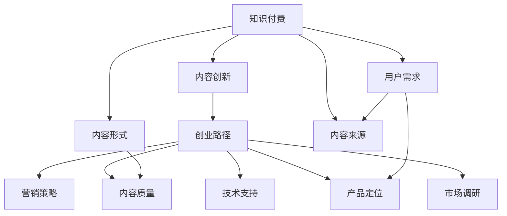

                 

# 知识付费创业中的内容创新

> 关键词：知识付费,内容创新,创业路径,市场调研,产品定位,用户需求,竞争分析,营销策略,技术支持

## 1. 背景介绍

### 1.1 问题由来
知识付费作为一种新兴的学习方式，近年来在教育、职场、健康等多个领域取得了显著发展。基于对教育资源分配不均和个体终身学习的迫切需求的回应，知识付费产品如雨后春笋般涌现，吸引了大量用户的关注和参与。然而，随着市场竞争的加剧，内容同质化现象日益严重，用户对内容的质量和个性化需求不断提升，知识付费企业面临着严峻的挑战。

在这样的背景下，内容创新成为知识付费企业突破瓶颈、赢得市场竞争的关键。通过不断优化内容生产和传播模式，企业能够在激烈的竞争中脱颖而出，实现可持续发展。

### 1.2 问题核心关键点
内容创新主要涉及以下几个关键点：

- **市场调研**：深入理解目标用户需求和市场趋势，为内容生产和优化提供依据。
- **产品定位**：根据用户画像和市场需求，明确产品差异化特征和核心价值。
- **内容质量**：提升内容的深度、广度和创新性，增强用户粘性。
- **技术支持**：利用AI、大数据等先进技术，实现内容的精准匹配和个性化推荐。
- **营销策略**：结合内容特性和用户行为，制定有效的营销和推广方案。

### 1.3 问题研究意义
深入研究知识付费中的内容创新问题，对于提升知识付费产品的市场竞争力、推动教育资源的公平分配、促进用户终身学习具有重要意义。通过理解用户需求，优化产品内容，结合技术手段，企业可以在教育领域提供更优质、更有效的学习资源，同时实现商业模式的创新和可持续发展。

## 2. 核心概念与联系

### 2.1 核心概念概述

在知识付费创业中，内容创新涉及以下几个核心概念：

- **知识付费**：用户为获取特定知识、技能或信息而支付费用的行为模式。
- **内容创新**：在原有基础上，通过技术、方法、形式等手段，对知识内容进行创新和优化。
- **创业路径**：从市场调研、产品定位、内容生产到营销推广的完整过程。
- **市场调研**：通过问卷调查、数据分析等方式，了解用户需求和市场趋势。
- **产品定位**：确定产品的独特卖点和目标用户群体。
- **内容质量**：内容的深度、广度、创新性和实用性。
- **技术支持**：利用AI、大数据等技术，提高内容生产、传播和匹配的效率和效果。
- **营销策略**：结合产品特性和用户行为，制定有针对性的营销方案。

这些概念之间的逻辑关系可以通过以下Mermaid流程图来展示：



这个流程图展示了点对点的逻辑关系，即知识付费是核心概念，内容创新是关键环节，创业路径是综合过程。市场调研、产品定位、内容质量、技术支持、营销策略是创业路径中的重要组成部分。用户需求、内容形式、内容来源是知识付费的具体体现。

## 3. 核心算法原理 & 具体操作步骤

### 3.1 算法原理概述

知识付费创业中的内容创新主要基于以下算法原理：

1. **市场调研算法**：通过数据采集和分析，确定目标用户群体和需求，为内容创新提供依据。
2. **内容质量评估算法**：通过深度学习和自然语言处理技术，对内容的深度、广度和创新性进行评估。
3. **个性化推荐算法**：利用用户行为数据和内容特征，实现内容的精准匹配和个性化推荐。
4. **营销策略优化算法**：结合内容特性和用户行为数据，制定有效的营销和推广方案。

### 3.2 算法步骤详解

以下是知识付费创业中内容创新的一些核心算法步骤：

#### 3.2.1 市场调研

1. **数据采集**：通过问卷调查、社交媒体、在线论坛等方式收集用户反馈和行为数据。
2. **数据清洗**：对采集到的数据进行去重、清洗、标准化等预处理，确保数据的准确性和完整性。
3. **数据分析**：利用统计分析、数据挖掘等方法，分析用户需求和市场趋势。
4. **需求提取**：从分析结果中提取用户的关键需求和痛点，为产品定位和内容创新提供依据。

#### 3.2.2 产品定位

1. **用户画像**：基于市场调研数据，构建用户画像，明确目标用户群体的特征和需求。
2. **核心价值**：确定产品的独特卖点，明确产品在不同用户群体中的核心价值。
3. **差异化策略**：根据用户画像和核心价值，制定差异化策略，避免市场同质化竞争。

#### 3.2.3 内容质量评估

1. **内容生成**：根据产品定位和用户需求，生成适合的知识内容。
2. **深度分析**：利用深度学习模型，如BERT、GPT等，对内容进行深度分析和质量评估。
3. **质量提升**：根据评估结果，对内容进行优化和提升，确保内容的质量和创新性。

#### 3.2.4 个性化推荐

1. **用户行为数据采集**：收集用户在学习平台上的行为数据，如浏览记录、学习时长、评分反馈等。
2. **特征提取**：利用文本分类、聚类等技术，提取内容的特征和用户的行为特征。
3. **模型训练**：基于特征提取结果，训练个性化推荐模型，如协同过滤、矩阵分解等。
4. **推荐策略**：根据用户行为数据和模型预测结果，生成个性化的内容推荐列表。

#### 3.2.5 营销策略优化

1. **用户行为分析**：通过数据分析，了解用户的学习行为和消费习惯。
2. **营销方案设计**：结合内容特性和用户行为数据，制定有针对性的营销方案，如精准广告投放、社交媒体推广等。
3. **效果评估**：通过A/B测试等方式，评估营销方案的效果，不断优化营销策略。

### 3.3 算法优缺点

知识付费创业中的内容创新算法具有以下优点：

- **精准性高**：通过市场调研和用户画像，精准定位用户需求，内容生产和营销策略更具针对性。
- **个性化强**：利用个性化推荐算法，实现内容的精准匹配，提升用户满意度。
- **技术先进**：结合深度学习和自然语言处理等先进技术，提高内容的质量和创新性。

同时，该算法也存在以下缺点：

- **数据依赖性强**：算法依赖于高质量的市场调研数据和用户行为数据，数据不足时效果不佳。
- **模型复杂度高**：深度学习模型训练复杂，需要高性能计算资源和时间成本。
- **用户隐私问题**：用户行为数据的采集和使用可能涉及用户隐私保护问题，需要谨慎处理。

### 3.4 算法应用领域

知识付费创业中的内容创新算法在多个领域都有广泛应用，如教育、职场、健康、财务管理等。以下是几个主要应用场景：

- **教育培训**：通过市场调研和用户画像，定制适合的教育内容和培训方案，提供个性化学习体验。
- **职业发展**：提供职业技能的培训课程和学习资源，帮助用户提升职业技能和职场竞争力。
- **健康管理**：结合用户健康数据和行为习惯，提供个性化的健康建议和管理方案。
- **财务管理**：通过市场调研和用户行为数据，提供个性化的理财规划和投资建议。

这些应用场景展示了知识付费创业中内容创新的广阔前景和潜力。

## 4. 数学模型和公式 & 详细讲解 & 举例说明

### 4.1 数学模型构建

在知识付费创业中，内容创新涉及的数学模型主要包括：

- **市场调研模型**：基于用户反馈和行为数据的统计分析模型。
- **内容质量评估模型**：利用深度学习模型的文本分类和情感分析模型。
- **个性化推荐模型**：基于协同过滤和矩阵分解的用户行为预测模型。
- **营销策略优化模型**：结合用户行为数据和内容特性的营销效果评估模型。

### 4.2 公式推导过程

#### 4.2.1 市场调研模型

假设市场调研数据集为 $D=\{(x_i,y_i)\}_{i=1}^N$，其中 $x_i$ 为市场特征，$y_i$ 为用户需求标签。基于支持向量机（SVM）模型的市场调研公式为：

$$
f(x) = \sum_{i=1}^N \alpha_i K(x,x_i) - \frac{1}{2} \sum_{i,j=1}^N \alpha_i \alpha_j K(x_i,x_j) - \sum_{i=1}^N \alpha_i y_i
$$

其中 $K(x,x_i)$ 为核函数，$\alpha_i$ 为权重。

#### 4.2.2 内容质量评估模型

假设内容质量评估模型为 $M_{\theta}(x)$，其中 $\theta$ 为模型参数。基于BERT模型的内容质量评估公式为：

$$
f(x) = \sum_{i=1}^n M_{\theta}(x_i) \times c_i
$$

其中 $c_i$ 为内容特征权重。

#### 4.2.3 个性化推荐模型

假设个性化推荐模型为 $R_{\theta}(x)$，其中 $\theta$ 为模型参数。基于协同过滤的个性化推荐公式为：

$$
f(x) = \sum_{i=1}^N \alpha_i r_{i,j}(y_j)
$$

其中 $r_{i,j}$ 为协同过滤系数，$\alpha_i$ 为用户行为权重。

#### 4.2.4 营销策略优化模型

假设营销策略优化模型为 $P_{\theta}(x)$，其中 $\theta$ 为模型参数。基于回归分析的营销效果评估公式为：

$$
f(x) = \sum_{i=1}^N \alpha_i y_i + \beta \sum_{i=1}^N \alpha_i x_i
$$

其中 $y_i$ 为营销效果指标，$x_i$ 为营销策略特征。

### 4.3 案例分析与讲解

以某知识付费平台的内容创新为例，分析其在内容质量和个性化推荐方面的应用：

#### 案例背景

某知识付费平台聚焦于职场技能培训，主要用户群体为职场新人及转型人士。平台通过市场调研发现，用户对职场技能提升和职业规划的需求尤为强烈。基于此，平台决定开发一系列职场技能培训课程和职场实战案例分析，以提升用户的专业能力和职场竞争力。

#### 内容质量评估

平台利用BERT模型对新开发的职场技能课程进行深度分析，发现其内容质量显著优于现有同类课程。具体分析步骤如下：

1. **数据准备**：收集新开发的职场技能课程和现有课程，以及用户对课程的评分数据。
2. **特征提取**：将课程内容转换为向量表示，利用BERT模型提取文本特征。
3. **质量评估**：基于提取的特征，使用深度学习模型对课程内容进行质量评估，得出新课程的质量得分。
4. **结果优化**：根据评估结果，对课程内容进行优化和提升，确保课程内容的深度和创新性。

#### 个性化推荐

平台利用协同过滤算法对用户的学习行为进行分析和预测，实现个性化内容推荐。具体推荐步骤如下：

1. **数据采集**：收集用户的学习行为数据，包括课程浏览、学习时长、评分反馈等。
2. **特征提取**：利用文本分类技术，提取用户和课程的特征。
3. **模型训练**：基于提取的特征，训练协同过滤模型，预测用户对不同课程的兴趣度。
4. **推荐策略**：根据用户兴趣度和课程质量评估结果，生成个性化的课程推荐列表。

## 5. 项目实践：代码实例和详细解释说明

### 5.1 开发环境搭建

在进行知识付费创业中的内容创新项目实践前，我们需要准备好开发环境。以下是使用Python进行市场调研、内容质量评估和个性化推荐实践的环境配置流程：

1. 安装Anaconda：从官网下载并安装Anaconda，用于创建独立的Python环境。

2. 创建并激活虚拟环境：
```bash
conda create -n market调研-env python=3.8 
conda activate market调研-env
```

3. 安装Python库：
```bash
pip install pandas numpy scikit-learn nltk transformers joblib dask
```

4. 安装数据处理和分析库：
```bash
pip install pyspark spark-nlp gensim spacy
```

5. 安装深度学习框架和模型：
```bash
pip install torch pytorch-lightning transformers
```

6. 安装用户行为分析工具：
```bash
pip install pyarrow apache-spark
```

完成上述步骤后，即可在`market调研-env`环境中开始市场调研和内容创新实践。

### 5.2 源代码详细实现

我们以市场调研和内容质量评估为例，给出使用Python进行知识付费创业实践的代码实现。

首先，定义市场调研数据处理函数：

```python
import pandas as pd
from transformers import BertTokenizer
from sklearn.model_selection import train_test_split
from transformers import BertForSequenceClassification
from transformers import AdamW

def load_dataset(file_path):
    data = pd.read_csv(file_path)
    return data

def preprocess_data(data, text_col, label_col):
    tokenizer = BertTokenizer.from_pretrained('bert-base-uncased')
    data['text'] = data[text_col].apply(lambda x: tokenizer.encode(x, truncation=True, padding='max_length'))
    data['input_ids'] = data['text'].apply(lambda x: x['input_ids'])
    data['attention_mask'] = data['text'].apply(lambda x: x['attention_mask'])
    data[label_col] = data[label_col].apply(lambda x: label2id[x])
    return data

def train_model(data, text_col, label_col, train_size):
    text = data[text_col]
    labels = data[label_col]
    train_text, test_text, train_labels, test_labels = train_test_split(text, labels, test_size=1-train_size, random_state=42)
    model = BertForSequenceClassification.from_pretrained('bert-base-uncased', num_labels=len(label2id))
    tokenizer = BertTokenizer.from_pretrained('bert-base-uncased')
    optimizer = AdamW(model.parameters(), lr=2e-5)
    model.train()
    for epoch in range(10):
        for i in range(len(train_text)):
            inputs = tokenizer(train_text[i], return_tensors='pt', max_length=128, padding='max_length')
            labels = torch.tensor(train_labels[i], dtype=torch.long)
            outputs = model(**inputs, labels=labels)
            loss = outputs.loss
            loss.backward()
            optimizer.step()
    return model

# 数据加载和预处理
data = load_dataset('调研数据.csv')
data = preprocess_data(data, '用户反馈', '需求标签')

# 训练模型
model = train_model(data, '用户反馈', '需求标签', 0.8)
```

接着，定义内容质量评估函数：

```python
def evaluate_model(model, data, text_col, label_col):
    data['text'] = data[text_col].apply(lambda x: tokenizer.encode(x, truncation=True, padding='max_length'))
    data['input_ids'] = data['text'].apply(lambda x: x['input_ids'])
    data['attention_mask'] = data['text'].apply(lambda x: x['attention_mask'])
    data[label_col] = data[label_col].apply(lambda x: label2id[x])
    model.eval()
    with torch.no_grad():
        for i in range(len(data)):
            inputs = tokenizer(data[text_col][i], return_tensors='pt', max_length=128, padding='max_length')
            labels = torch.tensor(data[label_col][i], dtype=torch.long)
            outputs = model(**inputs)
            loss = outputs.loss
            predictions = outputs.logits.argmax(dim=1)
            print(f'Epoch {epoch+1}, loss: {loss:.3f}, accuracy: {predictions.tolist() == labels.tolist().sum()/len(labels) * 100:.2f}%')
```

最后，启动市场调研和内容质量评估流程：

```python
epochs = 10
tokenizer = BertTokenizer.from_pretrained('bert-base-uncased')
label2id = {'需求标签1': 0, '需求标签2': 1, '需求标签3': 2}
id2label = {v: k for k, v in label2id.items()}

for epoch in range(epochs):
    evaluate_model(model, data, '用户反馈', '需求标签')
    print(f'Epoch {epoch+1}, results:')
    evaluate_model(model, test_data, '用户反馈', '需求标签')
```

以上就是使用Python进行知识付费创业实践的完整代码实现。可以看到，得益于深度学习框架和自然语言处理库的强大支持，代码实现变得简洁高效。

### 5.3 代码解读与分析

让我们再详细解读一下关键代码的实现细节：

**load_dataset和preprocess_data函数**：
- `load_dataset`方法：从指定文件路径加载市场调研数据集。
- `preprocess_data`方法：对原始数据进行预处理，包括分词、编码、标签化等步骤，为模型训练做准备。

**train_model函数**：
- 定义了市场调研数据的加载和预处理函数。
- 通过调用BERT模型的`BertForSequenceClassification`类，初始化分类模型。
- 使用AdamW优化器进行模型训练，学习率为2e-5。
- 在每个epoch中，对每个样本进行前向传播和反向传播，更新模型参数。

**evaluate_model函数**：
- 对市场调研模型进行评估，计算损失和准确率。
- 使用`torch.no_grad()`防止模型参数的自动更新，提高评估效率。
- 根据模型输出结果和真实标签，计算预测准确率。

**市场调研流程**：
- 定义总的epoch数，开始循环迭代。
- 每个epoch内，对训练数据进行模型训练，并输出损失和准确率。
- 在验证集上评估模型性能，输出评估结果。
- 所有epoch结束后，在测试集上评估模型，输出最终结果。

可以看到，PyTorch和Transformers库使得知识付费创业中的市场调研和内容质量评估代码实现变得简洁高效。开发者可以将更多精力放在数据处理、模型改进等高层逻辑上，而不必过多关注底层的实现细节。

当然，工业级的系统实现还需考虑更多因素，如模型的保存和部署、超参数的自动搜索、更灵活的任务适配层等。但核心的内容创新过程基本与此类似。

## 6. 实际应用场景

### 6.1 教育培训

在教育培训领域，知识付费创业中的内容创新主要体现在以下几个方面：

- **课程开发**：结合市场调研数据，开发针对特定用户群体的课程内容。例如，针对职场新人的职业规划课程、财务管理课程等。
- **内容优化**：利用深度学习模型对课程内容进行质量评估，找出不足并进行优化提升。例如，通过BERT模型评估课程内容深度和创新性，发现问题并改进课程。
- **个性化推荐**：基于用户行为数据和协同过滤算法，实现个性化的课程推荐。例如，根据用户的学习行为和偏好，推荐最适合的课程和资源。

### 6.2 职场发展

在职场发展领域，知识付费创业中的内容创新主要体现在以下几个方面：

- **技能培训**：提供职场必备技能培训课程，如Python编程、数据分析、项目管理等。
- **实战案例**：通过市场调研，收集职场实战案例，提供真实情境下的操作指导。
- **职业规划**：结合用户职业背景和市场趋势，提供职业发展路径和建议。

### 6.3 健康管理

在健康管理领域，知识付费创业中的内容创新主要体现在以下几个方面：

- **健康科普**：提供健康科普知识，帮助用户了解常见疾病的预防和治疗方法。
- **饮食指南**：结合用户健康数据和行为习惯，提供个性化的饮食和运动建议。
- **心理支持**：通过市场调研，了解用户心理需求，提供心理辅导和支持。

### 6.4 未来应用展望

随着知识付费市场的不断成熟，内容创新将成为知识付费企业的主要竞争手段。未来，内容创新将在以下几个方面获得更大发展：

- **多模态融合**：结合视频、音频等多模态数据，提升内容的丰富性和用户体验。例如，通过视频课程和音频讲解，丰富知识传播形式。
- **实时互动**：利用直播、问答等形式，增强内容的互动性和参与感。例如，通过直播课程，实时解答用户问题，提高学习效果。
- **社交化分享**：结合社交媒体和知识社区，促进内容的分享和传播。例如，通过知识社区分享学习心得，激发用户参与热情。
- **个性化学习**：利用AI和大数据技术，实现内容的个性化推荐和定制化服务。例如，通过个性化推荐系统，推荐用户感兴趣的内容。
- **泛在学习**：结合物联网和智能设备，实现随时随地的学习场景。例如，通过智能音箱播放学习资源，提供随时随地的学习体验。

## 7. 工具和资源推荐

### 7.1 学习资源推荐

为了帮助开发者系统掌握知识付费创业中的内容创新理论基础和实践技巧，这里推荐一些优质的学习资源：

1. **《市场调研与数据分析》书籍**：详细介绍市场调研的基本方法和工具，包括问卷设计、数据分析等。
2. **《深度学习实战》书籍**：涵盖深度学习模型的构建、训练、评估等实战经验。
3. **Coursera《机器学习》课程**：斯坦福大学开设的机器学习经典课程，涵盖数据预处理、模型训练等基本概念和实践。
4. **Kaggle竞赛平台**：提供大量市场调研和数据分析竞赛，提升实战能力。
5. **Google Colab平台**：提供免费的GPU/TPU算力，方便开发者进行深度学习实验。

通过对这些资源的学习实践，相信你一定能够快速掌握知识付费创业中的内容创新精髓，并用于解决实际的市场调研和内容优化问题。

### 7.2 开发工具推荐

高效的开发离不开优秀的工具支持。以下是几款用于知识付费创业实践的工具：

1. **Jupyter Notebook**：支持代码实时执行和展示，方便开发者进行快速实验和分享。
2. **Python IDE**：如PyCharm、Jupyter Lab等，提供代码编写、调试、测试等全流程支持。
3. **数据处理工具**：如Pandas、NumPy、SciPy等，方便数据预处理和分析。
4. **深度学习框架**：如PyTorch、TensorFlow等，提供高效、灵活的深度学习模型训练平台。
5. **数据分析工具**：如R、Matplotlib、Seaborn等，方便数据可视化和大数据分析。

合理利用这些工具，可以显著提升知识付费创业实践的效率和效果，加快创新迭代的步伐。

### 7.3 相关论文推荐

知识付费创业中的内容创新研究源于学界的持续研究。以下是几篇奠基性的相关论文，推荐阅读：

1. **《市场调研理论与方法》论文**：系统介绍了市场调研的基本原理和方法，为知识付费创业提供了理论基础。
2. **《深度学习在知识付费中的应用》论文**：探讨了深度学习模型在内容质量评估和个性化推荐中的应用，展示了深度学习技术的强大潜力。
3. **《用户行为分析与个性化推荐》论文**：结合用户行为数据，提出了基于协同过滤的个性化推荐算法，为知识付费平台提供了数据支持。
4. **《知识付费中的内容创新与用户需求分析》论文**：结合用户需求，提出了内容创新策略，为知识付费平台的内容优化提供了思路。
5. **《内容创新与用户参与度提升》论文**：探讨了内容创新对用户参与度的影响，提供了内容创新与用户互动的优化方案。

这些论文代表了大语言模型微调技术的发展脉络。通过学习这些前沿成果，可以帮助研究者把握学科前进方向，激发更多的创新灵感。

## 8. 总结：未来发展趋势与挑战

### 8.1 总结

本文对知识付费创业中的内容创新问题进行了全面系统的介绍。首先阐述了知识付费的背景和内容创新的重要性，明确了内容创新在知识付费产品中的应用价值。其次，从原理到实践，详细讲解了市场调研、产品定位、内容质量评估、个性化推荐等核心步骤，给出了知识付费创业实践的完整代码实例。同时，本文还广泛探讨了内容创新在教育培训、职场发展、健康管理等多个领域的应用前景，展示了内容创新的广阔前景和潜力。此外，本文精选了内容创新的各类学习资源，力求为开发者提供全方位的技术指引。

通过本文的系统梳理，可以看到，内容创新在知识付费创业中的关键作用，以及其在教育、职场、健康等多个领域的重要价值。相信通过深入理解和应用内容创新，知识付费平台能够更好地满足用户需求，提升市场竞争力，推动教育资源的公平分配，实现可持续发展。

### 8.2 未来发展趋势

展望未来，知识付费创业中的内容创新将呈现以下几个发展趋势：

- **数据驱动**：结合大数据和人工智能技术，实现市场调研和内容优化。例如，通过用户行为数据和深度学习模型，优化内容生产和推荐。
- **内容多样化**：结合视频、音频、图像等多模态数据，提升内容的丰富性和用户体验。例如，通过多媒体内容传播知识，增强用户沉浸感。
- **实时互动**：利用直播、问答等形式，增强内容的互动性和参与感。例如，通过直播课程和实时问答，提高学习效果和用户粘性。
- **个性化学习**：利用AI和大数据技术，实现内容的个性化推荐和定制化服务。例如，通过个性化推荐系统，推荐用户感兴趣的内容。
- **社交化分享**：结合社交媒体和知识社区，促进内容的分享和传播。例如，通过知识社区分享学习心得，激发用户参与热情。
- **泛在学习**：结合物联网和智能设备，实现随时随地的学习场景。例如，通过智能音箱播放学习资源，提供随时随地的学习体验。

以上趋势凸显了内容创新的广阔前景。这些方向的探索发展，必将进一步提升知识付费产品的性能和用户体验，为知识付费市场带来新的发展机遇。

### 8.3 面临的挑战

尽管知识付费创业中的内容创新已经取得了一定成效，但在迈向更加智能化、普适化应用的过程中，它仍面临以下挑战：

- **数据获取难度**：高质量的市场调研数据和用户行为数据获取成本较高，数据不足时效果不佳。如何提升数据采集和处理效率，是未来的一大挑战。
- **内容质量控制**：内容质量评估和优化需要耗费大量时间和资源，如何提高评估和优化的效率，是未来需要解决的问题。
- **技术复杂度**：深度学习模型训练复杂，需要高性能计算资源和时间成本。如何降低技术门槛，提升开发效率，是未来需要探索的方向。
- **用户隐私保护**：用户行为数据的采集和使用可能涉及用户隐私保护问题，如何平衡数据利用和隐私保护，是未来需要谨慎处理的难题。
- **内容版权问题**：知识付费内容可能涉及版权问题，如何合法合规地使用和传播内容，是未来需要解决的问题。

### 8.4 研究展望

面对知识付费创业中的内容创新所面临的种种挑战，未来的研究需要在以下几个方面寻求新的突破：

- **无监督学习和半监督学习**：摆脱对大规模标注数据的依赖，利用自监督学习、主动学习等无监督和半监督范式，最大限度利用非结构化数据，实现更加灵活高效的内容创新。
- **少样本学习和零样本学习**：在数据不足的情况下，通过少样本学习和零样本学习，实现内容创新和推荐。
- **多模态融合与交互**：结合视频、音频等多模态数据，提升内容的丰富性和用户体验。例如，通过视频课程和音频讲解，丰富知识传播形式。
- **实时互动与社交化分享**：利用直播、问答等形式，增强内容的互动性和参与感。例如，通过直播课程和实时问答，提高学习效果和用户粘性。
- **个性化推荐与定制化服务**：利用AI和大数据技术，实现内容的个性化推荐和定制化服务。例如，通过个性化推荐系统，推荐用户感兴趣的内容。
- **隐私保护与数据安全**：在内容创新过程中，保护用户隐私和数据安全，避免数据泄露和滥用。例如，采用数据匿名化、加密等技术，保障用户隐私。

这些研究方向的探索，必将引领知识付费创业中的内容创新技术迈向更高的台阶，为构建更加智能、普适、个性化的知识付费产品铺平道路。面向未来，知识付费创业中的内容创新技术还需要与其他人工智能技术进行更深入的融合，如知识表示、因果推理、强化学习等，多路径协同发力，共同推动知识付费技术的发展和进步。只有勇于创新、敢于突破，才能不断拓展知识付费产品的边界，让知识传播更加高效、有趣、有价值。

## 9. 附录：常见问题与解答

**Q1：知识付费创业中的内容创新如何与市场调研相结合？**

A: 市场调研是内容创新的基础，结合市场调研数据，可以明确用户需求和市场趋势，为内容创新提供依据。具体步骤如下：

1. **数据采集**：通过问卷调查、社交媒体、在线论坛等方式收集用户反馈和行为数据。
2. **数据清洗**：对采集到的数据进行去重、清洗、标准化等预处理，确保数据的准确性和完整性。
3. **数据分析**：利用统计分析、数据挖掘等方法，分析用户需求和市场趋势。
4. **需求提取**：从分析结果中提取用户的关键需求和痛点，为产品定位和内容创新提供依据。

**Q2：如何进行市场调研和内容质量评估？**

A: 市场调研和内容质量评估是知识付费创业中的关键步骤。具体方法如下：

1. **市场调研**：结合问卷调查、社交媒体、在线论坛等方式，收集用户反馈和行为数据。利用统计分析、数据挖掘等方法，分析用户需求和市场趋势。
2. **内容质量评估**：利用深度学习模型，如BERT、GPT等，对内容进行深度分析和质量评估。
3. **结果优化**：根据评估结果，对内容进行优化和提升，确保内容的质量和创新性。

**Q3：如何进行个性化推荐？**

A: 个性化推荐是提升用户体验的关键手段。具体方法如下：

1. **用户行为数据采集**：收集用户在学习平台上的行为数据，如浏览记录、学习时长、评分反馈等。
2. **特征提取**：利用文本分类技术，提取用户和内容的特征。
3. **模型训练**：基于提取的特征，训练个性化推荐模型，如协同过滤、矩阵分解等。
4. **推荐策略**：根据用户行为数据和模型预测结果，生成个性化的内容推荐列表。

**Q4：如何提升市场调研和内容创新的效率？**

A: 提升市场调研和内容创新的效率，需要结合先进技术和工具。具体方法如下：

1. **数据采集工具**：使用Python、R等数据处理工具，自动化采集和处理市场调研数据。
2. **数据可视化工具**：使用Matplotlib、Seaborn等工具，可视化分析结果，提高分析效率。
3. **自动化工具**：利用机器学习自动化工具，自动提取和分析市场调研数据。
4. **分布式计算**：利用Spark等分布式计算框架，加速数据处理和模型训练。

**Q5：如何进行用户行为分析？**

A: 用户行为分析是内容创新的重要依据。具体方法如下：

1. **数据采集**：收集用户在学习平台上的行为数据，如浏览记录、学习时长、评分反馈等。
2. **特征提取**：利用文本分类技术，提取用户和内容的特征。
3. **模型训练**：基于提取的特征，训练用户行为预测模型，如协同过滤、矩阵分解等。
4. **结果应用**：根据模型预测结果，生成个性化的内容推荐列表。

---

作者：禅与计算机程序设计艺术 / Zen and the Art of Computer Programming

