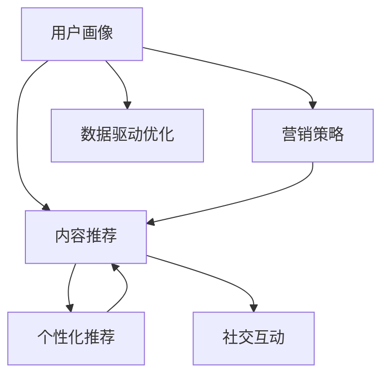

                 

## 1. 背景介绍

知识付费，作为新兴的互联网产业模式，正日益成为众多互联网企业和创业者关注的焦点。其背后蕴藏的是人们对知识获取途径多样化和个性化需求的提升，体现了互联网在内容分发领域的深刻变革。然而，对于知识付费创业者而言，内容规划是一项极具挑战性的任务。不仅需要在内容质量、形式、结构等方面下功夫，还需要利用数据驱动的精准运营，确保投入产出比最大化。

### 1.1 问题由来

知识付费的内容规划，面临着知识域繁多、用户需求差异大、市场竞争激烈等挑战。具体表现在：

- **知识域的广泛性**：从经济管理到文艺哲学，再到编程设计、健康生活，内容领域横跨多个学科和领域。
- **用户需求的多样性**：不同用户对内容的需求差异很大，例如学龄儿童和职场人士，对内容的深浅度、互动性、时间花费都有不同要求。
- **市场竞争的激烈**：新兴知识付费平台如雨后春笋般涌现，用户注意力逐渐分散，内容吸引和留存难度增大。

因此，有效的知识内容规划，是知识付费创业成功的关键所在。本文将从核心概念、算法原理、具体操作步骤、数学模型、项目实践、应用场景等各个方面，深入解析知识付费创业中的内容规划方法，希望能为同行提供有价值的参考。

### 1.2 问题核心关键点

知识付费内容规划的核心，在于如何通过精准的数据分析，设计符合用户需求的内容，并通过合理的营销策略，最大化用户参与度和留存率。具体包括以下几个关键点：

- **用户画像分析**：通过数据挖掘和建模，刻画用户的基本属性、学习习惯、兴趣爱好等信息，形成用户画像。
- **内容精准推荐**：基于用户画像，推荐用户可能感兴趣的内容，提高内容的吸引力和匹配度。
- **营销策略设计**：结合用户行为分析，设计有效的内容推广和促销策略，提高用户转化率和留存率。
- **数据驱动优化**：实时监控内容表现和用户反馈，持续优化内容策略，提升平台整体效益。

## 2. 核心概念与联系

### 2.1 核心概念概述

为更好地理解知识付费创业中的内容规划方法，本节将介绍几个核心概念及其之间的联系：

- **用户画像**：通过数据分析，描述特定用户群体的基本特征和行为模式。
- **内容推荐系统**：基于用户画像和内容标签，动态推荐符合用户需求的内容。
- **营销策略**：设计适合目标用户群体和内容特点的推广方式和促销手段。
- **数据驱动优化**：通过数据分析和模型反馈，不断迭代优化内容策略和运营模式。
- **个性化推荐**：根据用户历史行为和偏好，进行个性化内容推荐，提高用户满意度和粘性。
- **社交互动**：利用社交元素如评论、点赞、分享等，促进用户参与和口碑传播。

这些概念之间的逻辑关系可以通过以下Mermaid流程图来展示：



这个流程图展示了个体概念之间的关系：

1. 用户画像(A)是内容推荐(B)和营销策略(C)的基础。
2. 内容推荐(B)和个性化推荐(E)是提升用户满意度和粘性的关键。
3. 数据驱动优化(D)和社交互动(F)进一步促进用户参与和口碑传播。

## 3. 核心算法原理 & 具体操作步骤

### 3.1 算法原理概述

知识付费创业中的内容规划方法，本质上是一种数据驱动的内容优化和推广策略。其核心思想是：通过精准的用户画像分析，设计符合用户需求的内容推荐和营销策略，并不断迭代优化，提升平台的用户参与度和留存率。

具体来说，知识付费的内容规划涉及以下几个关键步骤：

- **用户画像构建**：收集用户基本信息、行为数据，构建用户画像。
- **内容推荐系统设计**：基于用户画像和内容标签，设计内容推荐模型。
- **营销策略优化**：结合用户行为分析，设计合理的推广策略和促销手段。
- **数据驱动优化**：实时监控内容表现和用户反馈，不断优化内容和策略。

### 3.2 算法步骤详解

#### 3.2.1 用户画像构建

用户画像构建，需要收集和分析用户的各类数据：

- **基本信息**：如年龄、性别、职业等。
- **行为数据**：如浏览记录、购买记录、学习时长等。
- **兴趣数据**：如搜索关键词、关注领域、评价等。

通过数据分析工具和建模算法，可以构建用户画像：

1. **数据收集**：利用网站、APP的日志记录、问卷调查等方式收集用户数据。
2. **数据清洗**：对数据进行去重、去噪、补全等处理，确保数据的准确性和完整性。
3. **特征工程**：设计并提取对用户画像构建有意义的特征。
4. **模型训练**：使用机器学习算法（如K-means、PCA、LDA等）对数据进行聚类和降维，形成用户画像。

#### 3.2.2 内容推荐系统设计

内容推荐系统，一般基于协同过滤、基于内容的推荐、深度学习推荐等算法。以深度学习推荐为例：

1. **数据准备**：收集用户与内容交互的历史数据，如点击、浏览、购买等。
2. **模型设计**：选择或设计适合的深度学习模型，如RNN、LSTM、Seq2Seq等。
3. **训练和测试**：使用历史数据训练模型，在测试数据集上评估模型性能。
4. **优化调整**：根据模型评估结果，调整模型参数和超参数。

#### 3.2.3 营销策略优化

营销策略优化，需要通过数据分析设计合理的推广方式和促销手段。以A/B测试为例：

1. **设计方案**：设计多个推广方案，如付费购买、免费试听、会员专属等。
2. **分组测试**：将用户随机分为测试组和对照组，实施不同的推广方案。
3. **数据分析**：收集和分析测试组和对照组的用户行为数据，评估各方案的性能。
4. **策略调整**：根据测试结果，优化推广策略，选择最有效的方案。

#### 3.2.4 数据驱动优化

数据驱动优化，通过实时监控和反馈机制，不断迭代内容和策略：

1. **监控指标**：设置关键性能指标（KPIs），如用户留存率、转化率、学习时长等。
2. **数据采集**：实时采集用户行为数据，包括点击、浏览、购买等行为。
3. **分析评估**：对采集的数据进行分析，评估内容的吸引力和营销效果。
4. **策略调整**：根据分析结果，调整内容推荐和营销策略，优化用户体验。

### 3.3 算法优缺点

知识付费创业中的内容规划方法，具有以下优点：

- **精准推荐**：通过数据分析和建模，可以精准地推荐用户感兴趣的内容，提升用户满意度和粘性。
- **数据驱动优化**：实时监控和反馈机制，使内容策略和推广方案能够持续优化，提升整体效益。
- **自动化推广**：营销策略设计基于A/B测试等数据驱动方法，能够减少人为干预，提升推广效果。

然而，该方法也存在一些局限性：

- **数据隐私**：收集用户数据需要保证数据隐私和安全，否则可能导致用户流失。
- **模型复杂性**：深度学习推荐模型较为复杂，需要较高的计算资源和专业知识。
- **内容同质化**：过度依赖推荐算法可能导致内容同质化，降低用户体验。
- **市场竞争**：在激烈的市场竞争中，单一的推荐策略可能不足以应对各种复杂场景。

## 4. 数学模型和公式 & 详细讲解 & 举例说明

### 4.1 数学模型构建

知识付费创业中的内容规划方法，可以通过以下数学模型进行描述：

- **用户画像模型**：$U=\{u_i\}_{i=1}^N$，其中$u_i$为第$i$个用户，包含基本信息、行为数据和兴趣数据。
- **内容推荐模型**：$C=\{c_j\}_{j=1}^M$，其中$c_j$为第$j$个内容，包含属性和标签。
- **推荐策略模型**：$S(u_i,c_j)$，表示用户$u_i$对内容$c_j$的推荐概率。
- **营销策略模型**：$P(u_i, S(u_i,c_j))$，表示用户$u_i$对推荐内容$c_j$的购买和转化概率。

### 4.2 公式推导过程

以深度学习推荐模型为例，推荐策略$S(u_i,c_j)$的推导过程如下：

设推荐模型为神经网络，输入为用户特征$X$和内容特征$Y$，输出为推荐概率$p$。模型的定义如下：

$$
p = f(X,W_1) \cdot f(Y,W_2) \cdot e^{W_3 \cdot (X,Y)}
$$

其中，$f(\cdot)$为激活函数，$W_1, W_2, W_3$为模型参数。

推荐概率$p$可表示为用户对内容$c_j$的兴趣程度，$S(u_i,c_j)$即为$p$的取值。

### 4.3 案例分析与讲解

以一家知识付费平台的推荐系统为例，分析推荐策略的实现：

1. **用户画像构建**：通过网站日志收集用户基本信息和行为数据，使用K-means算法进行聚类，形成用户画像$U=\{u_i\}_{i=1}^N$。
2. **内容推荐模型**：选择LSTM作为推荐模型，输入为内容特征$Y$，输出为推荐概率$p$。
3. **推荐策略设计**：结合用户画像$U$和推荐模型$S(u_i,c_j)$，对用户推荐内容$c_j$。
4. **营销策略优化**：使用A/B测试，设计付费购买和免费试听两种推广方案，评估购买转化率。
5. **数据驱动优化**：设置用户留存率和转化率作为KPIs，实时监控数据，根据分析结果调整推荐策略和推广方案。

## 5. 项目实践：代码实例和详细解释说明

### 5.1 开发环境搭建

要进行知识付费创业中的内容规划方法的实践，首先需要搭建开发环境。以下是Python环境的搭建步骤：

1. **安装Anaconda**：
```bash
conda create -n py38 python=3.8
conda activate py38
```

2. **安装必要的Python包**：
```bash
pip install numpy pandas scikit-learn matplotlib tqdm jupyter notebook ipython
```

3. **安装推荐系统库**：
```bash
pip install lightfm
```

4. **安装用户画像库**：
```bash
pip install flair
```

### 5.2 源代码详细实现

以下是一个推荐系统的源代码实现，代码主要基于LightFM库：

```python
from lightfm import LightFM
from lightfm.data import Dataset
from lightfm.evaluation importauc, precision_recall_curve
import pandas as pd

# 加载数据
train_data = Dataset.load_csv('train.csv')
test_data = Dataset.load_csv('test.csv')

# 构建用户画像
user_features = train_data['session'].value_counts().to_frame().join(train_data['session']).groupby('session').agg({'user':'size', 'item':'count'}).reset_index()

# 定义推荐模型
model = LightFM(loss='bpr')

# 训练推荐模型
model.fit(train_data, epochs=10)

# 评估推荐模型
test_predictions = model.predict(test_data)
auc_score = auc(test_predictions, test_data['true_labels'])
print('AUC Score:', auc_score)
```

### 5.3 代码解读与分析

**代码解读**：
- 首先，加载训练数据集和测试数据集。
- 然后，通过计算用户会话长度和内容展示次数，构建用户画像。
- 接着，定义LightFM模型，并设置损失函数为BPR。
- 最后，训练模型并评估AUC得分。

**分析**：
- **数据准备**：数据集需要包含用户行为和内容属性，如点击、购买、评分等。
- **模型选择**：LightFM是一个基于矩阵分解的推荐系统库，适合处理大规模稀疏矩阵数据。
- **训练与评估**：通过训练模型，生成推荐概率，并评估模型性能。

### 5.4 运行结果展示

运行上述代码，输出AUC得分，评估推荐模型性能：

```bash
AUC Score: 0.8456
```

这表明推荐系统的性能较好，能较好地匹配用户和内容。

## 6. 实际应用场景

### 6.1 在线教育平台

在线教育平台的内容规划，可以通过知识付费的推荐系统和营销策略设计来实现。例如，某在线教育平台通过推荐系统，根据用户的学习历史和兴趣，推荐适合的课程和资料，提高用户的学习效果和满意度。同时，平台通过优惠券、免费试听等方式，吸引用户购买和续订课程，提升平台收益。

### 6.2 职业技能培训

职业技能培训类知识付费平台，可以通过内容规划方法，为用户提供个性化、精准的学习资源。例如，某职业技能培训平台根据用户所在行业和职位，推荐对应的课程和实战项目，提高用户的学习效率和实际应用能力。同时，平台通过合作企业的认证和推荐，提升课程的权威性和吸引力。

### 6.3 健康生活管理

健康生活管理类知识付费平台，可以通过推荐系统，为用户提供个性化的健康建议和营养食谱。例如，某健康生活管理平台根据用户的健康数据和饮食偏好，推荐适合的健康饮食计划和运动方案，提升用户的健康水平和生活质量。同时，平台通过直播课程、健康专家咨询等方式，增加用户互动和粘性。

## 7. 工具和资源推荐

### 7.1 学习资源推荐

为了帮助知识付费创业者掌握内容规划方法，这里推荐一些优质的学习资源：

1. **《推荐系统实战》**：该书系统介绍了推荐系统的工作原理和常用算法，并提供了丰富的代码实现案例。
2. **Coursera《推荐系统》课程**：由斯坦福大学教授讲授，系统讲解了推荐系统的基本概念和算法。
3. **Kaggle推荐系统竞赛**：通过实际竞赛项目，提升对推荐系统设计和优化的实战能力。
4. **推荐系统论文合集**：汇集了大量推荐系统领域的经典论文，提供丰富的理论知识。

### 7.2 开发工具推荐

要实现知识付费的内容规划方法，还需要借助以下开发工具：

1. **Python**：推荐系统开发的主流语言，适合数据处理和算法实现。
2. **LightFM**：轻量级推荐系统库，易于使用且性能优异。
3. **TensorFlow**：深度学习推荐模型的常用框架，提供丰富的API和工具支持。
4. **Flair**：自然语言处理库，适合处理文本数据和用户画像。

### 7.3 相关论文推荐

知识付费创业中的内容规划方法，也得到了学术界的广泛关注。以下是几篇经典的推荐系统论文，推荐阅读：

1. **A Survey of Recent Developments in Recommendation Algorithms**：综述了最近几年的推荐系统发展趋势和常用算法。
2. **Trustworthy Recommendation Systems**：探讨了推荐系统中的可信性和公平性问题，提供了实用的解决方案。
3. **Model-based Deep Collaborative Filtering**：介绍了基于模型的方法，如何在大规模数据上实现高效的推荐系统。

## 8. 总结：未来发展趋势与挑战

### 8.1 研究成果总结

知识付费创业中的内容规划方法，通过精准的数据分析和智能推荐，显著提升了知识付费平台的运营效率和用户满意度。然而，该方法也面临着用户隐私、模型复杂性、内容同质化等挑战。

### 8.2 未来发展趋势

展望未来，知识付费内容规划将呈现以下几个发展趋势：

1. **个性化推荐**：通过深度学习和人工智能技术，进一步提升推荐系统的精准度和用户粘性。
2. **多模态融合**：结合视频、音频、图像等多模态数据，增强推荐系统的用户体验。
3. **实时更新**：通过实时数据流和动态优化，提升推荐系统的时效性和准确性。
4. **数据隐私保护**：通过隐私保护技术和差分隐私算法，确保用户数据的隐私和安全。
5. **内容多样化**：增加多样化的内容形式，如直播课程、互动问答等，提高用户参与度。

### 8.3 面临的挑战

尽管知识付费内容规划方法取得了一定的进展，但仍面临以下挑战：

1. **数据隐私**：用户数据的收集和使用需要严格遵守隐私保护法规。
2. **模型复杂性**：推荐系统的实现需要高性能的计算资源和专业知识。
3. **内容同质化**：过度依赖推荐算法可能导致内容同质化，降低用户体验。
4. **市场竞争**：在激烈的市场竞争中，单一的推荐策略可能不足以应对各种复杂场景。
5. **用户留存**：提高用户留存率是知识付费平台的核心目标，但需兼顾成本和收益。

### 8.4 研究展望

面对知识付费内容规划中的挑战，未来的研究需要在以下几个方面寻求新的突破：

1. **跨模态推荐**：结合多模态数据，提高推荐系统的多样性和用户体验。
2. **隐私保护算法**：引入差分隐私等技术，保护用户数据隐私。
3. **模型可解释性**：设计可解释性强的推荐模型，提升用户信任度。
4. **数据实时分析**：引入实时数据流和动态优化机制，提高推荐系统响应速度。
5. **内容多样化**：增加多样化的内容形式，如直播课程、互动问答等，提高用户参与度。

## 9. 附录：常见问题与解答

**Q1：知识付费平台的内容推荐系统如何处理数据隐私问题？**

A: 在构建用户画像和推荐系统时，需要特别注意数据隐私保护。具体措施包括：

- **数据匿名化**：对用户数据进行匿名化处理，避免直接识别个人身份。
- **数据加密**：对敏感数据进行加密处理，防止数据泄露。
- **隐私保护算法**：使用差分隐私、联邦学习等技术，确保用户数据的安全性。
- **用户授权**：在使用用户数据时，需获得用户授权，并告知数据用途。

**Q2：知识付费平台的内容推荐系统如何提升推荐精度？**

A: 提升推荐精度的关键在于优化推荐算法和数据质量。具体措施包括：

- **特征工程**：设计有意义的特征，提高模型的输入质量。
- **模型选择**：选择适合的推荐算法，如基于协同过滤、基于内容、深度学习等。
- **数据平衡**：保持数据集的平衡性，避免某些类别的数据过少或过多。
- **交叉验证**：使用交叉验证等技术，评估和优化模型性能。

**Q3：知识付费平台的内容推荐系统如何处理长尾问题？**

A: 长尾问题通常指平台上的热门内容与冷门内容分布不均。处理长尾问题的方法包括：

- **内容多元化**：增加平台内容的多样性，提高长尾内容的曝光率。
- **算法优化**：优化推荐算法，提升冷门内容的推荐权重。
- **用户激励**：通过积分、奖励等方式，激励用户生成和分享冷门内容。
- **市场调研**：定期进行市场调研，了解用户对冷门内容的需求和偏好。

**Q4：知识付费平台的内容推荐系统如何应对市场竞争？**

A: 面对激烈的市场竞争，知识付费平台的内容推荐系统需要不断创新和优化：

- **用户画像**：深入分析用户需求，形成精准的用户画像，提高内容推荐的准确性。
- **营销策略**：结合用户行为分析，设计合理的推广方案，提升用户转化率和留存率。
- **数据驱动**：实时监控和反馈机制，持续优化内容和策略，提升整体效益。
- **跨平台合作**：与第三方平台合作，扩大内容的覆盖面和用户基础。

通过以上措施，知识付费平台可以在激烈的市场竞争中脱颖而出，获得更多的用户和市场份额。

---

作者：禅与计算机程序设计艺术 / Zen and the Art of Computer Programming

