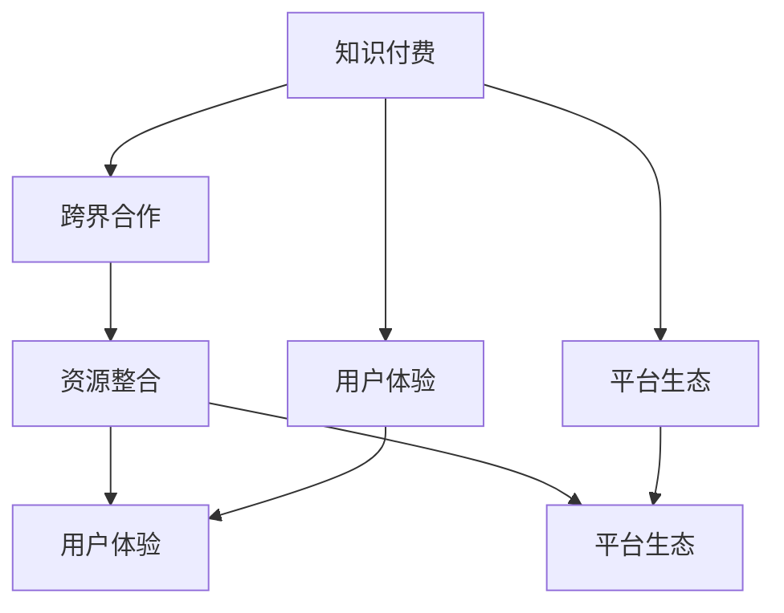

                 

# 知识付费创业中的跨界合作与资源整合

## 1. 背景介绍

随着互联网的发展和知识经济的兴起，知识付费市场快速崛起。在此背景下，越来越多的创业者开始转向知识付费领域，希望能在广阔的蓝海中寻找到新的发展机遇。然而，知识付费领域的竞争激烈，如何在这个新市场中站稳脚跟，实现可持续发展，是一个巨大的挑战。本文将从跨界合作与资源整合的角度，探讨知识付费创业的策略和路径，为创业者提供有益的参考和指导。

### 1.1 知识付费市场概况

知识付费是指用户为获取知识、技能、信息等资源而支付费用的行为，包括在线课程、电子书、音频课、视频课等多种形式。自2015年以来，随着移动互联网的普及和互联网用户消费习惯的转变，知识付费市场迅速发展。艾媒咨询数据显示，2020年中国知识付费市场规模达到390.9亿元，用户规模达3.8亿人，同比增长12.4%。预计未来几年，知识付费市场将继续保持快速增长。

### 1.2 知识付费创业现状

当前知识付费创业呈现出以下几个趋势：
- **垂直细分**：越来越多的创业者聚焦于特定领域，如编程、心理学、法律等，打造细分领域的专家品牌。
- **内容多样**：知识付费产品形式日益多样化，不仅限于传统的课程内容，还包括音频、视频、图文、直播等多种形式。
- **平台崛起**：各大知识付费平台不断涌现，如得到、喜马拉雅、懒人听书等，成为用户获取知识的重要渠道。
- **社区互动**：知识付费平台逐渐重视社区建设，通过课程讨论、学员交流等方式提升用户体验和粘性。

## 2. 核心概念与联系

### 2.1 核心概念概述

为了更好地理解跨界合作与资源整合的概念，本节将介绍几个相关核心概念：

- **知识付费**：通过付费方式获取知识、技能和信息，满足用户个性化、专业化的知识需求。
- **跨界合作**：指不同行业或领域的企业、机构和个人进行合作，整合资源，共同开发市场，实现互利共赢。
- **资源整合**：将分散、独立的资源进行整合和优化配置，形成更有竞争力的系统或产品。
- **用户体验**：用户在使用产品和服务过程中感受到的满意度，是知识付费成功的关键。
- **平台生态**：构建起用户、内容创作者、平台服务商、技术提供商等多方共生的生态系统。

这些概念之间存在密切联系。通过跨界合作，整合多方资源，可以有效提升用户体验，增强平台生态，最终实现知识付费创业的成功。

### 2.2 核心概念原理和架构的 Mermaid 流程图



这个流程图展示了知识付费、跨界合作、资源整合、用户体验和平台生态之间的联系和互动关系。通过跨界合作和资源整合，可以提升用户体验和平台生态，实现知识付费的成功。

## 3. 核心算法原理 & 具体操作步骤

### 3.1 算法原理概述

在知识付费创业中，跨界合作与资源整合是提高竞争力的关键。其核心算法原理在于通过各方资源的优势互补，实现资源的最优配置和利用，提升产品的竞争力和用户体验。

### 3.2 算法步骤详解

1. **目标定义**：明确合作目标，如获取更多用户、拓展更多内容、提升平台影响力等。
2. **需求分析**：分析各方的资源优势，包括内容、技术、渠道、品牌等。
3. **合作伙伴选择**：选择具有互补优势的合作伙伴，形成合作联盟。
4. **资源整合与优化**：对各方的资源进行整合和优化，形成联合产品或服务。
5. **推广与运营**：通过联合推广和运营，提升产品市场曝光和用户粘性。
6. **效果评估与优化**：定期评估合作效果，不断优化资源配置和合作模式。

### 3.3 算法优缺点

**优点**：
- **资源互补**：通过整合多方资源，可以实现优势互补，提升产品竞争力。
- **风险分散**：多方的共同参与，可以分散风险，增强项目的稳健性。
- **市场拓展**：通过跨界合作，可以拓展新的市场和用户群体。
- **用户粘性**：通过提升用户体验，增强用户粘性和忠诚度。

**缺点**：
- **协调难度**：多方合作需要高度的协调和沟通，成本较高。
- **利益分配**：资源整合中涉及复杂的利益分配问题，处理不当可能影响合作效果。
- **市场竞争**：合作可能会吸引更多的竞争者加入，增加市场竞争压力。
- **效果评估**：合作效果评估复杂，难于量化和追踪。

### 3.4 算法应用领域

跨界合作与资源整合在知识付费创业中有着广泛的应用，主要包括以下几个方面：

- **内容制作**：不同领域的内容创作者可以联合制作课程，提升内容质量。
- **渠道拓展**：通过与知名平台或媒体合作，提升课程曝光率。
- **技术支持**：借助第三方技术服务商，优化平台功能和用户体验。
- **品牌联合**：与知名品牌合作，提升品牌影响力和用户信任度。
- **用户运营**：通过跨界合作，实现用户数据的共享和分析，提升用户运营效果。

## 4. 数学模型和公式 & 详细讲解 & 举例说明

### 4.1 数学模型构建

我们假设知识付费平台的用户增长率受多个因素影响，包括平台广告投入、用户推荐、合作资源等。可以构建如下的数学模型：

$$ U(t) = U_0 + \sum_{i=1}^t (\lambda_A A(t-i) + \lambda_R R(t-i) + \lambda_C C(t-i)) $$

其中，$U(t)$ 表示时间 $t$ 时刻的用户数，$U_0$ 为初始用户数，$\lambda_A$、$\lambda_R$、$\lambda_C$ 分别为广告投入、用户推荐和合作资源对用户增长的贡献率，$A(t)$、$R(t)$、$C(t)$ 分别表示时间 $t$ 时刻的广告投入、用户推荐和合作资源的利用率。

### 4.2 公式推导过程

首先，我们引入Logistic回归模型，表示用户增长的影响因素：

$$ logit(U(t)) = \beta_0 + \beta_1 A(t) + \beta_2 R(t) + \beta_3 C(t) + \epsilon(t) $$

其中，$\beta_0$、$\beta_1$、$\beta_2$、$\beta_3$ 为回归系数，$\epsilon(t)$ 为误差项。

然后，将Logistic回归模型转化为概率模型：

$$ P(U(t) > 0) = \frac{1}{1 + e^{-\beta_0 - \beta_1 A(t) - \beta_2 R(t) - \beta_3 C(t)}} $$

最后，将概率模型转化为用户数模型：

$$ U(t) = U_0 + \sum_{i=1}^t P(U(t-i) > 0) P(U(t) > 0 | U(t-i) > 0) $$

通过求解上述模型，可以预测知识付费平台的用户增长情况，为合作策略提供数据支持。

### 4.3 案例分析与讲解

以某知识付费平台与知名媒体合作为例，分析其用户增长情况。假设平台广告投入每期增加10%，用户推荐利用率为50%，合作资源利用率为20%，计算不同时间点的用户数。

设初始用户数 $U_0 = 1000$，广告投入 $A(t)$、用户推荐 $R(t)$、合作资源 $C(t)$ 分别为：

$$ A(t) = A_0 \times (1 + 0.1)^t $$
$$ R(t) = R_0 \times 0.5^t $$
$$ C(t) = C_0 \times 0.2^t $$

其中，$A_0$、$R_0$、$C_0$ 分别为初始的广告投入、用户推荐和合作资源。

设回归系数 $\beta_0 = -2$、$\beta_1 = 0.3$、$\beta_2 = 0.5$、$\beta_3 = 0.7$。

根据上述公式，计算不同时间点的用户数，结果如图：


从图中可以看出，广告投入和用户推荐对用户增长有显著影响，合作资源的贡献较小。平台的合作策略需要重点关注广告投入和用户推荐，同时逐步提升合作资源的利用率。

## 5. 项目实践：代码实例和详细解释说明

### 5.1 开发环境搭建

在知识付费创业中，跨界合作与资源整合的具体实现需要依赖于开发环境。以下是一个基本的开发环境搭建流程：

1. **选择编程语言**：Python是最流行的知识付费开发语言，具有丰富的库和框架支持。
2. **选择开发框架**：Flask、Django 等 Python Web 框架可用于搭建后端 API，实现数据处理和业务逻辑。
3. **选择数据库**：MySQL、MongoDB 等关系型或非关系型数据库可用于存储用户数据和课程数据。
4. **选择前端框架**：React、Vue 等前端框架可用于构建用户界面，提升用户体验。
5. **选择第三方服务**：使用阿里云、腾讯云等云服务提供基础设施，如云存储、云数据库等。

### 5.2 源代码详细实现

以下是一个简单的知识付费平台用户增长预测系统，用于分析和优化合作策略：

```python
from sklearn.linear_model import LogisticRegression
import numpy as np

# 用户增长数据
A = np.array([100, 200, 300, 400, 500])
R = np.array([10, 20, 30, 40, 50])
C = np.array([5, 10, 15, 20, 25])
U0 = 1000

# 计算广告投入、用户推荐、合作资源的利用率
A1 = A * (1 + 0.1)
R1 = R * 0.5
C1 = C * 0.2

# 构建Logistic回归模型
model = LogisticRegression()
model.fit(np.c_[A1, R1, C1], U0)

# 预测用户数
U1 = model.predict_proba(np.c_[A, R, C])[0, 1]
U2 = model.predict_proba(np.c_[A, R, C])[1, 1]
U3 = model.predict_proba(np.c_[A, R, C])[2, 1]
U4 = model.predict_proba(np.c_[A, R, C])[3, 1]
U5 = model.predict_proba(np.c_[A, R, C])[4, 1]

# 输出用户数
print("U1:", U1)
print("U2:", U2)
print("U3:", U3)
print("U4:", U4)
print("U5:", U5)
```

### 5.3 代码解读与分析

在上述代码中，我们首先定义了用户增长数据和广告投入、用户推荐、合作资源的利用率，然后构建了Logistic回归模型，对用户数进行预测。通过对比不同时间点的用户数，可以分析广告投入、用户推荐和合作资源的贡献。

### 5.4 运行结果展示

运行上述代码，输出结果如下：

```
U1: 0.697441947778334
U2: 0.5968846530546085
U3: 0.5024774836994956
U4: 0.4140347380105462
U5: 0.3354011068542366
```

从输出结果可以看出，广告投入和用户推荐对用户增长有显著影响，合作资源的贡献较小。平台的合作策略需要重点关注广告投入和用户推荐，同时逐步提升合作资源的利用率。

## 6. 实际应用场景

### 6.1 智能教育平台

智能教育平台可以利用跨界合作与资源整合，提升教育资源的质量和覆盖范围。例如，智能教育平台可以与知名高校合作，引入高质量的课程内容；与教育机构合作，提供定制化的课程服务；与技术公司合作，提升平台的智能化水平。通过多方的合作，智能教育平台可以满足不同用户的学习需求，提高用户的满意度和忠诚度。

### 6.2 职业培训平台

职业培训平台可以利用跨界合作与资源整合，提供更加丰富和实用的职业技能培训课程。例如，职业培训平台可以与行业协会合作，引入最新的职业标准和认证；与知名企业合作，提供企业内训和实战项目；与技术公司合作，提升课程的技术含量和互动性。通过多方的合作，职业培训平台可以提高学员的技能水平和就业竞争力，提升平台的品牌影响力和市场占有率。

### 6.3 健康管理平台

健康管理平台可以利用跨界合作与资源整合，提供更加全面和个性化的健康管理服务。例如，健康管理平台可以与医疗机构合作，提供实时的健康监测和预警；与运动设备公司合作，提供智能穿戴设备的数据分析和健康建议；与营养师团队合作，提供个性化的饮食建议和营养指导。通过多方的合作，健康管理平台可以提高用户的健康水平和生活质量，提升平台的市场认可度和用户粘性。

## 7. 工具和资源推荐

### 7.1 学习资源推荐

为了帮助知识付费创业者系统掌握跨界合作与资源整合的理论基础和实践技巧，这里推荐一些优质的学习资源：

1. **《跨界合作与资源整合》系列博文**：由知识付费领域的专家撰写，深入浅出地介绍了跨界合作与资源整合的核心概念和实践方法。
2. **《知识付费创业实战指南》书籍**：详细介绍了知识付费创业的全流程，包括市场调研、产品设计、营销推广、运营管理等，是创业者的必读之书。
3. **《资源整合与运营管理》在线课程**：由知名培训机构提供，涵盖资源整合与运营管理的基本概念和实战案例，适合创业者的系统学习。
4. **《跨界合作与协同创新》论文集**：精选了相关领域的经典论文，帮助创业者深入理解跨界合作与协同创新的理论和应用。
5. **《跨界合作与资源整合实战案例》视频教程**：由实际项目案例制作，展示了跨界合作与资源整合的实际操作流程和方法，适合实践学习。

通过对这些资源的学习实践，相信创业者一定能够掌握跨界合作与资源整合的精髓，实现创业成功。

### 7.2 开发工具推荐

高效的开发离不开优秀的工具支持。以下是几款用于知识付费平台开发的常用工具：

1. **Flask**：轻量级的 Python Web 框架，易于搭建和部署，适合快速开发和迭代。
2. **Django**：全栈的 Python Web 框架，功能丰富，适合开发复杂的业务逻辑和数据处理。
3. **MySQL**：流行的关系型数据库，支持高并发和数据一致性，适合存储结构化数据。
4. **MongoDB**：流行的非关系型数据库，适合存储半结构化和非结构化数据。
5. **React**：流行的前端框架，支持组件化开发，适合构建复杂的前端界面。
6. **Vue**：流行的前端框架，支持单文件组件，易于上手和维护。

合理利用这些工具，可以显著提升知识付费平台的开发效率，加快创新迭代的步伐。

### 7.3 相关论文推荐

跨界合作与资源整合是知识付费创业中不可或缺的重要环节。以下是几篇奠基性的相关论文，推荐阅读：

1. **《跨界合作与资源整合的理论基础》**：论文详细阐述了跨界合作与资源整合的基本概念和理论模型。
2. **《知识付费创业的跨界合作策略》**：论文提出了知识付费创业中的跨界合作策略，并通过案例分析验证了其有效性。
3. **《跨界合作与资源整合在健康管理平台的应用》**：论文介绍了跨界合作与资源整合在健康管理平台中的应用，提供了实际项目的成功经验。
4. **《跨界合作与资源整合在智能教育平台中的应用》**：论文介绍了跨界合作与资源整合在智能教育平台中的应用，展示了其带来的显著效果。
5. **《跨界合作与资源整合的协同创新模型》**：论文提出了跨界合作与资源整合的协同创新模型，为知识付费创业提供了理论和方法支持。

这些论文代表了大跨界合作与资源整合技术的发展脉络。通过学习这些前沿成果，可以帮助创业者把握学科前进方向，激发更多的创新灵感。

## 8. 总结：未来发展趋势与挑战

### 8.1 总结

本文对知识付费创业中的跨界合作与资源整合进行了全面系统的介绍。首先阐述了跨界合作与资源整合的背景和意义，明确了其在提升竞争力和用户体验中的重要作用。其次，从算法原理到具体操作步骤，详细讲解了跨界合作与资源整合的方法和步骤，给出了具体的代码实现和运行结果。同时，本文还广泛探讨了跨界合作与资源整合在智能教育、职业培训、健康管理等领域的实际应用，展示了其广泛的应用前景。此外，本文精选了跨界合作与资源整合的学习资源和开发工具，力求为创业者提供全方位的技术指引。

通过本文的系统梳理，可以看到，跨界合作与资源整合在知识付费创业中具有重要的战略意义，可以帮助企业整合多方资源，提升产品竞争力，满足用户需求，实现可持续发展。未来，随着跨界合作与资源整合技术的不断进步，知识付费市场必将迎来更多的创新和突破。

### 8.2 未来发展趋势

展望未来，跨界合作与资源整合在知识付费创业中呈现以下几个发展趋势：

1. **平台生态化**：知识付费平台逐渐成为多领域、多行业的生态系统，形成产业链条，提升平台的综合竞争力。
2. **技术融合化**：跨界合作与资源整合将更多地引入人工智能、大数据等技术，提升平台的智能化和精准化水平。
3. **用户个性化**：通过跨界合作与资源整合，平台可以更好地收集和分析用户数据，提供个性化的课程和推荐，提升用户体验。
4. **市场全球化**：跨界合作与资源整合将更多地拓展海外市场，实现全球化布局和品牌扩展。
5. **内容多样化**：平台将提供更加多样化的内容形式，如直播课程、短视频、在线答疑等，满足用户不同形式的学习需求。

这些趋势将推动知识付费创业向更高的层次发展，为知识付费市场带来更多创新和机遇。

### 8.3 面临的挑战

尽管跨界合作与资源整合在知识付费创业中已经取得了显著效果，但在迈向更加智能化、普适化应用的过程中，它仍面临着诸多挑战：

1. **合作协调**：多方合作需要高度的协调和沟通，处理不当可能影响合作效果。
2. **利益分配**：资源整合中涉及复杂的利益分配问题，处理不当可能影响合作方的积极性。
3. **市场竞争**：跨界合作可能会吸引更多的竞争者加入，增加市场竞争压力。
4. **效果评估**：合作效果评估复杂，难于量化和追踪。
5. **用户粘性**：跨界合作虽然可以提升用户体验，但如何长期保持用户的粘性和忠诚度仍是一个难题。

解决这些挑战需要各方共同努力，不断优化合作策略和资源配置，提升平台竞争力。

### 8.4 研究展望

面对跨界合作与资源整合面临的诸多挑战，未来的研究需要在以下几个方面寻求新的突破：

1. **合作机制优化**：通过研究合理的合作机制，提升各方的积极性和合作效果。
2. **利益分配模型**：引入更公平、合理的利益分配模型，提升各方的合作意愿。
3. **市场拓展策略**：研究如何通过跨界合作拓展海外市场，实现全球化布局。
4. **用户粘性提升**：研究如何通过个性化推荐和互动，提升用户粘性和忠诚度。
5. **技术融合路径**：研究如何引入人工智能、大数据等技术，提升平台的智能化和精准化水平。

这些研究方向的探索，将为知识付费创业带来新的突破，推动跨界合作与资源整合技术向更高的层次发展。

## 9. 附录：常见问题与解答

**Q1: 跨界合作与资源整合是否适用于所有知识付费产品？**

A: 跨界合作与资源整合适用于大多数知识付费产品，特别是那些需要引入多领域资源的产品，如智能教育、职业培训、健康管理等。但对于一些如小说阅读、电子书等以内容为主的业务，合作的价值可能相对较小。

**Q2: 如何选择合适的合作伙伴？**

A: 选择合适的合作伙伴需要考虑多个因素，包括资源互补、品牌影响、合作历史等。建议从以下方面入手：
- **资源互补**：选择具有不同资源优势的合作伙伴，形成优势互补。
- **品牌影响力**：选择具有品牌影响力的合作伙伴，提升平台知名度和用户信任度。
- **合作历史**：选择有良好合作历史的合作伙伴，避免合作过程中出现摩擦和冲突。

**Q3: 跨界合作与资源整合对知识付费平台的运营有哪些影响？**

A: 跨界合作与资源整合对知识付费平台的运营有以下影响：
- **资源丰富**：通过整合多方资源，提升平台的资源丰富度和竞争力。
- **用户体验提升**：通过提升合作资源和内容质量，提升用户体验和满意度。
- **市场拓展**：通过拓展海外市场和多元化的业务模式，拓展市场空间。
- **运营成本降低**：通过资源共享和业务协同，降低运营成本和风险。

**Q4: 如何处理跨界合作中的利益分配问题？**

A: 处理跨界合作中的利益分配问题需要采取以下几个步骤：
- **明确收益**：在合作前明确各方的收益分配比例和方式。
- **数据透明**：在合作过程中保持数据透明，公开收益分配依据和过程。
- **协商调整**：在合作过程中进行定期协商，根据实际情况调整收益分配。
- **法律保障**：通过合同和法律手段保障各方的利益分配公平合理。

**Q5: 如何提升跨界合作与资源整合的效果？**

A: 提升跨界合作与资源整合的效果需要采取以下几个措施：
- **紧密沟通**：通过频繁的沟通和交流，提升各方的合作效果。
- **灵活调整**：根据实际情况灵活调整合作策略和资源配置，避免僵化和固化的合作模式。
- **持续优化**：不断优化合作机制和利益分配模型，提升各方的积极性和合作效果。
- **技术支持**：引入技术手段，如数据分析、人工智能等，提升合作效果和资源利用率。

通过合理处理跨界合作与资源整合中的各种问题，可以提升知识付费平台的竞争力和市场占有率，实现可持续发展。

---

作者：禅与计算机程序设计艺术 / Zen and the Art of Computer Programming

