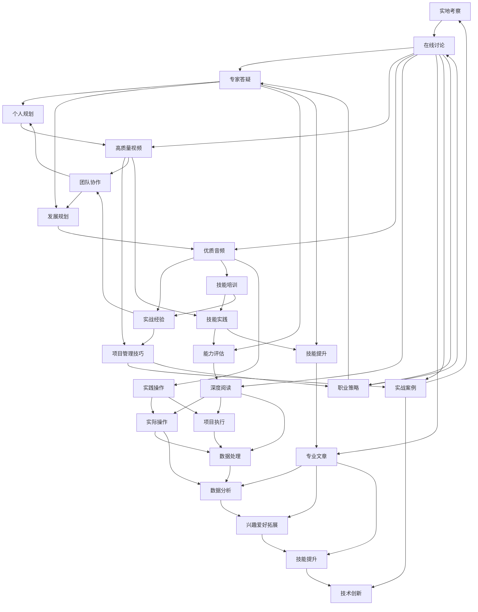

                 

# 知识付费创业的产品矩阵构建策略

## 1. 背景介绍

随着知识付费市场的兴起，越来越多的创业者投身其中。然而，如何构建一个成功的知识付费产品矩阵，成为一个关键问题。本文将从产品矩阵构建的原理和实践两个方面，探讨知识付费创业的产品矩阵构建策略，帮助创业者在激烈的市场竞争中取得优势。

## 2. 核心概念与联系

### 2.1 核心概念概述

1. **知识付费产品矩阵**：是指知识付费平台根据用户需求、市场特点和自身资源，构建的多维度、多层次的产品体系，旨在满足不同用户群体和不同阶段的学习需求。

2. **产品矩阵构建**：是知识付费创业中，将不同类型的产品有机组合起来，形成相互支持和补充的关系，以实现整体业务价值的最大化。

3. **用户需求多样性**：用户在知识付费平台上有着多元化的需求，从短期学习提升到长期职业发展，从学术研究到个人兴趣培养，不同用户群体的需求各不相同。

4. **市场竞争激烈**：知识付费市场的快速增长吸引了大批竞争对手，如何在竞争中脱颖而出，构建具有差异化的产品矩阵成为关键。

5. **内容资源丰富**：知识付费平台拥有丰富的内容资源，包括视频课程、音频讲座、电子书、专栏文章等，如何高效利用这些资源，提供优质内容，是产品矩阵构建的基础。

6. **技术平台支持**：构建知识付费产品矩阵需要强大的技术支持，包括内容管理系统、推荐系统、支付系统等，以实现高效的用户体验和精准推荐。

7. **用户数据洞察**：通过数据分析，了解用户行为和偏好，进而优化产品矩阵，提升用户体验和满意度。

### 2.2 核心概念原理和架构的 Mermaid 流程图



## 3. 核心算法原理 & 具体操作步骤

### 3.1 算法原理概述

知识付费产品矩阵的构建，本质上是将多维度的用户需求映射到多层次的产品体系中，形成一个相互支持和补充的关系，以实现整体业务价值的最大化。这一过程涉及用户行为分析、内容资源匹配、产品推荐算法等多个方面。

1. **用户行为分析**：通过数据分析工具，对用户的学习行为、偏好、评价等进行深度分析，了解用户需求的多样性和层次性。

2. **内容资源匹配**：根据用户需求，匹配最适合的内容资源，包括视频课程、音频讲座、电子书、专栏文章等。

3. **产品推荐算法**：构建推荐算法模型，根据用户行为数据和内容资源属性，实现内容的精准推荐，提升用户满意度和留存率。

4. **产品矩阵优化**：根据用户反馈和市场变化，动态调整产品矩阵，优化产品组合，提高整体业务效果。

### 3.2 算法步骤详解

1. **用户需求分析**：通过问卷调查、用户行为数据分析等手段，收集用户的学习需求和痛点，形成用户画像。

2. **内容资源分类**：将平台上的内容资源按照学习目标、难度、形式等维度进行分类，形成内容资源库。

3. **产品设计**：根据用户需求和内容资源分类，设计出多层次、多维度的产品组合，包括短期课程、长期课程、职业技能、学术研究、兴趣培养等。

4. **推荐算法开发**：构建推荐算法模型，使用协同过滤、内容推荐、混合推荐等技术，实现内容的精准推荐。

5. **用户体验优化**：根据用户反馈，不断优化产品界面和功能，提升用户体验。

6. **市场反馈调整**：定期分析市场反馈和用户行为数据，调整产品矩阵，优化产品组合。

### 3.3 算法优缺点

**优点**：

1. **满足多样化需求**：通过构建多层次、多维度的产品矩阵，可以满足不同用户群体的多样化需求。

2. **提高用户满意度**：通过精准的内容推荐和优化用户体验，提高用户满意度和留存率。

3. **增强市场竞争力**：构建具有差异化的产品矩阵，在竞争中脱颖而出。

**缺点**：

1. **初期投入大**：构建产品矩阵需要大量的人力、物力和财力投入。

2. **内容资源要求高**：需要丰富的内容资源作为支撑，这对平台的内容采集和制作能力提出了高要求。

3. **推荐算法复杂**：构建推荐算法模型需要高水平的技术支撑，算法复杂度较高。

4. **用户需求变化快**：用户需求和市场环境变化快，产品矩阵需要不断调整和优化。

### 3.4 算法应用领域

知识付费产品矩阵的构建，可以应用于多个领域，包括教育培训、职业发展、兴趣爱好、生活技能等。

1. **教育培训**：通过构建多层次的短期和长期课程，满足不同年龄段和学习阶段的学习需求。

2. **职业发展**：提供职业技能培训、职业指导、职业测试等内容，帮助用户实现职业转型和晋升。

3. **兴趣爱好**：提供丰富的兴趣爱好课程，满足用户的个人兴趣和爱好。

4. **生活技能**：提供生活技能培训课程，如烹饪、健身、理财等，提升用户的生活质量。

## 4. 数学模型和公式 & 详细讲解 & 举例说明

### 4.1 数学模型构建

知识付费产品矩阵的构建，涉及多个子模型，包括用户行为分析模型、内容资源匹配模型、推荐算法模型等。以推荐算法模型为例，其数学模型构建如下：

设用户 $u$ 对内容资源 $i$ 的兴趣为 $r_{ui}$，内容资源 $i$ 的权重为 $w_i$，用户 $u$ 的权重为 $w_u$，则推荐算法模型可以表示为：

$$
r_{ui} = f(w_u, w_i, u_i)
$$

其中，$f$ 表示用户兴趣的计算函数，$u_i$ 表示用户 $u$ 对内容资源 $i$ 的评价，$w_u$ 和 $w_i$ 分别表示用户和内容的权重。

### 4.2 公式推导过程

以协同过滤推荐算法为例，其推导过程如下：

设用户 $u$ 和内容资源 $i$ 的评分分别为 $r_{ui}$ 和 $r_{ij}$，内容资源 $i$ 和 $j$ 的评分矩阵为 $R_{ij}$，用户 $u$ 和内容资源 $i$ 的相似度为 $s_{ui}$，则协同过滤推荐算法可以表示为：

$$
r_{ui} = \sum_{j=1}^{n} s_{uj} r_{ij} / \sum_{j=1}^{n} s_{uj}
$$

其中，$n$ 表示用户或内容的数量，$s_{uj}$ 表示用户 $u$ 和内容资源 $j$ 的相似度。

### 4.3 案例分析与讲解

以某在线教育平台的产品矩阵构建为例，平台通过分析用户行为数据，构建了以下产品矩阵：

| 产品类型 | 短期课程 | 长期课程 | 职业技能 | 学术研究 | 兴趣培养 |
| --- | --- | --- | --- | --- | --- |
| 视频课程 | 数学分析基础 | 高级编程 | 项目管理 | 数据科学 | 艺术鉴赏 |
| 音频讲座 | 高效学习技巧 | 职业发展策略 | 团队协作 | 科学探索 | 心理健康 |
| 电子书 | 学习方法指南 | 职业规划手册 | 项目管理工具 | 科研方法论 | 旅游攻略 |
| 专栏文章 | 学习心得分享 | 职业案例分析 | 技能提升指南 | 学术热点 | 生活方式 |
| 线下活动 | 互动工作坊 | 专业培训 | 职业技能大赛 | 学术交流会 | 文化沙龙 |
| 社区互动 | 学习小组 | 专家论坛 | 职业咨询 | 学术讨论 | 兴趣爱好圈 |

平台通过构建推荐算法模型，对用户行为数据进行分析，实现内容的精准推荐。例如，某用户浏览了多个职业技能相关的视频课程和专栏文章，平台根据用户行为数据，推荐了“高级编程”课程和“团队协作”讲座，满足了用户的职业发展需求。

## 5. 项目实践：代码实例和详细解释说明

### 5.1 开发环境搭建

1. **服务器搭建**：使用阿里云或AWS等云服务搭建服务器，安装Linux操作系统。

2. **环境配置**：安装Python 3.x、MySQL、Redis等常用软件，配置开发环境。

3. **开发工具**：安装PyCharm、Jupyter Notebook等开发工具。

4. **数据库搭建**：搭建MySQL数据库，存储用户数据、课程数据等。

5. **缓存系统**：搭建Redis缓存系统，提高数据查询效率。

6. **消息队列**：搭建消息队列系统，如RabbitMQ，实现用户行为数据的实时处理和推荐算法模型的迭代优化。

### 5.2 源代码详细实现

以下是一个简单的推荐算法代码实现，基于协同过滤推荐算法：

```python
from pymongo import MongoClient
import numpy as np

# 连接MongoDB数据库
client = MongoClient('mongodb://localhost:27017/')
db = client['knowledgepay']
collection = db['user_behavior']

# 获取用户行为数据
user_behavior = collection.find_one({'user_id': 'u1'})

# 计算用户对内容资源的评分
ratings = {}
for item_id, rating in user_behavior['items']:
    ratings[item_id] = rating

# 计算内容资源间的相似度
similarity_matrix = {}
for item_id1, item_id2 in product_matrix:
    if item_id1 not in ratings or item_id2 not in ratings:
        continue
    rating1 = ratings[item_id1]
    rating2 = ratings[item_id2]
    similarity_matrix[item_id1, item_id2] = rating1 * rating2

# 计算用户对未评分内容的预测评分
predicted_ratings = {}
for item_id in unrated_items:
    if item_id not in similarity_matrix:
        continue
    predicted_ratings[item_id] = np.average([similarity_matrix[item_id, item_id1] for item_id1 in rated_items])

# 获取预测评分最高的内容资源
recommended_items = sorted(predicted_ratings, key=predicted_ratings.get, reverse=True)[:10]
```

### 5.3 代码解读与分析

代码中的关键部分如下：

1. **用户行为数据获取**：通过MongoDB数据库，获取用户对内容资源的评分数据。

2. **内容资源相似度计算**：计算内容资源间的相似度矩阵，基于用户对内容的评分数据。

3. **用户未评分内容的预测评分计算**：根据相似度矩阵，计算用户对未评分内容的预测评分。

4. **推荐内容资源获取**：根据预测评分，获取推荐内容资源。

5. **推荐算法模型优化**：可以根据用户反馈和市场变化，优化相似度计算和预测评分计算方法，提高推荐效果。

### 5.4 运行结果展示

通过上述推荐算法代码，可以实现对用户行为数据的实时处理和推荐内容资源的精准推荐。例如，某用户在平台上浏览了多个关于Python编程的视频课程，平台根据用户行为数据，推荐了“数据科学”课程和“机器学习”讲座，满足了用户的进一步学习需求。

## 6. 实际应用场景

### 6.1 教育培训

在线教育平台通过构建知识付费产品矩阵，可以满足不同年龄段和学习阶段的学习需求。例如，某平台通过分析用户行为数据，构建了以下产品矩阵：

| 产品类型 | 短期课程 | 长期课程 | 职业技能 | 学术研究 | 兴趣培养 |
| --- | --- | --- | --- | --- | --- |
| 视频课程 | 数学分析基础 | 高级编程 | 项目管理 | 数据科学 | 艺术鉴赏 |
| 音频讲座 | 高效学习技巧 | 职业发展策略 | 团队协作 | 科学探索 | 心理健康 |
| 电子书 | 学习方法指南 | 职业规划手册 | 项目管理工具 | 科研方法论 | 旅游攻略 |
| 专栏文章 | 学习心得分享 | 职业案例分析 | 技能提升指南 | 学术热点 | 生活方式 |

平台通过构建推荐算法模型，对用户行为数据进行分析，实现内容的精准推荐。例如，某用户浏览了多个职业技能相关的视频课程和专栏文章，平台根据用户行为数据，推荐了“高级编程”课程和“团队协作”讲座，满足了用户的职业发展需求。

### 6.2 职业发展

在线职业发展平台通过构建知识付费产品矩阵，提供职业技能培训、职业指导、职业测试等内容，帮助用户实现职业转型和晋升。例如，某平台通过分析用户行为数据，构建了以下产品矩阵：

| 产品类型 | 职业技能 | 学术研究 | 职业测试 |
| --- | --- | --- | --- |
| 视频课程 | 项目管理 | 数据科学 | 职业兴趣测试 |
| 音频讲座 | 团队协作 | 科研方法论 | 职业发展策略 |
| 电子书 | 项目管理工具 | 学术论文 | 职业规划手册 |
| 专栏文章 | 技能提升指南 | 学术热点 | 职业案例分析 |

平台通过构建推荐算法模型，对用户行为数据进行分析，实现内容的精准推荐。例如，某用户浏览了多个项目管理相关的视频课程和专栏文章，平台根据用户行为数据，推荐了“高级编程”课程和“团队协作”讲座，满足了用户的职业发展需求。

### 6.3 兴趣爱好

在线兴趣爱好平台通过构建知识付费产品矩阵，提供丰富的兴趣爱好课程，满足用户的个人兴趣和爱好。例如，某平台通过分析用户行为数据，构建了以下产品矩阵：

| 产品类型 | 艺术鉴赏 | 音乐创作 | 摄影技巧 | 运动健身 | 旅游攻略 |
| --- | --- | --- | --- | --- | --- |
| 视频课程 | 艺术鉴赏 | 音乐创作 | 摄影技巧 | 运动健身 | 旅游攻略 |
| 音频讲座 | 艺术历史 | 音乐理论 | 摄影实践 | 健身指导 | 旅游攻略 |
| 电子书 | 艺术鉴赏指南 | 音乐创作技巧 | 摄影实践指南 | 健身指导手册 | 旅游攻略指南 |
| 专栏文章 | 艺术鉴赏心得 | 音乐创作心得 | 摄影技巧分享 | 健身指导经验 | 旅游攻略分享 |

平台通过构建推荐算法模型，对用户行为数据进行分析，实现内容的精准推荐。例如，某用户浏览了多个摄影技巧相关的视频课程和专栏文章，平台根据用户行为数据，推荐了“摄影技巧”课程和“摄影实践”讲座，满足了用户的兴趣爱好需求。

## 7. 工具和资源推荐

### 7.1 学习资源推荐

1. **《数据挖掘导论》**：斯坦福大学开设的Data Mining课程，提供丰富的数据挖掘知识。

2. **《推荐系统》**：清华大学开设的推荐系统课程，详细讲解推荐算法原理和实现。

3. **《用户行为分析》**：Rice University开设的User Behavior Analysis课程，讲解用户行为分析的方法和技术。

4. **《Python数据科学手册》**：PyCon大会上的Python数据科学演讲，讲解Python在数据科学中的应用。

5. **Kaggle**：Kaggle是一个数据科学竞赛平台，提供丰富的数据集和竞赛任务，帮助学习者实践数据挖掘和推荐算法。

### 7.2 开发工具推荐

1. **PyCharm**：一款Python开发工具，提供强大的代码编辑和调试功能。

2. **Jupyter Notebook**：一款交互式编程工具，支持Python、R等语言，适合数据分析和机器学习。

3. **MySQL**：一款开源关系型数据库，支持大容量数据存储和查询。

4. **Redis**：一款内存数据库，支持高并发读写操作，适合缓存系统构建。

5. **RabbitMQ**：一款消息队列系统，支持消息的异步处理和数据实时处理。

### 7.3 相关论文推荐

1. **《协同过滤推荐算法》**：讲述协同过滤推荐算法的基本原理和实现方法。

2. **《基于深度学习的推荐系统》**：讲述深度学习在推荐系统中的应用。

3. **《用户行为分析》**：讲述用户行为分析的方法和应用场景。

4. **《知识图谱构建与推荐系统》**：讲述知识图谱在推荐系统中的应用。

5. **《个性化推荐系统综述》**：对现有的个性化推荐系统进行总结和分析。

## 8. 总结：未来发展趋势与挑战

### 8.1 研究成果总结

1. **产品矩阵构建**：通过构建多层次、多维度的产品矩阵，可以满足不同用户群体的多样化需求，提升用户满意度和留存率。

2. **推荐算法优化**：构建推荐算法模型，对用户行为数据进行分析，实现内容的精准推荐，提高用户转化率和平台收益。

3. **用户行为分析**：通过用户行为数据分析，了解用户需求的多样性和层次性，优化产品矩阵和推荐算法，提高平台的用户体验和市场竞争力。

4. **技术平台支持**：构建强大的技术平台，支持内容管理系统、推荐系统、支付系统等，提升平台的稳定性和可扩展性。

### 8.2 未来发展趋势

1. **个性化推荐**：随着大数据和人工智能技术的发展，推荐系统将更加个性化，能够根据用户的行为数据和历史数据，实现更精准的推荐。

2. **实时处理**：推荐系统将具备实时处理能力，能够根据用户行为数据的实时变化，动态调整推荐策略，提升用户体验。

3. **多模态数据融合**：推荐系统将引入多模态数据，如视频、音频、图像等，实现跨模态的推荐，提升推荐效果。

4. **知识图谱应用**：推荐系统将引入知识图谱技术，利用结构化的知识信息，提升推荐的准确性和可靠性。

5. **深度学习应用**：推荐系统将引入深度学习技术，提升推荐的准确性和泛化能力。

### 8.3 面临的挑战

1. **数据隐私和安全**：用户在平台上的行为数据和个人信息需要得到保护，避免数据泄露和滥用。

2. **算法公平性和透明性**：推荐算法需要公平、透明，避免算法偏见和歧视。

3. **计算资源消耗**：推荐算法需要大量的计算资源，如何优化算法，提高计算效率，是未来的重要研究方向。

4. **用户体验优化**：推荐系统需要优化用户体验，提升用户的互动性和粘性，避免用户体验的下降。

5. **市场竞争压力**：知识付费市场的竞争日益激烈，如何保持平台的竞争优势，吸引用户和用户留存，是未来的重要课题。

### 8.4 研究展望

1. **多模态推荐系统**：引入多模态数据，如视频、音频、图像等，实现跨模态的推荐，提升推荐效果。

2. **深度学习在推荐系统中的应用**：引入深度学习技术，提升推荐的准确性和泛化能力。

3. **推荐系统的实时化**：提升推荐系统的实时处理能力，能够根据用户行为数据的实时变化，动态调整推荐策略。

4. **推荐系统的公平性和透明性**：构建公平、透明的推荐算法，避免算法偏见和歧视。

5. **推荐系统的个性化**：构建更加个性化的推荐系统，能够根据用户的行为数据和历史数据，实现更精准的推荐。

6. **推荐系统的隐私保护**：加强对用户行为数据的隐私保护，避免数据泄露和滥用。

通过不断优化推荐算法和产品矩阵，提升用户体验和平台竞争力，知识付费创业将迎来更加广阔的发展前景。

## 9. 附录：常见问题与解答

**Q1：知识付费产品矩阵如何构建？**

A: 知识付费产品矩阵的构建，需要根据用户需求、市场特点和自身资源，设计多层次、多维度的产品组合。通过分析用户行为数据，优化产品矩阵，实现内容的精准推荐。

**Q2：推荐算法的优缺点有哪些？**

A: 推荐算法的优点包括满足多样化需求、提高用户满意度和留存率、增强市场竞争力等。缺点包括初期投入大、内容资源要求高、算法复杂等。

**Q3：知识付费平台的推荐系统如何优化？**

A: 知识付费平台的推荐系统可以通过用户行为数据分析、内容资源匹配、推荐算法优化等手段进行优化。同时，可以通过多模态数据融合、深度学习应用、实时处理等技术提升推荐效果。

**Q4：知识付费平台如何保护用户数据隐私？**

A: 知识付费平台可以通过数据加密、访问控制、数据匿名化等手段保护用户数据隐私，避免数据泄露和滥用。

**Q5：知识付费平台的推荐系统如何保持公平性和透明性？**

A: 知识付费平台的推荐系统可以通过公平性分析、透明性评估等手段，保持算法的公平性和透明性，避免算法偏见和歧视。

作者：禅与计算机程序设计艺术 / Zen and the Art of Computer Programming

