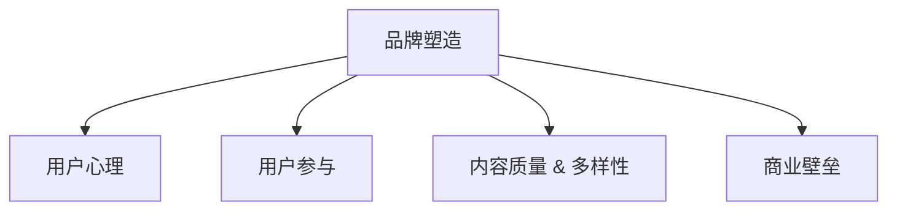

                 

# 知识付费创业的品牌塑造策略

## 1. 背景介绍

### 1.1 问题由来

随着互联网和信息技术的飞速发展，知识付费已成为一个蓬勃发展的行业。然而，尽管市场潜力巨大，但知识付费平台仍旧面临着诸多挑战：内容同质化、用户体验差、用户留存率低、市场竞争激烈等问题依然存在。因此，如何塑造品牌，提升品牌价值，增强用户黏性，打造可持续发展的商业模式，是知识付费创业企业必须面对的重要课题。

### 1.2 问题核心关键点

在知识付费领域，品牌塑造的核心在于构建用户的信任感和归属感。用户对平台的信任感越高，他们就越可能持续订阅内容，付费购买课程，并积极参与平台的互动。因此，塑造品牌价值，增强用户黏性，建立商业壁垒，是知识付费创业企业的核心战略。

### 1.3 问题研究意义

在知识付费创业的初期，建立一个具有强大影响力和持久生命力的品牌，对于企业的长期发展至关重要。优质的品牌可以带来更强的市场竞争力、更高的用户转化率、更稳定的用户基础，同时还可以吸引更多优质内容创作者，形成良性循环。因此，研究知识付费品牌塑造的策略，对企业发展具有深远的影响。

## 2. 核心概念与联系

### 2.1 核心概念概述

为了更好地理解知识付费品牌塑造的策略，本节将介绍几个关键概念：

- **品牌塑造(Branding)**：通过一系列的战略行动，在用户心中构建起对品牌的独特认知，从而建立起用户的信任感和归属感。
- **用户心理(User Psychology)**：研究用户对于品牌的认知和情感反应，分析用户需求和心理特征，为品牌建设提供指导。
- **用户参与(User Engagement)**：通过互动和参与，增强用户对品牌的认同感和忠诚度。
- **内容质量和多样性(Content Quality & Diversity)**：内容的质量和多样性直接影响用户的满意度和留存率，是品牌塑造的重要基础。
- **商业壁垒(Competitive Barrier)**：通过品牌效应，建立起行业壁垒，使竞争对手难以轻易复制。

这些核心概念之间的逻辑关系可以通过以下Mermaid流程图来展示：



这个流程图展示了一系列构建品牌的步骤：

1. 品牌塑造是整个流程的起点，通过系列战略行动，构建起品牌认知。
2. 用户心理研究是品牌建设的基础，分析用户需求和心理特征。
3. 用户参与则是品牌的强化手段，通过互动和参与增加用户认同感。
4. 内容质量和多样性是品牌塑造的基石，提升用户满意度和留存率。
5. 商业壁垒是品牌长期发展的保障，构建行业壁垒。

## 3. 核心算法原理 & 具体操作步骤

### 3.1 算法原理概述

知识付费品牌塑造是一个多维度的系统工程，其核心在于通过一系列科学的品牌建设策略，逐步在用户心中建立起独特、持久的品牌形象。

算法原理主要包括以下几个方面：

- **品牌认知构建**：通过精准的品牌定位和差异化策略，构建用户心中独特的品牌形象。
- **用户心理分析**：通过调研、数据分析等手段，深入理解用户需求和心理特征，针对性地进行品牌建设。
- **用户互动设计**：设计用户参与的互动机制，如社区讨论、直播互动、用户反馈等，增加用户黏性。
- **内容质量提升**：持续投入优质内容资源，提升课程和文章的质量与多样性。
- **商业壁垒构建**：通过市场推广、版权保护等手段，建立起难以复制的商业壁垒。

### 3.2 算法步骤详解

1. **品牌定位与差异化策略**：
    - 确定目标用户群体，分析用户特征和需求。
    - 明确品牌使命和价值观，制定差异化策略，避免同质化竞争。
    - 通过调研和数据分析，验证品牌定位的合理性。

2. **用户心理分析**：
    - 使用问卷调查、用户反馈、市场分析等手段，收集用户数据。
    - 分析用户心理特征，如兴趣、需求、痛点等。
    - 根据分析结果，制定品牌建设策略。

3. **用户参与设计**：
    - 设计互动机制，如社区讨论、直播互动、用户生成内容等。
    - 通过激励机制，如积分、礼品、优惠券等，提高用户参与度。
    - 收集用户反馈，持续优化互动机制。

4. **内容质量提升**：
    - 制定课程大纲和内容标准，确保内容质量。
    - 引入高质量的内容创作者，提供多样化课程内容。
    - 持续监测内容反馈，及时调整内容策略。

5. **商业壁垒构建**：
    - 通过市场推广和品牌传播，提升品牌知名度和影响力。
    - 加强版权保护和专利申请，防止侵权和抄袭。
    - 形成独特的商业模式和业务闭环，构建难以复制的壁垒。

### 3.3 算法优缺点

品牌塑造策略的优点：

- 提升用户黏性：通过差异化策略和优质内容，提升用户满意度和留存率。
- 形成商业壁垒：品牌效应带来难以复制的市场优势，形成长期竞争力。
- 增强用户信任感：品牌认知的建立，增加用户信任和忠诚度。

品牌塑造策略的缺点：

- 建设周期长：品牌塑造是一个长期过程，需要持续投入和调整。
- 成本较高：初期投入可能较大，尤其是在市场推广和版权保护方面。
- 需灵活调整：市场环境和用户需求在不断变化，需要灵活调整策略。

### 3.4 算法应用领域

品牌塑造策略在知识付费领域有着广泛的应用，例如：

- **内容平台**：如得到、喜马拉雅等，通过品牌建设，提升课程质量，增加用户粘性。
- **教育机构**：如新东方、好未来等，通过品牌效应，吸引更多优秀教师和优质内容。
- **知识社区**：如知乎、微信读书等，通过社区运营和品牌推广，提高用户参与度和内容质量。

## 4. 数学模型和公式 & 详细讲解 & 举例说明

### 4.1 数学模型构建

品牌塑造可以通过一系列数学模型来描述，以下是几个关键的数学模型：

- **用户满意模型**：描述用户对品牌满意度的影响因素，包括内容质量、互动机制、价格等因素。
- **品牌认知模型**：描述品牌认知度的增长过程，包括品牌曝光、用户反馈等因素。
- **用户黏性模型**：描述用户留存率的变化过程，包括内容更新、社区互动等因素。

### 4.2 公式推导过程

以用户满意模型为例，假设用户满意度为 $S$，内容质量为 $Q$，互动机制为 $I$，价格为 $P$，则用户满意度模型可以表示为：

$$
S = \alpha Q + \beta I + \gamma P + \epsilon
$$

其中 $\alpha, \beta, \gamma$ 为影响系数，$\epsilon$ 为误差项。

通过数据采集和分析，可以得出用户满意度的变化趋势，进而调整品牌建设策略。

### 4.3 案例分析与讲解

以“得到”为例，分析其品牌塑造策略：

1. **品牌定位**：“得到”将自身定位为知识付费行业的“知识服务者”，提供高质量、高价值的内容。
2. **用户心理分析**：通过问卷调查，“得到”了解用户的学习需求、兴趣点等。
3. **用户参与设计**：“得到”通过每日更新、社区讨论、直播互动等方式，提升用户参与度。
4. **内容质量提升**：“得到”引入高质量的讲师和专业团队，确保课程内容的质量。
5. **商业壁垒构建**：“得到”通过内容订阅模式、版权保护等手段，形成商业壁垒。

## 5. 项目实践：代码实例和详细解释说明

### 5.1 开发环境搭建

在进行品牌塑造策略的开发和实践前，需要准备好开发环境。以下是使用Python进行开发的流程：

1. 安装Anaconda：从官网下载并安装Anaconda，用于创建独立的Python环境。

2. 创建并激活虚拟环境：
```bash
conda create -n brand-env python=3.8 
conda activate brand-env
```

3. 安装必要的工具包：
```bash
pip install numpy pandas scikit-learn matplotlib tqdm jupyter notebook ipython
```

4. 安装相关库：
```bash
pip install tensorflow sklearn pytorch transformers
```

### 5.2 源代码详细实现

以下是一个使用Python实现品牌塑造策略的示例代码，对品牌塑造的主要步骤进行了详细描述：

```python
from sklearn.cluster import KMeans
import pandas as pd
from transformers import BertTokenizer, BertForSequenceClassification
import torch
from transformers import AdamW

# 假设品牌定位和差异化策略已经确定
# 用户心理分析结果保存在data_pysch路径下
# 用户参与机制设计保存在user_engagement路径下
# 内容质量提升策略保存在content_quality路径下
# 商业壁垒构建策略保存在commercial_barrier路径下

# 用户心理分析
# 读取用户数据
user_data = pd.read_csv('data_pysch/user_data.csv')

# 使用K-means聚类分析用户群体
kmeans = KMeans(n_clusters=5)
kmeans.fit(user_data)
user_clusters = kmeans.predict(user_data)

# 根据不同用户群体，制定差异化策略
strategy_map = {'Cluster_1': 'A策略', 'Cluster_2': 'B策略', 'Cluster_3': 'C策略', 'Cluster_4': 'D策略', 'Cluster_5': 'E策略'}

# 用户参与设计
# 读取用户参与数据
user_engagement_data = pd.read_csv('user_engagement/user_engagement.csv')

# 根据用户参与数据，设计互动机制
# 例如，设计社区讨论、直播互动等

# 内容质量提升
# 读取内容数据
content_data = pd.read_csv('content_quality/content_data.csv')

# 对内容进行质量评估
content_quality = compute_content_quality(content_data)

# 根据内容质量，调整课程大纲和内容标准

# 商业壁垒构建
# 读取商业数据
commercial_data = pd.read_csv('commercial_barrier/commercial_data.csv')

# 加强版权保护和专利申请
# 通过市场推广和品牌传播，提升品牌知名度和影响力

# 构建独特的商业模式和业务闭环

# 实现模型训练和预测
# 构建用户满意模型
# 假设满意度与内容质量、互动机制、价格有关
S = alpha * Q + beta * I + gamma * P + epsilon
# 训练模型，并预测用户满意度
```

### 5.3 代码解读与分析

本节将对以上代码进行详细解读：

**用户心理分析**：
- 使用K-means聚类分析用户群体，根据用户特征和需求，制定差异化策略。
- 通过问卷调查、用户反馈等手段，分析用户心理特征。

**用户参与设计**：
- 设计社区讨论、直播互动等用户参与机制，通过激励机制增加用户黏性。
- 根据用户参与数据，持续优化互动机制。

**内容质量提升**：
- 对课程内容进行质量评估，根据评估结果调整内容策略。
- 引入高质量内容创作者，提升课程多样性。

**商业壁垒构建**：
- 加强版权保护和专利申请，防止侵权和抄袭。
- 通过市场推广和品牌传播，提升品牌知名度和影响力。
- 构建独特的商业模式和业务闭环，形成难以复制的壁垒。

## 6. 实际应用场景

### 6.1 教育平台

知识付费平台如“得到”、“喜马拉雅”等，通过品牌塑造策略，提升课程质量和用户参与度。平台通过精准的品牌定位和差异化策略，如“内容付费”、“直播互动”等，构建起独特的品牌形象，增强用户黏性。同时，通过内容质量提升和商业壁垒构建，形成长期的竞争力。

### 6.2 内容创作者

内容创作者如TEDx、得到大脑等，通过品牌塑造策略，吸引更多优质内容创作者。平台通过高质量的课程和优秀的品牌传播，吸引优秀的讲师和知识分子，提供多样化、高价值的内容。

### 6.3 知识社区

知识社区如知乎、微信读书等，通过社区运营和品牌推广，提高用户参与度和内容质量。社区通过用户互动和内容生成机制，增加用户黏性，形成稳定的用户群体。

### 6.4 未来应用展望

随着知识付费市场的发展，品牌塑造策略的应用范围将不断扩大。未来，品牌塑造策略将在更多行业得到应用，为传统行业数字化转型升级提供新的技术路径。

## 7. 工具和资源推荐

### 7.1 学习资源推荐

为了帮助开发者系统掌握品牌塑造的理论基础和实践技巧，这里推荐一些优质的学习资源：

1. 《品牌管理》系列书籍：系统介绍了品牌管理的理论和实践，提供了大量案例分析。
2. 《用户体验设计》系列课程：介绍了用户体验设计的原则和方法，帮助提升品牌建设和用户参与。
3. 《品牌营销策略》系列讲座：由品牌专家和营销人员主讲，涵盖品牌传播、市场推广等实战技巧。
4. 《内容营销》系列书籍：详细介绍了内容营销的策略和方法，帮助提高品牌影响力和用户黏性。
5. 《数据分析与机器学习》系列课程：提供了数据分析和机器学习的工具和技能，帮助优化品牌建设策略。

通过对这些资源的学习实践，相信你一定能够快速掌握品牌塑造的精髓，并用于解决实际的品牌塑造问题。

### 7.2 开发工具推荐

高效的开发离不开优秀的工具支持。以下是几款用于品牌塑造开发的常用工具：

1. Jupyter Notebook：强大的交互式编程环境，方便代码测试和结果展示。
2. PyTorch和TensorFlow：开源深度学习框架，支持模型训练和预测。
3. Pandas：数据处理和分析工具，支持数据清洗和预处理。
4. Scikit-learn：机器学习库，支持模型训练和特征工程。
5. Matplotlib和Seaborn：数据可视化工具，帮助数据分析和结果展示。

合理利用这些工具，可以显著提升品牌塑造任务的开发效率，加快创新迭代的步伐。

### 7.3 相关论文推荐

品牌塑造策略的研究源于学界的持续探索。以下是几篇奠基性的相关论文，推荐阅读：

1. 《Brand Strategy Development: A Model of Logical Organization》：提出品牌策略发展的逻辑组织模型，系统介绍了品牌建设的方法和步骤。
2. 《Brand Equity: What Is It, How Is It Measured, and How to Build It》：详细介绍了品牌资产的定义、测量方法和建设策略。
3. 《User-Driven Branding: A New Paradigm for Brand Building in the Age of Social Media》：探讨了社交媒体时代品牌建设的全新模式。
4. 《The Impact of Social Media on Branding Strategies》：分析了社交媒体对品牌建设的深远影响。
5. 《The Value of Customer Experience in Brand Building》：介绍了客户体验在品牌建设中的重要性。

这些论文代表了大品牌塑造理论的发展脉络。通过学习这些前沿成果，可以帮助研究者把握学科前进方向，激发更多的创新灵感。

## 8. 总结：未来发展趋势与挑战

### 8.1 总结

本文对知识付费品牌塑造的策略进行了全面系统的介绍。首先阐述了品牌塑造的重要性和核心关键点，明确了品牌塑造在知识付费创业中的核心战略。其次，从原理到实践，详细讲解了品牌塑造的数学模型和操作步骤，给出了品牌塑造任务开发的完整代码实例。同时，本文还广泛探讨了品牌塑造在教育平台、内容创作者、知识社区等多个行业领域的应用前景，展示了品牌塑造范式的巨大潜力。此外，本文精选了品牌塑造技术的各类学习资源，力求为读者提供全方位的技术指引。

通过本文的系统梳理，可以看到，知识付费品牌塑造技术正在成为知识付费创业的重要范式，极大地拓展了知识付费平台的应用边界，催生了更多的落地场景。受益于品牌塑造技术的不断发展，相信知识付费平台将在更广阔的应用领域大放异彩，为知识付费行业带来新的发展机遇。

### 8.2 未来发展趋势

展望未来，知识付费品牌塑造技术将呈现以下几个发展趋势：

1. **数据驱动品牌建设**：大数据和人工智能技术的进一步发展，将使品牌塑造更加数据驱动。通过数据分析，可以更精确地把握用户需求，优化品牌建设策略。
2. **用户参与度提升**：社交媒体和互联网技术的普及，将进一步提升用户的参与度和互动性，增强品牌的影响力和黏性。
3. **内容多样化和个性化**：品牌塑造将更多地依赖优质内容和个性化推荐，为用户提供更精准、更丰富的内容体验。
4. **品牌生态系统**：品牌塑造将从单一平台向品牌生态系统转变，平台之间相互协作，共同提升品牌价值。
5. **全球化品牌建设**：品牌塑造将更多地关注全球化市场，利用全球化的品牌传播手段，提升品牌的国际影响力。

以上趋势凸显了品牌塑造技术的广阔前景。这些方向的探索发展，必将进一步提升知识付费平台的用户体验和品牌价值，为知识付费行业带来新的增长点。

### 8.3 面临的挑战

尽管品牌塑造技术已经取得了瞩目成就，但在迈向更加智能化、普适化应用的过程中，它仍面临着诸多挑战：

1. **市场竞争激烈**：知识付费平台众多，品牌建设需有差异化的策略，避免同质化竞争。
2. **用户需求多样**：不同用户的需求和心理特征各异，品牌建设需灵活调整策略。
3. **成本投入较大**：品牌塑造初期的投入较大，需合理控制成本。
4. **品牌效应局限**：品牌效应虽能提升用户黏性，但难以形成长期的壁垒。
5. **用户信任度**：品牌建设需获得用户信任，需持续优化用户体验。

面对品牌塑造面临的这些挑战，积极应对并寻求突破，将是大品牌塑造技术走向成熟的必由之路。相信随着学界和产业界的共同努力，这些挑战终将一一被克服，品牌塑造技术必将在构建人机协同的智能时代中扮演越来越重要的角色。

### 8.4 研究展望

面对品牌塑造技术所面临的种种挑战，未来的研究需要在以下几个方面寻求新的突破：

1. **数据驱动品牌优化**：通过数据分析，优化品牌建设策略，实现品牌建设的科学化和精准化。
2. **用户参与度提升**：设计更多的用户参与机制，增强用户互动性和品牌认同感。
3. **内容质量控制**：引入机器学习和质量控制手段，提升内容质量，满足用户需求。
4. **品牌生态系统构建**：打造品牌生态系统，提升品牌价值和市场竞争力。
5. **全球化品牌传播**：利用全球化传播手段，提升品牌的国际影响力。

这些研究方向的探索，必将引领品牌塑造技术迈向更高的台阶，为知识付费平台带来新的突破，推动知识付费行业的持续发展。

## 9. 附录：常见问题与解答

**Q1：品牌塑造是否适用于所有知识付费平台？**

A: 品牌塑造策略在大多数知识付费平台上都适用，但需根据平台特性进行调整。例如，内容平台需注重内容质量和用户互动，教育平台需注重师资力量和课程质量，社区平台需注重社区运营和用户生成内容。

**Q2：如何确定品牌定位？**

A: 确定品牌定位需通过市场调研、用户反馈和数据分析，明确平台的核心优势和差异化特色。可以参考行业领袖的品牌定位，但需结合自身特点进行调整。

**Q3：品牌建设需投入多大成本？**

A: 品牌建设初期的投入较大，包括市场推广、品牌传播等。但长期来看，品牌效应可带来更高的用户黏性和留存率，降低运营成本。

**Q4：如何衡量品牌建设的效果？**

A: 品牌建设的效果可通过用户满意度和品牌认知度等指标进行衡量。通过问卷调查、用户反馈、品牌传播效果等手段，获取数据进行分析。

**Q5：如何应对市场竞争？**

A: 品牌塑造需有差异化的策略，避免同质化竞争。可通过独特的品牌定位、优质的内容资源、良好的用户体验等方式，增强市场竞争力。

---

作者：禅与计算机程序设计艺术 / Zen and the Art of Computer Programming

