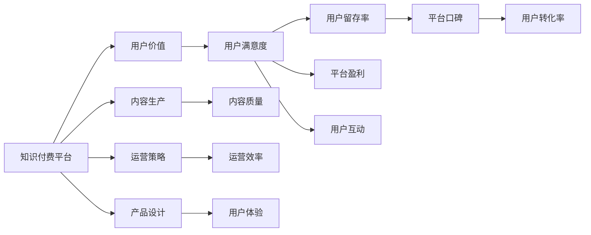

                 

# 知识付费创业的用户价值最大化

## 1. 背景介绍

在信息爆炸的今天，知识获取变得更加容易，但如何高效、精准地筛选和利用知识，成为了新的挑战。知识付费平台的出现，旨在通过付费机制筛选出高质量的内容，引导用户进行深度学习，提升个人价值。然而，用户获取的价值最大化，才是知识付费创业成功的关键。本文将从用户价值的角度，探讨知识付费平台如何优化产品设计、运营策略和内容生产，最大化用户满意度，实现商业价值。

## 2. 核心概念与联系

### 2.1 核心概念概述

- **知识付费平台(Knowledge-Paying Platform)**：通过收费模式筛选优质内容，提供用户深度学习服务的平台，如得到、喜马拉雅、知乎Live等。
- **用户价值(User Value)**：用户在平台上的实际收获和满意度，包括知识获取、技能提升、情感满足等。
- **内容生产(Content Production)**：知识付费平台的核心业务，指内容创作者提供高质量、有价值的信息和见解。
- **运营策略(Operational Strategy)**：平台的策略制定和执行，包括用户增长、内容推荐、付费机制等。
- **产品设计(Product Design)**：平台的界面设计、功能实现、用户体验等，直接影响用户价值。

这些概念之间的联系可以通过以下Mermaid流程图来展示：



这个流程图展示了知识付费平台的运营逻辑：通过高效的内容生产和合理的运营策略，优化产品设计，提升用户体验，从而实现用户价值最大化。

## 3. 核心算法原理 & 具体操作步骤

### 3.1 算法原理概述

知识付费平台的用户价值最大化，可以通过以下三个方面来理解：

1. **内容匹配**：平台通过推荐算法，将高质量内容精准推荐给用户，提高内容获取效率。
2. **用户反馈**：平台收集用户反馈，不断优化内容和运营策略，提升用户满意度。
3. **激励机制**：通过付费激励机制，筛选和奖励优质内容创作者，提升内容质量。

### 3.2 算法步骤详解

#### 3.2.1 内容匹配

**Step 1: 数据收集**
- 收集用户行为数据，包括浏览时间、点击次数、购买记录等。
- 收集内容数据，包括文本、音频、视频等格式的内容。

**Step 2: 特征提取**
- 对用户数据进行特征提取，包括兴趣标签、学习进度等。
- 对内容数据进行特征提取，包括关键字、主题、作者资质等。

**Step 3: 模型训练**
- 使用协同过滤、深度学习等方法，训练内容推荐模型。
- 使用用户画像模型，构建用户兴趣图谱。

**Step 4: 推荐实现**
- 根据用户画像和内容特征，实时计算推荐分数。
- 对推荐结果进行排序，输出推荐列表。

#### 3.2.2 用户反馈

**Step 1: 数据收集**
- 收集用户评价、评分、评论等反馈数据。
- 收集用户行为数据，如停止订阅、反复点击某内容等异常行为。

**Step 2: 数据分析**
- 使用情感分析、文本挖掘等技术，分析用户反馈内容。
- 使用机器学习模型，识别用户满意度和流失风险。

**Step 3: 反馈应用**
- 根据反馈分析结果，调整内容推荐策略。
- 对优质内容创作者进行奖励，提升内容质量。

#### 3.2.3 激励机制

**Step 1: 内容审核**
- 通过专家评审、用户投票等机制，筛选高质量内容。
- 对优质内容进行标签标注，增加曝光机会。

**Step 2: 付费激励**
- 设定合理的付费标准，引导用户支付。
- 定期举办付费活动，吸引新用户订阅。

**Step 3: 创作者激励**
- 提供流量分成、广告收益等激励，鼓励创作者持续产出优质内容。
- 举办内容大赛，提升创作者积极性和参与度。

### 3.3 算法优缺点

#### 优点

1. **精准推荐**：通过深度学习和协同过滤算法，可以准确匹配用户需求，提高用户满意度。
2. **用户参与**：通过用户反馈机制，不断优化内容和运营策略，提升用户体验。
3. **内容激励**：通过付费激励和创作者奖励，提升内容质量和平台吸引力。

#### 缺点

1. **内容同质化**：推荐算法可能造成内容同质化，缺乏个性化推荐。
2. **数据隐私**：用户行为数据和反馈数据的收集可能涉及隐私问题。
3. **付费门槛**：高付费门槛可能限制部分用户获取优质内容。

### 3.4 算法应用领域

知识付费平台的算法和策略，已经广泛应用于多种行业领域：

- **教育培训**：提供高质量课程内容，提升用户技能水平。
- **职场提升**：提供职业指导、技能培训、行业资讯等，帮助用户职业发展。
- **生活休闲**：提供健康、娱乐、美食等内容，提升用户生活质量。
- **专业领域**：提供深度学习、编程、艺术等专业内容，满足用户深度学习需求。

## 4. 数学模型和公式 & 详细讲解 & 举例说明

### 4.1 数学模型构建

知识付费平台的推荐系统，可以通过以下数学模型进行建模：

**用户兴趣表示**：
- 设用户 $u$ 对内容 $i$ 的兴趣表示为 $v_u^i$，可以表示为用户的历史行为、评分、评价等。

**内容特征表示**：
- 设内容 $i$ 的特征表示为 $v_i$，可以表示为内容的标签、关键字、作者资质等。

**推荐分数计算**：
- 设推荐分数为 $r_{ui}$，可以表示为：
  $$
  r_{ui} = w_u^T v_i
  $$
  其中 $w_u$ 为用户兴趣向量，$v_i$ 为内容特征向量，$w_u$ 和 $v_i$ 为向量乘法。

### 4.2 公式推导过程

**协同过滤算法**：
- 基于用户-物品评分矩阵 $R$，设用户 $u$ 对内容 $i$ 的评分向量为 $r_u$，内容 $i$ 的评分向量为 $r_i$，则推荐分数为：
  $$
  r_{ui} = \frac{r_u^T r_i}{||r_i|| ||r_u||}
  $$
  其中 $||r_u||$ 和 $||r_i||$ 分别为用户和内容的评分向量范数。

**深度学习推荐模型**：
- 使用深度学习模型，如神经协同过滤(NCW)，可以表示为：
  $$
  r_{ui} = w_u^T \phi(v_i)
  $$
  其中 $\phi$ 为特征映射函数，$w_u$ 为用户兴趣表示向量。

### 4.3 案例分析与讲解

以知乎Live为例，分析其推荐系统的实现和优化：

1. **数据收集**：
   - 收集用户行为数据，包括浏览时间、点击次数、购买记录等。
   - 收集内容数据，包括文本、音频、视频等格式的内容。

2. **特征提取**：
   - 对用户数据进行特征提取，包括兴趣标签、学习进度等。
   - 对内容数据进行特征提取，包括关键字、主题、作者资质等。

3. **模型训练**：
   - 使用协同过滤算法，训练用户兴趣和内容特征之间的关系。
   - 使用深度学习模型，如神经协同过滤(NCW)，提升推荐精度。

4. **推荐实现**：
   - 根据用户画像和内容特征，实时计算推荐分数。
   - 对推荐结果进行排序，输出推荐列表。

5. **用户反馈**：
   - 收集用户评价、评分、评论等反馈数据。
   - 使用情感分析、文本挖掘等技术，分析用户反馈内容。
   - 根据反馈分析结果，调整内容推荐策略。

## 5. 项目实践：代码实例和详细解释说明

### 5.1 开发环境搭建

在进行知识付费平台推荐系统开发前，我们需要准备好开发环境。以下是使用Python进行推荐系统开发的环境配置流程：

1. 安装Anaconda：从官网下载并安装Anaconda，用于创建独立的Python环境。

2. 创建并激活虚拟环境：
```bash
conda create -n recommendation-env python=3.8 
conda activate recommendation-env
```

3. 安装相关工具包：
```bash
pip install numpy pandas scikit-learn torch torchvision transformers
```

完成上述步骤后，即可在`recommendation-env`环境中开始推荐系统开发。

### 5.2 源代码详细实现

这里我们以Python实现协同过滤算法为例，给出推荐系统的代码实现。

```python
import numpy as np
from sklearn.metrics.pairwise import cosine_similarity

class RecommendationSystem:
    def __init__(self, data):
        self.data = data
        self.model = None
    
    def train(self):
        R = self.data.copy()
        R[np.isnan(R)] = 0
        user_idx, item_idx = np.where(R > 0)
        user2item = {}
        item2user = {}
        for i, j in zip(user_idx, item_idx):
            if i not in user2item:
                user2item[i] = []
            if j not in item2user:
                item2user[j] = []
            user2item[i].append(j)
            item2user[j].append(i)
        self.model = {}
        for user in user2item:
            self.model[user] = {}
            for item in user2item[user]:
                self.model[user][item] = 1
        self.model = np.array(self.model)
        self.user2item = user2item
        self.item2user = item2user
    
    def predict(self, user, item):
        R_pred = []
        for u in self.user2item:
            if u == user:
                continue
            v_pred = self.model[user] - self.model[u]
            v_pred = v_pred.reshape(-1, 1)
            R_pred.append(np.dot(v_pred, self.model[item]))
        R_pred = np.array(R_pred)
        R_pred = R_pred / np.linalg.norm(self.model[user] - self.model[u])
        return R_pred
    
    def recommend(self, user, num=10):
        R_pred = self.predict(user, self.item2user)
        idx = np.argsort(R_pred)[-num:]
        return idx[::-1]
```

### 5.3 代码解读与分析

让我们再详细解读一下关键代码的实现细节：

**RecommendationSystem类**：
- `__init__`方法：初始化用户数据和模型。
- `train`方法：对用户行为数据进行训练，构建用户-内容矩阵。
- `predict`方法：根据用户画像和内容特征，计算推荐分数。
- `recommend`方法：根据推荐分数，输出推荐列表。

**数据结构**：
- `R`：用户-内容评分矩阵。
- `user_idx`和`item_idx`：评分矩阵的非零位置。
- `user2item`和`item2user`：用户和内容之间的映射关系。

**模型训练**：
- 使用稀疏矩阵表示用户-内容评分，构建用户画像和内容特征。
- 计算推荐分数，使用余弦相似度计算用户和内容的相似度。

**推荐实现**：
- 根据用户画像和内容特征，实时计算推荐分数。
- 对推荐结果进行排序，输出推荐列表。

## 6. 实际应用场景

### 6.1 教育培训

知识付费平台在教育培训领域的应用非常广泛，如网易云课堂、Coursera等。平台通过高质量的课程内容，帮助用户提升职业技能，实现职业发展。

**内容匹配**：
- 根据用户的学习进度、职业背景等，推荐相关课程内容。
- 通过深度学习推荐模型，提升课程推荐精度。

**用户反馈**：
- 收集用户评价、评分、评论等反馈数据。
- 使用情感分析、文本挖掘等技术，分析用户反馈内容。
- 根据反馈分析结果，调整课程推荐策略。

**激励机制**：
- 提供证书、等级、推荐奖励等激励，鼓励用户完成课程学习。
- 定期举办课程大赛，提升用户学习兴趣。

### 6.2 职场提升

在职场提升方面，知识付费平台如得到、MindNode等，通过高质量的职业指导、技能培训、行业资讯等，帮助用户职业发展。

**内容匹配**：
- 根据用户的职业背景、技能水平等，推荐相关职业指导、技能培训内容。
- 通过协同过滤算法，推荐行业资讯、经典案例等。

**用户反馈**：
- 收集用户评价、评分、评论等反馈数据。
- 使用情感分析、文本挖掘等技术，分析用户反馈内容。
- 根据反馈分析结果，调整职业指导、技能培训推荐策略。

**激励机制**：
- 提供证书、等级、推荐奖励等激励，鼓励用户持续学习。
- 定期举办职业技能大赛，提升用户学习兴趣。

### 6.3 生活休闲

在生活休闲领域，知识付费平台如喜马拉雅、得到等，通过高质量的健康、娱乐、美食等内容，提升用户生活质量。

**内容匹配**：
- 根据用户的兴趣标签、学习进度等，推荐相关健康、娱乐、美食等内容。
- 通过协同过滤算法，推荐最新热门内容。

**用户反馈**：
- 收集用户评价、评分、评论等反馈数据。
- 使用情感分析、文本挖掘等技术，分析用户反馈内容。
- 根据反馈分析结果，调整内容推荐策略。

**激励机制**：
- 提供流量分成、广告收益等激励，鼓励创作者持续产出优质内容。
- 定期举办内容大赛，提升创作者积极性和参与度。

### 6.4 专业领域

在专业领域，知识付费平台如知乎Live、慕课网等，提供深度学习、编程、艺术等专业内容，满足用户深度学习需求。

**内容匹配**：
- 根据用户的学术背景、研究兴趣等，推荐相关专业内容。
- 通过深度学习推荐模型，提升专业内容推荐精度。

**用户反馈**：
- 收集用户评价、评分、评论等反馈数据。
- 使用情感分析、文本挖掘等技术，分析用户反馈内容。
- 根据反馈分析结果，调整专业内容推荐策略。

**激励机制**：
- 提供证书、等级、推荐奖励等激励，鼓励用户持续学习。
- 定期举办专业内容大赛，提升用户学习兴趣。

## 7. 工具和资源推荐

### 7.1 学习资源推荐

为了帮助开发者系统掌握知识付费平台的用户价值最大化，这里推荐一些优质的学习资源：

1. 《深度学习推荐系统》：斯坦福大学开设的推荐系统课程，介绍了推荐算法的理论基础和实践方法，适合初学者入门。

2. 《推荐系统实战》：豆瓣阅读推出的推荐系统实战课程，介绍了推荐系统从模型设计到工程实践的全流程，适合进阶学习者。

3. 《推荐系统经典算法》：知乎专栏，介绍了推荐系统的经典算法，如协同过滤、深度学习等，适合理论学习者。

4. 《推荐系统源码解析》：微信公众号“推荐系统开源”，解析了多个推荐系统的源码实现，适合深入理解推荐系统实现细节。

5. 《推荐系统实战指南》：Google推荐系统工程师写就，介绍了推荐系统的实际应用和优化策略，适合工程实践者。

通过对这些资源的学习实践，相信你一定能够快速掌握知识付费平台的用户价值最大化，并用于解决实际的推荐问题。

### 7.2 开发工具推荐

高效的开发离不开优秀的工具支持。以下是几款用于知识付费平台开发的常用工具：

1. Apache Spark：用于大数据处理和推荐算法优化的开源分布式计算框架。

2. PyTorch：基于Python的开源深度学习框架，适合推荐系统的深度学习模型开发。

3. TensorFlow：由Google主导开发的开源深度学习框架，适合推荐系统的深度学习模型开发。

4. Python：适合数据处理和算法实现的编程语言，推荐系统开发的首选语言。

5. R语言：适合统计分析和数据可视化的编程语言，推荐系统开发的重要补充。

合理利用这些工具，可以显著提升知识付费平台推荐系统的开发效率，加快创新迭代的步伐。

### 7.3 相关论文推荐

知识付费平台的推荐系统，在学界已经得到了广泛的研究。以下是几篇奠基性的相关论文，推荐阅读：

1. 《A Factorization Approach to Recommendation Learning with Explicit Feedback》：提出基于矩阵分解的推荐算法，是协同过滤算法的基础。

2. 《Deep Learning with Neural Collaborative Filtering》：提出基于深度学习的推荐算法，提高了推荐精度。

3. 《A Dual Approach to Recommender Systems》：提出基于双重学习的推荐算法，进一步提升了推荐效果。

4. 《The Elemental Matrix Factorization Method: A New Way to Approximate Matrix Factorization》：提出基于矩阵分解的推荐算法，适用于大规模推荐系统。

5. 《Recommender Systems for E-commerce》：介绍电子商务领域推荐系统的应用和优化方法，提供了丰富的实战经验。

这些论文代表了大语言模型微调技术的发展脉络。通过学习这些前沿成果，可以帮助研究者把握学科前进方向，激发更多的创新灵感。

## 8. 总结：未来发展趋势与挑战

### 8.1 总结

本文对知识付费平台的用户价值最大化进行了全面系统的介绍。首先阐述了知识付费平台的用户价值及其重要性，明确了平台优化用户价值的关键在于内容匹配、用户反馈和激励机制。其次，从原理到实践，详细讲解了推荐系统的数学模型和具体操作步骤，给出了推荐系统开发的完整代码实例。同时，本文还广泛探讨了推荐系统在教育培训、职场提升、生活休闲、专业领域等多个行业领域的应用前景，展示了推荐系统的广泛价值。

通过本文的系统梳理，可以看到，推荐系统在知识付费平台中的应用，已经形成了较为完整的体系，能够高效实现用户价值最大化。未来，伴随推荐算法的不断演进和数据技术的持续进步，推荐系统必将迎来更多创新和突破，成为知识付费创业成功的关键。

### 8.2 未来发展趋势

展望未来，知识付费平台的推荐系统将呈现以下几个发展趋势：

1. **个性化推荐**：随着用户数据的不断丰富和深度学习技术的发展，个性化推荐将更加精准，能够满足用户的个性化需求。

2. **实时推荐**：通过流计算和大数据技术，推荐系统能够实时处理用户行为数据，快速响应用户需求，提升用户体验。

3. **跨域推荐**：通过知识图谱、多模态数据融合等技术，推荐系统能够跨越不同的内容领域，提供更全面的推荐服务。

4. **动态调整**：通过在线学习算法，推荐系统能够根据用户反馈实时调整推荐策略，优化推荐效果。

5. **社会化推荐**：通过社交网络数据，推荐系统能够考虑用户之间的相互影响，提供更符合社交特性的推荐服务。

这些趋势展示了知识付费平台推荐系统的广阔前景，必将进一步提升平台的竞争力，带来更大的用户价值。

### 8.3 面临的挑战

尽管知识付费平台的推荐系统已经取得了瞩目成就，但在迈向更加智能化、普适化应用的过程中，它仍面临着诸多挑战：

1. **数据隐私**：用户行为数据和反馈数据的收集可能涉及隐私问题，如何保障用户隐私成为重要课题。

2. **算法透明**：推荐算法的黑箱问题可能导致用户信任度降低，如何提升算法的可解释性成为亟需解决的问题。

3. **模型泛化**：推荐系统在处理新用户和冷启动问题时，泛化性能往往不足，如何提升模型泛化能力成为挑战。

4. **内容过载**：用户面临的信息过载问题，如何高效筛选和推荐高质量内容成为难点。

5. **多模态融合**：推荐系统需要融合不同模态的数据，如何高效融合多模态数据成为亟需解决的问题。

6. **系统稳定性**：推荐系统需要保证稳定性和可扩展性，如何构建高可用的推荐系统成为关键问题。

这些挑战凸显了知识付费平台推荐系统的发展瓶颈，需要通过持续的研究和实践，逐步突破。

### 8.4 研究展望

面对知识付费平台推荐系统所面临的种种挑战，未来的研究需要在以下几个方面寻求新的突破：

1. **隐私保护**：研究如何保护用户隐私，同时保证推荐系统的有效性。

2. **算法透明**：研究如何提升推荐算法的可解释性，增强用户信任。

3. **模型泛化**：研究如何提升推荐系统的泛化能力，解决新用户和冷启动问题。

4. **信息筛选**：研究如何高效筛选和推荐高质量内容，解决信息过载问题。

5. **多模态融合**：研究如何高效融合多模态数据，提升推荐效果。

6. **系统稳定性**：研究如何构建高可用的推荐系统，保证系统稳定性和可扩展性。

这些研究方向将引领知识付费平台推荐系统走向更高的台阶，为平台用户提供更优质的服务体验，实现商业价值的最大化。总之，知识付费平台推荐系统的未来发展需要从数据、算法、工程等多个维度协同发力，不断提升推荐精度和用户体验，才能真正实现用户价值最大化。

## 9. 附录：常见问题与解答

**Q1：知识付费平台的推荐算法有哪些？**

A: 知识付费平台的推荐算法主要包括协同过滤、深度学习、内容标签等多种算法。协同过滤算法通过用户行为数据进行推荐，深度学习算法通过神经网络进行推荐，内容标签算法通过内容特征进行推荐。

**Q2：知识付费平台如何筛选优质内容创作者？**

A: 知识付费平台通过专家评审、用户投票等方式，筛选高质量内容创作者。同时，平台也会提供流量分成、广告收益等激励，鼓励创作者持续产出优质内容。

**Q3：知识付费平台如何保护用户隐私？**

A: 知识付费平台通过匿名化处理用户数据、合法使用用户数据等措施，保护用户隐私。同时，平台也会定期进行隐私政策更新，增强用户信任。

**Q4：知识付费平台的推荐系统如何优化？**

A: 知识付费平台的推荐系统可以通过收集用户反馈、优化推荐算法、调整激励机制等方式进行优化。平台定期进行系统更新和优化，保证推荐系统的高效性和准确性。

**Q5：知识付费平台的推荐系统如何实现实时推荐？**

A: 知识付费平台的推荐系统可以通过流计算和大数据技术，实时处理用户行为数据，快速响应用户需求，提升用户体验。平台也会通过分布式计算框架，如Apache Spark，实现推荐系统的实时计算。

---

作者：禅与计算机程序设计艺术 / Zen and the Art of Computer Programming

