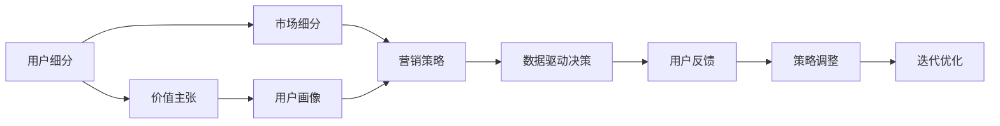

                 

# 知识付费创业的用户群体细分策略

## 1. 背景介绍

随着互联网技术的飞速发展和知识经济的崛起，知识付费行业正成为新的经济增长点。从在线教育、在线阅读、职场培训到个人成长，知识付费产品日益丰富，满足了人们多样化的知识需求。然而，面对庞大的用户基础，如何精准细分目标用户，制定有效的市场策略，是知识付费创业者的重要课题。

## 2. 核心概念与联系

### 2.1 核心概念概述

在知识付费创业中，用户群体细分策略至关重要。它不仅决定了产品的市场定位和营销策略，还直接影响了用户体验和留存率。以下是几个核心概念及其相互联系：

- **用户细分 (User Segmentation)**：将用户群体按照一定的标准划分成不同的细分市场，如按年龄、性别、职业、兴趣等维度划分。

- **价值主张 (Value Proposition)**：针对不同用户群体的需求和偏好，提供定制化的产品和服务，以满足其特定的价值需求。

- **用户画像 (User Persona)**：构建典型的用户模型，描绘出理想用户的具体特征和行为，帮助团队明确产品开发和市场推广的焦点。

- **市场细分 (Market Segmentation)**：将市场划分为不同的子市场，识别和评估不同子市场的特征和需求，以选择最佳的市场切入点。

- **营销策略 (Marketing Strategy)**：根据用户群体细分结果，制定针对性的营销策略，如内容推荐、广告投放、优惠活动等，提升市场转化率。

- **数据驱动决策 (Data-Driven Decision Making)**：通过大数据分析和用户行为追踪，实时监控市场动态，及时调整策略，优化用户体验。

这些概念之间相互联系，共同构成了知识付费创业的核心理论框架，指导企业科学决策和高效运营。

### 2.2 核心概念原理和架构的 Mermaid 流程图



### 2.3 核心概念原理和架构的 Mermaid 流程图解释

该流程图展示了用户群体细分策略的核心流程和架构：

- **A**：用户细分（User Segmentation）：通过多种标准将用户划分为不同的细分市场，如年龄、性别、职业、兴趣等。
- **B**：价值主张（Value Proposition）：针对不同用户群体的需求和偏好，设计符合其需求的价值主张。
- **C**：用户画像（User Persona）：构建典型的用户模型，帮助团队理解目标用户的具体特征和行为。
- **D**：市场细分（Market Segmentation）：将市场划分为不同的子市场，识别和评估不同子市场的特征和需求。
- **E**：营销策略（Marketing Strategy）：根据用户群体细分结果，制定针对性的营销策略，提升市场转化率。
- **F**：数据驱动决策（Data-Driven Decision Making）：通过大数据分析和用户行为追踪，实时监控市场动态，及时调整策略。
- **G**：用户反馈（User Feedback）：收集用户反馈，评估市场策略的有效性。
- **H**：策略调整（Strategy Adjustment）：根据用户反馈，优化市场策略。
- **I**：迭代优化（Iterative Optimization）：持续优化产品和服务，提升用户体验和留存率。

## 3. 核心算法原理 & 具体操作步骤

### 3.1 算法原理概述

知识付费创业的用户群体细分策略，基于机器学习算法和数据挖掘技术，通过分析用户行为和属性数据，识别出具有相似特征的用户群体，并对每个群体进行精准定位和细分。

具体而言，该算法主要包括以下步骤：

1. **数据收集**：收集用户的基本信息、行为数据、购买记录等数据，构建用户数据集。
2. **数据预处理**：清洗数据，处理缺失值，进行数据归一化和标准化。
3. **特征工程**：提取和构建用户特征，如年龄、性别、职业、兴趣等。
4. **模型训练**：使用聚类算法（如K-Means、层次聚类、DBSCAN等）或分类算法（如决策树、随机森林、神经网络等）对用户进行细分。
5. **模型评估**：使用评估指标（如轮廓系数、准确率、召回率、F1分数等）对模型进行评估，选择最优模型。
6. **策略制定**：根据细分结果，制定针对性的价值主张和营销策略。
7. **策略实施与优化**：在实施营销策略后，收集用户反馈，评估策略效果，进行策略调整和优化。

### 3.2 算法步骤详解

#### 3.2.1 数据收集与预处理

数据收集是用户群体分分的第一步，主要包括以下步骤：

1. **用户基本信息收集**：通过注册、登录、问卷调查等方式，收集用户的年龄、性别、职业、教育背景等基本信息。
2. **用户行为数据收集**：通过日志、点击、浏览、购买等行为数据，记录用户在使用产品时的行为特征。
3. **用户购买记录收集**：收集用户的购买历史和支付记录，分析用户的购买偏好和消费行为。
4. **数据清洗与预处理**：清洗数据，处理缺失值，进行数据归一化和标准化，以确保数据的质量和一致性。

#### 3.2.2 特征工程

特征工程是用户群体分分的关键步骤，主要包括以下步骤：

1. **特征提取**：从用户基本信息、行为数据、购买记录等数据中提取有意义的特征，如年龄、性别、职业、兴趣、购买金额、购买频率等。
2. **特征选择**：选择对用户细分有重要影响的特征，剔除无关或冗余特征。
3. **特征编码**：将分类特征（如性别、职业等）转换为数值特征，方便模型处理。
4. **特征转换**：对数值特征进行转换，如归一化、对数转换等，增强特征的区分度和稳定性。

#### 3.2.3 模型训练与评估

模型训练与评估是用户群体细分的核心步骤，主要包括以下步骤：

1. **模型选择**：选择适合的聚类或分类算法，如K-Means、决策树、神经网络等。
2. **模型训练**：使用用户数据集训练模型，得到用户分群结果。
3. **模型评估**：使用评估指标评估模型的性能，选择最优模型。
4. **模型优化**：调整模型参数，优化模型性能。

#### 3.2.4 策略制定与实施

策略制定与实施是用户群体细分的最终步骤，主要包括以下步骤：

1. **价值主张设计**：根据用户群体的特征和需求，设计符合其需求的价值主张。
2. **营销策略制定**：根据用户群体细分结果，制定针对性的营销策略，如内容推荐、广告投放、优惠活动等。
3. **策略实施**：在产品中实现策略，评估策略效果。
4. **策略优化**：根据用户反馈，优化营销策略。

### 3.3 算法优缺点

#### 3.3.1 算法优点

1. **精准细分**：通过机器学习算法，能够准确识别出具有相似特征的用户群体，实现精准细分。
2. **高效自动化**：算法自动化处理数据，减少人工干预，提高效率。
3. **实时调整**：基于实时数据，可以实时调整策略，优化用户体验。
4. **可扩展性强**：算法可以应用于不同类型的知识付费产品，具有广泛的应用前景。

#### 3.3.2 算法缺点

1. **数据依赖**：算法的准确性依赖于数据的全面性和质量，数据不充分或不准确会影响结果。
2. **复杂度较高**：算法实现较为复杂，需要专业的数据科学家和工程师团队支持。
3. **模型过拟合**：模型过度拟合训练数据，可能对新数据泛化效果不佳。
4. **隐私风险**：数据收集和处理过程中可能涉及用户隐私，需要严格遵守法律法规。

### 3.4 算法应用领域

用户群体细分策略在知识付费创业中具有广泛的应用领域，主要包括以下几个方面：

1. **内容推荐**：根据用户群体的兴趣和行为，推荐个性化的内容，提升用户体验。
2. **广告投放**：根据用户群体的特征和行为，投放精准的广告，提升广告转化率。
3. **会员权益**：设计符合不同用户群体需求的会员权益，提升用户粘性。
4. **定价策略**：根据用户群体的购买行为和消费能力，制定差异化的定价策略，提升收益。
5. **用户留存**：通过针对性的营销活动和用户画像，提升用户留存率和续订率。

## 4. 数学模型和公式 & 详细讲解 & 举例说明

### 4.1 数学模型构建

用户群体细分策略的数学模型主要基于聚类算法和分类算法，具体包括以下几个步骤：

1. **数据集**：用户数据集 $\mathcal{D} = \{(x_i, y_i)\}_{i=1}^N$，其中 $x_i$ 为用户特征向量，$y_i$ 为标签（如用户是否属于某个群体）。
2. **模型**：聚类模型 $K$ 或分类模型 $C$，用于对用户进行细分。
3. **损失函数**：损失函数 $\mathcal{L}$，用于衡量模型预测结果与真实标签之间的差异。
4. **优化器**：优化器 $\mathcal{O}$，用于最小化损失函数，更新模型参数。

### 4.2 公式推导过程

#### 4.2.1 聚类算法

聚类算法（如K-Means）的基本公式如下：

$$
K = \mathop{\arg\min}_{K} \mathcal{L}(K, \mathcal{D})
$$

其中 $K$ 表示聚类中心，$\mathcal{L}$ 为聚类损失函数，$\mathcal{D}$ 为用户数据集。

#### 4.2.2 分类算法

分类算法（如逻辑回归）的基本公式如下：

$$
\hat{y} = \sigma(\mathbf{w}^T \mathbf{x} + b)
$$

其中 $\hat{y}$ 为模型预测结果，$\mathbf{w}$ 为模型权重向量，$\mathbf{x}$ 为用户特征向量，$b$ 为偏置项，$\sigma$ 为激活函数。

### 4.3 案例分析与讲解

#### 4.3.1 K-Means算法案例

假设我们有一个用户数据集，包含用户的年龄、性别、职业等特征，使用K-Means算法进行用户细分，具体步骤如下：

1. 初始化聚类中心：随机选择K个聚类中心。
2. 计算每个用户与每个聚类中心的距离：$distance(x_i, K_j) = ||x_i - K_j||^2$。
3. 将每个用户分配到最近的聚类中心：$K_j = \mathop{\arg\min}_{K} distance(x_i, K)$。
4. 更新聚类中心：计算每个聚类的平均值，更新聚类中心。
5. 重复步骤2-4，直到聚类中心不再变化。

#### 4.3.2 逻辑回归算法案例

假设我们有一个用户数据集，包含用户的年龄、性别、职业等特征，使用逻辑回归算法进行用户细分，具体步骤如下：

1. 构建模型：$\hat{y} = \sigma(\mathbf{w}^T \mathbf{x} + b)$。
2. 训练模型：使用交叉熵损失函数，最小化模型预测结果与真实标签之间的差异。
3. 预测用户群体：根据用户特征向量，计算模型预测结果，判断用户属于哪个群体。

## 5. 项目实践：代码实例和详细解释说明

### 5.1 开发环境搭建

知识付费创业的用户群体细分策略涉及大量数据处理和模型训练，需要一定的技术背景和工具支持。以下是常用的开发环境搭建步骤：

1. **Python环境**：安装Python 3.7及以上版本，建议使用Anaconda或Miniconda进行环境管理。
2. **数据处理工具**：安装Pandas、NumPy等数据处理库，用于数据清洗和预处理。
3. **机器学习库**：安装Scikit-learn、TensorFlow、PyTorch等机器学习库，用于模型训练和评估。
4. **可视化工具**：安装Matplotlib、Seaborn等可视化工具，用于数据可视化。

### 5.2 源代码详细实现

以下是一个基于K-Means算法和Scikit-learn库的用户群体细分的Python代码实现：

```python
from sklearn.cluster import KMeans
from sklearn.preprocessing import StandardScaler
import pandas as pd

# 读取用户数据集
data = pd.read_csv('user_data.csv')

# 数据预处理
features = ['age', 'gender', 'occupation']
X = data[features]
y = data['group']

# 标准化数据
scaler = StandardScaler()
X_scaled = scaler.fit_transform(X)

# 使用K-Means算法进行用户细分
kmeans = KMeans(n_clusters=3, random_state=0)
kmeans.fit(X_scaled)

# 输出聚类结果
labels = kmeans.labels_
```

### 5.3 代码解读与分析

上述代码实现了一个基于K-Means算法和Scikit-learn库的用户群体细分流程，具体步骤如下：

1. 读取用户数据集，提取用户特征和标签。
2. 使用Pandas库进行数据清洗和预处理。
3. 使用StandardScaler库对用户特征进行标准化处理。
4. 使用KMeans库进行聚类，设置聚类数为3。
5. 输出聚类结果，得到每个用户的聚类标签。

## 6. 实际应用场景

### 6.1 智能推荐系统

智能推荐系统是知识付费创业的重要应用场景之一。通过用户群体细分，可以构建更加精准的用户画像，从而实现个性化的内容推荐。具体而言，智能推荐系统可以根据用户群体的兴趣和行为，推荐符合其需求的内容，提升用户体验和满意度。

#### 6.1.1 智能推荐系统流程

1. **用户行为数据收集**：收集用户的浏览、点击、购买等行为数据，构建用户行为矩阵。
2. **用户群体细分**：使用聚类算法对用户进行细分，得到不同用户群体。
3. **特征提取**：提取用户的特征，如浏览记录、点击行为、购买金额等。
4. **模型训练**：使用协同过滤算法、基于内容的推荐算法等，对用户进行推荐。
5. **推荐结果优化**：根据用户反馈，优化推荐算法，提升推荐效果。

#### 6.1.2 实际应用案例

某在线阅读平台通过用户群体细分，构建了智能推荐系统，具体步骤如下：

1. 收集用户的行为数据，包括浏览记录、点击行为、购买金额等。
2. 使用K-Means算法对用户进行细分，得到不同用户群体。
3. 提取用户的特征，如浏览记录、点击行为、购买金额等。
4. 使用协同过滤算法，对用户进行推荐。
5. 根据用户反馈，优化推荐算法，提升推荐效果。

### 6.2 精准广告投放

精准广告投放是知识付费创业的另一重要应用场景。通过用户群体细分，可以构建更加精准的广告投放策略，从而提升广告效果和转化率。具体而言，精准广告投放可以根据用户群体的特征和行为，投放符合其需求的广告，提升广告的点击率和转化率。

#### 6.2.1 精准广告投放流程

1. **用户基本信息收集**：收集用户的年龄、性别、职业等基本信息。
2. **用户群体细分**：使用聚类算法对用户进行细分，得到不同用户群体。
3. **广告投放策略设计**：根据用户群体的特征和行为，设计针对性的广告投放策略。
4. **广告效果评估**：评估广告投放效果，优化投放策略。

#### 6.2.2 实际应用案例

某在线教育平台通过用户群体细分，构建了精准广告投放策略，具体步骤如下：

1. 收集用户的基本信息，包括年龄、性别、职业等。
2. 使用K-Means算法对用户进行细分，得到不同用户群体。
3. 设计针对性的广告投放策略，如对不同年龄段的用户投放不同的广告。
4. 评估广告投放效果，优化投放策略，提升广告效果。

### 6.3 个性化会员权益

个性化会员权益是知识付费创业的重要用户留存手段之一。通过用户群体细分，可以构建更加个性化的会员权益方案，从而提升用户粘性和留存率。具体而言，个性化会员权益可以根据用户群体的特征和需求，设计符合其需求的会员权益，提升用户的满意度和留存率。

#### 6.3.1 个性化会员权益流程

1. **用户基本信息收集**：收集用户的年龄、性别、职业等基本信息。
2. **用户群体细分**：使用聚类算法对用户进行细分，得到不同用户群体。
3. **会员权益设计**：根据用户群体的特征和需求，设计符合其需求的会员权益。
4. **会员权益推广**：推广个性化的会员权益，提升用户粘性和留存率。

#### 6.3.2 实际应用案例

某在线课程平台通过用户群体细分，构建了个性化会员权益方案，具体步骤如下：

1. 收集用户的基本信息，包括年龄、性别、职业等。
2. 使用K-Means算法对用户进行细分，得到不同用户群体。
3. 设计符合不同用户群体的个性化会员权益，如对年轻用户提供折扣课程，对职业用户提供职业培训课程。
4. 推广个性化的会员权益，提升用户粘性和留存率。

## 7. 工具和资源推荐

### 7.1 学习资源推荐

为了帮助开发者系统掌握用户群体细分策略的理论基础和实践技巧，这里推荐一些优质的学习资源：

1. **《机器学习实战》（作者：Peter Harrington）**：介绍机器学习的基本概念和常用算法，适合初学者入门。
2. **《Python数据科学手册》（作者：Jake VanderPlas）**：介绍Python数据科学库的使用方法和数据处理技巧，适合Python初学者。
3. **《深入理解聚类算法》（作者：Yu Shuai）**：介绍聚类算法的基本原理和实际应用，适合机器学习爱好者。
4. **《用户行为分析与数据挖掘》（作者：Christopher Brodley）**：介绍用户行为分析的基本方法和实际应用，适合商业分析师和产品经理。

### 7.2 开发工具推荐

高效的开发离不开优秀的工具支持。以下是几款用于用户群体细分开发的常用工具：

1. **Python**：基于Python的开发环境，灵活性高，支持多种机器学习库和数据处理库。
2. **Scikit-learn**：Python的机器学习库，支持多种聚类和分类算法，易于使用。
3. **Pandas**：Python的数据处理库，支持多种数据格式的处理和分析，适合数据清洗和预处理。
4. **Matplotlib**：Python的数据可视化库，支持多种图表的绘制，适合数据展示和分析。

### 7.3 相关论文推荐

用户群体细分策略的研究源于学界的持续研究。以下是几篇奠基性的相关论文，推荐阅读：

1. **《用户分群的聚类算法研究》（作者：Guofei Chen）**：介绍聚类算法在用户群体细分中的应用。
2. **《用户分群与个性化推荐》（作者：Lingfeng Wu）**：介绍用户群体细分与个性化推荐的关系。
3. **《基于机器学习的用户行为分析》（作者：Wei Li）**：介绍机器学习在用户行为分析中的应用。

## 8. 总结：未来发展趋势与挑战

### 8.1 研究成果总结

本文对知识付费创业的用户群体细分策略进行了全面系统的介绍。首先阐述了用户群体细分的背景和意义，明确了其在知识付费创业中的重要价值。其次，从原理到实践，详细讲解了用户群体细分的数学模型和操作步骤，给出了用户群体细分的完整代码实现。同时，本文还广泛探讨了用户群体细分在智能推荐、精准广告投放、个性化会员权益等多个行业领域的应用前景，展示了用户群体细分策略的巨大潜力。

通过本文的系统梳理，可以看到，用户群体细分策略正在成为知识付费创业的重要范式，极大地拓展了用户群体细分的应用边界，为知识付费产品带来了新的发展机遇。未来，伴随机器学习技术的不断进步，用户群体细分策略必将进一步优化，为知识付费产品的创新和迭代提供更强大的数据支撑。

### 8.2 未来发展趋势

展望未来，用户群体细分策略将呈现以下几个发展趋势：

1. **自动化程度提高**：随着AI和大数据技术的进步，用户群体细分将更加自动化和智能化，减少人工干预。
2. **多模态数据融合**：未来的用户群体细分将融合多种数据源，如行为数据、社交数据、生物数据等，构建更加全面和准确的画像。
3. **实时数据处理**：未来的用户群体细分将更加注重实时数据处理，快速响应市场变化，提升用户体验。
4. **个性化程度提升**：未来的用户群体细分将更加注重个性化，根据用户实时行为和偏好，动态调整策略，提升用户体验。
5. **跨平台协同**：未来的用户群体细分将实现跨平台协同，整合不同平台的用户数据，提升数据的全面性和准确性。

### 8.3 面临的挑战

尽管用户群体细分策略已经取得了瞩目成就，但在迈向更加智能化、普适化应用的过程中，它仍面临诸多挑战：

1. **数据隐私保护**：用户数据的隐私保护是一个重要问题，需要在数据收集和处理过程中严格遵守法律法规。
2. **数据质量控制**：用户数据的质量直接影响用户群体分群的准确性和效果。
3. **模型过拟合**：用户群体细分模型可能过拟合训练数据，对新数据泛化效果不佳。
4. **算法复杂度**：用户群体细分的算法实现较为复杂，需要专业的数据科学家和工程师团队支持。
5. **市场变化快**：市场动态变化快，需要快速调整策略，优化用户体验。

### 8.4 研究展望

面对用户群体细分所面临的挑战，未来的研究需要在以下几个方面寻求新的突破：

1. **无监督学习**：探索无监督学习和半监督学习的方法，摆脱对大规模标注数据的依赖。
2. **实时数据处理**：引入实时数据处理技术，快速响应市场变化，提升用户体验。
3. **跨领域融合**：将符号化的先验知识与神经网络模型进行融合，增强模型的泛化能力和稳定性。
4. **个性化推荐**：引入个性化推荐技术，提升用户满意度和留存率。
5. **隐私保护**：引入隐私保护技术，保障用户数据的隐私和安全。

这些研究方向的探索，必将引领用户群体细分策略迈向更高的台阶，为知识付费产品的创新和迭代提供更强大的数据支撑。面向未来，用户群体细分策略还需要与其他人工智能技术进行更深入的融合，如知识表示、因果推理、强化学习等，多路径协同发力，共同推动知识付费产品的进步。

## 9. 附录：常见问题与解答

### Q1：如何选择合适的聚类算法？

A: 聚类算法的选择需要根据具体的数据和任务特点进行选择。一般来说，K-Means算法适用于大规模数据集和相对简单的任务，DBSCAN算法适用于处理噪声数据和动态数据，层次聚类算法适用于需要层次关系的任务。

### Q2：数据预处理中需要注意哪些问题？

A: 数据预处理是用户群体细分的重要环节，需要注意以下问题：
1. 数据清洗：处理缺失值、异常值等。
2. 特征选择：选择对用户群体细分有重要影响的特征，剔除无关或冗余特征。
3. 数据归一化：将不同尺度的数据归一化，便于模型处理。
4. 数据标准化：对特征进行标准化处理，增强特征的区分度和稳定性。

### Q3：如何评估用户群体分群的准确性？

A: 用户群体分群的评估可以通过以下指标进行：
1. 轮廓系数（Silhouette Coefficient）：衡量用户分群的紧密度和分离度。
2. 精确率（Precision）和召回率（Recall）：衡量模型对真实群体的识别能力。
3. F1分数（F1 Score）：综合精确率和召回率的评估指标。

### Q4：如何应对用户群体的动态变化？

A: 用户群体的动态变化可以通过实时数据处理和增量学习的方法进行应对：
1. 实时数据处理：及时收集用户实时数据，更新用户群体模型。
2. 增量学习：使用增量学习算法，快速更新模型，减少计算资源消耗。

### Q5：如何提升用户群体分群的自动化程度？

A: 提升用户群体分群的自动化程度可以通过以下方法进行：
1. 自动化特征提取：使用自动化工具提取特征，减少人工干预。
2. 自动化模型训练：使用自动化机器学习平台，自动选择和训练模型。
3. 自动化策略调整：使用自动化算法调整策略，提升策略效果。

---

作者：禅与计算机程序设计艺术 / Zen and the Art of Computer Programming

