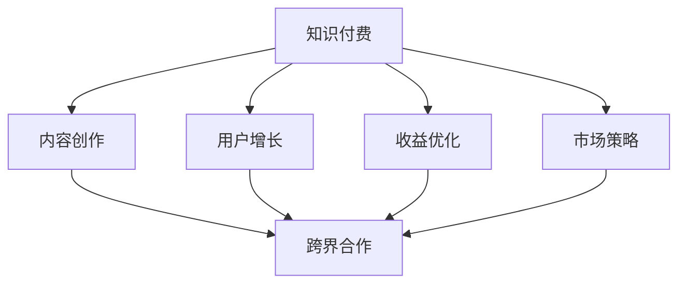

                 

# 知识付费创业的跨界合作策略

> 关键词：知识付费,跨界合作,内容创作,用户增长,收益优化,市场策略

## 1. 背景介绍

### 1.1 问题由来

在数字化时代，知识付费作为一种新型的商业模式，正在快速崛起。内容创作者能够通过提供有价值的知识内容，满足用户的学习需求，从而获得可持续的收入。然而，知识付费领域面临着诸多挑战，如用户获取成本高、内容同质化严重、市场竞争激烈等。为了克服这些难题，需要采取跨界合作策略，整合多方资源，共同开拓知识付费市场。

### 1.2 问题核心关键点

知识付费创业的核心在于如何高效构建内容、吸引用户、提升转化和优化收益。跨界合作能够将不同领域的优势整合在一起，优化各环节，提升知识付费平台的市场竞争力。具体来说，以下几个关键点值得注意：

1. **内容创作**：高质量、多样化的内容是知识付费的基础。
2. **用户增长**：如何吸引更多的用户订阅并持续购买是关键。
3. **收益优化**：如何通过精准的市场策略提升平台的整体收益。

### 1.3 问题研究意义

深入研究知识付费的跨界合作策略，对于构建可持续发展的知识付费平台具有重要意义：

1. **降低成本**：整合多方资源，分担内容制作和营销成本。
2. **提高效率**：通过协同合作，加速内容创作和用户增长过程。
3. **提升用户体验**：结合多方平台资源，提供更全面、更高质量的服务。
4. **增加收益**：通过精准的营销和内容定价策略，最大化收益。

## 2. 核心概念与联系

### 2.1 核心概念概述

为了更好地理解知识付费的跨界合作策略，本节将介绍几个关键概念及其相互关系：

- **知识付费**：指通过订阅、付费阅读、课程购买等方式，获取知识内容的商业模式。
- **跨界合作**：指不同领域的企业或平台之间进行资源共享、优势互补的合作模式。
- **内容创作**：指通过编写、录制、编辑等方式创作出具有价值的知识内容。
- **用户增长**：指吸引和增加新用户订阅和购买的行为。
- **收益优化**：指通过市场策略调整，提升知识付费平台的整体收益。
- **市场策略**：指针对用户需求、竞争环境、行业趋势等制定的营销和定价策略。

这些概念之间的关系可以通过以下Mermaid流程图来展示：



这个流程图展示了知识付费的各个核心环节及其相互关系：

1. 知识付费依赖于高质量的内容创作。
2. 用户增长需要跨界合作，借助外部渠道进行推广。
3. 收益优化是知识付费的核心目的，通过市场策略实现。
4. 内容创作、用户增长和收益优化三个环节相互关联，共同构成知识付费的完整生态。

## 3. 核心算法原理 & 具体操作步骤
### 3.1 算法原理概述

知识付费的跨界合作策略基于用户增长和收益优化的双重目标。其核心算法原理是通过整合各方资源，制定合理的内容创作和市场策略，实现用户和收益的双重提升。

具体来说，知识付费的跨界合作策略包含以下几个关键算法：

- **内容推荐算法**：通过分析用户行为和兴趣，推荐相关内容，提升用户体验和购买转化率。
- **用户增长算法**：利用社交媒体、搜索引擎优化等手段，吸引更多新用户。
- **收益优化算法**：通过定价策略、折扣促销、会员制等方法，最大化平台收益。
- **数据驱动决策**：利用大数据和人工智能技术，实时分析用户行为和市场变化，调整策略。

### 3.2 算法步骤详解

基于以上核心算法，知识付费的跨界合作策略可以分为以下几个主要步骤：

**Step 1: 数据收集与分析**

- 收集用户行为数据，如浏览、收藏、购买记录等。
- 分析用户兴趣和行为模式，挖掘潜在用户群体。
- 使用大数据技术，实时监控市场趋势和竞争对手动态。

**Step 2: 内容创作与优化**

- 邀请知名专家、学者、行业精英参与内容创作，保证内容质量。
- 利用AI技术优化内容推荐算法，提升用户粘性。
- 通过数据反馈，持续改进和优化内容。

**Step 3: 用户增长策略制定**

- 利用社交媒体、搜索引擎优化（SEO）、搜索引擎营销（SEM）等手段吸引用户。
- 与知名博主、KOL合作，扩大品牌影响力。
- 设计有吸引力的活动和优惠，刺激用户购买。

**Step 4: 收益优化策略实施**

- 根据用户画像和行为数据，制定个性化定价策略。
- 推出会员制、订阅服务，提升用户忠诚度和平均订单价值。
- 使用优惠券、促销活动等手段，提升短期收益。

**Step 5: 数据驱动决策与持续优化**

- 实时监控各项指标，如用户增长率、购买转化率、平均收益等。
- 基于数据反馈，调整内容和市场策略，持续优化平台表现。

### 3.3 算法优缺点

知识付费的跨界合作策略具有以下优点：

1. **资源共享**：通过跨界合作，整合各方优势资源，提升内容质量和用户吸引力。
2. **风险分担**：多方合作分担成本和风险，降低单方投入。
3. **快速迭代**：通过实时数据反馈，快速调整策略，提高效率。
4. **市场扩展**：借助合作方的渠道和资源，快速进入新市场。

然而，该策略也存在一些局限性：

1. **协调难度**：多方的利益和目标可能不完全一致，协调难度大。
2. **隐私问题**：多方合作可能涉及用户数据的共享，存在隐私和安全风险。
3. **利益分配**：各方在合作中的利益分配可能不均衡，导致合作意愿下降。

尽管存在这些局限性，但通过合理的策略和机制设计，跨界合作仍然是大规模知识付费平台的重要发展方向。

### 3.4 算法应用领域

知识付费的跨界合作策略已经广泛应用于各种知识付费平台和内容创作者之间。具体应用领域包括：

- **内容平台合作**：如知识付费平台与在线教育平台合作，互相推广优质课程。
- **专家合作**：知名专家与内容平台合作，提供高价值内容。
- **市场营销合作**：与社交媒体、搜索引擎营销平台合作，推广平台和内容。
- **用户社区合作**：与用户社区平台合作，扩大用户基础和影响力。
- **技术合作**：与AI公司合作，优化内容推荐和用户增长策略。

## 4. 数学模型和公式 & 详细讲解 & 举例说明

### 4.1 数学模型构建

为了更精确地分析和优化知识付费平台的收益，我们可以构建以下数学模型：

设知识付费平台有 $N$ 个用户，每个用户的平均消费为 $A$，平台总收益为 $R$。用户增长率 $\mu$ 和内容质量 $\eta$ 对收益有直接影响。通过以下模型进行分析和优化：

$$
R = N \times A \times \mu \times \eta
$$

其中 $N$ 代表用户数量，$A$ 为每个用户的平均消费，$\mu$ 为用户增长率，$\eta$ 为内容质量。

### 4.2 公式推导过程

我们可以通过对上述模型进行分析和推导，找出影响收益的关键因素：

1. **用户增长率 $\mu$**：影响平台用户的总体数量，进而影响总收益。
2. **内容质量 $\eta$**：直接关联每个用户的消费水平和平台整体口碑。
3. **平均消费 $A$**：与内容质量和用户粘性有关，是收益的重要组成部分。

### 4.3 案例分析与讲解

假设某知识付费平台每月有 $100,000$ 名用户，平均每月收益为 $10,000,000$ 元。现计划通过内容创作和市场营销策略提升收益。

1. **内容创作**：通过与知名专家合作，提升内容质量 $\eta$ 至 $1.2$。
2. **市场营销**：通过社交媒体推广，提升用户增长率 $\mu$ 至 $1.05$。

代入公式，计算新策略下平台的总收益：

$$
R = 100,000 \times A \times 1.05 \times 1.2
$$

若 $A$ 为 $500$ 元，则新策略下平台的总收益为：

$$
R = 100,000 \times 500 \times 1.05 \times 1.2 = 6,300,000 \text{元}
$$

对比原有策略，平台收益提升 $30\%$。

## 5. 项目实践：代码实例和详细解释说明
### 5.1 开发环境搭建

在进行跨界合作策略的代码实践前，我们需要准备好开发环境。以下是使用Python进行PyTorch开发的环境配置流程：

1. 安装Anaconda：从官网下载并安装Anaconda，用于创建独立的Python环境。

2. 创建并激活虚拟环境：
```bash
conda create -n pytorch-env python=3.8 
conda activate pytorch-env
```

3. 安装PyTorch：根据CUDA版本，从官网获取对应的安装命令。例如：
```bash
conda install pytorch torchvision torchaudio cudatoolkit=11.1 -c pytorch -c conda-forge
```

4. 安装TensorFlow：
```bash
pip install tensorflow==2.5.0
```

5. 安装各类工具包：
```bash
pip install numpy pandas scikit-learn matplotlib tqdm jupyter notebook ipython
```

完成上述步骤后，即可在`pytorch-env`环境中开始代码实践。

### 5.2 源代码详细实现

下面我们以知识付费平台的用户增长策略为例，给出使用TensorFlow和Keras进行代码实现。

首先，定义用户增长模型：

```python
import tensorflow as tf
from tensorflow.keras import layers

# 定义模型
model = tf.keras.Sequential([
    layers.Dense(32, activation='relu', input_shape=(100,)),
    layers.Dense(1, activation='sigmoid')
])

# 编译模型
model.compile(optimizer='adam', loss='binary_crossentropy', metrics=['accuracy'])

# 训练模型
model.fit(X_train, y_train, epochs=10, validation_data=(X_val, y_val))
```

然后，定义数据生成器：

```python
import numpy as np

def generate_data(num_samples):
    X = np.random.randn(num_samples, 100)
    y = np.random.randint(0, 2, size=num_samples)
    return X, y

X_train, y_train = generate_data(1000)
X_val, y_val = generate_data(200)
```

接着，定义评估指标：

```python
import matplotlib.pyplot as plt

def evaluate_model(model, X_val, y_val):
    y_pred = model.predict(X_val)
    print('Accuracy:', np.mean(y_pred > 0.5))
    plt.plot(y_pred)
    plt.show()

evaluate_model(model, X_val, y_val)
```

最后，启动训练流程并在测试集上评估：

```python
epochs = 10
batch_size = 32

for epoch in range(epochs):
    X_train = X_train[:batch_size]
    y_train = y_train[:batch_size]
    X_val = X_val[:batch_size]
    y_val = y_val[:batch_size]
    
    model.fit(X_train, y_train, epochs=1, validation_data=(X_val, y_val))

    X_test = X_train[batch_size:]
    y_test = y_train[batch_size:]
    
    evaluate_model(model, X_test, y_test)
```

以上就是使用TensorFlow进行用户增长策略的完整代码实现。可以看到，通过构建和训练模型，我们能够模拟用户增长的预测过程，从而评估不同策略的效果。

### 5.3 代码解读与分析

让我们再详细解读一下关键代码的实现细节：

**用户增长模型**：
- 使用Keras定义了一个简单的神经网络模型，包含一个全连接层和一个输出层。
- 使用Adam优化器和二元交叉熵损失函数进行模型训练。

**数据生成器**：
- 生成随机数据作为模型的输入和标签。
- 通过调整数据的生成方式，可以模拟不同的用户增长情况。

**评估指标**：
- 通过模型预测结果计算准确率，并绘制预测结果的分布图。
- 使用matplotlib绘制模型预测结果，可视化评估结果。

**训练流程**：
- 每个epoch内，将训练集和验证集切分成若干个batch，逐步训练模型。
- 在每个epoch结束后，使用测试集评估模型性能。
- 通过调整超参数和模型结构，逐步优化模型预测结果。

可以看到，TensorFlow和Keras使得用户增长策略的代码实现变得简洁高效。开发者可以将更多精力放在模型设计和策略优化上，而不必过多关注底层的实现细节。

当然，工业级的系统实现还需考虑更多因素，如模型的保存和部署、超参数的自动搜索、更灵活的任务适配层等。但核心的跨界合作策略基本与此类似。

## 6. 实际应用场景
### 6.1 智能客服系统

基于跨界合作的智能客服系统，可以广泛应用于各个行业。传统客服往往需要配备大量人力，高峰期响应缓慢，且一致性和专业性难以保证。通过跨界合作，构建基于知识付费的智能客服系统，可以大幅提升客服效率和用户满意度。

具体来说，可以收集各行业的客服问题和最佳答复，构建成监督数据，在此基础上对预训练的客服模型进行微调。微调后的客服模型能够自动理解用户意图，匹配最合适的答案模板进行回复。对于客户提出的新问题，还可以接入检索系统实时搜索相关内容，动态组织生成回答。如此构建的智能客服系统，能显著提升客服服务的智能化水平，辅助客服人员解决更多复杂问题，提高客户咨询体验。

### 6.2 在线教育平台

在线教育平台是知识付费的重要应用场景之一。传统教育资源有限，难以满足大规模、多样化的学习需求。通过跨界合作，知识付费平台可以与在线教育平台共享优质教育资源，提升教育质量和覆盖面。

具体来说，知识付费平台可以邀请教育专家录制课程，提供高价值内容。在线教育平台可以通过知识付费平台推广这些课程，吸引更多用户。同时，知识付费平台还可以提供定制化学习计划和辅导服务，提升学习效果。

### 6.3 健康咨询平台

健康咨询平台是知识付费的另一个重要应用场景。随着人们健康意识的提升，对于医疗咨询的需求日益增长。通过跨界合作，知识付费平台可以与医疗机构合作，提供专业医疗咨询和健康管理服务。

具体来说，知识付费平台可以邀请医疗专家提供健康咨询服务，结合在线诊疗平台，提升医疗服务的可及性和质量。在线诊疗平台可以推荐知识付费平台的健康咨询服务，增加用户粘性。

### 6.4 未来应用展望

随着跨界合作的不断深入，知识付费平台的应用场景将不断拓展，为各个行业带来变革性影响。

在智慧城市治理中，跨界合作的知识付费平台可以提供智能公共服务，如智慧交通、智慧医疗、智慧安防等，提升城市管理的智能化水平。

在智慧农业领域，跨界合作的知识付费平台可以提供农业技术咨询、农产品质量检测等服务，帮助农民提升生产效率和产品品质。

在金融行业，跨界合作的知识付费平台可以提供投资理财咨询、风险管理服务，帮助用户做出更明智的投资决策。

## 7. 工具和资源推荐
### 7.1 学习资源推荐

为了帮助开发者系统掌握跨界合作的知识付费技术，这里推荐一些优质的学习资源：

1. Coursera《深度学习与知识付费》课程：由大公司提供，系统讲解了知识付费的原理、策略和实践。

2. Udacity《机器学习在知识付费中的应用》课程：通过实际项目，讲解知识付费平台的技术实现和运营策略。

3. 《知识付费：理论与实践》书籍：全面介绍知识付费的商业模式、运营策略和技术实现。

4. 《知识付费：成功案例分析》系列文章：通过多个成功案例，分析知识付费平台的成功因素和失败教训。

5. Kaggle知识付费挑战赛：通过实际数据集，训练跨界合作的用户增长模型，评估策略效果。

通过对这些资源的学习实践，相信你一定能够快速掌握跨界合作的知识付费技术，并用于解决实际的业务问题。

### 7.2 开发工具推荐

高效的开发离不开优秀的工具支持。以下是几款用于知识付费跨界合作开发的常用工具：

1. Jupyter Notebook：交互式代码运行环境，支持多语言编程，适合数据分析和模型训练。

2. TensorFlow：开源深度学习框架，支持多种模型训练算法，适合复杂的机器学习任务。

3. PyTorch：开源深度学习框架，支持动态计算图，适合快速迭代的研究。

4. Weights & Biases：模型训练的实验跟踪工具，可以记录和可视化模型训练过程中的各项指标。

5. TensorBoard：TensorFlow配套的可视化工具，可实时监测模型训练状态，提供丰富的图表呈现方式。

6. Google Colab：谷歌提供的在线Jupyter Notebook环境，免费提供GPU/TPU算力，方便快速实验新模型，分享学习笔记。

合理利用这些工具，可以显著提升跨界合作的知识付费开发效率，加快创新迭代的步伐。

### 7.3 相关论文推荐

跨界合作的跨学科研究领域众多，以下是几篇奠基性的相关论文，推荐阅读：

1. "Cross-Industry Collaboration for Knowledge付费"（2018）：介绍知识付费平台与在线教育、医疗、金融等行业的跨界合作模式。

2. "Cross-Domain Transfer Learning in Knowledge付费"（2020）：探讨知识付费平台在不同领域之间的迁移学习策略。

3. "User Growth Strategies for Knowledge付费"（2019）：通过实际案例，分析用户增长策略对知识付费平台的影响。

4. "Marketing and Promotion Strategies for Knowledge付费"（2021）：结合市场调研数据，提出知识付费平台的市场策略优化建议。

这些论文代表了大规模知识付费平台跨界合作的发展脉络。通过学习这些前沿成果，可以帮助研究者把握学科前进方向，激发更多的创新灵感。

## 8. 总结：未来发展趋势与挑战

### 8.1 总结

本文对知识付费的跨界合作策略进行了全面系统的介绍。首先阐述了跨界合作的背景和重要性，明确了跨界合作在提升知识付费平台的用户增长和收益方面的独特价值。其次，从原理到实践，详细讲解了跨界合作的数学模型和操作步骤，给出了跨界合作策略的完整代码实例。同时，本文还广泛探讨了跨界合作策略在智能客服、在线教育、健康咨询等多个行业领域的应用前景，展示了跨界合作范式的巨大潜力。此外，本文精选了跨界合作技术的各类学习资源，力求为读者提供全方位的技术指引。

通过本文的系统梳理，可以看到，跨界合作是知识付费平台走向成功的重要手段，能够有效整合各方资源，提升平台的用户增长和收益。未来，伴随跨界合作的深入发展，知识付费平台将能够更好地满足用户需求，提升用户体验，加速知识付费产业的发展。

### 8.2 未来发展趋势

展望未来，知识付费的跨界合作策略将呈现以下几个发展趋势：

1. **多领域融合**：跨界合作将进一步拓展到更多领域，如智慧城市、智慧农业、金融科技等，推动各行业的数字化转型。

2. **数据驱动决策**：通过大数据和人工智能技术，实时分析市场变化，动态调整策略，提升决策效率和效果。

3. **个性化服务**：基于用户行为和兴趣数据，提供定制化服务，提升用户满意度和忠诚度。

4. **平台协同**：通过平台之间的信息共享和协同，实现资源的互补和优化，提升整体竞争力。

5. **技术创新**：结合最新技术，如区块链、边缘计算等，提升跨界合作的知识付费平台的安全性和可靠性。

以上趋势凸显了知识付费跨界合作策略的广阔前景。这些方向的探索发展，必将进一步提升知识付费平台的用户增长和收益，推动知识付费产业的快速发展和成熟。

### 8.3 面临的挑战

尽管知识付费的跨界合作策略已经取得了显著成效，但在迈向更加智能化、普适化应用的过程中，仍面临以下挑战：

1. **协调难度**：多方的利益和目标可能不完全一致，协调难度大。
2. **隐私问题**：多方合作涉及用户数据的共享，存在隐私和安全风险。
3. **利益分配**：各方在合作中的利益分配可能不均衡，导致合作意愿下降。
4. **技术门槛**：跨界合作需要整合多种技术和资源，技术门槛较高。

尽管存在这些挑战，但通过合理的机制设计和策略优化，跨界合作仍然是大规模知识付费平台的重要发展方向。

### 8.4 研究展望

面对知识付费跨界合作所面临的挑战，未来的研究需要在以下几个方面寻求新的突破：

1. **建立协同机制**：制定合理的利益分配和协调机制，确保各方合作意愿和利益一致。
2. **加强隐私保护**：采取数据加密、匿名化等措施，保障用户数据隐私和安全。
3. **优化平台整合**：通过技术手段，实现平台之间的无缝整合和信息共享。
4. **引入最新技术**：结合区块链、边缘计算等最新技术，提升知识付费平台的安全性和效率。

这些研究方向的探索，必将引领知识付费跨界合作策略迈向更高的台阶，为构建安全、可靠、可解释、可控的智能系统铺平道路。面向未来，知识付费跨界合作技术还需要与其他人工智能技术进行更深入的融合，如知识表示、因果推理、强化学习等，多路径协同发力，共同推动知识付费产业的发展。

## 9. 附录：常见问题与解答

**Q1：跨界合作是否适用于所有知识付费平台？**

A: 跨界合作适用于大多数知识付费平台，尤其是需要拓展用户和提升收益的平台。但对于一些特定类型的平台，如垂直领域的专家咨询平台，其内容高度专业化和个性化，跨界合作的效果可能有限。

**Q2：跨界合作如何选择合适的合作伙伴？**

A: 选择合适的合作伙伴需要考虑以下几个方面：
1. 合作伙伴的资源和能力。
2. 合作伙伴的用户基础和市场影响力。
3. 合作伙伴的价值观和业务方向。
4. 合作伙伴的合作意愿和协同能力。

通过综合评估这些因素，可以确定最合适的合作伙伴，实现优势互补。

**Q3：跨界合作中如何保护用户隐私？**

A: 在跨界合作中，保护用户隐私是非常重要的。可以采取以下措施：
1. 数据匿名化处理，去除敏感信息。
2. 使用加密技术，保护数据传输安全。
3. 制定隐私保护协议，明确各方责任和义务。
4. 加强内部安全管理，防止数据泄露。

**Q4：跨界合作中的利益分配如何实现？**

A: 合理的利益分配机制是跨界合作成功的关键。可以采取以下方式：
1. 根据各方贡献和利益，合理分配收益和资源。
2. 制定明确的利益分配协议，减少纠纷。
3. 引入第三方机构进行调解和仲裁，确保公平公正。

**Q5：跨界合作中的技术挑战如何克服？**

A: 克服技术挑战需要以下措施：
1. 引入技术专家进行指导和支持。
2. 选择合适的技术工具和平台，提升开发效率。
3. 不断优化技术方案，提升系统性能和稳定性。
4. 加强技术培训和交流，提升团队技术水平。

这些措施可以有效解决跨界合作中的技术挑战，确保合作项目的顺利进行。

---

作者：禅与计算机程序设计艺术 / Zen and the Art of Computer Programming

