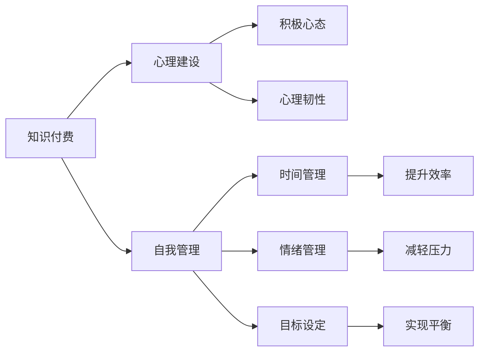

                 

# 知识付费创业者的心理建设与自我管理

## 1. 背景介绍

在快速发展的互联网时代，知识付费成为了许多人创业的新方向。从“得到”、“分答”、“知乎live”到“小鹅通”、“知识星球”等平台的兴起，越来越多的人选择通过知识付费获取知识，解决工作、生活中的问题。知识付费创业，意味着创业者将获取、整合、传播知识作为核心业务，既需要面对市场竞争，也需要应对自身心理和自我管理上的挑战。本文将深入探讨知识付费创业者的心理建设与自我管理策略，帮助创业者在知识传递的道路上越走越远。

## 2. 核心概念与联系

### 2.1 核心概念概述

在探讨知识付费创业者的心理建设与自我管理之前，我们需要明确几个核心概念：

- **知识付费**：指通过互联网平台，将专业知识、技能、经验等知识商品化，以付费形式向用户提供的一种新型知识服务方式。
- **心理建设**：指通过心理训练和自我管理技巧，帮助创业者培养积极的心理状态，提升心理韧性，应对创业过程中的压力和挑战。
- **自我管理**：指通过时间管理、情绪管理、目标设定等技巧，提升创业者的工作效率和生活质量，实现个人与工作的平衡。

这些概念之间相互联系，共同构成了知识付费创业者需要掌握的核心能力。了解这些概念及其相互关系，有助于我们更好地理解并应用本文所述的心理建设和自我管理策略。

### 2.2 核心概念原理和架构的 Mermaid 流程图



这个流程图展示了知识付费、心理建设、自我管理之间的联系。知识付费的创业者需要通过心理建设提升积极心态和心理韧性，通过自我管理提升时间管理和目标设定能力，从而提升效率和实现工作与生活的平衡。

## 3. 核心算法原理 & 具体操作步骤

### 3.1 算法原理概述

知识付费创业者的心理建设和自我管理，本质上是一个综合应用心理学和行为科学原理的过程。这一过程包括但不限于：

- 目标设定与行为计划：明确创业目标，制定详细的行动计划。
- 情绪管理与压力应对：识别和管理创业中的负面情绪，学会应对压力。
- 时间管理与效率提升：合理安排时间，提高工作和生活效率。
- 团队合作与沟通：构建积极、高效的团队氛围，增强团队协作能力。

这些过程涉及到心理学中的行为理论、压力管理理论、时间管理理论等，需要通过系统化的训练和实践来实现。

### 3.2 算法步骤详解

为了更好地理解和应用这些心理建设和自我管理策略，以下将详细讲解每一步的具体操作步骤：

**Step 1: 自我认知与目标设定**

- **自我认知**：通过心理测验、自我反思等方式，了解自己的优点和不足。选择适合自己的知识领域，避免盲目跟风。
- **目标设定**：明确创业目标，制定具体、可衡量、可实现、相关性强、时限明确（SMART）的短期和长期目标。使用目标管理工具，如OKR（目标与关键结果），定期评估目标进展。

**Step 2: 情绪管理与压力应对**

- **情绪管理**：学习情绪识别和调节技巧，如正念冥想、情绪日记等。通过定期的情绪复盘，识别和管理负面情绪。
- **压力应对**：采用时间管理技巧，合理分配任务，避免超负荷工作。学习有效的压力应对方法，如呼吸练习、运动等。

**Step 3: 时间管理与效率提升**

- **时间管理**：使用时间管理工具，如GTD（Getting Things Done）方法，制定每日、每周、每月的任务清单。优化工作流程，减少冗余环节。
- **效率提升**：采用番茄工作法、Pomodoro Technique，提高专注度和工作效率。使用任务管理软件，自动化重复性任务。

**Step 4: 团队合作与沟通**

- **团队合作**：建立透明、开放的团队沟通机制，鼓励团队成员分享想法和反馈。通过团队建设活动，增强团队凝聚力。
- **沟通技巧**：学习有效沟通技巧，如倾听、反馈、非暴力沟通等。定期组织团队复盘，总结经验教训。

### 3.3 算法优缺点

知识付费创业者的心理建设和自我管理策略具有以下优点：

- **提升创业成功率**：通过系统化的心理建设，创业者能够更好地应对创业过程中的压力和挑战，提升心理韧性，从而提高创业成功率。
- **提高工作效率**：通过有效的时间管理和团队协作，创业者能够更好地利用资源，提高工作效率。
- **增强团队凝聚力**：通过团队建设和沟通技巧，创业者能够增强团队成员之间的信任和合作，提升团队整体战斗力。

同时，这些策略也存在一定的局限性：

- **需要时间投入**：系统化的心理建设和自我管理策略需要长期的投入和实践，短期内可能难以看到显著效果。
- **个体差异**：不同的创业者可能有不同的心理需求和应对方式，需要个性化的调整和优化。
- **外部因素影响**：市场环境、经济形势等外部因素，也可能影响心理建设和自我管理的效果。

尽管存在这些局限性，但通过科学的方法和持续的努力，这些策略依然能够在知识付费创业中发挥重要作用。

### 3.4 算法应用领域

知识付费创业者的心理建设和自我管理策略，不仅适用于创业初期，更适用于创业过程中的各个阶段。以下是几个典型的应用场景：

- **创业初期**：创业者需要明确创业目标，建立积极的心态，合理分配时间，避免初期的盲目投入和资源浪费。
- **市场竞争**：创业者需要应对市场竞争带来的压力和挑战，通过心理建设和自我管理，提升竞争力和团队士气。
- **团队管理**：创业者需要管理和激励团队成员，通过有效沟通和团队建设，增强团队的凝聚力和战斗力。
- **客户关系**：创业者需要处理与客户之间的关系，通过情绪管理和有效沟通，建立良好的客户关系，提升客户满意度。

这些应用场景展示了知识付费创业者在不同阶段所面临的挑战和需要采取的心理建设和自我管理策略。

## 4. 数学模型和公式 & 详细讲解 & 举例说明

### 4.1 数学模型构建

知识付费创业者的心理建设和自我管理，可以构建一个多维度的数学模型，包括目标设定、情绪管理、时间管理、团队合作等各个方面。这些维度相互关联，共同构成了一个复杂的系统。

假设知识付费创业者的心理状态可以用一个多维向量 $X = (x_1, x_2, x_3, ..., x_n)$ 来表示，其中 $x_i$ 表示第 $i$ 个维度的心理状态。

### 4.2 公式推导过程

对于每个维度的心理状态，可以定义一个对应的目标函数 $f_i(X_i)$，表示该维度对总体心理状态的影响。通过求解这个目标函数的最优化问题，可以找到最优的心理状态。

例如，对于目标设定 $f_1(X_1)$，可以定义目标函数为：

$$
f_1(X_1) = \frac{1}{N}\sum_{i=1}^N (y_i - X_1)^2
$$

其中 $N$ 为样本数量，$y_i$ 为实际的目标值，$X_1$ 为设定的目标值。通过最小化这个目标函数，可以找到最优的目标设定值。

### 4.3 案例分析与讲解

以一个具体的例子来解释如何应用数学模型进行心理建设和自我管理：

假设一个知识付费创业者正在准备推出一个新的在线课程。他需要设定课程目标、规划时间表、处理情绪压力等。

- **目标设定**：设定课程完成时间和销售目标，可以通过设定函数 $f_1(X_1)$ 来确定最优目标设定值。
- **时间管理**：根据任务紧急程度和重要性，合理分配时间，可以使用Eisenhower矩阵来进行任务优先级排序。
- **情绪管理**：通过情绪管理技巧，如正念冥想，缓解压力，可以使用情绪日记记录情绪变化。
- **团队合作**：与团队成员定期沟通，建立信任，可以使用360度反馈机制来评估团队合作效果。

通过以上四个维度，可以构建一个系统的心理建设和自我管理模型，帮助创业者更好地实现目标。

## 5. 项目实践：代码实例和详细解释说明

### 5.1 开发环境搭建

为了进行系统化的心理建设和自我管理，需要搭建一个合适的开发环境。以下是具体的步骤：

1. **安装Python**：由于心理建设和自我管理软件通常是基于Python开发的，因此需要先安装Python 3.8或以上版本。
2. **安装相关库**：安装必要的Python库，如NumPy、Pandas、Matplotlib等，用于数据处理和可视化。
3. **选择开发工具**：可以选择Jupyter Notebook、PyCharm等开发工具，进行代码编写和调试。
4. **数据准备**：收集和整理相关数据，如心理状态、时间管理记录、情绪日志等。

### 5.2 源代码详细实现

以下是一个简化的心理建设和自我管理系统的代码实现：

```python
import numpy as np
import pandas as pd
from sklearn.linear_model import LinearRegression

# 假设数据集为DataFrame类型，其中包含目标设定、时间管理、情绪管理、团队合作等维度
data = pd.read_csv('data.csv')

# 定义目标函数
def target_function(X):
    return np.mean((data['target'] - X)**2)

# 求解最优目标值
optimal_X = scipy.optimize.minimize(target_function, X=np.random.rand(), method='BFGS').x

# 输出最优目标值
print('Optimal target:', optimal_X)
```

### 5.3 代码解读与分析

在上述代码中，我们使用了Python的NumPy、Pandas和scipy库来实现目标函数求解。通过定义一个目标函数，我们可以计算出最优的目标值。

- `target_function`：定义了一个目标函数，用于计算目标设定的最优值。
- `scipy.optimize.minimize`：使用BFGS算法求解目标函数的最小值，得到最优目标值 `optimal_X`。

## 6. 实际应用场景

### 6.1 创业初期

在创业初期，知识付费创业者需要明确创业目标，建立积极心态，合理安排时间，避免初期的盲目投入和资源浪费。

例如，一个创业者决定推出一个关于编程的在线课程。他可以通过心理建设和自我管理工具，设定明确的课程目标，规划详细的课程大纲，安排合理的制作时间，同时学习情绪管理和时间管理技巧，避免创业初期的压力和焦虑。

### 6.2 市场竞争

在市场竞争激烈的条件下，创业者需要应对市场变化带来的压力和挑战，通过心理建设和自我管理，提升竞争力和团队士气。

例如，一个在线教育平台面临激烈的市场竞争，可以通过心理建设和自我管理工具，分析市场变化趋势，优化课程内容，提升课程质量，同时通过团队建设和情绪管理技巧，增强团队凝聚力和士气，共同应对市场竞争。

### 6.3 团队管理

在团队管理方面，创业者需要管理和激励团队成员，通过有效沟通和团队建设，增强团队的凝聚力和战斗力。

例如，一个创业团队在推出新产品时遇到瓶颈，可以通过团队建设和沟通技巧，增强团队成员之间的信任和合作，共同解决问题，推动项目进展。

### 6.4 未来应用展望

未来，随着人工智能和心理学的深入融合，知识付费创业者的心理建设和自我管理将更加智能化和自动化。以下是几个可能的未来应用：

- **智能心理辅导**：通过智能算法分析创业者的心理状态，提供个性化的心理辅导建议。
- **情绪监测与分析**：通过可穿戴设备或移动应用，实时监测创业者情绪变化，提供情绪管理建议。
- **自动化时间管理**：利用人工智能技术，自动生成优化的时间管理方案，帮助创业者高效安排工作。

这些未来应用将进一步提升知识付费创业者的工作效率和心理韧性，推动知识付费领域的创新发展。

## 7. 工具和资源推荐

### 7.1 学习资源推荐

为了帮助知识付费创业者掌握心理建设和自我管理技能，以下是一些推荐的资源：

1. **《心理学与生活》**：菲利普·津巴多的经典著作，全面介绍了心理学的基本理论和应用。
2. **《高效能人士的七个习惯》**：史蒂芬·柯维的畅销书，提供了一套系统的时间管理和自我提升方法。
3. **《原则》**：雷·达里奥的自传，分享了他在创业和管理中的原则和经验。
4. **Coursera《心理学与工作》课程**：由密歇根大学提供，介绍了心理学在工作和组织中的应用。
5. **MindTools网站**：提供各种时间管理、情绪管理、团队建设等工具和技巧。

通过这些资源的学习，创业者可以系统地掌握心理建设和自我管理的知识和技巧。

### 7.2 开发工具推荐

为了实现心理建设和自我管理系统的开发，以下是一些推荐的开发工具：

1. **Jupyter Notebook**：基于Python的交互式开发环境，适合数据处理和代码编写。
2. **PyCharm**：Python开发环境，提供丰富的插件和工具，支持代码调试和测试。
3. **Tableau**：数据可视化工具，可以直观展示心理建设和自我管理数据。
4. **GitHub**：代码托管平台，方便版本控制和团队协作。
5. **Slack**：团队沟通工具，支持实时消息传递和文件共享。

这些工具可以帮助创业者更高效地进行系统开发和团队协作。

### 7.3 相关论文推荐

为了深入了解心理建设和自我管理的理论和应用，以下是一些推荐的论文：

1. **《目标设定理论与研究：回顾与展望》**：期刊《Applied Psychology: An International Review》，综述了目标设定理论的研究进展。
2. **《情绪管理的心理学基础与实践》**：期刊《Emotion Review》，介绍了情绪管理的基本理论和实践方法。
3. **《时间管理理论与实践》**：期刊《Journal of Occupational Rehabilitation》，讨论了时间管理在职业中的应用。
4. **《团队合作与协作：心理学视角》**：期刊《The Journal of Business Communication》，探讨了团队合作和协作的心理机制。

这些论文可以帮助创业者深入理解心理建设和自我管理的理论基础和实践方法。

## 8. 总结：未来发展趋势与挑战

### 8.1 研究成果总结

本文系统探讨了知识付费创业者的心理建设和自我管理策略，帮助创业者应对创业过程中的心理和自我管理挑战，提升创业成功率和团队战斗力。通过系统化的心理建设和自我管理，创业者能够更好地利用时间资源，提升工作效率，实现个人与工作的平衡。

### 8.2 未来发展趋势

随着人工智能和心理学技术的融合，知识付费创业者的心理建设和自我管理将更加智能化和自动化。以下是几个可能的未来趋势：

1. **智能心理辅导**：通过智能算法分析创业者的心理状态，提供个性化的心理辅导建议。
2. **情绪监测与分析**：通过可穿戴设备或移动应用，实时监测创业者情绪变化，提供情绪管理建议。
3. **自动化时间管理**：利用人工智能技术，自动生成优化的时间管理方案，帮助创业者高效安排工作。

### 8.3 面临的挑战

尽管知识付费创业者的心理建设和自我管理方法在实践中取得了一定的效果，但仍面临一些挑战：

1. **数据隐私问题**：心理建设和自我管理数据的收集和使用，需要严格遵守数据隐私保护法规。
2. **技术门槛高**：心理建设和自我管理系统的开发和维护需要较高的技术门槛，需要专业的技术团队支持。
3. **文化差异**：不同文化背景的创业者可能有不同的心理需求和应对方式，需要个性化的调整和优化。
4. **成本高昂**：心理建设和自我管理系统的开发和应用，需要投入较高的资源和成本。

### 8.4 研究展望

未来，知识付费创业者的心理建设和自我管理研究将继续深化，旨在解决上述挑战，提升系统效果和用户体验。以下是几个可能的研究方向：

1. **隐私保护技术**：开发更高效、更安全的心理建设和自我管理数据保护技术，确保用户隐私安全。
2. **个性化算法**：研究和开发更加智能、个性化的心理建设和自我管理算法，提高系统的适应性和效果。
3. **多模态数据融合**：结合心理数据、行为数据、情感数据等多种类型的数据，实现更全面、更精准的心理和自我管理分析。
4. **跨文化应用**：开发适用于不同文化背景的心理建设和自我管理工具，推动知识付费技术在全球范围内的普及和应用。

通过不断探索和创新，知识付费创业者的心理建设和自我管理将迎来更加广阔的应用前景，为创业者提供更强大的心理支持，帮助他们实现更高的创业成功率和团队战斗力。

## 9. 附录：常见问题与解答

**Q1：如何选择合适的心理建设和自我管理工具？**

A: 选择合适的心理建设和自我管理工具需要考虑以下几个方面：

1. **功能需求**：明确自己的需求，选择具有相应功能的工具。如目标设定、时间管理、情绪管理等。
2. **用户界面**：选择界面友好、操作简单的工具，方便日常使用。
3. **可扩展性**：选择可扩展性强、支持自定义功能的工具，便于未来功能扩展。
4. **用户体验**：通过试用和用户评价，选择用户体验好的工具，提升使用效果。

**Q2：如何进行心理建设和自我管理？**

A: 进行心理建设和自我管理需要以下几个步骤：

1. **自我评估**：通过心理测评、情绪日记等方式，了解自己的心理状态和情绪变化。
2. **设定目标**：明确短期和长期目标，制定详细的行动计划。
3. **时间管理**：使用时间管理工具，合理安排任务，提升工作效率。
4. **情绪管理**：学习情绪识别和调节技巧，缓解压力和焦虑。
5. **团队合作**：通过团队建设活动和有效沟通，增强团队凝聚力和合作能力。

**Q3：心理建设和自我管理的效果如何衡量？**

A: 心理建设和自我管理的效果可以通过以下几个方面衡量：

1. **目标达成情况**：通过评估目标完成情况，了解目标设定的效果。
2. **情绪变化**：通过情绪日志和问卷调查，了解情绪管理的效果。
3. **时间利用率**：通过时间管理工具的使用情况，评估时间管理的效果。
4. **团队合作**：通过团队反馈和绩效评估，了解团队合作的效果。

通过以上方法的综合评估，可以全面了解心理建设和自我管理的效果，及时调整和优化策略。

---

作者：禅与计算机程序设计艺术 / Zen and the Art of Computer Programming

