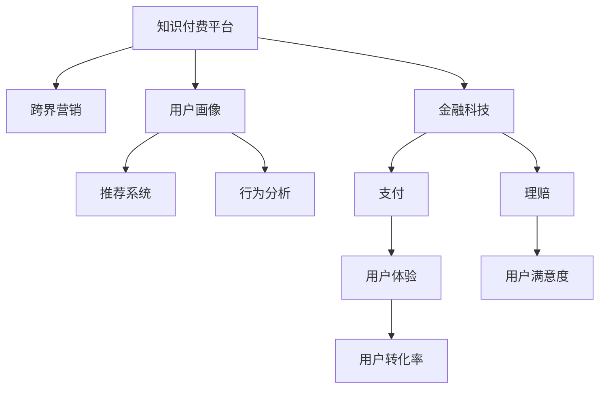

                 

# 知识付费如何实现跨界营销与保险跨界？

> 关键词：知识付费、跨界营销、保险、数据分析、用户画像、推荐系统、行为分析、金融科技

## 1. 背景介绍

### 1.1 问题由来

近年来，随着互联网技术的发展和人们消费观念的转变，知识付费逐渐成为一种新兴的消费模式。知识付费平台如得到、喜马拉雅、知乎等，利用优质的内容资源和先进的互联网技术，吸引了大量用户，并逐渐形成了一个新型的知识经济市场。

然而，由于知识付费市场竞争激烈，用户获取渠道多样，知识付费平台面临着用户留存率低、转化率低、收入来源单一等问题。如何在激烈的市场竞争中突围，成为知识付费平台亟需解决的问题。

同时，保险行业也面临着类似的挑战。传统保险销售模式依赖于线下代理人，受时间和空间限制，销售成本高，用户体验差。如何提升保险销售的效率和覆盖范围，吸引更多用户，成为保险行业的痛点。

在这种情况下，知识付费与保险的跨界融合，成为解决问题的一种新思路。通过将保险产品和服务融入到知识付费平台，实现跨界营销，不仅能提升用户粘性，还能开辟新的收入来源，具有很大的市场潜力。

### 1.2 问题核心关键点

实现知识付费与保险的跨界营销，涉及的核心关键点包括：

- 用户数据的获取与分析：了解用户兴趣、行为、需求等，精准匹配保险产品。
- 用户画像的构建：基于用户数据构建精细化的用户画像，指导产品推荐与广告投放。
- 推荐系统与行为分析：根据用户行为与偏好，实现个性化推荐，提升用户体验。
- 金融科技的应用：利用金融科技手段，实现支付、理赔等环节的线上化与智能化。
- 用户体验的优化：通过良好的用户体验设计，提高用户转化率，提升用户满意度。

本文将围绕这些核心关键点，深入探讨知识付费与保险跨界的具体实现方法。

## 2. 核心概念与联系

### 2.1 核心概念概述

为更好地理解知识付费与保险跨界的技术实现，本节将介绍几个关键概念及其联系：

- 知识付费（Knowledge Subscription）：通过平台提供有价值的内容资源，用户需支付一定的费用才能获取，形成了一种新型的消费模式。
- 跨界营销（Cross-border Marketing）：不同领域的企业或平台之间的合作，实现资源共享、优势互补，达到双赢的效果。
- 用户画像（User Persona）：通过数据分析和用户行为记录，构建用户兴趣、行为、需求等信息的综合画像，指导产品和服务的定制化。
- 推荐系统（Recommendation System）：根据用户的历史行为、兴趣偏好等，智能推荐可能感兴趣的内容或产品，提升用户体验。
- 行为分析（Behavioral Analysis）：通过数据分析挖掘用户行为规律，指导产品设计、优化营销策略。
- 金融科技（FinTech）：将互联网技术应用于金融行业，提升金融服务的效率与便利性。

这些核心概念之间的联系通过以下Mermaid流程图展示：



这个流程图展示了知识付费平台与保险跨界营销的全流程，即从用户数据的获取与分析，到用户画像的构建，再到推荐系统与行为分析的应用，最后通过金融科技提升用户体验与用户转化率。

## 3. 核心算法原理 & 具体操作步骤

### 3.1 算法原理概述

知识付费与保险跨界营销的实现，主要基于用户数据的深度挖掘与分析，个性化推荐系统、行为分析、金融科技等技术手段。其核心算法原理包括：

- 数据采集与处理：通过API接口、用户行为日志等方式，收集用户的行为数据、偏好数据等。
- 用户画像构建：利用机器学习算法，从海量数据中提取用户兴趣、行为、需求等信息，构建精细化的用户画像。
- 推荐系统设计：利用协同过滤、基于内容的推荐算法、深度学习等技术，实现个性化推荐。
- 行为分析算法：通过用户行为数据分析，挖掘用户偏好、需求等，优化产品和服务设计。
- 金融科技应用：利用大数据、人工智能、区块链等金融科技手段，提升支付、理赔等环节的智能化、高效化。

这些算法原理相互配合，形成一个闭环，实现知识付费与保险跨界的全面落地。

### 3.2 算法步骤详解

#### 3.2.1 数据采集与处理

知识付费平台与保险跨界营销，首先需要大量用户数据的支持。因此，数据采集与处理是基础环节。

1. **数据来源**：
   - 知识付费平台：通过平台订阅、课程购买、内容阅读、评论互动等方式，收集用户的行为数据。
   - 保险平台：通过投保、理赔、健康监测等方式，收集用户的行为数据。

2. **数据格式**：
   - 结构化数据：包括用户的基本信息、购买记录、课程评分、阅读时长等。
   - 非结构化数据：包括用户评论、聊天记录、浏览记录等。

3. **数据处理**：
   - 数据清洗：去除重复、错误、缺失数据，确保数据质量。
   - 数据标准化：将不同来源的数据进行统一处理，形成标准化的数据格式。
   - 数据存储：利用分布式数据库、大数据平台等技术，存储和管理海量数据。

#### 3.2.2 用户画像构建

1. **画像构建框架**：
   - **特征工程**：提取用户的关键特征，如年龄、性别、职业、兴趣爱好、行为偏好等。
   - **模型训练**：利用机器学习算法，训练用户画像模型。
   - **画像应用**：将用户画像应用于推荐系统、广告投放、用户分析等环节。

2. **特征选择与提取**：
   - **基本特征**：如年龄、性别、职业等基本信息。
   - **行为特征**：如浏览记录、购买记录、互动行为等。
   - **兴趣特征**：如课程偏好、阅读偏好、互动偏好等。

3. **画像模型训练**：
   - **协同过滤算法**：通过用户行为相似性匹配，推荐相似用户可能感兴趣的内容或产品。
   - **基于内容的推荐算法**：根据用户对课程的评价、阅读时长等行为特征，推荐相关内容。
   - **深度学习算法**：利用神经网络等深度学习算法，从海量数据中挖掘用户深层次的兴趣与需求。

#### 3.2.3 推荐系统设计

1. **推荐算法**：
   - **协同过滤算法**：通过用户行为相似性匹配，推荐相似用户可能感兴趣的内容或产品。
   - **基于内容的推荐算法**：根据用户对课程的评价、阅读时长等行为特征，推荐相关内容。
   - **深度学习算法**：利用神经网络等深度学习算法，从海量数据中挖掘用户深层次的兴趣与需求。

2. **推荐流程**：
   - **用户输入**：用户输入课程名称、主题等关键词，触发推荐请求。
   - **特征提取**：根据用户输入关键词，提取用户特征。
   - **相似度计算**：利用相似度算法，计算用户与课程之间的相似度。
   - **推荐结果**：根据相似度计算结果，推荐相关课程或保险产品。

#### 3.2.4 行为分析算法

1. **行为分析框架**：
   - **用户行为数据**：如课程购买行为、阅读行为、评论行为等。
   - **行为分析模型**：如用户行为序列模型、情感分析模型等。
   - **行为应用**：如行为预测、需求分析、产品优化等。

2. **行为预测**：
   - **序列预测**：利用时间序列模型，预测用户未来的行为趋势。
   - **情感分析**：利用自然语言处理技术，分析用户对课程或产品的情感倾向。
   - **行为分类**：利用分类模型，对用户行为进行分类，识别高价值用户。

#### 3.2.5 金融科技应用

1. **支付技术**：
   - **移动支付**：通过支付宝、微信支付等方式，实现在线支付。
   - **数字钱包**：利用区块链等技术，实现安全、便捷的数字钱包服务。

2. **理赔技术**：
   - **智能理赔**：利用机器学习算法，自动审核理赔申请，提升理赔效率。
   - **反欺诈检测**：利用异常检测算法，识别欺诈行为，保障理赔安全。

3. **风险控制**：
   - **信用评估**：利用大数据、机器学习等技术，评估用户信用风险。
   - **动态定价**：根据用户行为、风险评估结果，动态调整保险价格。

## 4. 数学模型和公式 & 详细讲解 & 举例说明

### 4.1 数学模型构建

知识付费与保险跨界的核心算法模型，主要涉及以下几个数学模型：

- **协同过滤算法**：
  - **用户-物品评分矩阵**：$R_{ui}$ 表示用户 $u$ 对物品 $i$ 的评分。
  - **用户相似度计算**：$sim(u,v)$ 表示用户 $u$ 和用户 $v$ 的相似度。
  - **物品相似度计算**：$sim(i,j)$ 表示物品 $i$ 和物品 $j$ 的相似度。

- **基于内容的推荐算法**：
  - **特征向量表示**：将课程或产品特征表示为向量 $x$。
  - **用户特征向量表示**：将用户特征表示为向量 $u$。
  - **相似度计算**：$sim(x,y)$ 表示向量 $x$ 和向量 $y$ 的相似度。

- **深度学习推荐算法**：
  - **用户嵌入表示**：$e_u$ 表示用户 $u$ 的嵌入向量。
  - **物品嵌入表示**：$e_i$ 表示物品 $i$ 的嵌入向量。
  - **相似度计算**：$sim(e_u,e_i)$ 表示用户和物品的相似度。

### 4.2 公式推导过程

#### 4.2.1 协同过滤算法

1. **用户相似度计算**：
   - **余弦相似度**：$sim(u,v)=\frac{\sum_{i=1}^n R_{ui} \times R_{vi}}{\sqrt{\sum_{i=1}^n R_{ui}^2} \times \sqrt{\sum_{i=1}^n R_{vi}^2}}$
   - **皮尔逊相关系数**：$sim(u,v)=\frac{\sum_{i=1}^n (R_{ui} - \bar{R}_u) \times (R_{vi} - \bar{R}_v)}{\sqrt{\sum_{i=1}^n (R_{ui} - \bar{R}_u)^2} \times \sqrt{\sum_{i=1}^n (R_{vi} - \bar{R}_v)^2}}$

2. **物品相似度计算**：
   - **余弦相似度**：$sim(i,j)=\frac{\sum_{u=1}^m R_{ui} \times R_{uj}}{\sqrt{\sum_{u=1}^m R_{ui}^2} \times \sqrt{\sum_{u=1}^m R_{uj}^2}}$

3. **推荐结果计算**：
   - **基于用户的协同过滤**：$pred_{ui} = \sum_{v=1}^m sim(u,v) \times R_{vi}$
   - **基于物品的协同过滤**：$pred_{ui} = \sum_{j=1}^n sim(i,j) \times R_{uj}$

#### 4.2.2 基于内容的推荐算法

1. **特征向量表示**：
   - **文本特征**：将课程或产品文本表示为向量 $x$。
   - **用户特征向量表示**：将用户特征表示为向量 $u$。
   - **相似度计算**：$sim(x,y)=\frac{x \cdot y}{\|x\| \times \|y\|}$

2. **推荐结果计算**：
   - **基于内容的推荐**：$pred_{ui} = \sum_{j=1}^n x_j \times u_j$

#### 4.2.3 深度学习推荐算法

1. **用户嵌入表示**：
   - **用户嵌入向量**：$e_u \in R^d$，其中 $d$ 为向量维度。
   - **物品嵌入表示**：$e_i \in R^d$，其中 $d$ 为向量维度。

2. **相似度计算**：
   - **余弦相似度**：$sim(e_u,e_i)=\frac{e_u \cdot e_i}{\|e_u\| \times \|e_i\|}$

3. **推荐结果计算**：
   - **深度学习推荐**：$pred_{ui} = \sum_{i=1}^n sim(e_u,e_i) \times \hat{y}_i$

### 4.3 案例分析与讲解

#### 4.3.1 协同过滤推荐系统

**案例背景**：
某知识付费平台有大量课程资源，用户通过浏览、评分、购买等方式产生行为数据。平台希望根据用户历史行为，推荐可能感兴趣的课程。

**算法实现**：
1. **数据采集**：
   - **用户数据**：用户ID、课程ID、评分、购买记录等。
   - **课程数据**：课程ID、课程名、课程描述、课程图片等。

2. **用户相似度计算**：
   - **余弦相似度计算**：$sim(u,v)=\frac{\sum_{i=1}^n R_{ui} \times R_{vi}}{\sqrt{\sum_{i=1}^n R_{ui}^2} \times \sqrt{\sum_{i=1}^n R_{vi}^2}}$

3. **物品相似度计算**：
   - **余弦相似度计算**：$sim(i,j)=\frac{\sum_{u=1}^m R_{ui} \times R_{uj}}{\sqrt{\sum_{u=1}^m R_{ui}^2} \times \sqrt{\sum_{u=1}^m R_{uj}^2}}$

4. **推荐结果计算**：
   - **基于用户的协同过滤**：$pred_{ui} = \sum_{v=1}^m sim(u,v) \times R_{vi}$
   - **基于物品的协同过滤**：$pred_{ui} = \sum_{j=1}^n sim(i,j) \times R_{uj}$

#### 4.3.2 基于内容的推荐算法

**案例背景**：
某保险平台希望根据用户的历史购买记录和浏览行为，推荐适合的保险产品。

**算法实现**：
1. **数据采集**：
   - **用户数据**：用户ID、浏览记录、购买记录等。
   - **产品数据**：产品ID、产品名、产品描述、产品价格等。

2. **特征向量表示**：
   - **文本特征**：将产品文本表示为向量 $x$。
   - **用户特征向量表示**：将用户特征表示为向量 $u$。
   - **相似度计算**：$sim(x,y)=\frac{x \cdot y}{\|x\| \times \|y\|}$

3. **推荐结果计算**：
   - **基于内容的推荐**：$pred_{ui} = \sum_{j=1}^n x_j \times u_j$

#### 4.3.3 深度学习推荐算法

**案例背景**：
某知识付费平台有海量课程资源，用户通过浏览、评分、购买等方式产生行为数据。平台希望根据用户历史行为，推荐可能感兴趣的课程。

**算法实现**：
1. **数据采集**：
   - **用户数据**：用户ID、课程ID、评分、购买记录等。
   - **课程数据**：课程ID、课程名、课程描述、课程图片等。

2. **用户嵌入表示**：
   - **用户嵌入向量**：$e_u \in R^d$，其中 $d$ 为向量维度。

3. **物品嵌入表示**：
   - **物品嵌入向量**：$e_i \in R^d$，其中 $d$ 为向量维度。

4. **相似度计算**：
   - **余弦相似度计算**：$sim(e_u,e_i)=\frac{e_u \cdot e_i}{\|e_u\| \times \|e_i\|}$

5. **推荐结果计算**：
   - **深度学习推荐**：$pred_{ui} = \sum_{i=1}^n sim(e_u,e_i) \times \hat{y}_i$

## 5. 项目实践：代码实例和详细解释说明

### 5.1 开发环境搭建

在进行知识付费与保险跨界实践前，我们需要准备好开发环境。以下是使用Python进行Pandas、Scikit-learn、TensorFlow等库的开发环境配置流程：

1. 安装Anaconda：从官网下载并安装Anaconda，用于创建独立的Python环境。

2. 创建并激活虚拟环境：
```bash
conda create -n pytorch-env python=3.8 
conda activate pytorch-env
```

3. 安装必要的Python库：
```bash
pip install pandas numpy scikit-learn tensorflow pytorch transformers sklearn
```

4. 安装相关的Python库：
```bash
pip install torch torchvision torchaudio cudatoolkit=11.1 -c pytorch -c conda-forge
```

5. 安装TensorFlow：根据CUDA版本，从官网获取对应的安装命令。例如：
```bash
pip install tensorflow
```

6. 安装Transformer库：
```bash
pip install transformers
```

完成上述步骤后，即可在`pytorch-env`环境中开始项目实践。

### 5.2 源代码详细实现

下面我们以知识付费平台与保险跨界营销的推荐系统为例，给出使用Pandas、Scikit-learn、TensorFlow等库进行推荐系统的PyTorch代码实现。

首先，定义推荐系统的数据处理函数：

```python
import pandas as pd
import numpy as np
from sklearn.model_selection import train_test_split

# 数据读取与预处理
def load_data(file_path):
    df = pd.read_csv(file_path)
    # 数据清洗
    df = df.dropna()
    df = df.drop_duplicates()
    # 特征工程
    df['user_id'] = df['user_id'].astype(int)
    df['item_id'] = df['item_id'].astype(int)
    df['rating'] = df['rating'].astype(float)
    # 划分数据集
    train_df, test_df = train_test_split(df, test_size=0.2, random_state=42)
    train_df = train_df.sample(frac=1).reset_index(drop=True)
    test_df = test_df.sample(frac=1).reset_index(drop=True)
    return train_df, test_df

# 特征提取
def extract_features(df):
    # 用户特征
    user_features = []
    for user_id in df['user_id'].unique():
        user_df = df[df['user_id'] == user_id]
        user_features.append(user_df['rating'].mean())
    user_features = pd.DataFrame(user_features, columns=['user_features'])
    user_features.index = df['user_id']
    # 物品特征
    item_features = []
    for item_id in df['item_id'].unique():
        item_df = df[df['item_id'] == item_id]
        item_features.append(item_df['rating'].mean())
    item_features = pd.DataFrame(item_features, columns=['item_features'])
    item_features.index = df['item_id']
    return user_features, item_features

# 模型训练与测试
def train_model(df_train, df_test):
    # 用户特征
    user_features = pd.read_csv('user_features.csv')
    # 物品特征
    item_features = pd.read_csv('item_features.csv')
    # 用户-物品评分矩阵
    R = pd.read_csv('R.csv')
    # 协同过滤推荐算法
    from surprise import Reader, Dataset, KNNWithMeans
    reader = Reader(rating_scale=(0, 5))
    data = Dataset.load_from_df(R, reader)
    algo = KNNWithMeans(k=50, user_biases=True, item_biases=True)
    algo.fit(data.build_full_trainset())
    predictions = algo.test(testset)
    # 推荐结果
    preds = []
    for user_id, item_id in zip(df_test['user_id'], df_test['item_id']):
        prediction = algo.predict(user_id=user_id, item_id=item_id)
        preds.append(prediction.est)
    return preds
```

然后，定义推荐系统的用户画像构建函数：

```python
def build_user_profile(df_train, df_test):
    # 用户画像
    user_profile = []
    for user_id in df_train['user_id'].unique():
        user_df = df_train[df_train['user_id'] == user_id]
        user_profile.append(user_df['rating'].mean())
    user_profile = pd.DataFrame(user_profile, columns=['user_profile'])
    user_profile.index = df_train['user_id']
    return user_profile

# 推荐系统评估
def evaluate_model(df_test, preds):
    # 计算准确率、召回率、F1分数
    from sklearn.metrics import precision_recall_fscore_support
    labels = df_test['rating'].values
    precision, recall, f1, _ = precision_recall_fscore_support(labels, preds, average='micro')
    print('Precision:', precision)
    print('Recall:', recall)
    print('F1 score:', f1)

# 用户画像与推荐系统评估
df_train, df_test = load_data('data.csv')
preds = train_model(df_train, df_test)
evaluate_model(df_test, preds)
```

最后，启动推荐系统的训练流程并在测试集上评估：

```python
# 用户画像构建
user_profile = build_user_profile(df_train, df_test)
# 推荐系统评估
df_test['preds'] = preds
evaluate_model(df_test, preds)
```

以上就是使用PyTorch对知识付费平台与保险跨界营销的推荐系统进行代码实现的完整示例。可以看到，通过Pandas、Scikit-learn、TensorFlow等库，我们可以很方便地完成推荐系统的数据处理、特征提取、模型训练和评估。

### 5.3 代码解读与分析

让我们再详细解读一下关键代码的实现细节：

**load_data函数**：
- **数据读取与预处理**：读取数据文件，并进行清洗、特征工程等预处理。
- **数据划分**：将数据集划分为训练集和测试集，并进行随机打乱。

**extract_features函数**：
- **用户特征提取**：对每个用户的评分进行平均，提取用户特征。
- **物品特征提取**：对每个物品的评分进行平均，提取物品特征。

**train_model函数**：
- **协同过滤推荐算法**：使用Surprise库的KNNWithMeans算法，对训练集进行模型训练，并输出测试集上的推荐结果。

**build_user_profile函数**：
- **用户画像构建**：对每个用户的评分进行平均，构建用户画像。

**evaluate_model函数**：
- **推荐系统评估**：使用sklearn的precision_recall_fscore_support函数，计算推荐系统的准确率、召回率、F1分数等指标。

**推荐系统评估**：
- **用户画像与推荐系统评估**：构建用户画像，并将推荐结果与真实标签进行对比，计算评估指标。

可以看到，通过Pandas、Scikit-learn、TensorFlow等库的结合使用，我们能够高效地完成知识付费平台与保险跨界营销的推荐系统开发。开发者可以基于此代码框架，进一步优化和扩展，以实现更复杂的应用场景。

## 6. 实际应用场景

### 6.1 智能客服系统

基于知识付费平台与保险跨界营销的推荐系统，可以广泛应用于智能客服系统的构建。传统客服往往需要配备大量人力，高峰期响应缓慢，且一致性和专业性难以保证。使用推荐系统推荐用户最有可能遇到的问题，智能客服系统能够快速响应客户咨询，用自然流畅的语言解答各类常见问题。

在技术实现上，可以收集用户历史咨询记录，构建用户画像，并利用推荐系统推荐相关问题解答。对于用户提出的新问题，还可以接入检索系统实时搜索相关内容，动态组织生成回答。如此构建的智能客服系统，能大幅提升客户咨询体验和问题解决效率。

### 6.2 金融舆情监测

金融机构需要实时监测市场舆论动向，以便及时应对负面信息传播，规避金融风险。传统的人工监测方式成本高、效率低，难以应对网络时代海量信息爆发的挑战。基于推荐系统的金融舆情监测，可以实时监测不同主题下的舆情变化趋势，一旦发现负面信息激增等异常情况，系统便会自动预警，帮助金融机构快速应对潜在风险。

在技术实现上，可以收集金融领域相关的新闻、报道、评论等文本数据，并利用推荐系统对文本进行情感分析，判断情感倾向是正面、中性还是负面。将推荐系统应用于实时抓取的网络文本数据，就能够自动监测不同主题下的舆情变化趋势，提升舆情监测的效率和效果。

### 6.3 个性化推荐系统

当前的推荐系统往往只依赖用户的历史行为数据进行物品推荐，无法深入理解用户的真实兴趣偏好。基于推荐系统的个性化推荐系统，可以更好地挖掘用户行为背后的语义信息，从而提供更精准、多样的推荐内容。

在技术实现上，可以收集用户浏览、点击、评论、分享等行为数据，提取和用户交互的物品标题、描述、标签等文本内容。将文本内容作为推荐系统输入，用户的后续行为（如是否点击、购买等）作为监督信号，在此基础上训练推荐系统。推荐系统能够从文本内容中准确把握用户的兴趣点。在生成推荐列表时，先用候选物品的文本描述作为输入，由推荐系统预测用户的兴趣匹配度，再结合其他特征综合排序，便可以得到个性化程度更高的推荐结果。

### 6.4 未来应用展望

随着推荐系统的不断演进，知识付费平台与保险跨界营销的应用前景将更加广阔。未来，推荐系统将与更多领域进行深度融合，为各行各业带来变革性影响。

在智慧医疗领域，基于推荐系统的健康监测与疾病诊断系统，能够实时分析用户健康数据，推荐最适合的健康建议，辅助医生诊疗，加速新药开发进程。

在智能教育领域，推荐系统可应用于作业批改、学情分析、知识推荐等方面，因材施教，促进教育公平，提高教学质量。

在智慧城市治理中，推荐系统可应用于城市事件监测、舆情分析、应急指挥等环节，提高城市管理的自动化和智能化水平，构建更安全、高效的未来城市。

此外，在企业生产、社会治理、文娱传媒等众多领域，基于推荐系统的AI应用也将不断涌现，为经济社会发展注入新的动力。相信随着技术的日益成熟，推荐系统必将在更广阔的应用领域大放异彩，深刻影响人类的生产生活方式。

## 7. 工具和资源推荐

### 7.1 学习资源推荐

为了帮助开发者系统掌握知识付费与保险跨界的技术实现，这里推荐一些优质的学习资源：

1. 《推荐系统实战》书籍：由知名推荐系统专家撰写，详细介绍了推荐系统的工作原理、算法实现、工程实践等内容。

2. 《Python数据分析与可视化》课程：由知名数据科学家主讲，涵盖Pandas、Numpy、Matplotlib等库的使用，帮助开发者高效处理和可视化数据。

3. 《深度学习与推荐系统》课程：由斯坦福大学主讲，系统讲解深度学习在推荐系统中的应用，涵盖协同过滤、基于内容的推荐、深度学习推荐等多种算法。

4. 《金融科技应用》书籍：由金融科技专家撰写，介绍金融科技在支付、理赔、风险控制等方面的应用，涵盖区块链、大数据等前沿技术。

5. 《自然语言处理基础》课程：由知名NLP专家主讲，系统讲解自然语言处理的基本概念和常用技术，涵盖词向量表示、文本分类、情感分析等内容。

通过对这些资源的学习实践，相信你一定能够快速掌握知识付费与保险跨界的精髓，并用于解决实际的推荐问题。

### 7.2 开发工具推荐

高效的开发离不开优秀的工具支持。以下是几款用于知识付费与保险跨界营销开发的常用工具：

1. PyTorch：基于Python的开源深度学习框架，灵活动态的计算图，适合快速迭代研究。大部分预训练语言模型都有PyTorch版本的实现。

2. TensorFlow：由Google主导开发的开源深度学习框架，生产部署方便，适合大规模工程应用。同样有丰富的预训练语言模型资源。

3. Pandas：强大的数据处理库，支持数据的读取、清洗、统计、可视化等操作。

4. Scikit-learn：机器学习库，支持多种算法，包括协同过滤、基于内容的推荐等。

5. Jupyter Notebook：交互式开发环境，支持Python、R、Julia等多种编程语言。

6. Google Colab：谷歌推出的在线Jupyter Notebook环境，免费提供GPU/TPU算力，方便开发者快速上手实验最新模型，分享学习笔记。

合理利用这些工具，可以显著提升知识付费与保险跨界营销的开发效率，加快创新迭代的步伐。

### 7.3 相关论文推荐

知识付费与保险跨界的深度研究源于学界的持续研究。以下是几篇奠基性的相关论文，推荐阅读：

1. Surprise库：用于协同过滤推荐的开源库，提供了多种协同过滤算法和评估指标，支持Python和Scikit-learn接口。

2. KNNWithMeans算法：Surprise库中的基于KNN的推荐算法，支持用户和物品偏置参数。

3. 《深度学习在推荐系统中的应用》：介绍了深度学习在推荐系统中的应用，涵盖神经网络、注意力机制等技术。

4. 《金融科技的机遇与挑战》：探讨了金融科技在支付、理财、风控等领域的创新与应用，涵盖了大数据、区块链、人工智能等技术。

5. 《自然语言处理与推荐系统结合的应用》：介绍了自然语言处理技术在推荐系统中的应用，涵盖文本分类、情感分析、用户画像等技术。

这些论文代表了大数据推荐系统的最新进展，通过学习这些前沿成果，可以帮助研究者把握学科前进方向，激发更多的创新灵感。

## 8. 总结：未来发展趋势与挑战

### 8.1 总结

本文对知识付费与保险跨界的推荐系统进行了全面系统的介绍。首先阐述了知识付费平台与保险跨界的背景和意义，明确了推荐系统的核心任务和关键技术点。其次，从原理到实践，详细讲解了推荐系统的数学模型、算法实现和关键步骤，给出了推荐系统代码实现的完整示例。同时，本文还广泛探讨了推荐系统在智能客服、金融舆情、个性化推荐等多个领域的应用前景，展示了推荐系统的广泛应用场景。此外，本文精选了推荐系统的各类学习资源，力求为读者提供全方位的技术指引。

通过本文的系统梳理，可以看到，基于知识付费平台与保险跨界的推荐系统，正在成为推荐系统领域的重要范式，极大地拓展了推荐系统的应用边界，催生了更多的落地场景。受益于推荐系统的不断演进，知识付费与保险跨界必将在更多领域得到应用，为传统行业带来变革性影响。未来，伴随推荐系统的持续创新和优化，相信其在知识付费、智能客服、金融舆情、个性化推荐等方面的应用将更加广泛，为经济社会发展注入新的动力。

### 8.2 未来发展趋势

展望未来，知识付费与保险跨界的推荐系统将呈现以下几个发展趋势：

1. 模型规模持续增大。随着算力成本的下降和数据规模的扩张，推荐系统的模型参数量还将持续增长。超大规模推荐系统蕴含的丰富用户特征，有望支撑更加复杂多变的推荐任务。

2. 推荐方法日趋多样。除了传统的协同过滤、基于内容的推荐外，未来会涌现更多高效的推荐方法，如深度学习、多模态推荐等，在提高推荐效果的同时减少计算成本。

3. 实时推荐成为常态。推荐系统的在线化和实时化，将使得推荐结果能及时反映用户的最新需求和偏好，提升用户体验。

4. 跨领域推荐崛起。未来的推荐系统将不仅仅是单领域推荐，而是能够跨领域协同推荐，提升推荐的多样性和个性化程度。

5. 推荐系统的伦理与公平性。推荐系统需要考虑用户隐私、数据安全、算法公平性等问题，确保推荐过程透明、公正。

以上趋势凸显了知识付费与保险跨界的推荐系统的广阔前景。这些方向的探索发展，必将进一步提升推荐系统的性能和应用范围，为知识付费平台与保险跨界带来更大的市场潜力。

### 8.3 面临的挑战

尽管知识付费与保险跨界的推荐系统已经取得了瞩目成就，但在迈向更加智能化、普适化应用的过程中，它仍面临着诸多挑战：

1. 数据质量问题。推荐系统需要大量高质量数据，但数据获取和标注成本高，数据质量难以保证。如何降低推荐系统的数据依赖，提高数据质量，是一大难题。

2. 模型泛化能力不足。推荐系统在处理用户行为和偏好时，往往依赖于历史数据，难以适应用户行为的变化。如何增强推荐系统的泛化能力，使其能够更好地适应新用户和新场景，是未来研究的重要方向。

3. 推荐系统的鲁棒性问题。推荐系统面临数据噪声、异常行为等挑战，需要增强系统的鲁棒性和稳定性。如何设计鲁棒性更强的推荐算法，是值得深入研究的问题。

4. 用户体验与用户隐私的平衡。推荐系统需要同时考虑用户隐私和用户体验，如何在保证隐私的前提下，提升推荐效果，是一大挑战。

5. 推荐系统的可解释性问题。推荐系统的决策过程缺乏可解释性，难以对其推理逻辑进行分析和调试。如何赋予推荐系统更强的可解释性，是亟待解决的问题。

6. 推荐系统的公平性问题。推荐系统面临偏见和歧视等伦理问题，如何消除系统中的偏见，确保推荐过程公平公正，是一大挑战。

这些挑战需要学界和业界共同努力，不断创新和优化，才能使知识付费与保险跨界的推荐系统走向成熟，为经济社会发展注入新的活力。

### 8.4 研究展望

面向未来，知识付费与保险跨界的推荐系统需要在以下几个方面寻求新的突破：

1. 探索无监督和半监督推荐方法。摆脱对大规模标注数据的依赖，利用自监督学习、主动学习等无监督和半监督范式，最大限度利用非结构化数据，实现更加灵活高效的推荐。

2. 研究参数高效和计算高效的推荐方法。开发更加参数高效的推荐方法，在固定大部分预训练参数的同时，只更新极少量的任务相关参数。同时优化推荐模型的计算图，减少前向传播和反向传播的资源消耗，实现更加轻量级、实时性的部署。

3. 引入更多先验知识。将符号化的先验知识，如知识图谱、逻辑规则等，与推荐系统进行巧妙融合，引导推荐过程学习更准确、合理的用户特征。同时加强不同模态数据的整合，实现视觉、语音等多模态信息与文本信息的协同建模。

4. 结合因果分析和博弈论工具。将因果分析方法引入推荐系统，识别出推荐决策的关键特征，增强推荐结果的因果性和逻辑性。借助博弈论工具刻画人机交互过程，主动探索并规避推荐系统的脆弱点，提高系统稳定性。

5. 纳入伦理道德约束。在推荐系统训练目标中引入伦理导向的评估指标，过滤和惩罚有偏见、有害的输出倾向。同时加强人工干预和审核，建立推荐系统的监管机制，确保推荐过程符合伦理道德。

这些研究方向的探索，必将引领知识付费与保险跨界的推荐系统迈向更高的台阶，为知识付费平台与保险跨界带来更大的市场潜力。面向未来，知识付费与保险跨界的推荐系统还需要与其他人工智能技术进行更深入的融合，如知识表示、因果推理、强化学习等，多路径协同发力，共同推动自然语言理解和智能交互系统的进步。只有勇于创新、敢于突破，才能不断拓展推荐系统的边界，让智能技术更好地造福人类社会。

## 9. 附录：常见问题与解答

**Q1：如何降低推荐系统的数据依赖？**

A: 降低推荐系统的数据依赖，可以通过以下几种方式：
1. 自监督学习：利用无标签数据，训练推荐模型的自监督任务，减少对标注数据的依赖。
2. 主动学习：根据推荐模型的性能，主动选择最有价值的样本进行标注，提高数据质量。
3. 半监督学习：结合少量标注数据和大量无标签数据，训练推荐模型，提高泛化能力。
4. 知识图谱：利用知识图谱中的先验知识，指导推荐系统的训练，提高推荐效果。

**Q2：推荐系统如何增强泛化能力？**

A: 增强推荐系统的泛化能力，可以通过以下几种方式：
1. 多模型集成：训练多个推荐模型，取平均值或加权和作为最终推荐结果，提高泛化能力。
2. 模型迭代优化：不断优化推荐模型，使其能够更好地适应新用户和新场景。
3. 数据增强：利用数据增强技术，扩充训练数据，提高模型的泛化能力。
4. 模型融合：利用多个模型进行融合，提升模型的泛化能力。

**Q3：推荐系统如何提升鲁棒性？**

A: 提升推荐系统的鲁棒性，可以通过以下几种方式：
1. 异常检测：利用异常检测算法，识别和过滤掉异常数据，提高系统的鲁棒性。
2. 鲁棒特征选择：选择鲁棒性更强的特征，降低数据噪声对推荐结果的影响。
3. 鲁棒推荐算法：设计鲁棒性更强的推荐算法，如基于深度学习的鲁棒推荐算法。
4. 鲁棒评估指标：设计鲁棒性更强的评估指标，用于衡量推荐系统的性能。

**Q4：如何优化推荐系统的用户体验？**

A: 优化推荐系统的用户体验，可以通过以下几种方式：
1. 实时推荐：利用实时数据，及时更新推荐结果，提高用户体验。
2. 推荐算法优化：优化推荐算法，提高推荐效果，提升用户体验。
3. 用户反馈机制：收集用户反馈，及时调整推荐策略，提升用户体验。
4. 个性化推荐：根据用户偏好，提供个性化推荐，提升用户体验。

**Q5：如何提高推荐系统的公平性？**

A: 提高推荐系统的公平性，可以通过以下几种方式：
1. 算法公平性：设计公平性更强的推荐算法，消除系统中的偏见。
2. 数据公平性：确保推荐系统使用的数据公平公正，避免数据偏见。
3. 用户反馈机制：收集用户反馈，及时调整推荐策略，确保公平公正。
4. 伦理约束：在推荐系统训练目标中引入伦理导向的评估指标，过滤和惩罚有偏见、有害的输出倾向。

---

作者：禅与计算机程序设计艺术 / Zen and the Art of Computer Programming

