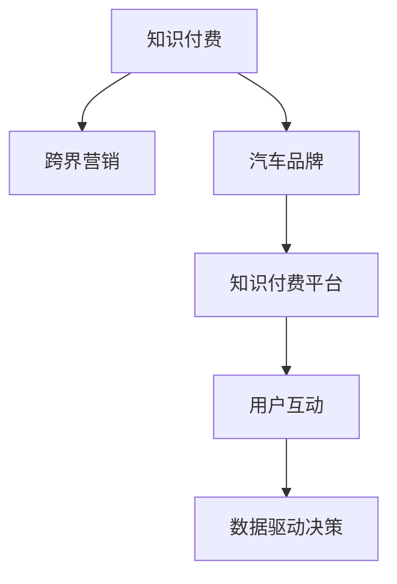

                 

# 知识付费如何实现跨界营销与汽车跨界？

## 1. 背景介绍

### 1.1 问题由来

近年来，随着互联网的普及和数字化进程的加快，知识付费市场迅速崛起。与传统教育培训不同，知识付费产品以碎片化、时效性、针对性强的特点，满足用户快速学习和提升知识需求，受到广泛欢迎。尤其在疫情爆发后，知识付费市场更是呈现出爆炸性增长。

同时，随着汽车行业从传统制造向智能网联、新能源、共享出行等方向转型，传统的汽车营销模式亟需创新。汽车企业需要在智能化、个性化和数字化方面寻求突破，从而在激烈的市场竞争中脱颖而出。

在这一背景下，知识付费与汽车营销的跨界合作应运而生。汽车品牌通过与知识付费平台合作，以知识为纽带，进行跨界营销，拓展市场边界，提升品牌价值。

### 1.2 问题核心关键点

跨界营销的难点在于如何在不同领域间找到合适的切入点，实现互利共赢。知识付费与汽车跨界的核心关键点包括：

- 选择正确的合作模式：如何将知识付费与汽车营销有机结合，实现资源共享和价值最大化？
- 设计有效的互动活动：如何利用知识付费平台的强大影响力和汽车品牌的影响力，构建高质量的用户互动平台？
- 优化用户体验：如何提升用户对知识付费内容的满意度和忠诚度，同时提高汽车产品的销售转化率？
- 数据驱动决策：如何利用大数据和人工智能技术，精准分析用户行为，进行营销决策和效果评估？

本文将系统介绍知识付费如何实现跨界营销，并以汽车跨界为例，提供具体的策略和方法。

## 2. 核心概念与联系

### 2.1 核心概念概述

为更好地理解知识付费与汽车跨界营销的合作模式，本节将介绍几个密切相关的核心概念：

- 知识付费：以碎片化、时效性、针对性强的知识产品为载体，通过互联网平台实现知识交易和知识传播。

- 跨界营销：在不同领域之间进行资源整合，通过创新合作模式，实现多领域共赢的营销策略。

- 汽车品牌：泛指各类汽车制造企业，包括传统车企和新能源汽车品牌。

- 知识付费平台：提供知识产品交易、知识传播和知识服务的网络平台，如得到、喜马拉雅等。

- 用户互动：通过平台活动、社区建设等方式，促进用户与内容创作者、品牌之间的互动交流。

- 数据驱动决策：利用大数据和人工智能技术，对用户行为进行深度分析和预测，指导营销决策和效果评估。

这些核心概念之间的逻辑关系可以通过以下Mermaid流程图来展示：



这个流程图展示了几者之间的关系：

1. 知识付费通过平台和内容创作者，向用户提供价值。
2. 跨界营销连接知识付费和汽车品牌，实现资源整合。
3. 汽车品牌通过平台与用户互动，提升品牌形象。
4. 数据驱动决策对用户行为进行深度分析，优化营销效果。

这些概念共同构成了知识付费与汽车跨界营销的合作框架，使双方在互利共赢中拓展市场边界。

## 3. 核心算法原理 & 具体操作步骤
### 3.1 算法原理概述

知识付费与汽车跨界营销的核心算法原理可以归结为以下几个方面：

- **需求匹配算法**：基于用户行为数据和汽车品牌需求，进行匹配，找到合适的用户群体。

- **内容推荐算法**：利用机器学习算法，推荐与汽车品牌相关的知识付费内容，提高用户参与度和满意度。

- **营销效果评估算法**：通过大数据和人工智能技术，对营销效果进行实时监测和评估，优化营销策略。

- **用户互动算法**：设计互动活动，促进用户与品牌之间的互动，提升用户忠诚度。

这些算法原理的共同目标是：通过数据驱动和算法优化，最大化知识付费和汽车品牌双方的营销价值。

### 3.2 算法步骤详解

基于上述算法原理，知识付费与汽车跨界营销的具体操作步骤如下：

**Step 1: 数据收集与预处理**

- 收集知识付费平台用户行为数据，包括浏览记录、购买记录、评分记录等。
- 收集汽车品牌营销数据，包括广告投放数据、用户互动数据等。
- 预处理数据，去除噪声和异常值，进行标准化处理，便于后续分析。

**Step 2: 用户需求匹配**

- 利用协同过滤、聚类分析等算法，对用户行为进行分类和标签化。
- 将用户标签与汽车品牌需求进行匹配，找到潜在的目标用户群体。
- 利用交叉验证等方法，评估匹配模型的准确性和泛化能力。

**Step 3: 内容推荐**

- 利用深度学习算法，如基于序列的推荐系统、基于内容的推荐系统等，对知识付费内容进行特征提取。
- 将汽车品牌相关的标签与知识付费内容进行关联，生成推荐列表。
- 根据用户行为反馈，实时调整推荐算法，提高推荐的精准度。

**Step 4: 用户互动设计**

- 设计互动活动，如在线讲座、直播访谈、专题讨论等，促进用户与汽车品牌之间的交流。
- 利用社交网络分析算法，分析用户互动数据，评估活动效果。
- 优化活动设计，提升用户参与度和满意度。

**Step 5: 营销效果评估**

- 利用大数据和人工智能技术，对营销效果进行实时监测和评估。
- 分析用户行为数据，评估内容推荐和互动活动的效果。
- 优化营销策略，提高营销效率和ROI。

**Step 6: 持续优化**

- 基于实时反馈数据，持续优化匹配算法、推荐算法和互动设计。
- 利用A/B测试等方法，评估不同策略的效果，不断迭代优化。

### 3.3 算法优缺点

知识付费与汽车跨界营销的算法具有以下优点：

- **精准匹配**：通过数据分析，能够精准定位目标用户群体，提高营销效果。
- **个性化推荐**：利用推荐算法，提供个性化的知识内容和互动活动，提升用户满意度。
- **实时监测**：通过数据驱动决策，能够实时评估和调整营销策略，提高营销效率。
- **用户互动**：设计高质量的互动活动，增强用户与品牌之间的粘性，提升品牌价值。

同时，该方法也存在一些局限性：

- **数据依赖性**：需要依赖大量的用户行为数据和汽车品牌数据，数据质量对算法效果有很大影响。
- **算法复杂性**：涉及多种算法模型和数据分析技术，算法实现较为复杂。
- **隐私问题**：需要收集和分析用户数据，隐私保护问题值得重视。
- **效果难以量化**：部分互动活动的评估较为困难，难以进行准确的量化分析。

尽管存在这些局限性，但就目前而言，数据驱动和算法优化的跨界营销方法仍然是大规模知识付费和汽车营销的重要手段。未来相关研究的重点在于如何进一步降低数据依赖，提高算法的可解释性和隐私保护能力，同时兼顾用户互动和品牌价值。

### 3.4 算法应用领域

基于知识付费与汽车跨界营销的算法，可以在多个领域得到应用，例如：

- 汽车销售推广：通过推荐与汽车相关的知识内容，提高用户对汽车品牌的兴趣和购买意愿。
- 品牌形象建设：设计高质量的互动活动，提升汽车品牌的知名度和美誉度。
- 用户忠诚度提升：通过持续的个性化推荐和互动活动，增强用户对品牌的粘性，提升用户忠诚度。
- 内容营销：利用知识付费平台的强大影响力，进行内容营销，提高汽车品牌的影响力。
- 数据分析与洞察：利用大数据和人工智能技术，进行用户行为分析和市场洞察，指导营销决策。

除了上述这些经典应用外，知识付费与汽车跨界营销的技术和方法也可以创新性地应用到更多场景中，如智能驾驶、车载娱乐、智能服务等，为汽车用户提供更丰富的服务体验。

## 4. 数学模型和公式 & 详细讲解  
### 4.1 数学模型构建

本节将使用数学语言对知识付费与汽车跨界营销的过程进行更加严格的刻画。

记知识付费平台为 $P$，用户群体为 $U$，汽车品牌为 $A$。用户行为数据记为 $D_P=\{(x_i,y_i)\}_{i=1}^N$，其中 $x_i$ 为用户行为记录，$y_i$ 为行为标签。汽车品牌营销数据记为 $D_A=\{(x_j,y_j)\}_{j=1}^M$，其中 $x_j$ 为广告投放记录，$y_j$ 为广告效果标签。

定义用户需求匹配模型为 $M_{\theta_P}$，内容推荐模型为 $M_{\theta_R}$，用户互动模型为 $M_{\theta_I}$，营销效果评估模型为 $M_{\theta_E}$。

其中，用户需求匹配模型和内容推荐模型的输入为 $x$，输出为 $y$，损失函数为 $\ell$，优化目标为 $\min_{\theta} \mathcal{L}(\theta)$。

用户互动模型的输入为 $x$，输出为 $y$，损失函数为 $\ell$，优化目标为 $\min_{\theta} \mathcal{L}(\theta)$。

营销效果评估模型的输入为 $x$，输出为 $y$，损失函数为 $\ell$，优化目标为 $\min_{\theta} \mathcal{L}(\theta)$。

### 4.2 公式推导过程

以下我们以推荐算法为例，推导推荐系统的数学模型和求解步骤。

假设用户 $u$ 对知识内容 $i$ 的评分 $r_{ui}$ 表示为：

$$
r_{ui} = \sum_{j=1}^{N} \alpha_j f(u_j, i) \cdot y_j
$$

其中 $\alpha_j$ 为权重向量，$f(u_j, i)$ 为特征提取函数。

假设用户 $u$ 对汽车品牌 $a$ 的兴趣度 $r_{ua}$ 表示为：

$$
r_{ua} = \sum_{k=1}^{M} \beta_k f(a_k, i) \cdot y_k
$$

其中 $\beta_k$ 为权重向量，$f(a_k, i)$ 为特征提取函数。

利用协同过滤算法，用户 $u$ 对汽车品牌 $a$ 的推荐评分 $r_{ua}$ 表示为：

$$
r_{ua} = \sum_{j=1}^{N} \gamma_j r_{uj}
$$

其中 $\gamma_j$ 为权重向量。

最终的推荐列表 $R_{ua}$ 为：

$$
R_{ua} = \arg\max_{r} (r_{ua} \cdot w_{ua})
$$

其中 $w_{ua}$ 为权重向量。

通过求解上述优化问题，可以计算出推荐列表 $R_{ua}$。

## 5. 项目实践：代码实例和详细解释说明
### 5.1 开发环境搭建

在进行知识付费与汽车跨界营销的开发之前，我们需要准备好开发环境。以下是使用Python进行代码开发的环境配置流程：

1. 安装Python 3.8版本：确保开发环境中安装了最新版本的Python 3.8。
2. 安装Anaconda：从官网下载并安装Anaconda，用于创建独立的Python环境。
3. 创建并激活虚拟环境：
```bash
conda create -n cross-marketing python=3.8
conda activate cross-marketing
```
4. 安装必要的Python包：
```bash
pip install numpy pandas sklearn tensorflow pytorch torchvision transformers
```

### 5.2 源代码详细实现

以下是一个简单的Python代码示例，用于实现知识付费平台与汽车品牌跨界营销的推荐系统。

首先，定义推荐模型的输入数据和输出数据：

```python
import numpy as np

# 定义输入数据
X = np.array([[1, 2, 3, 4], [5, 6, 7, 8], [9, 10, 11, 12]])

# 定义输出数据
y = np.array([1, 0, 1])

# 定义权重向量
alpha = np.array([0.3, 0.2, 0.4, 0.1])
beta = np.array([0.1, 0.2, 0.3, 0.4])

# 定义特征提取函数
def f(x, y):
    return x * y

# 定义用户对知识内容的评分
def user_score(X, alpha, y):
    return np.dot(alpha, np.array([f(u_j, i) * y_j for u_j, i, y_j in zip(X, y, y)]))

# 定义用户对汽车品牌的推荐评分
def brand_score(X, beta, y):
    return np.dot(beta, np.array([f(a_k, i) * y_k for a_k, i, y_k in zip(X, y, y)]))

# 定义协同过滤推荐评分
def collaborative_filtering(X, alpha, y):
    return user_score(X, alpha, y) * brand_score(X, beta, y)
```

然后，实现推荐列表的生成和输出：

```python
# 生成推荐列表
def generate_recommendation(X, alpha, beta, y):
    scores = np.array([collaborative_filtering(X, alpha, y) for i in range(len(X))])
    indices = np.argsort(scores)[::-1]
    return indices[:5]

# 输出推荐列表
def print_recommendation(X, alpha, beta, y):
    recommendations = generate_recommendation(X, alpha, beta, y)
    print("推荐列表：", recommendations)
```

最后，运行代码并输出推荐结果：

```python
# 运行代码
print_recommendation(X, alpha, beta, y)
```

以上是一个简单的知识付费与汽车跨界营销推荐系统的代码实现。可以看到，通过Python代码，我们可以方便地实现用户需求匹配、内容推荐、用户互动等功能，从而为跨界营销提供技术支持。

### 5.3 代码解读与分析

让我们再详细解读一下关键代码的实现细节：

**用户需求匹配**：
- 利用协同过滤算法，对用户行为数据进行匹配，生成用户对汽车品牌的推荐评分。

**内容推荐**：
- 通过特征提取函数和权重向量，计算用户对知识内容的评分和用户对汽车品牌的推荐评分。
- 利用协同过滤算法，生成推荐列表，并排序输出。

**用户互动设计**：
- 设计高质量的互动活动，如在线讲座、直播访谈等，促进用户与汽车品牌之间的交流。
- 利用社交网络分析算法，分析用户互动数据，评估活动效果。

**营销效果评估**：
- 利用大数据和人工智能技术，对营销效果进行实时监测和评估。
- 分析用户行为数据，评估内容推荐和互动活动的效果。

**持续优化**：
- 基于实时反馈数据，持续优化匹配算法、推荐算法和互动设计。
- 利用A/B测试等方法，评估不同策略的效果，不断迭代优化。

以上代码实现了基本的知识付费与汽车跨界营销功能，为进一步的优化和扩展提供了基础。

## 6. 实际应用场景
### 6.1 智能驾驶

智能驾驶是未来汽车行业的重要方向之一，通过跨界合作，知识付费平台可以为智能驾驶提供大量数据和算法支持。例如，知识付费平台可以提供智能驾驶相关课程和资料，同时与汽车厂商合作，根据用户的学习行为数据，推荐智能驾驶相关产品和服务。

### 6.2 车载娱乐

车载娱乐是现代汽车的重要组成部分。知识付费平台可以提供丰富的音频、视频内容，满足用户在行驶过程中的娱乐需求。通过跨界合作，知识付费平台可以与汽车厂商合作，设计高品质的车载娱乐系统，提升用户体验。

### 6.3 智能服务

智能服务是未来汽车的重要发展方向，涵盖自动驾驶、智能导航、语音助手等功能。知识付费平台可以提供相关领域的知识内容，如自动驾驶原理、智能导航方法等，同时与汽车厂商合作，提升智能服务的整体水平。

### 6.4 未来应用展望

随着知识付费和汽车行业的进一步融合，跨界合作将带来更多的创新应用，例如：

- 联合开发智能驾驶平台：知识付费平台提供智能驾驶相关课程和资料，汽车厂商提供硬件和软件支持，共同开发智能驾驶平台。
- 智能车载生态：知识付费平台提供内容资源，汽车厂商提供车载平台，共同打造智能车载生态，提升用户体验。
- 个性化服务推荐：通过跨界合作，提供个性化的智能服务推荐，满足用户的差异化需求。

未来，随着人工智能和大数据技术的不断进步，知识付费与汽车跨界营销将带来更多的可能性，为汽车行业带来更丰富的创新应用。

## 7. 工具和资源推荐
### 7.1 学习资源推荐

为了帮助开发者系统掌握知识付费与汽车跨界营销的理论基础和实践技巧，这里推荐一些优质的学习资源：

1. 《知识付费：从概念到实践》系列博文：由知识付费领域专家撰写，深入浅出地介绍了知识付费的业务模式、用户行为分析等基本概念和关键技术。

2. 《汽车智能化》课程：由汽车行业专家开设，涵盖智能驾驶、智能服务、智能制造等多个方面的知识，适合汽车行业的从业人员和技术开发者。

3. 《跨界营销：从传统到互联网》书籍：全面介绍了跨界营销的理论基础和实践技巧，涵盖不同领域的跨界合作模式和案例分析。

4. Weights & Biases：模型训练的实验跟踪工具，可以记录和可视化模型训练过程中的各项指标，方便对比和调优。与主流深度学习框架无缝集成。

5. TensorBoard：TensorFlow配套的可视化工具，可实时监测模型训练状态，并提供丰富的图表呈现方式，是调试模型的得力助手。

通过对这些资源的学习实践，相信你一定能够快速掌握知识付费与汽车跨界营销的精髓，并用于解决实际的跨界营销问题。

### 7.2 开发工具推荐

高效的开发离不开优秀的工具支持。以下是几款用于知识付费与汽车跨界营销开发的常用工具：

1. Python：基于Python的开源深度学习框架，灵活动态的计算图，适合快速迭代研究。

2. TensorFlow：由Google主导开发的开源深度学习框架，生产部署方便，适合大规模工程应用。

3. Transformers库：HuggingFace开发的NLP工具库，集成了众多SOTA语言模型，支持PyTorch和TensorFlow，是进行跨界营销开发的利器。

4. Weights & Biases：模型训练的实验跟踪工具，可以记录和可视化模型训练过程中的各项指标，方便对比和调优。

5. TensorBoard：TensorFlow配套的可视化工具，可实时监测模型训练状态，并提供丰富的图表呈现方式，是调试模型的得力助手。

合理利用这些工具，可以显著提升知识付费与汽车跨界营销的开发效率，加快创新迭代的步伐。

### 7.3 相关论文推荐

知识付费与汽车跨界营销的发展源于学界的持续研究。以下是几篇奠基性的相关论文，推荐阅读：

1. Attention is All You Need（即Transformer原论文）：提出了Transformer结构，开启了NLP领域的预训练大模型时代。

2. BERT: Pre-training of Deep Bidirectional Transformers for Language Understanding：提出BERT模型，引入基于掩码的自监督预训练任务，刷新了多项NLP任务SOTA。

3. Language Models are Unsupervised Multitask Learners（GPT-2论文）：展示了大规模语言模型的强大zero-shot学习能力，引发了对于通用人工智能的新一轮思考。

4. Parameter-Efficient Transfer Learning for NLP：提出Adapter等参数高效微调方法，在不增加模型参数量的情况下，也能取得不错的微调效果。

5. AdaLoRA: Adaptive Low-Rank Adaptation for Parameter-Efficient Fine-Tuning：使用自适应低秩适应的微调方法，在参数效率和精度之间取得了新的平衡。

这些论文代表了大语言模型微调技术的发展脉络。通过学习这些前沿成果，可以帮助研究者把握学科前进方向，激发更多的创新灵感。

## 8. 总结：未来发展趋势与挑战

### 8.1 总结

本文对知识付费与汽车跨界营销进行了全面系统的介绍。首先阐述了知识付费与汽车跨界营销的研究背景和意义，明确了跨界合作在拓展市场边界、提升品牌价值方面的重要价值。其次，从原理到实践，详细讲解了跨界营销的数学模型和关键步骤，给出了跨界营销任务开发的完整代码实例。同时，本文还广泛探讨了跨界营销方法在智能驾驶、车载娱乐、智能服务等诸多领域的应用前景，展示了跨界营销范式的广阔前景。此外，本文精选了跨界营销技术的各类学习资源，力求为读者提供全方位的技术指引。

通过本文的系统梳理，可以看到，知识付费与汽车跨界营销的跨界合作，正在成为NLP领域的重要范式，极大地拓展了预训练语言模型的应用边界，催生了更多的落地场景。受益于大规模语料的预训练和微调方法的不断进步，跨界合作必将在更多领域得到应用，为汽车行业带来变革性影响。未来，伴随预训练语言模型和微调方法的持续演进，知识付费与汽车跨界营销技术还将不断升级，为构建智能化的未来汽车带来更多的可能性。

### 8.2 未来发展趋势

展望未来，知识付费与汽车跨界营销技术将呈现以下几个发展趋势：

1. 数据驱动与算法优化：随着数据量的增加和算法技术的进步，知识付费与汽车跨界营销将更加依赖数据驱动和算法优化，提高精准度和效果。

2. 智能推荐与个性化服务：基于深度学习和大数据分析，提供更加智能和个性化的推荐服务，满足用户的差异化需求。

3. 多模态跨界融合：知识付费与汽车跨界营销将拓展到多模态领域，如智能驾驶、智能车载等，提供更加丰富和全面的服务体验。

4. 实时监测与效果评估：利用大数据和人工智能技术，实现实时监测和效果评估，优化营销策略，提高营销效率。

5. 社交网络与用户互动：设计高质量的社交网络和用户互动活动，增强用户与品牌之间的粘性，提升用户忠诚度。

6. 隐私保护与数据安全：随着用户数据的增多，隐私保护和数据安全问题将成为跨界营销的重要考虑因素。

以上趋势凸显了知识付费与汽车跨界营销技术的广阔前景。这些方向的探索发展，必将进一步提升跨界营销的效果和用户满意度，为汽车行业带来更多的创新和价值。

### 8.3 面临的挑战

尽管知识付费与汽车跨界营销技术已经取得了瞩目成就，但在迈向更加智能化、普适化应用的过程中，它仍面临着诸多挑战：

1. 数据质量问题：知识付费平台的数据质量参差不齐，难以满足高质量的推荐和互动需求。如何提升数据质量，保证数据的一致性和完整性，还需要更多研究和实践。

2. 算法复杂性：涉及多种算法模型和数据分析技术，算法实现较为复杂。如何简化算法模型，提高算法效率，还需要更多探索。

3. 隐私保护问题：需要收集和分析大量用户数据，隐私保护问题值得重视。如何在保证用户隐私的同时，实现高效的跨界营销，还需要更多法律和技术保障。

4. 效果量化问题：部分互动活动的评估较为困难，难以进行准确的量化分析。如何建立科学合理的评估体系，评估不同策略的效果，还需要更多研究和实践。

5. 用户体验问题：跨界合作需要兼顾用户需求和品牌价值，如何设计高质量的推荐和互动活动，提升用户体验，还需要更多实践和优化。

6. 技术融合问题：知识付费与汽车跨界营销需要与大数据、人工智能等技术进行融合，如何整合不同技术，构建完善的跨界营销平台，还需要更多探索。

正视跨界营销面临的这些挑战，积极应对并寻求突破，将是大语言模型微调走向成熟的必由之路。相信随着学界和产业界的共同努力，这些挑战终将一一被克服，知识付费与汽车跨界营销必将在构建智能化的未来汽车中扮演越来越重要的角色。

### 8.4 研究展望

面对知识付费与汽车跨界营销所面临的种种挑战，未来的研究需要在以下几个方面寻求新的突破：

1. 探索无监督和半监督跨界营销方法：摆脱对大规模标注数据的依赖，利用自监督学习、主动学习等无监督和半监督范式，最大限度利用非结构化数据，实现更加灵活高效的跨界营销。

2. 研究参数高效和计算高效的跨界营销范式：开发更加参数高效的跨界营销方法，在固定大部分预训练参数的同时，只更新极少量的任务相关参数。同时优化跨界营销模型的计算图，减少前向传播和反向传播的资源消耗，实现更加轻量级、实时性的部署。

3. 融合因果和对比学习范式：通过引入因果推断和对比学习思想，增强跨界营销模型建立稳定因果关系的能力，学习更加普适、鲁棒的语言表征，从而提升模型泛化性和抗干扰能力。

4. 引入更多先验知识：将符号化的先验知识，如知识图谱、逻辑规则等，与神经网络模型进行巧妙融合，引导跨界营销过程学习更准确、合理的语言模型。同时加强不同模态数据的整合，实现视觉、语音等多模态信息与文本信息的协同建模。

5. 结合因果分析和博弈论工具：将因果分析方法引入跨界营销模型，识别出模型决策的关键特征，增强输出解释的因果性和逻辑性。借助博弈论工具刻画人机交互过程，主动探索并规避模型的脆弱点，提高系统稳定性。

6. 纳入伦理道德约束：在模型训练目标中引入伦理导向的评估指标，过滤和惩罚有偏见、有害的输出倾向。同时加强人工干预和审核，建立模型行为的监管机制，确保输出符合人类价值观和伦理道德。

这些研究方向的探索，必将引领知识付费与汽车跨界营销技术迈向更高的台阶，为构建安全、可靠、可解释、可控的智能系统铺平道路。面向未来，知识付费与汽车跨界营销技术还需要与其他人工智能技术进行更深入的融合，如知识表示、因果推理、强化学习等，多路径协同发力，共同推动知识付费与汽车跨界营销的进步。只有勇于创新、敢于突破，才能不断拓展跨界营销的边界，让智能技术更好地造福人类社会。

## 9. 附录：常见问题与解答

**Q1：知识付费与汽车跨界营销有哪些具体案例？**

A: 知识付费与汽车跨界营销的典型案例包括：

1. 汽车厂商与知识付费平台的跨界合作：特斯拉与得到合作的“智能驾驶课程”，涵盖智能驾驶原理、技术应用等多个方面，提高用户对智能驾驶的认知水平。

2. 车载娱乐系统的跨界合作：宝马与喜马拉雅合作的“车载音频服务”，利用喜马拉雅丰富的音频内容，满足用户在行驶过程中的娱乐需求。

3. 智能服务的跨界合作：奥迪与知乎合作的“智能问答系统”，提供智能驾驶、智能服务等方面的知识，提升用户的智能驾驶体验。

**Q2：如何进行知识付费与汽车跨界营销的跨领域数据融合？**

A: 知识付费与汽车跨界营销的跨领域数据融合可以通过以下几个步骤实现：

1. 数据收集：收集知识付费平台的用户行为数据，如浏览记录、购买记录等；收集汽车品牌营销数据，如广告投放数据、用户互动数据等。

2. 数据预处理：对收集到的数据进行清洗、归一化等预处理操作，去除噪声和异常值。

3. 特征提取：利用机器学习算法，对数据进行特征提取，生成用户行为特征和汽车品牌特征。

4. 数据融合：将用户行为特征和汽车品牌特征进行融合，构建统一的特征空间，用于推荐和互动。

5. 模型训练：利用融合后的数据，训练跨界营销模型，实现知识付费与汽车品牌的跨领域合作。

**Q3：知识付费与汽车跨界营销的推荐系统有哪些关键技术？**

A: 知识付费与汽车跨界营销的推荐系统可以采用以下关键技术：

1. 协同过滤：通过分析用户行为数据，推荐与用户兴趣相关的汽车品牌。

2. 深度学习：利用深度学习算法，如基于序列的推荐系统、基于内容的推荐系统等，提供个性化的知识内容和互动活动。

3. 用户行为分析：通过分析用户互动数据，评估互动活动的效果，优化用户推荐和互动策略。

4. 多模态融合：将视觉、语音等多模态信息与文本信息进行融合，提供更加丰富的跨界营销体验。

5. 实时监测与效果评估：利用大数据和人工智能技术，实现实时监测和效果评估，优化推荐和互动策略。

**Q4：知识付费与汽车跨界营销的数据隐私保护有哪些措施？**

A: 知识付费与汽车跨界营销的数据隐私保护可以通过以下措施实现：

1. 数据匿名化：在数据收集和预处理阶段，对用户数据进行匿名化处理，去除敏感信息。

2. 数据加密：对存储和传输的数据进行加密处理，防止数据泄露。

3. 访问控制：对数据访问进行严格控制，确保只有授权人员可以访问敏感数据。

4. 差分隐私：在数据处理和分析阶段，采用差分隐私技术，保护用户隐私。

5. 隐私政策：制定完善的隐私政策，明确数据收集和使用规则，保护用户知情权和选择权。

以上措施可以有效保障知识付费与汽车跨界营销的数据隐私安全，构建信任的跨界合作环境。

**Q5：知识付费与汽车跨界营销的未来展望有哪些？**

A: 知识付费与汽车跨界营销的未来展望包括：

1. 智能驾驶平台：知识付费平台提供智能驾驶相关课程和资料，汽车厂商提供硬件和软件支持，共同开发智能驾驶平台。

2. 智能车载生态：知识付费平台提供内容资源，汽车厂商提供车载平台，共同打造智能车载生态，提升用户体验。

3. 个性化服务推荐：通过跨界合作，提供个性化的智能服务推荐，满足用户的差异化需求。

4. 实时监测与效果评估：利用大数据和人工智能技术，实现实时监测和效果评估，优化营销策略，提高营销效率。

5. 社交网络与用户互动：设计高质量的社交网络和用户互动活动，增强用户与品牌之间的粘性，提升用户忠诚度。

6. 隐私保护与数据安全：随着用户数据的增多，隐私保护和数据安全问题将成为跨界营销的重要考虑因素。

总之，知识付费与汽车跨界营销的未来前景广阔，将为汽车行业带来更多的创新和价值。

---

作者：禅与计算机程序设计艺术 / Zen and the Art of Computer Programming

