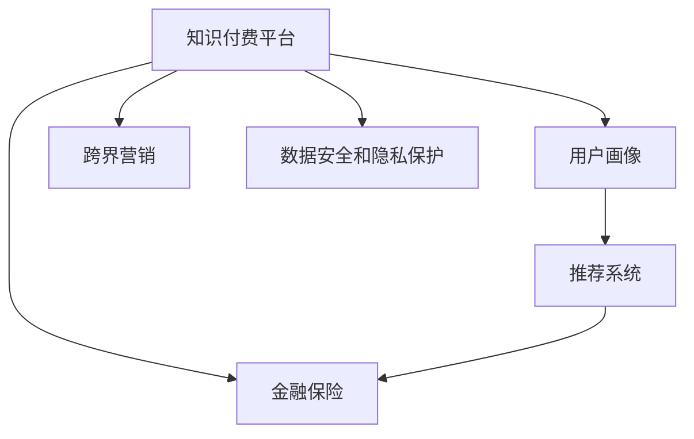

                 

# 知识付费如何实现跨界营销与金融保险跨界？

知识付费作为互联网时代知识传播和变现的新模式，近年来迅速崛起，日益成为教育、媒体、金融等行业的重要业务。本文将深入探讨知识付费的跨界营销模式，特别是在金融保险行业的创新应用，分析其技术原理、操作步骤及实际效果。

## 1. 背景介绍

### 1.1 知识付费的兴起与现状

知识付费起源于互联网平台，如知识付费社区“得到”和“知乎live”，主要通过订阅、单次购买等方式，向用户提供高质量的知识和专业服务。随着用户对知识需求和消费习惯的变化，知识付费市场迅速扩大，涵盖内容从科普教育、职业技能到投资理财等多个领域。

### 1.2 跨界营销的趋势与意义

跨界营销指的是将原本不属于同一领域的产品或服务进行融合营销，以达到共同推广、扩大用户群体和提高市场份额的目的。在知识付费领域，跨界营销不仅是业务拓展的需要，也是提升用户粘性和满意度的重要手段。通过与金融、保险等领域的深度结合，知识付费可以实现用户从单纯的知识消费者到综合服务用户的转变。

## 2. 核心概念与联系

### 2.1 核心概念概述

- **知识付费**：通过付费获取专业知识和信息的服务模式，涵盖在线课程、电子书、直播课程等多种形式。
- **跨界营销**：不同领域之间的融合营销，以达到共同推广的目的。
- **金融保险**：以金融工具和保险产品为核心的服务体系，包括银行、证券、保险、资产管理等多个子行业。

- **用户画像**：对用户基本属性、行为特征的分析和建模，用于精准营销和个性化服务。
- **推荐系统**：利用用户行为数据和内容特征，为用户推荐最相关、最符合需求的知识产品。
- **数据安全和隐私保护**：在跨界营销过程中，确保用户数据的安全和隐私不被侵犯。

### 2.2 核心概念联系的Mermaid 流程图



## 3. 核心算法原理 & 具体操作步骤

### 3.1 算法原理概述

知识付费与金融保险的跨界营销，主要基于推荐系统和大数据分析技术。通过构建用户画像，对用户行为进行建模，结合金融保险产品的特性和需求，实现精准推荐和营销。推荐系统基于协同过滤、内容推荐、深度学习等多种算法，能够根据用户历史行为和当前兴趣，实时推荐相关知识产品和金融保险产品。

### 3.2 算法步骤详解

1. **数据收集与预处理**：
   - 从知识付费平台和金融保险平台收集用户行为数据，包括浏览记录、购买记录、评分评价等。
   - 对数据进行清洗和标准化处理，确保数据质量和一致性。

2. **用户画像构建**：
   - 利用机器学习和数据挖掘技术，构建用户画像，包括用户基本属性、兴趣偏好、行为特征等。
   - 使用协同过滤算法（如ALS、SVD）或深度学习模型（如CNN、RNN），分析用户行为数据，预测用户未来的需求。

3. **推荐系统设计**：
   - 选择合适的推荐算法，如基于内容的推荐、协同过滤推荐、基于深度学习的推荐等。
   - 设计推荐系统架构，包括数据存储、模型训练、推理引擎等模块。

4. **金融保险产品适配**：
   - 将金融保险产品的信息映射到推荐系统中，如股票、基金、保险产品等。
   - 根据用户画像和推荐算法，为用户推荐匹配度高的金融保险产品。

5. **营销推广与反馈循环**：
   - 通过多渠道（如社交媒体、邮件、App内通知等）向用户推广推荐产品。
   - 收集用户反馈和互动数据，进一步优化推荐算法和营销策略。

### 3.3 算法优缺点

**优点**：
- **精准推荐**：通过用户画像和推荐算法，实现精准的知识产品推荐，提高用户满意度和忠诚度。
- **多渠道营销**：利用多种营销渠道，扩大品牌影响力和市场覆盖面。
- **数据驱动**：基于数据驱动决策，提高营销活动的效果和ROI。

**缺点**：
- **数据隐私问题**：跨界营销涉及用户多维度数据的融合，需要严格的数据隐私保护措施。
- **算法复杂性**：推荐系统算法复杂度高，需要大量的计算资源和时间。
- **市场竞争**：知识付费和金融保险市场竞争激烈，跨界营销需要精准的策略和创意。

### 3.4 算法应用领域

跨界营销在知识付费领域的应用范围非常广泛，主要涵盖以下几个方面：

1. **教育培训与金融投资**：通过推荐金融投资课程，帮助用户提升财务知识和管理能力。
2. **职场发展与保险保障**：推荐职业技能培训课程和保险产品，帮助用户规划职业发展和风险管理。
3. **家庭理财与健康管理**：推荐家庭理财规划和健康管理课程，提升用户生活质量。

## 4. 数学模型和公式 & 详细讲解

### 4.1 数学模型构建

本节将使用数学语言对推荐系统进行形式化描述，并给出主要算法的推导过程。

设用户集合为 $U$，知识付费平台的产品集合为 $I$，金融保险产品集合为 $P$。设用户对产品的评分矩阵为 $R \in \mathbb{R}^{U \times I}$，用户对产品的交互行为矩阵为 $S \in \mathbb{R}^{U \times P}$。

推荐系统的主要目标是为每个用户 $u \in U$ 推荐最相关的产品 $i \in I$ 和 $p \in P$，使得：

$$
\max_{\theta} \sum_{u \in U} \sum_{i \in I} \log(1+\exp(R_{ui}+\theta_i^T \varphi(u))) + \sum_{u \in U} \sum_{p \in P} \log(1+\exp(S_{up}+\theta_p^T \varphi(u)))
$$

其中 $\theta_i$ 和 $\theta_p$ 为用户特征的表示向量，$\varphi(u)$ 为用户特征的映射函数，$\log(1+\exp(z))$ 为平滑函数。

### 4.2 公式推导过程

推荐系统的核心在于为用户 $u$ 预测其对产品 $i$ 和 $p$ 的兴趣度 $r_{ui}$ 和 $s_{up}$。以协同过滤算法ALS为例，通过矩阵分解，将用户-产品评分矩阵 $R$ 分解为用户特征矩阵 $U$ 和产品特征矩阵 $V$：

$$
R \approx UV
$$

其中 $U \in \mathbb{R}^{U \times K}, V \in \mathbb{R}^{I \times K}, K$ 为潜在因子数。用户对产品 $i$ 的兴趣度可以通过 $U$ 矩阵中用户 $u$ 对应的行向量和产品 $i$ 对应的列向量的点积来计算：

$$
r_{ui} \approx \sum_{k=1}^K u_kv_{ki}
$$

金融保险产品的适配同样采用矩阵分解的方式，将用户-产品交互行为矩阵 $S$ 分解为用户特征矩阵 $U'$ 和产品特征矩阵 $V'$：

$$
S \approx U'V'
$$

用户对产品 $p$ 的兴趣度可以通过 $U'$ 矩阵中用户 $u$ 对应的行向量和产品 $p$ 对应的列向量的点积来计算：

$$
s_{up} \approx \sum_{k=1}^K u'_kv'_{kp}
$$

### 4.3 案例分析与讲解

以“得到”平台为例，分析其如何通过跨界营销实现知识付费与金融保险的结合。

**数据收集与预处理**：
- 从“得到”平台收集用户行为数据，包括课程浏览、购买、评分等。
- 清洗数据，去除异常值和噪声，确保数据质量。

**用户画像构建**：
- 利用ALS算法，对用户行为数据进行矩阵分解，得到用户特征矩阵 $U$。
- 根据用户特征向量，提取用户的基本属性、兴趣偏好等。

**推荐系统设计**：
- 选择协同过滤算法ALS，设计推荐系统架构。
- 将金融保险产品映射到推荐系统中，如课程“投资理财入门”对应的股票、基金等。

**营销推广与反馈循环**：
- 通过“得到”App和邮件向用户推广课程和金融产品。
- 收集用户反馈，优化推荐算法，提升推荐效果。

## 5. 项目实践：代码实例和详细解释说明

### 5.1 开发环境搭建

本节介绍如何搭建知识付费与金融保险跨界营销的开发环境。

1. **环境安装**：
   - 安装Python、NumPy、Pandas等基础库。
   - 安装推荐系统库，如scikit-learn、Surprise等。
   - 安装金融数据分析库，如pandas-datareader、yfinance等。

2. **数据准备**：
   - 收集知识付费平台和金融保险平台的数据集。
   - 清洗和标准化数据，生成推荐系统所需的用户行为数据和产品特征数据。

### 5.2 源代码详细实现

下面以Python代码为例，展示如何实现基于ALS的推荐系统，并进行金融保险产品的适配。

```python
import numpy as np
from surprise import SVD, Dataset, Reader

# 数据读取
reader = Reader(rating_scale=(1, 5))
data = Dataset.load_from_df(df, reader)

# 用户行为数据
trainset = data.build_full_trainset()
svd = SVD()
svd.fit(trainset)

# 金融保险产品适配
product_dict = {'课程1': '股票1', '课程2': '基金2', ...}

# 推荐函数
def recommend(user_id, product_dict):
    user_factors = svd.user_factors
    user_probs = svd.user_based.get_user(user_id).toarray()
    recom_probs = []
    for product, stock in product_dict.items():
        if stock in user_probs:
            recom_probs.append((product, user_probs[stock]))
    recom_probs.sort(key=lambda x: x[1], reverse=True)
    return recom_probs

# 测试
user_id = 1
recoms = recommend(user_id, product_dict)
print(recoms)
```

### 5.3 代码解读与分析

1. **数据读取**：
   - 使用surprise库的Reader类，定义评分尺度，读取用户行为数据集。

2. **模型训练**：
   - 使用ALS算法，构建推荐系统，对用户行为数据进行分解和拟合。

3. **金融保险产品适配**：
   - 定义产品字典，将金融保险产品映射到知识付费产品上。

4. **推荐函数设计**：
   - 根据用户画像，计算用户对金融保险产品的推荐概率。
   - 对推荐结果进行排序，返回高概率推荐产品。

### 5.4 运行结果展示

通过上述代码实现，我们可以获取用户对金融保险产品的推荐列表。例如，用户1对“课程1”的推荐为“股票1”，对“课程2”的推荐为“基金2”。

## 6. 实际应用场景

### 6.1 智能理财课程

智能理财课程是知识付费与金融保险结合的典型应用。通过推荐系统，为用户推荐与理财相关的课程，如“理财规划入门”、“股票投资技巧”等。用户在学习理财知识的同时，也能了解和购买相关的金融产品，如基金、股票等。

### 6.2 家庭保险规划

家庭保险规划通过推荐系统，为用户推荐合适的保险产品，如健康保险、养老保险、意外保险等。用户可以了解不同保险产品的覆盖范围、保费和理赔流程，进而选择最适合自己的保险方案。

### 6.3 金融风险预警

金融风险预警通过推荐系统，为用户提供实时市场分析和风险提示。用户可以及时了解金融市场的动态变化，调整投资策略，规避潜在风险。

## 7. 工具和资源推荐

### 7.1 学习资源推荐

1. **知识付费与跨界营销**：
   - 《知识付费的未来：跨界营销与商业创新》，深入探讨知识付费的跨界营销模式。
   - 《金融与保险行业的数字化转型》，介绍金融与保险的数字化趋势和实践。

2. **推荐系统**：
   - 《推荐系统基础》，介绍推荐系统的基本原理和算法。
   - 《深度学习推荐系统》，介绍深度学习在推荐系统中的应用。

3. **数据安全和隐私保护**：
   - 《数据科学与隐私保护》，涵盖数据隐私保护和合规要求。
   - 《跨界营销中的数据安全》，讨论跨界营销中的数据安全和隐私保护问题。

### 7.2 开发工具推荐

1. **Python环境**：
   - Anaconda：创建和管理Python环境。
   - Jupyter Notebook：交互式编程和数据可视化。

2. **推荐系统库**：
   - Surprise：开源推荐系统库，支持多种推荐算法。
   - TensorFlow Recommenders：TensorFlow生态系统中的推荐系统工具库。

3. **金融数据分析工具**：
   - pandas-datareader：金融数据读取工具。
   - yfinance：从雅虎财经获取金融数据。

### 7.3 相关论文推荐

1. **协同过滤算法**：
   - "Collaborative Filtering for Implicit Feedback Datasets"，介绍协同过滤算法的基本原理。
   - "Hybrid Collaborative Filtering"，讨论协同过滤算法的改进和优化。

2. **深度学习推荐**：
   - "Neural Collaborative Filtering"，介绍深度学习在协同过滤中的应用。
   - "Deep Interest Network"，提出基于深度学习的推荐系统架构。

3. **数据安全和隐私保护**：
   - "Differential Privacy for Recommendation Systems"，讨论推荐系统中的隐私保护技术。
   - "Adversarial Attacks in Recommendation Systems"，分析推荐系统中的攻击和防御策略。

## 8. 总结：未来发展趋势与挑战

### 8.1 研究成果总结

知识付费与金融保险的跨界营销，通过推荐系统和大数据分析技术，实现了精准推荐和深度融合。这种模式不仅提升了用户满意度，还为金融保险行业的数字化转型提供了新的契机。

### 8.2 未来发展趋势

未来，知识付费与金融保险的跨界营销将呈现以下几个发展趋势：

1. **智能化程度提升**：利用AI和大数据技术，实现更精准的用户画像和推荐。
2. **多模态融合**：结合图像、语音、文本等多种数据模态，提升推荐系统的准确性和全面性。
3. **隐私保护加强**：在推荐过程中，加强数据隐私保护，确保用户信息安全。
4. **场景化应用**：结合具体场景，如智能理财、保险规划、风险预警等，提供个性化的综合服务。

### 8.3 面临的挑战

尽管知识付费与金融保险的跨界营销前景广阔，但也面临一些挑战：

1. **数据隐私问题**：跨界营销涉及多平台数据融合，数据隐私保护尤为重要。
2. **算法复杂性**：推荐系统算法复杂度高，需要高效的计算资源和时间。
3. **市场竞争激烈**：知识付费与金融保险市场竞争激烈，需要精准的策略和创意。

### 8.4 研究展望

未来的研究应从以下几个方面进行突破：

1. **隐私保护技术**：开发高效的数据隐私保护算法，确保跨界营销中的用户数据安全。
2. **模型优化与效率提升**：优化推荐系统算法，提高计算效率和推荐精度。
3. **多模态融合**：结合图像、语音、文本等多种数据模态，提升推荐系统的准确性和全面性。
4. **场景化应用**：结合具体场景，提供个性化的综合服务，增强用户体验。

## 9. 附录：常见问题与解答

### Q1：推荐系统在跨界营销中的应用有哪些？

A：推荐系统在跨界营销中的应用广泛，主要包括以下几个方面：
1. **教育培训与金融投资**：推荐金融投资课程，帮助用户提升财务知识和管理能力。
2. **职场发展与保险保障**：推荐职业技能培训课程和保险产品，帮助用户规划职业发展和风险管理。
3. **家庭理财与健康管理**：推荐家庭理财规划和健康管理课程，提升用户生活质量。

### Q2：如何评估推荐系统的性能？

A：推荐系统的性能评估可以从以下几个方面进行：
1. **准确率**：评估推荐系统推荐的产品与用户实际购买或浏览行为的匹配度。
2. **覆盖率**：评估推荐系统中产品推荐的覆盖面，是否涵盖了用户的全部兴趣。
3. **多样性**：评估推荐系统推荐的产品的多样性，避免推荐过于集中。
4. **个性化**：评估推荐系统的个性化程度，是否能够根据用户的历史行为和兴趣，提供个性化的推荐。

### Q3：如何保护用户隐私？

A：保护用户隐私是跨界营销中的重要问题，主要可以从以下几个方面进行：
1. **数据匿名化**：对用户数据进行匿名化处理，避免直接暴露用户身份。
2. **数据加密**：对数据传输和存储进行加密，确保数据安全。
3. **访问控制**：设置严格的数据访问控制，确保只有授权人员能够访问用户数据。

### Q4：跨界营销中如何实现推荐产品的多样化？

A：实现推荐产品的多样化可以从以下几个方面进行：
1. **多渠道数据融合**：从多个平台收集用户行为数据，增加推荐产品的多样性。
2. **多模态数据融合**：结合图像、语音、文本等多种数据模态，提供更全面的推荐服务。
3. **动态推荐**：根据用户行为和市场变化，动态调整推荐策略，保持推荐产品的新鲜感。

通过上述分析，我们可以看出，知识付费与金融保险的跨界营销在推荐系统和大数据分析技术的应用下，可以实现精准推荐和深度融合。未来，随着技术的不断进步，跨界营销模式将更加智能、高效和个性化，为用户的知识获取和金融服务提供更加全面的解决方案。

---

作者：禅与计算机程序设计艺术 / Zen and the Art of Computer Programming

