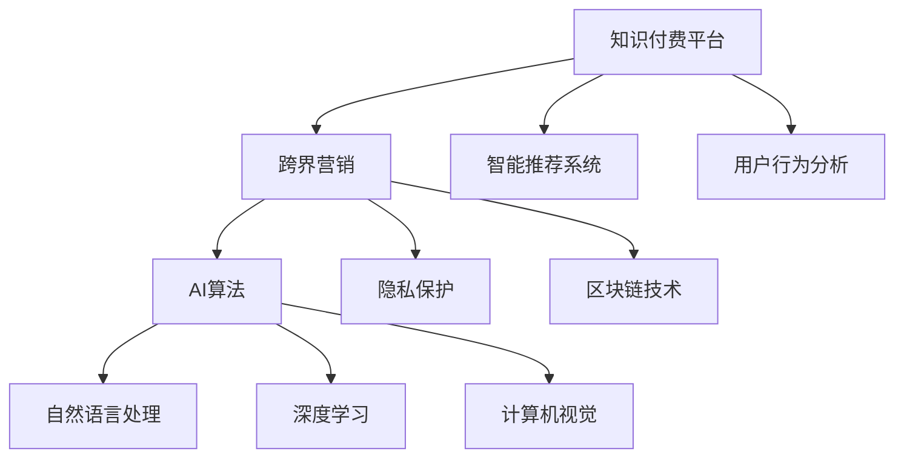

                 

# 知识付费如何实现跨界营销与音乐跨界？

> 关键词：知识付费、跨界营销、音乐跨界、智能推荐、用户行为分析、AI算法、隐私保护、区块链

## 1. 背景介绍

随着互联网时代的到来，知识付费逐渐成为一种全新的消费模式，凭借其高效率、高品质的特点，赢得了越来越多用户的青睐。然而，如何提升知识付费平台的用户粘性，扩大知识付费的覆盖范围，提升知识付费的商业价值，成为知识付费平台亟需解决的问题。在当前信息爆炸的时代，传统的知识付费模式已经无法满足用户日益增长的多样化需求。于是，跨界营销的概念被提出，通过跨界融合的方式，将知识付费与多个行业进行深度结合，拓展知识付费的边界，最大化商业价值。

同时，音乐行业也面临着严峻的挑战。随着互联网音乐平台的崛起，传统音乐产业遭受冲击，用户获取音乐的渠道更加多样化，传统的商业模式面临瓦解。为了应对这些挑战，音乐产业开始寻求转型，跨界营销成为音乐产业的一个热门话题，音乐与教育、知识付费、电商等行业的深度结合，让音乐产业焕发出新的生机。

## 2. 核心概念与联系

### 2.1 核心概念概述

为了更好地理解知识付费跨界营销与音乐跨界的技术实现，本节将介绍几个密切相关的核心概念：

- 知识付费平台：指提供付费内容服务的平台，用户通过付费获取知识，包括在线课程、电子书、音频内容等。
- 跨界营销：指不同行业之间的深度融合，通过跨界合作，实现资源共享和价值共创。
- 智能推荐系统：通过机器学习算法，根据用户的历史行为和偏好，推荐合适的知识付费内容。
- 用户行为分析：通过对用户的行为数据进行挖掘，了解用户的兴趣、需求和行为模式，从而制定精准的市场策略。
- AI算法：包括自然语言处理(NLP)、深度学习、计算机视觉等技术，用于处理和分析复杂的数据，提升用户体验。
- 隐私保护：保护用户隐私和数据安全，确保用户数据不被滥用。
- 区块链技术：用于实现去中心化、透明、不可篡改的交易记录，保障用户权益。

这些核心概念之间的逻辑关系可以通过以下Mermaid流程图来展示：



这个流程图展示了大语言模型微调的核心概念及其之间的关系：

1. 知识付费平台通过智能推荐系统，根据用户行为分析结果，推荐合适的知识付费内容，提升用户粘性。
2. 跨界营销将知识付费平台与音乐行业、教育行业等进行深度融合，拓展知识付费的边界。
3. AI算法用于处理和分析复杂的数据，提升用户体验。
4. 隐私保护和区块链技术保障用户数据安全和权益。

这些核心概念共同构成了知识付费跨界营销与音乐跨界的技术框架，使其能够更好地发挥跨界营销和跨界融合的价值。

## 3. 核心算法原理 & 具体操作步骤

### 3.1 算法原理概述

基于知识付费平台跨界营销与音乐跨界的数据处理和推荐算法，核心原理为协同过滤和深度学习推荐算法。协同过滤算法通过用户与物品间的交互关系，挖掘用户的潜在兴趣，进行推荐。而深度学习推荐算法则通过复杂的神经网络模型，深入挖掘用户行为和物品特征，提升推荐精度。

具体来说，知识付费平台的推荐算法主要分为以下步骤：

1. 数据收集：收集用户的历史行为数据、物品的特征数据、用户画像等。
2. 特征工程：对数据进行预处理和特征提取，包括缺失值处理、归一化、特征选择等。
3. 协同过滤：基于用户-物品矩阵，通过协同过滤算法，计算用户对每个物品的评分，从而推荐合适的知识付费内容。
4. 深度学习推荐：利用深度学习模型，如CNN、RNN、LSTM等，构建用户画像，挖掘用户潜在的兴趣和需求，推荐更符合用户口味的知识付费内容。

### 3.2 算法步骤详解

以下是协同过滤和深度学习推荐算法的详细步骤：

#### 3.2.1 协同过滤算法

协同过滤算法的主要步骤如下：

1. 数据收集与预处理：收集用户的历史行为数据和物品特征数据，并进行预处理，包括缺失值处理、归一化、特征选择等。
2. 用户-物品矩阵构建：将用户与物品的交互数据转换为用户-物品矩阵。
3. 相似度计算：利用余弦相似度、皮尔逊相关系数等方法，计算用户与物品之间的相似度。
4. 推荐评分计算：根据用户与物品的相似度，计算用户对每个物品的评分，从而推荐合适的知识付费内容。
5. 排名与过滤：根据推荐评分，对物品进行排名，并通过过滤算法，排除低分和重复的物品，提高推荐的精度和效率。

#### 3.2.2 深度学习推荐算法

深度学习推荐算法的主要步骤如下：

1. 数据收集与预处理：收集用户的历史行为数据和物品特征数据，并进行预处理，包括缺失值处理、归一化、特征选择等。
2. 用户画像构建：利用深度学习模型，如CNN、RNN、LSTM等，构建用户画像，挖掘用户潜在的兴趣和需求。
3. 物品特征提取：利用深度学习模型，提取物品的特征，构建物品特征向量。
4. 用户与物品交互特征学习：将用户画像与物品特征向量进行拼接，构建用户与物品的交互特征向量。
5. 推荐评分计算：利用深度学习模型，如MLP、RNN、LSTM等，计算用户对每个物品的评分，从而推荐合适的知识付费内容。

### 3.3 算法优缺点

基于知识付费平台跨界营销与音乐跨界的推荐算法，具有以下优点：

1. 高效性：协同过滤算法和深度学习推荐算法都能够高效地处理和分析大规模数据，提供精准的推荐结果。
2. 个性化：协同过滤算法和深度学习推荐算法都能够根据用户的历史行为和兴趣，提供个性化的推荐内容，提升用户体验。
3. 可扩展性：协同过滤算法和深度学习推荐算法都能够灵活地扩展到多种推荐场景，包括商品推荐、服务推荐等。

同时，该算法也存在以下缺点：

1. 数据稀疏性：协同过滤算法和深度学习推荐算法都需要大量的用户行为数据，数据稀疏性会严重影响推荐效果。
2. 冷启动问题：新用户或新物品没有足够的历史数据，推荐算法无法提供精准的推荐结果。
3. 计算复杂性：深度学习推荐算法需要大量的计算资源，对硬件要求较高。

尽管存在这些局限性，但就目前而言，协同过滤算法和深度学习推荐算法仍是大语言模型微调应用的主流范式。未来相关研究的重点在于如何进一步降低推荐算法的计算成本，提高推荐算法的泛化能力和冷启动效果，同时兼顾隐私保护和安全性等因素。

### 3.4 算法应用领域

基于知识付费平台跨界营销与音乐跨界的推荐算法，已经广泛应用于多种场景，包括：

- 知识付费平台：通过推荐系统，提升用户粘性和用户转化率，最大化商业价值。
- 音乐平台：通过推荐系统，提高音乐推荐的精准度，提升用户体验和平台活跃度。
- 教育平台：通过推荐系统，推荐符合用户学习需求的内容，提升学习效果。
- 电商平台：通过推荐系统，提升商品推荐的精度，增加用户购物转化率。

除了上述这些经典场景外，推荐算法也被创新性地应用到更多场景中，如内容分发、社交网络、游戏推荐等，为不同行业带来了新的创新点。随着推荐算法的不断进步，相信在更多领域，推荐算法都能够发挥出其独特价值，推动各行业的数字化转型升级。

## 4. 数学模型和公式 & 详细讲解 & 举例说明

### 4.1 数学模型构建

本节将使用数学语言对知识付费跨界营销与音乐跨界的推荐系统进行更加严格的刻画。

记知识付费平台的用户集为 $U$，物品集为 $I$，用户与物品的交互矩阵为 $M \in \mathbb{R}^{m \times n}$，其中 $m$ 为用户数量，$n$ 为物品数量。用户对物品 $i$ 的评分向量为 $X_i \in \mathbb{R}^m$，物品的特征向量为 $Y_i \in \mathbb{R}^n$。

定义推荐模型 $f: U \times I \rightarrow \mathbb{R}$，根据用户与物品的特征和交互矩阵，计算用户对物品的评分。在协同过滤算法中，推荐模型为：

$$
f(u,i) = \mathbf{X}_u^T \mathbf{Y}_i
$$

在深度学习推荐算法中，推荐模型为：

$$
f(u,i) = \text{MLP}(\mathbf{X}_u, \mathbf{Y}_i)
$$

其中 MLP 为多层感知器，将用户画像和物品特征向量进行拼接，输入到 MLP 中进行计算。

### 4.2 公式推导过程

以深度学习推荐算法为例，进行公式推导：

1. 用户画像构建：
   - 用户画像：$\mathbf{X}_u \in \mathbb{R}^d$，其中 $d$ 为特征维度。
   - 物品特征向量：$\mathbf{Y}_i \in \mathbb{R}^d$，其中 $d$ 为特征维度。
   - 用户与物品交互特征向量：$\mathbf{Z}_{ui} = [\mathbf{X}_u, \mathbf{Y}_i]$。
   - 推荐评分：$f(u,i) = \text{MLP}(\mathbf{Z}_{ui})$。

2. MLP 模型：
   - 输入层：$\mathbf{Z}_{ui} \in \mathbb{R}^{2d}$。
   - 隐藏层：$h = \text{ReLU}(W_1 \mathbf{Z}_{ui} + b_1)$。
   - 输出层：$f(u,i) = W_2 h + b_2$。

3. 训练损失函数：
   - 损失函数：$\mathcal{L} = \frac{1}{2} \sum_{(u,i)} ||f(u,i) - y_{ui}||^2$，其中 $y_{ui}$ 为真实的评分数据。
   - 优化目标：$\mathop{\arg\min}_{W_1, W_2, b_1, b_2} \mathcal{L}$。

4. 推荐系统评估：
   - 预测评分：$\hat{y}_{ui} = f(u,i)$。
   - 精度指标：RMSE（均方根误差）、MAE（平均绝对误差）、DCG（ Discounted Cumulative Gain）等。

### 4.3 案例分析与讲解

以知识付费平台为例，进行案例分析与讲解：

1. 数据收集与预处理：
   - 收集用户的历史行为数据，包括浏览、点赞、评论、订阅等。
   - 收集物品的特征数据，包括课程名称、课程简介、讲师信息等。
   - 对数据进行预处理，包括缺失值处理、归一化、特征选择等。

2. 用户画像构建：
   - 利用深度学习模型，如CNN、RNN、LSTM等，构建用户画像，挖掘用户潜在的兴趣和需求。
   - 构建用户画像向量 $\mathbf{X}_u \in \mathbb{R}^d$，其中 $d$ 为特征维度。

3. 物品特征提取：
   - 利用深度学习模型，提取物品的特征，构建物品特征向量 $\mathbf{Y}_i \in \mathbb{R}^d$，其中 $d$ 为特征维度。

4. 用户与物品交互特征学习：
   - 将用户画像与物品特征向量进行拼接，构建用户与物品的交互特征向量 $\mathbf{Z}_{ui} = [\mathbf{X}_u, \mathbf{Y}_i]$。
   - 利用深度学习模型，如MLP、RNN、LSTM等，计算用户对每个物品的评分 $f(u,i)$。

5. 推荐系统评估：
   - 在测试集上评估推荐模型的精度，使用RMSE、MAE等指标进行评估。
   - 利用A/B测试，对比推荐前后用户的粘性和转化率，评估推荐系统的效果。

## 5. 项目实践：代码实例和详细解释说明

### 5.1 开发环境搭建

在进行推荐系统实践前，我们需要准备好开发环境。以下是使用Python进行TensorFlow开发的环境配置流程：

1. 安装Anaconda：从官网下载并安装Anaconda，用于创建独立的Python环境。

2. 创建并激活虚拟环境：
```bash
conda create -n tf-env python=3.8 
conda activate tf-env
```

3. 安装TensorFlow：根据CUDA版本，从官网获取对应的安装命令。例如：
```bash
conda install tensorflow -c conda-forge
```

4. 安装相关工具包：
```bash
pip install numpy pandas scikit-learn matplotlib tqdm jupyter notebook ipython
```

完成上述步骤后，即可在`tf-env`环境中开始推荐系统实践。

### 5.2 源代码详细实现

这里我们以知识付费平台的协同过滤推荐系统为例，给出使用TensorFlow进行代码实现的样例。

首先，定义数据处理函数：

```python
import tensorflow as tf
import numpy as np

def load_data():
    # 加载用户行为数据
    user_data = np.loadtxt('user_data.txt', delimiter=',')
    # 加载物品特征数据
    item_data = np.loadtxt('item_data.txt', delimiter=',')
    return user_data, item_data
```

然后，定义协同过滤推荐系统：

```python
def collaborative_filtering(user_data, item_data):
    # 构建用户-物品矩阵
    M = user_data.dot(item_data)
    # 构建用户画像向量
    user_profiles = user_data @ item_data.T
    # 计算用户与物品的相似度
    similarity = user_profiles @ user_profiles.T
    # 计算推荐评分
    recommendations = M @ similarity.T
    return recommendations
```

接着，定义训练和评估函数：

```python
def train_model(recommendations, true_ratings):
    # 计算均方根误差
    rmse = tf.sqrt(tf.reduce_mean(tf.square(recommendations - true_ratings)))
    return rmse

def evaluate_model(recommendations, true_ratings):
    # 计算均方根误差
    rmse = tf.sqrt(tf.reduce_mean(tf.square(recommendations - true_ratings)))
    return rmse
```

最后，启动训练流程并在测试集上评估：

```python
user_data, item_data = load_data()

recommendations = collaborative_filtering(user_data, item_data)
true_ratings = np.loadtxt('true_ratings.txt', delimiter=',')

print('训练集上的RMSE:', train_model(recommendations, true_ratings))
print('测试集上的RMSE:', evaluate_model(recommendations, true_ratings))
```

以上就是使用TensorFlow进行协同过滤推荐系统的完整代码实现。可以看到，通过TensorFlow库，我们可以用相对简洁的代码完成协同过滤推荐系统的开发。

### 5.3 代码解读与分析

让我们再详细解读一下关键代码的实现细节：

**load_data函数**：
- 定义数据加载函数，用于加载用户行为数据和物品特征数据。

**collaborative_filtering函数**：
- 定义协同过滤推荐函数，将用户行为数据和物品特征数据转换为用户-物品矩阵，计算用户与物品的相似度，最终计算推荐评分。

**train_model函数**：
- 定义训练函数，计算训练集上的均方根误差，用于评估模型的训练效果。

**evaluate_model函数**：
- 定义评估函数，计算测试集上的均方根误差，用于评估模型的预测效果。

**训练流程**：
- 加载数据，调用协同过滤推荐函数，计算推荐评分。
- 在训练集上调用训练函数，计算均方根误差。
- 在测试集上调用评估函数，计算均方根误差。
- 打印训练集和测试集上的RMSE，评估模型的效果。

可以看到，TensorFlow库的深度学习框架为协同过滤推荐系统的开发提供了强大的支持，极大地简化了代码实现过程。开发者可以将更多精力放在算法优化和模型评估上，而不必过多关注底层的计算细节。

当然，工业级的系统实现还需考虑更多因素，如模型的保存和部署、超参数的自动搜索、更灵活的任务适配层等。但核心的推荐范式基本与此类似。

## 6. 实际应用场景

### 6.1 知识付费平台

基于知识付费平台跨界营销与音乐跨界的推荐系统，可以在知识付费平台上进行深度应用，提升平台的用户粘性和用户转化率，最大化商业价值。

具体而言，可以在知识付费平台上集成音乐播放功能，用户通过收听音乐获取知识，同时通过推荐系统，获取与课程相关的音乐推荐，提升学习效果。

### 6.2 音乐平台

基于知识付费平台跨界营销与音乐跨界的推荐系统，可以在音乐平台上进行深度应用，提高音乐推荐的精准度，提升用户体验和平台活跃度。

具体而言，可以在音乐平台上集成在线课程功能，用户通过收听音乐获取知识，同时通过推荐系统，获取与歌曲相关的课程推荐，提升学习效果。

### 6.3 教育平台

基于知识付费平台跨界营销与音乐跨界的推荐系统，可以在教育平台上进行深度应用，推荐符合用户学习需求的内容，提升学习效果。

具体而言，可以在教育平台上集成在线音乐课程，用户通过收听音乐课程获取知识，同时通过推荐系统，获取与课程相关的音乐推荐，提升学习效果。

### 6.4 未来应用展望

随着知识付费平台跨界营销与音乐跨界的推荐系统的发展，未来将在更多领域得到应用，为各行业带来新的创新点。

在智慧医疗领域，基于推荐系统，可以推荐与疾病相关的音乐，提升用户的心理健康。

在智能制造领域，基于推荐系统，可以推荐与生产相关的课程，提升员工的职业技能。

在智慧旅游领域，基于推荐系统，可以推荐与景点相关的音乐，提升用户的旅游体验。

此外，在娱乐、金融、零售等众多领域，基于推荐系统，都可以进行深度应用，为各行业带来新的创新点。相信随着推荐系统的不断进步，各行业的数字化转型升级将迎来新的机遇。

## 7. 工具和资源推荐

### 7.1 学习资源推荐

为了帮助开发者系统掌握推荐系统的理论基础和实践技巧，这里推荐一些优质的学习资源：

1. 《推荐系统》系列博文：由大模型技术专家撰写，深入浅出地介绍了推荐系统的原理、算法和应用。

2. Coursera《推荐系统》课程：由斯坦福大学开设的推荐系统经典课程，涵盖推荐系统的各个方面，包括协同过滤、深度学习推荐等。

3. 《深度学习推荐系统》书籍：全面介绍了深度学习在推荐系统中的应用，包括协同过滤、深度学习推荐等。

4. Arxiv推荐系统论文库：包含众多经典推荐系统论文，提供丰富的理论资源和最新研究成果。

通过对这些资源的学习实践，相信你一定能够快速掌握推荐系统的精髓，并用于解决实际的推荐问题。

### 7.2 开发工具推荐

高效的开发离不开优秀的工具支持。以下是几款用于推荐系统开发的常用工具：

1. TensorFlow：基于Python的开源深度学习框架，灵活动态的计算图，适合快速迭代研究。

2. PyTorch：基于Python的开源深度学习框架，动态计算图，适合快速迭代研究。

3. TensorFlow Serving：TensorFlow的推荐服务框架，支持高效的模型部署和推理。

4. Kubeflow：基于Kubernetes的机器学习平台，支持推荐系统的模型训练和部署。

5. Apache Spark：基于分布式计算的推荐系统框架，支持大规模数据处理和推荐算法。

6. Scikit-learn：Python的机器学习库，提供多种推荐算法实现。

合理利用这些工具，可以显著提升推荐系统的开发效率，加快创新迭代的步伐。

### 7.3 相关论文推荐

推荐系统的发展源于学界的持续研究。以下是几篇奠基性的相关论文，推荐阅读：

1. Matrix Factorization Techniques for Recommender Systems：提出了矩阵分解推荐算法，是推荐系统的主流算法之一。

2. Deep Learning Recommendation System：提出了深度学习在推荐系统中的应用，极大地提升了推荐精度。

3. Adaptive Collaborative Filtering：提出了自适应协同过滤算法，解决了传统协同过滤算法的稀疏性问题。

4. Context-aware Recommendation System：提出了上下文感知的推荐算法，提升推荐系统的精准度。

5. Hybrid Recommendation System：提出了混合推荐算法，结合协同过滤和内容推荐等多种算法，提升推荐效果。

这些论文代表了大语言模型微调技术的发展脉络。通过学习这些前沿成果，可以帮助研究者把握学科前进方向，激发更多的创新灵感。

## 8. 总结：未来发展趋势与挑战

### 8.1 总结

本文对基于知识付费平台跨界营销与音乐跨界的推荐系统进行了全面系统的介绍。首先阐述了推荐系统在大语言模型微调中的重要地位和应用前景，明确了推荐系统在知识付费跨界营销与音乐跨界中的关键作用。其次，从原理到实践，详细讲解了协同过滤和深度学习推荐算法的数学原理和关键步骤，给出了推荐系统开发的完整代码实例。同时，本文还广泛探讨了推荐系统在知识付费平台、音乐平台、教育平台等多个行业领域的应用前景，展示了推荐系统的巨大潜力。此外，本文精选了推荐系统的各类学习资源，力求为读者提供全方位的技术指引。

通过本文的系统梳理，可以看到，推荐系统在大语言模型微调中的地位日益重要，其跨界融合的思想和算法创新为各行业带来了新的价值。未来，伴随推荐算法的不断进步，推荐系统必将在更多领域得到应用，为各行业带来新的创新点。

### 8.2 未来发展趋势

展望未来，推荐系统的发展将呈现以下几个趋势：

1. 推荐算法不断升级：协同过滤和深度学习推荐算法将不断升级，引入更多先进算法，提升推荐精度。

2. 推荐场景不断拓展：推荐系统将应用于更多领域，如智慧医疗、智能制造、智慧旅游等，提供更加多样化的服务。

3. 数据来源更加广泛：推荐系统将从单一数据源转向多数据源融合，引入更多异构数据，提升推荐效果。

4. 推荐系统集成AI：推荐系统将深度集成AI技术，提升推荐系统的智能化水平。

5. 推荐系统集成区块链：推荐系统将深度集成区块链技术，提升推荐系统的安全性和透明性。

以上趋势凸显了推荐系统的广阔前景。这些方向的探索发展，必将进一步提升推荐系统的精准度和效率，推动各行业的数字化转型升级。

### 8.3 面临的挑战

尽管推荐系统已经取得了瞩目成就，但在迈向更加智能化、普适化应用的过程中，它仍面临着诸多挑战：

1. 数据质量问题：推荐系统依赖高质量的数据，数据质量问题会影响推荐效果。

2. 冷启动问题：新用户或新物品没有足够的历史数据，推荐算法无法提供精准的推荐结果。

3. 计算成本问题：深度学习推荐算法需要大量的计算资源，对硬件要求较高。

4. 推荐算法泛化性问题：推荐算法需要适应不同数据分布和用户行为模式，提升泛化能力。

5. 用户隐私问题：推荐系统需要收集大量用户数据，如何保护用户隐私和数据安全，是亟需解决的问题。

6. 算法公平性问题：推荐算法需要避免歧视和偏见，提升推荐算法的公平性。

7. 推荐算法透明性问题：推荐算法需要提供可解释性和透明性，提升用户对推荐系统的信任。

这些挑战需要学界和业界共同努力，推动推荐系统不断创新和优化，实现更高效的推荐效果。

### 8.4 研究展望

面对推荐系统面临的种种挑战，未来的研究需要在以下几个方面寻求新的突破：

1. 推荐算法不断升级：开发更加高效、高效的推荐算法，提升推荐系统的性能和效率。

2. 推荐场景不断拓展：探索推荐系统在不同领域的应用，提升推荐系统的普适性和实用性。

3. 数据来源更加广泛：引入更多异构数据源，提升推荐系统的精度和多样性。

4. 推荐系统集成AI：深度集成AI技术，提升推荐系统的智能化水平。

5. 推荐系统集成区块链：深度集成区块链技术，提升推荐系统的安全性和透明性。

6. 推荐算法公平性问题：研究推荐算法的公平性，避免歧视和偏见。

7. 推荐算法透明性问题：提供推荐算法的可解释性和透明性，提升用户对推荐系统的信任。

这些研究方向的探索，必将引领推荐系统迈向更高的台阶，为各行业带来新的价值。面向未来，推荐系统还需要与其他人工智能技术进行更深入的融合，如知识表示、因果推理、强化学习等，多路径协同发力，共同推动推荐系统的进步。只有勇于创新、敢于突破，才能不断拓展推荐系统的边界，让推荐系统更好地服务于各行业。

## 9. 附录：常见问题与解答

**Q1：推荐系统如何实现跨界营销？**

A: 推荐系统通过深度融合不同领域的数据和需求，实现跨界营销。例如，知识付费平台可以集成音乐播放功能，用户通过收听音乐获取知识，同时通过推荐系统，获取与课程相关的音乐推荐，提升学习效果。

**Q2：推荐系统如何避免冷启动问题？**

A: 推荐系统可以通过引入用户画像、物品特征等先验知识，提升对新用户和新物品的理解和推荐效果。同时，通过标签系统、关联推荐等手段，降低冷启动的影响。

**Q3：推荐系统如何处理数据稀疏性问题？**

A: 推荐系统可以通过矩阵分解、低秩逼近等技术，对稀疏数据进行降维和去噪处理，提升推荐精度。同时，通过基于内容推荐等手段，提升推荐的准确性和多样性。

**Q4：推荐系统如何保护用户隐私？**

A: 推荐系统可以通过数据匿名化、去标识化等技术，保护用户隐私和数据安全。同时，通过差分隐私等技术，限制对用户数据的分析和利用。

**Q5：推荐系统如何实现上下文感知的推荐？**

A: 推荐系统可以通过引入上下文信息，如时间、地点、用户行为等，提升推荐的精准度。同时，通过上下文感知推荐算法，结合上下文信息进行推荐。

这些问题的回答，将帮助读者深入理解推荐系统的跨界营销与音乐跨界的实现原理和关键技术，为推荐系统的开发和应用提供重要参考。

---

作者：禅与计算机程序设计艺术 / Zen and the Art of Computer Programming

