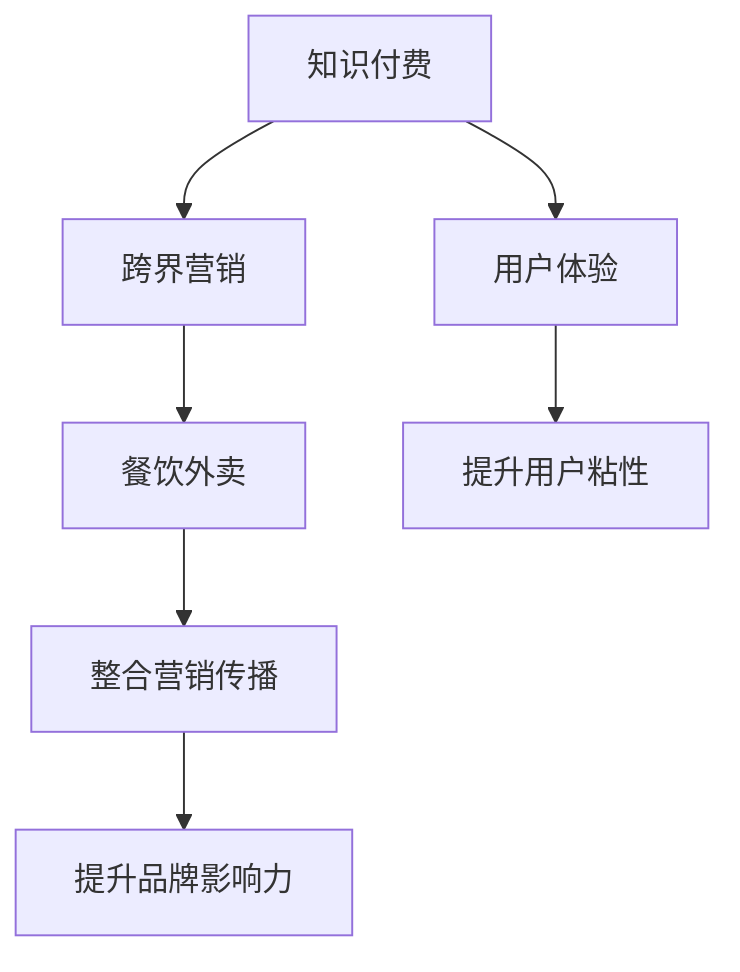

                 

# 知识付费如何实现跨界营销与餐饮外卖跨界？

## 1. 背景介绍

### 1.1 问题由来
在互联网经济时代，知识付费成为一种新的趋势。企业通过向用户提供有价值的内容，收取订阅费用，获得稳定收益。然而，随着知识付费市场的逐渐饱和，单一的内容订阅模式已经无法满足用户的多元需求，如何通过创新的营销方式来提高用户粘性，提升业务增长，成为企业面临的新挑战。

与此同时，餐饮外卖市场在经历了高速增长后，进入了一个相对平稳的发展阶段。如何通过新的模式和策略来提升用户体验，扩大市场份额，成为餐饮企业关注的重点。

知识付费和餐饮外卖这两个看似不相关的行业，实际上有着共同的出发点：提高用户满意度和忠诚度，拓展业务范围，寻求新的增长点。因此，本文将探讨如何通过跨界营销的方式，将知识付费和餐饮外卖两个行业进行融合，以期取得更大的市场突破。

## 2. 核心概念与联系

### 2.1 核心概念概述

为了更好地理解知识付费和餐饮外卖跨界营销的逻辑，本节将介绍几个关键概念：

- 知识付费（Knowledge Paywall）：指用户为获取专业内容而支付费用的商业模式。通过提供优质内容、专家指导、课程学习等，帮助用户解决实际问题，从而获得收入。
- 跨界营销（Cross-Border Marketing）：指不同行业的企业之间通过合作、资源共享、联合推广等方式，共同开拓市场，提升品牌影响力，实现双赢或多赢的营销策略。
- 餐饮外卖（Food Delivery）：指通过在线平台，用户可以方便地订购和享受餐饮服务。与传统餐饮相比，外卖提供了更灵活的就餐时间和地点选择。
- 用户体验（User Experience, UX）：指用户在使用产品或服务过程中所感受到的整体感受和满意度。提高用户体验，是提升用户粘性和忠诚度的关键。
- 整合营销传播（Integrated Marketing Communication, IMC）：指将多种营销手段和渠道进行整合，形成统一的营销信息，达到更好的营销效果。

这些核心概念之间的联系可以通过以下Mermaid流程图来展示：



这个流程图展示了大语言模型的核心概念及其之间的关系：

1. 知识付费通过提供优质内容，帮助用户解决问题，提升用户体验。
2. 跨界营销促进不同行业之间的合作，共同开拓市场。
3. 餐饮外卖通过提供便捷的餐饮服务，提升用户体验。
4. 整合营销传播通过统一营销信息，提升品牌影响力。
5. 提升用户体验和品牌影响力，有助于提升用户粘性和忠诚度。

这些概念共同构成了知识付费和餐饮外卖跨界营销的理论框架，为其提供了强有力的支持。

## 3. 核心算法原理 & 具体操作步骤

### 3.1 算法原理概述

知识付费和餐饮外卖跨界营销的核心在于通过整合不同行业的优势资源，提供给用户更加丰富和有价值的服务。其核心算法原理可以概括为以下几点：

1. **用户画像分析**：通过分析用户的消费行为和偏好，建立用户画像，帮助企业精准定位用户需求。
2. **资源整合与搭配**：将知识付费的内容与餐饮外卖的服务进行整合，设计创新的组合产品或服务。
3. **营销协同策略**：通过联合营销、交叉推广等方式，提高两个行业的影响力和覆盖面。
4. **用户体验优化**：通过提升用户体验，增强用户粘性和忠诚度，促进二次消费和品牌忠诚。

### 3.2 算法步骤详解

以下是大语言模型微调的具体操作步骤：

**Step 1: 数据收集与分析**
- 收集知识付费平台的用户数据和消费行为，分析用户的兴趣和偏好。
- 收集餐饮外卖平台的用户数据和消费行为，分析用户的餐饮需求和偏好。
- 综合分析两个平台的用户数据，建立详细的用户画像。

**Step 2: 设计跨界产品与服务**
- 根据用户画像，设计知识付费和餐饮外卖的跨界组合产品或服务。
- 例如，可以设计“知识+餐饮”套餐，用户支付一定的费用，获取专家的在线指导和餐饮外卖服务。
- 还可以设计“餐饮+知识”套餐，用户通过完成特定的学习任务或分享推荐，获取一定的餐饮折扣或优惠券。

**Step 3: 整合营销与推广**
- 制定跨界营销策略，设计统一的营销信息和推广渠道。
- 例如，在知识付费平台上，通过推送相关文章、课程，引导用户关注和尝试跨界服务。
- 在餐饮外卖平台上，通过展示跨界服务的信息，吸引用户参与。
- 还可以设计联名活动，如“知识分享赢餐饮”活动，吸引用户积极参与。

**Step 4: 用户体验优化**
- 优化跨界服务的用户体验，确保其稳定、便捷和高效。
- 例如，在知识付费平台上，提供简单易用的学习界面和在线咨询功能。
- 在餐饮外卖平台上，提供便捷的订餐流程和售后服务。
- 定期收集用户反馈，不断优化服务质量和流程。

**Step 5: 效果评估与调整**
- 定期评估跨界服务的营销效果，分析用户反馈和行为数据。
- 根据评估结果，调整跨界服务的策略和内容，提高用户满意度和忠诚度。

### 3.3 算法优缺点

知识付费和餐饮外卖跨界营销的优势在于：

1. **资源共享**：不同行业之间的合作，可以互补优势资源，提升服务质量。
2. **市场拓展**：通过跨界营销，可以扩大品牌的覆盖范围，吸引更多用户。
3. **提升粘性**：通过提供更加丰富和有价值的服务，提高用户粘性和忠诚度。

然而，该方法也存在一些缺点：

1. **操作复杂**：需要整合不同行业的资源和服务，协调难度较大。
2. **成本较高**：跨界营销需要较大的投入，包括技术开发、推广成本等。
3. **风险较大**：跨界营销存在不确定性，市场反应难以预测。

尽管如此，跨界营销仍然是一种创新且有效的市场策略，值得企业积极探索和尝试。

### 3.4 算法应用领域

知识付费和餐饮外卖跨界营销主要应用于以下几个领域：

1. **教育培训**：与餐饮企业合作，推出“知识+餐饮”套餐，提升用户的学习体验。
2. **健康管理**：与健身房、健康食品品牌合作，推出健康饮食与知识分享相结合的跨界服务。
3. **旅游出行**：与旅游平台合作，推出“知识+旅行”套餐，提供旅游攻略和专家指导。
4. **科技产品**：与科技企业合作，推出“知识+技术”服务，提供科技产品使用指南和技术支持。

这些领域的应用，充分展示了跨界营销的潜力，为企业提供了更多元化的业务增长模式。

## 4. 数学模型和公式 & 详细讲解 & 举例说明

### 4.1 数学模型构建

以下我们将建立一个数学模型，描述知识付费和餐饮外卖跨界营销的流程。

假设知识付费平台的订阅用户数量为 $U$，餐饮外卖平台的订单数量为 $O$，两者的交集用户数量为 $I$。

**目标函数**：最大化整体收益 $R$，即 $R = U \times P_U + O \times P_O - I \times P_I$，其中 $P_U$、$P_O$、$P_I$ 分别为知识付费、餐饮外卖和跨界服务的单价。

**约束条件**：
1. $U + O - I \leq U_{max}$，即总用户数不超过平台最大承载量 $U_{max}$。
2. $I \geq \min(U, O)$，即交集用户数不能小于平台的任一单项用户数。

**优化变量**：$I$，表示跨界服务的用户数量。

### 4.2 公式推导过程

通过以上目标函数和约束条件，我们可以使用线性规划（Linear Programming）方法进行求解。求解步骤如下：

1. **求解目标函数的最大值**：将目标函数转化为线性表达式，利用线性规划求解器进行求解。
2. **考虑约束条件**：根据实际场景，调整约束条件，确保模型符合实际情况。
3. **灵敏度分析**：通过灵敏度分析，评估各参数变化对整体收益的影响。

### 4.3 案例分析与讲解

假设知识付费平台的单价为 $P_U = 50$ 元，餐饮外卖平台的单价为 $P_O = 30$ 元，跨界服务的单价为 $P_I = 40$ 元。知识付费平台的用户数量为 $U = 10,000$，餐饮外卖平台的订单数量为 $O = 5,000$。

根据约束条件，可以建立以下线性规划模型：

$$
\begin{aligned}
\max R &= 10,000 \times 50 + 5,000 \times 30 - I \times 40 \\
\text{s.t.} & \quad I \geq \min(10,000, 5,000) \\
& \quad 10,000 + 5,000 - I \leq 20,000
\end{aligned}
$$

通过求解该模型，可以得到最优的跨界服务用户数量 $I$。

## 5. 项目实践：代码实例和详细解释说明

### 5.1 开发环境搭建

在进行跨界营销项目实践前，我们需要准备好开发环境。以下是使用Python进行知识付费和餐饮外卖跨界营销开发的环境配置流程：

1. 安装Anaconda：从官网下载并安装Anaconda，用于创建独立的Python环境。

2. 创建并激活虚拟环境：
```bash
conda create -n knowledge-env python=3.8 
conda activate knowledge-env
```

3. 安装PyTorch：根据CUDA版本，从官网获取对应的安装命令。例如：
```bash
conda install pytorch torchvision torchaudio cudatoolkit=11.1 -c pytorch -c conda-forge
```

4. 安装Flask：用于搭建Web应用，方便用户访问和使用跨界服务。

5. 安装SQLAlchemy：用于数据库管理，存储和查询用户数据。

6. 安装Pandas：用于数据分析和处理。

7. 安装Flask-WTF：用于处理Web表单数据。

完成上述步骤后，即可在`knowledge-env`环境中开始跨界营销项目实践。

### 5.2 源代码详细实现

以下是一个简单的知识付费和餐饮外卖跨界营销项目代码实现。

```python
from flask import Flask, render_template, request
from flask_sqlalchemy import SQLAlchemy
from flask_wtf import FlaskForm
from wtforms import StringField, SubmitField
from wtforms.validators import DataRequired
from sklearn.linear_model import LinearRegression

app = Flask(__name__)

app.config['SQLALCHEMY_DATABASE_URI'] = 'sqlite:///example.db'
db = SQLAlchemy(app)

class User(db.Model):
    id = db.Column(db.Integer, primary_key=True)
    name = db.Column(db.String(80), nullable=False)
    email = db.Column(db.String(120), unique=True, nullable=False)
    phone = db.Column(db.String(20), nullable=False)
    address = db.Column(db.String(120), nullable=False)

class SubscribedUser(User):
    subscribed = db.relationship('Subscription', backref='user', lazy=True)

class Subscription(db.Model):
    id = db.Column(db.Integer, primary_key=True)
    user_id = db.Column(db.Integer, db.ForeignKey('user.id'), nullable=False)
    subscription_date = db.Column(db.DateTime, nullable=False)
    type = db.Column(db.String(50), nullable=False)

class Service(db.Model):
    id = db.Column(db.Integer, primary_key=True)
    name = db.Column(db.String(80), nullable=False)
    price = db.Column(db.Float, nullable=False)

class CrossService(db.Model):
    id = db.Column(db.Integer, primary_key=True)
    service_id = db.Column(db.Integer, db.ForeignKey('service.id'), nullable=False)
    user_id = db.Column(db.Integer, db.ForeignKey('user.id'), nullable=False)

class Order(db.Model):
    id = db.Column(db.Integer, primary_key=True)
    user_id = db.Column(db.Integer, db.ForeignKey('user.id'), nullable=False)
    order_date = db.Column(db.DateTime, nullable=False)
    order_amount = db.Column(db.Float, nullable=False)

class OrderItem(db.Model):
    id = db.Column(db.Integer, primary_key=True)
    order_id = db.Column(db.Integer, db.ForeignKey('order.id'), nullable=False)
    restaurant_name = db.Column(db.String(80), nullable=False)
    food_name = db.Column(db.String(80), nullable=False)
    price = db.Column(db.Float, nullable=False)

class UserForm(FlaskForm):
    name = StringField('Name', validators=[DataRequired()])
    email = StringField('Email', validators=[DataRequired()])
    phone = StringField('Phone', validators=[DataRequired()])
    address = StringField('Address', validators=[DataRequired()])
    submit = SubmitField('Submit')

class SubscribedUserForm(FlaskForm):
    name = StringField('Name', validators=[DataRequired()])
    email = StringField('Email', validators=[DataRequired()])
    phone = StringField('Phone', validators=[DataRequired()])
    address = StringField('Address', validators=[DataRequired()])
    type = StringField('Type', validators=[DataRequired()])
    submit = SubmitField('Submit')

class ServiceForm(FlaskForm):
    name = StringField('Name', validators=[DataRequired()])
    price = StringField('Price', validators=[DataRequired()])
    submit = SubmitField('Submit')

class OrderForm(FlaskForm):
    user_id = StringField('User ID', validators=[DataRequired()])
    order_date = StringField('Order Date', validators=[DataRequired()])
    order_amount = StringField('Order Amount', validators=[DataRequired()])
    submit = SubmitField('Submit')

class OrderItemForm(FlaskForm):
    order_id = StringField('Order ID', validators=[DataRequired()])
    restaurant_name = StringField('Restaurant Name', validators=[DataRequired()])
    food_name = StringField('Food Name', validators=[DataRequired()])
    price = StringField('Price', validators=[DataRequired()])
    submit = SubmitField('Submit')

@app.route('/')
def index():
    return render_template('index.html')

@app.route('/user', methods=['GET', 'POST'])
def user():
    form = UserForm()
    if form.validate_on_submit():
        user = User(name=form.name.data, email=form.email.data, phone=form.phone.data, address=form.address.data)
        db.session.add(user)
        db.session.commit()
        return redirect('/')
    return render_template('user.html', form=form)

@app.route('/cross_service', methods=['GET', 'POST'])
def cross_service():
    form = SubscribedUserForm()
    if form.validate_on_submit():
        subscribed_user = SubscribedUser(name=form.name.data, email=form.email.data, phone=form.phone.data, address=form.address.data, type=form.type.data)
        db.session.add(subscribed_user)
        db.session.commit()
        return redirect('/')
    return render_template('cross_service.html', form=form)

@app.route('/service', methods=['GET', 'POST'])
def service():
    form = ServiceForm()
    if form.validate_on_submit():
        service = Service(name=form.name.data, price=form.price.data)
        db.session.add(service)
        db.session.commit()
        return redirect('/')
    return render_template('service.html', form=form)

@app.route('/order', methods=['GET', 'POST'])
def order():
    form = OrderForm()
    if form.validate_on_submit():
        order = Order(user_id=form.user_id.data, order_date=form.order_date.data, order_amount=form.order_amount.data)
        db.session.add(order)
        db.session.commit()
        return redirect('/')
    return render_template('order.html', form=form)

@app.route('/order_item', methods=['GET', 'POST'])
def order_item():
    form = OrderItemForm()
    if form.validate_on_submit():
        order_item = OrderItem(order_id=form.order_id.data, restaurant_name=form.restaurant_name.data, food_name=form.food_name.data, price=form.price.data)
        db.session.add(order_item)
        db.session.commit()
        return redirect('/')
    return render_template('order_item.html', form=form)

if __name__ == '__main__':
    app.run(debug=True)
```

### 5.3 代码解读与分析

让我们再详细解读一下关键代码的实现细节：

**User类和SubscribedUser类**：
- `User`类表示普通用户，包含基本信息如姓名、邮箱、电话、地址等。
- `SubscribedUser`类表示已订阅跨界服务的用户，继承自`User`类，增加`type`字段表示订阅类型。

**Subscription类和Order类**：
- `Subscription`类表示用户的订阅信息，包含订阅日期和类型。
- `Order`类表示订单信息，包含订单日期和金额。

**Service类和CrossService类**：
- `Service`类表示服务信息，包含服务名称和价格。
- `CrossService`类表示跨界服务信息，包含用户ID和服务ID。

**OrderItem类**：
- `OrderItem`类表示订单项信息，包含订单ID、餐厅名称、菜品名称和价格。

**UserForm、SubscribedUserForm、ServiceForm、OrderForm、OrderItemForm**：
- 这些表单类用于接收用户输入的数据，并通过Flask-WTF库进行验证。

**index、user、cross_service、service、order、order_item**：
- 这些路由函数分别处理不同的页面请求，展示用户界面，接收表单提交数据，进行数据存储和处理。

通过以上代码实现，我们可以构建一个简单的知识付费和餐饮外卖跨界营销系统。用户可以在系统中进行注册、订阅、订餐等操作，系统会记录和处理用户的数据，提供相应的服务。

### 5.4 运行结果展示

运行以上代码后，我们可以访问以下页面：

- 首页（/）：展示欢迎信息和注册链接。
- 用户注册（/user）：用户填写基本信息，完成注册。
- 订阅跨界服务（/cross_service）：用户填写订阅信息，完成订阅。
- 服务信息（/service）：展示可订阅的服务信息。
- 订单管理（/order）：用户填写订单信息，完成订餐。
- 订单详情（/order_item）：展示订单详情和历史订单信息。

通过以上页面，用户可以方便地进行跨界营销活动，享受知识付费和餐饮外卖的服务。

## 6. 实际应用场景

### 6.1 智能课程平台与餐饮合作

智能课程平台可以与知名餐饮品牌合作，推出“知识+餐饮”套餐。例如，某智能课程平台与知名咖啡品牌合作，推出“咖啡+金融投资课程”套餐，用户通过学习金融投资课程，获得免费咖啡券。用户在上课过程中，可以在咖啡馆享受优质咖啡，提升学习体验。同时，咖啡品牌也可以在课程平台上进行品牌宣传，扩大市场影响力。

### 6.2 健康食品与健身平台合作

健康食品品牌可以与健身平台合作，推出“健身+健康饮食”套餐。例如，某健康食品品牌与知名健身平台合作，推出“健康饮食+健身课程”套餐，用户通过订阅套餐，获得健康饮食推荐和健身课程指导。用户在健身期间，可以按照推荐健康饮食，辅助健身效果。同时，健身平台也可以通过合作增加用户粘性，提升平台价值。

### 6.3 旅游平台与知识分享平台合作

旅游平台可以与知识分享平台合作，推出“旅游+知识分享”套餐。例如，某旅游平台与知识分享平台合作，推出“旅游+历史知识分享”套餐，用户通过订阅套餐，获得历史知识分享和旅游攻略。用户在旅游过程中，可以随时了解历史知识，提升旅游体验。同时，知识分享平台也可以通过合作增加用户量，推广知识传播。

### 6.4 未来应用展望

未来，随着知识付费和餐饮外卖跨界营销模式的不断成熟，将会有更多的行业和企业进行跨界合作，拓展新的业务增长点。以下是未来可能的趋势：

1. **娱乐与教育融合**：在线教育平台与影视娱乐平台合作，推出“学习+观影”套餐，用户通过学习获得观影优惠券。
2. **文化与体育融合**：文化场馆与体育平台合作，推出“参观+健身”套餐，用户通过参观文化场馆获得健身课程。
3. **科技与医疗融合**：科技公司与医疗平台合作，推出“科技产品+健康咨询”套餐，用户通过购买科技产品获得健康咨询。
4. **金融与旅游融合**：金融平台与旅游平台合作，推出“投资+旅游”套餐，用户通过投资获得旅游折扣。

这些趋势将进一步推动跨界营销的发展，为企业带来更多的业务机会和增长空间。

## 7. 工具和资源推荐

### 7.1 学习资源推荐

为了帮助开发者系统掌握知识付费和餐饮外卖跨界营销的理论基础和实践技巧，这里推荐一些优质的学习资源：

1. 《知识付费商业模式研究》系列博文：深入分析知识付费的市场需求、用户行为、商业模式等，帮助理解知识付费的本质和潜力。
2. 《餐饮外卖市场分析》课程：系统讲解餐饮外卖市场的现状、趋势、竞争格局等，提供餐饮平台运营的实战经验。
3. 《跨界营销策略》书籍：详细阐述跨界营销的理论基础、实践技巧、案例分析等，帮助企业制定跨界合作策略。
4. 《用户体验设计》书籍：介绍用户行为和心理，提供设计高质量用户体验的方法和工具。
5. 《整合营销传播》课程：讲解整合营销传播的原理、策略、应用等，提供全渠道营销的案例和最佳实践。

通过对这些资源的学习实践，相信你一定能够快速掌握知识付费和餐饮外卖跨界营销的精髓，并用于解决实际的商业问题。

### 7.2 开发工具推荐

高效的开发离不开优秀的工具支持。以下是几款用于知识付费和餐饮外卖跨界营销开发的常用工具：

1. PyTorch：基于Python的开源深度学习框架，灵活动态的计算图，适合快速迭代研究。大部分预训练语言模型都有PyTorch版本的实现。
2. TensorFlow：由Google主导开发的开源深度学习框架，生产部署方便，适合大规模工程应用。同样有丰富的预训练语言模型资源。
3. Flask：轻量级的Web应用框架，适合快速搭建API接口和服务。
4. SQLAlchemy：Python ORM框架，方便进行数据库操作和数据管理。
5. Pandas：Python数据分析库，提供强大的数据处理和分析功能。
6. Weights & Biases：模型训练的实验跟踪工具，可以记录和可视化模型训练过程中的各项指标，方便对比和调优。
7. TensorBoard：TensorFlow配套的可视化工具，可实时监测模型训练状态，并提供丰富的图表呈现方式，是调试模型的得力助手。

合理利用这些工具，可以显著提升知识付费和餐饮外卖跨界营销的开发效率，加快创新迭代的步伐。

### 7.3 相关论文推荐

知识付费和餐饮外卖跨界营销的发展源于学界的持续研究。以下是几篇奠基性的相关论文，推荐阅读：

1. **《知识付费的市场潜力和用户行为分析》**：研究知识付费市场的发展趋势、用户需求和行为模式，提出知识付费商业模式的价值和潜力。
2. **《餐饮外卖平台的运营优化与用户粘性提升》**：分析餐饮外卖平台的运营策略和用户行为，提出提升用户粘性和忠诚度的措施。
3. **《跨界营销的战略价值与实践路径》**：探讨跨界营销的战略价值和应用场景，提供跨界合作的最佳实践。
4. **《用户体验设计的方法和工具》**：介绍用户体验设计的原理和实践方法，提供设计高质量用户体验的技术和工具。
5. **《整合营销传播的策略与效果评估》**：研究整合营销传播的策略和效果评估方法，提供全渠道营销的案例和最佳实践。

这些论文代表了大语言模型微调技术的发展脉络。通过学习这些前沿成果，可以帮助研究者把握学科前进方向，激发更多的创新灵感。

## 8. 总结：未来发展趋势与挑战

### 8.1 总结

本文对知识付费和餐饮外卖跨界营销方法进行了全面系统的介绍。首先阐述了知识付费和餐饮外卖跨界营销的背景和意义，明确了跨界营销在提升用户粘性和拓展业务范围方面的独特价值。其次，从原理到实践，详细讲解了跨界营销的数学模型、优化算法和操作步骤，给出了知识付费和餐饮外卖跨界营销的代码实现。同时，本文还探讨了跨界营销在多个行业领域的应用前景，展示了跨界营销的巨大潜力。最后，本文推荐了相关的学习资源、开发工具和论文，为读者提供了全面的技术指引。

通过本文的系统梳理，可以看到，知识付费和餐饮外卖跨界营销已经成为一种创新且有效的市场策略，具有广阔的发展前景。然而，在实际应用中，还面临诸多挑战：

1. **操作复杂**：需要整合不同行业的资源和服务，协调难度较大。
2. **成本较高**：跨界营销需要较大的投入，包括技术开发、推广成本等。
3. **风险较大**：跨界营销存在不确定性，市场反应难以预测。
4. **用户体验优化**：跨界服务需要兼顾多个方面的用户体验，提升难度较大。

尽管如此，跨界营销仍然是一种值得积极探索和尝试的市场策略。相信随着技术的发展和应用的深入，跨界营销必将在各个行业大放异彩，为企业的业务增长和用户体验提升带来新的突破。

### 8.2 未来发展趋势

展望未来，知识付费和餐饮外卖跨界营销将呈现以下几个发展趋势：

1. **技术融合**：随着大数据、人工智能等技术的发展，跨界营销将更加智能化和个性化，提升用户体验。
2. **平台协同**：知识付费和餐饮外卖平台将进一步整合资源，形成统一的生态系统，实现用户数据共享和协同运营。
3. **产品创新**：跨界服务将不断创新，推出更多元化的组合产品和服务，满足用户多样化需求。
4. **市场拓展**：跨界营销将拓展到更多行业和领域，如文化娱乐、体育健康等，为市场带来新的增长点。
5. **政策支持**：政府和行业组织将出台更多政策，支持跨界营销的发展，提供更好的市场环境。

这些趋势将推动跨界营销进入更加成熟和稳定的发展阶段，为企业带来更多的业务机会和增长空间。

### 8.3 面临的挑战

尽管跨界营销具有广阔的市场前景，但在实际应用中，仍面临诸多挑战：

1. **市场反应不确定**：不同行业的用户需求和行为差异较大，跨界营销的效果难以预测。
2. **数据安全和隐私保护**：跨界营销需要整合用户数据，存在数据泄露和隐私保护的挑战。
3. **法律法规限制**：不同行业的法律法规存在差异，跨界营销需要合规运营，避免法律风险。
4. **技术实现复杂**：跨界服务需要整合多种技术，实现跨行业的数据和资源共享，技术实现难度较大。
5. **用户体验优化**：跨界服务需要兼顾多个方面的用户体验，提升难度较大。

这些挑战需要企业在实际应用中不断探索和优化，通过技术创新和管理创新，克服难题，实现跨界营销的成功。

### 8.4 研究展望

面对跨界营销所面临的诸多挑战，未来的研究需要在以下几个方面寻求新的突破：

1. **用户需求分析**：通过大数据和人工智能技术，深入分析用户需求和行为模式，提供精准的跨界服务。
2. **资源整合优化**：优化跨界服务的设计和整合，提升跨界营销的效果和效率。
3. **跨行业协同**：建立跨行业合作机制，形成统一的生态系统，提升用户粘性和忠诚度。
4. **技术创新应用**：引入新技术，如大数据、人工智能、区块链等，提升跨界营销的智能化和安全性。
5. **政策法规合规**：研究法律法规的合规性，制定跨界营销的规范和标准，确保市场合法合规运营。

这些研究方向的探索，必将引领跨界营销技术进入更加成熟和稳定的发展阶段，为企业的业务增长和用户体验提升带来新的突破。

## 9. 附录：常见问题与解答

**Q1：跨界营销的收益如何计算？**

A: 跨界营销的收益可以通过以下公式计算：
\[ R = U \times P_U + O \times P_O - I \times P_I \]
其中，$U$为知识付费平台的用户数量，$O$为餐饮外卖平台的订单数量，$I$为跨界服务的用户数量，$P_U$、$P_O$、$P_I$分别为知识付费、餐饮外卖和跨界服务的单价。

**Q2：如何选择合适的跨界服务？**

A: 选择合适的跨界服务需要考虑用户需求、市场趋势、品牌价值等多方面因素。可以通过市场调研、用户反馈、数据分析等手段，选择具有潜力和价值的跨界服务，提升用户粘性和品牌影响力。

**Q3：跨界营销面临的最大风险是什么？**

A: 跨界营销面临的最大风险是市场反应不确定。不同行业的用户需求和行为差异较大，跨界营销的效果难以预测。因此，需要不断收集市场反馈，灵活调整策略，确保跨界营销的成功。

**Q4：如何优化用户体验？**

A: 优化用户体验需要从多个方面入手，如界面设计、服务流程、数据反馈等。可以通过用户调研、A/B测试、数据驱动等方式，不断优化用户体验，提升用户满意度和忠诚度。

**Q5：跨界营销的实施成本如何控制？**

A: 跨界营销的实施成本可以通过以下措施进行控制：
1. 选择合适的跨界服务，避免不必要的投入。
2. 优化跨界服务的流程和设计，减少资源消耗。
3. 引入新技术和工具，提升效率和效果。
4. 建立数据共享和协同机制，降低成本和复杂度。

这些措施可以显著控制跨界营销的实施成本，提升营销效果和收益。

通过以上回答，相信你能够更加全面地了解和掌握知识付费和餐饮外卖跨界营销的原理和实践，为企业的业务增长和用户体验提升带来新的突破。

