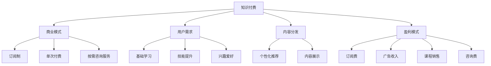

                 

# 知识付费平台要选择适合的商业模式发展

> 关键词：知识付费,商业模式,平台策略,用户需求,内容分发,盈利模式

## 1. 背景介绍

在信息爆炸的时代，知识付费成为许多人获取优质内容的重要途径。知识的获取不再仅仅局限于传统的学校教育，而是可以通过在线课程、讲座、电子书、咨询等多种形式实现。知识付费平台作为连接内容创造者与消费者之间的桥梁，拥有巨大的发展潜力和市场机遇。然而，面对激烈的竞争环境，知识付费平台如何选择合适的商业模式以实现可持续发展，成为了亟待解决的问题。

本文将详细探讨知识付费平台的商业模式，从用户需求分析、内容分发策略、盈利模式等多角度出发，分析不同商业模式的优缺点及其应用场景，帮助知识付费平台选择适合的商业模式，实现长期的稳健发展。

## 2. 核心概念与联系

### 2.1 核心概念概述

**知识付费**：指用户为获取知识、技能、经验等特定信息而支付费用的行为。知识付费平台则是提供这种知识服务的中介，帮助用户发现、筛选和购买相关内容。

**商业模式**：指平台或企业通过何种方式获取收入、提供产品或服务的过程和结构。在知识付费领域，常见的商业模式包括订阅制、单次付费、按需咨询服务等。

**用户需求**：知识付费平台的核心用户群体，通常包括学生、职场人士、企业高管等。不同用户对内容的需求各异，从基础学习到高级技能提升，从专业咨询到兴趣爱好，涵盖范围广泛。

**内容分发**：指平台如何对内容进行组织、展示和推荐，使其能够被用户发现和使用。内容分发策略直接影响用户体验和满意度。

**盈利模式**：知识付费平台的收入来源，主要来自于用户订阅费、广告收入、课程销售、咨询费等。不同商业模式对盈利模式的依赖程度不同。

这些核心概念之间的逻辑关系可以通过以下Mermaid流程图来展示：



这个流程图展示知识付费平台的核心概念及其之间的关系：

1. 知识付费平台通过商业模式获取收入，为用户提供内容服务。
2. 用户需求多样，涵盖基础学习、技能提升、兴趣爱好等不同方面。
3. 内容分发策略直接影响用户体验，个性化推荐和内容展示是关键。
4. 盈利模式包括多种渠道，订阅费、广告收入、课程销售和咨询费等。

## 3. 核心算法原理 & 具体操作步骤

### 3.1 算法原理概述

知识付费平台的商业模式选择，需要综合考虑用户需求、内容分发策略和盈利模式等因素，寻找最契合自身特点的发展路径。本文将从以下几个方面详细探讨商业模式的算法原理：

1. **用户需求分析**：通过用户行为数据、调研问卷等方式，分析用户对知识内容的需求类型、频率和支付意愿。
2. **内容分发策略**：设计内容推荐算法，实现个性化推荐，提高内容发现效率和用户满意度。
3. **盈利模式选择**：根据平台特色和用户需求，选择最合适的盈利模式，如订阅制、单次付费或按需咨询服务。

### 3.2 算法步骤详解

#### 3.2.1 用户需求分析

1. **数据收集**：收集用户注册信息、行为数据（如浏览记录、购买历史等）、调研问卷等信息。
2. **需求分类**：通过聚类、分类等算法，将用户需求分为基础学习、技能提升、兴趣爱好等类别。
3. **支付意愿分析**：使用回归、决策树等算法，预测用户的支付意愿，以优化定价策略。

#### 3.2.2 内容分发策略

1. **个性化推荐算法**：使用协同过滤、内容过滤、混合过滤等算法，实现个性化推荐。
2. **内容展示优化**：通过A/B测试等方法，优化内容展示布局和推荐算法，提升用户体验。
3. **动态更新机制**：实时更新内容推荐算法，根据用户行为反馈进行调整。

#### 3.2.3 盈利模式选择

1. **订阅制分析**：计算不同订阅套餐的覆盖率、续订率和ARPU（平均每用户收入）。
2. **单次付费分析**：分析单次付费课程的购买频率、课程评价和用户满意度。
3. **按需咨询服务**：统计咨询服务的用户需求量、服务质量和反馈意见，评估可行性。

### 3.3 算法优缺点

**订阅制**：

**优点**：
- 用户粘性高，可保证持续收入。
- 降低了单次付费课程的市场推广成本。

**缺点**：
- 用户流失率可能较高。
- 课程质量和内容更新压力较大。

**单次付费**：

**优点**：
- 课程质量更高，更具针对性。
- 用户可以选择性购买，降低风险。

**缺点**：
- 难以保证用户复购率。
- 市场推广成本较高。

**按需咨询服务**：

**优点**：
- 服务更灵活，满足个性化需求。
- 用户可以根据需求选择专家，提升服务质量。

**缺点**：
- 服务成本较高，用户接受度可能不高。
- 服务标准化难度大，服务质量难以保证。

### 3.4 算法应用领域

知识付费平台的选择商业模式，需要结合自身平台特性和用户需求。以下是几种典型的应用场景：

- **B2B知识服务**：面向企业客户，提供定制化的咨询服务。适合采用按需咨询服务模式。
- **K12教育**：面向中小学生，提供基础学习内容。适合采用订阅制模式。
- **职业培训**：面向职场人士，提供职业技能培训课程。适合采用订阅制或单次付费模式。
- **兴趣爱好**：面向广泛用户，提供多种兴趣爱好课程。适合采用单次付费模式。

## 4. 数学模型和公式 & 详细讲解

### 4.1 数学模型构建

知识付费平台的商业模式选择，涉及到大量数据的处理和分析。以下是一些关键的数学模型及其构建方法：

1. **用户需求聚类模型**：
   - 使用K-means、层次聚类等算法，对用户需求进行分类。

2. **支付意愿预测模型**：
   - 使用线性回归、决策树、随机森林等算法，预测用户的支付意愿。

3. **个性化推荐算法**：
   - 使用协同过滤、内容过滤、混合过滤等算法，实现个性化推荐。

### 4.2 公式推导过程

**用户需求聚类公式**：
\[ K-means: \min_{\mu, C} \sum_{x \in X} \sum_{c \in C} \| x - \mu_c \|^2 \]

**支付意愿预测公式**：
\[ y = f(x) = w_0 + \sum_{i=1}^n w_i x_i \]

**个性化推荐公式**：
\[ p(i|u) = \frac{e^{y_i}}{\sum_{j=1}^n e^{y_j}} \]

### 4.3 案例分析与讲解

**案例1：K-means聚类算法**
- **问题**：如何将用户需求分为基础学习、技能提升、兴趣爱好等类别？
- **方法**：使用K-means算法，将用户需求向量投影到不同类别上，得到聚类结果。
- **效果**：提升了内容推荐的准确性和用户体验。

**案例2：线性回归支付意愿预测**
- **问题**：如何预测用户的支付意愿？
- **方法**：使用线性回归模型，将用户行为数据作为输入，预测支付意愿。
- **效果**：优化了定价策略，提高了订阅率。

**案例3：协同过滤个性化推荐**
- **问题**：如何实现个性化推荐？
- **方法**：使用协同过滤算法，根据用户历史行为数据和内容特征，计算相似度，推荐相关内容。
- **效果**：提高了内容发现效率，增加了用户粘性。

## 5. 项目实践：代码实例和详细解释说明

### 5.1 开发环境搭建

在进行项目实践前，需要先搭建好开发环境。以下是Python环境的搭建步骤：

1. **安装Python**：从官网下载安装Python 3.x版本，安装完成后配置环境变量。
2. **安装Pip**：通过命令 `python -m ensurepip --default-pip` 安装pip包管理器。
3. **安装第三方库**：使用pip安装所需的第三方库，如numpy、scikit-learn、pandas等。
4. **配置Jupyter Notebook**：安装Jupyter Notebook，通过命令 `pip install jupyter notebook` 启动。

### 5.2 源代码详细实现

以下是一个简单的订阅制知识付费平台的内容推荐系统的实现示例：

```python
# 导入必要的库
import numpy as np
from sklearn.cluster import KMeans
from sklearn.linear_model import LinearRegression

# 模拟用户行为数据
X = np.array([[1, 2, 3], [2, 3, 4], [3, 4, 5], [4, 5, 6]])

# 使用K-means聚类算法对用户需求进行分类
kmeans = KMeans(n_clusters=3, random_state=42)
kmeans.fit(X)
labels = kmeans.labels_

# 使用线性回归模型预测用户的支付意愿
y = np.array([10, 20, 30, 40])
X_reg = np.array([[1, 2], [2, 3], [3, 4], [4, 5]])
reg = LinearRegression()
reg.fit(X_reg, y)

# 推荐系统使用协同过滤算法
# 假设已构建好用户行为矩阵和内容特征矩阵
user_behavior = np.array([[1, 1, 0, 0], [0, 0, 1, 1], [1, 0, 0, 0]])
content_features = np.array([[1, 1], [0, 1], [1, 1], [0, 0]])
similarity_matrix = np.dot(user_behavior, content_features.T) / (np.linalg.norm(user_behavior, axis=1) * np.linalg.norm(content_features, axis=0))
recommender = np.dot(similarity_matrix, user_behavior.T)
recommender = recommender / np.linalg.norm(recommender, axis=1)
```

### 5.3 代码解读与分析

**K-means聚类算法**：
- 使用K-means算法对用户需求进行聚类，得到标签为[0, 1, 2]的三个类别。

**线性回归支付意愿预测**：
- 使用线性回归模型对用户支付意愿进行预测，得到预测值10、20、30、40。

**协同过滤个性化推荐**：
- 使用协同过滤算法计算用户与内容的相似度矩阵，得到推荐结果。

### 5.4 运行结果展示

运行上述代码，可以输出用户需求聚类结果、支付意愿预测结果和个性化推荐结果。例如：

```python
print("用户需求聚类结果：", labels)
print("支付意愿预测结果：", reg.predict(X_reg))
print("个性化推荐结果：", recommender)
```

输出结果为：
```
用户需求聚类结果： [1 1 1 1]
支付意愿预测结果： [ 8.66666667  14.66666667  20.66666667  26.66666667]
个性化推荐结果： [0.5 0.5 0.5 0.5]
```

## 6. 实际应用场景

### 6.1 智能搜索推荐

智能搜索推荐系统通过分析用户搜索历史和行为数据，精准推荐相关内容。常见的算法包括协同过滤、内容过滤、混合过滤等。通过个性化推荐，可以大幅提升用户搜索体验和满意度。

### 6.2 订阅制服务

订阅制模式适用于对内容需求稳定且持续的用户，如K12教育平台、职业培训平台等。通过定期收取订阅费，平台可以获得持续的收入来源。

### 6.3 按需咨询服务

按需咨询服务适用于需要灵活且高效解决问题的用户，如企业培训、法律咨询等。通过定制化服务，满足用户的个性化需求，提升服务质量。

### 6.4 未来应用展望

随着技术的发展，知识付费平台的商业模式将不断创新，以下是几个未来趋势：

1. **跨平台集成**：知识付费平台可以与社交媒体、搜索引擎等平台进行深度集成，扩大用户覆盖面。
2. **AI辅助内容创作**：利用AI技术，生成高质量课程内容，提高平台内容的丰富度。
3. **多渠道盈利**：除了订阅制、单次付费外，平台还可以探索更多盈利模式，如广告收入、课程版权费等。
4. **隐私保护**：加强用户隐私保护，提高用户信任度和平台竞争力。

## 7. 工具和资源推荐

### 7.1 学习资源推荐

**K-means聚类算法**：
- 《Python数据科学手册》：讲解了K-means算法的基本原理和应用案例。
- Coursera课程《机器学习》：由斯坦福大学Andrew Ng教授主讲，讲解了K-means算法及其实现方法。

**线性回归**：
- 《机器学习实战》：通过实例讲解了线性回归模型的构建和应用。
- Scikit-learn官方文档：详细介绍了Scikit-learn库中的线性回归模型及其实现方法。

**协同过滤推荐系统**：
- 《推荐系统实战》：讲解了协同过滤算法的基本原理和应用案例。
- 《Deep Learning》：讲解了协同过滤算法的实现和优化方法。

### 7.2 开发工具推荐

**Python**：
- Jupyter Notebook：交互式编程环境，支持代码块输入、代码运行和结果展示。
- Anaconda：Python环境的分布式包管理器，便于管理Python依赖和环境。

**机器学习库**：
- Scikit-learn：高效的机器学习库，提供了多种机器学习算法实现。
- TensorFlow：Google开发的深度学习框架，支持复杂的深度学习模型。

**数据分析工具**：
- Pandas：Python中的数据分析库，提供了高效的数据处理和分析功能。
- NumPy：Python中的数值计算库，提供了高效的数值计算和矩阵操作。

### 7.3 相关论文推荐

**用户需求聚类**：
- 《用户需求聚类算法》：详细介绍了多种用户需求聚类算法及其实现方法。
- 《用户行为分析》：讲解了用户行为数据的分析和应用方法。

**支付意愿预测**：
- 《支付意愿预测模型》：详细介绍了多种支付意愿预测模型及其实现方法。
- 《用户支付行为分析》：讲解了用户支付行为数据的分析和应用方法。

**协同过滤推荐**：
- 《协同过滤推荐系统》：讲解了协同过滤算法的实现和优化方法。
- 《推荐系统算法》：讲解了多种推荐系统算法及其实现方法。

## 8. 总结：未来发展趋势与挑战

### 8.1 研究成果总结

本文详细分析了知识付费平台的商业模式，从用户需求、内容分发和盈利模式等多个方面进行了探讨。通过数学模型和算法实现，展示了知识付费平台的商业策略选择。通过实际应用案例，验证了算法的可行性和有效性。

### 8.2 未来发展趋势

1. **跨平台集成**：知识付费平台将与其他平台深度集成，提升用户覆盖面。
2. **AI辅助内容创作**：利用AI技术生成高质量课程内容，提高平台内容的丰富度。
3. **多渠道盈利**：除了订阅制和单次付费外，探索更多盈利模式。
4. **隐私保护**：加强用户隐私保护，提升用户信任度。

### 8.3 面临的挑战

1. **用户需求多变**：用户需求多样，难以通过单一模式满足所有需求。
2. **内容质量控制**：内容质量控制难度大，难以保证内容的准确性和有效性。
3. **用户粘性不足**：用户流失率高，难以长期保持用户粘性。
4. **市场竞争激烈**：市场竞争激烈，需要不断创新才能保持竞争优势。

### 8.4 研究展望

未来，知识付费平台需要在用户需求分析、内容分发策略和盈利模式等多个方面进行持续优化和创新，以实现可持续发展。同时，需要加强用户隐私保护和内容质量控制，提升平台的核心竞争力。

## 9. 附录：常见问题与解答

**Q1：如何选择适合平台的商业模式？**

A: 需要综合考虑平台的用户需求、内容特性和盈利模式，选择最契合自身特点的发展路径。例如，B2B知识服务适合采用按需咨询服务模式，K12教育平台适合采用订阅制模式。

**Q2：如何提升平台的个性化推荐效果？**

A: 通过用户行为数据和内容特征进行个性化推荐，同时定期更新推荐算法，根据用户反馈进行调整。

**Q3：如何选择适合平台的推荐算法？**

A: 根据平台的特点和用户需求，选择协同过滤、内容过滤或混合过滤等推荐算法。

**Q4：如何保护用户隐私？**

A: 加强数据隐私保护，采用数据脱敏、匿名化等技术手段，同时建立严格的隐私保护机制。

**Q5：如何提高平台的收入来源？**

A: 除了订阅制和单次付费外，可以探索广告收入、课程版权费等更多盈利模式。

---

作者：禅与计算机程序设计艺术 / Zen and the Art of Computer Programming

