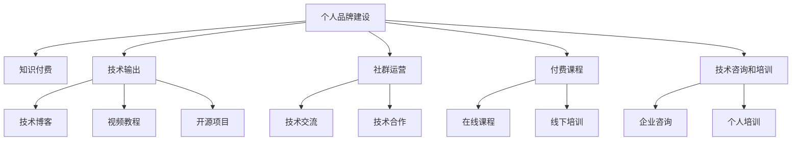

                 

# 知识付费时代程序员的个人品牌塑造

## 1. 背景介绍

### 1.1 问题由来

随着互联网和信息技术的发展，知识付费已逐渐成为全球范围内的潮流。在知识付费时代，程序员的个人品牌塑造成为一项至关重要的任务。无论是从个人发展的角度，还是从职业发展的角度，构建一个强大的个人品牌，都能带来极大的价值和收益。

### 1.2 问题核心关键点

个人品牌的塑造，不仅仅是输出技术知识的展示，更是程序员核心竞争力的体现。在知识付费时代，个人品牌的价值体现在以下几个方面：

1. **专业权威性**：通过持续输出高质量的内容，建立自己在某一技术领域的权威地位。
2. **用户信任度**：通过诚信和专业性，赢得用户的信任，从而带来更多的付费机会。
3. **市场竞争力**：在竞争激烈的市场中，良好的个人品牌可以提升个人和企业的市场竞争力。
4. **职业发展**：优秀的个人品牌可以为程序员提供更多的职业发展机会，包括咨询、讲师、顾问等。
5. **影响力**：通过个人品牌，程序员可以影响更多的行业从业者和潜在客户，推动技术进步。

## 2. 核心概念与联系

### 2.1 核心概念概述

为更好地理解知识付费时代程序员的个人品牌塑造，本节将介绍几个密切相关的核心概念：

- **个人品牌建设**：通过持续输出有价值的内容，建立自己在行业内的知名度和影响力。
- **知识付费**：用户为获取知识和信息而支付费用的行为，体现了知识本身的价值和稀缺性。
- **技术输出**：包括技术博客、视频教程、开源项目等多种形式，是个人品牌建设的基础。
- **社群运营**：通过建立并维护技术社群，促进技术交流和合作，增强个人品牌的影响力。
- **付费课程**：提供有价值的技术培训课程，可以直接获得经济收益。
- **技术咨询和培训**：利用个人品牌吸引企业或个人进行技术咨询和培训，实现商业价值。

这些核心概念之间的逻辑关系可以通过以下Mermaid流程图来展示：



这个流程图展示了这个过程的核心概念及其之间的关系：

1. 个人品牌建设通过技术输出和社群运营得到支持，而付费课程和技术咨询/培训是其商业价值的直接体现。
2. 技术博客、视频教程、开源项目是技术输出的具体形式，对个人品牌建设起到基础作用。
3. 技术交流和技术合作通过社群运营得到加强，反过来也促进了个人品牌建设。

## 3. 核心算法原理 & 具体操作步骤
### 3.1 算法原理概述

个人品牌塑造的核心在于通过技术输出和社群运营，建立和维护用户对个人品牌的信任和认可。这一过程遵循以下算法原理：

1. **持续输出高质量内容**：通过不断发布技术博客、视频教程、开源项目等内容，保持技术输出的一致性和连贯性，建立专业权威性。
2. **社群互动和维护**：积极参与技术社群，与用户进行互动和交流，解答疑问，建立良好的用户关系。
3. **数据分析和反馈**：利用数据分析工具，监控用户行为和反馈，优化内容质量，提升用户满意度。
4. **多样化收入来源**：通过知识付费、付费课程、技术咨询等方式，实现多元化收入。

### 3.2 算法步骤详解

基于以上原理，个人品牌塑造可以分解为以下几个关键步骤：

**Step 1: 确定个人品牌定位**
- 明确自己的技术专长和兴趣方向。
- 确定目标受众，如技术爱好者、企业客户等。
- 制定品牌宣传策略，如博客、视频、社交媒体等。

**Step 2: 构建技术输出平台**
- 选择合适的技术输出形式，如博客、视频、GitHub等。
- 定期发布内容，保持更新频率。
- 建立内容分类和目录，方便用户查找。

**Step 3: 积极参与社群互动**
- 加入相关技术社群，如技术论坛、技术讨论群等。
- 参与技术讨论和问题解答，建立专业形象。
- 举办技术分享会或技术讲座，提升品牌影响力。

**Step 4: 数据分析与优化**
- 使用分析工具（如Google Analytics、社交媒体分析工具等）监控用户行为。
- 分析用户反馈，优化内容质量。
- 调整输出策略，提高用户参与度和满意度。

**Step 5: 多元化收入来源**
- 开设付费课程或提供在线技术培训。
- 提供技术咨询或为企业提供技术解决方案。
- 与企业合作推广产品，扩大品牌影响。

### 3.3 算法优缺点

个人品牌塑造的方法具有以下优点：
1. 提升个人知名度和影响力，带来更多的职业机会和商业合作。
2. 建立专业权威性，提升在行业内的地位。
3. 通过多元化收入，实现个人经济独立。

同时，该方法也存在一定的局限性：
1. 需要持续投入时间和精力，短期内难以见效。
2. 个人品牌塑造过程可能面临竞争压力，需要持续创新和优化。
3. 需要一定的商业运作能力，尤其是定价和市场推广方面。
4. 受技术和市场的变化影响较大，需要灵活调整策略。

尽管存在这些局限性，但个人品牌塑造仍是程序员提升职业竞争力和实现经济独立的重要途径。

### 3.4 算法应用领域

个人品牌塑造的方法可以广泛应用在以下领域：

- **技术博客**：通过撰写高质量的技术文章，建立专业形象。
- **开源项目**：通过参与开源项目，展示技术实力。
- **视频教程**：通过视频教程，传授技术知识和经验。
- **技术咨询**：为企业提供技术解决方案，实现商业价值。
- **技术讲座和培训**：通过线下和线上技术讲座和培训，提升品牌影响力。

这些领域共同构成了一个完整的个人品牌塑造体系，程序员可以根据自己的兴趣和需求选择适合的输出形式。

## 4. 数学模型和公式 & 详细讲解 & 举例说明

### 4.1 数学模型构建

为了更好地理解个人品牌塑造的过程，我们可以将其抽象为一个数学模型：

假设个人品牌建设的收益函数为 $R$，取决于以下几个因素：
- $C$：技术输出的质量和频率。
- $I$：社群互动的活跃度和影响力。
- $D$：数据分析和反馈的及时性。
- $M$：多元化收入的来源和转化率。

则收益函数可以表示为：
$$
R = f(C, I, D, M)
$$

其中 $f$ 为非线性函数，表示各因素对收益的综合影响。

### 4.2 公式推导过程

为了简化计算，我们假设各因素的影响是独立的，并采用加权和的方式计算收益：
$$
R = \alpha_C \cdot C + \alpha_I \cdot I + \alpha_D \cdot D + \alpha_M \cdot M
$$
其中 $\alpha$ 为权重系数，根据实际情况进行调整。

### 4.3 案例分析与讲解

假设某技术博主每月发布5篇技术文章，活跃于多个技术社群，参与技术讨论和问题解答，开设付费课程并提供了技术咨询，通过数据分析优化内容，其收益为：
$$
R = 5 \cdot C + 3 \cdot I + 2 \cdot D + 0.8 \cdot M
$$

通过调整各因素的权重和具体数值，可以计算出不同策略下的收益变化。例如，如果增加社群互动的活跃度，收益函数可以表示为：
$$
R = 5 \cdot C + 4 \cdot I + 2 \cdot D + 0.8 \cdot M
$$

## 5. 项目实践：代码实例和详细解释说明

### 5.1 开发环境搭建

在进行个人品牌塑造的项目实践前，我们需要准备好开发环境。以下是使用Python进行个人品牌建设的开发环境配置流程：

1. 安装Anaconda：从官网下载并安装Anaconda，用于创建独立的Python环境。

2. 创建并激活虚拟环境：
```bash
conda create -n blog-env python=3.8 
conda activate blog-env
```

3. 安装PyTorch、Flask等工具包：
```bash
conda install pytorch torchvision torchaudio cudatoolkit=11.1 -c pytorch -c conda-forge
pip install Flask
```

4. 安装Markdown、Jupyter Notebook等工具包：
```bash
pip install markdown jupyter notebook ipython
```

完成上述步骤后，即可在`blog-env`环境中开始个人品牌建设的实践。

### 5.2 源代码详细实现

以下是使用Flask框架搭建个人技术博客的代码实现：

```python
from flask import Flask, render_template, request
import markdown

app = Flask(__name__)

@app.route('/')
def index():
    return render_template('index.html')

@app.route('/blog/<path:path>')
def blog(path):
    with open('blog/' + path, 'r') as f:
        content = f.read()
        content = markdown.markdown(content)
    return render_template('blog.html', content=content)

if __name__ == '__main__':
    app.run(debug=True)
```

### 5.3 代码解读与分析

让我们再详细解读一下关键代码的实现细节：

**Flask框架**：
- 通过Flask框架，可以快速搭建Web应用，实现博客的展示和访问。
- 使用`@app.route`装饰器定义路由，将请求映射到相应的处理函数。

**markdown模块**：
- 使用Markdown格式撰写博客文章，便于格式统一和排版美化。
- 在`blog`路由函数中，读取指定路径下的Markdown文件，并转换成HTML格式。

**模板渲染**：
- 使用`render_template`函数，将处理后的内容渲染到HTML模板中，并返回给用户。
- 通过`blog.html`模板，实现博客的展示页面。

这个代码实现是一个简单的个人技术博客框架，但已经可以展示基本的博客展示和访问功能。程序员可以根据自己的需求，进一步扩展和优化这个系统，如添加评论、编辑、搜索等功能。

### 5.4 运行结果展示

启动Flask服务器后，可以在浏览器中访问`http://localhost:5000`，看到个人博客的首页。通过导航链接，可以访问到不同主题的博客文章。

## 6. 实际应用场景

### 6.1 技术博客

技术博客是程序员个人品牌建设的重要组成部分。通过撰写高质量的技术文章，程序员可以展示自己的技术实力，吸引更多的关注和流量。技术博客的应用场景包括：

- **知识分享**：通过博客，分享自己的技术学习和实践经验，帮助他人解决问题。
- **个人品牌宣传**：通过博客，展示自己的专业背景和技能，吸引潜在客户和合作伙伴。
- **商业变现**：通过博客带来流量，开设付费会员、提供付费咨询等方式，实现商业变现。

### 6.2 开源项目

开源项目是程序员展示技术实力的重要平台。通过参与开源项目，程序员可以积累技术经验，提升自己在行业内的知名度。开源项目的应用场景包括：

- **技术合作**：通过参与开源项目，与其他开发者合作，共同推进技术进步。
- **贡献社区**：通过开源项目，贡献代码和文档，提升自己在社区中的影响力。
- **展示技术实力**：通过开源项目，展示自己的技术能力和编程水平，吸引潜在雇主和合作伙伴。

### 6.3 视频教程

视频教程是程序员展示技术知识的有效方式。通过录制视频教程，程序员可以系统地传授知识，帮助他人学习。视频教程的应用场景包括：

- **在线教育**：通过视频教程，提供系统的技术培训，满足不同层次的学习需求。
- **商业变现**：通过视频教程，开设付费课程，实现商业变现。
- **品牌推广**：通过视频教程，提升个人品牌的影响力和知名度。

### 6.4 技术咨询和培训

技术咨询和培训是程序员实现商业价值的重要手段。通过提供技术咨询和培训服务，程序员可以直接获得经济收益。技术咨询和培训的应用场景包括：

- **企业服务**：为公司提供技术解决方案，提升企业的技术实力和竞争力。
- **个人培训**：提供个人技术培训，帮助他人提升技术能力。
- **技术讲座**：通过技术讲座和培训，提升个人品牌的影响力和知名度。

## 7. 工具和资源推荐

### 7.1 学习资源推荐

为了帮助程序员系统掌握个人品牌塑造的理论基础和实践技巧，这里推荐一些优质的学习资源：

1. **《数字时代的个人品牌打造》**：是一本系统介绍个人品牌建设的书，从个人品牌的定位、营销、推广等方面进行讲解。
2. **《Web开发实战》**：是一本涵盖Web开发全栈技术的书籍，适合希望通过Web开发实现个人品牌塑造的程序员。
3. **《Python网络爬虫实战》**：是一本介绍Python网络爬虫技术的书籍，适合希望通过技术输出提升个人品牌的程序员。
4. **《编程之美》**：是一本介绍编程技巧和思想的书籍，适合提升个人编程水平和品牌影响力。
5. **《数据分析实战》**：是一本介绍数据分析技术的书籍，适合希望通过数据分析提升个人品牌价值的程序员。

通过对这些资源的学习实践，相信你一定能够快速掌握个人品牌塑造的精髓，并用于解决实际的职业问题。

### 7.2 开发工具推荐

高效的开发离不开优秀的工具支持。以下是几款用于个人品牌建设开发的常用工具：

1. **Jupyter Notebook**：用于编写和运行Python代码，支持多种编程语言，方便技术输出的实践。
2. **GitHub**：用于托管和管理开源项目，方便技术展示和合作。
3. **Flask**：用于搭建Web应用，实现博客展示和访问。
4. **Markdown**：用于撰写博客文章，方便格式统一和排版美化。
5. **markdown渲染工具**：如Markdown-it、marked等，支持将Markdown文件渲染成HTML页面。

合理利用这些工具，可以显著提升个人品牌建设的开发效率，加快创新迭代的步伐。

### 7.3 相关论文推荐

个人品牌塑造的研究源于学界的持续研究。以下是几篇奠基性的相关论文，推荐阅读：

1. **《数字时代的个人品牌打造》**：探讨了数字时代个人品牌的构建方法和策略，为程序员提供了系统性的指导。
2. **《Web开发实战》**：介绍了Web开发全栈技术，涵盖前端、后端、数据库等多个方面，为技术输出的实践提供了基础。
3. **《编程之美》**：介绍了编程技巧和思想，通过系统学习和实践，提升程序员的编程能力和品牌影响力。
4. **《数据分析实战》**：介绍了数据分析技术和工具，为通过数据分析提升个人品牌价值的程序员提供了指导。

这些论文代表了个体品牌塑造的研究方向，通过学习这些前沿成果，可以帮助程序员把握学科前进方向，激发更多的创新灵感。

## 8. 总结：未来发展趋势与挑战

### 8.1 总结

本文对知识付费时代程序员的个人品牌塑造方法进行了全面系统的介绍。首先阐述了个人品牌建设的重要性，明确了个人品牌建设对于程序员职业发展和商业变现的巨大价值。其次，从原理到实践，详细讲解了个人品牌塑造的数学模型和操作步骤，给出了个人品牌建设的具体代码实现。同时，本文还广泛探讨了个人品牌塑造在技术博客、开源项目、视频教程等多个领域的应用前景，展示了个人品牌塑造的广阔发展空间。

通过本文的系统梳理，可以看到，个人品牌塑造是程序员提升职业竞争力和实现经济独立的重要途径。随着技术的发展和市场的变化，个人品牌塑造的方法也需要不断优化和创新，才能更好地适应未来的需求。

### 8.2 未来发展趋势

展望未来，个人品牌塑造将呈现以下几个发展趋势：

1. **多元化输出**：个人品牌塑造不再局限于技术博客和视频教程，更多地融入多媒体内容，如图片、音频、视频等，增强品牌表现力。
2. **个性化定制**：根据不同目标受众的需求，定制个性化的内容输出策略，提升品牌精准度。
3. **数据驱动**：利用大数据和人工智能技术，优化个人品牌输出的策略和内容，提升用户满意度和参与度。
4. **全球化布局**：通过跨境技术输出，提升个人品牌的全球影响力。
5. **社交媒体整合**：将个人品牌输出与社交媒体平台整合，扩大品牌曝光度和影响力。

这些趋势凸显了个人品牌塑造的未来发展方向，程序员需要不断学习和实践，才能把握未来的机遇。

### 8.3 面临的挑战

尽管个人品牌塑造在程序员职业发展中扮演着重要角色，但在建设过程中，仍然面临诸多挑战：

1. **时间和精力投入**：个人品牌建设需要持续的投入时间和精力，尤其是在初期阶段，容易感到疲惫和迷茫。
2. **市场竞争压力**：在竞争激烈的市场中，如何脱颖而出，保持长期的关注度和参与度，是一个持续的挑战。
3. **内容质量控制**：输出高质量的内容，需要不断学习和实践，提升技术能力和内容创作水平。
4. **品牌定位清晰**：明确自己的品牌定位和目标受众，避免内容输出方向模糊和目标不清。
5. **技术栈选择**：选择适合自己的技术栈和工具，避免技术和工具的不适配影响输出效果。

这些挑战需要程序员在个人品牌建设过程中，不断调整策略和方法，以应对不同的情况和变化。

### 8.4 研究展望

面对个人品牌塑造所面临的挑战，未来的研究需要在以下几个方面寻求新的突破：

1. **个性化推荐系统**：利用推荐算法，根据用户行为和偏好，推荐个性化的技术输出内容，提升用户参与度。
2. **内容智能生成**：利用自然语言生成技术，自动生成高质量的技术文章和视频教程，提高创作效率。
3. **自动化工具**：开发自动化工具，帮助程序员自动化处理博客文章和开源项目，提高工作效率。
4. **智能监控**：利用数据分析和人工智能技术，实时监控和分析用户行为，优化内容输出策略。
5. **品牌推广策略**：研究有效的品牌推广策略，通过社交媒体、SEO等手段，提升个人品牌的曝光度和影响力。

这些研究方向将为个人品牌塑造提供新的思路和工具，帮助程序员在未来的职业发展中，更加高效和系统地进行品牌建设。

## 9. 附录：常见问题与解答

**Q1：如何进行个人品牌定位？**

A: 个人品牌定位需要明确自己的技术专长、兴趣方向和目标受众。具体步骤包括：
1. 确定自己的技术背景和专长，如编程语言、框架、技术栈等。
2. 分析目标受众的需求和偏好，如技术爱好者、企业客户等。
3. 制定品牌宣传策略，如博客、视频、社交媒体等。

**Q2：如何提升个人品牌的影响力？**

A: 提升个人品牌影响力需要多方面的努力：
1. 持续输出高质量的内容，保持技术输出的一致性和连贯性。
2. 积极参与技术社群，与用户进行互动和交流，解答疑问。
3. 利用数据分析工具，监控用户行为和反馈，优化内容质量。
4. 开设付费课程或提供技术咨询，实现多元化收入来源。

**Q3：如何选择技术输出形式？**

A: 选择技术输出形式需要考虑自己的兴趣和目标受众。具体步骤如下：
1. 评估自己的技术水平和兴趣，选择适合的输出形式，如技术博客、开源项目、视频教程等。
2. 分析目标受众的需求和偏好，选择最适合他们的内容形式。
3. 根据自身情况和市场需求，选择最适合的输出平台和工具。

**Q4：如何管理个人品牌的时间投入？**

A: 管理个人品牌的时间投入需要制定合理的时间计划和目标：
1. 制定详细的时间计划，将个人品牌建设任务分解为可执行的小任务。
2. 设定明确的目标和里程碑，定期评估进展和效果。
3. 利用时间管理工具，如Trello、Todoist等，提高时间利用效率。

**Q5：如何应对个人品牌建设的竞争压力？**

A: 应对个人品牌建设的竞争压力需要不断创新和优化：
1. 持续学习和提升技术能力，保持内容输出质量。
2. 调整输出策略和内容形式，满足不同用户的需求。
3. 利用社交媒体和SEO等手段，提升个人品牌的曝光度和影响力。

这些常见问题及解答，可以帮助程序员更好地进行个人品牌建设，实现职业发展和商业变现。

---

作者：禅与计算机程序设计艺术 / Zen and the Art of Computer Programming

