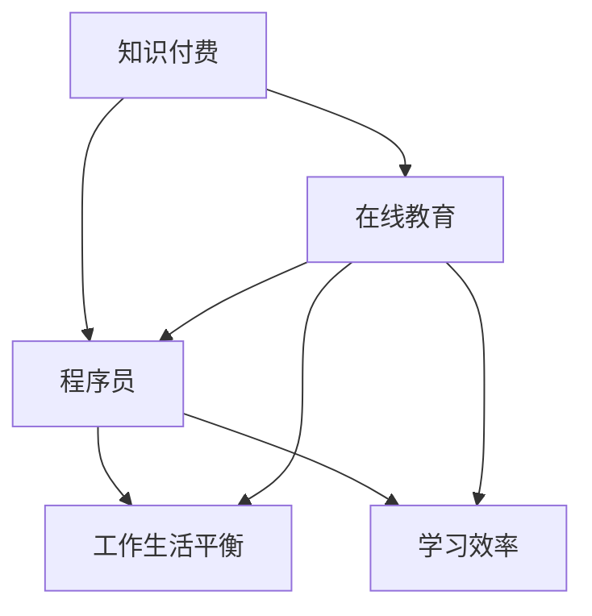

                 

# 知识付费让程序员告别996的生活方式

> 关键词：知识付费, 程序员, 在线教育, 工作生活平衡, 技术学习, 人工智能

## 1. 背景介绍

在数字化飞速发展的时代，程序员作为技术创新的中坚力量，一直承担着高强度的工作负荷。996工作模式（每天9点上班，9点下班，每周工作6天）在许多IT企业中成为了常态。尽管996带来的高产出为公司带来了可观的收益，却也给程序员们的身心健康带来了巨大压力。为了应对这一挑战，知识付费正在成为程序员追求工作生活平衡的新选择。

### 1.1 问题由来

在科技公司竞争激烈的环境中，为了保持市场竞争力，程序员们常常需要面对高强度的工作压力，这包括长时间的编码、测试、部署等。同时，技术的更新迭代速度极快，程序员也需要不断学习新技术以适应变化，以避免被市场淘汰。传统的技术学习渠道如书籍、视频教程、博客等虽然丰富，但存在着学习效率低、时间成本高、信息过载等问题。而知识付费模式的出现，为程序员提供了一种全新的、高效的自我提升方式。

### 1.2 问题核心关键点

知识付费的核心在于利用在线教育平台的资源和专业化服务，为程序员提供更加系统、针对性强的学习内容，帮助他们在有限的时间内掌握关键技术，提升专业能力。以下是知识付费模式在解决程序员问题时涉及的关键点：

- **内容定制化**：根据程序员的具体需求，提供定制化的课程内容，避免了信息过载。
- **高效学习路径**：通过系统的课程设计和专家指导，帮助程序员快速掌握关键技术，缩短学习周期。
- **工作生活平衡**：通过灵活的学习时间安排和高质量的学习资源，帮助程序员实现工作与生活的平衡，摆脱996的困扰。
- **社区支持**：知识付费平台往往具备活跃的社区，程序员可以通过社群互动和交流，解决学习中的问题，积累经验。

## 2. 核心概念与联系

### 2.1 核心概念概述

为更好地理解知识付费模式对程序员生活方式的影响，本节将介绍几个密切相关的核心概念：

- **知识付费**：指通过在线教育平台，用户为获取有价值、专业的学习内容而支付费用的模式。知识付费不仅包括课程购买，还涵盖了咨询、社群服务等多种形式。
- **在线教育**：指利用互联网技术，通过视频、直播、文本等多种形式为学习者提供教学内容的学习模式。在线教育打破了时间和空间的限制，使得学习更加便捷、灵活。
- **程序员**：作为软件开发者，程序员承担着技术创新的核心任务，需要不断学习新技术以保持竞争力。
- **工作生活平衡**：指在工作和生活中找到适当的平衡点，避免过度劳累，保持身心健康。
- **学习效率**：指在有限的时间内掌握知识的能力，取决于学习方法、学习内容、学习环境等多种因素。

这些核心概念之间的逻辑关系可以通过以下Mermaid流程图来展示：



这个流程图展示了几者之间的关系：

1. 知识付费模式为程序员提供了高效的学习内容。
2. 在线教育平台利用灵活的学习形式，帮助程序员在短时间内提升技能。
3. 程序员通过高效学习提升自身竞争力，获得更多的工作机会和更好的薪酬。
4. 高收入和高效学习使得程序员能够更好地实现工作与生活的平衡。

## 3. 核心算法原理 & 具体操作步骤
### 3.1 算法原理概述

知识付费模式下的在线教育平台，通过以下步骤为程序员提供高效的学习资源：

1. **需求分析**：平台通过问卷调查、数据分析等手段，了解程序员的学习需求和痛点。
2. **内容构建**：根据需求分析结果，平台设计并开发针对性的课程内容，包括视频、代码案例、互动练习等多种形式。
3. **师资团队**：平台邀请业内知名专家和高级工程师，形成强大的师资团队，提供高质量的教学内容。
4. **个性化推荐**：利用大数据和机器学习技术，为程序员推荐最适合其学习水平和兴趣的课程。
5. **实时反馈**：通过在线交互和社群讨论，平台及时收集反馈，调整课程内容和教学策略，提升学习效果。

### 3.2 算法步骤详解

以在线教育平台为例，具体的步骤可以分为以下几个环节：

**Step 1: 需求收集与分析**
- 通过问卷调查、数据分析等方式，收集程序员的学习需求和痛点。
- 对数据进行聚类分析，识别出不同用户群体的共性和个性化需求。

**Step 2: 课程内容设计**
- 根据需求分析结果，设计针对性强、层次分明、结构清晰的课程内容。
- 内容应涵盖基础知识、进阶技能、实战案例等多个层面，满足不同阶段程序员的学习需求。

**Step 3: 师资团队建设**
- 邀请业界知名专家和高级工程师，形成强大的师资团队。
- 教师应具备丰富的实战经验，能够提供深入浅出的教学内容。

**Step 4: 内容开发与发布**
- 利用视频、直播、文本等多种形式开发课程内容。
- 对课程内容进行测试和迭代，确保其质量和适用性。

**Step 5: 个性化推荐与互动**
- 利用大数据和机器学习技术，为程序员推荐最适合其学习水平和兴趣的课程。
- 通过在线交互和社群讨论，提供及时的学习反馈和支持。

**Step 6: 学习效果评估与改进**
- 定期收集程序员的学习效果反馈，分析课程和师资团队的表现。
- 根据反馈调整课程内容和教学策略，持续提升学习效果。

### 3.3 算法优缺点

知识付费模式下的在线教育平台具有以下优点：

- **高效性**：通过个性化推荐和实时反馈，显著提升学习效率，缩短学习周期。
- **灵活性**：学员可以根据自己的时间安排灵活学习，不受固定时间表限制。
- **针对性**：根据学员的具体需求提供定制化课程内容，避免信息过载。

但同时也存在一些缺点：

- **高成本**：部分高质量课程价格较高，对部分经济条件有限的程序员来说可能存在一定负担。
- **课程质量参差不齐**：平台上的课程质量参差不齐，学员需要具备一定的辨别能力。
- **互动性不足**：在线教育模式缺乏面对面的互动，可能会影响部分学员的学习效果。

### 3.4 算法应用领域

知识付费模式下的在线教育平台，已经广泛应用于多个领域，尤其是程序员的技术学习：

- **编程语言**：如Python、Java、C++等语言的高级课程，帮助程序员掌握新技术和框架。
- **框架和工具**：如Docker、Kubernetes、TensorFlow等工具的实战课程，提升工作效率和工程能力。
- **项目管理**：如Scrum、Agile等项目管理方法的课程，提高团队协作和项目管理能力。
- **数据科学与人工智能**：如机器学习、深度学习、大数据分析等课程，帮助程序员扩展技术视野和应用能力。

此外，知识付费模式还在教育、医疗、金融等多个领域得到了广泛应用，为知识传播和学习提供了新的可能。

## 4. 数学模型和公式 & 详细讲解 & 举例说明
### 4.1 数学模型构建

在知识付费平台中，数学模型和公式的构建主要涉及学员的学习效果评估和个性化推荐。

设学员的学习效果由其完成课程数、完成时间、作业成绩等多个指标构成。设 $x_1, x_2, ..., x_n$ 为各指标的值，$w_1, w_2, ..., w_n$ 为各指标的权重。则学员的学习效果评分 $E$ 可以表示为：

$$
E = \sum_{i=1}^n w_i x_i
$$

其中，权重 $w_i$ 通过学员的问卷调查或历史学习数据进行计算，以确保评分的客观性和合理性。

### 4.2 公式推导过程

学员的学习效果评分 $E$ 可通过以下步骤计算：

1. 对各学习指标进行标准化处理，转化为0-1之间的数值。
2. 计算每个指标的权重 $w_i$，通过学员历史评分或专家打分来确定。
3. 将标准化后的指标值和权重相乘，求和得到学习效果评分 $E$。

### 4.3 案例分析与讲解

以Python编程语言课程为例，设学员完成课程数 $x_1$，完成时间 $x_2$（以小时为单位），作业成绩 $x_3$（以百分比为单位）。设 $w_1 = 0.3$, $w_2 = 0.4$, $w_3 = 0.3$，则学员的学习效果评分为：

$$
E = 0.3x_1 + 0.4x_2 + 0.3x_3
$$

假设学员A完成了所有课程，共10门，每门课程用时10小时，作业成绩为90%。则其学习效果评分为：

$$
E_A = 0.3 \times 10 + 0.4 \times 10 \times 10 + 0.3 \times 90 = 30 + 40 + 27 = 97
$$

### 5. 项目实践：代码实例和详细解释说明
### 5.1 开发环境搭建

在进行知识付费平台开发前，需要先搭建开发环境。以下是使用Python进行Django开发的环境配置流程：

1. 安装Anaconda：从官网下载并安装Anaconda，用于创建独立的Python环境。

2. 创建并激活虚拟环境：
```bash
conda create -n python-env python=3.8 
conda activate python-env
```

3. 安装Django：从官网获取对应的安装命令。例如：
```bash
pip install django
```

4. 安装Gunicorn：作为后台运行Django项目的工具，适合大规模生产部署。
```bash
pip install gunicorn
```

5. 安装SQLite3：作为轻量级数据库，适合开发测试阶段使用。
```bash
pip install sqlite3
```

完成上述步骤后，即可在`python-env`环境中开始项目开发。

### 5.2 源代码详细实现

下面我们以知识付费平台开发为例，给出完整的Django代码实现。

首先，创建Django项目：

```bash
django-admin startproject knowledge-payment
cd knowledge-payment
```

然后，创建应用：

```bash
python manage.py startapp course
```

在`course`应用中，定义模型和视图：

```python
# models.py
from django.db import models

class Course(models.Model):
    name = models.CharField(max_length=200)
    teacher = models.CharField(max_length=100)
    content = models.TextField()

class Student(models.Model):
    name = models.CharField(max_length=200)
    courses = models.ManyToManyField(Course)

# views.py
from django.shortcuts import render, redirect
from .models import Course, Student

def course_list(request):
    courses = Course.objects.all()
    return render(request, 'course/list.html', {'courses': courses})

def course_detail(request, pk):
    course = Course.objects.get(pk=pk)
    return render(request, 'course/detail.html', {'course': course})

def course_enroll(request, pk):
    course = Course.objects.get(pk=pk)
    student = Student.objects.get(name=request.user.username)
    student.courses.add(course)
    return redirect('course_list')
```

最后，定义模板和URL：

```html
<!-- templates/course/list.html -->


  <h1>课程列表</h1>
  <ul>
    
      <li><a href="">{{ course.name }} - {{ course.teacher }}</a></li>
    
  </ul>
  <a href="">报名课程</a>

```

```html
<!-- templates/course/detail.html -->


  <h1>{{ course.name }} - {{ course.teacher }}</h1>
  <p>{{ course.content }}</p>

```

```python
# urls.py
from django.urls import path
from . import views

urlpatterns = [
    path('courses/', views.course_list, name='course_list'),
    path('courses/<int:pk>/', views.course_detail, name='course_detail'),
    path('courses/<int:pk>/enroll/', views.course_enroll, name='course_enroll'),
]
```

以上就是使用Django框架进行知识付费平台开发的完整代码实现。

### 5.3 代码解读与分析

让我们再详细解读一下关键代码的实现细节：

**Course模型**：
- `Course`模型定义了课程的基本信息，包括课程名、讲师和内容。

**Student模型**：
- `Student`模型定义了学生的基本信息，通过`courses`字段与`Course`模型建立多对多关系，记录学生选修的课程。

**views视图**：
- `course_list`视图展示所有课程列表。
- `course_detail`视图展示指定课程的详细信息。
- `course_enroll`视图记录学生选修指定课程。

**URL配置**：
- `urlpatterns`中配置了课程列表、课程详情和课程报名的URL映射，使用了`path`函数实现。

通过上述代码，我们可以看到Django框架强大的模型-视图-模板结构，使得开发过程简洁高效。开发者只需专注于业务逻辑，无需过多关注底层实现细节。

当然，工业级的系统实现还需考虑更多因素，如用户注册、登录、支付、课程推荐等，但核心的开发范式基本与此类似。

## 6. 实际应用场景
### 6.1 智能客服系统

知识付费平台可以用于智能客服系统的构建，帮助客服人员快速掌握常见问题的解决方案。传统客服系统需要大量人力进行知识库维护和实时回答，知识付费模式可以将这些知识以结构化的课程形式提供给客服人员，通过在线学习的方式提升其专业能力。

具体而言，可以通过知识付费平台收集常见问题及解决方案，设计相应的课程内容，供客服人员进行自学和复习。当客服人员遇到新问题时，可以通过平台的问答系统进行实时查询，获取详细的解答。此外，平台还可以根据客服人员的互动记录，进行个性化推荐，帮助其快速解决常见问题，提高工作效率。

### 6.2 金融培训

金融领域需要大量具有高专业度的理财顾问和投资分析师。通过知识付费平台，金融企业可以为员工提供系统化的金融培训课程，帮助其掌握最新的金融知识和工具，提升其职业素养和工作能力。

例如，金融机构可以为员工设计涵盖金融市场分析、风险管理、财务报表分析等多个方面的课程，邀请业内专家进行授课。员工可以在业余时间通过知识付费平台进行学习，同时平台还可以提供实战项目和案例分析，帮助员工将理论知识应用到实际工作中，提升其综合能力。

### 6.3 在线教育平台

知识付费平台自身就是一个典型的应用场景，通过为学员提供高质量的教学资源和互动支持，帮助其高效学习和提升技能。知识付费平台可以覆盖广泛的课程内容，从编程语言、框架工具到数据科学、人工智能等，满足不同学员的学习需求。

通过知识付费平台，学员可以根据自己的时间安排灵活学习，不受固定时间表限制，同时平台还可以提供个性化推荐和实时反馈，确保学习效果和体验。

### 6.4 未来应用展望

随着知识付费模式的不断发展，未来将在更多领域得到应用，为技术学习和知识传播带来新的可能：

- **教育培训**：不仅限于IT领域，知识付费模式可以广泛应用于各类职业培训，帮助从业人员提升综合素质。
- **医疗健康**：通过知识付费平台，医疗工作者可以获取最新的医疗技术和临床知识，提升其诊疗水平。
- **职业发展**：知识付费平台可以提供职业发展所需的各类课程，帮助从业人员掌握职场技能，提高职业竞争力。
- **跨领域知识整合**：知识付费平台可以将不同领域的专业知识进行整合，帮助用户构建跨领域的知识体系，提升综合能力。

此外，知识付费模式还将与人工智能、大数据等前沿技术深度融合，为知识传播和学习提供更高效、智能的支持。相信随着技术的发展，知识付费模式必将在更多领域得到应用，为社会进步和经济发展注入新的动力。

## 7. 工具和资源推荐
### 7.1 学习资源推荐

为了帮助开发者系统掌握知识付费模式的应用实践，这里推荐一些优质的学习资源：

1. **《在线教育平台设计与实现》**：系统介绍在线教育平台的架构设计、核心功能和开发实践，适合技术开发者学习。
2. **Coursera、Udacity**：提供丰富的在线课程和项目实践机会，涵盖编程语言、人工智能、数据分析等多个领域，适合各阶段的学习者。
3. **edX、Khan Academy**：提供大量免费在线课程，覆盖广泛的学科领域，适合自学和技能提升。
4. **《知识付费：开启新时代的教育模式》**：全面解读知识付费模式的发展历程和应用前景，适合行业从业者阅读。

通过对这些资源的学习实践，相信你一定能够快速掌握知识付费模式的应用实践，并将其应用于实际项目中。

### 7.2 开发工具推荐

高效的开发离不开优秀的工具支持。以下是几款用于知识付费平台开发的常用工具：

1. **Django框架**：开源的Python Web框架，支持MVC架构，适用于快速开发复杂Web应用。
2. **Gunicorn**：轻量级的Python Web服务器，适合生产环境的高并发场景。
3. **SQLite3数据库**：轻量级数据库，适合开发和测试阶段使用。
4. **Django模板引擎**：支持动态渲染和数据绑定，简化页面开发。
5. **Django Rest Framework**：用于构建RESTful API，支持多种数据格式和认证机制。
6. **PyCharm**：全功能的IDE，支持Django、Python等语言的开发，提供丰富的代码编辑和调试功能。

合理利用这些工具，可以显著提升知识付费平台的开发效率，加速项目迭代和上线。

### 7.3 相关论文推荐

知识付费模式的发展源于学界的持续研究。以下是几篇奠基性的相关论文，推荐阅读：

1. **《知识付费市场研究》**：分析知识付费市场的规模、发展趋势和应用场景，提供市场调研数据。
2. **《在线教育平台的用户行为分析》**：通过数据挖掘和机器学习技术，分析用户的学习行为和反馈，优化平台设计。
3. **《知识付费平台的用户留存模型研究》**：基于用户数据，构建用户留存模型，优化用户推荐和互动策略。
4. **《在线教育的公平性和可及性研究》**：探讨在线教育平台如何提供公平、可及的教育资源，促进教育公平。
5. **《知识付费的商业模式研究》**：分析知识付费平台的商业模式，探讨其盈利模式和价值创造路径。

这些论文代表了大数据和机器学习在知识付费领域的应用方向，通过学习这些前沿成果，可以帮助研究者把握学科前进方向，激发更多的创新灵感。

## 8. 总结：未来发展趋势与挑战
### 8.1 总结

本文对知识付费模式的应用实践进行了全面系统的介绍。首先阐述了知识付费模式对程序员工作生活平衡的积极影响，明确了知识付费在提高学习效率、降低工作强度方面的独特价值。其次，从原理到实践，详细讲解了知识付费平台的关键技术和操作步骤，给出了开发和运营的完整流程。同时，本文还广泛探讨了知识付费模式在多个行业领域的应用前景，展示了知识付费模式的巨大潜力。

通过本文的系统梳理，可以看到，知识付费模式正在成为程序员追求工作生活平衡的新选择，极大地提升学习和工作效率，缓解高强度工作带来的压力。未来，伴随知识付费模式的不断发展，相信知识传播和学习将变得更加高效、灵活和智能，为人类社会带来深远的影响。

### 8.2 未来发展趋势

展望未来，知识付费模式将呈现以下几个发展趋势：

1. **个性化推荐**：通过大数据和机器学习技术，为学员提供更加精准、个性化的课程推荐，提升学习效果。
2. **互动式学习**：利用在线互动和社群讨论，增强学习过程中的互动性，提升学习体验。
3. **实时反馈**：通过在线测试和实时反馈，及时调整学习策略，确保学习效果。
4. **多样化学习形式**：结合视频、直播、文本、互动等多种形式，满足不同学员的学习需求。
5. **跨平台协同**：不同平台之间实现数据互通，提升学习资源共享和整合能力。
6. **社区支持**：建立活跃的学习社区，提供用户交流和互助的平台。

这些趋势凸显了知识付费模式的广阔前景。未来的知识付费平台将更加智能、高效、互动，为知识传播和学习提供更丰富的支持。

### 8.3 面临的挑战

尽管知识付费模式已经取得了显著的进展，但在迈向更加智能化、普适化应用的过程中，仍面临诸多挑战：

1. **内容质量控制**：高质量课程的开发和制作需要耗费大量人力和资源，如何保证课程内容的高质量和系统性，是平台发展的重要挑战。
2. **用户留存问题**：用户如何能够持续使用知识付费平台，保持高活跃度和留存率，是平台运营的难点。
3. **技术整合**：知识付费平台需要与其他技术如人工智能、大数据、区块链等进行深度整合，实现更高效、智能的运营。
4. **市场竞争**：知识付费市场竞争激烈，如何差异化竞争，打造平台独特价值，是企业生存和发展的关键。
5. **法律法规**：知识付费平台涉及用户隐私、知识产权等敏感问题，如何合法合规运营，也是平台发展的重要保障。

### 8.4 研究展望

面对知识付费模式所面临的挑战，未来的研究需要在以下几个方面寻求新的突破：

1. **高质量课程开发**：通过标准化和模板化的方法，快速生成高质量课程内容，降低内容开发的成本和难度。
2. **个性化推荐算法**：利用深度学习技术，开发更加精准、高效的个性化推荐算法，提升用户学习体验。
3. **互动式学习平台**：构建更加智能、互动的学习平台，通过在线互动和社群讨论，增强学习效果。
4. **跨平台数据互通**：实现不同平台之间的数据互通和资源共享，提升学习资源的利用效率。
5. **用户行为分析**：通过数据分析和机器学习技术，深入理解用户行为和需求，优化平台设计和运营策略。

这些研究方向的探索，必将引领知识付费模式走向更高的台阶，为知识传播和学习提供更丰富、高效的支持。面向未来，知识付费模式还将与其他前沿技术进行深度融合，实现更加智能化、普适化的应用。

## 9. 附录：常见问题与解答
### 9.1 常见问题

**Q1: 知识付费平台如何保证课程内容的高质量？**

A: 知识付费平台可以通过标准化和模板化的方法，快速生成高质量课程内容，降低内容开发的成本和难度。同时，平台可以通过邀请业内专家和高级工程师，形成强大的师资团队，确保课程内容的权威性和实用性。

**Q2: 知识付费平台如何提升用户留存率？**

A: 知识付费平台可以通过个性化推荐、实时反馈、互动式学习等多种方式，提升用户体验和学习效果，增加用户的粘性和留存率。同时，平台还可以提供多样化的学习资源和实战项目，满足不同用户的需求，增强用户的使用频率和忠诚度。

**Q3: 知识付费平台如何实现跨平台数据互通？**

A: 知识付费平台可以利用API接口和数据标准，实现不同平台之间的数据互通和资源共享。例如，平台可以通过OpenAPI标准，提供统一的接口和数据格式，支持第三方应用接入和数据交换。

**Q4: 知识付费平台如何应对市场竞争？**

A: 知识付费平台可以通过差异化竞争策略，打造平台独特价值，增强用户粘性和市场竞争力。例如，平台可以专注于特定领域或专业技能，形成独特的课程体系和师资团队，满足细分市场的需求。

**Q5: 知识付费平台如何保证用户数据安全？**

A: 知识付费平台需要建立完善的数据安全和隐私保护机制，确保用户数据的合法使用和保护。例如，平台可以通过加密传输、数据脱敏、访问控制等手段，保护用户隐私和数据安全。

---

作者：禅与计算机程序设计艺术 / Zen and the Art of Computer Programming

